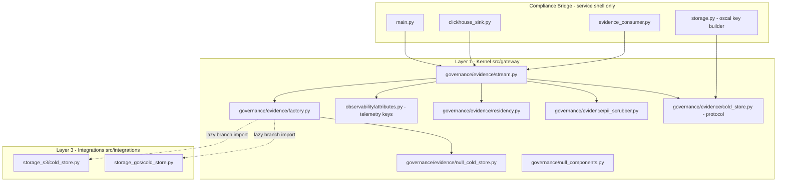
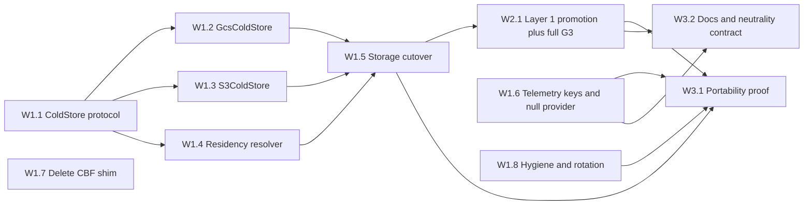

# Vendor Decoupling Implementation Plan

## 0. Reference Architecture Framing

CAGE is an **illustrative reference architecture**, not a deployed production
service. Per [`AGENTS.md`](../AGENTS.md) § *Core Principle: Clean Architecture
Over Operational Continuity & Backward Compatibility*, this plan optimises for
exactly one thing: **structural clarity**. Everything else is subordinate.

What that means concretely for this programme:

| Principle | Consequence for this plan |
|---|---|
| **Breaking changes are desirable** | Every rename, move, and deletion below is a clean break. Nothing is aliased, shimmed, or dual-read. A break that removes a design the project is moving away from is a *win*, recorded in §6 as an **architectural improvement**, not a cost. |
| **No deprecation window is owed** | Deprecated code is deleted in the same PR that supersedes it — never "marked deprecated" and never scheduled for a later wave. [`cage_finance/safety/cbf.py`](../src/cage_finance/safety/cbf.py) dies in Wave 1, not Wave 4. |
| **No migration paths** | There is no live instance whose data must be carried forward. Env vars are renamed outright with no fallback read of the old name. Config files are rewritten, not merged. |
| **Operational patterns are illustrative** | K8s manifests, Cloud Build configs, and Terraform modules are updated to match the new architecture because they are *documentation of the reference pattern*, not because a cluster depends on them. They never constrain a design choice. |
| **Structural clarity beats convenience** | Where a task could be done cheaply-but-coupled or expensively-but-clean, the plan always specifies clean. Layer inversion is severed in one cut, not phased. Gate G3 activates all rules in one PR, not incrementally. |

**Explicitly removed from this plan** (present in the prior revision, deleted as
operational noise): rollback analysis, revert-cost tables, gradual rollout,
compatibility modes, feature flags for legacy behaviour, "soft cutover"
sequencing, adoption-risk-weighted ordering, and deprecation-window language.
Execution order below is derived **purely from technical dependency**.

**Constraints that survive** — these are architectural or legal invariants, not
operational conveniences:

1. **Apache 2.0 license headers** on every new `.py` file (legal; CI `license-check`).
2. **Lazy vendor SDK imports** in Layer 3 adapters (architectural: the kernel must import and boot with no vendor package installed).
3. **The Three-Layer Architecture** (core design invariant; Gate G3 enforces).
4. **Wire-format stability** — object keys, NDJSON layout, the `cage-audit/3.0` record schema, hash-chain construction, and emitted OTel attribute keys are frozen. This is a *data-integrity and hash-chain-continuity* requirement (a changed attribute key silently breaks the evidence chain's own verifiability), **not** a backward-compatibility concession.
5. **Test coverage** — tests exist to prove the architecture holds, not to protect callers.

**Scope:** the eight vendor-decoupling recommendations from the architectural
analysis, restructured into three waves.
**Deliverable of this document:** task register, dependency graph, file-level
change inventory, architectural-improvement register, and testing requirements.
**Out of scope:** any code. This is a planning artifact only.

---

## Table of Contents

1. [Current-State Findings](#1-current-state-findings)
2. [Target Architecture](#2-target-architecture)
3. [Task Register](#3-task-register)
4. [Dependency Graph & Execution Waves](#4-dependency-graph--execution-waves)
5. [File-Level Change Inventory](#5-file-level-change-inventory)
6. [Architectural Improvements Register](#6-architectural-improvements-register)
7. [Testing Requirements](#7-testing-requirements)
8. [Compliance Artifact Obligations](#8-compliance-artifact-obligations)
9. [Definition of Done](#9-definition-of-done)

---

## 1. Current-State Findings

These are the concrete facts the plan is built on, verified against the tree.

| ID | Finding | Evidence |
|---|---|---|
| **F-1** | Cold-store writes are hardcoded to the GCS SDK inside the evidence sink. `_upload_to_gcs()` imports `google.cloud.storage` directly and has no S3 counterpart, while the *OSCAL* artifact path in [`storage.py`](../src/compliance_bridge/storage.py) already supports both `s3` and `gcs` via `STORAGE_BACKEND`. This is the asymmetry. | [`evidence_stream.py:1409-1443`](../src/compliance_bridge/evidence_stream.py:1409) vs [`storage.py:64-73`](../src/compliance_bridge/storage.py:64) |
| **F-2** | The residency guard is GCS-shaped: `get_region_bucket()` reads only `EVIDENCE_STREAM_GCS_BUCKET_{US,EU,APAC}` and asserts `us-`/`eu-`/`apac-` prefixes with a hardcoded if/elif ladder. No S3/MinIO/Azure naming, no endpoint or region cross-check. The `GCS` infix in the env-var name *is* the vendor leak. | [`storage.py:499-538`](../src/compliance_bridge/storage.py:499) |
| **F-3** | Layer inversion is real and load-bearing: Layer 1 kernel modules import Layer 3 bridge modules at four sites — [`routing_seal.py:481`](../src/gateway/governance/routing_seal.py:481), [`governance_middleware.py:602`](../src/gateway/server/governance_middleware.py:602), [`hybrid_server.py:148`](../src/gateway/server/hybrid_server.py:148), [`uca_logger.py:384`](../src/gateway/governance/uca_logger.py:384), plus [`langfuse_utils.py:33`](../src/gateway/observability/langfuse_utils.py:33) importing `compliance_bridge.types`. All are lazy/in-function except the last, which is module-scope. The laziness is a *concealment* of the inversion, not a mitigation of it. | grep `compliance_bridge` under `src/gateway/` |
| **F-4** | Gate G3 only scans `src/gateway/` for `cage_*`, `langfuse`, and (declared but **not implemented**) `governed_financial_advisor`. `LAYER_4_GFA_PATTERN` is defined at [line 45](../scripts/check_import_boundaries.py:45) but never used in `check_file_boundaries()`; the `# will be added in PR D` comment at [line 95](../scripts/check_import_boundaries.py:95) is stale — PR D shipped. There is no `compliance_bridge` rule and no vendor-SDK rule at all. | [`check_import_boundaries.py:41-108`](../scripts/check_import_boundaries.py:41) |
| **F-5** | ~113 `"langfuse.*"` OTel attribute string literals are scattered across 20+ modules in all four layers, including the kernel ([`symbolic_governor.py`](../src/gateway/governance/symbolic_governor.py), [`policy.py`](../src/gateway/core/policy.py), [`consensus/engine.py`](../src/gateway/governance/consensus/engine.py), [`nemo/manager.py`](../src/gateway/governance/nemo/manager.py)). Gate G3 blocks the *SDK* import but not the *vendor-namespaced attribute keys*, so the kernel is still semantically Langfuse-shaped. | grep `"langfuse\.` under `src/` |
| **F-6** | [`cage_finance/safety/cbf.py`](../src/cage_finance/safety/cbf.py) is a pure re-export shim (54 lines, zero logic) kept only so old test monkeypatch targets resolve. `AGENTS.md` already lists it as "Do Not Import". Roughly 8 test modules still patch through it. | [`cbf.py:15-53`](../src/cage_finance/safety/cbf.py:15), `AGENTS.md` canonical-namespace table |
| **F-7** | `laah-cybernetics` appears ~288 times. The great majority are in **non-source** artifacts (Terraform state backups, `.git` logs, historical measurement PROVENANCE files). The genuinely actionable set is small: [`.env`](../.env), [`litellm_config.yaml`](../litellm_config.yaml), [`README.md`](../README.md), [`docs/POAM.md`](../docs/POAM.md), [`infra/targets/gcp-gke/terraform.auto.tfvars`](../infra/targets/gcp-gke/terraform.auto.tfvars) and the `PROVENANCE_TEMPLATE`. Committed tfstate backups additionally contain a **plaintext HMAC secret** and `sk-lf-*` values. | grep `laah-cybernetics` |
| **F-8** | Null-object precedent already exists and is the right shape to copy: [`null_components.py`](../src/gateway/governance/null_components.py) defines `NullSafetyFilter` / `NullConsensusProvider` with explicit fail-closed semantics ("not no-ops: every method returns a denial verdict"). There is no `NullColdStore` or `NullTelemetryProvider`. | [`null_components.py:15-81`](../src/gateway/governance/null_components.py:15) |
| **F-9** | The optional-backend pattern to imitate is [`ClickHouseSink`](../src/compliance_bridge/clickhouse_sink.py): env-gated, lazy client, circuit breaker, bounded queue, never blocks the hot path, never raises. | [`clickhouse_sink.py:64-137`](../src/compliance_bridge/clickhouse_sink.py:64) |
| **F-10** | `_GCS_BUCKET` is resolved **at module import time** in a `try/except ValueError` at [`evidence_stream.py:478`](../src/compliance_bridge/evidence_stream.py:478). `storage.py` learned this lesson already (`M-21`: "deferred to first use, not at import time"). The new cold store resolves at first use, and the import-time resolution is deleted rather than kept alongside. | [`evidence_stream.py:476-482`](../src/compliance_bridge/evidence_stream.py:476), [`storage.py:64-73`](../src/compliance_bridge/storage.py:64) |

---

## 2. Target Architecture



The bridge becomes what its name claims: a **service shell**. It owns the FastAPI
app, the ClickHouse fan-out, the SSE feed, the Redis consumer loop, and an OSCAL
key-builder. It owns no governance logic and no storage implementation.

Four invariants the target must satisfy:

- **I-1 — No kernel→bridge edge.** `grep -r "compliance_bridge" src/gateway/` returns nothing, and Gate G3 enforces it statically.
- **I-2 — No vendor SDK named in Layer 1.** `google.cloud`, `boto3`, `botocore`, `azure`, and `langfuse` appear nowhere under `src/gateway/`, not even inside a function body. The kernel holds only the `EvidenceColdStore` protocol; concrete stores live in `src/integrations/`.
- **I-3 — One storage implementation.** Exactly one GCS upload path and one S3 upload path exist in the tree. A security fix to conditional-write semantics is applied once.
- **I-4 — Bare kernel boots offline.** With `CAGE_ACTIVE_PLUGINS=""`, `EVIDENCE_COLD_STORE=null`, and `CAGE_TELEMETRY_PROVIDER=null`, the kernel imports, starts, governs, and denies — with zero network egress and with neither `google-cloud-storage` nor `boto3` installed.

---

## 3. Task Register

Three waves. Task IDs carry a `W<wave>.<n>` label; the bracketed `[Tx.y]` tag
maps back to the original eight-recommendation numbering for traceability.

Complexity key: **Low** = single file, mechanical · **Medium** = multi-file, new
abstraction · **High** = cross-layer move, large blast radius.

**Every task in this plan is permitted to break callers.** Tasks that do are
marked **⚡ Clean break** with a pointer to their entry in
[§6 Architectural Improvements](#6-architectural-improvements-register).

---

### Wave 1 — Excise Vendor Names From the Seams

---

#### W1.1 — Define the `EvidenceColdStore` protocol (Layer 1) `[T1.1]`

**Complexity:** Medium · **Depends on:** — · **Blocks:** W1.2, W1.3, W1.4, W1.5

Create the vendor-neutral seam that all durable object writes — evidence
batches *and* OSCAL artifacts — go through. The protocol lives in the kernel;
it names no vendor and imports no SDK.

New file: `src/gateway/governance/evidence/cold_store.py`

Contract to specify (mirroring the `NormativeProvider` seam style already used
for vendor adapters):

- `EvidenceColdStore` — a runtime-checkable `typing.Protocol`:
  - `async put_batch(key: str, content: bytes, metadata: Mapping[str, str]) -> ColdStoreReceipt`
  - `async exists(key: str) -> bool`
  - `async put_if_absent(key: str, content: bytes, metadata: Mapping[str, str]) -> tuple[ColdStoreReceipt, bool]` — carries the conditional-write semantics currently expressed twice, by `_gcs_upload_if_not_exists` and `_s3_upload_if_not_exists`
  - `health() -> ColdStoreHealth`
  - `backend_id: str` property (`"gcs"`, `"s3"`, `"null"`) for telemetry and Lula assertions
- `ColdStoreReceipt` — frozen dataclass: `uri`, `key`, `content_sha256`, `backend_id`, `written_at`. **Not** a vendor object; `uri` is a plain string so `gs://`, `s3://`, and `null://` all fit.
- `ColdStoreHealth` — frozen dataclass: `available: bool`, `backend_id: str`, `detail: str`.
- `ColdStoreError` — the single exception type adapters may raise; wraps the vendor exception in `__cause__`. **Vendor exception types never cross the seam.**

Design rules the implementer must honour:

- **Zero vendor import, not even lazily.** Enforced by a test asserting the module's AST contains no `google`, `boto3`, `botocore`, or `azure` import node, and by the Gate G3 vendor-SDK rule (W2.1).
- **Bytes, not str.** The current GCS path passes `str` and re-encodes; standardise on `bytes` at the seam so the SHA-256 in the receipt is unambiguous.
- **Fail-closed is the caller's decision, not the store's.** Adapters raise `ColdStoreError`; the sink decides whether a cold-store failure is fatal (it is not — Redis Streams is the durable record — and that stays true).
- Apache 2.0 header required.

**Testing:** `tests/test_evidence_cold_store_protocol.py` — protocol conformance
shape, dataclass immutability, AST no-vendor-import assertion. Marked `unit`.

---

#### W1.2 — Implement `GcsColdStore` (Layer 3) `[T1.2]`

**Complexity:** Medium · **Depends on:** W1.1 · **Blocks:** W1.5

New files: `src/integrations/storage_gcs/__init__.py`, `cold_store.py`.

This adapter becomes the **only** GCS upload path in the tree. Port behaviour
out of [`evidence_stream.py:1409-1443`](../src/compliance_bridge/evidence_stream.py:1409)
*and* the GCS half of [`storage.py:200-284`](../src/compliance_bridge/storage.py:200),
reconciling the two into one implementation (invariant I-3).

- Lazy, thread-safe client construction using the **double-checked locking**
  pattern already in [`storage.py:87-115`](../src/compliance_bridge/storage.py:87).
  Copy it; do not re-invent it.
- `put_if_absent` uses `if_generation_match=0` and catches
  `google.api_core.exceptions.PreconditionFailed` — the atomic CAS GCS genuinely
  supports (preserves the HIGH-4 fix).
- CMEK: honour the encryption key as a **constructor argument**, not an env read
  inside the write path. Config resolution belongs to the factory.
- Missing SDK → `ColdStoreError` from the lazy getter with the existing
  actionable message. Import failure must not occur at module import.
- Timeouts read once at construction, not per call.

**Testing:** `tests/integrations/test_gcs_cold_store.py` — hermetic, mock
`google.cloud.storage`; assert `if_generation_match=0` is passed, assert
`PreconditionFailed` maps to `(receipt, created=False)`, assert missing-SDK
raises `ColdStoreError`. Registered in the shared parameterized conformance
suite (W1.5).

---

#### W1.3 — Implement `S3ColdStore` (Layer 3) `[T1.3]`

**Complexity:** Medium · **Depends on:** W1.1 · **Blocks:** W1.5

New files: `src/integrations/storage_s3/__init__.py`, `cold_store.py`.

The only S3 path in the tree. Port from [`storage.py:292-392`](../src/compliance_bridge/storage.py:292):

- boto3 client with path-style addressing, short connect/read timeouts,
  `retries={"max_attempts": 1}` — targets MinIO, AWS S3, Ceph, GCS-interop.
- `put_if_absent`: S3 has no universal atomic CAS. Two obligations:
  1. Prefer `IfNoneMatch: "*"` where the endpoint supports it (AWS S3 now does); fall back to HEAD+PUT.
  2. **Document the weaker guarantee** in the docstring and in the atomicity-honesty table of the contract doc (W3.2). The protocol must not imply an atomicity the backend cannot deliver — the honest comment at [`storage.py:340-350`](../src/compliance_bridge/storage.py:340) is carried forward verbatim.
- Credentials strictly from env/instance role. Never a hardcoded fallback.

**Testing:** `tests/integrations/test_s3_cold_store.py` — hermetic with `moto`
or a stub client; assert path-style addressing, 404→`created=True`,
200→`created=False`, non-404 `ClientError` surfaces as `ColdStoreError` rather
than being swallowed.

---

#### W1.4 — Replace the residency guard with a config-driven resolver `[T1.4]`

**Complexity:** Medium · **Depends on:** W1.1 · **Blocks:** W1.5
**⚡ Clean break — see [AW-2](#6-architectural-improvements-register)**

Delete [`get_region_bucket()`](../src/compliance_bridge/storage.py:499) and its
if/elif prefix ladder. Replace with a declarative, backend-agnostic resolver.

New file: `src/gateway/governance/evidence/residency.py`
New config: `config/compliance/residency.json`

- Move the region→bucket mapping and the naming rule **out of Python and into
  config**, per the `AGENTS.md` split rule ("numbers, thresholds, citations …
  live in `config/`"). Shape per region:
  ```
  US_FED:   { env_var: EVIDENCE_COLD_STORE_BUCKET_US,
              allowed_prefixes: ["us-", "cage-us-"],
              allowed_locations: ["us-central1", "us-east-1", ...] }
  ```
- **Rename `EVIDENCE_STREAM_GCS_BUCKET_*` → `EVIDENCE_COLD_STORE_BUCKET_*` with
  no alias and no fallback read of the old name.** The `GCS` infix is precisely
  the vendor leak being removed; preserving it as a fallback would preserve the
  leak in the one place adopters actually read — their config. Old names produce
  a hard startup failure, which is the correct and intended behaviour. Every
  manifest, tfvars file, and `.env.example` is updated in the same PR.
- Replace the prefix ladder with a table-driven check validating **prefix OR an
  explicit `allow_prefixes: false` opt-out** backed by `allowed_locations`
  matched against the backend's reported region — so adopters whose bucket
  naming cannot carry a region prefix still get a real residency assertion.
- **Fail-closed with no default.** Unknown region, unset bucket, or a bucket
  satisfying neither prefix nor location check raises. The `LOCAL` convenience
  default survives only for `CAGE_DEPLOYMENT_REGION=LOCAL`.
- Resolve **at first use, not import time** (F-10). Written that way from the
  start; the import-time `_GCS_BUCKET` block is deleted in W1.5.

**Testing:** `tests/test_evidence_residency.py` — parameterized over
`{US_FED, EU_ECB, APAC_MAS, LOCAL} × {gcs, s3, null}`; every misconfiguration
raises; an `s3://` MinIO bucket named `eu-evidence` passes under `EU_ECB` and
fails under `US_FED`. Runs under all three region-posture CI jobs.

---

#### W1.5 — Single storage cutover: sink, factory, OSCAL consolidation, null store `[T1.5 + T1.6 + T4.3a]`

**Complexity:** High · **Depends on:** W1.1, W1.2, W1.3, W1.4
**⚡ Clean break — see [AW-1](#6-architectural-improvements-register), [AW-3](#6-architectural-improvements-register), [AW-7](#6-architectural-improvements-register)**

**These were three separate tasks across two waves in the prior revision. They
are merged into one PR deliberately**: splitting them would leave the tree in an
intermediate state where two storage dispatchers coexist and `STORAGE_BACKEND`
and `EVIDENCE_COLD_STORE` both mean something. That intermediate state has no
value to anyone and is exactly the "second copy of the same upload logic"
condition the `AGENTS.md` decision test warns against. One cut.

**(a) Evidence sink → seam.**

- Delete `_upload_to_gcs()` outright.
- `EvidenceStreamSink.__init__` gains `cold_store: EvidenceColdStore | None = None`; when `None`, resolve via the factory.
- `_gcs_flush_loop` → `_cold_flush_loop`; log messages and metric labels become backend-neutral. The batch key `evidence-stream/YYYY/MM/DD/batch-<id>.ndjson` is already neutral and is **frozen** (wire-format constraint).
- Delete the import-time `_GCS_BUCKET` resolution at [`evidence_stream.py:478`](../src/compliance_bridge/evidence_stream.py:478).
- Emit `cage_evidence_cold_store_writes_total{backend,outcome}` and `cage_evidence_cold_store_available{backend}` so Lula can assert cold-store posture without naming a vendor. Use the existing `REGISTRY._names_to_collectors` idempotent-registration guard.

**(b) Factory.**

New file `src/gateway/governance/evidence/factory.py`. Selects on
`EVIDENCE_COLD_STORE` ∈ `{gcs, s3, null}`, **default `null`**. It is the *only*
site in the tree naming a concrete adapter class, and it imports them lazily
inside the selected branch. It also resolves CMEK keys, endpoints, and timeouts
and passes them as constructor arguments (W1.2/W1.3 forbid env reads in the
write path).

**(c) OSCAL consolidation — the second copy dies now.**

- Reduce [`storage.py`](../src/compliance_bridge/storage.py) to a thin OSCAL key-builder (`oscal-artifacts/<date>/<auditId>.yaml`, **key scheme frozen**) delegating all I/O to an injected `EvidenceColdStore`.
- Delete `_get_gcs_client`, `_get_s3_client`, `_gcs_upload*`, `_s3_upload*`, `_gcs_blob_exists`, `_s3_blob_exists`, `artifact_exists`, `upload_artifact`.
- Keep `put_oscal_artifact_atomic` as the public entry point, re-implemented over `put_if_absent`.
- **Collapse `STORAGE_BACKEND` into `EVIDENCE_COLD_STORE`.** `OSCAL_S3_ENDPOINT/BUCKET/REGION/ACCESS_KEY/SECRET_KEY/TIMEOUT` are deleted and folded into the `EVIDENCE_COLD_STORE_*` family. Two env-var families for one concept is a configuration-surface duplication, not just a code one.

**(d) `NullColdStore`.**

New file `src/gateway/governance/evidence/null_cold_store.py`, co-located with
the protocol. Semantics differ deliberately from `NullSafetyFilter` (F-8):

- The safety null is **fail-closed** (deny everything) because a missing safety filter is a governance hole.
- The cold-store null is **succeed-locally** — records to bounded memory (drop-oldest), returns a well-formed `ColdStoreReceipt` with a `null://` URI and a real SHA-256, reports `ColdStoreHealth(available=True, backend_id="null")`. Cold storage is best-effort by design; a denial here would wrongly break the flush loop.
- It must be **honest**: startup WARNING, and `cage_evidence_cold_store_available{backend="null"}` carries the distinct `null` label so an examiner sees that no off-cluster copy exists.
- `CAGE_ENV=prod` + `EVIDENCE_COLD_STORE=null` **fails startup** unless explicitly overridden, mirroring the `CAGE_ALLOW_NONBLOCKING_PROD` pattern at [`evidence_stream.py:521-526`](../src/compliance_bridge/evidence_stream.py:521).

**Sequencing note:** this lands before the Layer 1 promotion (W2.1) for a purely
technical reason — moving a file that still imports `google.cloud` into
`src/gateway/` would fail the vendor-SDK rule that W2.1 activates in the same
PR as the move. The file must be vendor-clean before it moves.

**Testing:**
- Parameterized conformance suite `tests/test_cold_store_conformance.py` over `{GcsColdStore, S3ColdStore, NullColdStore}` — every implementation satisfies the same contract, the pattern already used by `tests/test_normative_provider_conformance.py`.
- [`tests/test_evidence_stream.py`](../tests/test_evidence_stream.py) extended with a `FakeColdStore`: sink imports no vendor module; a `ColdStoreError` during flush is logged and the loop survives; `NullColdStore` opens no socket.
- Existing OSCAL storage tests must pass with **byte-identical object keys, metadata keys, and idempotency behaviour** while exercising the shared adapter.
- `tests/test_null_components.py` extended: prod+null fails startup; receipts well-formed.

---

#### W1.6 — Centralise telemetry attribute keys and add `NullTelemetryProvider` `[T3.1 + T4.3b]`

**Complexity:** Medium · **Depends on:** — (fully parallel with W1.1–W1.5)
**Blocks:** W3.1, W3.2 · **⚡ Clean break — see [AW-6](#6-architectural-improvements-register)**

~113 hand-typed `"langfuse.*"` literals (F-5) are a vendor namespace baked into
kernel source. Declare it once.

New file: `src/gateway/observability/attributes.py`

- Module-level `Final[str]` constants (not a dataclass — zero import cost on the hot path): `OBSERVATION_TYPE`, `OBSERVATION_NAME`, `OBSERVATION_INPUT`, `OBSERVATION_OUTPUT`, `OBSERVATION_MODEL_NAME`, `SESSION_ID`, `TRACE_TAGS`, plus the `trace.metadata.*` family used for ISO control stamping.
- A `metadata(key: str) -> str` helper for the dynamic case at [`opa_node_factory.py:134`](../src/gateway/governance/langgraph_harness/opa_node_factory.py:134), which f-strings attribute names today.
- The vendor prefix as a **single** constant driven by `CAGE_TELEMETRY_ATTR_NAMESPACE` (default `langfuse`), so an adopter on a different OTLP backend remaps in one place.
- Mechanical replacement across `src/gateway/`, `src/cage_finance/`, `src/cage_healthcare/`, `src/governed_financial_advisor/`, `src/integrations/`. Densest: [`symbolic_governor.py`](../src/gateway/governance/symbolic_governor.py) (~30), [`nemo/manager.py`](../src/gateway/governance/nemo/manager.py) (~28), [`core/policy.py`](../src/gateway/core/policy.py) (~12), [`consensus/engine.py`](../src/gateway/governance/consensus/engine.py) (~8).
- **Emitted wire values must not change.** Byte-identical attribute keys — this is the hash-chain/evidence-verifiability constraint from §0, not a compatibility concession.
- **New CI gate (G7):** fail on any raw `"langfuse.` string literal under `src/` outside `attributes.py`. Extend the existing domain-literal gate pattern ([`tests/test_domain_literal_gate.py`](../tests/test_domain_literal_gate.py), [`scripts/check_domain_literals.py`](../scripts/check_domain_literals.py)). Without the gate the literals grow back within a release.

**`NullTelemetryProvider`** — added alongside
[`BaseTelemetryProvider`](../src/gateway/governance/telemetry_provider.py:78).
The existing `MockTelemetryProvider` returns *synthetic numpy data*, which is a
different and more dangerous thing: it fabricates plausible telemetry so DoWhy
has something to fit. `NullTelemetryProvider` returns an **empty,
correctly-typed DataFrame** and lets the causal gatekeeper take its documented
insufficient-samples path. Fabricating data inside a "null" object is a
governance smell.

**Additionally: delete the silent mock fallback.** `LangfuseTelemetryProvider.from_env()`
currently degrades to `MockTelemetryProvider` when credentials are missing —
i.e. a misconfigured deployment silently governs on invented data. Replace with
explicit selection on `CAGE_TELEMETRY_PROVIDER` ∈ `{langfuse, null, mock}`;
missing credentials with `langfuse` selected is a hard error. `mock` must be
selected deliberately and is rejected when `CAGE_ENV=prod`.

**Testing:** `tests/test_telemetry_attributes.py` — a golden table asserting
each constant equals its **historical literal** (written from the current
literals, not from the constant names); namespace override changes the prefix;
the G7 gate catches a planted literal. `tests/test_null_components.py` — empty
typed frame, gatekeeper degrades gracefully, no silent mock fallback.

---

#### W1.7 — Delete the deprecated CBF shim `[T4.2]`

**Complexity:** Medium · **Depends on:** — (fully parallel)
**⚡ Clean break — see [AW-5](#6-architectural-improvements-register)**

**Moved from Wave 4 to Wave 1.** There is no reason to sequence a deletion
behind anything: nothing in `src/` imports it, `AGENTS.md` already brands it
"Do Not Import", and every day it survives is a day a contributor can write a
new import against it. Delete
[`src/cage_finance/safety/cbf.py`](../src/cage_finance/safety/cbf.py) — 54 lines
of re-export with zero logic (F-6).

Consumers to repoint (**all are tests**; no `src/` code imports it):

- [`tests/test_cbf_negative_paths.py`](../tests/test_cbf_negative_paths.py) (~8 patch sites)
- [`tests/test_cbf_chaos.py`](../tests/test_cbf_chaos.py) (~5)
- [`tests/test_fence_epoch.py`](../tests/test_fence_epoch.py) (~12, mix of `patch` and `import … as cbf_module`)
- [`tests/test_symbolic_governor_cbf_atomicity.py`](../tests/test_symbolic_governor_cbf_atomicity.py) (~4 `monkeypatch.setattr` by string path)
- [`tests/test_redis_failover_chaos.py`](../tests/test_redis_failover_chaos.py) (~4, includes `_WAIT_REPLICAS` / `_WAIT_TIMEOUT_MS`)
- [`tests/cage_finance/test_cbf_amount_validation.py`](../tests/cage_finance/test_cbf_amount_validation.py) (~2)

All become `src.gateway.governance.safety.cbf_engine`. The shim also re-exports
`asyncio` purely so tests can patch through it — do **not** reproduce that.
Tests patch the real symbol in `cbf_engine`; if a patch target does not exist
there, the test was patching an alias and is fixed, not accommodated.

Scrub doc references from [`COMPLIANCE.md`](../COMPLIANCE.md) (3 sites),
`docs/technical-report/*` (6 sites), [`docs/README.md`](../docs/README.md), and
the `AGENTS.md` canonical-namespace row — which is **deleted**, not changed to
"deprecated".

**Testing:** self-testing — any missed reference fails at collection with
`ModuleNotFoundError`. Add a guard test asserting the module does **not** exist,
so it cannot be reintroduced.

---

#### W1.8 — Project-ID hygiene and credential rotation `[T4.1]`

**Complexity:** Low · **Depends on:** — (fully parallel) · **Blocks:** W3.1

`laah-cybernetics` is a maintainer-specific GCP project name; `AGENTS.md`
documentation standards require "maintainer independence … devoid of
maintainer-specific internal cloud project names".

**Split into two PRs; the security one goes first and is not blocked by anything
in this plan.**

*PR A — credential exposure (expedite).* Committed tfstate backups
(`infra/targets/gcp-gke/*.tfstate*`, `errored.tfstate`) contain a **plaintext
HMAC secret** and `sk-lf-*` Langfuse values (F-7). Rotate the keys, remove the
files from tracking, confirm `.gitignore` coverage, and file the POAM entry
(§8). Never edit Terraform state (`AGENTS.md`).

*PR B — cosmetic sweep.* Scope discipline: of ~288 hits, only a minority are
touched.

| Category | Action |
|---|---|
| Committed templates: `.env.example`, `infra/targets/gcp-gke/terraform.tfvars.example`, [`litellm_config.yaml`](../litellm_config.yaml) | Replace with `${GOOGLE_CLOUD_PROJECT}` / `your-gcp-project`. Local gitignored `.env` and `terraform.auto.tfvars` are not tracked and are left alone. |
| Docs: [`README.md`](../README.md), [`docs/POAM.md`](../docs/POAM.md), [`docs/paper/measurements/PROVENANCE_TEMPLATE.md`](../docs/paper/measurements/PROVENANCE_TEMPLATE.md) | Genericise to `<your-project>` / `example-project`. |
| Historical provenance records (`docs/paper/measurements/2026-*/PROVENANCE.md`) | **Leave alone.** These are dated audit records of real measurement runs; rewriting them falsifies provenance. Redaction, if ever required, is its own commit with a stated rationale. |

**Testing:** new `scripts/check_project_id_hygiene.py` CI gate scanning tracked,
non-historical files for the literal project ID; wired into the `lint` job
alongside G3/G6/G7.

---

### Wave 2 — Sever the Layer Inversion in One Cut

---

#### W2.1 — Promote the evidence chain to Layer 1 and activate every Gate G3 rule `[T2.1 + T2.2]`

**Complexity:** High · **Depends on:** W1.5 · **Blocks:** W3.1, W3.2
**⚡ Clean break — see [AW-4](#6-architectural-improvements-register)**

**These were two sequential waves in the prior revision, separated so the gate
would not block the move. That separation exists only to protect the move from
its own consequences.** Merging them is strictly better: the gate is the
*definition* of the boundary the move establishes, and landing the boundary
without its enforcement leaves a window in which the inversion can silently
reappear. One PR moves the code and simultaneously makes the old shape
un-writable.

**(a) The move.** The kernel's routing seal, governance middleware, and server
startup all depend on the evidence chain (F-3). The chain is therefore kernel
code that happens to live in the bridge. The `AGENTS.md` three-layer split rule
confirms the destination: the chain holds Redis Lua scripts, KMS envelope
signing, hash-chain integrity, and fail-closed startup validation — all four are
named explicitly as Layer 1 markers.

Use `git mv` so history follows:

| From | To |
|---|---|
| [`src/compliance_bridge/evidence_stream.py`](../src/compliance_bridge/evidence_stream.py) | `src/gateway/governance/evidence/stream.py` |
| [`src/compliance_bridge/pii_scrubber.py`](../src/compliance_bridge/pii_scrubber.py) | `src/gateway/governance/evidence/pii_scrubber.py` |

`src/gateway/governance/evidence/__init__.py` re-exports the public surface:
`EvidenceStreamSink`, `EvidenceRecord`, `EvidenceCommitResult`,
`EvidenceChainUnavailableError`, `ConfigurationError`, `PIIScrubber`,
`ScrubbedPayload`, `get_evidence_sink`, `is_evidence_stream_enabled`,
`is_evidence_chain_blocking`, `validate_evidence_stream_preconditions`,
`verify_record`.

Call-site rewrites (12 sites, mechanical):

- Kernel consumers **delete their lazy cross-layer imports** and import directly at module scope: [`routing_seal.py:481`](../src/gateway/governance/routing_seal.py:481), [`governance_middleware.py:602`](../src/gateway/server/governance_middleware.py:602), [`hybrid_server.py:148`](../src/gateway/server/hybrid_server.py:148). The in-function import was a workaround for the inversion; with the inversion gone it is noise that hides the dependency from static analysis.
- Bridge consumers now import *up* into the kernel, which is the legal direction: [`main.py:182,233,1846,1860`](../src/compliance_bridge/main.py:182), [`evidence_consumer.py`](../src/compliance_bridge/evidence_consumer.py), [`clickhouse_sink.py`](../src/compliance_bridge/clickhouse_sink.py), [`sse_events.py:258`](../src/compliance_bridge/sse_events.py:258).
- **No re-export module is left at the old path.** `src/compliance_bridge/evidence_stream.py` ceases to exist. A shim here would recreate exactly the class of object W1.7 just deleted.

Two remaining kernel→bridge edges are resolved in this same PR — **neither gets
a gate exemption**:

1. **`uca_logger.py` → `compliance_bridge.storage.WORMStorage`** ([line 384](../src/gateway/governance/uca_logger.py:384)). Rewrite `uca_logger` to write through the `EvidenceColdStore` seam. It is a kernel component performing durable writes; the seam is precisely what it should use, and routing it through the bridge was always the wrong shape.
2. **`langfuse_utils.py` → `compliance_bridge.types.get_iso_control_map`** ([line 33](../src/gateway/observability/langfuse_utils.py:33)) — a *module-scope* violation. The ISO control map is config data, not bridge logic: move it into the existing `src/gateway/governance/iso_control.py` or to `config/oscal/`.

**(b) Gate G3 — all rules on, one PR.** Harden
[`scripts/check_import_boundaries.py`](../scripts/check_import_boundaries.py).
Four changes, activated together; there is no reason to stage the activation of
a static check whose violations are all fixed in the same commit.

1. **Bridge rule.** New `LAYER_3_BRIDGE_PATTERN = ^(src\.)?compliance_bridge` — Layer 1 must not import it (invariant I-1).
2. **Layer 4 rule — activate the dormant pattern.** `LAYER_4_GFA_PATTERN` is defined at [line 45](../scripts/check_import_boundaries.py:45) and never evaluated. Wire it into `check_file_boundaries()` and delete the stale `# will be added in PR D` comment at [line 95](../scripts/check_import_boundaries.py:95). If activation surfaces existing violations, **fix them in this PR** — a declared-but-unenforced rule is worse than no rule, because it reads as coverage that does not exist.
3. **Vendor-SDK rule for Layer 1.** Extend beyond `langfuse` to `google.cloud`, `boto3`, `botocore`, `azure` (invariant I-2). This is what makes W1.1's "no vendor import, not even lazily" enforceable rather than aspirational.
4. **Structural fixes.** The gate uses `if LAYER_1_GATEWAY in filepath_str`, a substring test that misfires on any path containing `src/gateway` as a component; switch to `Path.is_relative_to`. Report violations grouped by rule with the offending line number (the AST node carries `lineno`; it is currently discarded).

Deliberately **not** added: a `src/integrations/` → `src/gateway/` restriction.
Adapters legitimately import kernel protocols and dataclasses; that edge is
downward and correct.

**Testing:**
- ~14 test modules reference `src.compliance_bridge.evidence_stream` or `.pii_scrubber` (see [§5.5](#55-test-files-requiring-changes)). Every patch target is repointed. A stale `patch("src.compliance_bridge.evidence_stream...")` raises `ModuleNotFoundError` at patch time — the loud failure is the point, and is only possible because no shim exists.
- New `tests/test_evidence_layer_placement.py`: kernel modules import successfully with `sys.modules["src.compliance_bridge"] = None`.
- New `tests/test_import_boundaries.py`: table-driven over synthetic fixture files in `tmp_path`, one positive case per rule asserting exit code 1 and the expected message, plus a negative case proving `src/integrations/storage_gcs/` importing `google.cloud` is **allowed**.

---

### Wave 3 — Prove and Document the Result

---

#### W3.1 — Bare-kernel offline portability proof `[T4.4]`

**Complexity:** Medium · **Depends on:** W1.5, W1.6, W1.8, W2.1 · **Blocks:** —

The recommendations ask for a *portability proof*, not merely the components
that make one possible. This task is the acceptance test for the whole
programme.

New test: `tests/test_bare_kernel_portability.py`, marked `unit` and `local`.

Assertions:

1. With `CAGE_ACTIVE_PLUGINS=""`, `EVIDENCE_COLD_STORE=null`, `CAGE_TELEMETRY_PROVIDER=null`, `EVIDENCE_STREAM_ENABLED=false`, the kernel package imports and a `SymbolicGovernor` constructs.
2. A governance call returns an explicit DENY — the bare kernel denies by intent (the G2 property already asserted by `null_components.py`).
3. **No vendor module is resident**: after import, `google.cloud`, `boto3`, `langfuse`, and `clickhouse_connect` are absent from `sys.modules`. This is the strongest available in-process check that lazy imports really are lazy.
4. **No socket is opened** during the above, via a monkeypatched `socket.socket` guard.
5. `src/compliance_bridge` is absent from `sys.modules` — invariant I-1 at runtime, complementing G3's static check.

**Required, not optional:** a CI job `bare-kernel-smoke` that installs **only**
the core dependency group — no `google-cloud-storage`, no `boto3`, no
`clickhouse-connect` — and runs this file. Source-level greps prove nothing
about packaging; this job proves the lazy-import discipline against the
dependency metadata. It requires an optional-extras split in
[`pyproject.toml`](../pyproject.toml) (`[project.optional-dependencies]` →
`gcs`, `s3`, `clickhouse`), itself a structural improvement: the current flat
dependency list asserts that the kernel needs a GCS SDK, which is now false.

---

#### W3.2 — Documentation reconciliation and the neutrality contract `[T2.3 + T3.2]`

**Complexity:** Low · **Depends on:** W1.5, W1.6, W2.1 · **Blocks:** —

Merged: both tasks describe the same post-refactor architecture to the same
audience, and splitting them guarantees one of them lands stale.

**(a) `AGENTS.md`** — the contract agents read on every task; a stale row there
propagates errors indefinitely.

- Canonical-namespace table: add rows for evidence stream, PII scrubber, cold store, factory, residency resolver, and telemetry attribute keys. The `cage_finance/safety/cbf.py` and `compliance_bridge/evidence_stream.py` rows are **removed**, not relabelled — the paths no longer exist, so "Do Not Import" is the wrong statement about them.
- Three-Layer table: the evidence chain is Layer 1; cold-store adapters are Layer 3; the compliance bridge is a service shell holding no governance logic.
- CI-failure diagnosis list: `import-boundary-check` gains the bridge, Layer 4, and vendor-SDK rule classes; add the new G7 telemetry-literal gate and the project-ID hygiene gate.

**(b) New file `docs/architecture/VENDOR_NEUTRALITY_CONTRACT.md`**, carrying the
mandatory "Reference Architecture Note", covering:

*OTLP neutrality*
- CAGE emits OTel spans over OTLP; Langfuse is *one* consumer, self-hosted per region for sovereignty. Link `AGENTS.md` for why LangSmith is transitively present and never used; do not duplicate.
- The attribute-namespace contract from W1.6: which keys are OTel semantic convention (`gen_ai.*`), which are CAGE-owned (`cage.*`, `governance.*`, `iso42001.*`), which are vendor-namespaced (`langfuse.*`, remappable via one constant).
- What an adopter changes to target Grafana Tempo / Honeycomb / Jaeger: endpoint env vars, the namespace constant, nothing else.

*Cold-store contract*
- The `EvidenceColdStore` method contract and error model; `ColdStoreError` is the only exception that crosses the seam.
- **Atomicity honesty table** — per backend, whether `put_if_absent` is truly atomic (GCS: yes, generation precondition; S3: conditional-write where the endpoint supports it, else last-writer-wins; Null: trivially yes). Adopters must be told which guarantee they are buying.
- Residency rules and the `config/compliance/residency.json` schema.
- Flush-path latency budget and the explicit statement that cold-store failure is non-fatal because Redis Streams is the durable record.

**(c) Downstream docs**

- [`docs/architecture/CLICKHOUSE_EVIDENCE_SINK.md`](../docs/architecture/CLICKHOUSE_EVIDENCE_SINK.md) — the "Source of Truth" line points at the old path.
- [`docs/architecture/AUDIT_LOG_SCHEMA.md`](../docs/architecture/AUDIT_LOG_SCHEMA.md) — module paths.
- [`docs/technical-report/03-TECHNOLOGY-STACK.md`](../docs/technical-report/03-TECHNOLOGY-STACK.md) and [`08-DEPLOYMENT-INFRASTRUCTURE.md`](../docs/technical-report/08-DEPLOYMENT-INFRASTRUCTURE.md) — reference the contract rather than describing GCS as *the* storage layer.
- [`docs/BREAKING_CHANGES_v3.md`](../docs/BREAKING_CHANGES_v3.md) and `CHANGELOG.md` — record AW-1 … AW-8 (§6).

---

## 4. Dependency Graph & Execution Waves



### Waves

| Wave | Tasks | Parallelism | Rationale |
|---|---|---|---|
| **W1 — Excise vendor names from the seams** | W1.1 → (W1.2 ∥ W1.3 ∥ W1.4) → W1.5; W1.6 ∥ W1.7 ∥ W1.8 throughout | W1.1 alone, then three concurrent adapter/resolver PRs, then the cutover. W1.6/W1.7/W1.8 touch disjoint files and run start-to-finish in parallel. | W1.1 is the blocking definition. W1.5 is where the tree stops having two storage implementations. W1.7 (shim deletion) and W1.8 (hygiene) have zero dependencies and are pulled all the way forward — deferring a deletion buys nothing and lets new callers accrete. |
| **W2 — Sever the layer inversion** | W2.1 | Single PR | The move and its enforcing gate land together. |
| **W3 — Prove and document** | W3.1 ∥ W3.2 | Two concurrent PRs | W3.1 is the programme's acceptance test; W3.2 makes the result legible. Neither blocks the other. |

**Critical path:** W1.1 → W1.2/W1.3/W1.4 → W1.5 → W2.1 → W3.1.

Everything off that path (W1.6, W1.7, W1.8, W3.2) is genuinely concurrent.

**The only hard ordering constraint** is W1.5 before W2.1, and it is technical,
not risk-management: `evidence_stream.py` must be vendor-clean before it moves
into `src/gateway/`, because W2.1 activates the Gate G3 vendor-SDK rule in the
same PR as the move. Reversing the order would force either a gate exemption or
a same-PR emergency refactor.

**Wave count reduced from five to three.** The eliminated boundaries were:
- *Old W0 (independent tasks)* — folded into W1 as concurrent lanes; a wave whose members block nothing is not a wave.
- *Old W2/W3 split (cutover, then layer move)* — the OSCAL consolidation was in a wave of its own purely to keep the "risky" sink rewire small. Risk isolation has no value here; the merged W1.5 is the only state in which one storage implementation exists.
- *Old W3/W4 split (move, then gate)* — merged into W2.1, see the rationale there.

### Branch / PR decomposition

| PR | Branch | Contents | Squash-merge title |
|---|---|---|---|
| 1 | `fix/credential-exposure-tfstate` | W1.8 PR A | `fix(security): rotate exposed hmac and langfuse keys` |
| 2 | `chore/project-id-hygiene` | W1.8 PR B | `chore(docs): remove maintainer project ids from templates` |
| 3 | `refactor/delete-cbf-shim` | W1.7 | `refactor(governance)!: delete deprecated cbf compatibility shim` |
| 4 | `refactor/telemetry-attr-keys` | W1.6 | `refactor(governance)!: centralise telemetry attribute keys` |
| 5 | `feat/evidence-cold-store-protocol` | W1.1 | `feat(governance): add evidence cold store protocol seam` |
| 6 | `feat/gcs-cold-store` | W1.2 | `feat(governance): add gcs cold store adapter` |
| 7 | `feat/s3-cold-store` | W1.3 | `feat(governance): add s3 cold store adapter` |
| 8 | `refactor/residency-resolver` | W1.4 | `refactor(compliance)!: make residency resolver backend agnostic` |
| 9 | `refactor/storage-cutover` | W1.5 | `refactor(governance)!: unify all cold storage behind one seam` |
| 10 | `refactor/evidence-to-layer1` | W2.1 | `refactor(governance)!: promote evidence chain into kernel` |
| 11 | `test/bare-kernel-portability` | W3.1 | `test(governance): prove bare kernel runs fully offline` |
| 12 | `docs/vendor-neutrality-contract` | W3.2 | `docs(architecture): document otlp and cold store neutrality` |

Twelve PRs, down from fifteen. All merges are **squash merges** per `AGENTS.md`;
PRs 3, 4, 8, 9, 10 carry `!` and require a `BREAKING CHANGE:` footer.

**Two composition rules, both structural rather than operational:**

1. **A rename lands with every file that reads the old name.** Env-var renames (W1.4, W1.5) include their `deployment/k8s/*.tpl`, `infra/modules/*`, `.env.example`, and Lula assertion updates in the same PR — not to keep a cluster running, but because a tree in which the code and its own manifests disagree is not a coherent reference architecture.
2. **A deletion lands with its call-site fixes.** No PR merges leaving a dangling reference; `ModuleNotFoundError` at collection is the enforcement mechanism.

---

## 5. File-Level Change Inventory

### 5.1 New files

| Path | Task | Layer | Notes |
|---|---|---|---|
| `src/gateway/governance/evidence/__init__.py` | W2.1 | 1 | Public re-export surface |
| `src/gateway/governance/evidence/cold_store.py` | W1.1 | 1 | Protocol + dataclasses + `ColdStoreError` |
| `src/gateway/governance/evidence/factory.py` | W1.5 | 1 | Only site naming concrete adapters |
| `src/gateway/governance/evidence/null_cold_store.py` | W1.5 | 1 | Succeed-locally null object |
| `src/gateway/governance/evidence/residency.py` | W1.4 | 1 | Config-driven residency resolver |
| `src/gateway/observability/attributes.py` | W1.6 | 1 | Telemetry attribute key constants |
| `src/integrations/storage_gcs/__init__.py` + `cold_store.py` | W1.2 | 3 | Lazy `google-cloud-storage`; only GCS path in tree |
| `src/integrations/storage_s3/__init__.py` + `cold_store.py` | W1.3 | 3 | Lazy `boto3`; only S3 path in tree |
| `config/compliance/residency.json` | W1.4 | config | Region → bucket / prefix / location table |
| `scripts/check_project_id_hygiene.py` | W1.8 | tooling | New lint gate |
| `docs/architecture/VENDOR_NEUTRALITY_CONTRACT.md` | W3.2 | docs | OTLP + cold-store contract |

All new `.py` files require the Apache 2.0 header (CI `license-check`).

### 5.2 Moved files

| From | To | Task |
|---|---|---|
| [`src/compliance_bridge/evidence_stream.py`](../src/compliance_bridge/evidence_stream.py) | `src/gateway/governance/evidence/stream.py` | W2.1 |
| [`src/compliance_bridge/pii_scrubber.py`](../src/compliance_bridge/pii_scrubber.py) | `src/gateway/governance/evidence/pii_scrubber.py` | W2.1 |

Both via `git mv`. **No module is left behind at either origin path.**

### 5.3 Deleted files and symbols

| Path / symbol | Task | Justification |
|---|---|---|
| [`src/cage_finance/safety/cbf.py`](../src/cage_finance/safety/cbf.py) (whole file) | W1.7 | Pure re-export shim; `AGENTS.md` already forbids importing it |
| `_upload_to_gcs()`, `_GCS_BUCKET` import-time block, `_gcs_flush_loop` in the evidence sink | W1.5 | Superseded by the seam |
| `_get_gcs_client`, `_get_s3_client`, `_gcs_upload*`, `_s3_upload*`, `_gcs_blob_exists`, `_s3_blob_exists`, `artifact_exists`, `upload_artifact` in [`storage.py`](../src/compliance_bridge/storage.py) | W1.5 | Second copy of the upload logic (I-3) |
| `get_region_bucket()` in [`storage.py`](../src/compliance_bridge/storage.py) | W1.4 | Replaced by the config-driven resolver |
| `MockTelemetryProvider` silent fallback in `from_env()` | W1.6 | Governance on fabricated data must never be implicit |
| `# will be added in PR D` comment, [`check_import_boundaries.py:95`](../scripts/check_import_boundaries.py:95) | W2.1 | Stale; PR D shipped |
| `AGENTS.md` canonical-namespace rows for the two deleted paths | W1.7, W3.2 | The paths no longer exist |

**No compatibility shim, alias, or re-export is created for any deletion or
move anywhere in this plan.**

### 5.4 Modified source files

| Path | Task(s) | Nature of change |
|---|---|---|
| [`src/compliance_bridge/storage.py`](../src/compliance_bridge/storage.py) | W1.4, W1.5 | Reduced to an OSCAL key-builder over the seam; residency and all vendor I/O removed |
| [`src/compliance_bridge/main.py`](../src/compliance_bridge/main.py) | W2.1 | Import paths (4 sites: lines 182, 233, 1846, 1860) |
| [`src/compliance_bridge/evidence_consumer.py`](../src/compliance_bridge/evidence_consumer.py) | W2.1 | Import paths; Redis config comment |
| [`src/compliance_bridge/clickhouse_sink.py`](../src/compliance_bridge/clickhouse_sink.py) | W2.1 | "Source of Truth" docstring path |
| [`src/compliance_bridge/sse_events.py`](../src/compliance_bridge/sse_events.py) | W2.1 | Sink type reference |
| [`src/gateway/governance/routing_seal.py`](../src/gateway/governance/routing_seal.py) | W2.1 | Lazy bridge import deleted → module-scope kernel import |
| [`src/gateway/server/governance_middleware.py`](../src/gateway/server/governance_middleware.py) | W1.6, W2.1 | Attribute constants; lazy bridge import deleted |
| [`src/gateway/server/hybrid_server.py`](../src/gateway/server/hybrid_server.py) | W2.1 | Startup precondition import |
| [`src/gateway/governance/uca_logger.py`](../src/gateway/governance/uca_logger.py) | W2.1 | `WORMStorage` → `EvidenceColdStore` seam |
| [`src/gateway/observability/langfuse_utils.py`](../src/gateway/observability/langfuse_utils.py) | W1.6, W2.1 | Module-scope bridge import removed; ISO control map relocated; constants |
| [`src/gateway/governance/iso_control.py`](../src/gateway/governance/iso_control.py) | W2.1 | Receives `get_iso_control_map` |
| [`src/gateway/governance/symbolic_governor.py`](../src/gateway/governance/symbolic_governor.py) | W1.6 | ~30 attribute literals |
| [`src/gateway/governance/nemo/manager.py`](../src/gateway/governance/nemo/manager.py) | W1.6 | ~28 attribute literals |
| [`src/gateway/core/policy.py`](../src/gateway/core/policy.py) | W1.6 | ~12 attribute literals |
| [`src/gateway/governance/consensus/engine.py`](../src/gateway/governance/consensus/engine.py) | W1.6 | ~8 attribute literals |
| [`src/gateway/governance/telemetry_provider.py`](../src/gateway/governance/telemetry_provider.py) | W1.6 | `NullTelemetryProvider`; explicit `CAGE_TELEMETRY_PROVIDER` selection; fallback deleted |
| [`src/gateway/governance/null_components.py`](../src/gateway/governance/null_components.py) | W1.5, W1.6 | Docstring documents the two new nulls and their differing semantics |
| [`src/gateway/governance/hitl_escalator.py`](../src/gateway/governance/hitl_escalator.py), [`nemo/actions.py`](../src/gateway/governance/nemo/actions.py), [`langgraph_harness/*.py`](../src/gateway/governance/langgraph_harness/), [`infrastructure/telemetry_client.py`](../src/gateway/infrastructure/telemetry_client.py), [`infrastructure/mcp_client.py`](../src/gateway/infrastructure/mcp_client.py), [`infrastructure/telemetry/nemo_exporter.py`](../src/gateway/infrastructure/telemetry/nemo_exporter.py), [`observability/mcp_tracing.py`](../src/gateway/observability/mcp_tracing.py), [`server/mcp_tool_server.py`](../src/gateway/server/mcp_tool_server.py) | W1.6 | Remaining attribute literals |
| `src/governed_financial_advisor/**`, `src/cage_healthcare/rails/actions.py` | W1.6 | Attribute literals in Layers 2/4 |
| [`scripts/check_import_boundaries.py`](../scripts/check_import_boundaries.py) | W2.1 | Bridge rule, Layer 4 activation, vendor-SDK rule, `is_relative_to`, lineno reporting |
| [`scripts/check_domain_literals.py`](../scripts/check_domain_literals.py) | W1.6 | G7 telemetry-literal gate (or a sibling script following the same pattern) |
| [`pyproject.toml`](../pyproject.toml) | W3.1 | Optional-dependency extras `gcs` / `s3` / `clickhouse`; vendor SDKs leave the core group |

### 5.5 Test files requiring changes

**Evidence-path repointing (W2.1)** — 14 modules:
[`test_evidence_stream.py`](../tests/test_evidence_stream.py),
[`test_evidence_chain_v3.py`](../tests/test_evidence_chain_v3.py),
[`test_evidence_chain_blocking.py`](../tests/test_evidence_chain_blocking.py),
[`test_evidence_stream_preconditions.py`](../tests/test_evidence_stream_preconditions.py),
[`test_multi_writer_safety.py`](../tests/test_multi_writer_safety.py),
[`test_chain_restoration.py`](../tests/test_chain_restoration.py),
[`test_pii_scrubbing.py`](../tests/test_pii_scrubbing.py),
[`test_trace_correlation.py`](../tests/test_trace_correlation.py),
[`test_kernel_event_ingest.py`](../tests/test_kernel_event_ingest.py),
[`test_governance_middleware.py`](../tests/test_governance_middleware.py),
[`test_evidence_consumer.py`](../tests/test_evidence_consumer.py),
[`test_compliance_metrics_from_evidence.py`](../tests/test_compliance_metrics_from_evidence.py),
[`test_redis_eviction_envelope.py`](../tests/test_redis_eviction_envelope.py),
[`test_prometheus_metrics.py`](../tests/test_prometheus_metrics.py).

**CBF shim repointing (W1.7)** — 6 modules:
[`test_cbf_negative_paths.py`](../tests/test_cbf_negative_paths.py),
[`test_cbf_chaos.py`](../tests/test_cbf_chaos.py),
[`test_fence_epoch.py`](../tests/test_fence_epoch.py),
[`test_symbolic_governor_cbf_atomicity.py`](../tests/test_symbolic_governor_cbf_atomicity.py),
[`test_redis_failover_chaos.py`](../tests/test_redis_failover_chaos.py),
[`tests/cage_finance/test_cbf_amount_validation.py`](../tests/cage_finance/test_cbf_amount_validation.py).

**New test modules:** `test_evidence_cold_store_protocol.py`,
`tests/integrations/test_gcs_cold_store.py`,
`tests/integrations/test_s3_cold_store.py`, `test_cold_store_conformance.py`,
`test_evidence_residency.py`, `test_telemetry_attributes.py`,
`test_import_boundaries.py`, `test_evidence_layer_placement.py`,
`test_bare_kernel_portability.py`, plus a `cbf` non-existence guard test.

### 5.6 Deployment / infra / compliance files

These are updated because they are part of the reference pattern and must not
contradict the code — not because a deployment depends on them.

| Path | Task | Change |
|---|---|---|
| `deployment/k8s/compliance-bridge-deployment.yaml.tpl` | W1.4, W1.5 | `EVIDENCE_STREAM_GCS_BUCKET*` → `EVIDENCE_COLD_STORE_BUCKET*`; add `EVIDENCE_COLD_STORE`; drop `STORAGE_BACKEND` and `OSCAL_S3_*` |
| `deployment/k8s/gateway-deployment.yaml.tpl` | W1.5, W2.1 | Gateway now owns the evidence chain: same env additions |
| `deployment/k8s/reconciliation-worker.yaml` | W1.5 | `OSCAL_S3_*` removed |
| `infra/modules/**` | W1.4, W1.5 | Terraform variable renames; `terraform plan` before any apply |
| `.env.example`, `infra/targets/gcp-gke/terraform.tfvars.example` | W1.4, W1.5, W1.8 | New env-var names; genericised project IDs |
| [`compliance/lula/`](../compliance/lula/) | W1.4, W1.5 | Assertions reading `EVIDENCE_STREAM_GCS_BUCKET*` / `STORAGE_BACKEND` repointed; new backend-neutral cold-store posture assertion |
| [`compliance/oscal/`](../compliance/oscal/) | W1.5, W2.1, W1.7 | Source references for SC-4, SI-7, AU-9, AU-10 and the CBF citations |
| [`.github/workflows/ci.yml`](../.github/workflows/ci.yml) | W1.6, W1.8, W2.1, W3.1 | G7 literal gate, project-ID gate, extended G3, `bare-kernel-smoke` job |

---

## 6. Architectural Improvements Register

Each entry below is a deliberate break. It is listed here because it **removes a
design the project is moving away from** — the break is the deliverable, not a
side effect to be managed. Every entry is recorded in
[`docs/BREAKING_CHANGES_v3.md`](../docs/BREAKING_CHANGES_v3.md) and `CHANGELOG.md`
before its PR merges, and **none receives a shim, alias, deprecation window, or
fallback read**.

| ID | Task | What is removed | Why the removal is the improvement | How the old shape fails |
|---|---|---|---|---|
| **AW-1** | W1.5 | Implicit GCS activation. Cold storage now requires `EVIDENCE_COLD_STORE` ∈ `{gcs, s3, null}`, default `null`. | Backend selection becomes an explicit, single-valued architectural decision instead of an emergent property of which bucket env var happens to be set. Implicit activation meant the deployed topology could not be read off the config. | Unset → `null` backend, startup WARNING, and `cage_evidence_cold_store_available{backend="null"}` visible to any examiner. |
| **AW-2** | W1.4 | `EVIDENCE_STREAM_GCS_BUCKET{,_US,_EU,_APAC}` and the hardcoded prefix ladder. Replaced by `EVIDENCE_COLD_STORE_BUCKET*` and `config/compliance/residency.json`. **No alias is read.** | The `GCS` infix is the vendor leak in the one artefact every adopter edits. Keeping it as a fallback would preserve the leak exactly where it does the most damage while claiming the seam is neutral. Residency policy also moves from Python to config, per the `AGENTS.md` split rule. | Old names are simply unset → the fail-closed resolver raises at first use. Loud, immediate, unambiguous. |
| **AW-3** | W1.5 | `STORAGE_BACKEND`, `OSCAL_S3_ENDPOINT/BUCKET/REGION/ACCESS_KEY/SECRET_KEY/TIMEOUT`, and the entire second GCS/S3 dispatcher in `storage.py` including public `artifact_exists()` / `upload_artifact()`. | Satisfies invariant I-3: one GCS path, one S3 path, one env-var family. The `AGENTS.md` decision test — *"would a security fix have to be applied twice?"* — answered yes before and no after. A conditional-write bug is now fixable in one place. | Removed functions are gone from the module surface; callers use `put_oscal_artifact_atomic()` or the cold store directly. |
| **AW-4** | W2.1 | `src.compliance_bridge.evidence_stream`, `src.compliance_bridge.pii_scrubber`, the four lazy kernel→bridge imports, and the `langfuse_utils` module-scope bridge import. | Satisfies invariant I-1 and makes the Three-Layer Architecture true rather than aspirational. The lazy imports were *concealment* of an inversion, not mitigation — they hid the illegal edge from static analysis while preserving it at runtime. Gate G3 now makes the old shape unwritable. | `ModuleNotFoundError` at import or patch time. Because no shim exists, a stale `mock.patch` string path fails loudly instead of silently binding to a re-export. |
| **AW-5** | W1.7 | `src.cage_finance.safety.cbf` (entire module). | Removes a file the project's own standards document forbids importing. A forbidden shim is the worst available state: it grants the old callers no legitimacy, denies the new architecture its cleanliness, and lets fresh violations accrete. | `ModuleNotFoundError` at collection. A guard test asserts it cannot come back. |
| **AW-6** | W1.6 | Raw `"langfuse.*"` string literals anywhere under `src/` outside `attributes.py`, enforced by new CI gate G7. | The kernel stops being semantically Langfuse-shaped. The vendor namespace is declared exactly once and remapped by one constant, which is what makes the OTLP-neutrality claim in the contract doc true rather than rhetorical. Emitted keys stay byte-identical (wire-format constraint). | CI gate failure naming file and line. Affects contributors only; no runtime consumer sees a change. |
| **AW-7** | W1.5 | Silent tolerance of `CAGE_ENV=prod` + `EVIDENCE_COLD_STORE=null`. | A production-posture deployment holding no off-cluster evidence copy is a posture gap the architecture should refuse to express by accident. Requiring an explicit override converts a silent condition into a declared one. | Startup failure unless the documented override is set. |
| **AW-8** | W1.6 | `LangfuseTelemetryProvider.from_env()`'s silent fallback to `MockTelemetryProvider` when credentials are absent. | The causal gatekeeper could govern on **fabricated numpy data** as a consequence of a missing env var. Provider selection becomes explicit via `CAGE_TELEMETRY_PROVIDER`; `mock` must be chosen deliberately and is rejected under `CAGE_ENV=prod`. This is the highest-value break in the plan. | Missing credentials with `langfuse` selected is a hard error instead of a silent downgrade. |

**Not breaking:** W1.8 (templates, docs, and a security rotation — no API
surface), W3.1 (new test and CI job), W3.2 (documentation).

---

## 7. Testing Requirements

Tests here exist to **prove the architecture holds**, not to protect callers.
Three are load-bearing architectural assertions in their own right: the AST
no-vendor-import check (W1.1), the cold-store conformance suite (W1.5), and the
bare-kernel portability proof (W3.1).

### 7.1 Per-task obligations

| Task | New / changed tests | Markers | Key assertion |
|---|---|---|---|
| W1.1 | `test_evidence_cold_store_protocol.py` | `unit` | AST of `cold_store.py` contains no vendor import node |
| W1.2 | `tests/integrations/test_gcs_cold_store.py` | `unit` | `if_generation_match=0` passed; `PreconditionFailed` → `created=False`; missing SDK → `ColdStoreError` |
| W1.3 | `tests/integrations/test_s3_cold_store.py` | `unit` | Path-style addressing; non-404 `ClientError` surfaces as `ColdStoreError`; the *documented weaker* atomicity is asserted, so no future contributor can quietly promote S3 to "atomic" |
| W1.4 | `test_evidence_residency.py` | `unit`, `us_fed`, `eu_ecb`, `apac_mas` | Every misconfiguration raises; no silent default outside `LOCAL`; resolution at first use, not import |
| W1.5 | `test_cold_store_conformance.py` (parameterized over all three implementations), `test_evidence_stream.py` (extended), existing OSCAL storage tests, `test_null_components.py` (extended) | `unit`, `local` | One contract, three backends; flush failure non-fatal; sink imports no vendor module; OSCAL key / metadata / idempotency byte-identical; prod+null fails startup |
| W1.6 | `test_telemetry_attributes.py`, `test_null_components.py` | `unit` | Golden table: every constant equals its historical literal; G7 catches a planted literal; `NullTelemetryProvider` returns an empty typed frame; no silent mock fallback remains |
| W1.7 | Guard test | `unit` | `src.cage_finance.safety.cbf` is not importable |
| W1.8 | `check_project_id_hygiene.py` gate | CI | No maintainer project ID in tracked, non-historical files |
| W2.1 | 14 modules repointed, `test_evidence_layer_placement.py`, `test_import_boundaries.py` | `unit`, `local` | Kernel imports with `sys.modules["src.compliance_bridge"] = None`; one positive case per G3 rule; negative case proving `src/integrations/` may import vendor SDKs |
| W3.1 | `test_bare_kernel_portability.py` + `bare-kernel-smoke` CI job | `unit`, `local` | No vendor module in `sys.modules`; no socket opened; DENY verdict; passes with vendor SDKs *not installed* |

### 7.2 Commands

Fast local loop, per `AGENTS.md`:

```bash
make test-fast
# equivalently
uv run pytest tests/ -m "local or unit" -n auto --dist loadscope --no-cov \
  -p no:langsmith -p no:langsmith_plugin --tb=short
```

Before each merge:

```bash
uv run python scripts/check_import_boundaries.py --verbose
uv run python scripts/check_project_id_hygiene.py
uv run ruff check . && uv run ruff format --check .
uv run mypy src/
uv run bandit -r src/ -c pyproject.toml -ll
make test-coverage        # --cov-fail-under=75
```

Region postures — mandatory for W1.4, W1.5, W2.1:

```bash
CAGE_DEPLOYMENT_REGION=US_FED   uv run pytest tests/ -m us_fed -v
CAGE_DEPLOYMENT_REGION=EU_ECB   uv run pytest tests/ -m eu_ecb -v
CAGE_DEPLOYMENT_REGION=APAC_MAS uv run pytest tests/ -m apac_mas -v
```

**Port-forward hazard.** W1.4, W1.5, and W2.1 all touch Redis-backed evidence
state. Per `AGENTS.md`, confirm no `kubectl port-forward` tunnels are live
before running local/unit tests, or the suite reads live GKE epochs and cache
keys:

```bash
ps aux | grep port-forward   # expect none
pkill -f "kubectl port-forward"
```

Integration validation after W1.5 and again after W2.1:

```bash
bash scripts/port_forward_dev.sh
source .env && export CAGE_ENV=dev LANGFUSE_POSTURE_DRY_RUN=true
uv run pytest tests/ --run-integration -v --tb=short
```

Baseline for comparison: **2553 passed, 51 skipped, 1 failed** (~9m25s). Any
*new* failure in the evidence, seal, or Lula-metrics families is a regression
from this programme. Run `./scripts/staging_lifecycle.sh` once after W2.1, since
W1.4 changes region-posture behaviour that all 31 Lula gates observe.

### 7.3 Failure modes the tests must specifically catch

1. **Silent telemetry-key drift (W1.6).** A typo in one constant changes an emitted attribute key and breaks the evidence chain's own correlation without failing any behavioural test. The golden table is the only defence, and it must be transcribed from the *current literals*, never derived from constant names.
2. **Import-time → first-use shift (W1.4/W1.5).** Deleting the module-scope `_GCS_BUCKET` resolution moves residency errors from import to first flush. Assert that import now succeeds and a bad region raises at first use.
3. **Patch-target rot (W1.7, W2.1).** `mock.patch` with a string path fails loudly on a missing module but *silently succeeds* against a stale re-export. This is the precise reason no shim may be left behind anywhere in this plan.
4. **Metric double-registration (W1.5).** New cold-store metrics must use the existing `REGISTRY._names_to_collectors` idempotent guard, or `importlib.reload` in tests raises.
5. **Conformance-suite drift (W1.5).** Any backend added later must be registered in `test_cold_store_conformance.py`. An unregistered adapter is an unenforced contract — the same failure mode as the dormant `LAYER_4_GFA_PATTERN` (F-4).

---

## 8. Compliance Artifact Obligations

`AGENTS.md` imposes hard obligations that several of these tasks trigger.

| Trigger | Task(s) | Obligation | When |
|---|---|---|---|
| Credential exposure discovered | W1.8 PR A | POAM entry in [`docs/POAM.md`](../docs/POAM.md) for the plaintext HMAC secret and `sk-lf-*` values in committed tfstate backups: rotation, commit SHA, Lula result, closure date | Immediately — outranks the rest of the programme |
| Control implementations move (SC-4, SI-7, AU-9, AU-10 all cite the evidence chain path) | W1.5, W2.1 | OSCAL component update in [`compliance/oscal/`](../compliance/oscal/); `system-security-plan.yaml` and the component definition both cite `src/compliance_bridge/evidence_stream.py` | Within 2 business days of merge |
| K8s env/resource references change | W1.4, W1.5 | Lula validation update in [`compliance/lula/`](../compliance/lula/) **in the same PR** — assertions read env-var names on the bridge and gateway deployments | Same PR |
| Residency enforcement generalised | W1.4 | Re-verify all 31 Lula gates under each region posture; the US_FED/EU_ECB/APAC_MAS bucket-prefix assertions become prefix-or-location assertions | Before merge |
| Kernel module inventory changes | W1.7, W2.1 | Refresh OSCAL `implemented-requirements` source references; [`COMPLIANCE.md`](../COMPLIANCE.md) cites `cage_finance/safety/cbf.py` in 3 places | Within 2 business days |
| No STPA source touched | — | `scripts/check_stpa_freshness.py` stays green; run it after W2.1 regardless | Per PR |
| NeMo action file touched (attributes only) | W1.6 | `make update-nemo-configmap`; confirm no diff | Per PR |

OSCAL coverage has a CI-enforced threshold. If the moves drop it, regenerate via
`src/gateway/governance/oscal_ssp_exporter.py`.

---

## 9. Definition of Done

The programme is complete when all of the following hold simultaneously.

**Structural invariants**

- [ ] `grep -rn "compliance_bridge" src/gateway/` returns nothing, and Gate G3 enforces it (I-1).
- [ ] `grep -rn "google\.cloud\|boto3\|botocore\|azure\|langfuse" src/gateway/` returns nothing, and Gate G3 enforces it (I-2).
- [ ] Exactly one GCS upload implementation and one S3 upload implementation exist in the tree (I-3).
- [ ] `grep -rn '"langfuse\.' src/ --include=*.py` matches only `src/gateway/observability/attributes.py`, and gate G7 enforces it.
- [ ] `EvidenceColdStore` has exactly three conforming implementations, all exercised by the single parameterized conformance suite.
- [ ] The compliance bridge contains no governance logic and no storage implementation — only the FastAPI shell, ClickHouse fan-out, SSE feed, Redis consumer, and OSCAL key-builder.

**Deletions are real**

- [ ] `src/cage_finance/safety/cbf.py` does not exist; no reference remains in `src/`, `tests/`, or `docs/`; the guard test prevents reintroduction.
- [ ] `src/compliance_bridge/evidence_stream.py` and `pii_scrubber.py` do not exist, and no re-export module stands at either path.
- [ ] `STORAGE_BACKEND`, `OSCAL_S3_*`, and `EVIDENCE_STREAM_GCS_BUCKET*` appear nowhere in `src/`, `deployment/`, `infra/`, `compliance/`, or `.env.example`.
- [ ] No shim, alias, compatibility mode, or legacy-behaviour feature flag was introduced anywhere in the programme.

**Proof**

- [ ] `tests/test_bare_kernel_portability.py` passes in the `bare-kernel-smoke` CI job with neither `google-cloud-storage` nor `boto3` installed (I-4).
- [ ] All 31 Lula gates pass under `US_FED`, `EU_ECB`, and `APAC_MAS`.
- [ ] Full integration suite against GKE dev shows no new failures versus the 2553/51/1 baseline.
- [ ] Emitted OTel attribute keys, evidence object keys, the OSCAL key scheme, the NDJSON layout, and the `cage-audit/3.0` record schema are byte-identical to before.

**Legibility**

- [ ] AW-1 … AW-8 documented in [`docs/BREAKING_CHANGES_v3.md`](../docs/BREAKING_CHANGES_v3.md) and `CHANGELOG.md`.
- [ ] `AGENTS.md` canonical-namespace table lists every new path and contains no row for a path that no longer exists.
- [ ] `docs/architecture/VENDOR_NEUTRALITY_CONTRACT.md` exists, carries the Reference Architecture Note, and includes the per-backend atomicity honesty table.
- [ ] OSCAL component definitions and Lula validations updated per [§8](#8-compliance-artifact-obligations).
- [ ] The credential-exposure POAM entry is filed and the affected keys rotated.
