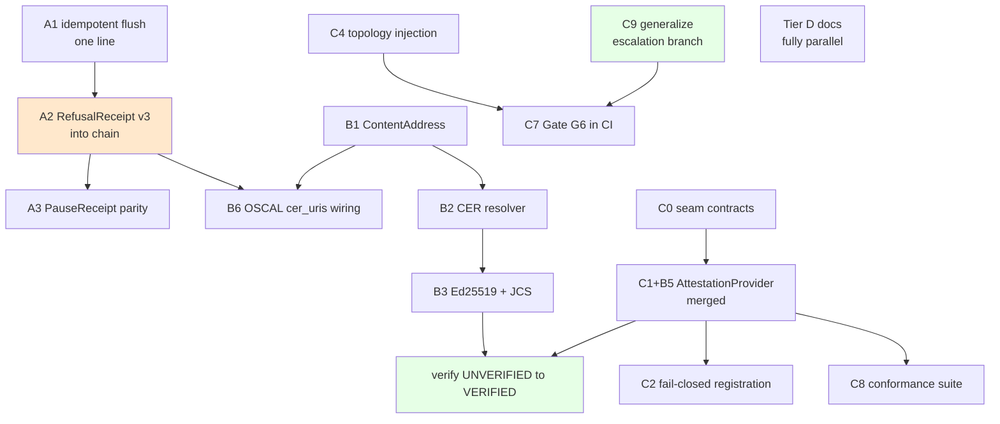

# Consolidated Implementation Plan — 2026-09-09

> **Reference Architecture Note.** CAGE is an illustrative reference architecture,
> not a deployed service. Every item optimizes for **structural clarity over
> operational continuity**. Breaking changes are acceptable and often desirable.

**Synthesizes four documents produced or revised today:**

| Source | Contributes |
|---|---|
| [`provider_02_cer_unblocked_work.md`](provider_02_cer_unblocked_work.md) | CER read path, Phases 0–5 |
| [`post_sep9_blocker_reconciliation.md`](post_sep9_blocker_reconciliation.md) | Evidence-chain gaps, blocker correction |
| [`layer_inversion_remediation_plan.md`](layer_inversion_remediation_plan.md) | Partner adapter layer inversions, Phases 0–12 |
| [`docs/meetings/nexart_sep9_prep.md`](../docs/meetings/nexart_sep9_prep.md) | Bundle shape decision, adapter domain leakage |
| [`cage_internal_blockers_implementation_plan.md`](cage_internal_blockers_implementation_plan.md) | `provider_04` → `actuator_01` retirement (added rev 2) |
| [`docs/meetings/luis_actuator_01_response.md`](../docs/meetings/luis_actuator_01_response.md) | Confirms the actuator re-scope is partner-approved (added rev 2) |

---

> **Revision 2 — 2026-09-09 (later).** X1 resolved; Tier D (documentation) added;
> `provider_04` mystery closed. Execution detail now lives in
> [`engineering_execution_brief_2026-09-09.md`](engineering_execution_brief_2026-09-09.md);
> this document remains the cross-plan reconciliation and priority ranking.

## 0. Headline findings from the synthesis

Reading the documents against each other surfaced five things that none of them
contains individually.

### 0.1 Two plans specify the same change, differently

**CER Phase 3** and **Layer-Inversion Phase 4** both make
`Provider02AttestationProvider` implement the `AttestationProvider` ABC. They
disagree on sequencing and on the status value:

| | CER Phase 3 | Layer-Inversion Phase 4 |
|---|---|---|
| Prerequisite | After Phase 2b (real Ed25519) | None — do it now |
| Initial status | `VERIFIED` | `UNVERIFIED` |
| Rationale | Don't normalize `UNVERIFIED` | Fix the broken contract immediately |

Executing both produces a merge conflict in the same class. **Resolution in §3.**

### 0.2 The evidence-chain gap outranks everything in both plans

Gap #6 — DENY events never reaching the tamper-evident chain — is more serious
than any item in either adapter plan, and it appears in neither. It is the same
defect class as the `_verify_local()` fail-open already fixed: **the system
implies a completeness it does not deliver.**

### 0.3 Only one genuine external blocker existed — and it is now closed

Not the NexArt CER work; that was always unblocked. The real blocker was the
**unanswered vendor anonymization question**. It has since been resolved in
favour of standardizing on real vendor names, which **shrinks** Layer-Inversion
Phases 1–3 rather than releasing them as written. See §5.1.

### 0.4 `provider_04` is `actuator_01` — a rename, not a gap

Investigating the adapter READMEs surfaced an apparent missing package.
`provider_04` was not deleted; it was **re-scoped into `actuator_01`** — same
vendor (Archytan), same JCS reference vectors, renamed URN namespace. Retirement
is complete in code and **partner-approved**. What remains is documentation drift
in three files. Detail in
[`engineering_execution_brief_2026-09-09.md`](engineering_execution_brief_2026-09-09.md) §0.3a.

### 0.5 A whole category of work was missing: documentation

The original synthesis covered code only. Two documentation defects are worth
tracking as work items rather than leaving to chance:

- `actuator_01` has **eight modules and no README** — the least documented and
  most security-relevant integration in the tree (mTLS, multi-sig quorum,
  KMS-signed envelopes).
- Partner-facing vendor communications cite classes that **no longer exist**,
  detectable today only by manual cross-referencing.

These become **Tier D**. They block nothing and can absorb spare capacity while
Wave 1 is in review.

---

## 1. Implementable now — no external dependency

Everything in this section can start today.

### Tier A — Evidence chain integrity (highest priority)

| ID | Task | Source | Notes |
|---|---|---|---|
| **A1** | `put_batch()` → `put_if_absent()` in `_cold_flush_loop()` | Gap #3 | One line. [`stream.py:1219`](../src/gateway/governance/evidence/stream.py:1219). Both GCS and S3 already implement it atomically. |
| **A2** | Ingest full `RefusalReceipt` v3 into the evidence stream | Gap #6 | The structural fix. See §2. |
| **A3** | `PauseReceipt` stream emission | Gap #7 | Shares A2's serialization path — same PR. |
| **A4** | Prod-enforce `EVIDENCE_STREAM_KMS_SIGN` | Gap #4 | Add a clause to [`validate_evidence_stream_preconditions()`](../src/gateway/governance/evidence/stream.py:425). |

### Tier B — CER read path (vendor contract fully specified)

| ID | Task | Phase | Notes |
|---|---|---|---|
| ~~B0~~ | ~~Fail-closed verification~~ | 0 | ✅ **DONE** — `fix/provider-02-verify-failclosed` |
| **B1** | `ContentAddress` kernel primitive + digest agility | 1 | Gates B2 and B4. |
| **B2** | `Provider02CERResolver` — exact-hash GET, `If-None-Match`/304 | 2 | Contract fully specified by the captured CER. |
| **B3** | Real Ed25519 verification + certificate-hash recomputation | 2b | Was blocked; the live CER settled it. |
| **B4** | JCS cross-implementation fixture test | 2b | Same PR as B3. |
| **B5** | `AttestationProvider` seam → `external_attestations[]` | 3 | **Merged with C1 — see §3.** |
| **B6** | `CERIndex` + wire `cer_uris` so OSCAL links are emitted | 4 | **Sequence after A2** — see §2.3. |
| **B7** | Fix the `cer-hash` prop `rsplit` bug | 4 | Wrong for any answer to D1a. |
| **B8** | Document `PROVIDER_02_*` in `.env.example` | 5 | Independent; land any time. |

### Tier C — Layer inversion

| ID | Task | Phase | Notes |
|---|---|---|---|
| **C0** | Extract seam contracts (`seams/*.py`) | LI-0 | Resolves a latent circular import. Gates C1. |
| **C1** | Fix `provider_02` seam contract | LI-4 | **Merged with B5 — see §3.** |
| **C2** | Fail-closed aggregator registration (`isinstance` at `register()`) | LI-5 | Mirrors `ActuatorRegistry`. Small, self-contained. |
| **C3** | Attestation failure attributability | LI-5b | Audit-integrity relevant. |
| **C4** | Inject graph topology into `provider_02` | LI-6 | The domain-leakage defect from the NexArt brief. See §4. |
| **C5** | Abstraction and dependency injection | LI-7 | |
| **C6** | Relocate `ConsequenceToken` minting | LI-8 | Security-relevant. |
| **C7** | Close CI enforcement gaps; wire Gate G6 | LI-9 | Prevents C4-class regressions. |
| **C8** | Extend the conformance suite | LI-10 | Depends on C1. |
| **C9** | **Generalize the escalation branch** | LI-2 | **Unblocked by the X1 resolution.** The real I1 fix — see §5.1. Carries the `FLOWSIGNAL_ESCALATION` → `EXTERNAL_HOLD` enum rename. |

### Tier D — Documentation (parallel, blocks nothing)

| ID | Task | Notes |
|---|---|---|
| **D1** | Partner branding in adapter READMEs | Follow the [`provider_05`](../src/integrations/provider_05/README.md:8) convention: real vendor name in prose, anonymized package path. Covers `provider_01/02/03/06`. |
| **D2** | **Create `actuator_01/README.md`** | Eight modules, no README. Cover the `ExecutionActuator` protocol, the four declared capabilities, the KMS requirement in `health_check()`, and a "formerly `provider_04`" note. |
| **D3** | Fix stale integration inventories | [`README.md:210`](../README.md:210) still lists `provider_04/` and omits `actuator_01`, `storage_gcs`, `storage_s3`. |
| **D4** | Refresh `refactoring_vendor_communications.md` §68 | Re-scope to `actuator_01`; drop the non-existent `Provider04EnvelopeMapper`; delete the anonymization question (already answered by the `X-Archytan-Signatures` wire contract). |
| **D5** | *Optional:* citation-freshness gate | Assert every class/module path cited in vendor communications resolves in the tree. Mirrors the existing `stpa-freshness-check` pattern. Addresses the defect class, not the instance. |

---

## 2. The structural fix — A2 in detail

### 2.1 What is wrong

[`_emit_refusal_receipt()`](../src/gateway/server/governance_middleware.py:541)
builds a seven-field summary dict — `action_id`, `refusal_reason`,
`oscal_control_ref`, `kms_signature`, `receipt_id`, `timestamp_utc`, `type` — and
ingests *that*.

The v3 `RefusalReceipt` with `tier_failures` and the five-part proof chain is
constructed at five sites in `symbolic_governor.py` and attached to
`GovernanceError(receipt=receipt)`. It never reaches the stream. `proof_hash`
appears only as OTel span attributes (lines 1827, 2067, 2511, 2566, 2672).

### 2.2 Why it is the top priority

**Only ALLOW decisions are guaranteed to enter the tamper-evident chain.**

For a governance engine, refusals are the primary evidence — proof the system
intervened. An auditor reconstructing behaviour from the chain sees permitted
actions and must trust CAGE's unsigned word on the blocks.

This is precisely the failure identified in §5 of the NexArt brief — signed facts,
unsigned story — occurring inside CAGE's own evidence layer while we argue the
same point to a partner. Fixing the external case and not the internal one is
indefensible.

### 2.3 Ordering constraint

**A2 must land before B6.** OSCAL `link[rel="evidence"]` entries are only as good
as the chain behind them. Emitting evidence citations while DENY events are absent
produces references to an incomplete record — worse than emitting none, because it
looks complete.

### 2.4 Approach

`GovernanceError` already carries `receipt=receipt`. Have `_emit_refusal_receipt()`
serialize the real object rather than rebuild a lossy summary. Preferred over
touching five construction sites: one serialization path, one place to keep
correct.

---

## 3. Resolving the B5 / C1 collision

Both plans rewrite the same class. Recommended resolution:

**Do it once, at Layer-Inversion Phase 4 timing (now), with `UNVERIFIED` initially.**

Reasoning:

1. The contract is **broken today** — [`normative_provider.py:940`](../src/gateway/governance/normative_provider.py:940)
   returns `provider_02` as a `NormativeProvider` behind `# type: ignore`, and any
   caller treating it as one raises `AttributeError`. That is a live defect; it
   should not wait on Ed25519 work.
2. `UNVERIFIED` is **honest** — after Phase 0, `_inspect_local()` genuinely does
   not check signatures. Emitting `UNVERIFIED` states a true fact.
3. The CER plan's concern — that shipping permanently-`UNVERIFIED` entries trains
   people to ignore the distinction — is real but addressed differently: B3 lands
   shortly after, and the transition `UNVERIFIED → VERIFIED` becomes a visible,
   testable event rather than a status that silently appears correct.

**Assertion to carry:** a test that fails when B3 lands if the status does *not*
become `VERIFIED`. That converts the CER plan's worry into an enforced invariant
instead of a sequencing constraint.

Update both source plans to point at the merged item.

---

## 4. C4 and the bundle-shape dependency

The NexArt brief identified that
[`adapter.py`](../src/integrations/provider_02/adapter.py:98) hardcodes Layer 4
demo node names — `_ATTESTATION_NODES`, `_GRAPH_PARENTS`,
`_classify_terminal_path()` branching on `"governed_trader"`. The adapter works
for exactly one application; any other adopter gets an empty bundle, silently.

Gate G3 cannot catch this: it scans for illegal *imports*, and this is Layer 3
holding Layer 4 *string literals*. Hence C7 (Gate G6 wiring) matters — the class
of defect, not just the instance.

**Note:** [`refactoring_vendor_communications.md`](refactoring_vendor_communications.md)
already told Provider 02 topology injection is coming. C4 is **the implementation
of a commitment already made**, not a new proposal.

C4 is *not* blocked by the bundle-shape question (§5 of the brief). Topology
injection is orthogonal to whether bundles are per-node, workflow-typed or
composite. Do C4 now; the bundle-shape work is separate and follows the vendor's
answer.

---

## 5. Genuinely blocked — external dependency

Only two items across all four documents. Both are narrow.

| ID | Item | Blocked on | Mitigation in place |
|---|---|---|---|
| ~~**X1**~~ | ~~Layer-Inversion Phases 1–3~~ | ~~Partner answer on anonymization~~ | ✅ **RESOLVED 2026-09-09 — standardize on real vendor names.** Scope consequence in §5.1. |
| **X2** | Final private-CER disclosure policy (CER B3) | Joint decision with NexArt | Implemented behind an enum. Whatever is agreed becomes a mapping change, not a redesign. |

### 5.1 X1 resolved — and it *shrinks* the work rather than releasing it

The decision to **standardize on real vendor names** removes the anonymization
driver behind Layer-Inversion Phases 1–3. The consequence is counter-intuitive and
must not be misread as "now execute the rename":

| Phase | Original intent | Post-decision |
|---|---|---|
| **LI-1** De-brand kernel vocabulary | Rename `FLOWSIGNAL_*` repo-wide | **Largely dropped.** Vendor names may stay in kernel identifiers. |
| **LI-2** Generalize the escalation branch | Delete the vendor-shaped branch | **UNCHANGED — still required.** The actual I1 fix. |
| **LI-3** Rename Redis namespace / env var | `flowsignal:token:*` → neutral | **Largely dropped.** |

Phases 1–3 were never primarily about naming. The structural defect is that
[`enforce_fria_boundary()`](../src/gateway/governance/normative_provider.py:548)
gives one vendor a privileged code path — special-casing `FLOWSIGNAL_HOLD` with a
hardcoded 300s TTL — while `provider_06`'s `REVIEW` takes the generic
`needs_human_review` path. **Renaming the symbol does not fix that; deleting the
branch does.**

**One rename survives, for a different reason.**
`DeferReason.FLOWSIGNAL_ESCALATION` → `EXTERNAL_HOLD`, scoped to the enum member
and the finding-code contract. Not for anonymity — because after LI-2 multiple
providers reach that state, so a vendor-specific name becomes *factually wrong*.

**Now out of scope entirely:** the vocabulary mapping table, the AARM re-alignment
exercise, the ~133 test-reference sweep, and all Lula/OSCAL/POAM naming updates.
`aarm_vector="AARM-V8"` was always staying — a CSA specification identifier, not a
vendor name.

**Net effect:** LI-2 is unblocked and starts immediately; the expensive
compliance-artifact work evaporated. Execution detail in
[`engineering_execution_brief_2026-09-09.md`](engineering_execution_brief_2026-09-09.md) §0.

### What is *not* blocked, despite appearances

- **CER read path.** Fully specified by the captured live CER. The three questions
  I expected to ask were answered by the artifact itself.
- **OSCAL CER wiring.** The reconciliation document showed the "Sep 9 blocker" was
  mis-scoped in three ways — wrong exporter, wrong provider, and a strategy
  already decided. The real gap is that [`main.py:825`](../src/compliance_bridge/main.py:825)
  never passes `cer_uris`.
- **Bundle shape.** A decision to *make*, not a blocker. The recommended path —
  per-boundary receipts chained via `parentCertificateHashes[]` — needs no vendor
  schema change, since a parent hash is opaque snapshot data.

---

## 6. Prioritized execution order

Ranked by **severity of the untruth each item removes**, then by dependency.

### Wave 1 — correctness of the audit chain

1. **A1** — idempotent flush. One line, zero design, immediate.
2. **A2 + A3** — DENY and PAUSE receipts into the tamper-evident chain.
3. **A4** — prod precondition for per-record KMS signing.

Rationale: these three are the only items where CAGE currently *misrepresents its
own behaviour*. Everything else is incomplete rather than incorrect.

### Wave 2 — contract correctness (parallel with Wave 1)

4. **C0** — extract seam contracts; unblocks C1 and fixes a latent circular import.
5. **C1 + B5** (merged) — make `provider_02` satisfy `AttestationProvider`,
   emitting `UNVERIFIED`. Removes a live `AttributeError` path.
6. **C2** — fail-closed aggregator registration.
7. **C9** — generalize the escalation branch (LI-2), carrying the
   `FLOWSIGNAL_ESCALATION` → `EXTERNAL_HOLD` enum rename. Unblocked by X1.
   **Emitter and kernel must change in the same commit** or the escalation path
   silently fails open into the generic branch.

### Wave 3 — CER read path

8. **B1** — `ContentAddress` + digest agility.
9. **B2** — resolver.
10. **B3 + B4** — real Ed25519 verification and the JCS fixture. **Assert the
    `UNVERIFIED → VERIFIED` transition here.**

### Wave 4 — reachability and hardening

11. **B6 + B7** — OSCAL `cer_uris` wiring. *Gated on A2.*
12. **C4** — topology injection (honours the partner commitment).
13. **C7** — Gate G6 into CI so C4's defect class cannot regress.
14. **C3, C5, C6** — attributability, DI, `ConsequenceToken` relocation.
15. **C8** — conformance suite extension.
16. **B8** — env documentation.

### Tier D — any time, no ordering

**D1–D4** are documentation-only and block nothing. Suitable filler while Wave 1
is in review. **D5** (citation-freshness gate) is optional but addresses the
defect class that hid the `provider_04` drift for an unknown period.

### Held

- ~~**X1**~~ — **RESOLVED.** C9 (LI-2) moves into Wave 2; LI-1 and LI-3 are
  largely dropped. See §5.1.
- **X2** — CER disclosure policy. Enum seam absorbs whatever is decided. **This is
  now the only open external dependency in the entire roadmap.**

---

## 7. ~~Actions to unblock X1~~ — CLOSED 2026-09-09

Resolved by the decision to standardize on real vendor names. **None of the
actions this section previously listed is now required** — in particular the AARM
re-alignment is *not* to be performed, since the vector IDs were never vendor
names.

**What replaced it:** C9 (LI-2) enters Wave 2 directly, carrying a narrowly
scoped enum rename. LI-1 and LI-3 are largely dropped. The vocabulary mapping
table, the ~133 test-reference sweep, and every Lula/OSCAL/POAM naming update are
cancelled outright.

---

## 8. Corrections to fold back into source documents

| Document | Correction | Status |
|---|---|---|
| `telemetry_pipeline_analysis.md` | Remove the "Sep 9 blocker" framing; fix exporter reference (`compliance_bridge/oscal_exporter.py`); fix provider reference (`provider_02`, not `provider_06`); restate the OSCAL gap as *"`cer_uris` never passed"*; promote Gap #6 to highest priority. | ⬜ outstanding |
| `provider_02_cer_unblocked_work.md` | Phase 3 merges with Layer-Inversion Phase 4; initial status `UNVERIFIED`, with a test asserting promotion to `VERIFIED` when 2b lands. | ✅ applied |
| `layer_inversion_remediation_plan.md` | Phase 4 absorbs CER Phase 3; §3.1 hold lifted with the scope reduction recorded. | ✅ applied |
| `post_sep9_blocker_reconciliation.md` | Add the A2 → B6 ordering constraint and cross-reference this document. | ⬜ outstanding |
| `README.md:210` | Layer 3 table lists `provider_04/`; omits `actuator_01`, `storage_gcs`, `storage_s3`. | ⬜ **D3** |
| `refactoring_vendor_communications.md` §68 | Re-scope to `actuator_01`; drop `Provider04EnvelopeMapper`; delete the moot anonymization question. | ⬜ **D4** |

---

## 9. Current state at a glance

| | Count |
|---|---|
| Complete | 1 (CER Phase 0 — fail-closed verification) |
| Implementable now | 25 across Tiers A–D |
| Blocked externally | **1** (X2 — CER disclosure policy, mitigated behind an enum) |

**Start with A1.** It is one line, needs no design discussion, and removes
duplicate writes from a hash-chained store.

**The item that matters most is A2** — until DENY events enter the tamper-evident
chain, the audit record systematically over-represents permitted actions, and
every downstream evidence citation inherits that gap.
