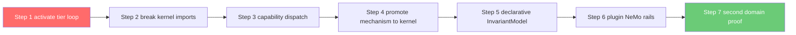

# Domain Pipeline Reusability Analysis — `src/cage_finance`

> **Reference Architecture Note (per [`AGENTS.md`](../AGENTS.md)).**
> CAGE is a deployable reference architecture. This document is an
> **architectural assessment** of how the finance domain package relates to the
> domain-agnostic kernel, and an illustrative multi-domain onboarding pattern
> an adopter would apply. It prescribes no immediate code changes; it is input
> to the CAGE Layered Refactoring plan and a companion to
> [`plugin_seam_orthogonality_analysis.md`](plugin_seam_orthogonality_analysis.md).

**Question.** Should the `src/cage_finance` pipeline be duplicated per domain
(`src/cage_industry`, `src/cage_healthcare`), or refactored into a single
reusable `src/governance_pipeline/`?

**Answer in one line.** **Neither.** The reusable pipeline *already exists* — it
is [`src/gateway/`](../src/gateway/). `cage_finance` is not a pipeline; it is a
**capability plugin** that supplies domain semantics to that pipeline. The
correct action is to **finish the extraction that is already ~70% complete**,
then add `cage_<domain>` siblings as thin plugins.

---

## Table of Contents

1. [Current State](#1-current-state)
2. [What Is Already Generic](#2-what-is-already-generic)
3. [What Is Genuinely Finance-Specific](#3-what-is-genuinely-finance-specific)
4. [Residual Coupling Defects](#4-residual-coupling-defects)
5. [Options Considered](#5-options-considered)
6. [Recommendation](#6-recommendation)
7. [Target Structure](#7-target-structure)
8. [Migration Path](#8-migration-path)
9. [Compliance Artifact Impact](#9-compliance-artifact-impact)
10. [Acceptance Gates](#10-acceptance-gates)

---

## 1. Current State

### 1.1 The layering already exists and is named

[`scripts/check_import_boundaries.py`](../scripts/check_import_boundaries.py:37)
declares a four-layer model:

| Layer | Package | Role |
|---|---|---|
| 1 | [`src/gateway/`](../src/gateway/) | Domain-agnostic governance kernel |
| 2 | [`src/cage_finance/`](../src/cage_finance/) | Finance domain capability plugin |
| 3 | [`src/integrations/`](../src/integrations/) | Vendor adapters (untrusted, out-of-process) |
| 4 | [`src/governed_financial_advisor/`](../src/governed_financial_advisor/) | Application / agent graph |

The rule is: **Layer 1 must never import Layer 2 or Layer 4.**

### 1.2 The plugin seam is implemented, not proposed

This is the decisive finding. All four contracts named in the refactoring plan
already exist in [`src/gateway/governance/contracts.py`](../src/gateway/governance/contracts.py):

| Contract | Location | Status |
|---|---|---|
| `CagePlugin` | [`contracts.py:283`](../src/gateway/governance/contracts.py:283) | ✅ Implemented, `@runtime_checkable` |
| `GovernanceTierPlugin` | [`contracts.py:217`](../src/gateway/governance/contracts.py:217) | ✅ Implemented |
| `InvariantModel` | [`contracts.py:341`](../src/gateway/governance/contracts.py:341) | ⚠️ Defined but unused (see F4) |
| `DomainToolProvider` | [`contracts.py:375`](../src/gateway/governance/contracts.py:375) | ✅ Implemented |
| `Violation` | [`contracts.py:190`](../src/gateway/governance/contracts.py:190) | ✅ Implemented (D8 closed) |
| `validate_plugin()` | [`contracts.py:311`](../src/gateway/governance/contracts.py:311) | ✅ Fail-closed guard |

Discovery is via `importlib.metadata` entry points in
[`plugin_loader.py`](../src/gateway/governance/plugin_loader.py:46), group
`cage.plugins`, with activation gating on `CAGE_ACTIVE_PLUGINS` that correctly
distinguishes *unset* (load all) from *empty* (bare-kernel mode).

The finance package registers itself in [`pyproject.toml:279`](../pyproject.toml:279):

```toml
[project.entry-points."cage.plugins"]
finance = "cage_finance.plugin:FinanceCagePlugin"
```

and [`FinanceCagePlugin.register()`](../src/cage_finance/plugin.py:41) is
**61 lines total** — it constructs four tier objects and hands them to
`governor.register_domain_tier()`.

> **A second domain therefore costs one entry-point line plus a `plugin.py`.**
> There is nothing structural left to invent.

---

## 2. What Is Already Generic

The pipeline a new domain would want to "duplicate" is **not in `cage_finance`**.
It lives in Layer 1 and is already domain-neutral:

| Kernel capability | Module | Domain coupling |
|---|---|---|
| Tier orchestration, phase 1/2 saga, LIFO rollback | [`symbolic_governor.py`](../src/gateway/governance/symbolic_governor.py) | Low (see §4) |
| Tier registry + formal ordering | [`register_domain_tier()`](../src/gateway/governance/symbolic_governor.py:809) | **None** |
| Plugin discovery + fail-closed validation | [`plugin_loader.py`](../src/gateway/governance/plugin_loader.py) | **None** |
| Refusal evidence / 5-part proof chain | [`RefusalReceipt`](../src/gateway/governance/contracts.py:58) | **None** |
| PAUSE semantics | [`PauseReceipt`](../src/gateway/governance/contracts.py:139) | **None** |
| Regional control resolution | [`ControlRegistry`](../src/gateway/governance/constants.py) | **None** |
| STPA compilation (YAML → Rego/Colang/validator/saga) | [`stpa_compiler.py`](../src/gateway/governance/stpa_compiler.py) | **None** |
| FTRA irreversibility classification | [`ftra/classifier.py`](../src/gateway/governance/ftra/classifier.py) | **None** (registry-driven) |
| Evidence envelope, JCS canonicalization, KMS sealing | [`governance_envelope.py`](../src/gateway/governance/governance_envelope.py) | **None** |
| External normative / attestation seams | [`normative_provider.py`](../src/gateway/governance/normative_provider.py) | **None** |
| DEFER / HITL escalation | [`defer_queue.py`](../src/gateway/governance/defer_queue.py) | **None** |

Two configuration mechanisms are already multi-domain by construction:

1. **STPA multi-source layout.** [`config/stpa/README.md`](../config/stpa/README.md)
   documents `core_system.yaml` + `domains/<domain>/*.yaml`, merged by
   [`load_control_structures()`](../src/gateway/governance/stpa_compiler.py:1703)
   over `sorted(input_dir.rglob("*.yaml"))`. Adding
   `config/stpa/domains/healthcare/dosing_hazards.yaml` requires **zero code**.
2. **Regional/domain profile overlays.** [`ControlRegistry`](../src/gateway/governance/constants.py:301)
   loads `config/thresholds/{REGION}_BASELINE.json` and merges a
   *plugin-supplied* overlay. [`EXTENSIBILITY_ARCHITECTURE.md §2.1–2.3`](../docs/architecture/EXTENSIBILITY_ARCHITECTURE.md:151)
   already specifies the `_domain` field and the CBF reinterpretation
   (`h(x) = API_concentration − min_therapeutic_threshold`,
   `h(x) = actuator_position − min_safe_position`).

**Conclusion:** duplicating `cage_finance` per domain would copy the ~10% that is
domain semantics *and* re-import the wiring, while the 90% that is genuinely
reusable already sits behind a stable protocol boundary.

---

## 3. What Is Genuinely Finance-Specific

Inventory of [`src/cage_finance/`](../src/cage_finance/), classified:

| Component | Verdict | Notes |
|---|---|---|
| [`models/trade_order.py`](../src/cage_finance/models/trade_order.py) | **Domain** | `TradeOrder` Pydantic model |
| [`tools/trade_executor.py`](../src/cage_finance/tools/trade_executor.py) | **Domain** | External market side-effect |
| [`tools/market_service.py`](../src/cage_finance/tools/market_service.py) | **Domain** | Price/sentiment feed |
| [`tools/tool_provider.py`](../src/cage_finance/tools/tool_provider.py) | **Domain** | `DomainToolProvider` impl |
| [`opa/trade_governance.rego`](../src/cage_finance/opa/trade_governance.rego) | **Domain** | `package trade.governance`, trader RBAC |
| [`config/compliance/*_OVERLAY.json`](../src/cage_finance/config/compliance/) | **Domain** | Regional overlay payload |
| [`constants.py`](../src/cage_finance/constants.py) | **Domain-flavoured, but misplaced** | HITL SLA hours / citations are *regulatory*, not financial — see F-B |
| [`tiers/*.py`](../src/cage_finance/tiers/) | **Domain glue (correct)** | 4 × ~60-line `GovernanceTierPlugin` adapters |
| [`safety/cbf.py`](../src/cage_finance/safety/cbf.py) | **Mostly generic, wrongly located** | ~1770 lines; see below |
| [`safety/fiscal_limit_guard.py`](../src/cage_finance/safety/fiscal_limit_guard.py) | **Mostly generic, wrongly located** | Redis WATCH/MULTI/EXEC quota reservation |
| [`consensus/consensus.py`](../src/cage_finance/consensus/consensus.py) | **Generic, wrongly located** | Multi-critic agreement; ISO 42001 A.9.2 |
| [`causal/causal_gatekeeper.py`](../src/cage_finance/causal/causal_gatekeeper.py) | **Generic, wrongly located** | DoWhy placebo refutation |
| [`compliance/reconciliation_worker.py`](../src/cage_finance/compliance/reconciliation_worker.py) | **Split** | Daemon/KMS/sequence logic generic; `LedgerProvider` impls (Plaid, Anchorage) domain |

### 3.1 The misplacement is quantifiable

Four of the five heavyweight modules are **mechanism**, not **policy**:

- [`ControlBarrierFunction`](../src/cage_finance/safety/cbf.py:238) — the
  `LUA_ATOMIC_CBF` script, fence-epoch replay defence, KMS ground-truth
  verification, local-debit double-spend guard, and strict-mode fail-closed
  posture are all domain-invariant. The *only* finance content is three
  bindings: the Redis key `safety:current_cash`, the threshold
  `THRESHOLDS.cbf.min_cash_balance`, and
  [`_resolve_trade_cost()`](../src/cage_finance/safety/cbf.py:1068) keying on
  `action_name == "execute_trade"`. That is precisely the
  `(value_key, threshold_key, gamma)` triple that
  [`InvariantModel`](../src/gateway/governance/contracts.py:341) exists to
  declare.
- [`FiscalLimitGuard`](../src/cage_finance/safety/fiscal_limit_guard.py:114) —
  a generic windowed quota reserver. Its finance coupling is **naming only**
  (`amount_usd`, `daily_cap_usd`, `current_spend_usd`). It already accepts
  `amount_minor`, and `contracts.py` already renamed the protocol to
  [`ResourceGuard`](../src/gateway/governance/contracts.py:578) with
  `(principal_id, magnitude, context)`.
- [`ConsensusGate`](../src/cage_finance/consensus/consensus.py:203) — already
  migrated to the domain-agnostic `check_consensus(action, context, magnitude)`
  signature. The residual coupling is one prompt template that reads
  `context["amount"]` ([`consensus.py:244`](../src/cage_finance/consensus/consensus.py:244),
  with a TODO to move it to `cage_finance/config/critics.yaml`).
- [`causal_safety_check()`](../src/cage_finance/causal/causal_gatekeeper.py:498) —
  DoWhy refutation over a telemetry DataFrame; the domain content is the column
  names in the causal graph.

> **This is the real finding.** `cage_finance` today is not "a finance pipeline
> that should be generalized" — it is **the kernel's safety machinery that was
> moved one directory too far**. Duplicating it into `cage_healthcare` would
> fork the TOCTOU-closed Lua script, the fence-epoch replay defence, and the KMS
> verification path — each of which is covered by a formal proof
> ([`proof/DistributedCBF.tla`](../proof/DistributedCBF.tla)) and by NIST
> control assertions. **Forking formally verified safety code per domain is the
> single worst available outcome.**

---

## 4. Residual Coupling Defects

These block a second domain from working. They extend — and in three cases
confirm at higher severity — the F-series in
[`plugin_seam_orthogonality_analysis.md`](plugin_seam_orthogonality_analysis.md).

### F-A (Critical) — registered domain tiers are never executed

[`register_domain_tier()`](../src/gateway/governance/symbolic_governor.py:809)
appends to `self._domain_tiers` and sorts it. `_domain_tiers` is then read by
exactly **one** other method:
[`registered_tier_names()`](../src/gateway/governance/symbolic_governor.py:824),
which exists only to serve
[`tests/test_tier_registry_formal_parity.py`](../tests/test_tier_registry_formal_parity.py).

A repository-wide search finds **no iteration of `_domain_tiers` inside
`_run_checks()`** and no call to `tier.evaluate()`, `tier.commit()`, or
`tier.rollback()` from the kernel. `_rollback_committed()` exists but has no
producer of its `committed` list.

Governance today still flows through the hardcoded legacy path
(`enable_legacy_trade_dispatch`, default **True**) which calls
`self.safety_filter`, `self.consensus_engine`, and `self.fiscal_limit_guard`
directly — objects injected by
[`singletons.py`](../src/gateway/governance/singletons.py:31), *not* by the
plugin.

> **Consequence.** Registering a `cage_healthcare` plugin today would load
> successfully, log `plugin healthcare loaded`, register four tiers — and
> enforce **nothing**. This is a **fail-open** condition masked by a passing
> parity test. It is the single highest-priority item in this document.

### F-B (High) — Layer 1 → Layer 2 imports are live, and CI does not block them

Three kernel modules import `cage_finance` directly:

| Kernel file | Imports | Impact |
|---|---|---|
| [`singletons.py:31`](../src/gateway/governance/singletons.py:31) | `cage_finance.safety.cbf`, `cage_finance.consensus.consensus` | Kernel cannot boot without the finance package |
| [`constants.py:305`](../src/gateway/governance/constants.py:305) | Path to `src/cage_finance/config/compliance/{REGION}_OVERLAY.json` | Overlay path hardcoded to one plugin |
| [`constants.py:497`](../src/gateway/governance/constants.py:497) | `cage_finance.constants.HITL_CITATIONS` | Regulatory citations sourced from a domain package |
| [`hybrid_server.py:249`](../src/gateway/server/hybrid_server.py:249) | `cage_finance.consensus._background_audit_worker` | Kernel lifespan starts a plugin daemon |

[`ci.yml:158-165`](../.github/workflows/ci.yml:158) runs the boundary check with
`continue-on-error: true` and a note deferring the fix to "PR 3". Until this
becomes blocking, every new commit can add coupling.

Note also that [`contracts.py:651`](../src/gateway/governance/contracts.py:651)
imports `ReservationToken` from `cage_finance.safety.fiscal_limit_guard` inside
a `try/except ImportError` — the exact F7 defect predicted in the prior
analysis, now realized. The kernel's *contract module* depends on a plugin.

### F-C (High) — `execute_trade` is hardcoded throughout the kernel

Eight decision sites in
[`symbolic_governor.py`](../src/gateway/governance/symbolic_governor.py) branch
on the literal `tool_name == "execute_trade"`:

| Line | Tier gated |
|---|---|
| [1158](../src/gateway/governance/symbolic_governor.py:1158) | Confidence extraction |
| [1241](../src/gateway/governance/symbolic_governor.py:1241) | OPA policy evaluation |
| [1350](../src/gateway/governance/symbolic_governor.py:1350) | Structural risk |
| [1430](../src/gateway/governance/symbolic_governor.py:1430) | Consensus gate |
| [1462](../src/gateway/governance/symbolic_governor.py:1462) | Fiscal reservation |
| [1505](../src/gateway/governance/symbolic_governor.py:1505) | **FRIA / normative provider (tier 6b)** |
| [1604](../src/gateway/governance/symbolic_governor.py:1604) | CBF |
| [2009](../src/gateway/governance/symbolic_governor.py:2009), [2233](../src/gateway/governance/symbolic_governor.py:2233) | `tool_name` hardcoded as a default |

> **Consequence.** A healthcare action named `administer_dose` would bypass
> OPA, consensus, fiscal, CBF **and** FRIA — silently, with an ALLOW verdict and
> a valid routing seal. This is fail-open across seven tiers.

Additional hardcoding: `standing_at_refusal={"symbol": ..., "amount": ...}` at
six receipt sites, so a non-finance denial emits a receipt with two `None`
fields and no domain context — degrading the
[`RefusalReceipt`](../src/gateway/governance/contracts.py:58) evidence chain.

### F-D (Medium) — `InvariantModel` is defined but never consumed

[`InvariantModel`](../src/gateway/governance/contracts.py:341) is still the
*callback* shape (`barrier_value(state) -> float`) that F4 of the prior analysis
showed cannot participate in the atomic Redis Lua hop. Nothing implements it and
nothing reads it. The CBF barrier remains hardcoded as
[`get_h(cash_balance) = cash_balance - self.min_cash_balance`](../src/cage_finance/safety/cbf.py:1063).

This is the seam a healthcare domain most needs (`h(x) = concentration −
min_therapeutic`), and it is the one seam that is not wired.

### F-E (Medium) — `claims_action()` is not used for capability routing

All four finance tiers implement
`claims_action(action, params) -> action == "execute_trade"`
([`cbf_tier.py:39`](../src/cage_finance/tiers/cbf_tier.py:39) and siblings). The
kernel never calls it. This is the exact predicate that should replace the
F-C literals — the mechanism exists on the plugin side and is unconsumed on the
kernel side.

### F-F (Low) — kernel-side NeMo action registry imports finance rails

[`nemo/action_registry.py:26-28`](../src/gateway/governance/nemo/action_registry.py:26)
statically names `check_drawdown_limit_action`, `check_slippage_risk_action`,
and `check_data_latency_action` from `config/rails/actions.py`. These are
finance UCA checks registered by the kernel. They should be contributed by the
plugin, symmetrically with `DomainToolProvider`.

### Defect summary

| ID | Severity | Finding | Failure mode for a 2nd domain |
|---|---|---|---|
| F-A | **Critical** | `_domain_tiers` registered but never executed | Silent total fail-open |
| F-B | High | Kernel imports `cage_finance`; CI gate non-blocking | Cannot deploy without finance |
| F-C | High | 8 × `execute_trade` literals gate 7 tiers | Silent per-tier fail-open |
| F-D | Medium | `InvariantModel` unwired, wrong shape | No domain CBF possible |
| F-E | Medium | `claims_action()` unconsumed | No capability routing |
| F-F | Low | NeMo action registry hardcodes finance rails | Rails leak across domains |

---

## 5. Options Considered

### Option 1 — Duplicate per domain (`src/cage_industry`, `src/cage_healthcare`)

| | |
|---|---|
| **Pro** | Zero kernel change; fastest first demo |
| **Con** | Forks `LUA_ATOMIC_CBF`, fence-epoch replay defence, and KMS ground-truth verification — code covered by [`proof/DistributedCBF.tla`](../proof/DistributedCBF.tla) and by NIST SC-4 / AU-12 assertions |
| **Con** | Every CBF security fix (POAM-023 class) must be applied N times; divergence is a latent fail-open |
| **Con** | N × OSCAL component definitions, N × Lula validation sets, N × TLA+ proof obligations |
| **Con** | Does nothing about F-A/F-C — each fork inherits the same dead tier registry and `execute_trade` literals |

**Rejected.** This maximizes duplicated *safety-critical* surface, which is the
opposite of what a governance reference architecture should demonstrate.

### Option 2 — New generic `src/governance_pipeline/` or `src/domain_pipeline/`

| | |
|---|---|
| **Pro** | Sounds like the clean abstraction |
| **Con** | **It would be a third pipeline.** [`src/gateway/`](../src/gateway/) already *is* the domain-agnostic pipeline — see [`EXTENSIBILITY_ARCHITECTURE.md §1.1`](../docs/architecture/EXTENSIBILITY_ARCHITECTURE.md:30) and the §1.4 tier table that already asserts "Domain Coupling: None" for all 8 tiers |
| **Con** | Introduces a 5th layer with no rule in [`check_import_boundaries.py`](../scripts/check_import_boundaries.py), and no place in the vendor/domain seam taxonomy already ratified in [`plugin_seam_orthogonality_analysis.md §3`](plugin_seam_orthogonality_analysis.md) |
| **Con** | Invalidates the OSCAL `implemented-requirements` component paths, the Lula assertions, and the STPA compiler output paths — for zero behavioural gain |
| **Con** | Renaming does not fix F-A, F-C, or F-D; it relocates them |

**Rejected.** The abstraction being requested already exists under a different
name. Creating `src/governance_pipeline/` would be a rename of `src/gateway/`
plus a large compliance-artifact rewrite.

### Option 3 — Complete the existing plugin extraction (recommended)

Keep the ratified 4-layer model. Close F-A → F-F. Promote misplaced *mechanism*
back into Layer 1 while leaving *semantics* in Layer 2. Add
`src/cage_<domain>/` siblings as thin plugins.

| | |
|---|---|
| **Pro** | Single copy of every formally verified safety mechanism |
| **Pro** | One OSCAL component set, one Lula gate set, one TLA+ proof — domain coverage becomes a *profile* dimension, not a fork |
| **Pro** | Uses seams that already exist and are already tested ([`test_plugin_loader.py`](../tests/test_plugin_loader.py), [`test_tier_registry_formal_parity.py`](../tests/test_tier_registry_formal_parity.py)) |
| **Pro** | Turns the currently non-blocking CI boundary gate into a real one |
| **Con** | Requires kernel edits in the hot path; each step needs a formal-parity and fail-closed test |

---

## 6. Recommendation

> ### ✅ **Option 3 — complete the plugin extraction. Do not duplicate; do not create a new pipeline package.**
>
> `src/cage_finance` should **not** be refactored into
> `src/governance_pipeline/`, because the reusable pipeline already exists as
> [`src/gateway/`](../src/gateway/). `cage_finance` should also **not** be
> duplicated, because ~90% of its line count is domain-invariant safety
> machinery under formal proof and compliance assertion.
>
> The correct decomposition is a **three-way split**, not a two-way one:
>
> | Content | Destination | Rationale |
> |---|---|---|
> | Safety *mechanism* (Lua barrier, quota reserver, consensus engine, causal engine, reconciliation daemon) | **Layer 1** `src/gateway/governance/` | Formally verified, compliance-asserted, must exist exactly once |
> | Domain *semantics* (barrier declaration, action names, thresholds, Rego, tools, models, ledger providers, critic prompts) | **Layer 2** `src/cage_<domain>/` | Cheap, forkable, no proof obligation |
> | Domain *declarations* (STPA hazards/UCAs, threshold overlays, terminal registry entries) | **Config** `config/stpa/domains/<domain>/`, `config/thresholds/` | Already multi-domain capable today |
>
> **Governing rule:** *code that can fail closed unsafely lives in the kernel;
> code that merely names things lives in the plugin; code that parameterizes
> lives in config.*
>
> **Prerequisite:** F-A must be closed before any second domain is attempted.
> A domain plugin that registers tiers which are never executed is worse than no
> plugin at all — it produces a valid routing seal for an ungoverned action.

### Answering the specific questions asked

| Question | Answer |
|---|---|
| Refactor to generic `src/governance_pipeline/`? | **No** — `src/gateway/` is that package already; renaming costs the entire compliance artifact set for no gain |
| Keep domain pipelines as separate modules? | **Yes, as plugins** — `src/cage_<domain>/` per the seam-selection rule in [`plugin_seam_orthogonality_analysis.md §7.A`](plugin_seam_orthogonality_analysis.md), but they must be *thin* |
| Duplicate the pipeline per domain? | **No** — it would fork TOCTOU-closed, TLA+-verified safety code N ways |
| Config or code? | **Both, split by risk.** Hazards/UCAs/thresholds/citations → config (already works). Barrier declaration + action claiming → plugin code behind protocols. Barrier *evaluation* → kernel only |

---

## 7. Target Structure

```
src/
├── gateway/                              # Layer 1 — domain-agnostic kernel (ONE copy)
│   └── governance/
│       ├── contracts.py                  # CagePlugin, GovernanceTierPlugin,
│       │                                 # InvariantModel, TierRegistry,
│       │                                 # ResourceGuard, ReservationToken  ← moved in (F7)
│       ├── plugin_loader.py
│       ├── symbolic_governor.py          # tier loop driven by claims_action()  ← F-A/F-C
│       ├── safety/
│       │   ├── cbf_engine.py             # ← promoted from cage_finance/safety/cbf.py
│       │   │                             #   LUA_ATOMIC_CBF compiled from InvariantModel
│       │   └── resource_guard.py         # ← promoted from fiscal_limit_guard.py
│       ├── consensus/engine.py           # ← promoted; critic prompts read from plugin config
│       ├── causal/gatekeeper.py          # ← promoted; causal graph read from plugin config
│       └── reconciliation/daemon.py      # ← promoted; LedgerProvider protocol stays here
│
├── cage_finance/                         # Layer 2 — domain plugin (thin)
│   ├── plugin.py                         # register(registry, tool_server)
│   ├── invariants.py                     # CashBarrier(value_key="cash", threshold_key=...)
│   ├── tiers/                            # claims_action() == the domain's action set
│   ├── tools/                            # TradeOrder, trade_executor, market_service
│   ├── ledger/                           # Plaid / Anchorage LedgerProvider impls
│   ├── opa/trade_governance.rego
│   └── config/
│       ├── compliance/{REGION}_OVERLAY.json
│       ├── critics.yaml                  # consensus prompt templates
│       └── causal_graph.yaml
│
├── cage_healthcare/                      # Layer 2 — new domain, same shape
│   ├── plugin.py
│   ├── invariants.py                     # DoseBarrier(value_key="serum_concentration",
│   │                                     #             threshold_key="min_therapeutic")
│   ├── tiers/                            # claims_action() -> action == "administer_dose"
│   ├── tools/
│   ├── opa/dosing_governance.rego
│   └── config/compliance/US_FDA_OVERLAY.json
│
└── integrations/                         # Layer 3 — vendor adapters (unchanged)

config/
├── stpa/
│   ├── core_system.yaml
│   └── domains/
│       ├── finance/trade_hazards.yaml
│       └── healthcare/dosing_hazards.yaml     # ← new domain: config only
├── thresholds/{REGION}_BASELINE.json
└── ftra/terminal_registry.json                 # ← add administer_dose classification
```

### 7.1 Declarative invariant (closes F-D)

Per F4 of the prior analysis, `InvariantModel` must be **declarative** so the
kernel can compile it into the Lua script it owns — a Python callback cannot sit
inside the atomic hop:

```python
# src/gateway/governance/contracts.py  (kernel — reshaped)
class InvariantModel(Protocol):
    """Declarative affine barrier: h(x) = state[value_key] - thresholds[threshold_key].

    Non-affine barriers are a kernel change requiring a
    proof/DistributedCBF.tla update — never a plugin extension.
    """

    @property
    def invariant_id(self) -> str: ...
    @property
    def state_key(self) -> str: ...  # Redis key holding x
    @property
    def threshold_key(self) -> str: ...  # THRESHOLDS lookup for the floor
    @property
    def gamma(self) -> float: ...
```

```python
# src/cage_healthcare/invariants.py  (plugin — no executable barrier logic)
class SerumConcentrationBarrier:
    invariant_id = "healthcare.serum_concentration"
    state_key = "safety:serum_concentration"
    threshold_key = "healthcare.min_therapeutic_concentration"
    gamma = 0.4
```

### 7.2 A second domain plugin in full

```python
# src/cage_healthcare/plugin.py
from src.gateway.governance.contracts import CagePlugin, TierRegistry


class HealthcareCagePlugin(CagePlugin):
    name = "healthcare"
    api_version = "1.0"

    def register(self, registry: TierRegistry, tool_server=None) -> None:
        registry.register_invariant(SerumConcentrationBarrier())
        registry.register_domain_tier(DoseLimitTier())  # phase 2, order 4
        registry.register_domain_tier(ClinicalConsensusTier())  # phase 1, order 5
        if tool_server:
            ClinicalToolProvider().register_tools(tool_server)
```

```toml
# pyproject.toml
[project.entry-points."cage.plugins"]
finance = "cage_finance.plugin:FinanceCagePlugin"
healthcare = "cage_healthcare.plugin:HealthcareCagePlugin"
```

Note `register()` takes `TierRegistry`, not `SymbolicGovernor` — closing F2 of
the prior analysis, which is still open in
[`plugin.py:42`](../src/cage_finance/plugin.py:42).

### 7.3 Capability-driven tier dispatch (closes F-A, F-C, F-E)

Replace every `if tool_name == "execute_trade":` with the predicate the plugins
already implement:

```python
# src/gateway/governance/symbolic_governor.py — sketch
async def _run_domain_tiers(self, action, params, phase):
    claimed = [
        t
        for t in self._domain_tiers
        if t.phase == phase and t.claims_action(action, params)
    ]
    committed: list[GovernanceTierPlugin] = []
    for tier in claimed:  # already sorted by (phase, order, name)
        violations = (
            await tier.evaluate(action, params)
            if phase == 1
            else await tier.commit(action, params)
        )
        if violations:
            if phase == 2:
                violations += await self._rollback_committed(committed, action, params)
            return violations
        if phase == 2:
            committed.append(tier)
    return []
```

FRIA (tier 6b) then triggers on `any(t.claims_action(action, params) for t in
self._domain_tiers)` rather than on a finance literal — the fix requested in
[`plugin_seam_orthogonality_analysis.md §7.E`](plugin_seam_orthogonality_analysis.md).

---

## 8. Migration Path

Sequenced so that **no step can silently weaken enforcement**. Each step is one
squash-merged PR on a `refactor/` branch per
[`AGENTS.md`](../AGENTS.md#branch-naming--merge-strategy).

### Step 1 — Activate the tier loop (closes F-A) — *blocking prerequisite*

- Implement `_run_domain_tiers()` and call it from `_run_checks()` for phase 1
  and phase 2.
- Keep `enable_legacy_trade_dispatch=True`; run both paths and assert identical
  verdicts (shadow mode) before any switchover.
- Add a test proving a registered tier that returns a `Violation` actually
  denies the action, and that the denial produces a
  [`RefusalReceipt`](../src/gateway/governance/contracts.py:58) with a populated
  `tier_failures` tuple (F5 of the prior analysis).
- Add a bare-kernel test (`CAGE_ACTIVE_PLUGINS=""`) asserting the fail-closed
  posture is intentional, including FRIA behaviour.

### Step 2 — Break the kernel → plugin imports (closes F-B)

- Move `ReservationToken` out of
  [`fiscal_limit_guard.py`](../src/cage_finance/safety/fiscal_limit_guard.py:91)
  into a kernel types module; delete the `try/except` import at
  [`contracts.py:651`](../src/gateway/governance/contracts.py:651).
- Replace [`singletons.py`](../src/gateway/governance/singletons.py) construction
  of `ControlBarrierFunction` / `ConsensusGate` with plugin-supplied instances.
- Generalize the overlay path in
  [`constants.py:302`](../src/gateway/governance/constants.py:302) from a
  hardcoded `cage_finance` path to a registry populated by each loaded plugin.
- Move `HITL_CITATIONS` / `HITL_SLA_HOURS` / `PII_RETENTION_AUTHORITY` from
  [`cage_finance/constants.py`](../src/cage_finance/constants.py) into the
  regional baseline JSON — these are *regulatory*, not financial.
- Move the consensus audit worker startup out of
  [`hybrid_server.py:249`](../src/gateway/server/hybrid_server.py:249) into
  plugin registration or the promoted kernel engine.
- **Flip [`ci.yml:162`](../.github/workflows/ci.yml:162) `continue-on-error` to
  `false`.** This is the step that makes the layering real.

### Step 3 — Capability-driven dispatch (closes F-C, F-E)

- Replace the eight `execute_trade` literals with `claims_action()` queries.
- Replace `standing_at_refusal={"symbol", "amount"}` with a tier-supplied
  `governing_state` dict from
  [`GovernanceTierFailure`](../src/gateway/governance/contracts.py:34).
- Remove the `tool_name = "execute_trade"` defaults at
  [`symbolic_governor.py:2009`](../src/gateway/governance/symbolic_governor.py:2009)
  and [`:2233`](../src/gateway/governance/symbolic_governor.py:2233).
- Retire `enable_legacy_trade_dispatch` (default → `False`, then delete).

### Step 4 — Promote mechanism to Layer 1

Move, without behaviour change, one PR per module (each with a before/after
test-parity assertion):

| From | To |
|---|---|
| `cage_finance/safety/cbf.py` | `gateway/governance/safety/cbf_engine.py` |
| `cage_finance/safety/fiscal_limit_guard.py` | `gateway/governance/safety/resource_guard.py` |
| `cage_finance/consensus/consensus.py` | `gateway/governance/consensus/engine.py` |
| `cage_finance/causal/causal_gatekeeper.py` | `gateway/governance/causal/gatekeeper.py` |
| `cage_finance/compliance/reconciliation_worker.py` | `gateway/governance/reconciliation/daemon.py` (keep `LedgerProvider` *impls* in the plugin) |

Rename residual finance vocabulary at the boundary only: `amount_usd` →
`magnitude`, `daily_cap_usd` → `cap`, `cash_balance` → `state_value`. The
`ResourceGuard` protocol already specifies these names.

### Step 5 — Wire the declarative `InvariantModel` (closes F-D)

- Reshape `InvariantModel` per §7.1.
- Add `TierRegistry.register_invariant()`; have the CBF engine compile
  `(state_key, threshold_key, gamma)` into `LUA_ATOMIC_CBF`.
- Have `cage_finance` declare `CashBarrier`; assert the compiled Lua is
  byte-identical to today's for the finance parameters.
- Update [`proof/DistributedCBF.tla`](../proof/DistributedCBF.tla) to quantify
  over an abstract barrier rather than `cash`, and re-run
  `uv run python -m proof.distributed_cbf_model`.

### Step 6 — Plugin-contributed NeMo actions (closes F-F)

Add `TierRegistry.register_nemo_action()` (or a `RailProvider` protocol) and
move the finance rails out of
[`nemo/action_registry.py`](../src/gateway/governance/nemo/action_registry.py).

### Step 7 — Prove it with a second domain

Add a minimal `src/cage_healthcare/` (or a test-only `cage_reference` plugin)
plus `config/stpa/domains/healthcare/dosing_hazards.yaml`. Success criterion:
**no file under `src/gateway/` is modified** to add it.



---

## 9. Compliance Artifact Impact

### 9.1 Why Option 3 is the cheapest compliance path

| Artifact | Option 1 duplicate | Option 2 new package | **Option 3 recommended** |
|---|---|---|---|
| [`compliance/oscal/component-definition.yaml`](../compliance/oscal/component-definition.yaml) | N components per control | Rewrite all component paths | 1 kernel component + 1 small component per domain |
| 31 Lula gates in [`compliance/lula/`](../compliance/lula/) | × N | Path rewrite across all 31 | Unchanged; universal gates stay universal |
| [`proof/DistributedCBF.tla`](../proof/DistributedCBF.tla) | N proof obligations | Unchanged | 1 proof, generalized once in Step 5 |
| [`compliance/oscal/system-security-plan.yaml`](../compliance/oscal/system-security-plan.yaml) | N SSP control narratives | Rewrite component refs | Add domain as a *profile* dimension |
| Region gates US_FED / EU_ECB / APAC_MAS | N × 3 matrix | Unchanged | Orthogonal to domain — stays 3 |

### 9.2 Artifacts that must be updated during migration

Per [`AGENTS.md`](../AGENTS.md#compliance-artifact-obligations):

- **Steps 2 and 4 touch NIST SP 800-53 implementations** — SC-4, AU-12, IA-5 and
  CM-6 narratives reference module paths. An OSCAL component update in
  [`compliance/oscal/`](../compliance/oscal/) is required within 2 business days
  of merge. Note that the OSCAL text already cites stale paths
  (`src/governed_financial_advisor/governance/policy/finance_policy.rego` in
  [`sp800-53-component-definition.yaml:316`](../compliance/oscal/sp800-53-component-definition.yaml:316))
  while the live policy is
  [`trade_governance.rego`](../src/cage_finance/opa/trade_governance.rego) —
  **fix that drift as part of Step 4**, not as a separate effort.
- **No Kubernetes resources are added or removed**, so the 31 Lula validation
  files need no structural change. Verify with
  `uv run python scripts/check_lula_stub_count.py` after each step.
- **Step 5 modifies a formally modelled property.** Re-run
  `uv run python proof/model.py && uv run pytest tests/test_no_direct_bind_proof.py -v`
  plus the distributed CBF model, and record the result in the PR.
- **No STPA source changes** are required by Steps 1–6. Step 7 adds a domain
  file, so run `uv run python scripts/check_stpa_freshness.py --verbose` and
  regenerate artifacts.

### 9.3 Multi-domain compliance model

Domain becomes a **third orthogonal dimension** alongside region and posture:

```
control coverage = f(control_id, region, domain)
                     │           │        └── finance | healthcare | industrial
                     │           └── US_FED | EU_ECB | APAC_MAS
                     └── CTRL_AGT_001 … CTRL_FRIA_006  (stable, never change)
```

This is exactly the shape [`ControlRegistry`](../src/gateway/governance/constants.py)
already implements for region, and exactly what
[`EXTENSIBILITY_ARCHITECTURE.md §2.1`](../docs/architecture/EXTENSIBILITY_ARCHITECTURE.md:151)
anticipates with the `_domain` profile field. Regional gates remain additive and
non-blocking for the global stable tag; **domain gates should follow the same
rule** — a healthcare gate failure must not block a finance release.

---

## 10. Acceptance Gates

| Gate | Command | Proves |
|---|---|---|
| G1 Tier execution | `uv run pytest tests/test_symbolic_governor.py -v` | A registered tier's `Violation` actually denies, and emits a `RefusalReceipt` with `tier_failures` |
| G2 Bare kernel | `CAGE_ACTIVE_PLUGINS="" uv run pytest tests/ -m "local or unit" -n auto --dist=loadfile` | No-plugin mode is fail-closed by intent, including FRIA |
| G3 Layer isolation | `uv run python scripts/check_import_boundaries.py --verbose` | Zero Layer 1 → Layer 2/4 imports — **blocking**, not `continue-on-error` |
| G4 Seam separation | new test per [`§7.I`](plugin_seam_orthogonality_analysis.md) | No `src/integrations/` module implements a domain protocol or registers a `cage.plugins` entry point |
| G5 Formal parity | `uv run python -m proof.distributed_cbf_model && uv run pytest tests/test_tier_registry_formal_parity.py -v` | Runtime tier order still matches the formal model after promotion |
| G6 No literals | grep for `execute_trade` under `src/gateway/` excluding docstrings | Kernel carries no domain action names |
| G7 Second domain | add `cage_healthcare`; assert `git diff --stat src/gateway/` is empty | Onboarding requires zero kernel change |
| G8 Compliance | `uv run pytest tests/ -m "us_fed or eu_ecb or apac_mas"` plus `scripts/check_lula_stub_count.py` | Region posture and Lula gate count unchanged by the refactor |

Extend [`check_import_boundaries.py`](../scripts/check_import_boundaries.py) with
the cross-family rules from
[`plugin_seam_orthogonality_analysis.md §7.G`](plugin_seam_orthogonality_analysis.md),
and generalize `LAYER_2_CAGE_FINANCE` to a `src/cage_*` glob so new domains are
covered automatically.

---

## Verdict

> **Do not duplicate. Do not create `src/governance_pipeline/`.**
>
> The reusable pipeline is [`src/gateway/`](../src/gateway/), and the plugin
> seam that makes it multi-domain is already implemented, validated, and
> entry-point wired. `src/cage_finance` is a capability plugin that currently
> carries roughly 90% kernel machinery by line count and whose registered tiers
> are **not executed** (F-A).
>
> Finish the extraction: activate the tier loop, sever the four kernel → plugin
> imports, replace the eight `execute_trade` literals with `claims_action()`,
> promote the safety mechanisms back to Layer 1, and wire a declarative
> `InvariantModel`. A second domain then costs one `plugin.py`, one
> `invariants.py`, one Rego file, one STPA YAML, and one entry-point line —
> with a single copy of every formally verified safety guarantee.
