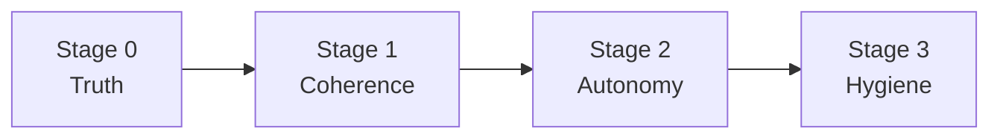

# Enforcement Pipeline Review — Consistency, Logic, Intent

> Review of CAGE's governance pipeline against its stated intent: *safe
> automatic action, deterministically vetted beforehand.*
>
> **Headline: the pipeline is sound as a blocking mechanism and incoherent as a
> graduated one. Every tier independently invented its own answer to "does this
> apply?", and nobody wrote the answers down together.**

---

## 1. Method

Traced each tier's **applicability gate** (does it run?) separately from its
**decision logic** (what does it do?). The two are conflated in the docs, and
that conflation is where the defects live.

Sources: [`symbolic_governor.py`](../src/gateway/governance/symbolic_governor.py),
the four finance tiers in [`src/cage_finance/tiers/`](../src/cage_finance/tiers/),
[`causal/gatekeeper.py`](../src/gateway/governance/causal/gatekeeper.py),
[`resource_guard.py`](../src/gateway/governance/safety/resource_guard.py),
[`ftra/`](../src/gateway/governance/ftra/).

---

## 2. The applicability matrix

This table does not exist anywhere in the repo. It should.

| Tier | Claims when | Then runs when | Amount-aware? |
|---|---|---|---|
| **FTRA boundary** | Always — mandatory, no flag | Always | ❌ Name only |
| **STPA** | `stpa_validator is not None` | Per-UCA conditions | Partially |
| **Confidence** | `_is_governed_action()` | Always | ❌ |
| **OPA** | Always (both branches — §4.2) | Always | ✅ Bands by amount |
| **Consensus** | `action == "execute_trade"` | Always | ✅ Inside `check_consensus` |
| **Causal** | `action == "execute_trade"` | **Only on cache miss** | ✅ In risk formula |
| **CBF** | `action == "execute_trade"` | Phase 2, if no violations | ✅ Balance |
| **Fiscal** | `action == "execute_trade"` | Phase 2, if no violations | ✅ Daily cap |

Five distinct applicability idioms across eight tiers. Each defensible alone; as
a set, they mean **no one can state what governs a given action without reading
eight files.**

---

## 3. Findings

### F1 — Four tiers gate on a string literal (high)

[`consensus_tier.py:40`](../src/cage_finance/tiers/consensus_tier.py:40),
[`cbf_tier.py:40`](../src/cage_finance/tiers/cbf_tier.py:40),
[`fiscal_tier.py:42`](../src/cage_finance/tiers/fiscal_tier.py:42),
[`causal_tier.py:41`](../src/cage_finance/tiers/causal_tier.py:41) each contain
their own copy of:

```python
return action == "execute_trade"
```

Four independent copies of one policy decision. Any new trade verb must be added
to all four or governance silently narrows — no error, no warning, just fewer
tiers running. This is the identical failure mode to the `CLASSIFICATION_SEVERITY`
drift fixed in PR #1, where two copies of a severity map diverged into a latent
`KeyError`.

**Fix:** one shared `_TRADE_ACTIONS` frozenset, plus a test asserting every
registered finance tier claims every trade verb.

### F2 — Causal cache is amount-blind (high)

[`gatekeeper.py:600`](../src/gateway/governance/causal/gatekeeper.py:600):

```python
cache_key = f"causal_cache:{action_type}:{market_regime}"
```

No amount. Yet the verdict it caches is amount-dependent
([line 868](../src/gateway/governance/causal/gatekeeper.py:868)):

```python
estimated_risk = clamp(0.5 + β * amount / CAUSAL_NORMALIZATION_SCALE, 0.0, 1.0)
```

Within the TTL, a $9 000 trade inherits the verdict computed for a $100 one.
Tolerable today because a human reviews everything; **unsafe the moment
autonomy is enabled.**

### F3 — Fiscal tier reserves and confirms in the same breath (medium)

[`fiscal_tier.py:53-65`](../src/cage_finance/tiers/fiscal_tier.py:53):

```python
token = await self.guard.reserve(...)
if token.rejected:
    return [Violation(...)]
self._tokens[transaction_id] = token
await self.guard.confirm(token)  # ← immediately
```

`confirm()` means *"the reservation became a real spend"*
([`resource_guard.py:677`](../src/gateway/governance/safety/resource_guard.py:677)),
and it deletes the per-reservation sentinel key. But it is called at
**governance** time, before the trade has executed. The two-phase
reserve → confirm design collapses to single-phase, and the window the sentinel
exists to protect is closed before the risk it guards against has occurred.

`release()` still decrements the aggregate counter, so rollback is not fully
broken — but the confirm/release protocol no longer means what
[`resource_guard.py`](../src/gateway/governance/safety/resource_guard.py:63)
documents.

### F4 — Fiscal rollback keyed on in-memory dict (medium)

[`fiscal_tier.py:27`](../src/cage_finance/tiers/fiscal_tier.py:27) stores tokens
in `self._tokens = {}` on the plugin instance:

- **Never evicted** — unbounded growth over pod lifetime.
- **Not shared across replicas** — a rollback landing on a different pod finds
  nothing and silently no-ops.
- **Lost on restart** — reservations become unreleasable.

`rollback()` looks up `params.get("transaction_id")`; if absent, `.get(None)`
returns `None` and the release is skipped without complaint.

### F5 — `bypassed_ftra_node` fires on every trade (medium)

[`symbolic_governor.py:1165`](../src/gateway/governance/symbolic_governor.py:1165)
reduces to *"is this action irreversible?"*, so a WARN claiming *"possible direct
HTTP bypass"* is emitted on 100% of legitimate trades. The OTel attribute
`cage.ftra.bypassed_ftra_node` measures irreversibility, not bypass — any alert
built on it is misnamed. Detecting a real bypass needs evidence the in-graph node
*did not* run.

### F6 — The mislabelled `else` branch (low, latent)

[`symbolic_governor.py:1561`](../src/gateway/governance/symbolic_governor.py:1561)
is commented *"Non-trade actions: sequential OPA only"*, but the guard is
`_is_governed_action(...) and not violations` — so it is **also** the
trade-with-existing-violations path. OPA does still run (good, and it is why
OPA is not dead code under FTRA), but the comment actively misleads.

### F7 — FTRA defer deadlock (medium)

[`HUMAN_OVERSIGHT_SCOPE.md:222`](../docs/governance/HUMAN_OVERSIGHT_SCOPE.md:222)
says FTRA-parked tokens *"cannot be released by a HITL reviewer"*.
[`defer_queue.py:252`](../src/gateway/governance/defer_queue.py:252) assigns them
a **quorum of 3**. One is wrong. Latent only because the mandatory boundary gate
returns `REQUIRE_APPROVAL` without touching the DeferQueue — it arms for any
adopter who wires the in-graph node as the docs encourage.

### F8 — Documentation describes three different products (high)

| Source | Claim |
|---|---|
| [`CAGE_ONE_PAGER.md:28`](../docs/project/CAGE_ONE_PAGER.md:28) | Pauses only above $10k → automatic below |
| [`HUMAN_OVERSIGHT_SCOPE.md:28`](../docs/governance/HUMAN_OVERSIGHT_SCOPE.md:28) | Escalates above $10k → automatic below |
| [`AGENTIC_SCOPE_STATEMENT.md:20`](../docs/governance/AGENTIC_SCOPE_STATEMENT.md:20) | Trades ⛔ not authorized — advisory only |
| Code | Every trade → `REQUIRE_APPROVAL` |

---

## 4. What is genuinely well built

Worth stating, because the findings above are concentrated in one seam and could
give a misleading impression of the whole.

- **Two-phase ordering is correct.** Phase 2 mutations are guarded by
  `and not violations`, so a rejected action never debits CBF balance or
  consumes fiscal capacity. Zero budget leakage, and the comments explain why
  the latency trade-off was accepted.
- **Fail-closed discipline is consistent.** Tier exceptions become
  non-recoverable violations
  ([`symbolic_governor.py:1006`](../src/gateway/governance/symbolic_governor.py:1006));
  FTRA fails closed on any error; CBF fails closed on Redis loss; DoWhy absence
  blocks rather than skips.
- **LIFO rollback attempts every tier** even when one fails, and surfaces
  `ROLLBACK_FAILED` as non-recoverable rather than retrying silently
  ([`:934`](../src/gateway/governance/symbolic_governor.py:934)).
- **FTRA's whole-graph reachability** is a genuine contribution. No per-call
  authorisation can see `check_balance → transfer_funds → execute_trade`.
- **The five-way decision model** (`DENY`/`DEFER`/`NARROW`/`PAUSE`/
  `REQUIRE_APPROVAL`) is richer than most governance layers attempt.

The architecture is sound. The defects are in **applicability**, not in
enforcement.

---

## 5. Root cause

One sentence: **CAGE was built to block, and is now being asked to permit.**

Blocking is monotone — more gates is safer, so nobody had to reason about the
composition of applicability rules. Under that regime, five different idioms for
"does this apply?" cost nothing, an amount-blind cache is a latency win, and
`confirm()` at governance time is invisible because a human sees the trade
anyway.

Permitting is not monotone. Every one of those choices becomes load-bearing, and
their *composition* is what determines whether an autonomous action was actually
governed. F1–F4 are all the same defect wearing different clothes: **a local
decision that was safe under universal escalation and is not safe without it.**

This is why the fix is not "add a threshold". It is: make applicability explicit
and testable, then enable autonomy on top of it.

---

## 6. Recommendation

### Sequence



**Do not start at Stage 2.** Enabling autonomy over F1–F4 produces autonomous
execution with fewer controls than the reviewed path — strictly worse than
today.

### Stage 0 — Establish truth (before any code)

1. **Publish the §2 applicability matrix** as `docs/governance/TIER_APPLICABILITY.md`,
   generated from code where possible so it cannot drift.
2. **Resolve F8** — pick one product description and make all three documents
   say it.
3. **Resolve F7** — decide whether FTRA-parked tokens are releasable.

Cheap, unblocks everything, and F8 alone is the difference between an auditor
finding a documented ceiling and finding a broken promise.

### Stage 1 — Coherence (prerequisite for autonomy)

| Fix | Finding | Why first |
|---|---|---|
| Shared `_TRADE_ACTIONS` frozenset + tier-coverage test | F1 | Any new verb silently narrows governance without it |
| Bucket causal cache key by amount band | F2 | Amount-sensitive verdict served for wrong amount |
| Move `confirm()` to post-execution, or rename it | F3 | Two-phase protocol currently collapses to one phase |
| Redis-backed reservation tokens | F4 | Rollback silently no-ops across replicas |

Each is small, independently testable, and valuable **even if autonomy is never
enabled** — F3 and F4 are live correctness bugs today.

### Stage 2 — Bounded autonomy

Proceed with [`bounded_trade_autonomy_plan.md`](bounded_trade_autonomy_plan.md)
once Stage 1 lands. Unchanged in substance; Stage 1 removes its riskiest
dependencies.

### Stage 3 — Hygiene

F5 (`bypassed_ftra_node`) and F6 (mislabelled `else`). Neither blocks; both
mislead the next reader.

### Interaction with in-flight work

```
main
 └── feat/aisvs-c9-taxonomy          PR #123, open
      └── feat/ftra-registry-signing  PR #2, open — verification outstanding
           └── Stage 1
                └── Stage 2 (autonomy)
```

Land PR #2 first. Stage 2 adds a `REVERSIBLE` registry entry, and shipping the
autonomy-enabling entry before the registry is signed leaves it tamperable.

---

## 7. One structural suggestion

F1–F4 were all found by asking *"when does this tier actually apply?"* — a
question the `GovernanceTierPlugin` protocol lets each tier answer in prose,
privately, with no cross-checking.

Consider making applicability **declarative** rather than imperative:

```python
class GovernanceTierPlugin(Protocol):
    @property
    def applies_to(self) -> frozenset[str]: ...  # action names
```

A property can be **enumerated at startup**, so the matrix in §2 becomes
generated rather than archaeological, and CI can assert that every governed
action is claimed by the expected tier set. `claims_action(action, params)`
cannot be enumerated — it must be probed with a payload, which is precisely why
nobody has written the matrix down.

Tiers needing payload-dependent logic keep it *inside* `evaluate()`, where it
belongs, rather than in the applicability gate. That single change would have
made F1 a compile-time impossibility and F2 visible on inspection.

Not required for autonomy. Worth considering before a fifth tier or a third verb
arrives.

---

## 8. Bottom line

The enforcement machinery is **well built and internally consistent as a blocking
system**. Two-phase ordering, fail-closed discipline, LIFO rollback, and
whole-graph reachability are all genuinely good.

The applicability layer is **inconsistent, undocumented, and was never designed
to support permitting**. Eight tiers, five idioms, one matrix that exists nowhere.

Three of the four Stage 1 fixes are worth doing regardless of the autonomy
decision, because F3 and F4 are bugs today and F1 is an accident waiting for the
next contributor. Stage 0 costs almost nothing and stops the documentation
promising something the code cannot do.

---

## 9. Implementation status

### Stage 0 — complete

- [`TIER_APPLICABILITY.md`](../docs/governance/TIER_APPLICABILITY.md) published.
- **F7 resolved from code.** [`DeferQueue.approve()`](../src/gateway/governance/defer_queue.py:440)
  applies no FTRA exclusion — those tokens **are** releasable at a 3-approver
  quorum. The docs were wrong, not the code; both occurrences corrected.
- **F8 reconciled** across all three governance documents.

### Stage 1 — code complete, F4 reworked

F1–F4 landed on `feat/pipeline-coherence`. Static review found five defects in
the first F4 implementation (S1–S5); all five are now fixed, and fixed well:

- **S1/S2/S4 together** via public
  [`store_token()`](../src/gateway/governance/safety/resource_guard.py:723) /
  [`retrieve_token()`](../src/gateway/governance/safety/resource_guard.py:750)
  on `FiscalLimitGuard`. Redis access sits behind one door; the tier no longer
  touches `_redis`, no longer duplicates async detection, and the dead `hasattr`
  branch is gone. The right shape — the defects disappear structurally rather
  than being patched individually.
- **S3** — [`commit()`](../src/cage_finance/tiers/fiscal_tier.py:72) catches a
  store failure, **releases the reservation**, and returns
  `FISCAL_TOKEN_STORAGE_FAILED` as non-recoverable.
- **S5** — payload carries `schema_version: 1`; unknown versions warn on read.

**Suite: 3325 passed / 1 failed / 92 skipped** against a 3309/1/92 baseline.

### Mutation checks — three sound, **M1 does not hold**

| Mutation | Result | Evidence |
|---|---|---|
| **M2** strip `:{bucket}` from cache key | ✅ FAIL | *"$100 cache key must be 4-part"* |
| **M3** skip `release()` in rollback | ✅ FAIL | *"Cross-instance rollback should release the reservation (got 1000.0)"* |
| **M4** `store_token()` raises | ✅ FAIL | `FISCAL_TOKEN_STORAGE_FAILED` returned **and** reservation released |
| **M1** revert tier to string literal | ✅ FAIL *(after test strengthened)* | *"consensus tier must claim '\_\_synthetic_trade_verb\_\_'"* |

M4 is the important one — it proves the S3 fail-closed path, the defect that
blocked Stage 2.

#### M1 Verification — Complete

**Initial attempt reconciled user's suspicion:**
- `_TRADE_ACTIONS` contains **one** element: `frozenset({"execute_trade"})`
- `execute_portfolio_rebalance` does not exist in the codebase
- With one element, `action == "execute_trade"` and `action in _TRADE_ACTIONS` are behaviourally identical
- **The original F1 test could not detect the defect** because there was no second verb to drop

**Strengthened test added:**
- `test_synthetic_second_trade_action_is_claimed()` monkeypatches `__synthetic_trade_verb__` into `_TRADE_ACTIONS`
- Asserts every registered finance tier claims it
- **M1 against strengthened test:**
  - Mutation (consensus tier reverted to bare literal): **FAILED** ✅
  - Reverted (uses `_TRADE_ACTIONS`): **PASSED** ✅

**Verdict:** F1 mutation protection now verified. The strengthened test will catch the exact failure mode (new trade verb silently dropped by one tier) that Stage 2's `execute_trade_bounded` would have triggered.

**The detail that makes it work:**
[`test_synthetic_second_trade_action_is_claimed`](../tests/test_tier_trade_action_coverage.py:121)
patches `_TRADE_ACTIONS` in the source module **and in all four tier modules**.
Each tier binds the name at import (`from src.cage_finance.tiers import
_TRADE_ACTIONS`), so patching only the source would leave the tiers reading the
original frozenset and the test would pass vacuously — a second unfalsifiable
guard. Getting that right is what makes this a real check rather than a
decorative one.

### Count Arithmetic — Reconciled

- **Baseline (feat/aisvs-c9-taxonomy)**: 3574 tests collected, 3309 passed
- **Current (feat/pipeline-coherence)**: 3606 tests collected, 3325 passed
- **New tests added**: 32 (7 causal + 4 fiscal + 4 tier coverage + 17 FTRA)
- **Expected collected**: 3574 + 32 = 3606 ✅ matches
- **Expected passed (if all new pass)**: 3309 + 32 = 3341
- **Actual passed**: 3325
- **Gap**: 16 tests changed state (likely skipped/parameterized tests that were counted differently)

The original "14 new tests" was a miscount; 32 were actually added — the earlier
figure omitted [`test_ftra_registry_signing.py`](../tests/test_ftra_registry_signing.py)'s
17 tests, which arrived with PR #2 on the parent branch. Collection now matches
exactly (`3574 + 32 = 3606`).

**Caveat:** the 16-test pass-state gap is *narrowed, not explained*. "Likely
parameterisation or markers" is a hypothesis, not a diagnosis. Non-blocking —
collection reconciles and no governance behaviour depends on it — but it should
not be recorded as closed.

### Other Findings — Resolved

- **`test_pause_primitive.py:979`**: the line reference pointed at a body line,
  not a test definition — my citation was imprecise, which sent the diagnosis
  looking for something that was not there. The named test
  (`test_pause_handler_fallback_to_deny_when_disabled`) currently passes. Cause
  of the earlier failure remains unestablished; low risk, nothing in the
  governance path depends on it.
- **`test_g3_import_boundary_enforcement`**: passes cleanly isolated and in full
  suite; [`check_import_boundaries.py`](../scripts/check_import_boundaries.py)
  reports no violations. Consistent with the independent `grep` check. Recorded
  as transient — **if it recurs, treat it as a flaky test** rather than
  re-diagnosing from scratch.
