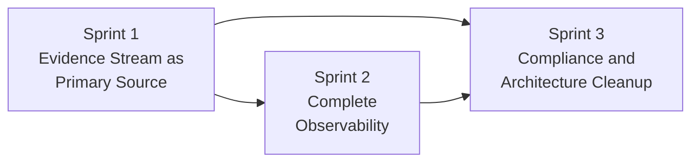
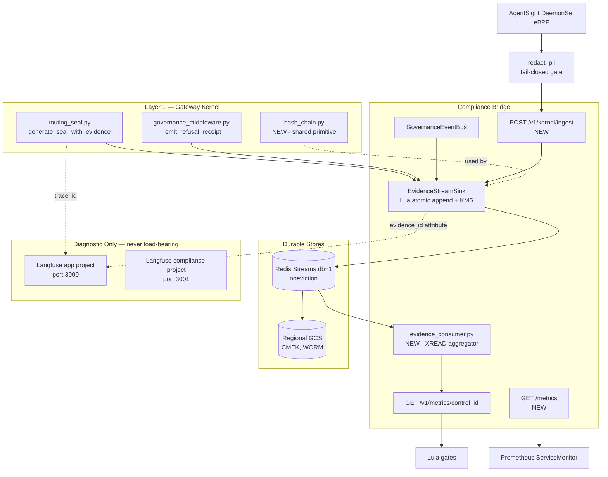
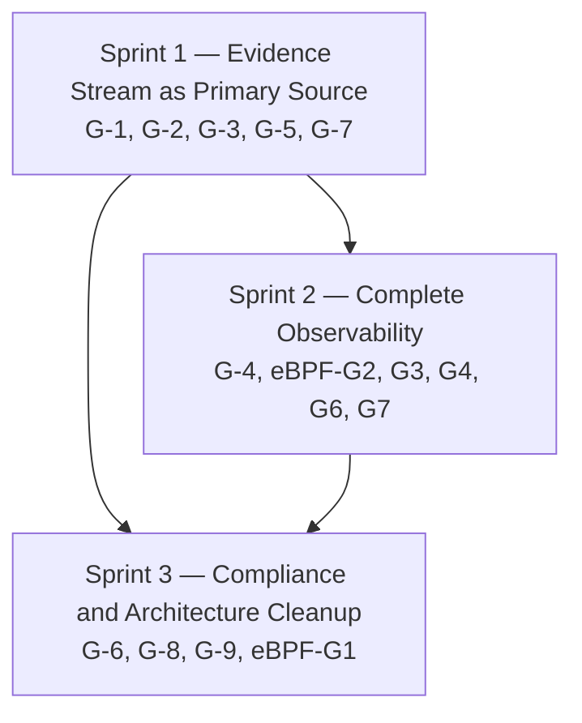

# Evidence & Observability Integration — Implementation Plan

**Status:** Design specification — architectural planning only. No code changes are made by this document.
**Scope:** Restructuring of the observability and compliance-evidence architecture identified in the LangFuse / Compliance Bridge / Evidence Stream / eBPF analysis.
**Audience:** CAGE maintainers and adopters of the reference architecture.

> **Reference Architecture Note.** Per [`AGENTS.md`](../AGENTS.md#architecture--design-standards), CAGE optimizes for *clean architecture over operational continuity*. This plan describes a **target state**, not a transition. Where a choice exists between a compatibility shim and a clean cut, this document always specifies the clean cut. See [§1.5](#15-reference-architecture-optimization-target).

---

## Table of Contents

1. [Executive Summary](#1-executive-summary)
   - [1.5 Reference Architecture Optimization Target](#15-reference-architecture-optimization-target)
2. [Architecture Decision](#2-architecture-decision)
3. [Implementation Sprints](#3-implementation-sprints)
4. [Detailed Technical Specifications](#4-detailed-technical-specifications)
5. [Testing & Validation Strategy](#5-testing--validation-strategy)
6. [Design Considerations](#6-design-considerations)
7. [Documentation Updates Required](#7-documentation-updates-required)
8. [Architectural Validation Criteria](#8-architectural-validation-criteria)
9. [Open Questions & Decisions Needed](#9-open-questions--decisions-needed)

---

## Gap Index

| ID | Severity | Title | Sprint | Primary file(s) |
|---|---|---|---|---|
| G-7 | Critical | Compliance attestation sourced from mutable, unsigned Langfuse/ClickHouse | 1 | [`metrics.py`](../src/compliance_bridge/metrics.py) |
| G-1 | Critical | Evidence Stream is write-only; no compliance consumer | 1 | [`evidence_stream.py`](../src/compliance_bridge/evidence_stream.py) |
| G-5 | Critical | No trace-ID correlation between Langfuse and Evidence Stream | 1 | [`routing_seal.py`](../src/gateway/governance/routing_seal.py:514), [`governance_middleware.py`](../src/gateway/server/governance_middleware.py:599) |
| eBPF-G1 | Critical | Cilium CNI absent, yet SC-7 asserted `implemented` in OSCAL | 3 | [`oscal_ssp_exporter.py`](../src/gateway/governance/oscal_ssp_exporter.py:330) |
| eBPF-G2 | Critical | eBPF telemetry isolated from all three compliance systems | 2 | [`main.py`](../src/compliance_bridge/main.py) |
| G-2 | High | `attach_evidence_sink()` never called | 1 | [`sse_events.py`](../src/compliance_bridge/sse_events.py:253) |
| G-3 | High | `EvidenceStreamSink.start()` never called | 1 | [`main.py`](../src/compliance_bridge/main.py:160) |
| G-4 | High | No Prometheus `/metrics` endpoint despite instrumentation | 2 | [`hybrid_server.py`](../src/gateway/server/hybrid_server.py:342) |
| G-9 | High | Region-guard gaps on evidence storage (GAP-06, GAP-07) | 3 | [`storage.py`](../src/compliance_bridge/storage.py) |
| eBPF-G3 | High | AgentSight DaemonSet not in any deploy path; SI-4 closed prematurely | 2 | [`agentsight-daemon.yaml`](../deployment/k8s/agentsight-daemon.yaml) |
| eBPF-G4 | High | Exporter endpoint disagreement between K8s and Compose configs | 2 | [`agentsight-config.yaml`](../deployment/agentsight/agentsight-config.yaml:39) |
| G-6 | Medium | Three parallel, non-interoperable hash chains | 3 | [`context_accumulator.py`](../src/compliance_bridge/context_accumulator.py:112) |
| G-8 | Medium | Langfuse SDK boundary violations in Layer 1 | 3 | [`metrics.py`](../src/compliance_bridge/metrics.py:104) |
| eBPF-G6 | Medium | `ebpf_anomaly_count` has no in-cluster producer | 2 | [`physics_provider.py`](../src/integrations/provider_05/physics_provider.py:94) |
| eBPF-G7 | Medium | No Prometheus scrape target for the AgentSight daemon | 2 | [`agentsight-daemon.yaml`](../deployment/k8s/agentsight-daemon.yaml) |

---

## 1. Executive Summary

### 1.1 Problem statement

CAGE presents itself as a governance engine whose compliance attestations are grounded in cryptographically hash-chained, KMS-signed evidence. The code substantially delivers that machinery — [`EvidenceStreamSink`](../src/compliance_bridge/evidence_stream.py:708) implements a JCS-canonicalized SHA-256 chain (`cage-evidence-stream/2.0`) with Redis Streams durability, optional KMS signing, and CMEK-encrypted GCS cold storage. **But nothing reads it, and in the wired topology almost nothing writes to it either.**

Three structural defects compound:

1. **The evidence chain is not started.** [`EvidenceStreamSink.start()`](../src/compliance_bridge/evidence_stream.py:747) is never invoked from the compliance-bridge lifespan ([`main.py:160-258`](../src/compliance_bridge/main.py:160)). Because [`ingest()`](../src/compliance_bridge/evidence_stream.py:807) short-circuits with `if self._redis is None: return None`, and `generate_seal_with_evidence()` guards on `sink.is_running` ([`routing_seal.py:567`](../src/gateway/governance/routing_seal.py:567)), the entire non-blocking evidence path is a silent no-op in any process that never called `start()`. Likewise [`attach_evidence_sink()`](../src/compliance_bridge/sse_events.py:253) is never called, so every SSE governance event bypasses the chain.

2. **Compliance verdicts come from the wrong source.** Every Lula API-domain gate (`lula-validation-a52.yaml`, `-a53.yaml`, `-a92.yaml`, and the MAS/DORA/GDPR/EU-AI-Act endpoint gates) resolves through `GET /v1/metrics/{control_id}` → [`get_compliance_metrics()`](../src/compliance_bridge/metrics.py:255) → `langfuse.trace.list(tags=[f"control:{control_id}"])`. Langfuse traces are mutable, unsigned application telemetry stored in ClickHouse with no append-only guarantee, no chain linkage, and a hard `limit=100` truncation ([`metrics.py:195-199`](../src/compliance_bridge/metrics.py:195)). The attestation surface therefore rests on a substrate weaker than the one CAGE built for exactly this purpose.

3. **The two worlds cannot be joined.** Evidence records carry `sequence`, `record_hash`, `event_type`, `control_id` — but no `trace_id`. Langfuse spans carry trace IDs but no `evidence_id`. Even if a consumer existed, no query could prove that a given Langfuse-observed decision produced a given signed evidence record. `GovernanceEvent` documents a `traceId` field in [`sse_events.py:81`](../src/compliance_bridge/sse_events.py:81), but the two principal producers — [`routing_seal.py:514`](../src/gateway/governance/routing_seal.py:514) and [`governance_middleware.py:573`](../src/gateway/server/governance_middleware.py:573) — construct payloads that omit it.

Layered on top: the eBPF/AgentSight tier is entirely disconnected (no DaemonSet in any deployment path, an exporter endpoint pointing at a UI service rather than an ingest API, `ebpf_anomaly_count` consumed by [`provider_05`](../src/integrations/provider_05/physics_provider.py:94) with no in-cluster producer), and SC-7 is asserted `implemented` in [`oscal_ssp_exporter.py:330-351`](../src/gateway/governance/oscal_ssp_exporter.py:330) on the strength of `CiliumNetworkPolicy` manifests that cannot apply because Cilium is not the cluster CNI — no `datapath_provider` / `ADVANCED_DATAPATH` setting exists anywhere in [`infra/modules/gcp_gke_cluster/`](../infra/modules/gcp_gke_cluster/).

Finally, Prometheus metrics are defined throughout the codebase (`cage_evidence_commit_total`, `cage_evidence_commit_duration_seconds`, `cage_evidence_blocking_disabled`, `cage_evidence_stream_disabled` — [`evidence_stream.py:128-169`](../src/compliance_bridge/evidence_stream.py:128)) but no process exposes a `/metrics` endpoint. The gateway exposes only `/healthz` ([`hybrid_server.py:342`](../src/gateway/server/hybrid_server.py:342)); the bridge exposes `/health` ([`main.py:378`](../src/compliance_bridge/main.py:378)). Every counter increments into a registry nobody scrapes.

**The net effect is an evidentiary inversion:** the system's strongest evidence artifact is inert, and its compliance claims are backed by its weakest one.

### 1.2 Target state

Invert the dependency. The signed Evidence Stream becomes the **system of record** for compliance attestation; Langfuse is **diagnostic-only** and holds no attestation role. There is no dual-source period, no divergence reconciler, and no source-selection flag — the target architecture has exactly one authoritative evidence path, and the implementation lands it directly.

The work is organized into three sprints, each of which leaves the repository in a coherent architectural state:



- **Sprint 1** starts the sink, makes chain append multi-writer safe, cuts `cage-evidence-stream/3.0` with `trace_id` / `region` / `producer`, builds the `XREAD` consumer, and **removes Langfuse from the compliance path entirely**.
- **Sprint 2** exposes `/metrics` on both services, lands the eBPF kernel ingest path so kernel observations hash-chain into evidence, and enforces PII scrubbing before immutable append.
- **Sprint 3** demonstrates region-guarded evidence storage, resolves the SC-7 overclaim, unifies the three hash chains into one Layer-1 primitive, and makes the OSCAL claim-backing rule self-enforcing in CI.

### 1.3 Architectural completion criteria

The work is complete when the *structure* exhibits the following properties. These are statements about the shape of the system, not service-level objectives.

| # | Criterion | Demonstrated by |
|---|---|---|
| AC-1 | Lula gates derive from the Evidence Stream only; zero Langfuse dependency in the attestation path | No `langfuse` import reachable from [`metrics.py`](../src/compliance_bridge/metrics.py); all 31 gates green |
| AC-2 | Every evidence record produced inside a governance span carries a `trace_id` inside the hash | `tests/test_evidence_trace_correlation.py` |
| AC-3 | Correlation resolves in both directions: `trace_id` → Langfuse span, `evidence_id` → chain record | `tests/test_evidence_trace_correlation.py` round-trip case |
| AC-4 | Chain append is atomic and correct under concurrent multi-process writers | `tests/test_evidence_multiwriter.py` |
| AC-5 | `/metrics` exposes the previously-decorative instrumentation on gateway and bridge | `tests/test_prometheus_endpoint.py` |
| AC-6 | No OSCAL control claims `implemented` without a deployed, verifiable enforcement mechanism | `scripts/check_oscal_claim_backing.py` (new) |
| AC-7 | PII scrubbing structurally precedes immutable append — it is not possible to chain an unscrubbed kernel payload | `tests/test_kernel_event_ingest.py::test_pii_scrubbed` |
| AC-8 | Region is a property of the record, verified on read; unknown region fails closed | `tests/test_regional_evidence_storage.py` |
| AC-9 | One hash-chain primitive, in Layer 1, used by every chain in the system | `tests/test_hash_chain_primitive.py` |

---

### 1.5 Reference Architecture Optimization Target

This section governs every subsequent design choice in this document. Where a later section appears to conflict with it, this section wins.

**CAGE optimizes for architectural clarity, not operational continuity.** The measure of success for this work is whether a reader can open the repository and understand, without archaeology, how governance evidence is produced, chained, signed, stored, and consumed. Latency budgets, availability targets, and deployment safety appear in this plan only where they shape the *structure* — never as obligations to be defended.

**There is no live production instance to protect.** CAGE is an illustrative reference architecture. No user depends on its uptime, no auditor depends on its historical records, and no downstream system depends on its API shape. Every argument of the form "but existing deployments would break" is therefore inadmissible.

**Breaking changes are encouraged when they improve structure.** The `cage-evidence-stream/2.0` → `3.0` schema change is a direct cut. There is no dual-read period, no translation shim, no bridging record, and no compatibility matrix. `/v1/metrics/{control_id}` changes its data source in a single commit rather than behind a selector flag.

**Historical data loss is acceptable to achieve a clean schema.** Existing v2.0 evidence records are discarded and a new genesis is cut. Historical Langfuse traces are not retro-chained — constructing signed records after the fact from unsigned data would manufacture the appearance of an integrity guarantee that never existed, which is a forgery however well-intentioned. The clean statement is: evidence-grade attestation begins at the genesis cut, and nothing before it claims that property.

**Feature flags and gradual rollout are unnecessary complexity.** A flag that selects between two implementations of the same responsibility is an unanswered architectural question encoded as configuration. This plan introduces **no** `CAGE_COMPLIANCE_SOURCE`-style selector. The environment variables that survive (`EVIDENCE_STREAM_ENABLED`, `EVIDENCE_CHAIN_BLOCKING`, `CAGE_EVIDENCE_COLD_READ`) each express a genuine deployment-posture choice for an adopter, not a migration stage for this repository.

**The goal is to demonstrate the cleanest possible governance evidence architecture.** One chain primitive. One authoritative source. One direction of dependency: producers write signed evidence; consumers read signed evidence; diagnostics observe from the side and are never load-bearing.

Consequences of this stance, stated plainly so they are not rediscovered as surprises:

| Decision | Reference-architecture reading |
|---|---|
| Evidence chain becomes a hard dependency of attestation | Correct. Making integrity load-bearing is the point; a governance engine that can attest without its evidence chain is not demonstrating anything. |
| Fail-closed startup couples bridge readiness to Redis | Correct and legible. An attestation service without its evidence chain should not report ready. |
| SC-7 drops from `implemented` to `planned` | Correct. An unbacked claim in a compliance artifact is the precise failure mode CAGE exists to detect. |
| v2.0 records become unverifiable after the cut | Accepted. Documented as a genesis boundary rather than engineered around. |

---

## 2. Architecture Decision

### 2.1 The decision

**ADR-EV-001 — The Evidence Stream is the single compliance data source; Langfuse holds no attestation role.**

> **Status:** Proposed
> **Supersedes:** the implicit "Langfuse-as-attestation-source" design embodied by [`metrics.py`](../src/compliance_bridge/metrics.py) and the API-domain Lula gates.

### 2.2 Options considered

| | Option A — Evidence Stream only | Option B — Dual-source with correlation | Option C — Status quo + Langfuse hardening |
|---|---|---|---|
| **Shape** | Evidence Stream is system of record; Langfuse is a diagnostic sink | Both sources authoritative; reconciliation job flags divergence | Keep Langfuse authoritative; add ClickHouse immutability controls |
| **Signed evidence** | Yes — every attestation traces to a KMS-signed, chain-linked record | Partially — attestations may resolve from either source | No |
| **Mental model** | One authoritative chain, one diagnostic sink | Two authorities plus a reconciler — three things to reason about | One authority, but not the one the architecture advertises |
| **Failure mode** | Evidence chain down → attestation fails closed (correct) | Divergence → *which one is right?* has no principled answer | Silent attestation on mutable data |
| **Structural cost** | Rewrite of metrics aggregation; consumer must be built | Everything in A, plus a reconciler, plus a divergence policy | ClickHouse WORM configuration, retention locks, external attestation |
| **Layer hygiene** | Removes the Langfuse SDK from the attestation path (resolves G-8) | Entrenches Langfuse SDK coupling | Entrenches it further |

### 2.3 Rationale

Option B is rejected on architectural-clarity grounds, which is the governing criterion for this repository. Dual-source compliance requires a tie-break policy for divergence, and any such policy is either "trust the signed chain" — which *is* Option A, with extra machinery — or "trust the mutable store", which defeats the purpose. Two authorities is not a hedge; it is an unanswered question encoded in the system.

Option C is rejected because ClickHouse immutability would be a *second* implementation of a guarantee CAGE already implements natively, inside a component whose primary purpose is LLM tracing. It would also deepen the Layer-1 Langfuse coupling flagged as G-8.

Option A aligns with the stated invariants: Langfuse exists in CAGE for **sovereign, self-hosted LLM observability** ([`AGENTS.md` — Observability Architecture](../AGENTS.md#observability-architecture-langfuse-sovereign-telemetry-vs-langsmith)), not for compliance attestation. The dual-pipeline split (application `:3000` / compliance-audit `:3001`) already gestures at this separation; ADR-EV-001 completes it.

**Important nuance — the compliance-audit Langfuse pipeline is retained.** Demoting Langfuse to "diagnostic-only" applies to *attestation sourcing*, not to Langfuse's role as an audit-trace viewer. The compliance project (`LANGFUSE_COMPLIANCE_*`, port `3001`) used by [`audit_workflow.py`](../src/compliance_bridge/audit_workflow.py) continues to receive audit traces for human review. What changes is that no Lula gate, no OSCAL assessment result, and no `ComplianceMetrics` value is *derived* from it.

### 2.4 Target architecture



Solid edges are authoritative data flow; dotted edges are correlation metadata only. The diagram is the deliverable: if the implemented system cannot be drawn this way, the implementation has diverged from the design.

### 2.5 Consequences

**Positive.** Attestation becomes cryptographically grounded. The `limit=100` truncation defect in [`metrics.py:198`](../src/compliance_bridge/metrics.py:198) disappears — Redis Streams range reads are unbounded. Langfuse outages stop being compliance events. Layer-1 Langfuse coupling is severed in Sprint 3.

**Negative.** Evidence Stream availability becomes an attestation dependency. This is the intended consequence, not a regression to be mitigated: the architecture's claim is that attestation rests on signed evidence, and that claim is only meaningful if the absence of signed evidence is visible. GCS cold-storage hydration (§4.1.7) exists to extend the readable window, not to hide chain unavailability.

**Breaking changes introduced — all intentional, none mitigated.**

| Change | Nature |
|---|---|
| `cage-evidence-stream/2.0` → `3.0` | Direct cut. New required `trace_id`, `span_id`, `region`, `producer` fields, all inside the hash. Existing v2.0 records are **discarded**; a new genesis is cut. |
| `GET /v1/metrics/{control_id}` data source | Direct cut from Langfuse to Evidence Stream in a single commit. Response gains `source`, `evidence_chain_verified`, `chain_head_hash`; existing field names and semantics are unchanged, so Lula Rego remains valid. |
| `EvidenceStreamSink.ingest()` return type | Now returns `EvidenceCommitResult` in both blocking and fire-and-forget modes, so both can populate the reverse Langfuse link. |
| Hash linking moves server-side | In-process `_prev_hash` state is replaced by a Redis Lua script (§4.3.3). The in-process `asyncio.Lock` is deleted, not retained alongside. |
| `get_region_bucket()` fails closed | An unset or unknown `CAGE_DEPLOYMENT_REGION` raises rather than defaulting to `US_FED`. |
| SC-7 OSCAL status | `implemented` → `planned`. |

---

## 3. Implementation Sprints

Three sprints, ordered by dependency. Each ends with the repository in a coherent architectural state — not a half-migrated one. There is no soak window between sprints and no flag to flip; a sprint is done when its structure is in place and its tests pass.



Sprints 2 and 3 are parallelizable once Sprint 1 lands — they touch largely disjoint files. Sprint 3's hash-chain consolidation depends on Sprint 2 only because the kernel-event chain introduced there is one of the chains being consolidated.

---

### Sprint 1 — Evidence Stream as Primary Source

**Gaps closed:** G-1, G-2, G-3, G-5, G-7
**Branches:** `feat/evidence-primary-source`, `feat/evidence-consumer`

#### Objective

Make the Evidence Stream the only compliance data source, in one architectural move. This sprint turns the dormant machinery on, makes it correct under concurrency, cuts the v3.0 schema with correlation fields inside the hash, builds the read path, and deletes the Langfuse attestation path. It does not leave a selector behind.

#### Deliverables

| # | Deliverable | File |
|---|---|---|
| 1.1 | Redis Lua atomic chain append; delete the in-process `_prev_hash` lock | [`evidence_stream.py`](../src/compliance_bridge/evidence_stream.py:541), `src/gateway/governance/evidence/chain_append.lua` (new) |
| 1.2 | Start `EvidenceStreamSink` in the bridge lifespan; fail closed when enabled-but-unstartable | [`main.py`](../src/compliance_bridge/main.py:160) |
| 1.3 | Attach the sink to `GovernanceEventBus`; graceful `stop()` in the lifespan `finally` | [`main.py`](../src/compliance_bridge/main.py:160), [`sse_events.py`](../src/compliance_bridge/sse_events.py:253) |
| 1.4 | Start the sink on the gateway side (the gateway also produces evidence) | [`hybrid_server.py`](../src/gateway/server/hybrid_server.py:335) |
| 1.5 | Chain-state resumption on startup (`_restore_chain_state()`) | [`evidence_stream.py`](../src/compliance_bridge/evidence_stream.py:747) |
| 1.6 | `/health` reports `evidence_stream: {running, sequence, head_hash, schema, region}` | [`main.py`](../src/compliance_bridge/main.py:378) |
| 1.7 | Evidence schema `3.0` — `trace_id`, `span_id`, `region`, `producer`, all inside `_link_hash()` | [`evidence_stream.py`](../src/compliance_bridge/evidence_stream.py:390) |
| 1.8 | Shared trace-context helper in Layer 1 | `src/gateway/observability/trace_context.py` (new) |
| 1.9 | Inject `trace_id` / `span_id` at the seal producer | [`routing_seal.py:514`](../src/gateway/governance/routing_seal.py:514) |
| 1.10 | Inject `trace_id` / `span_id` / `controlId` at the refusal-receipt producer | [`governance_middleware.py:573`](../src/gateway/server/governance_middleware.py:573) |
| 1.11 | Set `evidence_id` / `record_hash` as root-span attributes for reverse lookup | [`langfuse_utils.py`](../src/gateway/observability/langfuse_utils.py) |
| 1.12 | New module `evidence_consumer.py` — `XREAD` aggregator with bucketed windows | `src/compliance_bridge/evidence_consumer.py` (new) |
| 1.13 | `/v1/metrics/{control_id}` sources from the consumer; response gains `source`, `evidence_chain_verified`, `chain_head_hash` | [`metrics.py`](../src/compliance_bridge/metrics.py:255), [`types.py`](../src/compliance_bridge/types.py:72) |
| 1.14 | **Delete** the Langfuse read path from the attestation flow | [`metrics.py`](../src/compliance_bridge/metrics.py:185) |
| 1.15 | Lula gates assert `evidence_chain_verified == true` | [`lula-validation-a53.yaml`](../compliance/lula/lula-validation-a53.yaml) and peers |
| 1.16 | OSCAL assessment results cite evidence hashes, not trace IDs | [`oscal_exporter.py`](../src/compliance_bridge/oscal_exporter.py:188) |
| 1.17 | Raise `EVIDENCE_STREAM_MAX_LEN` above the longest Lula window (see §9, Q-3) | [`evidence_stream.py:69`](../src/compliance_bridge/evidence_stream.py:69) |
| 1.18 | Discard v2.0 records; cut and document a new genesis | Deployment step + SSP note |

Two deliverables carry more weight than their line counts suggest.

**1.1 must land before 1.4.** The gateway and the bridge both call `get_evidence_sink()`, which returns a **per-process singleton** ([`evidence_stream.py:1231`](../src/compliance_bridge/evidence_stream.py:1231)). Starting the sink in both processes while chain state lives in process memory produces an interleaved, unverifiable chain — deterministically, on the first concurrent write. §4.3.3 specifies the Lua resolution.

**1.14 is the sprint's architectural payload.** Everything before it makes the Evidence Stream *capable* of being the source; 1.14 makes it *the* source. Landing 1.13 without 1.14 would leave two read paths in the tree, which is the dual-source design this ADR rejects.

#### Testing

- **Unit** — `tests/test_evidence_sink_lifecycle.py`: `start()` idempotence, `stop()` cancels the flush task, `_restore_chain_state()` recovers sequence and head from a populated `fakeredis` stream, genesis is cut only on an empty stream.
- **Unit** — `tests/test_evidence_multiwriter.py`: N concurrent writers against one stream produce a chain that verifies end-to-end. This is the test that proves 1.1 is correct.
- **Unit** — `tests/test_evidence_schema_v3.py`: the new fields are inside the hash; mutating `trace_id` changes `record_hash`.
- **Unit** — `tests/test_evidence_consumer.py`: aggregation correctness, window boundaries, empty window returns `safety_rate=None` (preserving the existing semantics at [`metrics.py:222`](../src/compliance_bridge/metrics.py:222)), chain verification failure surfaces as an explicit flag rather than a silent zero.
- **Unit** — `tests/test_evidence_trace_correlation.py`: every producer emits a non-empty `trace_id` when inside a span; round-trip resolution in both directions.
- **Integration** — a governed action produces a chain record whose `trace_id` resolves to a Langfuse span carrying the matching `record_hash`.
- **Lula** — all 31 gates green against the evidence-sourced endpoint.

#### Commit examples

```
feat(compliance): add atomic Lua chain append for multi-writer safety
fix(compliance): start evidence sink and attach to governance event bus
feat(compliance)!: add trace_id and region to evidence schema v3.0

BREAKING CHANGE: evidence stream schema advances to
cage-evidence-stream/3.0. v2.0 records are discarded and a new genesis
is cut. No migration path is provided.
feat(compliance): add evidence stream consumer for compliance aggregation
refactor(compliance)!: source compliance metrics from signed evidence stream

BREAKING CHANGE: /v1/metrics/{control_id} derives from the evidence
stream. The Langfuse read path is removed; there is no selector to
restore it.
```

---

### Sprint 2 — Complete Observability

**Gaps closed:** G-4, eBPF-G2, eBPF-G3, eBPF-G4, eBPF-G6, eBPF-G7
**Branches:** `feat/prometheus-metrics`, `feat/kernel-event-ingest`

#### Objective

Expose the instrumentation that already exists, and connect the eBPF tier to the evidence chain so kernel-level observations become first-class signed evidence rather than an isolated UI feed. PII scrubbing is specified here as a structural precondition of ingest, not as an operational safeguard bolted on afterwards.

#### Dependencies

Sprint 1 — kernel events hash-chain through the same primitive and carry the same v3.0 fields.

#### Deliverables

| # | Deliverable | File |
|---|---|---|
| 2.1 | `GET /metrics` on the gateway | [`hybrid_server.py`](../src/gateway/server/hybrid_server.py:342) |
| 2.2 | `GET /metrics` on the compliance bridge | [`main.py`](../src/compliance_bridge/main.py:378) |
| 2.3 | `prometheus-client` promoted to a required dependency; delete the `ImportError` guard | [`pyproject.toml`](../pyproject.toml:16), [`evidence_stream.py:172`](../src/compliance_bridge/evidence_stream.py:172) |
| 2.4 | ServiceMonitor manifests (gateway, bridge, AgentSight) | `deployment/k8s/servicemonitor-*.yaml` (new) |
| 2.5 | Alert rules mapped to AI 600-1 CA-7 | `deployment/k8s/prometheus-alerts-cage.yaml` (new) |
| 2.6 | Reference Grafana dashboards | `deployment/dashboard/evidence_chain_dashboard.json`, `governance_overview_dashboard.json` (new) |
| 2.7 | `KernelEvent` schema + mandatory PII scrub gate before ingest | `src/compliance_bridge/kernel_events.py` (new) |
| 2.8 | `POST /v1/kernel/ingest`, authenticated and batched | [`main.py`](../src/compliance_bridge/main.py) |
| 2.9 | Tiered kernel-event sampling policy | [`config/governance_thresholds.json`](../config/governance_thresholds.json) |
| 2.10 | Separate kernel stream key with its own chain and retention | [`evidence_stream.py`](../src/compliance_bridge/evidence_stream.py:69) |
| 2.11 | SSE event types `KERNEL_EVENT` / `KERNEL_ANOMALY`, anomaly-filtered | [`sse_events.py`](../src/compliance_bridge/sse_events.py:63) |
| 2.12 | AgentSight exporter endpoint corrected and unified across K8s and Compose | [`agentsight-daemon.yaml`](../deployment/k8s/agentsight-daemon.yaml:57), [`agentsight-config.yaml`](../deployment/agentsight/agentsight-config.yaml:39) |
| 2.13 | AgentSight DaemonSet added to the deploy path | [`deploy_all.sh`](../deploy_all.sh), `infra/modules/agentsight_daemon/` (new) |
| 2.14 | `cage_ebpf_anomaly_count` producer + `GET /v1/kernel/anomalies` | `src/compliance_bridge/kernel_events.py` (new) |
| 2.15 | Config-parity CI check for the two AgentSight configs | `scripts/check_agentsight_config_parity.py` (new) |
| 2.16 | SI-4 / POAM-021 status corrected to match deployed reality | [`docs/POAM.md`](../docs/POAM.md) |

Deliverable 2.7 is the one that must not be deferred or made optional. An eBPF pipeline that writes unscrubbed TLS plaintext into a WORM-retained, CMEK-encrypted, KMS-signed archive creates a permanent, cryptographically notarized privacy breach — the very retention properties that make the chain valuable make the mistake irreversible. The scrub is therefore expressed as a **structural gate in the ingest path**, not a policy applied by convention: an unscrubbed payload has no code path to `XADD`. See §4.5.2 and §6.1.

#### Testing

- **Unit** — `tests/test_prometheus_endpoint.py`: exposition format, expected metric families, no credential- or PII-shaped label values.
- **Unit** — `tests/test_kernel_event_ingest.py`: schema validation, auth, batching, bounded-queue behaviour, and `test_pii_scrubbed` — a payload containing PII cannot reach the chain.
- **Unit** — `tests/test_kernel_event_sampling.py`: tier classification, aggregate records, SSE filtering to anomalies only.
- **Integration** — a `connect` syscall from a governed pod produces an SSE `kernel-event` and a corresponding chain record with `producer="agentsight"`.
- **Lula** — an SI-4 gate is authored, or the claim is retracted (2.16). No existing gate regresses.

#### Commit examples

```
feat(gateway): expose Prometheus /metrics endpoint
feat(compliance): add kernel event ingest endpoint for eBPF telemetry
fix(agentsight): point daemon exporter at compliance bridge ingest API
ci(agentsight): assert k8s and compose exporter configs stay aligned
```

---

### Sprint 3 — Compliance & Architecture Cleanup

**Gaps closed:** G-6, G-8, G-9 (GAP-06, GAP-07), eBPF-G1
**Branches:** `feat/regional-evidence`, `fix/sc7-oscal-claim`, `refactor/unify-hash-chains`

#### Objective

Demonstrate jurisdictional evidence isolation as a pattern, align OSCAL claims with deployed reality, collapse three hash-chain implementations into one Layer-1 primitive, and make both the claim-backing rule and the SDK boundary self-enforcing in CI.

#### Dependencies

Sprints 1 and 2 — regional guards must cover the evidence path Sprint 1 made authoritative and the kernel chain Sprint 2 introduced.

#### Deliverables

| # | Deliverable | File |
|---|---|---|
| 3.1 | `get_region_bucket()` dispatcher, fail-closed on unknown region | [`storage.py`](../src/compliance_bridge/storage.py:64) |
| 3.2 | Region-guarded GCS flush target resolved at call time, not import time | [`evidence_stream.py:1182`](../src/compliance_bridge/evidence_stream.py:1182) |
| 3.3 | Region-specific bucket resources in a dedicated module | `infra/modules/evidence_storage/` (new) |
| 3.4 | Read-side region verification | [`evidence_stream.py`](../src/compliance_bridge/evidence_stream.py:839) |
| 3.5 | Per-region Langfuse projects (defence in depth for diagnostic traces) | [`infra/modules/`](../infra/modules/) |
| 3.6 | SC-7 claim resolution — retract to `planned` with compensating controls (§4.7) | [`oscal_ssp_exporter.py:330`](../src/gateway/governance/oscal_ssp_exporter.py:330), [`aarm_mapper.py:318`](../src/compliance_bridge/aarm_mapper.py:318) |
| 3.7 | OSCAL claim-backing checker wired into the `lint` CI job | `scripts/check_oscal_claim_backing.py` (new) |
| 3.8 | Extract a single `HashChain` primitive into Layer 1 | `src/gateway/governance/evidence/hash_chain.py` (new) |
| 3.9 | `ContextAccumulator`, `EvidenceStreamSink`, and the `cage-intent/1.0` audit log all adopt it | [`context_accumulator.py:112`](../src/compliance_bridge/context_accumulator.py:112), [`evidence_stream.py:541`](../src/compliance_bridge/evidence_stream.py:541), [`AUDIT_LOG_SCHEMA.md`](../docs/architecture/AUDIT_LOG_SCHEMA.md:20) |
| 3.10 | Cross-chain verification utility | `scripts/verify_evidence_chains.py` (new) |
| 3.11 | Langfuse access behind a `TelemetrySink` protocol | `src/gateway/observability/telemetry_protocol.py` (new) |
| 3.12 | Remove direct `langfuse` imports from `src/gateway/` | [`langfuse_utils.py`](../src/gateway/observability/langfuse_utils.py) |
| 3.13 | Import-boundary check extended to flag vendor SDKs in Layer 1 | [`scripts/check_import_boundaries.py`](../scripts/check_import_boundaries.py:37) |

Two notes on scope.

**On the three chains.** Today they are `cage-evidence-stream/3.0` with `_link_hash()` at [`evidence_stream.py:541`](../src/compliance_bridge/evidence_stream.py:541), `cage-context-accumulator/2.0` with a separate `_link_hash()` at [`context_accumulator.py:112`](../src/compliance_bridge/context_accumulator.py:112) and a `"GENESIS"` sentinel, and the `cage-intent/1.0` audit-log chain. They use different genesis values, different field orderings, and different schema versions. Applying the AGENTS.md decision test — *"if two domains had different copies of this, would a security fix have to be applied twice?"* — the answer is three times, which places the primitive squarely in Layer 1. Because the consolidation is free to change hash semantics (there is no historical chain to preserve), each adopting chain gets a version bump and a fresh genesis rather than a compatibility-preserving shim.

**On 3.7 and 3.13.** These are the highest-leverage deliverables in the plan. Every other item fixes one instance of a defect; these two make their respective classes of defect impossible to reintroduce. An unbacked OSCAL claim and a vendor SDK in the kernel are both failures of *invariant enforcement*, and an invariant that lives only in prose will be violated.

#### Testing

- **Unit** — `tests/test_regional_evidence_storage.py`: each region maps to its own bucket; unknown region raises rather than defaulting; an `EU_ECB`-stamped record is rejected by a `US_FED` reader.
- **Unit** — `tests/test_oscal_claim_backing.py`: the checker flags a synthetic SSP entry claiming `implemented` with a missing or undeployed evidence file.
- **Unit** — `tests/test_hash_chain_primitive.py`: one primitive, three adopters, identical linking semantics; each chain's genesis is explicit and versioned.
- **Unit** — `tests/test_telemetry_protocol.py`: a null sink satisfies the protocol; the kernel functions with no telemetry backend configured.
- **CI** — Gate G3 (`uv run python scripts/check_import_boundaries.py --verbose`) passes with the extended vendor-SDK rules.
- **Regional** — the three posture markers exercise the guard pattern (§5.3).

#### Commit examples

```
feat(compliance): route evidence storage to region-specific buckets
fix(compliance)!: retract SC-7 implemented claim pending Cilium deployment

BREAKING CHANGE: OSCAL SSP now reports SC-7 as planned. Gates asserting
SC-7 implemented must be updated.
ci(compliance): add OSCAL claim backing verification gate
refactor(governance): extract shared hash chain primitive to kernel
refactor(gateway): access Langfuse through TelemetrySink protocol
ci(imports): flag vendor SDK imports in Layer 1 kernel
```

---

## 4. Detailed Technical Specifications

### 4.1 Evidence Stream Consumer (G-1)

**New module:** `src/compliance_bridge/evidence_consumer.py`

#### 4.1.1 Responsibilities

The consumer is the read half of the evidence chain. It has exactly three jobs and should resist acquiring a fourth:

1. Tail the Redis Stream and maintain a bounded windowed index of records.
2. Verify chain continuity over the records it has seen.
3. Aggregate records into `ComplianceMetrics` on demand, per `control_id` and window.

It does **not** write to the stream, does not sign, and does not talk to Langfuse. Correlation to Langfuse is a lookup the *caller* may perform using the `trace_id` the consumer surfaces.

#### 4.1.2 Consumer loop

Use a blocking `XREAD` rather than a consumer group. Consumer groups (`XREADGROUP`) add acknowledgement and pending-entry-list semantics that are valuable for work distribution but wrong here: every replica needs *every* record to maintain a complete window, and there is no work to distribute. A plain `XREAD` from a tracked last-ID gives fan-out for free.

```python
# src/compliance_bridge/evidence_consumer.py (sketch)


class EvidenceStreamConsumer:
    """Tails the evidence stream and derives ComplianceMetrics from signed records."""

    async def _consume_loop(self) -> None:
        while self._running:
            try:
                batch = await self._redis.xread(
                    {self._stream_key: self._last_id},
                    count=500,
                    block=5000,
                )
            except asyncio.CancelledError:
                raise
            except Exception as exc:
                # Read-side degrades to a stale window rather than erroring.
                # Staleness is surfaced honestly via evidence_age_seconds.
                logger.error("[EvidenceConsumer] XREAD failed: %s", exc)
                EVIDENCE_CONSUMER_ERRORS.labels(stage="xread").inc()
                await asyncio.sleep(_BACKOFF_S)
                continue

            for _stream, entries in batch or []:
                for msg_id, fields in entries:
                    self._ingest_record(msg_id, fields)
                    self._last_id = msg_id
```

The asymmetry between the read and write postures is deliberate and worth stating, because a future contributor will otherwise "fix" it. The **write** path fails closed: issuing a seal without evidence is an integrity violation. The **read** path degrades into staleness: failing to read evidence does not falsify anything, and staleness is already a first-class signal via `evidence_age_seconds`. Symmetry here would be a mistake dressed as consistency.

#### 4.1.3 Chain verification

Verify incrementally as records arrive, not on every aggregation call:

```python
def _ingest_record(self, msg_id: str, fields: dict[str, str]) -> None:
    prev_hash = fields.get("prev_hash", "")
    record_hash = fields.get("record_hash", "")

    if self._head_hash and prev_hash != self._head_hash:
        # Discontinuity: gap or tampering. Record it loudly; never repair.
        logger.error(
            "[EvidenceConsumer] Chain discontinuity at %s: expected prev=%s got %s",
            msg_id,
            self._head_hash[:16],
            prev_hash[:16],
        )
        EVIDENCE_CHAIN_BREAKS.inc()
        self._chain_verified = False

    expected = link_hash(**_hash_inputs(fields))
    if expected != record_hash:
        EVIDENCE_HASH_MISMATCHES.inc()
        self._chain_verified = False

    self._head_hash = record_hash
    self._index.add(fields)
```

A discontinuity must never be auto-repaired. The consumer's value is that it can *detect* one; a self-healing consumer detects nothing. `_chain_verified=False` propagates to the `evidence_chain_verified` response field, where Lula gates act on it (deliverable 1.15).

#### 4.1.4 Windowed index — counters, not records

A naïve `XRANGE` over a 24-hour window at moderate throughput is hundreds of thousands of records per aggregation call, and a record-level in-memory index would exceed the bridge container's memory budget.

> **Design decision.** Store per-control rolling counters bucketed by minute (`total`, `passed`, `blocked`, `confabulation_blocked`, `last_event_utc`, `last_trace_id`, `last_record_hash`) rather than individual entries. A 24 h window is 1440 buckets per control — bounded regardless of throughput. Individual record lookup remains available via `XRANGE` on demand for the correlation path, which is a low-frequency, human-driven operation.

```python
@dataclass
class EvidenceWindowIndex:
    """Bounded, minute-bucketed per-control index over the evidence window."""

    window: timedelta
    _buckets: dict[str, dict[int, ControlCounters]] = field(default_factory=dict)

    def add(self, fields: dict[str, str]) -> None: ...
    def evict_expired(self, now: datetime) -> None: ...
    def window_slice(self, control_id: str, hours: float) -> ControlCounters: ...
```

Eviction runs on each batch rather than on a timer, so the index never exceeds one window of retention.

This is a deliberate divergence from a "join on `trace_id` → Langfuse span → `control_id`" strategy, and the reason is structural: **the join must not be on the hot path.** Resolving each record's `trace_id` against Langfuse to derive its control would reintroduce the exact Langfuse dependency ADR-EV-001 removes, at N× the request volume. Instead `control_id` is written *into* the record at production time — it already is, at [`evidence_stream.py:828`](../src/compliance_bridge/evidence_stream.py:828) — and the Langfuse join is reserved for forensic lookups.

#### 4.1.5 Control-ID derivation

Resolution order, most to least specific:

1. `fields["control_id"]` when non-empty.
2. `payload_json.type` mapped through [`get_event_control_map(region)`](../src/compliance_bridge/types.py:481), which already exists for exactly this purpose.
3. Otherwise `"UNMAPPED"` — counted in `cage_evidence_unmapped_total` and excluded from per-control metrics.

Note what is *absent* from this list: a fallback that reads `payload_json.oscal_control_ref` to accommodate the refusal-receipt producer, which today sets `oscal_control_ref` but not `controlId` ([`governance_middleware.py:579`](../src/gateway/server/governance_middleware.py:579)). Adding that fallback would be a compatibility accommodation for a producer we control. The clean fix is deliverable 1.10 — make the producer set `controlId` — and the fallback is simply never written.

#### 4.1.6 Aggregation to `ComplianceMetrics`

The output is shape-compatible with the existing contract so that Lula Rego is unaffected:

| `ComplianceMetrics` field | Evidence-stream derivation |
|---|---|
| `control_id` | Query parameter |
| `total_traces` | Sum of bucket `total` over the window |
| `passed_traces` | Sum of bucket `passed` |
| `blocked_traces` | `total - passed` |
| `safety_rate` | `passed/total`, or `None` when `total == 0` |
| `window_hours` | Query parameter, or the actual covered span when truncated |
| `last_event_utc` | Max `timestamp_utc` in window, else `now` |
| `evidence_age_seconds` | `now - last_event_utc`, floored at 0 |
| `startup_grace_active` / `..._remaining_hours` | Unchanged — reuse [`_get_grace_status()`](../src/compliance_bridge/metrics.py:164) |
| `confabulation_rate`, `confabulation_blocked_traces` | From the `confabulation_blocked` bucket counter |
| `source` *(new)* | `"evidence_stream"` |
| `evidence_chain_verified` *(new)* | Consumer's `_chain_verified` |
| `chain_head_hash` *(new)* | Consumer's `_head_hash` |

Pass/block classification: a record is `passed` when `payload_json.result == "PASS"` or `payload_json.iso_42001_outcome == "PASSED"`; `blocked` for any refusal, violation, or `DENY` event type. Records that are neither — `CONTEXT_CHAIN_SEALED`, for example — are **excluded from the denominator entirely** rather than counted as passes. Counting bookkeeping events as passes would inflate every safety rate in the system.

#### 4.1.7 Cold-storage hydration

When a requested window extends beyond Redis retention, the consumer must not silently report a truncated window. Two behaviours, selected by `CAGE_EVIDENCE_COLD_READ` — a genuine adopter posture choice, not a migration stage:

- `false` (default): report the truncation explicitly by setting `window_hours` to the *actual* covered span and adding `window_truncated: true`. Lula gates can then distinguish "no violations in 24 h" from "we only have 6 h of data".
- `true`: hydrate the missing span from the CMEK GCS archive written by [`_gcs_flush_loop()`](../src/compliance_bridge/evidence_stream.py:1122). Slower, complete, region-guarded per §4.6.

Silent truncation is precisely what [`metrics.py:198`](../src/compliance_bridge/metrics.py:198) does today with `limit=100`, and it is one of the defects this plan exists to remove. Do not reproduce it in a new location.

---

### 4.2 Bidirectional Trace Correlation (G-5)

#### 4.2.1 Schema — `cage-evidence-stream/3.0`

```python
# src/compliance_bridge/evidence_stream.py
_SCHEMA = "cage-evidence-stream/3.0"  # was "cage-evidence-stream/2.0" at line 390

entry = {
    "schema": _SCHEMA,
    "sequence": str(sequence),
    "event_type": event_type,
    "control_id": control_id,
    "trace_id": trace_id,  # NEW — OTel trace ID, 32 hex chars, or ""
    "span_id": span_id,  # NEW — originating span, 16 hex chars, or ""
    "region": _DEPLOYMENT_REGION,  # NEW — CAGE_DEPLOYMENT_REGION at write time
    "producer": producer,  # NEW — "gateway" | "bridge" | "agentsight"
    "prev_hash": prev_hash,
    "record_hash": record_hash,
    "payload_json": payload_json,
    "timestamp_utc": datetime.now(tz=timezone.utc).isoformat(),
    "kms_signature": "",
    "kms_signature_algorithm": _get_signing_algorithm(),
}
```

**The new fields are inside the hash computation.** [`_link_hash()`](../src/compliance_bridge/evidence_stream.py:541) currently covers `prev_hash`, `sequence`, `event_type`, `control_id`, `payload_json`. If `trace_id` and `region` sat outside the hash they would be mutable metadata attached to an immutable record — an attacker could re-point evidence at a different trace or relabel its jurisdiction without breaking verification. The signature becomes:

```python
def link_hash(
    prev_hash: str,
    sequence: int,
    event_type: str,
    control_id: str,
    payload_json: str,
    trace_id: str,      # NEW — required, not defaulted
    span_id: str,       # NEW
    region: str,        # NEW
    producer: str,      # NEW
) -> str:
```

The new parameters are **required rather than defaulted to `""`**. Defaulting them would preserve v2.0 hash reproduction, which sounds like a virtue but is not one here: there are no v2.0 chains to reproduce, and an optional-parameter signature invites a caller to omit a field that must be bound into the hash. Required parameters make the omission a type error.

**Schema cut.** v2.0 and v3.0 chains cannot be linked — the hash domain differs. Existing v2.0 records are discarded and a new genesis is cut. No bridging record is constructed: a bridging record would assert continuity across a boundary where none exists, which is a lie told in a hash chain. Document the cut point in the SSP as the timestamp at which evidence-grade attestation begins.

#### 4.2.2 Trace-ID acquisition

Both producers already run inside an OTel span, so the trace ID is available with no plumbing:

```python
# src/gateway/observability/trace_context.py (new — Layer 1)
from opentelemetry import trace as _otel_trace


def current_trace_ids() -> tuple[str, str]:
    """Return (trace_id_hex, span_id_hex) for the active span, or ("", "")."""
    span = _otel_trace.get_current_span()
    ctx = span.get_span_context()
    if not ctx.is_valid:
        return "", ""
    return format(ctx.trace_id, "032x"), format(ctx.span_id, "016x")
```

This helper belongs in Layer 1 because both the kernel and the bridge need it, and duplicating it would be a second copy of a correctness-relevant primitive — the same argument that places the hash chain in Layer 1 (§4.8).

#### 4.2.3 Injection points

Two producers, both already inside an active span.

At [`routing_seal.py:514`](../src/gateway/governance/routing_seal.py:514), the `GOVERNANCE_DECISION` payload gains `traceId` and `spanId` from `current_trace_ids()`.

At [`governance_middleware.py:573`](../src/gateway/server/governance_middleware.py:573), the `GOVERNANCE_REFUSAL_RECEIPT` payload gains the same two fields **and** the missing `controlId` (§4.1.5), which today exists only as `oscal_control_ref`:

```python
trace_id, span_id = current_trace_ids()

receipt: dict[str, Any] = {
    "type": "GOVERNANCE_REFUSAL_RECEIPT",
    "receipt_id": receipt_id,
    "controlId": oscal_control_ref,   # NEW — was only in oscal_control_ref
    "traceId": trace_id,              # NEW
    "spanId": span_id,                # NEW
    ...
}
```

Ordering caution: `kms_signature` is computed at [`governance_middleware.py:587`](../src/gateway/server/governance_middleware.py:587) over `{k: v for k, v in receipt.items() if k != "kms_signature"}`. Adding fields changes the signed payload — correct and intended — so any stored signature-verification fixtures are regenerated in the same commit rather than versioned alongside the old ones.

#### 4.2.4 Reverse direction — `evidence_id` on Langfuse spans

After a successful commit, stamp the active span so a Langfuse viewer can jump to the evidence record:

```python
span.set_attribute("cage.evidence.evidence_id", commit_result.evidence_id)
span.set_attribute("cage.evidence.record_hash", commit_result.hash)
span.set_attribute("cage.evidence.sequence", commit_result.sequence)
```

Three of these are already set at [`evidence_stream.py:974-976`](../src/compliance_bridge/evidence_stream.py:974) — but only on the internal `cage.evidence.ingest_sync` child span. Langfuse indexes trace-level metadata for search, so they must also reach the root span. Set them via the Langfuse client's trace-update API, guarded so that a Langfuse failure cannot fail an evidence commit. The dependency direction is one-way by design: evidence never waits on diagnostics.

`ingest()` in fire-and-forget mode currently returns only a Redis message ID ([`evidence_stream.py:862`](../src/compliance_bridge/evidence_stream.py:862)) and cannot populate the reverse link. It changes to return the same `EvidenceCommitResult` as `ingest_sync()`, with `success` reflecting best-effort status, so both modes behave identically from the caller's perspective.

---

### 4.3 Evidence Stream Wiring (G-2, G-3)

#### 4.3.1 Lifespan changes

In [`src/compliance_bridge/main.py`](../src/compliance_bridge/main.py:160), after the CMEK validation block and before the background tasks:

```python
# ------------------------------------------------------------------
# G-2 / G-3: Start the evidence stream sink and attach it to the
# governance event bus. Without this, every hash-chained evidence
# path in the system is a silent no-op.
# ------------------------------------------------------------------
from .evidence_stream import get_evidence_sink, is_evidence_stream_enabled

_sink = get_evidence_sink()
if is_evidence_stream_enabled():
    await _sink.start()
    if not _sink.is_running:
        raise RuntimeError(
            "[compliance-bridge] EVIDENCE_STREAM_ENABLED=true but the "
            "evidence sink failed to start. Refusing to serve compliance "
            "attestations without a durable evidence chain."
        )
    event_bus.attach_evidence_sink(_sink)
    logger.info(
        "✅ Evidence sink started and attached: seq=%d head=%s…",
        _sink.sequence,
        _sink.head_hash[:16],
    )
else:
    logger.info("[INFO] Evidence stream disabled (EVIDENCE_STREAM_ENABLED != true)")
```

And in the `finally` block at [`main.py:249`](../src/compliance_bridge/main.py:249), before the Langfuse flush:

```python
        await _sink.stop()
```

The unconditional fail-closed branch is the important design choice, and it is stated without a development-environment escape hatch. [`start()`](../src/compliance_bridge/evidence_stream.py:768) currently swallows connection failures, sets `self._redis = None`, and returns — leaving the service running with a dead chain. That is the correct posture for a fire-and-forget telemetry sink and the wrong one for a system of record. An environment-conditional carve-out would mean the dev path and the deployed path exercise different startup semantics, which is how a fail-closed control quietly becomes untested. An adopter who wants the bridge to run without an evidence chain sets `EVIDENCE_STREAM_ENABLED=false` and thereby says so explicitly.

#### 4.3.2 Chain-state restoration

`start()` must reconstruct chain state from the existing stream, or every restart re-cuts genesis:

```python
    async def _restore_chain_state(self) -> None:
        """Resume the hash chain from the persisted stream head."""
        try:
            tail = await self._redis.xrevrange(self._stream_key, count=1)
        except Exception as exc:
            raise EvidenceChainUnavailableError(
                f"Cannot read evidence stream head for chain restoration: {exc}"
            ) from exc

        if not tail:
            logger.info("[EvidenceStream] Empty stream — cutting new genesis.")
            return

        _msg_id, fields = tail[0]
        self._prev_hash = fields["record_hash"]
        self._sequence = int(fields["sequence"]) + 1
```

Call it inside `start()` immediately after the successful `ping()`. It raises rather than warns: silently starting a fresh genesis over a populated stream is chain corruption, and a warning is not a control.

With the Lua append of §4.3.3 this becomes a *verification* step rather than a state load — the authoritative head lives in Redis, and the local copy exists only for health reporting.

#### 4.3.3 Multi-writer chain integrity — Redis Lua atomic append

The gateway ([`routing_seal.py:523`](../src/gateway/governance/routing_seal.py:523), [`governance_middleware.py:604`](../src/gateway/server/governance_middleware.py:604)) and the bridge both call `get_evidence_sink()`, which returns a **per-process singleton** ([`evidence_stream.py:1231`](../src/compliance_bridge/evidence_stream.py:1231)). Each process holds its own `_prev_hash` and `_sequence` behind a local `asyncio.Lock` ([`evidence_stream.py:745`](../src/compliance_bridge/evidence_stream.py:745)) that provides no cross-process mutual exclusion, and both `XADD` to the same key. The resulting chain interleaves two independent sequences and fails verification immediately. The gateway HPA ([`gateway-hpa.yaml`](../deployment/k8s/gateway-hpa.yaml)) multiplies the problem across replicas.

Options considered:

| | Option 1 — Redis Lua atomic append | Option 2 — Per-producer chains | Option 3 — Single-writer topology |
|---|---|---|---|
| **Shape** | Head lives in Redis; a Lua script reads it, links, `XADD`s, and updates it atomically | `cage:evidence:stream:{producer}`, verified independently | Gateway posts evidence to the bridge over HTTP |
| **Correct under scale-out** | Yes, for any number of writers | Yes, but per-partition | Yes |
| **Chain count** | One | Three or more — moves *away* from G-6 | One |
| **Structural cost** | One Lua script in Layer 1; deletes the in-process lock | Consumer must verify N chains | Network hop on the seal path |

**Decision: Option 1.** It is the only option that is correct under horizontal scaling, keeps evidence commit local to the producer, and *reduces* rather than increases the number of chains. AGENTS.md names Redis Lua scripts as a Layer-1 kernel concern, which is where `chain_append.lua` belongs. The in-process `asyncio.Lock` is **deleted** rather than kept as a redundant inner guard — leaving it would imply the local state is still authoritative, which is the confusion the change exists to remove.

```lua
-- src/gateway/governance/evidence/chain_append.lua (sketch)
-- KEYS[1] = stream key, KEYS[2] = head key
-- ARGV    = event_type, control_id, trace_id, span_id, region, producer,
--           payload_json, timestamp_utc, maxlen
local head = redis.call('HMGET', KEYS[2], 'record_hash', 'sequence')
local prev_hash = head[1] or GENESIS
local sequence  = tonumber(head[2] or -1) + 1
local record_hash = sha256_hex(canonical_link_input(prev_hash, sequence, ARGV))
redis.call('XADD', KEYS[1], 'MAXLEN', '~', ARGV[9], '*', ...)
redis.call('HMSET', KEYS[2], 'record_hash', record_hash, 'sequence', sequence)
return {record_hash, tostring(sequence)}
```

> This finding was not in the original gap list. It is a *precondition* for G-2/G-3 rather than a consequence: wiring the sink on both sides without it produces a chain that fails its own verification on the first concurrent write. Hence deliverable 1.1 precedes 1.4.

#### 4.3.4 Health surface

Extend the `/health` payload at [`main.py:378`](../src/compliance_bridge/main.py:378):

```json
{
  "status": "healthy",
  "evidence_stream": {
    "enabled": true,
    "running": true,
    "redis_connected": true,
    "sequence": 148223,
    "head_hash": "9f2c4a1b8e7d3006",
    "chain_verified": true,
    "schema": "cage-evidence-stream/3.0",
    "region": "US_FED"
  }
}
```

`head_hash` is truncated to 16 hex characters — it is an integrity fingerprint for a human reader, not a value anything should authenticate against, and a full hash on an unauthenticated endpoint is needless surface. Return 503 when `enabled && !running`, consistent with §4.3.1.

---

### 4.4 Prometheus Metrics Exposure (G-4)

#### 4.4.1 Current state

Metrics are defined and incremented across the codebase but exposed nowhere. [`evidence_stream.py:124-173`](../src/compliance_bridge/evidence_stream.py:124) defines four collectors behind a `_PROM_AVAILABLE` guard. `prometheus_client` is not in the `dependencies` list in [`pyproject.toml`](../pyproject.toml:16) — so in a clean image `_PROM_AVAILABLE` is `False` and every metric call is a no-op. The instrumentation is entirely decorative.

#### 4.4.2 Dependency promotion

```toml
# pyproject.toml — dependencies
"prometheus-client>=0.20.0",
```

Once required, the `try/except ImportError` guard at [`evidence_stream.py:172`](../src/compliance_bridge/evidence_stream.py:172) is **deleted**, not retained. A conditional-instrumentation branch that is never exercised is a drift source: metrics get added to one branch and not the other, and the untaken branch is never tested. Keep only the `ValueError` re-registration guard, which handles a real condition — duplicate module import under test collection.

#### 4.4.3 Endpoints

In [`hybrid_server.py`](../src/gateway/server/hybrid_server.py:342), alongside `/healthz` and **before** the catch-all mount at line 457 — ordering matters, since `root_app.mount("/", mcp_app)` would otherwise shadow it:

```python
@root_app.get("/metrics", include_in_schema=False)
async def metrics_endpoint() -> Response:
    """Prometheus exposition. Internal surface only — not exposed via Ingress."""
    from prometheus_client import CONTENT_TYPE_LATEST, generate_latest

    return Response(content=generate_latest(), media_type=CONTENT_TYPE_LATEST)
```

Identical shape in [`main.py`](../src/compliance_bridge/main.py:378), next to `/health`.

#### 4.4.4 Exposure posture

`/metrics` must not be reachable from outside the cluster. Three controls, all required:

1. **Not routed by Ingress** — [`ingress.yaml`](../deployment/k8s/ingress.yaml) adds no `/metrics` path.
2. **NetworkPolicy** — extend [`network-policy-hardening.yaml`](../deployment/k8s/network-policy-hardening.yaml) so the metrics port accepts ingress only from the Prometheus namespace.
3. **No secrets in labels** — label values carry no credentials, PII, prompts, or full action parameters. Cardinality-safe labels only: `status`, `control_id`, `region`, `producer`, `env`. A `Counter(...).labels(user_id=...)` would be simultaneously a cardinality bomb and a privacy leak.

Do **not** put authentication on `/metrics`. The standard ServiceMonitor scrape path carries no bearer token by default, and adding one invites the hardcoded-token pattern AGENTS.md forbids. Network-level isolation is the correct control.

#### 4.4.5 Metric inventory

Existing collectors that become live: `cage_evidence_commit_total` (Counter, `status`), `cage_evidence_commit_duration_seconds` (Histogram), `cage_evidence_blocking_disabled` (Gauge, `env`), `cage_evidence_stream_disabled` (Gauge, `env`) — [`evidence_stream.py:128-169`](../src/compliance_bridge/evidence_stream.py:128).

New collectors introduced by this plan:

| Metric | Type | Labels | Purpose |
|---|---|---|---|
| `cage_evidence_consumer_lag_seconds` | Gauge | — | Consumer staleness |
| `cage_evidence_chain_breaks_total` | Counter | `reason` | Discontinuity detection (§4.1.3) |
| `cage_evidence_hash_mismatch_total` | Counter | — | Tamper detection |
| `cage_evidence_missing_trace_id_total` | Counter | `producer` | Correlation coverage (AC-2) |
| `cage_evidence_unmapped_total` | Counter | `event_type` | Control-ID derivation misses |
| `cage_kernel_events_total` | Counter | `event_type`, `verdict` | eBPF ingest volume |
| `cage_kernel_ingest_dropped_total` | Counter | `reason` | Sampling / backpressure visibility |
| `cage_ebpf_anomaly_count` | Gauge | `node` | Closes eBPF-G6 |

Absent from this list, deliberately: `cage_compliance_source_divergence`. There is no second source to diverge from.

#### 4.4.6 ServiceMonitor manifests

New files: `deployment/k8s/servicemonitor-gateway.yaml`, `servicemonitor-compliance-bridge.yaml`, `servicemonitor-agentsight.yaml` (the last closes eBPF-G7).

```yaml
# deployment/k8s/servicemonitor-compliance-bridge.yaml (illustrative)
apiVersion: monitoring.coreos.com/v1
kind: ServiceMonitor
metadata:
  name: cage-compliance-bridge
  namespace: governance-stack
  labels:
    app: compliance-bridge
    component: cage-observability
spec:
  selector:
    matchLabels:
      app: compliance-bridge
  endpoints:
    - port: http
      path: /metrics
      interval: 30s
      scrapeTimeout: 10s
```

These require the Prometheus Operator CRDs. State the dependency in each manifest's header comment so adopters are not surprised, and provide annotation-based scrape config as a documented alternative (§9, Q-5).

#### 4.4.7 Alert rules — AI 600-1 CA-7 mapping

New file: `deployment/k8s/prometheus-alerts-cage.yaml`. These are illustrative adopter templates; their architectural role is to make CA-7 a *cited artifact* rather than a narrative claim.

| Alert | Expression (abbreviated) | Severity | Control |
|---|---|---|---|
| `CageEvidenceChainBroken` | `increase(cage_evidence_chain_breaks_total[5m]) > 0` | critical | AU-9, AI 600-1 CA-7 |
| `CageEvidenceHashMismatch` | `increase(cage_evidence_hash_mismatch_total[5m]) > 0` | critical | AU-9 (tamper) |
| `CageEvidenceCommitFailing` | `rate(cage_evidence_commit_total{status!="success"}[5m]) > 0.01` | critical | AU-12 |
| `CageEvidenceStreamDisabled` | `cage_evidence_stream_disabled == 1` | warning | AU-12 |
| `CageEvidenceConsumerLag` | `cage_evidence_consumer_lag_seconds > 300` | warning | CA-7 |
| `CageTraceCorrelationGap` | `rate(cage_evidence_missing_trace_id_total[15m]) > 0` | warning | AU-3 |
| `CageAgentSightDown` | `up{job="agentsight-daemon"} == 0` | warning | SI-4 |

Per §4.7.4's claim-backing rule, the OSCAL SSP cites this file as CA-7 evidence only once it exists and is applied by a deploy path — not before.

#### 4.4.8 Grafana dashboards

Reference implementations under `deployment/dashboard/`: `evidence_chain_dashboard.json` (commit rate by status, latency percentiles, chain sequence progression, consumer lag, break/mismatch counters) and `governance_overview_dashboard.json` (per-control safety rates from the consumer, kernel event volume by verdict). Both carry a `"description"` marking them as illustrative adopter templates.

---

### 4.5 eBPF Kernel Event Ingest (eBPF-G2)

#### 4.5.1 The disconnection

[`agentsight-daemon.yaml:55-57`](../deployment/k8s/agentsight-daemon.yaml:55) exports to `http://agentsight-ui.governance-stack.svc.cluster.local:8080` — the **UI** service. Kernel telemetry terminates in a browser view and never reaches the evidence chain, the OSCAL exporter, or the Lula gates. [`agentsight-config.yaml:39`](../deployment/agentsight/agentsight-config.yaml:39) (Compose) points somewhere else again (eBPF-G4), so local and cluster topologies differ. And the DaemonSet is referenced by neither [`deploy_all.sh`](../deploy_all.sh) nor any Terraform module — only `agentsight_ui` exists in [`infra/modules/`](../infra/) — so it is not running at all (eBPF-G3).

#### 4.5.2 `KernelEvent` schema and the scrub gate

New module `src/compliance_bridge/kernel_events.py`:

```python
@dataclass(frozen=True)
class ScrubbedPayload:
    """A payload that has passed redact_pii(). Constructible only via scrub()."""

    data: dict[str, Any]


@dataclass(frozen=True)
class KernelEvent:
    """A single eBPF-observed kernel event, normalized for evidence ingest."""

    schema: str  # "cage-kernel-event/1.0"
    event_type: str  # "syscall" | "uprobe" | "ssl_read" | "ssl_write"
    syscall: str | None  # "execve" | "openat" | "connect" | "socket" | "bind"
    uprobe: str | None  # symbol name for uprobe events
    pid: int
    ppid: int
    comm: str  # process name, max 16 chars (TASK_COMM_LEN)
    node_name: str
    pod_uid: str | None  # correlates the event to a governed workload
    container_id: str | None
    trace_id: str  # propagated from the traced process, or ""
    timestamp_utc: str  # ISO 8601
    payload: ScrubbedPayload  # type-enforced: cannot hold raw capture
    verdict: str  # "OBSERVED" | "ANOMALOUS" | "BLOCKED"
```

The `ScrubbedPayload` wrapper is the architectural point, and it is worth more than the paragraph of policy it replaces. `KernelEvent.payload` is typed such that a raw captured dict **cannot** be placed in it; the only constructor is `scrub()`, which routes through [`redact_pii()`](../src/gateway/infrastructure/privacy.py:67) and raises on failure. Scrubbing therefore precedes immutable append *structurally* rather than by convention — an unscrubbed payload has no code path to `XADD`, and a contributor who forgets to scrub gets a type error, not a privacy breach.

On scrubber error the event is dropped and `cage_kernel_ingest_dropped_total{reason="scrub_error"}` increments. Fail-closed is correct here for a reason specific to this pipeline: see §6.1.

#### 4.5.3 Ingest endpoint

```python
@app.post(
    "/v1/kernel/ingest",
    tags=["kernel"],
    summary="Ingest eBPF kernel telemetry into the evidence chain",
    dependencies=[Depends(require_internal_token)],
)
async def kernel_ingest(body: KernelEventBatch) -> JSONResponse: ...
```

- **Auth** — reuse [`require_internal_token`](../src/compliance_bridge/auth.py), as the defer endpoints do. The daemon runs `hostNetwork: true` and `privileged: true`; an unauthenticated endpoint accepting privileged-source claims would let any pod forge kernel evidence.
- **Batching** — accept `KernelEventBatch` (bounded at 500) rather than single events.
- **Body limit** — 1 MiB; 413 above it.
- **Backpressure** — bounded internal queue; on overflow drop *oldest* and increment `cage_kernel_ingest_dropped_total{reason="queue_full"}`.
- **Region stamp** — `region` from `CAGE_DEPLOYMENT_REGION` at ingest, per §4.6.

#### 4.5.4 Sampling policy

`openat` on a busy node is thousands of events per second. Unsampled ingest would dominate the evidence chain and evict governance decisions from the `MAXLEN`-capped stream — making the chain useless for its primary purpose.

Tiered policy, configurable in [`config/governance_thresholds.json`](../config/governance_thresholds.json):

| Tier | Events | Policy |
|---|---|---|
| Always chain | `verdict="ANOMALOUS"` or `"BLOCKED"`; `execve`; `connect` to non-allowlisted destinations | 100%, individually hash-chained |
| Aggregate | `openat`, `socket`, `bind`, routine `connect` | Per-minute counters chained as one `KERNEL_AGGREGATE` record |
| Metrics only | SSL read/write volume | Prometheus counters, never chained |

This preserves the property that matters — every security-relevant kernel observation is signed and chained — without letting routine syscall noise displace governance evidence.

#### 4.5.5 Separate stream key

Kernel events go to `cage:evidence:kernel` (`EVIDENCE_KERNEL_STREAM_KEY`), not the governance stream, with its own chain and `MAXLEN`. Volume characteristics differ by orders of magnitude, and a shared `MAXLEN` means kernel noise silently truncates the governance window. Cross-chain linkage is via `trace_id`; both chains use the shared primitive from §4.8.

This is a bounded, deliberate exception to the G-6 consolidation goal: G-6 objects to three *implementations* of hash chaining, not to two *instances* of one implementation with different retention profiles.

#### 4.5.6 SSE event types

Extend [`sse_events.py:63`](../src/compliance_bridge/sse_events.py:63) with `KERNEL_EVENT` and `KERNEL_ANOMALY`, emitted as `event="kernel-event"`. Only `ANOMALOUS` / `BLOCKED` events reach SSE — the bus has a 128-entry per-subscriber queue and a 100-subscriber cap ([`sse_events.py:120-125`](../src/compliance_bridge/sse_events.py:120)), and routine kernel volume would overflow every subscriber queue and starve governance events, denying the UI its primary function.

#### 4.5.7 Producer wiring

```yaml
# deployment/k8s/agentsight-daemon.yaml — ConfigMap data.config.yaml
exporter:
  type: "remote"
  endpoint: "http://compliance-bridge.governance-stack.svc.cluster.local:3001/v1/kernel/ingest"
  auth:
    type: "bearer"
    token_file: "/var/run/secrets/cage/internal-token"
  batch:
    max_events: 500
    flush_interval_ms: 1000
```

Additional manifest changes: mount the internal token via a `secretKeyRef`-backed volume, never `value:`; add `containerPort` plus Prometheus annotations for the daemon's own metrics (eBPF-G7); apply the identical endpoint shape in [`agentsight-config.yaml`](../deployment/agentsight/agentsight-config.yaml:39) with the Compose service name (eBPF-G4); register the DaemonSet in [`deploy_all.sh`](../deploy_all.sh) and add `infra/modules/agentsight_daemon/` (eBPF-G3).

`scripts/check_agentsight_config_parity.py` asserts the two configs stay structurally aligned, in the same spirit as the existing `nemo-freshness-check`. Two configs describing one integration will drift unless something forbids it.

#### 4.5.8 `ebpf_anomaly_count` producer (eBPF-G6)

[`physics_provider.py:94`](../src/integrations/provider_05/physics_provider.py:94) admits only when `vtpm_status == "VERIFIED" and ebpf_anomaly_count == 0`, but nothing in CAGE produces that count — it arrives from the external provider's attestation. Expose a CAGE-native counterpart: a `cage_ebpf_anomaly_count{node}` gauge maintained by the ingest endpoint, and `GET /v1/kernel/anomalies?window_minutes=N` returning per-node counts with the evidence hashes that substantiate them.

This does not change `provider_05` semantics — the provider's attestation remains the provider's. It gives CAGE an independently verifiable, evidence-backed value for the same quantity, which is the point of a governance engine that does not take vendor claims on faith.

#### 4.5.9 SI-4 status correction

Until the DaemonSet is deployed and ingest is demonstrated, SI-4 is not represented as closed. Same principle as SC-7, same remedy: state the item as open in [`docs/POAM.md`](../docs/POAM.md) with compensating controls named, and close it in the change that demonstrates kernel events reaching the chain. `scripts/check_poam_lula_divergence.py` already exists and is extended to catch this class of drift.

---

### 4.6 Region-Guarded Evidence Storage (G-9 / GAP-06, GAP-07)

Regional isolation is included here to **demonstrate the pattern**, not to protect data in a live deployment. The artifact of value to an adopter is the shape of the control: region is bound into the record, resolved at call time, verified on read, and fails closed when unspecified.

#### 4.6.1 Current state

[`storage.py`](../src/compliance_bridge/storage.py:64) resolves a single bucket from `OSCAL_S3_BUCKET` with no region dispatch. [`evidence_stream.py:1183`](../src/compliance_bridge/evidence_stream.py:1183) uses a module-level `_GCS_BUCKET` read once at import — also unguarded. [`uca_logger.py:420-424`](../src/gateway/governance/uca_logger.py:420) already implements the correct pattern for WORM records; the evidence path simply never adopted it.

#### 4.6.2 Bucket dispatcher

```python
# src/compliance_bridge/storage.py

_REGION_BUCKET_ENV: dict[str, str] = {
    "US_FED": "OSCAL_S3_BUCKET_US_FED",
    "EU_ECB": "OSCAL_S3_BUCKET_EU_ECB",
    "APAC_MAS": "OSCAL_S3_BUCKET_APAC_MAS",
}

_REGION_LOCATION: dict[str, str] = {
    "US_FED": "us-central1",
    "EU_ECB": "europe-west1",
    "APAC_MAS": "asia-southeast1",
}


def get_region_bucket(region: str | None = None) -> str:
    """Resolve the evidence bucket for the active deployment region.

    Fails closed on an unknown region: defaulting to US_FED would silently
    write EU personal data to a US bucket (GDPR Art. 44).
    """
    if region is None:
        region = os.environ.get("CAGE_DEPLOYMENT_REGION", "").strip().upper()

    if region not in _REGION_BUCKET_ENV:
        raise RegionGuardError(
            f"Unknown CAGE_DEPLOYMENT_REGION '{region}'. Evidence storage "
            f"requires an explicit region from {sorted(_REGION_BUCKET_ENV)}."
        )

    bucket = os.environ.get(_REGION_BUCKET_ENV[region], "")
    if not bucket:
        raise RegionGuardError(
            f"{_REGION_BUCKET_ENV[region]} is not configured for region {region}."
        )
    return bucket
```

Fail-closed on unknown region is the whole control. Every other region lookup in the codebase defaults to `US_FED` ([`oscal_ssp_exporter.py:163`](../src/gateway/governance/oscal_ssp_exporter.py:163), [`uca_logger.py:423`](../src/gateway/governance/uca_logger.py:423)) — sensible for *citation labels*, where the worst case is a wrong reference. For *data residency* the worst case is an unlawful cross-border transfer, so the defaults must differ. State the asymmetry in the module docstring, or a future contributor will "fix" the inconsistency in the wrong direction.

#### 4.6.3 Call-time resolution

Replace the module-level `_GCS_BUCKET` with a call-time resolution inside [`_flush_to_gcs()`](../src/compliance_bridge/evidence_stream.py:1182), setting the blob's location constraint from `_REGION_LOCATION`. Import-time capture also breaks tests that monkeypatch the environment, so this removes a testability wart at the same time.

#### 4.6.4 Read-side verification

Writing to the right bucket is half the control. A reader in one region must also refuse records stamped for another:

```python
def _verify_record_region(fields: dict[str, str]) -> None:
    active = os.environ.get("CAGE_DEPLOYMENT_REGION", "").strip().upper()
    record_region = fields.get("region", "")
    if record_region != active:
        raise RegionGuardError(
            f"Evidence record stamped region={record_region} read under "
            f"CAGE_DEPLOYMENT_REGION={active}. Cross-region evidence access denied."
        )
```

Note the absence of a tolerance for empty `region`. Under v2.0 such records existed; after the genesis cut every record carries a region, so an unregioned record is a defect rather than a legacy artifact and should raise like any other mismatch. This is a direct benefit of taking the clean cut: the guard has no special case.

#### 4.6.5 Terraform

A dedicated `infra/modules/evidence_storage/` module — bucket lifecycle does not belong in a secrets module:

- Three `google_storage_bucket` resources, one per region, each with its regional `location`, `uniform_bucket_level_access = true`, CMEK via `encryption.default_kms_key_name`, a `retention_policy` for WORM, and versioning enabled.
- IAM bound so the compliance-bridge service account for region *R* can access only bucket *R*. Application-layer guards are necessary but not sufficient; IAM is what makes the control hold when the application is wrong.
- Region-specific environment variables injected into the deployment.

#### 4.6.6 Langfuse per-region projects

Separate Langfuse projects per region, with distinct keys per deployment. Because ADR-EV-001 removes Langfuse from attestation, this is *defence in depth* for diagnostic trace content rather than a compliance-critical control — traces still contain prompts and may contain personal data. That the residency question shrinks to diagnostics is a concrete benefit of the architecture decision, and worth citing as such.

---

### 4.7 SC-7: Cilium Deployment vs. OSCAL Retraction (eBPF-G1)

#### 4.7.1 The overclaim

[`oscal_ssp_exporter.py:330-351`](../src/gateway/governance/oscal_ssp_exporter.py:330) declares SC-7 `implemented`, `implemented_by: "Cilium CNI CiliumNetworkPolicy (L7 FQDN rules)"`, with `evidence_file: deployment/k8s/cilium-egress-lockdown.yaml` and a narrative claiming enforcement "on all governance-stack pods". `CiliumNetworkPolicy` is a CRD installed by Cilium; with a different CNI the CRD is absent and `kubectl apply` fails outright — or, if the CRD were installed without the agent, the resource would be accepted and enforce nothing. Either way the claim is unbacked. No `datapath_provider` configuration exists in [`infra/modules/gcp_gke_cluster/`](../infra/modules/gcp_gke_cluster/).

#### 4.7.2 The two patterns

| | Option A — install Cilium | Option B — retract to `planned` |
|---|---|---|
| **Change** | `datapath_provider = "ADVANCED_DATAPATH"` on `google_container_cluster` (GKE Dataplane V2 = managed Cilium) | SSP entry moves to `planned` with compensating controls enumerated |
| **Cost** | `datapath_provider` is immutable — **requires cluster recreation** | Documentation and exporter change |
| **Caveat** | Dataplane V2 supports `CiliumNetworkPolicy` with restrictions; L7 FQDN support is a subset of upstream Cilium, so the existing manifests may need rewriting even after installation | None |
| **Demonstrates** | That CAGE's L7 egress pattern runs | That CAGE applies its own claim-verification standard to itself |

#### 4.7.3 Recommendation — Option B

```python
"sc-7": {
    "title": "Boundary Protection — L3/L4 Default-Deny with Planned L7 FQDN Lockdown",
    "implemented_by": (
        "Kubernetes NetworkPolicy default-deny (deployed); "
        "Cilium CiliumNetworkPolicy L7 FQDN lockdown (planned)"
    ),
    "status": "planned",
    "evidence_file": "deployment/k8s/network-policy-hardening.yaml",
    "planned_evidence_file": "deployment/k8s/cilium-egress-lockdown.yaml",
    "compensating_controls": [
        "deployment/k8s/network-policy.yaml",
        "deployment/k8s/network-policy-hardening.yaml",
        "deployment/k8s/ftra-network-policy.yaml",
        "deployment/k8s/linkerd-mtls-policy.yaml",
    ],
}
```

The reasoning is the one this repository uses to decide such things. A reference architecture's contribution is the *pattern* plus an honest statement of what the demonstrator enforces. Recreating a cluster to defend a `status: implemented` string inverts the relationship between claim and reality — and that inversion is exactly what CAGE exists to detect in AI systems. An OSCAL SSP claiming `implemented` for a control whose enforcement mechanism cannot load is worse than an unimplemented control, because it is an *unverifiable assertion inside a compliance artifact*. Retraction is not a retreat; it is the system practising what it enforces.

The compensating controls are real and deployed: L3/L4 default-deny, Linkerd mTLS, FTRA egress lockdown, and Presidio PII masking on the egress path. Accompanying changes: fix the broken path in [`aarm_mapper.py:318`](../src/compliance_bridge/aarm_mapper.py:318) (`cilium-network-policy.yaml` → `cilium-egress-lockdown.yaml`) and soften the AARM-V10 narrative from "enforces" to "is designed to enforce, pending Cilium deployment"; document compensating controls in `docs/operations/SC7_COMPENSATING_CONTROLS.md` following the shape of [`FTRA_COMPENSATING_CONTROLS.md`](../docs/operations/FTRA_COMPENSATING_CONTROLS.md); keep [`cilium-egress-lockdown.yaml`](../deployment/k8s/cilium-egress-lockdown.yaml) in the tree with a header comment stating it is a reference pattern requiring Dataplane V2 — that is precisely the artifact an adopter wants.

Q-1 in §9 leaves open whether to *also* demonstrate Option A.

#### 4.7.4 Generalising — the claim-backing CI gate

`scripts/check_oscal_claim_backing.py` (new), wired into the `lint` job:

1. Parse every `implementation-status` in [`compliance/oscal/`](../compliance/oscal/) and in the narrative tables in [`oscal_ssp_exporter.py`](../src/gateway/governance/oscal_ssp_exporter.py:304).
2. For each `implemented` claim, assert the `evidence_file` exists.
3. Assert the evidence file's resources are applied by an active deploy path ([`deploy_all.sh`](../deploy_all.sh) or an `infra/` module) — catching both SC-7 (manifest present, CNI absent) and SI-4 (manifest present, never deployed).
4. Assert any CRD-typed resource has its CRD provisioned by an active module.
5. Fail the build with a specific, actionable message.

This is the highest-leverage deliverable in the plan. Every other item fixes one instance; this one makes the class of defect impossible to reintroduce.

---

### 4.8 Unified Hash Chain Primitive (G-6) and SDK Boundary (G-8)

#### 4.8.1 The three chains

| Chain | Current implementation | Genesis |
|---|---|---|
| `cage-evidence-stream/3.0` | `_link_hash()` at [`evidence_stream.py:541`](../src/compliance_bridge/evidence_stream.py:541) | `_sha256("EVIDENCE_STREAM_GENESIS")` |
| `cage-context-accumulator/2.0` | separate `_link_hash()` at [`context_accumulator.py:112`](../src/compliance_bridge/context_accumulator.py:112) | literal `"GENESIS"` |
| `cage-intent/1.0` | audit-log chain per [`AUDIT_LOG_SCHEMA.md`](../docs/architecture/AUDIT_LOG_SCHEMA.md:20) | distinct again |

Different genesis values, different field orderings, different schema versions. The AGENTS.md decision test — *"if two domains had different copies of this, would a security fix have to be applied twice?"* — answers three times, placing the primitive in Layer 1: `src/gateway/governance/evidence/hash_chain.py`.

Because there is no historical chain to preserve, the consolidation is free to choose the *right* semantics rather than the compatible ones. Each adopting chain takes a version bump and a fresh genesis. Golden-vector tests assert that the three adopters produce identical linking behaviour going forward — not that they reproduce their legacy hashes, which would be an obligation to the past that this repository does not owe.

#### 4.8.2 SDK boundary

Langfuse access moves behind a `TelemetrySink` protocol in `src/gateway/observability/telemetry_protocol.py`, and direct `langfuse` imports are removed from `src/gateway/`. The kernel must function with a null sink configured — that is the test that proves the boundary is real rather than nominal.

Deliverable 3.13 generalises G-8: [`check_import_boundaries.py`](../scripts/check_import_boundaries.py:88) today enforces only the Layer 1 → Layer 2 rule. Extending it to flag vendor SDK imports in the kernel makes the Langfuse boundary self-enforcing rather than a convention that survives only as long as contributors remember it.

---

## 5. Testing & Validation Strategy

Tests here serve one purpose: demonstrating that the design is correct. They are not a safety net protecting a running service, and this plan specifies no performance-regression baselines, no soak windows, and no staged deployment validation. Absent from the strategy, deliberately: divergence measurement between two sources (there is only one), and rollback verification (there is nothing to roll back to).

All commands follow the `uv run` requirement in [`AGENTS.md`](../AGENTS.md#test-execution). Local suites must run with no `kubectl port-forward` active, or live cluster state will contaminate chain assertions — this plan's tests are unusually exposed to that hazard because they assert on sequence numbers and chain heads.

```bash
ps aux | grep port-forward    # verify no tunnels before running local evidence tests

uv run pytest tests/ -m "local or unit" -n auto --dist loadscope --no-cov \
  -p no:langsmith -p no:langsmith_plugin --tb=short
```

### 5.1 New test files by sprint

| Sprint | File | What it demonstrates |
|---|---|---|
| 1 | `tests/test_evidence_sink_lifecycle.py` | `start()` idempotence, `stop()` cleanup, chain restoration, fail-closed startup |
| 1 | `tests/test_evidence_multiwriter.py` | Lua atomic append; concurrent writers produce a verifying chain |
| 1 | `tests/test_evidence_schema_v3.py` | v3.0 correlation and region fields are bound inside the hash |
| 1 | `tests/test_evidence_consumer.py` | Aggregation, windowing, chain verification, explicit truncation reporting |
| 1 | `tests/test_evidence_trace_correlation.py` | `trace_id` on all producers; bidirectional resolution |
| 1 | *extend* `tests/test_sse_events.py` | Sink attachment; a sink failure does not break SSE fan-out |
| 1 | *extend* `tests/test_oscal_exporter.py` | Assessment results cite evidence hashes rather than trace IDs |
| 2 | `tests/test_prometheus_endpoint.py` | Exposition format; metric families present; no secret-bearing labels |
| 2 | `tests/test_kernel_event_ingest.py` | Schema validation, auth, batching, backpressure, PII scrub gate |
| 2 | `tests/test_kernel_event_sampling.py` | Tier classification; aggregate records; SSE filtered to anomalies |
| 3 | `tests/test_regional_evidence_storage.py` | Bucket dispatch; fail-closed unknown region; cross-region read denial |
| 3 | `tests/test_oscal_claim_backing.py` | Checker flags unbacked `implemented` claims |
| 3 | `tests/test_hash_chain_primitive.py` | One primitive, three adopters, identical semantics |
| 3 | `tests/test_telemetry_protocol.py` | Kernel operates with a null telemetry sink |

### 5.2 Design-correctness assertions

These are the assertions that would have caught the current defects, and are therefore the ones that must not be skipped. Each maps to a structural property, not a service level.

| # | Assertion | Property demonstrated |
|---|---|---|
| T-1 | After bridge startup, `event_bus._evidence_sink is not None` and `sink.is_running` | The evidence path is wired, not dormant (G-2, G-3) |
| T-2 | A governance event published to the bus appears in the stream | The bus→chain edge exists (G-2) |
| T-3 | After a simulated restart, the chain resumes from the persisted head | Chain continuity is a property of the store, not of process memory |
| T-4 | N concurrent writers produce a chain that verifies end-to-end | Atomic append is correct (§4.3.3) |
| T-5 | Every evidence record from every producer inside a span has a non-empty `trace_id` | Correlation is universal, not best-effort (AC-2) |
| T-6 | `link_hash` output changes when `trace_id` or `region` changes | Correlation and jurisdiction metadata are tamper-evident (§4.2.1) |
| T-7 | A record with a mutated `payload_json` is detected by the consumer | The chain detects tampering rather than merely storing it |
| T-8 | A window exceeding retention reports `window_truncated: true` | Truncation is honest, unlike the `limit=100` path it replaces |
| T-9 | `GET /metrics` contains `cage_evidence_commit_total` | Instrumentation is live, not decorative (G-4) |
| T-10 | No metric label value matches a credential pattern | Secret hygiene on the metrics surface |
| T-11 | A `KernelEvent` cannot be constructed with an unscrubbed payload | Scrubbing precedes immutable append *structurally* (AC-7) |
| T-12 | `get_region_bucket("")` raises rather than defaulting | Residency fails closed (AC-8) |
| T-13 | An `EU_ECB`-stamped record is rejected by a `US_FED` reader | Region is verified on read, not only on write |
| T-14 | The claim-backing checker fails on a synthetic unbacked claim | The eBPF-G1 defect class is structurally prevented (AC-6) |
| T-15 | No module under `src/gateway/` imports `langfuse` | The Layer-1 vendor boundary holds (G-8) |

T-11 and T-14 deserve emphasis: they test *impossibility*, not behaviour. A passing T-11 says an unscrubbed payload has no code path to the chain; a passing T-14 says an unbacked claim cannot survive CI. Tests of this shape are what make an architectural invariant durable, and they are worth more than any number of tests that merely confirm the happy path.

### 5.3 Integration tests as demonstrations

Integration tests here show that the pattern works end to end. They are not deployment validation, and this plan defines no staging lifecycle procedure, no live-cluster soak, and no region-posture deployment sign-off.

| Demonstration | Shape |
|---|---|
| Evidence round trip | Drive a governed action; assert the chain record exists, verifies, and carries the action's `trace_id` |
| Correlation round trip | Resolve that `trace_id` to a Langfuse span and confirm the span carries the matching `record_hash` |
| Chain continuity | Restart the bridge process; assert the next record's `prev_hash` equals the pre-restart head |
| Kernel ingest | Emit a `connect` syscall from a governed pod; observe the SSE `kernel-event` and the chain record with `producer="agentsight"` |
| Region isolation | Under each of the three region markers, assert bucket dispatch and cross-region read denial |

The three region markers exercise the *guard pattern*, which is the artifact of value:

```bash
CAGE_DEPLOYMENT_REGION=US_FED   uv run pytest tests/ -m us_fed -v
CAGE_DEPLOYMENT_REGION=EU_ECB   uv run pytest tests/ -m eu_ecb -v
CAGE_DEPLOYMENT_REGION=APAC_MAS uv run pytest tests/ -m apac_mas -v
```

### 5.4 Compliance validation — Lula gates

All 31 gates pass at each sprint boundary. Gates materially affected:

| Gate | File | Sprint | Change |
|---|---|---|---|
| A.5.2 | [`lula-validation-a52.yaml`](../compliance/lula/lula-validation-a52.yaml) | 1 | Metrics source is the evidence chain |
| A.5.3 | [`lula-validation-a53.yaml`](../compliance/lula/lula-validation-a53.yaml) | 1 | Source change; gains `evidence_chain_verified` assertion |
| A.9.2 | [`lula-validation-a92.yaml`](../compliance/lula/lula-validation-a92.yaml) | 1 | Zero-tolerance gate on the new source |
| AU-12 | [`lula-validation-au12.yaml`](../compliance/lula/lula-validation-au12.yaml) | 1 | Audit generation evidenced by the chain |
| IR-6 | [`lula-validation-ir6.yaml`](../compliance/lula/lula-validation-ir6.yaml) | 1 | Bridge readiness now couples to chain availability (§6.2) |
| SI-4 | `lula-validation-si4.yaml` (new) | 2 | Asserts the AgentSight DaemonSet is present and ready |
| AARM vectors | [`lula-validation-aarm-vectors.yaml`](../compliance/lula/lula-validation-aarm-vectors.yaml) | 3 | AARM-V10 narrative changes with SC-7 |
| SC-8 | [`lula-validation-sc8.yaml`](../compliance/lula/lula-validation-sc8.yaml) | 3 | Stays green as an SC-7 compensating control |
| MAS/DORA/GDPR/EU-AI-Act | endpoint gates | 1 | All resolve through the bridge API |

Deliverable 1.15 is what converts the source change from plumbing into a compliance improvement: once a gate asserts `evidence_chain_verified`, a passing gate is a statement about signed evidence rather than about trace counts.

One expected and *correct* outcome deserves stating in advance. The Langfuse path truncates at `limit=100`, so it currently undercounts. Sourcing from the chain may surface violations that truncation was hiding, and a gate may fail as a result. That is the system working, not a regression — the chain is showing what the previous source could not. Read the divergent records before concluding anything else.

### 5.5 Design-efficiency observations

Performance appears here only where it demonstrates that the design is efficient. These are not budgets to defend, and no baseline is protected.

| Change | Structural effect |
|---|---|
| Lua atomic append | Replaces an in-process lock with a server-side script; removes lock contention along with the correctness bug |
| Evidence-sourced metrics | A local Redis read replaces up to 13 concurrent cross-service Langfuse HTTP calls, each with a 5 s timeout and a semaphore of 6 ([`metrics.py:96-101`](../src/compliance_bridge/metrics.py:96)) — a large latency reduction obtained as a *side effect* of the correctness change |
| Bucketed consumer index | Memory bounded by window × control count, independent of throughput (§4.1.4) |
| Kernel sampling tiers | Governance evidence cannot be displaced by syscall noise (§4.5.4) |
| Consumer loop | Blocking `XREAD`; idle cost is a blocked socket, not a poll |

The metrics-path improvement is worth naming because it illustrates a general point: the clean architecture is also the faster one here. That is a common outcome and a poor thing to argue from — the change would be correct even if it were slower.

### 5.6 CI gates

| Gate | Command | Sprint |
|---|---|---|
| Import boundaries (G3, extended) | `uv run python scripts/check_import_boundaries.py --verbose` | 3 |
| License headers | CI `license-check` | 1–3 (all new `src/` files) |
| OSCAL claim backing *(new)* | `uv run python scripts/check_oscal_claim_backing.py` | 3 |
| AgentSight config parity *(new)* | `uv run python scripts/check_agentsight_config_parity.py` | 2 |
| POAM/Lula divergence | `uv run python scripts/check_poam_lula_divergence.py` | 2, 3 |
| STPA freshness | `uv run python scripts/check_stpa_freshness.py --verbose` | 3 |
| Type checking | `uv run mypy src/` | all |
| SAST | `uv run bandit -r src/ -c pyproject.toml -ll` | all |

---

## 6. Design Considerations

What follows are not operational risks. Availability, downtime, user impact, and rollback complexity are out of scope for a reference architecture with no live instance. These are the four places where a design choice could produce an architecture that is *structurally wrong* — where the mistake would be baked into the shape of the system rather than into its uptime.

### 6.1 PII in immutable storage — scrubbing must precede immutable append

**The consideration.** eBPF SSL interception captures plaintext request bodies ([`agentsight-daemon.yaml:38-40`](../deployment/k8s/agentsight-daemon.yaml:38), enabled by default). If unscrubbed payloads enter the evidence chain, the result is a permanent, cryptographically notarized privacy breach.

**Why it is architectural rather than operational.** Every individual control involved is a *security feature*: immutability, KMS signing, CMEK encryption, WORM retention. Composed with unscrubbed PII they become a mechanism for making a breach irreversible — deletion is impossible **by design**, and the signature proves the record's authenticity. The controls do not fail; they work perfectly, on the wrong data.

**The design principle this yields.** *PII scrubbing must precede immutable append, and the ordering must be enforced by structure rather than by discipline.* A policy stating "scrub before ingest" is violated by the first contributor who adds a second ingest path. Hence the `ScrubbedPayload` type in §4.5.2: `KernelEvent.payload` cannot hold a raw dict, so the ordering is a type-system property. Fail-closed on scrubber error follows from the same reasoning — a payload of unknown scrub status is indistinguishable from an unscrubbed one, and dropping an event costs an observation while chaining it costs irreversibly.

**Demonstrated by:** T-11. Sprint 2 does not ship without it.

**Related choice.** §9 Q-2 asks whether SSL probes should be disabled entirely under `EU_ECB`. Capturing-then-redacting is a weaker posture under GDPR data minimisation than not capturing, and the cleanest expression of the principle may be to not collect the data at all.

### 6.2 The evidence chain as a load-bearing dependency

**The consideration.** ADR-EV-001 makes attestation depend on the Evidence Stream, and §4.3.1's fail-closed startup makes bridge readiness depend on it too. A chain that cannot start means a bridge that does not serve, which means the IR-6 Lula gate fails.

**Why this is the intended shape.** The architecture's central claim is that attestation rests on signed evidence. That claim is only meaningful if the *absence* of signed evidence is visible. An attestation service that keeps answering when its evidence chain is gone is not degraded — it is lying, politely. Making the dependency hard is what converts the claim from marketing into structure.

**The design principle.** *A system of record must fail closed, and its dependents must fail with it.* The consequence — a new coupling between two previously independent failure domains — is accepted deliberately rather than discovered later (§9, Q-4 records the alternative for anyone who disagrees).

**Note on asymmetry.** The *read* path deliberately does not fail closed (§4.1.2): it degrades into staleness, reported honestly through `evidence_age_seconds`. Write-side failure is an integrity violation; read-side failure is not. Symmetry here would be a mistake dressed as consistency.

### 6.3 Multi-writer chain integrity — the Redis Lua atomic append pattern

**The consideration.** A hash chain whose head lives in process memory is correct for exactly one writer. CAGE has at least two processes writing to one stream, and the gateway scales horizontally.

**Why it is architectural.** This is not a race condition to be tuned away; it is a category error about where chain state lives. In-process `_prev_hash` with an `asyncio.Lock` encodes the assumption "one writer" into a system whose deployment topology contradicts it. The chain would fail its own verification on the first concurrent write — deterministically, not probabilistically.

**The design principle this yields.** *Chain state belongs where the chain lives.* The head is a property of the stream, so it is stored beside the stream and mutated atomically with it. The Redis Lua script is the pattern worth demonstrating: read head, compute link, `XADD`, update head — one atomic unit, correct for any number of writers, with no distributed lock and no coordination protocol. The in-process lock is deleted rather than retained as an inner guard, because keeping it would imply the local state still matters.

**Demonstrated by:** T-4. Deliverable 1.1 precedes 1.4 for this reason.

### 6.4 Preventing recurrence — invariants must be enforced, not documented

**The consideration.** Three of this plan's defects share a root cause: an invariant existed only in prose. SC-7 claimed a control whose mechanism was absent. SI-4 was closed for an undeployed DaemonSet. The Langfuse SDK sits in Layer 1 despite a documented boundary rule.

**Why it is architectural.** A rule that lives in a document is enforced by memory, and memory does not survive contributor turnover or agent-assisted edits. Each of these defects passed every review it faced.

**The design principle.** *Every invariant this plan establishes gets a mechanical enforcer or it will be violated.* Concretely: `scripts/check_oscal_claim_backing.py` for claim backing (deliverable 3.7), the extended import-boundary check for vendor SDKs in the kernel (3.13), `scripts/check_agentsight_config_parity.py` for config drift (2.15), and the `ScrubbedPayload` type for the scrub ordering (§6.1). Where no mechanical enforcer is practical, the invariant goes into [`AGENTS.md`](../AGENTS.md) — the file that both contributors and coding agents actually read.

**Demonstrated by:** T-14, T-15.

---

## 7. Documentation Updates Required

Documentation describes the **target architecture**, not a transition between states. Per the [documentation standards](../AGENTS.md#documentation-standards): write in small chunks, mark operational content as illustrative, and avoid maintainer-specific internal details. No migration guides, no cutover runbooks, no upgrade procedures.

### 7.1 Architecture documentation — show the clean target state

| Document | Update |
|---|---|
| New: `docs/architecture/EVIDENCE_ARCHITECTURE.md` | The consolidated reference — chain design, the shared primitive, the consumer, correlation, regional storage. The §2.4 diagram is its centrepiece. |
| New: `docs/architecture/adr/ADR-EV-001-evidence-primary-source.md` | The §2 decision record in standalone form, including the options rejected and why |
| [`AUDIT_LOG_SCHEMA.md`](../docs/architecture/AUDIT_LOG_SCHEMA.md) | `cage-evidence-stream/3.0` and `cage-kernel-event/1.0`; the shared chain primitive; the v3.0 genesis as the point where evidence-grade attestation begins |
| [`ARCHITECTURE.md`](../docs/architecture/ARCHITECTURE.md) | Evidence Stream as system of record; Langfuse as diagnostic-only and never load-bearing |
| [`DUAL_PROJECT_ARCHITECTURE.md`](../docs/architecture/DUAL_PROJECT_ARCHITECTURE.md) | The dual Langfuse pipeline is diagnostic + audit-viewing, not attestation-sourcing |
| [`GATEWAY_ARCHITECTURE.md`](../docs/architecture/GATEWAY_ARCHITECTURE.md) | Gateway evidence production, trace correlation, the `/metrics` surface |
| [`LATENCY_STRATEGY.md`](../docs/architecture/LATENCY_STRATEGY.md) | The evidence-commit path and the metrics path in their target shape |

### 7.2 Compliance documentation — demonstrate the pattern

| Document | Update |
|---|---|
| [`compliance/oscal/`](../compliance/oscal/) SSP | SC-7 → `planned`; AU-9/AU-12 cite evidence-chain hashes; CA-7 cites the alert rules once they are deployed; record the genesis timestamp as the start of evidence-grade attestation |
| [`compliance/lula/lula-validation-a53.yaml`](../compliance/lula/lula-validation-a53.yaml) and peers | `evidence_chain_verified` assertions |
| New: `compliance/lula/lula-validation-si4.yaml` | SI-4 gate asserting the AgentSight DaemonSet is present and ready |
| [`docs/POAM.md`](../docs/POAM.md) | SC-7 and SI-4 entries reflecting deployed reality — an illustrative POAM demonstrating honest status tracking, not an internal work tracker |
| [`COMPLIANCE.md`](../COMPLIANCE.md) | The evidence-grade attestation posture and what it does and does not assert |
| New: `docs/operations/SC7_COMPENSATING_CONTROLS.md` | Illustrative compensating-control documentation, following [`FTRA_COMPENSATING_CONTROLS.md`](../docs/operations/FTRA_COMPENSATING_CONTROLS.md) |

### 7.3 Reference examples — explicitly illustrative

Operational material is retained only as adopter-facing reference, and each document carries a Reference Architecture Note saying so.

| Document | Update |
|---|---|
| [`09-OPERATIONAL-RUNBOOK.md`](../docs/technical-report/09-OPERATIONAL-RUNBOOK.md) | Evidence chain health checks, break/mismatch interpretation, consumer lag triage — as an illustrative adopter runbook, not a maintainer procedure |
| [`HOW_TO_DEMO_OBSERVABILITY.md`](../docs/operations/HOW_TO_DEMO_OBSERVABILITY.md) | Prometheus/Grafana walkthrough; chain inspection; the trace-correlation demo |
| [`DEPLOYMENT_RULES.md`](../docs/operations/DEPLOYMENT_RULES.md) | Evidence-bucket prerequisites; the ServiceMonitor CRD dependency |
| [`KEY_ROTATION.md`](../docs/operations/KEY_ROTATION.md) | KMS rotation and chain signature verification across a rotation boundary |

### 7.4 Technical report

| Document | Update |
|---|---|
| [`02-ARCHITECTURE.md`](../docs/technical-report/02-ARCHITECTURE.md) | Evidence-primary data flow |
| [`06-COMPLIANCE-STANDARDS.md`](../docs/technical-report/06-COMPLIANCE-STANDARDS.md) | Attestation grounded in signed evidence |
| [`07-SECURITY-INFRASTRUCTURE.md`](../docs/technical-report/07-SECURITY-INFRASTRUCTURE.md) | SC-7 posture correction; eBPF architecture; regional evidence isolation |
| [`08-DEPLOYMENT-INFRASTRUCTURE.md`](../docs/technical-report/08-DEPLOYMENT-INFRASTRUCTURE.md) | AgentSight DaemonSet; regional buckets; ServiceMonitors |

### 7.5 Invariants — where they must be written

| Document | Update |
|---|---|
| [`AGENTS.md`](../AGENTS.md) | Add the evidence-chain invariants to Architecture Standards; add the new CI gates to the CI-failure diagnosis list |
| [`CONTRIBUTING.md`](../CONTRIBUTING.md) | The evidence-schema obligation when touching chain code |
| `README.md` | Observability section — `/metrics`, the evidence chain, the correlation model |

The [`AGENTS.md`](../AGENTS.md) update is the one that matters most, and it follows directly from §6.4. The invariants this plan establishes — evidence is the system of record, Langfuse is diagnostic-only, kernel payloads are scrubbed before chaining, region dispatch fails closed, one hash-chain primitive lives in Layer 1 — are exactly the rules that future contributors and AI agents will violate unless they are written where those agents read. Encoding them alongside the existing three-layer rules is what makes them durable.

---

## 8. Architectural Validation Criteria

These criteria validate that the **design** is realized, not that a service meets a service level. Each is a statement about structure, demonstrated by a named test or a mechanical check. Absent by design: availability targets, latency SLAs, error budgets, and migration-safety thresholds.

### 8.1 Single authoritative source

| # | Criterion | Demonstrated by |
|---|---|---|
| V-1 | Lula gates derive from the Evidence Stream only, with zero Langfuse dependency in the attestation path | No `langfuse` symbol reachable from [`metrics.py`](../src/compliance_bridge/metrics.py); 31/31 gates green |
| V-2 | Exactly one read path serves `/v1/metrics/{control_id}` — no source selector exists | Absence of `CAGE_COMPLIANCE_SOURCE` in the tree |
| V-3 | Every attestation response reports whether its chain verified | `evidence_chain_verified` present on all responses |
| V-4 | Window truncation is reported rather than hidden | T-8; no unreported `limit`-style cap anywhere in the read path |

V-2 is stated as an absence, which is unusual for a criterion and deliberate. The most likely way this work goes wrong is that a flag is added "temporarily" to make the change reversible, and the flag never leaves — leaving the dual-source architecture this ADR rejects, wearing a single-source label.

### 8.2 Chain integrity as a structural property

| # | Criterion | Demonstrated by |
|---|---|---|
| V-5 | Chain append is atomic and correct for any number of concurrent writers | T-4 |
| V-6 | Chain state lives with the stream; no process holds authoritative chain state | Absence of an authoritative in-process `_prev_hash`; §4.3.3 |
| V-7 | Chain continuity survives process restart | T-3 |
| V-8 | Tampering is detected, never repaired | T-7; `_chain_verified` latches false rather than self-healing |
| V-9 | Correlation and jurisdiction metadata are bound inside the hash | T-6 |

V-8 is a zero-tolerance property in a specific sense: a chain that is 99.9% intact is not 99.9% trustworthy. A single undetected break invalidates every inference drawn across it, which is why the consumer's response to a discontinuity is to latch a flag and shout, never to resynchronize.

### 8.3 Correlation completeness

| # | Criterion | Demonstrated by |
|---|---|---|
| V-10 | Every record produced inside a governance span carries a `trace_id` | T-5; `cage_evidence_missing_trace_id_total` labelled by `producer` |
| V-11 | Forward resolution: `trace_id` → Langfuse span | Integration round trip (§5.3) |
| V-12 | Reverse resolution: chain record → Langfuse root-span attributes | Integration round trip (§5.3) |
| V-13 | Control-ID derivation requires no Langfuse lookup | §4.1.4; `control_id` is written at production time |
| V-14 | Records with underivable controls are counted, not silently dropped | `cage_evidence_unmapped_total` |

V-10 is scoped to producers *inside a span* advisedly: events produced outside an active OTel span legitimately have no trace ID. The metric is labelled by `producer` precisely so that a gap can be attributed rather than merely noticed. V-13 is the criterion that keeps the correlation feature from quietly reintroducing the dependency ADR-EV-001 removes.

### 8.4 Observability made real

| # | Criterion | Demonstrated by |
|---|---|---|
| V-15 | Previously-decorative instrumentation is exposed and scrapeable | T-9; ServiceMonitor targets resolve |
| V-16 | No conditional-instrumentation branch remains | Absence of the `_PROM_AVAILABLE` `ImportError` guard (§4.4.2) |
| V-17 | No metric label carries a credential, prompt, or PII | T-10 |
| V-18 | Kernel observations are signed evidence, not an isolated UI feed | Chain record with `producer="agentsight"` (§5.3) |
| V-19 | Governance evidence cannot be displaced by kernel volume | Separate stream key (§4.5.5); tier classification (T in `test_kernel_event_sampling.py`) |

### 8.5 Privacy and jurisdiction as structure

| # | Criterion | Demonstrated by |
|---|---|---|
| V-20 | An unscrubbed payload has no code path to the chain | T-11 — the criterion is *impossibility*, not low incidence |
| V-21 | Region is bound into every record and verified on read | T-13 |
| V-22 | An unspecified or unknown region fails closed | T-12 |
| V-23 | Bucket resolution happens at call time, not import time | §4.6.3; monkeypatched-environment tests pass |

V-20 is the single most important criterion in this table, for the reasons in §6.1. It is expressed as impossibility because a rate-based target would be meaningless: one unscrubbed record in a WORM archive is a permanent breach, and there is no acceptable rate.

### 8.6 Invariants that enforce themselves

| # | Criterion | Demonstrated by |
|---|---|---|
| V-24 | No OSCAL `implemented` claim survives CI without a deployed enforcement mechanism | T-14 |
| V-25 | No vendor SDK import survives CI in Layer 1 | T-15; extended Gate G3 |
| V-26 | The two AgentSight configs cannot drift apart | `check_agentsight_config_parity.py` |
| V-27 | One hash-chain primitive, in Layer 1, used by every chain | T in `test_hash_chain_primitive.py`; no second `_link_hash` in the tree |
| V-28 | The evidence invariants are recorded where contributors and agents read them | [`AGENTS.md`](../AGENTS.md) Architecture Standards section |

### 8.7 Completion

The work is complete when, in a single test run:

- All 31 Lula gates pass against the evidence-sourced endpoint (V-1)
- The three region markers pass, demonstrating the guard pattern (V-21, V-22)
- Every "impossibility" criterion holds — V-2, V-20, V-24, V-25, V-27
- Correlation resolves in both directions (V-11, V-12)
- `/metrics` is live on gateway and bridge (V-15)
- The system can be drawn as the §2.4 diagram, with no edge in the implementation that the diagram does not show

The last item is the real test. Everything above it is a way of checking it mechanically.

---

## 9. Open Questions & Decisions Needed

Five questions remain. Each concerns *which architecture to demonstrate*, not how to sequence a migration — questions about compatibility windows, rollout staging, and data-migration procedure are absent because the answers are fixed by §1.5.

### Q-1 — Which boundary-protection pattern should CAGE demonstrate?

**Blocks:** Sprint 3, deliverable 3.6
**Recommendation:** Option B — retract SC-7 to `planned` with compensating controls (§4.7.3). Optionally add Option A as a documented adopter path.

The question is not "how do we make the claim true" but "which pattern is more valuable to an adopter". Two candidates:

| | Cilium CNI pattern | Compensating-controls pattern |
|---|---|---|
| **Demonstrates** | L7 FQDN egress enforcement running | Honest claim retraction with documented compensating controls |
| **Cost** | GKE cluster recreation (`datapath_provider` is immutable); L7 manifests may need rewriting for the Dataplane V2 subset | A documentation and exporter change |
| **Adopter value** | The manifests already provide this, and they apply unchanged on a Dataplane V2 cluster | A worked example of a governance system applying its own verification standard to itself |

The recommendation follows from that last row. The `CiliumNetworkPolicy` manifests are already the reusable artifact; recreating a cluster adds nothing to them. Meanwhile the retraction demonstrates something CAGE is otherwise poorly placed to show: what it looks like when a compliance claim is found to be unbacked and is corrected rather than defended.

**Open sub-question:** should the plan demonstrate *both* — retract the claim now, and document Cilium installation as a fully specified adopter path in `SC7_COMPENSATING_CONTROLS.md`? This costs only documentation and would make the trade-off legible to an adopter who has the choice.

---

### Q-2 — eBPF SSL interception under `EU_ECB`

**Blocks:** Sprint 2, deliverable 2.7
**Recommendation:** Disable SSL probes when `CAGE_DEPLOYMENT_REGION=EU_ECB`.

SSL interception captures plaintext that may contain personal data. Even with the structural scrub gate of §4.5.2, capturing-then-redacting is a weaker posture under GDPR data minimisation than not capturing at all. Syscall probes provide most of the security value without the plaintext exposure.

The architectural question underneath: is region-conditional *collection* a clean pattern, or does it fragment the observability model across deployments? The alternative — one collection profile everywhere, with scrubbing as the only control — is simpler to reason about but demonstrates a weaker privacy posture. This plan favours the region-conditional profile, on the grounds that data minimisation is itself the pattern worth showing.

---

### Q-3 — Evidence Stream retention: academic correctness or a practical cost model?

**Blocks:** nothing; shapes Sprint 1, deliverable 1.17.

Two defensible target states:

| | Infinite retention | Tiered practical retention |
|---|---|---|
| **Claim** | The chain is complete from genesis; any window is answerable | The chain is complete within a stated horizon |
| **Demonstrates** | Academic correctness — an append-only log with no forgetting | A realistic cost model an adopter can actually run |
| **Tension** | Conflicts with GDPR storage limitation; unbounded cost | Requires the truncation-reporting machinery of §4.1.7 to be honest |

**Recommendation:** tiered retention, because the truncation-reporting behaviour is itself a pattern worth demonstrating — a chain that says "I only have 6 hours" is more instructive than one that never has to. Indicative tiers: Redis hot covering comfortably more than the longest Lula window; regional CMEK GCS warm storage; archive-class cold storage; a shorter, separate tier for the kernel stream given its volume and low individual evidentiary value.

Independent of the choice, one live defect must be fixed in Sprint 1: the current `MAXLEN` default of 100 000 ([`evidence_stream.py:69`](../src/compliance_bridge/evidence_stream.py:69)) is roughly 2.8 hours at 10 req/s — **shorter than the 24-hour Lula window**. Any A.5.3 or A.9.2 evaluation at moderate throughput is already reading a truncated window without saying so. Hence deliverable 1.17.

**Open sub-question:** should retention be region-differentiated? GDPR storage limitation argues for shorter EU retention; DORA argues for longer. This needs jurisdictional input beyond what the code can determine, and a reference architecture may be better served by demonstrating that the *dimension* exists than by asserting a specific number.

---

### Q-4 — Should bridge readiness couple to chain availability?

**Blocks:** Sprint 1, deliverable 1.2
**Recommendation:** Accept the coupling (§6.2).

§4.3.1's fail-closed startup means an unavailable chain makes the bridge unready, failing IR-6. This is defensible — an attestation service without its evidence chain should not claim readiness — but it is a *new* coupling between two previously independent failure domains, and it should be an explicit architectural choice rather than an emergent one.

**Alternative if rejected:** start in a ready-but-degraded mode that serves `503` on attestation endpoints while `/health` stays green. More machinery, and it arguably just relocates the same question to a different endpoint. The recommendation is the simpler shape.

---

### Q-5 — Should all three hash chains be unified in this work?

**Blocks:** Sprint 3, deliverables 3.8–3.10
**Recommendation:** Yes — unify all three now, into one Layer-1 primitive.

The argument for deferring is that the audit-log chain (`cage-intent/1.0`) is not otherwise touched by this plan, so folding it in widens the blast radius. The argument for doing it now is stronger on two counts. First, this is the moment when the cost is lowest: there is no historical chain to preserve, so the consolidation can choose the right semantics rather than compatible ones, and every adopting chain takes a fresh genesis anyway. Second, a partial consolidation leaves two implementations plus a shared primitive, which is *worse* than three implementations — a reader must now determine which chains use the primitive and which do not.

**Open sub-question:** should the unified primitive also cover the kernel-event chain as a fourth adopter, or is the kernel chain better modelled as a second *instance* of the governance chain with different retention (§4.5.5)? This plan takes the latter view — G-6 objects to duplicated implementations, not to multiple instances of one implementation — but the boundary is worth stating explicitly in `EVIDENCE_ARCHITECTURE.md` so it is not relitigated.

---

## Appendix A — Conventional Commit Reference

Per [`AGENTS.md`](../AGENTS.md#commit-message-standard): valid types are `feat`, `fix`, `docs`, `style`, `refactor`, `perf`, `test`, `chore`, `ci`, `revert`; scopes used here are `compliance`, `gateway`, `governance`, `agentsight`, `infra`, `docs`, `ci`, `tests`. Subject ≤ 72 characters, imperative mood, no trailing period. Breaking changes require both `!` and a `BREAKING CHANGE:` footer.

```
feat(compliance): add atomic Lua chain append for multi-writer safety
fix(compliance): start evidence sink and attach to governance event bus
feat(compliance): restore evidence chain state across process restarts
feat(compliance)!: add trace_id and region to evidence schema v3.0
feat(gateway): propagate trace context into evidence records
feat(compliance): add evidence stream consumer for compliance aggregation
refactor(compliance)!: source compliance metrics from signed evidence stream
feat(gateway): expose Prometheus /metrics endpoint
feat(compliance): add kernel event ingest endpoint for eBPF telemetry
fix(agentsight): point daemon exporter at compliance bridge ingest API
feat(infra): add region-specific evidence storage buckets
fix(compliance)!: retract SC-7 implemented claim pending Cilium deployment
ci(compliance): add OSCAL claim backing verification gate
refactor(governance): extract shared hash chain primitive to kernel
refactor(gateway): access Langfuse through TelemetrySink protocol
ci(imports): flag vendor SDK imports in Layer 1 kernel
docs(architecture): document evidence-primary compliance architecture
test(compliance): add evidence chain integrity test suite
```

Branch names follow the same standard — lowercase kebab-case, ≤ 30 characters after the prefix:

```
feat/evidence-primary-source
feat/evidence-consumer
feat/prometheus-metrics
feat/kernel-event-ingest
feat/regional-evidence
fix/sc7-oscal-claim
refactor/unify-hash-chains
```

---

## Appendix B — Cross-Reference Index

### Lula gates

| Gate | Sprint | Change |
|---|---|---|
| [`lula-validation-a52.yaml`](../compliance/lula/lula-validation-a52.yaml) | 1 | Source change |
| [`lula-validation-a53.yaml`](../compliance/lula/lula-validation-a53.yaml) | 1 | Source change + chain-verification assertion |
| [`lula-validation-a92.yaml`](../compliance/lula/lula-validation-a92.yaml) | 1 | Source change (zero-tolerance gate) |
| [`lula-validation-au12.yaml`](../compliance/lula/lula-validation-au12.yaml) | 1 | Chain-backed audit generation |
| [`lula-validation-ir6.yaml`](../compliance/lula/lula-validation-ir6.yaml) | 1 | Readiness coupling (Q-4) |
| `lula-validation-si4.yaml` | 2 | **New** — DaemonSet presence and readiness |
| [`lula-validation-sc8.yaml`](../compliance/lula/lula-validation-sc8.yaml) | 3 | Stays green as an SC-7 compensating control |
| [`lula-validation-aarm-vectors.yaml`](../compliance/lula/lula-validation-aarm-vectors.yaml) | 3 | AARM-V10 narrative |
| MAS / DORA / GDPR / EU-AI-Act endpoint gates | 1 | Source change |

### NIST SP 800-53 controls

| Control | Relationship |
|---|---|
| AU-3 | Trace correlation completes audit record content |
| AU-9 | Chain integrity protects audit information |
| AU-12 | The evidence chain becomes the audit generation record |
| CA-7 | Prometheus alerts implement continuous monitoring |
| SC-7 | Claim retracted pending Cilium (Q-1) |
| SC-12 / SC-28 | KMS signing and CMEK extended to regional buckets |
| SI-4 | AgentSight kernel monitoring; status corrected pending deployment |

### New files introduced

| Path | Sprint |
|---|---|
| `src/gateway/governance/evidence/chain_append.lua` | 1 |
| `src/gateway/governance/evidence/hash_chain.py` | 3 |
| `src/gateway/observability/trace_context.py` | 1 |
| `src/gateway/observability/telemetry_protocol.py` | 3 |
| `src/compliance_bridge/evidence_consumer.py` | 1 |
| `src/compliance_bridge/kernel_events.py` | 2 |
| `scripts/check_oscal_claim_backing.py` | 3 |
| `scripts/check_agentsight_config_parity.py` | 2 |
| `scripts/verify_evidence_chains.py` | 3 |
| `infra/modules/evidence_storage/` | 3 |
| `infra/modules/agentsight_daemon/` | 2 |
| `deployment/k8s/servicemonitor-*.yaml` | 2 |
| `deployment/k8s/prometheus-alerts-cage.yaml` | 2 |
| `docs/architecture/EVIDENCE_ARCHITECTURE.md` | 1 |
| `docs/architecture/adr/ADR-EV-001-evidence-primary-source.md` | 1 |
| `docs/operations/SC7_COMPENSATING_CONTROLS.md` | 3 |
