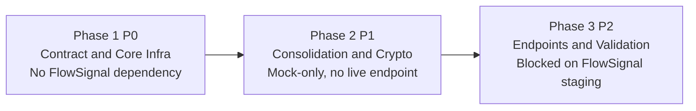
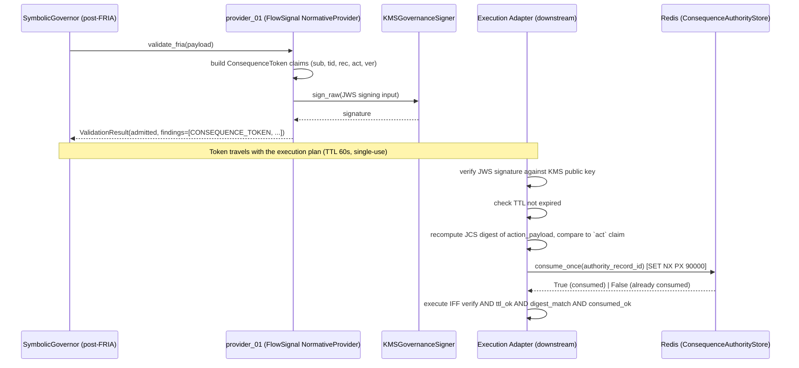

# FlowSignal Integration — Implementation Plan

> **Reference Architecture Note:** This plan describes CAGE-side engineering
> work to promote the `provider_01` (FlowSignal / TrustLayers, see
> [`local/PROVIDER_MAPPING.md`](../local/PROVIDER_MAPPING.md)) integration
> from an interface-ready HTTP stub to a production-grade `NormativeProvider`
> with a hardened post-FRIA consequence boundary. It is an illustrative,
> deployable engineering plan for this reference architecture, not a
> disclosure of live production commitments.

**Status:** Approved for implementation — FlowSignal has accepted CAGE's
Technical Assessment v0.1 and agreed to the two-phase consequence model.
**Depends on:**
[`TECHNICAL_ASSESSMENT_v0.1.md`](../local/integrations/flowsignal/TECHNICAL_ASSESSMENT_v0.1.md),
[`INTEGRATION_ROADMAP.md`](../local/integrations/flowsignal/INTEGRATION_ROADMAP.md)
**Reference architecture:**
[`Secure Plugin & Adapter Architecture Specification.md`](../local/analysis/Secure%20Plugin%20%26%20Adapter%20Architecture%20Specification.md)
**Frozen baseline:** `v0.1-review-candidate`
(`CAGE-FlowSignal-Production-Integration-Candidate-v0.1.zip`)

---

## 1. Executive Summary

FlowSignal (vendor codename **TrustLayers**, integration slot `provider_01`)
has reviewed and accepted CAGE's technical assessment of its "Production
Integration Candidate v0.1" package. Both parties agree that:

1. The **two-phase consequence token model** is the production architecture:
   Governance evaluation (OPA + FlowSignal authority determination) → CAGE
   mints a short-TTL, single-use, KMS-signed **ConsequenceToken** (JWS) →
   Execution adapter verifies the token and atomically consumes it before
   the side-effect runs.
2. **Responsibility boundaries** are fixed:
   - **FlowSignal** owns the external authority-evaluation source and is the
     authoritative record of *why* a decision was made (`ALLOW` /
     `ESCALATE` / `REFUSE`).
   - **CAGE** owns the governance pipeline, the KMS-signed ConsequenceToken,
     the distributed (Redis-Lua) single-use consumption store, and the
     downstream execution evidence chain (RFC 8785 JCS + KMS).
3. **Four integration-contract items** (not architectural concerns) must be
   resolved before the contract is finalized — three are CAGE-owned, one
   (`ESCALATE` mapping) is owned by FlowSignal/Graham and is **out of scope**
   for this plan beyond providing the conformance tests that validate it.
4. The `v0.1-review-candidate` package is **frozen** as the reviewed
   baseline — no further code changes are expected from FlowSignal until the
   CAGE-side re-platforming below lands and the four contract items are
   jointly re-validated.

### Scope of CAGE-side work

This plan covers **only the CAGE-side implementation** required to
re-platform FlowSignal's reference logic onto CAGE's production primitives.
It does **not** cover FlowSignal's own ESCALATE remediation (Graham's P0
item), which is tracked here only as a **dependency and conformance-test
target** (§4, §8).

| Contract Item | Priority | Owner | This Plan's Role |
|---|---|---|---|
| 1. ESCALATE contract mapping | P0 | **Graham/FlowSignal** | Track as dependency; ship conformance tests that assert the expected shape once delivered |
| 2. Distributed consumption store | P0 | **CAGE** | Full implementation — §3 (Phase 1) |
| 3. Provider consolidation | P1 | **CAGE** | Full implementation — §5 (Phase 2) |
| 4. Evidence pipeline integration | P1 | **CAGE** | Full implementation — §5 (Phase 2) |

The work is organized into **three phases**, matching
[`INTEGRATION_ROADMAP.md`](../local/integrations/flowsignal/INTEGRATION_ROADMAP.md):



Phases 1 and 2 are fully executable today against mocks/`fakeredis`/`respx`
with **zero live FlowSignal dependency**. Phase 3 requires FlowSignal staging
access, mTLS material, and written sign-off on the open questions in §9.

---

## 2. Architecture Recap: Two-Phase Consequence Token



Token claims (`sub`, `tid`, `rec`, `act`, `ver`, `iat`, `exp`, `jti`) mirror
FlowSignal's five-field `AuthorityRecordBinding`. See
[`INTEGRATION_ROADMAP.md`](../local/integrations/flowsignal/INTEGRATION_ROADMAP.md)
§"Token Claims" for the full mapping table — this plan does not repeat it.

---

## 3. Phase 1 (P0) — Contract & Core Infrastructure

**Scope:** No FlowSignal wire dependency. Fully testable against
`fakeredis` and `respx` mocks. **This phase can start immediately.**

### 3.1 ESCALATE Contract Mapping (conformance tests only — CAGE side)

**Owner of the fix:** Graham/FlowSignal (P0, external).
**CAGE's role:** Define and ship the conformance tests that FlowSignal's
fix must satisfy, and confirm `provider_01`'s own response-parsing branch
already conforms to the same mapping table (defense in depth — CAGE should
not trust the vendor's fix blindly).

**File:** [`src/integrations/provider_01/provider.py`](../src/integrations/provider_01/provider.py)

Today, `validate_fria()` ([`provider.py:151-209`](../src/integrations/provider_01/provider.py:151))
only parses `admitted` and `findings` directly from the response body — it
has no `decision` field parsing at all. Extend it to parse a `decision`
field of `ALLOW | ESCALATE | REFUSE` (falling back to the current
`admitted`/`findings` shape when `decision` is absent, for backward
compatibility with non-FlowSignal deployments of `provider_01`'s generic
contract).

**Mapping table** (identical semantics to `provider_06`'s tri-state pattern
in [`adapter.py:345-393`](../src/integrations/provider_06/adapter.py:345)):

| FlowSignal `decision` | `ValidationResult.admitted` | `findings[]` entry |
|---|---|---|
| `ALLOW` | `True` | `[]` or informational findings, plus `CONSEQUENCE_TOKEN` entry once Phase 2 lands |
| `REFUSE` | `False` | `{"code": "FLOWSIGNAL_REFUSE", "severity": "blocked", "message": ...}` |
| `ESCALATE` | `False` | `{"code": "FLOWSIGNAL_HOLD", "severity": "review", "needs_human_review": True, "message": ...}` |
| missing/malformed | `False` | `{"code": "PARSE_ERROR", "severity": "blocked", ...}` (fail-closed, consistent with existing `ENDPOINT_ERROR` pattern) |

**Rules:**
- No new exception types are introduced on the CAGE side (mirrors the
  roadmap's explicit rejection of `EscalationSemanticGap` /
  `RuntimeAuthorityUnavailable` as raised exceptions).
- `enforce_fria_boundary()` in
  [`normative_provider.py:538-554`](../src/gateway/governance/normative_provider.py:538)
  already checks `findings[].needs_human_review` and routes to
  `FRIAEnforcementResult(status=DEFER, path="SYNC_GATE_REVIEW")` — **no
  change needed there**. This is the existing `provider_06` code path;
  FlowSignal's ESCALATE mapping reuses it verbatim.

**Code sketch** (`provider.py`, inside `validate_fria()`):

```python
async def validate_fria(self, payload: dict[str, Any]):
    ...
    data = resp.json()
    decision = data.get("decision")

    if decision is not None:
        return self._map_flowsignal_decision(decision, data)

    # Legacy/generic provider_01 contract (non-FlowSignal deployments)
    return ValidationResult(
        admitted=data.get("admitted", False),
        findings=data.get("findings", []),
    )

def _map_flowsignal_decision(self, decision: str, data: dict[str, Any]):
    from src.gateway.governance.normative_provider import ValidationResult

    reason = data.get("reason", "")
    if decision == "ALLOW":
        return ValidationResult(admitted=True, findings=data.get("findings", []))
    if decision == "REFUSE":
        return ValidationResult(
            admitted=False,
            findings=[{
                "code": "FLOWSIGNAL_REFUSE",
                "severity": "blocked",
                "message": reason or "FlowSignal refused authority",
            }],
        )
    if decision == "ESCALATE":
        return ValidationResult(
            admitted=False,
            findings=[{
                "code": "FLOWSIGNAL_HOLD",
                "severity": "review",
                "needs_human_review": True,
                "escalation_code": data.get("escalation_code", "UNSPECIFIED"),
                "message": reason or "FlowSignal requires escalation",
            }],
        )
    return ValidationResult(
        admitted=False,
        findings=[{
            "code": "PARSE_ERROR",
            "severity": "blocked",
            "message": f"Unrecognized FlowSignal decision: {decision!r}",
        }],
    )
```

**Tests:** Extend
[`tests/test_normative_provider_conformance.py`](../tests/test_normative_provider_conformance.py)
with `respx`-mocked FlowSignal-specific cases (new parametrized block, does
not disturb the existing 4 tests): `ALLOW`, `REFUSE`, `ESCALATE` (asserting
`needs_human_review=True` and `escalation_code` propagation), and malformed
`decision` (fail-closed `PARSE_ERROR`).

### 3.2 HITL Timeout & DLQ Policy

**Files:**
[`hitl_escalator.py`](../src/gateway/governance/hitl_escalator.py),
[`defer_queue.py`](../src/gateway/governance/defer_queue.py)

**Current state:** `DeferQueue.park()` ([`defer_queue.py:173-215`](../src/gateway/governance/defer_queue.py:173))
takes the TTL from `DeferToken.ttl_seconds`, which defaults to
`_DEFAULT_TTL = 3600 * 4` (4 hours, [`defer_queue.py:73`](../src/gateway/governance/defer_queue.py:73)).
There is no DLQ routing today — `expire_stale()` ([`defer_queue.py:334-358`](../src/gateway/governance/defer_queue.py:334))
only calls `resolve(defer_id, "EXPIRED")` and logs a warning; it does not
publish anywhere.

**Requirements:**
1. **300s TTL override for FlowSignal escalations.** When
   `provider_01._map_flowsignal_decision()` returns a `FLOWSIGNAL_HOLD`
   finding, the caller building the `DeferToken` (inside
   `enforce_fria_boundary()`'s `SYNC_GATE_REVIEW` branch, or a new
   FlowSignal-specific wrapper) must construct it with
   `ttl_seconds=300` instead of the 4-hour default. Add a new
   `DeferReason.FLOWSIGNAL_ESCALATION` enum member
   ([`defer_queue.py:80-105`](../src/gateway/governance/defer_queue.py:80))
   so the shorter SLA is visible in the OTel span and does not silently
   reuse `EXTERNAL_VALIDATION`'s 4h semantics.
2. **DLQ routing on expiry.** Extend `expire_stale()` to accept an optional
   `dlq_publisher: Callable[[DeferToken], Awaitable[None]] | None` parameter
   (or a class-level hook set at `DeferQueue.__init__`). When a token with
   `defer_reason == DeferReason.FLOWSIGNAL_ESCALATION` expires, publish it
   to the `governance-hitl-dlq` Pub/Sub topic instead of (or in addition
   to) the existing warning log. Keep this **additive and backward
   compatible** — default `dlq_publisher=None` preserves today's behavior
   for all other `DeferReason` values.
3. **HTTP 202 Accepted receipt.** The synchronous DEFER-zone caller (the
   gateway route that invokes `enforce_fria_boundary()`) must return
   `HTTP 202` with an async receipt body (`{"defer_id": ..., "status":
   "pending_review", "poll_url": "/v1/defer/{id}"}`) when a
   `FLOWSIGNAL_HOLD` finding parks the transaction. Identify the concrete
   HTTP route during implementation (search for callers of
   `enforce_fria_boundary(` in `src/gateway/server/`) and confirm no
   existing caller depends on a different status code for the DEFER path
   before changing it.

**Tests:**
- Unit test in `tests/test_defer_queue.py`: token with
  `DeferReason.FLOWSIGNAL_ESCALATION` and `ttl_seconds=300` expires and
  triggers the `dlq_publisher` callback exactly once, with the correct
  `DeferToken` payload.
- Integration test verifying the 202 receipt shape end-to-end through the
  HTTP route identified above.

### 3.3 Redis-Lua Consumption Store

**New file:** `src/gateway/governance/consequence_authority_store.py`

**Pattern precedent:** Follows the atomic Redis pattern already
established in
[`fiscal_limit_guard.py`](../src/gateway/governance/fiscal_limit_guard.py),
but uses the simpler **`SET key value NX PX <ttl_ms>`** primitive (per the
roadmap's explicit preference) rather than `FiscalLimitGuard`'s
WATCH/MULTI/EXEC pipeline, since consumption is a pure single-use marker
with no aggregate counter semantics.

- **Key schema:** `flowsignal:token:<authority_record_id>`
- **Marker TTL:** 90s (exceeds the 60s JWS TTL by a safety margin — see R4
  in §7)
- **Stored value:** SHA-256 binding hash of
  `thread_id:actor_id:action_digest:authority_state_version` (not a bare
  `"consumed"` sentinel), so a second consumption attempt with a
  *different* binding is distinguishable from a legitimate replay of the
  *same* binding (substitution-attack detection, per the vendor's own
  Lua sketch in
  [`TECHNICAL_ASSESSMENT_v0.1.md:99-126`](../local/integrations/flowsignal/TECHNICAL_ASSESSMENT_v0.1.md:99)).

**API surface and code sketch:**

```python
# src/gateway/governance/consequence_authority_store.py

from __future__ import annotations

import hashlib
import logging
import os

logger = logging.getLogger("Gateway.Governance.ConsequenceAuthorityStore")

_KEY_PREFIX = "flowsignal:token:"
_DEFAULT_TTL_SECONDS = 90


class ConsequenceAuthorityStore:
    """Redis-backed single-use consumption store for FlowSignal authority
    records, safe across N GKE replicas.

    Replaces the vendor's SQLite-backed `SQLiteAuthorityConsumptionStore`
    (process-local atomicity only) with a distributed atomic primitive.
    """

    def __init__(self, redis_client: object, ttl_seconds: int = _DEFAULT_TTL_SECONDS) -> None:
        self._redis = redis_client
        self._ttl_seconds = ttl_seconds

    @classmethod
    def from_env(cls) -> "ConsequenceAuthorityStore":
        import redis.asyncio as aioredis

        redis_url = os.environ.get("REDIS_URL", "redis://localhost:6379")
        ttl = int(os.environ.get("FLOWSIGNAL_CONSUMPTION_TTL_SECONDS", str(_DEFAULT_TTL_SECONDS)))
        client = aioredis.from_url(redis_url, decode_responses=True)
        return cls(client, ttl_seconds=ttl)

    @staticmethod
    def binding_hash(thread_id: str, actor_id: str, action_digest: str, state_version: str | None) -> str:
        material = f"{thread_id}:{actor_id}:{action_digest}:{state_version or ''}"
        return hashlib.sha256(material.encode("utf-8")).hexdigest()

    async def consume_once(self, authority_record_id: str, binding: str) -> bool:
        """Atomically consume an authority record. Returns True iff this call
        won the race (i.e. the token had not been consumed with this binding
        before). A different pre-existing binding under the same key is
        treated as a substitution attempt and also returns False (fail-closed)
        — callers should distinguish the two cases via `get_binding()` for
        audit/alerting (BINDING_MISMATCH vs ALREADY_CONSUMED), per R1 in the
        roadmap's risk register.
        """
        key = f"{_KEY_PREFIX}{authority_record_id}"
        # redis-py: SET key value NX EX ttl -> True if set, None if key existed
        result = await self._redis.set(key, binding, nx=True, ex=self._ttl_seconds)
        if result:
            return True
        logger.warning(
            "[ConsequenceAuthorityStore] consume_once REJECTED authority_record_id=%s "
            "(already consumed or contended)",
            authority_record_id,
        )
        return False

    async def get_binding(self, authority_record_id: str) -> str | None:
        """Return the stored binding hash for audit/diagnostic use, or None
        if unset/expired."""
        key = f"{_KEY_PREFIX}{authority_record_id}"
        return await self._redis.get(key)
```

**Hardening patterns applied:**

| Pattern | Detail |
|---|---|
| Binding value, not sentinel | SHA-256 binding hash stored, not `"consumed"` |
| Atomic primitive | `SET NX PX` — single round-trip, no WATCH/MULTI/EXEC needed |
| No blocking Lua | This implementation uses redis-py's native `SET NX EX` rather than a custom Lua script, since a single-key `SET NX` is already atomic without scripting — simpler and avoids the `register_script()`/SHA1 caching complexity `fiscal_limit_guard.py` needs for its multi-command pipelines. If a future requirement needs multi-key atomicity (e.g. writing an audit index in the same transaction), revisit and adopt a registered Lua script at that time. |
| Fail-closed on Redis error | `consume_once()` must propagate the exception, not silently return `True`/`False` — callers (§5.1) apply the fail-closed policy from the roadmap's Failure Mode table (Redis error → treat as `BLOCK`) |

**Tests:** New `tests/test_consequence_authority_store.py` using
`fakeredis.aioredis.FakeRedis`, following the fixture pattern in
[`tests/test_fiscal_limit_guard.py`](../tests/test_fiscal_limit_guard.py):
- Happy path: first `consume_once()` returns `True`.
- Replay: second `consume_once()` with the same binding returns `False`.
- Substitution: second `consume_once()` with a *different* binding under
  the same key returns `False`, and `get_binding()` shows the original
  (unmodified) value.
- TTL expiry: after `ttl_seconds` elapses (simulate via `fakeredis`
  time-control or a short TTL + `asyncio.sleep`), the key is gone and
  consumption succeeds again.
- Concurrency: `asyncio.gather()` of N concurrent `consume_once()` calls
  with the same `authority_record_id` — exactly one returns `True`.
- Redis connection error → exception propagates (no silent success).

---

## 4. Phase 1 Compliance Artifact (lands with Phase 1 PR)

Per [`AGENTS.md`](../AGENTS.md#compliance-artifact-obligations), any PR that
adds Kubernetes-visible resources or a new Redis namespace must include a
Lula validation update in the **same PR**. Since Phase 1 introduces the
`flowsignal:token:*` Redis key namespace, create
`compliance/lula/lula-validation-flowsignal.yaml` in the Phase 1 PR (not
deferred to Phase 2/3), following the structure of
[`lula-validation-tqp007.yaml`](../compliance/lula/lula-validation-tqp007.yaml).

**Assertions (per the roadmap's Compliance Validation section):**
1. `CAGE_NORMATIVE_PROVIDER=provider_01` sourced via env var (not hardcoded).
2. All FlowSignal secrets (`FLOWSIGNAL_CLIENT_CERT`, `FLOWSIGNAL_CLIENT_KEY`,
   `FLOWSIGNAL_CA_BUNDLE`) referenced via `secretKeyRef` on the gateway
   Deployment — never `value:` inline.
3. Redis key namespace `flowsignal:token:*` does not collide with existing
   prefixes (`fiscal:*`, `DEFER:*`, `safety:*`) — assert via a `not
   startswith` OPA check against the deployment's documented namespace list.
4. `REDIS_URL` env var present on the gateway Deployment (consumption store
   dependency).

This is a **new, additive** Lula file — it does not modify any existing
validation. Map it in `compliance/oscal/component-definition.yaml` within 2
business days of merge (tracked in §8).

---

## 5. Phase 2 (P1) — Consolidation & Crypto

**Scope:** Depends on Phase 1 landing first. Still no live FlowSignal
endpoint — uses `respx` mocks throughout.

### 5.1 Code Extraction — `consequence_gateway.py`

**New file:** `src/gateway/governance/consequence_gateway.py`

Ported from the vendor's `adapter/consequence_gateway.py` (preserved
6-step check sequence per the Technical Assessment's explicit
recommendation — "I recommend preserving this logic as we integrate"),
with these CAGE-side substitutions:

| Vendor concept | CAGE replacement |
|---|---|
| `AuthorityRecordBinding` dataclass | Verified `ConsequenceTokenClaims` (from `consequence_token.py`, §5.4) |
| `InMemoryAuthorityConsumptionStore` / `SQLiteAuthorityConsumptionStore` | `ConsequenceAuthorityStore` (Phase 1, §3.3) |
| Duplicated `authority_state_version` mismatch check (vendor bug) | Collapsed to a single check — **do not port the duplication** |
| `ConsequenceDecision` enum (`EXECUTE \| HOLD \| BLOCK`) | Unchanged — port as-is |

**Code sketch:**

```python
# src/gateway/governance/consequence_gateway.py

from __future__ import annotations

import hashlib
import logging
from dataclasses import dataclass
from enum import Enum

from src.gateway.governance.consequence_authority_store import ConsequenceAuthorityStore
from src.gateway.governance.consequence_token import ConsequenceToken, ConsequenceTokenError
from src.gateway.governance.jcs_canonicalizer import jcs_canonicalize_plan

logger = logging.getLogger("Gateway.Governance.ConsequenceGateway")


class ConsequenceDecision(str, Enum):
    EXECUTE = "EXECUTE"
    HOLD = "HOLD"
    BLOCK = "BLOCK"


@dataclass
class ConsequenceEvaluation:
    decision: ConsequenceDecision
    reason_code: str
    detail: str = ""


class ConsequenceGateway:
    """Vendor-agnostic post-FRIA consequence boundary. Verifies a
    ConsequenceToken, re-derives the action digest, and atomically
    consumes the authority record before permitting execution.

    Preserves FlowSignal's 6-step check sequence:
      1. JWS signature verification (via ConsequenceToken.verify)
      2. TTL / expiry check
      3. Recompute JCS digest of the action payload
      4. Compare recomputed digest to the `act` claim
      5. Atomic single-use consumption (ConsequenceAuthorityStore)
      6. Emit EXECUTE / HOLD / BLOCK decision with reason code
    """

    def __init__(self, store: ConsequenceAuthorityStore, signer) -> None:
        self._store = store
        self._signer = signer

    async def evaluate(self, token: str, action_payload: dict) -> ConsequenceEvaluation:
        # Steps 1-2: signature + TTL (raises ConsequenceTokenError on failure)
        try:
            claims = ConsequenceToken.verify(token, signer=self._signer)
        except ConsequenceTokenError as exc:
            logger.warning("[ConsequenceGateway] token verification failed: %s", exc)
            return ConsequenceEvaluation(ConsequenceDecision.BLOCK, "TOKEN_INVALID", str(exc))

        # Steps 3-4: JCS digest re-verification (closes TOCTOU gap)
        recomputed = hashlib.sha256(jcs_canonicalize_plan(action_payload)).hexdigest()
        if recomputed != claims.act:
            logger.warning(
                "[ConsequenceGateway] ACTION_BINDING_MISMATCH rec=%s", claims.rec
            )
            return ConsequenceEvaluation(ConsequenceDecision.BLOCK, "ACTION_BINDING_MISMATCH")

        # Step 5: atomic single-use consumption
        binding = ConsequenceAuthorityStore.binding_hash(
            claims.tid, claims.sub, claims.act, claims.ver
        )
        try:
            consumed = await self._store.consume_once(claims.rec, binding)
        except Exception as exc:
            logger.error("[ConsequenceGateway] Redis error during consumption: %s", exc)
            return ConsequenceEvaluation(ConsequenceDecision.BLOCK, "REDIS_ERROR", str(exc))

        if not consumed:
            existing = await self._store.get_binding(claims.rec)
            reason = "ALREADY_CONSUMED" if existing == binding else "AUTHORITY_RECORD_BINDING_MISMATCH"
            return ConsequenceEvaluation(ConsequenceDecision.BLOCK, reason)

        # Step 6: EXECUTE
        return ConsequenceEvaluation(ConsequenceDecision.EXECUTE, "OK")
```

**Vendor isolation check:** `consequence_gateway.py` lives in
`src/gateway/governance/` (kernel), not `src/integrations/provider_01/`.
Per the Plugin & Adapter Architecture Specification, `provider_01` may
import kernel governance modules, never the reverse — add/extend the
import-boundary test (`tests/test_governance_architecture.py` or
equivalent) to assert `src/gateway/governance/consequence_gateway.py`
has zero imports from `src.integrations.*`.

### 5.2 Provider Consolidation (`provider_01`)

**File:** [`src/integrations/provider_01/provider.py`](../src/integrations/provider_01/provider.py)

Resolves Contract Item 3 (Provider Consolidation) using the **composable
provider** approach recommended in the Technical Assessment
([`TECHNICAL_ASSESSMENT_v0.1.md:139-156`](../local/integrations/flowsignal/TECHNICAL_ASSESSMENT_v0.1.md:139)):
FlowSignal remains the sole `provider_01` implementation (no
`provider_07`/parallel registration), but its role narrows to:

1. `validate_fria()` becomes the **token-minting** side: on `ALLOW`, mint a
   `ConsequenceToken` (via `consequence_token.py`, §5.4) and attach it as a
   structured `findings[]` entry:
   ```python
   {"code": "CONSEQUENCE_TOKEN", "severity": "info", "token": "<jws>"}
   ```
2. Downstream consumption happens in the **execution adapter** — outside
   `provider_01`'s scope — by calling `ConsequenceGateway.evaluate()`
   (§5.1) with the token attached to the execution plan.
3. `provider_01` continues to own `fetch_baseline()` and `submit_evidence()`
   HTTP round-trips (Phase 3, §6) — the composition is at the *evidence
   pipeline* layer (§5.3), not by delegating to a second provider instance.
   This is a lighter-weight consolidation than the vendor's original
   `ComposedNormativeProvider(authority_source, evidence_sink)` sketch: CAGE
   already has one canonical evidence pipeline
   (`jcs_canonicalize_plan()` + `KMSGovernanceSigner`), so `provider_01`
   calls into it directly rather than wrapping a second provider object.
4. Preserve vendor isolation: `provider_01` imports
   `src.gateway.governance.consequence_token` and
   `src.gateway.governance.jcs_canonicalizer` (kernel → OK), never the
   reverse.

### 5.3 Evidence Pipeline (JCS + KMS)

**Gap being closed:** `provider.py` has no `evidence_hash()`-style function
today, but the *general* pattern this replaces
(`json.dumps(sort_keys=True)`, vulnerable to float-representation drift
across Python/Go/JS) exists both in the vendor's `production_evidence.py`
and in CAGE's own
[`normative_provider.py:410-413`](../src/gateway/governance/normative_provider.py:410)
(`_async_attestation`'s evidence hash construction). Both call sites must
be migrated in this phase — **it would be inconsistent to fix the vendor's
copy while leaving CAGE's own `json.dumps(sort_keys=True)` call in
`_async_attestation()` unpatched.**

**`act` claim digest (ConsequenceToken minting, `provider.py`):**
```python
import hashlib
from src.gateway.governance.jcs_canonicalizer import jcs_canonicalize_plan

action_digest = hashlib.sha256(jcs_canonicalize_plan(action_payload)).hexdigest()
```

**`_async_attestation()` evidence hash (`normative_provider.py:410-413`):**
Replace:
```python
hashlib.sha256(json.dumps(action_context, sort_keys=True).encode()).hexdigest()
```
with:
```python
hashlib.sha256(jcs_canonicalize_plan(action_context)).hexdigest()
```
This is a small, isolated, backward-compatible-at-the-interface-level
change (same function signature, same return type) but changes the
*hash value* for any payload containing floats — flag this explicitly in
the PR description as a **breaking change for any external system that
independently recomputes this hash** (none currently known, but confirm
via a repo-wide grep for consumers of `_async_attestation`'s evidence
hash before merging).

**Tests:**
- `tests/test_jcs_canonicalizer.py` (if not already present, extend it):
  round-trip test confirming `jcs_canonicalize_plan()` produces identical
  bytes for semantically-equal payloads with different key ordering and
  float representations (e.g. `1.0` vs `1.00`).
- New test asserting `provider_01`'s `act` claim uses
  `jcs_canonicalize_plan()`, not `json.dumps`.
- Regression test for `_async_attestation()` confirming the evidence hash
  changed call path still produces a valid SHA-256 hex digest.

### 5.4 ConsequenceToken JWS Implementation

**New file:** `src/gateway/governance/consequence_token.py`

**Signing:** Reuse `KMSGovernanceSigner.sign_raw()`
([`kms_signer.py:391-439`](../src/gateway/governance/kms_signer.py:391),
already implements multi-cloud KMS signing with HMAC fallback disabled per
project policy) — **zero new KMS keys or secrets**.

**Code sketch:**

```python
# src/gateway/governance/consequence_token.py

from __future__ import annotations

import base64
import json
import time

from src.gateway.governance.kms_signer import KMSGovernanceSigner


class ConsequenceTokenError(Exception):
    """Raised on bad signature, expired token, or malformed claims."""


from dataclasses import dataclass


@dataclass(frozen=True)
class ConsequenceTokenClaims:
    sub: str   # actor_id
    tid: str   # thread_id
    rec: str   # authority_record_id (single-use key, == jti)
    act: str   # RFC 8785 JCS SHA-256 digest of the action payload
    ver: str | None
    iat: int
    exp: int
    jti: str


def _b64url(data: bytes) -> str:
    return base64.urlsafe_b64encode(data).rstrip(b"=").decode("ascii")


def _b64url_decode(data: str) -> bytes:
    padding = "=" * (-len(data) % 4)
    return base64.urlsafe_b64decode(data + padding)


class ConsequenceToken:
    """Short-TTL, single-use JWS carrying the FlowSignal authority
    decision from validate_fria() to the downstream execution adapter."""

    @classmethod
    def mint(
        cls, *, sub: str, tid: str, rec: str, act: str, ver: str | None = None,
        ttl_seconds: int = 60, signer: KMSGovernanceSigner,
    ) -> str:
        now = int(time.time())
        header = {"alg": signer.signing_algorithm, "typ": "JWT", "kid": signer.key_id}
        payload = {
            "sub": sub, "tid": tid, "rec": rec, "act": act, "ver": ver,
            "iat": now, "exp": now + ttl_seconds, "jti": rec,
        }
        signing_input = (
            _b64url(json.dumps(header, sort_keys=True).encode())
            + "." + _b64url(json.dumps(payload, sort_keys=True).encode())
        )
        signature = signer.sign_raw(signing_input.encode("ascii"))
        return f"{signing_input}.{_b64url(signature)}"

    @classmethod
    def verify(cls, token: str, *, signer: KMSGovernanceSigner) -> ConsequenceTokenClaims:
        try:
            header_b64, payload_b64, sig_b64 = token.split(".")
        except ValueError as exc:
            raise ConsequenceTokenError(f"malformed token: {exc}") from exc

        payload = json.loads(_b64url_decode(payload_b64))

        # Fail-fast: check TTL before signature verification (per roadmap)
        now = int(time.time())
        if now > payload.get("exp", 0):
            raise ConsequenceTokenError("token expired")

        signing_input = f"{header_b64}.{payload_b64}".encode("ascii")
        if not signer.verify_raw(signing_input, _b64url_decode(sig_b64)):
            raise ConsequenceTokenError("bad signature")

        return ConsequenceTokenClaims(
            sub=payload["sub"], tid=payload["tid"], rec=payload["rec"],
            act=payload["act"], ver=payload.get("ver"),
            iat=payload["iat"], exp=payload["exp"], jti=payload["jti"],
        )
```

> **Implementation note:** `KMSGovernanceSigner` currently exposes
> `sign_raw()` ([`kms_signer.py:588`](../src/gateway/governance/kms_signer.py:588))
> but the plan assumes a corresponding `verify_raw()` and a `key_id`
> property exist or will be added — confirm during implementation kickoff
> whether verification is done client-side against a cached public key or
> requires a KMS round-trip, and adjust the sketch's `verify()` accordingly
> (this affects the p99 latency budget noted in the roadmap's "KMS
> Unavailability" failure table).

**TTL enforcement:** `exp = iat + ttl_seconds` (default 60s), checked
**before** signature verification (fail-fast, avoids unnecessary KMS calls
on already-expired tokens — also mitigates R6, KMS latency on the hot
path).

**Tests:** New `tests/test_consequence_token.py`:
- Round-trip: `mint()` → `verify()` returns the original claims.
- Tampered signature: flip one byte in the signature segment → `verify()`
  raises `ConsequenceTokenError`.
- Expired token: mint with `ttl_seconds=-1` → `verify()` raises before
  attempting signature verification (assert via mock call-count on the
  signer).
- Digest mismatch: claims carry a stale `act`; caller-side
  `ConsequenceGateway` (§5.1) test asserts `ACTION_BINDING_MISMATCH`, not a
  `ConsequenceToken`-level failure (separation of concerns: token
  verification vs. gateway-level digest re-check).
- Algorithm confusion: token with `alg: none` in the header is rejected.

---

## 6. Phase 3 (P2) — Endpoints & Validation (Blocked on FlowSignal)

**Scope:** Prior phases (1-2) are fully hermetic. Phase 3 is the only phase
requiring live FlowSignal staging access — but its *test-writing* work
(respx-mocked status matrices) can start immediately; only the final live
mTLS validation step is genuinely blocked.

### 6.1 `fetch_baseline()` Implementation

**File:** [`provider.py:114-149`](../src/integrations/provider_01/provider.py:114)
(already implemented against the generic 3-endpoint contract — this task
is *test coverage*, not new code, unless FlowSignal's response shape
diverges from the generic contract per §9 Q2).

Add `respx`-mocked tests for the full status matrix:
- `200` — happy path, verify `NormativeBaseline.profile`/`etag` population.
- `429` — rate limit, confirm graceful degradation (no retry storm).
- `500` — server error, confirm `NormativeBaseline.error` populated,
  fail-closed.
- Malformed JSON body — confirm exception is caught and surfaced as
  `NormativeBaseline.error`, not propagated.

### 6.2 `submit_evidence()` Implementation

**Decision needed with Graham (blocks this subsection only — see §9 Q3):**
confirm whether FlowSignal expects just `evidence_hash` or the richer
`ProductionEvidenceRecord` shape referenced in the vendor package.

Once resolved, add `respx` tests mirroring §6.1's status matrix
(`200`/`429`/`500`/malformed) against
[`provider.py:211-248`](../src/integrations/provider_01/provider.py:211).

### 6.3 Conformance Suite Integration

Add FlowSignal-specific cases to
[`tests/test_normative_provider_conformance.py`](../tests/test_normative_provider_conformance.py)
(extending, not replacing, the Phase 1 additions from §3.1):
- `ESCALATE → needs_human_review` mapping test, run against **Graham's
  actual fix** once delivered (not just CAGE's own mock) — this is the
  concrete conformance gate for Contract Item 1.
- `ConsequenceToken` presence/shape assertion on `ALLOW` (the
  `CONSEQUENCE_TOKEN` finding entry from §5.2).

### 6.4 GKE mTLS Validation

Live validation against FlowSignal staging — **genuinely blocked** until
FlowSignal staging access is granted (§7, dependency #1).

**Required secrets (via `secretKeyRef` — never `value:` inline, per
[`AGENTS.md`](../AGENTS.md#secret-hygiene)):**
- `FLOWSIGNAL_CA_BUNDLE`
- `FLOWSIGNAL_CLIENT_CERT`
- `FLOWSIGNAL_CLIENT_KEY`

**Validation checklist (from the roadmap, reproduced here as the Phase 3
acceptance gate — not duplicated elsewhere in this plan):**
- [ ] Incomplete TLS configuration fails closed
- [ ] Plain HTTP staging endpoint is rejected
- [ ] CA verification succeeds against real cert chain
- [ ] Client certificate authenticates successfully
- [ ] HTTP 401 returns `admitted=False`, no token minted
- [ ] TLS/certificate failure does not create authority
- [ ] Full `ALLOW` round-trip mints verifiable ConsequenceToken
- [ ] Full `ESCALATE` round-trip parks correctly in DeferQueue

This validation must run via Cloud Build against the GKE dev cluster per
[`docs/operations/DEPLOYMENT_RULES.md`](../docs/operations/DEPLOYMENT_RULES.md)
— **never** `docker build` locally for the gateway image under test.

---

## 7. Dependency Tracking

### 7.1 Can Proceed Now (No FlowSignal Dependency)

| Item | Section | Blocking Condition |
|---|---|---|
| ESCALATE conformance test scaffolding (CAGE-side mock) | §3.1 | None |
| HITL 300s TTL + DLQ routing | §3.2 | None |
| `ConsequenceAuthorityStore` (Redis-Lua) | §3.3 | None |
| `lula-validation-flowsignal.yaml` | §4 | None (must land with §3.3's Redis namespace) |
| `consequence_gateway.py` extraction | §5.1 | Phase 1 merged |
| Provider consolidation (`provider_01` token-minting) | §5.2 | §5.1, §5.4 merged |
| JCS evidence pipeline migration (both call sites) | §5.3 | None (independent of §5.1/5.2/5.4) |
| `ConsequenceToken` JWS mint/verify | §5.4 | Confirm `KMSGovernanceSigner.verify_raw()` exists (§9 Q6) |
| `fetch_baseline()` / `submit_evidence()` respx test matrices | §6.1, §6.2 (tests only) | None — write against the *current* generic contract; re-run once FlowSignal confirms response shape |
| Conformance suite extension (mock-only cases) | §6.3 | None |

### 7.2 Blocked on FlowSignal (External Dependency)

| Item | Section | Blocks | Owner |
|---|---|---|---|
| ESCALATE → `ValidationResult` mapping fix | Roadmap Contract Item 1 | §6.3's "run against Graham's actual fix" gate | Graham/FlowSignal |
| Final response schema (`decision` field values, `authority_state_version` population) | §9 Q1, Q2 | §3.1, §5.4 finalization | Joint |
| Evidence endpoint payload shape (hash-only vs. richer record) | §9 Q3 | §6.2 | Graham/FlowSignal |
| Authority-state version semantics (per-actor/thread/global epoch) | §9 Q4 | §5.1's `ver` claim handling | Graham/FlowSignal |
| FlowSignal staging access, mTLS material | §6.4 | §6.4 only | Graham/FlowSignal |
| Consequence boundary placement confirmation | §9 Q5 | Phase 3 design (already resolved per Technical Assessment — tracked for written sign-off only) | Joint |

**Key principle:** every item in §7.2 has already been engineered around in
Phases 1-2 using conservative defaults or mocks, so **no CAGE engineering
work is idle-blocked**. The blocked items gate *final validation and
sign-off*, not implementation start.

---

## 8. Risk Mitigation (R1–R8 from the Roadmap)

| ID | Risk | Phase | Mitigation (as implemented in this plan) |
|---|---|---|---|
| **R1** | TOCTOU on authority consumption | P0 | §3.3's `SET NX PX` atomic primitive replaces check-then-write; substitution vs. replay distinguished via binding-hash comparison, not a bare sentinel |
| **R2** | Clock skew | P2 | §5.4 uses CAGE-minted `iat`/`exp` exclusively (never trusts FlowSignal's clock); recommend a ±2s grace window on `exp` comparison — add as a follow-up tuning parameter, not hardcoded |
| **R3** | DLQ overflow | P1 | §3.2's DLQ routing is paired with the roadmap's circuit-breaker recommendation (N=10 failures/60s) — circuit breaker itself is Phase 3/operational-hardening scope (§6, not blocking Phase 1/2 merge) |
| **R4** | TTL mismatch | P0 | §3.3 marker TTL (90s) is fixed at 1.5× the token TTL (60s) with the relationship documented in code comments — any future TTL tuning must preserve this ratio |
| **R5** | `findings`-field token leakage | P2 | §5.2's `CONSEQUENCE_TOKEN` finding must be added to the existing PII/secret redaction filter (`pii_sanitizer.py` or logging middleware) before Phase 2 merges — **new explicit task**, not previously enumerated: add `CONSEQUENCE_TOKEN` and raw JWS strings to the log-scrubbing denylist |
| **R6** | KMS latency on hot path | P2 | §5.4's fail-fast TTL check before signature verification avoids unnecessary KMS round-trips on expired tokens; token minting/verification only occurs in the DEFER-zone synchronous gate (`enforce_fria_boundary`'s `SYNC_GATE_*` paths), not the ASYNC_ATTESTATION hot path |
| **R7** | Evidence contract mismatch | P2 | Tracked as Open Question §9 Q3; §6.2 is explicitly gated on this resolution before implementation, not before test-writing |
| **R8** | Duplicate/dead-code ported | P1 | §5.1 explicitly calls out **not** porting the vendor's duplicated `authority_state_version` check; code review must diff against the vendor's `adapter/consequence_gateway.py` line-by-line per the roadmap's mitigation |

**Additional risks not in the original R1-R8 register but surfaced during
this plan's development:**

| ID | Risk | Mitigation |
|---|---|---|
| R9 (roadmap) | Vendor isolation violation | Import-boundary test enforcement — see §5.1's explicit test requirement |
| R10 (roadmap) | mTLS staging unavailability | Phases 1-2 and §6.1-6.3 complete independently, per §7.1 |
| **New** | `_async_attestation()` evidence-hash change alters historical hash values | §5.3 explicitly calls out this as a breaking-change-for-external-verifiers risk; must be confirmed via grep before merge and flagged in the PR/CHANGELOG |
| **New** | `KMSGovernanceSigner.verify_raw()` may not exist yet | §5.4 flags this as an implementation-kickoff blocker; must be resolved (build it if missing) before `consequence_token.py` can be completed — see §9 Q6 |

---

## 9. Open Questions (Require FlowSignal Response)

These map directly to the roadmap's "Dependencies & Prerequisites" section,
restated here as explicit questions for the joint session:

1. **Final response schema** — What are the exact `decision` field values
   (confirm `ALLOW`/`ESCALATE`/`REFUSE` are the only three, case-sensitivity,
   and whether `escalation_code` will be a fixed enum or free-text)? Blocks
   §3.1 and §5.4 finalization.
2. **`authority_state_version` population** — Is this field always present
   on `ALLOW`/`ESCALATE` responses, or optional? Blocks the `ver` claim's
   nullability handling in `consequence_token.py` (§5.4).
3. **Evidence endpoint payload shape** — Does FlowSignal's evidence endpoint
   expect just `evidence_hash`, or the richer `ProductionEvidenceRecord`
   structure from the vendor package? Blocks §6.2.
4. **Authority-state version semantics** — Is `authority_state_version`
   per-actor, per-thread, or a global epoch? Affects whether the Redis key
   namespace (§3.3) needs a region/actor prefix for correctness (also ties
   into the roadmap's Multi-Region "Authority State Replication" guidance).
5. **Consequence boundary placement (written sign-off)** — The Technical
   Assessment already recommends registering `evaluate_consequence()` as a
   callable from CAGE's saga node factory, not inlined into
   `enforce_fria_boundary()`. This plan implements it that way (§5.1). We
   need Graham's **written confirmation** that this matches FlowSignal's
   expectation before Phase 3 design is finalized.
6. **`KMSGovernanceSigner.verify_raw()` availability** — Internal CAGE
   question (not FlowSignal-facing), but blocking: does a `verify_raw()`
   counterpart to `sign_raw()` already exist, or must it be added as part
   of Phase 2? If it must be added, this becomes a new sub-task under §5.4
   with its own review (asymmetric-signature verification is
   security-sensitive and should get dedicated reviewer attention).
7. **Timeout/failure policy acceptability** — Confirm the 300s HITL SLA
   (§3.2) and 60s token TTL (§5.4) are acceptable to FlowSignal's own SLA
   commitments, since a FlowSignal-side authority record could theoretically
   remain valid on their side longer than CAGE's token TTL.
8. **Redis as consumption store** — Explicit confirmation (not blocking,
   informational) that FlowSignal has no objection to Redis (vs. a
   database) being the consumption-store backend, since the vendor's
   original package used SQLite.

---

## 10. Timeline (Phased, No Time Estimates)

Per project convention, this plan does not assign duration estimates.
Sequencing and gating conditions are as follows:

1. **Phase 1 (P0)** — Start immediately. Land as 2-3 separate PRs to keep
   review scope manageable:
   - PR 1: §3.1 (ESCALATE mapping in `provider_01`) + conformance tests
   - PR 2: §3.2 (HITL TTL override + DLQ routing)
   - PR 3: §3.3 (`ConsequenceAuthorityStore`) + §4 (Lula validation, same PR
     per AGENTS.md requirement)
2. **Phase 2 (P1)** — Start after Phase 1 PRs merge (or in parallel on a
   feature branch, rebasing before merge, if reviewer bandwidth allows).
   Recommended PR split:
   - PR 4: §5.4 (`consequence_token.py`) — foundational, needed by §5.1
   - PR 5: §5.1 (`consequence_gateway.py`) — depends on PR 4
   - PR 6: §5.2 (provider consolidation) — depends on PR 4, PR 5
   - PR 7: §5.3 (JCS evidence pipeline migration, both call sites) —
     independent, can land any time after Phase 1
3. **Phase 3 (P2)** — Test-writing (§6.1-6.3) can start as soon as Phase 2
   lands. Live validation (§6.4) starts only once FlowSignal staging access
   (§7.2) is granted.
4. **OSCAL component-definition update** — within 2 business days of any
   PR merge that touches a NIST SP 800-53 control implementation (per
   AGENTS.md) — applies to PR 3 (new Redis namespace / consumption control)
   at minimum; assess each subsequent PR individually.

```mermaid
gantt
    dateFormat  X
    axisFormat %s
    section Phase 1 (P0)
    PR1 ESCALATE mapping + tests      :p1a, 0, 1
    PR2 HITL TTL + DLQ                :p1b, 0, 1
    PR3 ConsequenceAuthorityStore + Lula :p1c, 0, 1
    section Phase 2 (P1)
    PR4 consequence_token.py          :p2a, after p1c, 1
    PR5 consequence_gateway.py        :p2b, after p2a, 1
    PR6 provider consolidation        :p2c, after p2b, 1
    PR7 JCS evidence pipeline         :p2d, after p1c, 1
    section Phase 3 (P2)
    Test matrices (respx)             :p3a, after p2c, 1
    Live GKE mTLS validation          :p3b, after p3a, 1
```



---

## 11. Test Strategy

### 11.1 Unit Tests

| Test File | Coverage |
|---|---|
| `tests/test_consequence_authority_store.py` (new) | `SET NX PX` semantics, replay, substitution, TTL expiry, concurrency, Redis-error fail-closed |
| `tests/test_consequence_token.py` (new) | JWS mint/verify round-trip, tampered signature, expired token, algorithm confusion |
| `tests/test_consequence_gateway.py` (new) | 6-step evaluation sequence, all `ConsequenceDecision` outcomes, digest mismatch, Redis error propagation |
| `tests/test_defer_queue.py` (extend) | `DeferReason.FLOWSIGNAL_ESCALATION` 300s TTL, DLQ publish callback on expiry |
| `tests/test_jcs_canonicalizer.py` (extend) | Float-drift determinism for both call sites migrated in §5.3 |

### 11.2 Conformance Tests

| Location | New Coverage |
|---|---|
| `tests/test_normative_provider_conformance.py` | FlowSignal `ALLOW`/`REFUSE`/`ESCALATE`/malformed `decision` mapping (§3.1); `CONSEQUENCE_TOKEN` finding shape assertion on `ALLOW` (§6.3); re-run against Graham's real ESCALATE fix once delivered |
| Import-boundary test (extend existing architecture test) | `consequence_gateway.py` has zero `src.integrations.*` imports (§5.1) |

### 11.3 Integration Tests

| Scenario | Test |
|---|---|
| HTTP 202 DEFER receipt | End-to-end through the gateway route calling `enforce_fria_boundary()` (§3.2) |
| Full mock round-trip | `ALLOW` → mint → verify → consume → `EXECUTE`, using `respx` for FlowSignal and `fakeredis` for consumption (Phase 2 completion gate) |

### 11.4 Live GKE Integration (Phase 3 only, blocked)

Per [`AGENTS.md`](../AGENTS.md#test-execution) test-execution conventions:
```bash
uv run pytest tests/ --run-integration -v --tb=short
```
run against the live dev cluster (via `scripts/port_forward_dev.sh`) once
FlowSignal staging access is available, covering the §6.4 checklist.

### 11.5 Security / Chaos Tests (from the Roadmap, tracked not duplicated)

Reuse the roadmap's existing Security Testing and Chaos Engineering tables
verbatim as the acceptance bar for Phase 2/3 — this plan does not restate
them; implementers should cross-reference
[`INTEGRATION_ROADMAP.md`](../local/integrations/flowsignal/INTEGRATION_ROADMAP.md#security-testing)
directly when writing `test_consequence_gateway.py` and
`test_consequence_authority_store.py`.

All new/modified test files must run under:
```bash
uv run pytest tests/ -m "local or unit" -n auto --dist=loadfile --tb=short
```

---

## 12. Compliance Checklist

- [ ] `compliance/lula/lula-validation-flowsignal.yaml` created in the same
      PR as the `flowsignal:token:*` Redis namespace change (§4) — **not**
      deferred to a follow-on PR.
- [ ] Lula assertions cover: env-var-sourced provider selection,
      `secretKeyRef`-only secrets, Redis namespace non-collision,
      `REDIS_URL` presence.
- [ ] `compliance/oscal/component-definition.yaml` updated within **2
      business days** of merging any PR that touches a NIST SP 800-53
      control implementation (per AGENTS.md) — specifically PR 3
      (consumption store / replay-protection control) and PR 5
      (consequence-boundary control), at minimum.
- [ ] `docs/POAM.md` updated if this work closes or partially closes any
      open POAM finding (check for an existing FlowSignal/`provider_01`
      entry before starting; none identified during this plan's research,
      but confirm at implementation kickoff).
- [ ] License headers (Apache 2.0) present on all new files:
      `consequence_authority_store.py`, `consequence_gateway.py`,
      `consequence_token.py`, and all new test files.
- [ ] No secrets, credentials, or PII embedded in any new file — in
      particular, no FlowSignal mTLS material or sample JWS tokens
      containing real signatures committed to the repo (mock/test fixtures
      must use clearly-fake key material).
- [ ] `CONSEQUENCE_TOKEN` finding values and raw JWS strings added to the
      log-scrubbing/redaction denylist before Phase 2 merges (R5, §8).
- [ ] `scripts/check_stpa_freshness.py` run if any STPA source file is
      touched by this work (not currently anticipated, but verify at PR
      time since `consequence_gateway.py` introduces a new governance
      boundary that may warrant an STPA control-structure update).
- [ ] Commit messages and PR titles follow Conventional Commits with scope
      `governance` (e.g. `feat(governance): add Redis-Lua consequence
      authority store`) per
      [`CONTRIBUTING.md`](../CONTRIBUTING.md#commit-message-standard).
- [ ] All PRs squash-merged per
      [`AGENTS.md`](../AGENTS.md#branch-naming--merge-strategy) — no
      exceptions.

---

## 13. File Change Manifest (Consolidated)

| File | Phase | Action |
|---|---|---|
| [`src/integrations/provider_01/provider.py`](../src/integrations/provider_01/provider.py) | P0, P1, P2 | Modify |
| `src/gateway/governance/consequence_authority_store.py` | P0 | New |
| `src/gateway/governance/consequence_gateway.py` | P1 | New |
| `src/gateway/governance/consequence_token.py` | P1 | New |
| [`src/gateway/governance/hitl_escalator.py`](../src/gateway/governance/hitl_escalator.py) | P0 | Modify (see §3.2 — may be no-op if TTL override lives entirely in `defer_queue.py`/caller) |
| [`src/gateway/governance/defer_queue.py`](../src/gateway/governance/defer_queue.py) | P0 | Modify — new `DeferReason.FLOWSIGNAL_ESCALATION`, DLQ hook in `expire_stale()` |
| [`src/gateway/governance/normative_provider.py`](../src/gateway/governance/normative_provider.py) | P1 | Modify — `_async_attestation()` JCS migration (§5.3) |
| [`tests/test_normative_provider_conformance.py`](../tests/test_normative_provider_conformance.py) | P0, P2 | Modify |
| `tests/test_consequence_authority_store.py` | P0 | New |
| `tests/test_consequence_token.py` | P1 | New |
| `tests/test_consequence_gateway.py` | P1 | New |
| [`tests/test_defer_queue.py`](../tests/test_defer_queue.py) | P0 | Modify |
| `compliance/lula/lula-validation-flowsignal.yaml` | P0 | New |
| `compliance/oscal/component-definition.yaml` | P0/P1 (within 2 business days of relevant merge) | Modify |
| [`docs/POAM.md`](../docs/POAM.md) | Conditional | Modify (only if closing an open finding) |

---

## Appendix: Cross-References

| Topic | Primary Source |
|---|---|
| Technical assessment (partner-accepted) | [`TECHNICAL_ASSESSMENT_v0.1.md`](../local/integrations/flowsignal/TECHNICAL_ASSESSMENT_v0.1.md) |
| Integration roadmap (phase/file manifest source of truth) | [`INTEGRATION_ROADMAP.md`](../local/integrations/flowsignal/INTEGRATION_ROADMAP.md) |
| Plugin/adapter architecture standard | [`Secure Plugin & Adapter Architecture Specification.md`](../local/analysis/Secure%20Plugin%20%26%20Adapter%20Architecture%20Specification.md) |
| Redis atomic-pattern precedent | [`fiscal_limit_guard.py`](../src/gateway/governance/fiscal_limit_guard.py) |
| Tri-state mapping precedent | [`provider_06/adapter.py`](../src/integrations/provider_06/adapter.py) |
| KMS signing | [`kms_signer.py`](../src/gateway/governance/kms_signer.py) |
| HITL escalation | [`hitl_escalator.py`](../src/gateway/governance/hitl_escalator.py) |
| DeferQueue | [`defer_queue.py`](../src/gateway/governance/defer_queue.py) |
| JCS canonicalization | [`jcs_canonicalizer.py`](../src/gateway/governance/jcs_canonicalizer.py) |
| Deployment rules | [`docs/operations/DEPLOYMENT_RULES.md`](../docs/operations/DEPLOYMENT_RULES.md) |
| Test execution standard | [`AGENTS.md`](../AGENTS.md#test-execution) |
