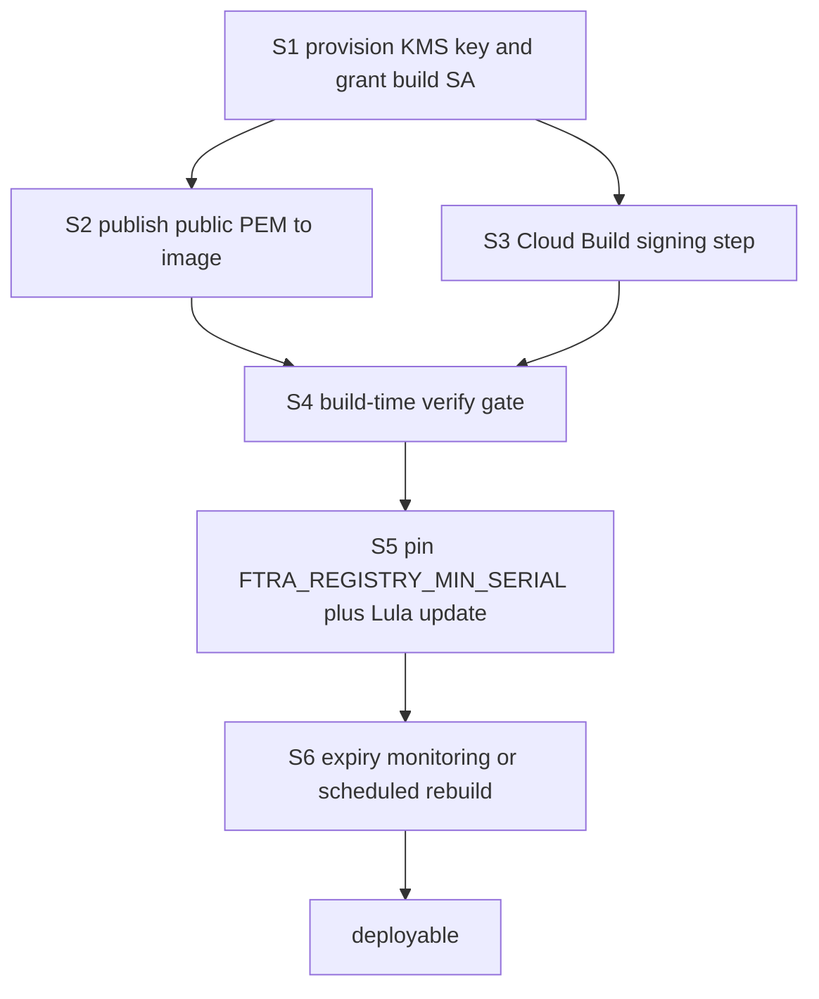

# FTRA Registry Signing Pipeline — deploy-time signature production

> **Status:** design approved (Option A), not implemented.
> **Blocks:** deploying [PR #124](https://github.com/google/cybernetic-agent-governance-engine/pull/124).
> **Predecessor:** [`issue_107_pr2_registry_signing_plan.md`](issue_107_pr2_registry_signing_plan.md) §13–14.
>
> **Owner decisions (2026-09-02):**
> - **Option A** — sign inside the gateway Cloud Build. Option C (separate
>   signing job) is documented as the required posture for high-assurance
>   production adopters, not for this reference architecture.
> - **S4 build-time verification is non-negotiable.** A mismatched signature
>   kills the image at build. Bricking the build is the feature.
> - **S6 via OpenTelemetry.** Emit `expires_at` as a gauge at pod startup and
>   alert at T-14, rather than scheduled rebuilds — the gauge reflects the
>   actual state of the deployment, a rebuild schedule only masks it.
>
> Option C is therefore **not dead**; it is the documented upgrade path. §7
> records the trust consequence that motivates it.

---

## 1. Why this is now urgent

PR #124 made FTRA registry signature verification **unconditional**. There is no
posture gate and no version-based bypass: a registry either presents a valid
v2.0 envelope with a valid ES256 signature, or it does not load, and
[`classify()`](../src/gateway/governance/ftra/classifier.py:241) returns
`IRREVERSIBLE_TERMINAL` for every action.

The repository ships `config/ftra/terminal_registry.json` as **v1.0 with no
`.sig`**. Nothing produces a signed one.

**Consequence:** deploy PR #124 today and the gateway starts, serves traffic,
and routes *every* action to HITL. No trade executes. The pods are healthy, the
logs say `ENVELOPE_INVALID`, and the system is fail-closed — which is correct
behaviour and a total outage.

This document specifies the missing producer. It is the gating dependency named
in the OSCAL component's `ftra-key-management-dependency` prop.

### The verification side is already done

| Piece | State |
|---|---|
| `verify()` needs only `_public_key_pem` — no KMS credentials | exists ([`kms_signer.py:880`](../src/gateway/governance/kms_signer.py:880)) |
| `--sign` flag on the compiler | exists ([`stpa_compiler.py:1591`](../src/gateway/governance/stpa_compiler.py:1591)) |
| Detached `.sig` envelope format | exists, and the compiler emits it |
| `KMS_GOVERNANCE_KEY` wired into the gateway pod | exists ([`gateway.yaml.tpl:121`](../deployment/k8s/gateway.yaml.tpl:121)) |
| **A signed registry** | **missing** |
| **A public PEM the pod can read** | **missing** |

Only the last two are open. This is a plumbing change, not a design change —
but the plumbing decides *where trust originates*, so it needs deciding rather
than improvising.

---

## 2. The constraint that shapes everything

[`src/gateway/Dockerfile:58`](../src/gateway/Dockerfile:58) does:

```dockerfile
COPY config /app/config
```

The registry is **baked into the image**. There is no ConfigMap, no volume
mount, no `terminal_registry` reference anywhere in `deployment/k8s/`.

Two consequences:

1. **Signing must happen at or before image build**, or the image must stop
   carrying the registry. There is no post-deploy patch point today.
2. **Rotating the registry means rebuilding the image.** Serial monotonicity
   (§5 of the predecessor) is therefore coupled to image builds, which is
   tolerable — the serial defaults to `int(time.time())` and is monotonic by
   construction across builds.

---

## 3. Options

### Option A — sign during Cloud Build (recommended)

Add a signing step to
[`cloudbuild.gateway.yaml`](../deployment/docker/cloudbuild.gateway.yaml) that
runs the compiler with `--sign` before `docker build`, using the Cloud Build
service account's KMS access.

```
compile+sign registry → docker build (bakes signed registry + .sig) → push
```

**For:**
- The signature is produced by the same pipeline that produces the artefact, so
  the signed bytes and the shipped bytes cannot diverge.
- No signature in git, so no expiry-driven CI breakage (§6 of the predecessor).
- Cloud Build already holds a service-account identity; granting it
  `roles/cloudkms.signer` on one key version is a narrow, auditable grant.
- Deployment stays a single `gcloud builds submit`, per
  [`AGENTS.md`](../AGENTS.md) deployment rules.

**Against:**
- Build failures now include "KMS unreachable", widening the set of ways a
  build can fail.
- The build service account becomes a holder of signing authority. That is the
  real trust decision here and should be recorded deliberately: **whoever can
  trigger a gateway build can sign a registry.** If that is too broad, Option C.

### Option B — mount a signed registry as a ConfigMap

Stop baking the registry; mount it, and sign it out-of-band.

**For:** rotate the registry without rebuilding the image.

**Against:** larger change (Dockerfile, deployment template, `_DEFAULT_REGISTRY_PATH`),
and a ConfigMap is exactly the write-target VEC-005 assumes an attacker may
control. That is *fine* — the signature is what defends it, which is the whole
point — but it widens the attack surface for no benefit while the registry
changes only at build time anyway. Revisit if hot registry rotation is ever
required.

### Option C — sign in a separate release job, gated by approval

A dedicated Cloud Build trigger, distinct from the image build, holds the only
`roles/cloudkms.signer` grant and publishes the signed registry as an artefact
the image build consumes.

**For:** signing authority is separated from build authority; approval can gate
it.

**Against:** two pipelines to keep in step, and a new failure mode where the
image build consumes a stale signed registry. Worth it only if the Option A
trust concern is real for the adopter.

### Recommendation

**Option A**, with the trust consequence written down. It is the smallest change
that makes the control operable, and it keeps the signed bytes and the shipped
bytes identical by construction. Option C is the natural upgrade if signing
authority needs separating from build authority; the design does not preclude it.

---

## 4. Option A — specification

### S1 — provision the key

One asymmetric signing key version, `EC_SIGN_P256_SHA256` (matching the `ES256`
the verifier and compiler already assume).

- Grant the Cloud Build service account `roles/cloudkms.signerVerifier` on that
  **key version**, not the keyring.
- Export the public key PEM. It is **not secret** — it verifies, it cannot sign.
  It needs no `secretKeyRef`, per the predecessor §10.

### S2 — publish the public key to the pod

`verify()` reads `_public_key_pem`, resolved by
[`from_env()`](../src/gateway/governance/kms_signer.py:643) from
`KMS_GOVERNANCE_PUBLIC_PEM` (a file path) or fetched from the provider.

Simplest correct wiring: bake the PEM into the image alongside the registry and
set `KMS_GOVERNANCE_PUBLIC_PEM` to its path. The pod then verifies with **no KMS
call on the hot path** and survives a KMS outage — the property the predecessor
§2 identified as the reason to split sign from verify.

> **Measured, do not skip.** With `CAGE_ENV=test` and no KMS key,
> `get_governance_signer()` currently returns a fallback whose
> `public_key_pem` is `b""`, and `verify()` **raises**. If the PEM is absent in
> production the pod fails closed on every classify. S2 is not optional.

### S3 — add the Cloud Build signing step

Insert before `build-gateway`:

```yaml
  - name: "python:3.12-slim"
    id: sign-registry
    entrypoint: bash
    args:
      - -c
      - |
        pip install --quiet uv && \
        uv run python -m src.gateway.governance.stpa_compiler compile \
          --targets ftra --sign --registry-validity-days 90
    env:
      - "CAGE_ENV=production"
      - "KMS_GOVERNANCE_KEY=${_KMS_GOVERNANCE_KEY}"
```

`--sign` requires `is_kms_active`
([`stpa_compiler.py:1599`](../src/gateway/governance/stpa_compiler.py:1599)),
which requires both `KMS_GOVERNANCE_KEY` and reachable credentials. Add
`_KMS_GOVERNANCE_KEY` to `substitutions`.

`build-gateway` then bakes the freshly signed `terminal_registry.json` and its
`.sig` via the existing `COPY config /app/config`. **No Dockerfile change.**

### S4 — fail the build if the signature does not verify

The step that matters. Signing that silently produces an unverifiable signature
is worse than not signing, because it converts a build-time error into a
runtime outage discovered in production.

```yaml
  - name: "python:3.12-slim"
    id: verify-registry-signature
    entrypoint: bash
    args:
      - -c
      - |
        pip install --quiet uv && \
        uv run python -c "
        from pathlib import Path
        from src.gateway.governance.ftra.registry_verifier import verify_registry
        from src.gateway.governance.kms_signer import get_governance_signer
        r = verify_registry(Path('config/ftra/terminal_registry.json'),
                            signer=get_governance_signer())
        assert r.valid, f'registry signature invalid: {r.reason}'
        print(f'registry verified: serial={r.serial} expires={r.expires_at}')
        "
```

This runs the **same** `verify_registry()` the pod will run. If it passes here
and fails there, the difference is the key or the bytes, and both are then
worth investigating — a far better diagnostic position than a fail-closed pod.

### S5 — pin the anti-rollback floor

Set `FTRA_REGISTRY_MIN_SERIAL` in
[`gateway.yaml.tpl`](../deployment/k8s/gateway.yaml.tpl) to the serial of the
currently deployed registry.

This is the compensating control for the limitation recorded in the OSCAL
component: the in-memory high-water mark is process-local, so **rollback plus
pod restart defeats it**, leaving only this floor. If it is unset, that rollback
succeeds — the documented gap becomes a live one.

Because it changes the Deployment manifest, a **Lula validation update is
required in the same PR**, per [`AGENTS.md`](../AGENTS.md).

### S6 — expiry is now an operational commitment

`--registry-validity-days 90` means **the deployed registry stops verifying 90
days after the build**, and the pod fails closed. Nothing currently watches for
this.

Options, in order of preference:

1. Emit `cage.ftra.registry.expires_at` as a gauge and alert at T-14 days. The
   telemetry hooks are specified in the predecessor §6 and not yet implemented.
2. Rebuild on a schedule shorter than the validity window.
3. Lengthen the window. Weakest — it trades a scheduled outage for a longer
   window in which a compromised registry stays valid.

**This must not ship without (1) or (2).** An unmonitored expiry is a scheduled
production outage with a 90-day fuse, and the failure mode — every action to
HITL — looks identical to an attack.

---

## 5. Sequencing



S4 before any deployment attempt: it converts the failure from a runtime outage
into a build failure.

---

## 6. Verification

The mutation discipline from the predecessor applies. A pipeline that has never
been observed failing has not been shown to do anything.

| Check | Method | Must happen |
|---|---|---|
| Signing actually runs | remove `--sign`; S4 must fail the build | build red |
| S4 gate is load-bearing | corrupt one byte of `.sig` after signing; S4 must fail | build red |
| Pod verifies without KMS | deploy with KMS network egress blocked | pod healthy, registry loads |
| Missing PEM fails closed | unset `KMS_GOVERNANCE_PUBLIC_PEM` | every action `IRREVERSIBLE_TERMINAL`, reason `PUBKEY_UNAVAILABLE` or signer error |
| Rollback floor holds | deploy serial N, restart pod with registry N-1 | load refused `SERIAL_REGRESSED` |

The fourth row is worth running deliberately: it is the one that distinguishes
"the control works" from "the control is absent and everything happens to pass".

---

## 7. What this does and does not achieve

**Achieves:** VEC-005 and VEC-008 close *in a deployed environment*. An attacker
who can write the registry file — tampered image layer, compromised artefact —
cannot make the gateway act on it without the signing key.

**Does not achieve:**

- **Protection against an attacker holding the signing key.** Under Option A
  that set includes anyone who can trigger a gateway Cloud Build. Option C
  narrows it.
- **Durable anti-rollback.** `FTRA_REGISTRY_MIN_SERIAL` survives restart because
  it lives in the manifest, but an attacker who can edit the manifest can lower
  it. Making the high-water mark durable requires Redis on the FTRA load path,
  deliberately deferred (predecessor §5).
- **Protection against a legitimately signed but wrong registry.** The signature
  attests origin, not correctness. A mis-generated registry signed by the real
  key verifies perfectly. Review of registry *content* remains a human control.

Only once S1–S6 land may the OSCAL component's SI-7 and AU-10 entries move from
`implemented` to operating. Until then they stay as written — implemented and
tested, with production key management as a named dependency.
