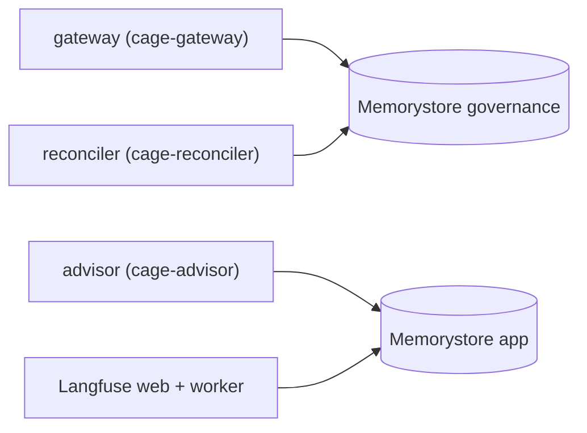
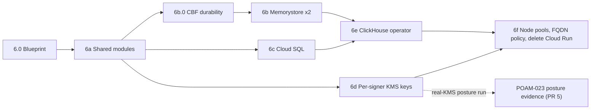

# GKE Managed-Services Blueprint (Track 6.0)

**Status:** Design. Nothing described as *target* exists yet; every *current* claim cites code at `main` @ `3e4b428`.
**Branch:** `docs/gke-managed-services-blueprint`
**Implements:** step 6.0 of the GKE-only consolidation plan. Steps 6a–6f implement this document.

GKE is the **only** deployment target. Most managed-service blocks already exist in the
Cloud Run target ([`infra/targets/gcp-cloudrun/`](../infra/targets/gcp-cloudrun/)), so track 6
mostly **extracts and merges** them into shared modules. It doesn't write them from scratch.
There is no live production instance (AGENTS.md), so there's no dual-write or cut-over phase.

## Contents

0. [Baseline and settled decisions](#0-baseline-and-settled-decisions)
1. [Posture matrix](#1-posture-matrix)
2. [Data layer](#2-data-layer)
3. [Node pools](#3-node-pools)
4. [Latency budget](#4-latency-budget)
5. [Zero-trust](#5-zero-trust)
6. [Roadmap](#6-roadmap)
7. [Pitfalls](#7-pitfalls)
8. [Verify before implementing](#8-verify-before-implementing)

---

## 0. Baseline and settled decisions

### 0.1 What already landed on `main`

| Plan step | Landed as | Effect on this blueprint |
|---|---|---|
| Stack #287–#292 | `4bac674` and ancestors | `kid` trust anchors, Tier 2 ledger simulator, domain thresholds. Gate G3 kernel purity. |
| G8: CBF verifies by reconciler `kid` | #294 (`1b2e102`) | New [`reconciliation/trust.py`](../src/gateway/governance/reconciliation/trust.py): `RECONCILER_KMS_KEY`, a verify-only anchor set ([`verify_snapshot_signature`](../src/gateway/governance/reconciliation/trust.py#L175)). New posture check [`_check_reconciler_trust_anchor`](../src/gateway/governance/governor/posture.py#L130) refuses an enforcing start without it. **Unblocks 6d.** |
| C5: `noeviction` everywhere | #295 (`3e4b428`) | Hard-coded in [`redis_cache`](../infra/modules/redis_cache/main.tf#L63-L72) and the [Cloud Run Memorystore block](../infra/targets/gcp-cloudrun/main.tf#L212-L259). Static gate: [`test_redis_noeviction_policy.py`](../tests/infrastructure/test_redis_noeviction_policy.py). |
| C7: reconciler egress + provider label | #290 fallout | The [reconciler egress policy](../deployment/k8s/cilium/reconciliation-worker-egress.yaml) allows only KMS, Redis, DNS, Langfuse. The gateway gets `reconciliation_provider = "simulated"` ([gcp-gke/main.tf:625](../infra/targets/gcp-gke/main.tf#L625)). |

### 0.2 Still open at HEAD (track 6 owns these)

| ID | Gap | Evidence | Closed in |
|---|---|---|---|
| C6 | No asymmetric signing key in any Terraform; only a symmetric SOFTWARE CMEK | [gcp-cloudrun/kms.tf:42-58](../infra/targets/gcp-cloudrun/kms.tf#L42-L58); GKE grants only `cryptoKeyEncrypterDecrypter` ([iam.tf:86-91](../infra/targets/gcp-gke/iam.tf#L86-L91)) | 6d |
| C6 | Reconciler CronJob runs as the agent's `financial-advisor-sa` | [reconciliation-worker.yaml:45](../deployment/k8s/reconciliation-worker.yaml#L45) | 6d |
| G8′ | Terraform doesn't wire `RECONCILER_KMS_KEY` (only the raw manifests do) | [gateway.yaml:169](../deployment/k8s/gateway.yaml#L169) vs. [gateway/main.tf:224](../infra/modules/gateway/main.tf#L224) | 6d |
| G2 | One Redis, one password: Langfuse, gateway, advisor | [gcp-gke/main.tf:513-514](../infra/targets/gcp-gke/main.tf#L513-L514), [:606-607](../infra/targets/gcp-gke/main.tf#L606-L607), [:643-644](../infra/targets/gcp-gke/main.tf#L643-L644) | 6b |
| G3 | Memorystore block has no AUTH/TLS; HA enables read replicas | [gcp-cloudrun/main.tf:212-259](../infra/targets/gcp-cloudrun/main.tf#L212-L259) | 6b |
| G4 | CBF durability (per-process epoch, debit outside Lua, `LTRIM`, rollback, `WAIT` connection) | §2.3 | 6b.0 |
| G4.6 | No manifest sets any `CAGE_*` CBF flag; staging runs strict + `WAIT 1` against a standalone Redis | [cbf_engine.py:42-69](../src/gateway/governance/safety/cbf_engine.py#L42-L69); `staging` isn't in the non-production list at [:45](../src/gateway/governance/safety/cbf_engine.py#L45) | §1.2 (6b) |
| G6 | DPv2 defaults to `false` (dev enforces no policies); CNPs use L7 + `toEndpoints: redis-stack` | [variables.tf:140-149](../infra/targets/gcp-gke/variables.tf#L140-L149), [reconciliation-worker-egress.yaml:70](../deployment/k8s/cilium/reconciliation-worker-egress.yaml#L70) | 6b, 6f |
| G9 | `CAGE_RECONCILIATION_REPLAY_DEFENSE` defaults to `false` | [cbf_engine.py:51-53](../src/gateway/governance/safety/cbf_engine.py#L51-L53) | §1.2 (flag), PR 5 (text) |
| NEW | Cluster is **zonal in every env**, prod included | [gcp_gke_cluster/main.tf:28](../infra/modules/gcp_gke_cluster/main.tf#L28) | 6f |
| NEW | `KMS_GOVERNANCE_KEY` has a **fourth** consumer: the compliance bridge's evidence batch signer | [gcp-gke/main.tf:568-573](../infra/targets/gcp-gke/main.tf#L568-L573) | 6d |
| NEW | **Every workload shares one identity.** Gateway, advisor, bridge, vLLM (and in manifests the reconciler and Langfuse) run as `financial-advisor-sa`, whose GSA is created and granted out of band. The per-service GSAs in `iam.tf` are bound to KSAs no pod uses. | §5.1 | 6d |

### 0.3 Decisions (settled; don't reopen here)

| ID | Decision |
|---|---|
| D1 | **No Laya classifier.** Zero code in the repo. An inline classifier would be a new admissibility tier with its own contract, so it would need a spike, not a blueprint slot. |
| D2 | **Delete `infra/targets/gcp-cloudrun/` in 6f**, but only once every extracted block has a GKE consumer. |
| D3 | **Cloud SQL, not AlloyDB.** Postgres backs Langfuse only (G1). |
| D5 | **Memorystore for Valkey, Cluster Mode Disabled, over PSC**, with IAM auth. Fallback: Memorystore for Redis over PSA with AUTH and TLS. |
| D6 | **Two Redis instances:** `governance` and `app`. |
| D7 | **Keep the `agnostic` target** with [`redis_cache`](../infra/modules/redis_cache/main.tf), [`postgres_db`](../infra/modules/postgres_db/main.tf) and `minio_storage` for local dev. |

### 0.4 Corrections to the original brief

| # | Brief said | Reality at HEAD | Blueprint consequence |
|---|---|---|---|
| C1 | `laya-classifier` is a running service | No hits in the repo | Removed (D1) |
| C2 | DoWhy and consensus are separate pods | Both run in-process: [gatekeeper.py](../src/gateway/governance/causal/gatekeeper.py), [consensus/engine.py](../src/gateway/governance/consensus/engine.py). The GPU pool runs vLLM. | No new pods. Splitting either out needs a latency case (§4). |
| C3 | PSC implies cluster mode | Valkey **Cluster Mode Disabled** is single-shard, uses PSC, and allows multi-key `EVAL` | `LUA_ATOMIC_CBF` semantics unchanged (D5) |
| C4 | Basic and Standard HA behave the same | Async replication vs. total loss. Fence-epoch CAS, the regression check and `WAIT` + rollback already exist. | Verify them per tier with fault injection (§2.4) |
| C8 | ClickHouse is WORM | The retention-locked GCS bucket is the record; ClickHouse is the query plane | §2.5 |

---

## 1. Posture matrix

Three postures. `staging` means **full security at dev scale**
([staging posture plan](staging_posture_cost_optimization_plan.md)). It differs from `prod` in
redundancy and size, never in security controls. Tiers come from the Cloud Run tfvars
([dev](../infra/targets/gcp-cloudrun/dev.tfvars), [staging](../infra/targets/gcp-cloudrun/staging.tfvars),
[prod](../infra/targets/gcp-cloudrun/prod.tfvars)) and are carried over to the GKE tfvars.

### 1.1 Infrastructure

| Dimension | `dev` | `staging` | `prod` | Current GKE value |
|---|---|---|---|---|
| Cluster location | zonal | zonal | **regional** | zonal everywhere ([:28](../infra/modules/gcp_gke_cluster/main.tf#L28)) |
| Dataplane V2 | **on** | on | on | dev `false` (default), staging/prod `true` |
| Binary Authorization | off | **on** | on | staging `false` ([staging.tfvars](../infra/targets/gcp-gke/staging.tfvars)) |
| Audit logging / CMEK / PSS `restricted` | off | **on** | on | staging off; prod CMEK off |
| Private master endpoint | off | off (authorized networks) | on | all off |
| Memorystore `governance` | 1 GB, no replica | 1 GB, **1 replica** | HA, 1+ replicas, 2+ zones | in-cluster Helm Redis |
| Memorystore `app` | 1 GB, no replica | 1 GB, no replica | HA | *(shared with governance)* |
| Cloud SQL (Langfuse) | `db-f1-micro`, ZONAL | `db-g1-small`, ZONAL | `db-custom-2-7680`, REGIONAL, PITR | in-cluster Postgres |
| KMS signing keys | SOFTWARE, P-256 | SOFTWARE, P-256 | **HSM**, P-256 | none |
| ClickHouse | single node, local SSD | single node, local SSD | `ReplicatedMergeTree` + Keeper | in-cluster Helm |
| WORM bucket retention lock | unlocked | locked (short) | locked | Cloud Run only ([:366](../infra/targets/gcp-cloudrun/main.tf#L366)) |

The staging `governance` replica is deliberate. `WAIT` is the fail-closed replication check.
Under the Completeness Principle, a security primitive must run for real in the posture that
proves security. Without a replica, staging can't observe `WAIT` succeeding at all.

### 1.2 Kernel flags per posture (G4.6, G9)

No manifest sets any of these today, so every value below is the code default applied by accident.
6b sets them **explicitly** in the gateway module for every posture, and a static test pins them.

| Env var ([cbf_engine.py](../src/gateway/governance/safety/cbf_engine.py#L42-L69)) | Default | `dev` | `staging` | `prod` |
|---|---|---|---|---|
| `CAGE_ENV` | — | `dev` | `staging` | `prod` |
| `CAGE_CBF_STRICT_MODE` | `true` unless dev/test/ci | `false` | `true` | `true` |
| `CAGE_STRICT_REPLICATION` | same | `false` | `true` | `true` |
| `CAGE_REDIS_SYNCHRONOUS_REPLICATION` (fence epoch) | `true` | `true` | `true` | `true` |
| `CAGE_REDIS_WAIT_REPLICAS` | `1` | **`0`** (no replica, saves 1 s per commit) | `1` | `1` |
| `CAGE_REDIS_WAIT_TIMEOUT_MS` | `1000` | n/a | `100` | `100` |
| `CAGE_RECONCILIATION_REPLAY_DEFENSE` | `false` | **`true`** | **`true`** | **`true`** |
| `RECONCILER_KMS_KEY` | unset | dev key | reconciler key | reconciler key (HSM) |

Invariant: in `staging` and `prod`, `CAGE_REDIS_WAIT_REPLICAS ≤` the governance instance's replica count.
A Terraform `precondition` in the gateway module enforces it.

Memorystore supports `WAIT` (§8, item 1, resolved). With zero replicas, `WAIT 1 <timeout>` blocks for the
full timeout, because no replica can acknowledge. That is why dev sets `0` rather than relying on the default.

---

## 2. Data layer

### 2.1 Redis topology (D5, D6, G2, G3)

| Instance | Holders | Keys (non-exhaustive) | Why separate |
|---|---|---|---|
| `governance` | gateway, reconciler | `safety:fence_epoch`, `cbf:local_debits`, `cage:ground_truth:*`, `reconciliation:*`, routing-seal nonces, token quotas, DEFER queue, `audit:state_ledger` | **Integrity:** the advisor and Langfuse can't `DEL` or `SET` barrier state. **Availability:** a Langfuse backlog can't fill memory and make CBF writes fail under `noeviction`. |
| `app` | advisor, Langfuse | Langfuse queues/cache, advisor session cache | Evictable workloads, no safety state |

Both instances must meet all of these:

- `noeviction` hard-coded in the module, not a variable. The static gate is extended to `google_memorystore_instance`.
- IAM auth, one principal per KSA/GSA (Valkey), or AUTH + TLS (fallback).
- In-transit encryption. The gateway pins the Memorystore server CA via `REDIS_CA_CERT_PATH`: [redis_client.py:142-166](../src/gateway/infrastructure/redis_client.py#L142-L166) already requires verification outside dev, but it defaults to the system bundle, which won't validate a Memorystore CA.
- The gateway gets the **primary endpoint only**. No read-replica endpoint is exported to any consumer.
- CMEK in `staging`/`prod`.

**Code changes in 6b:**

- Delete the Sentinel stub ([redis_client.py:65-95](../src/gateway/infrastructure/redis_client.py#L65-L95)) and `_REDIS_SENTINEL_MASTER_NAME` ([cbf_engine.py:71](../src/gateway/governance/safety/cbf_engine.py#L71)). Memorystore handles failover.
- Add an IAM token credential provider in `src/integrations/gcp/`. The kernel's Redis client gets it through a factory seam listed in the Gate G3 `INTEGRATIONS_FACTORY_ALLOWLIST`, never by a direct import.
- Delete `deployment/k8s/redis-*.yaml` and the in-cluster `module "redis"` from the GKE target ([main.tf:274-295](../infra/targets/gcp-gke/main.tf#L274-L295)).

### 2.2 Other safety state on `governance` (G5)

| State | Where | On failover | Mitigation |
|---|---|---|---|
| Routing-seal nonces | `SET NX EX` ([routing_seal.py:270-272](../src/gateway/governance/routing_seal.py#L270-L272)) | Replay window reopens | Seal TTL ≤ reconciliation interval. Fault-injection test asserts the replay is caught by seal expiry. |
| Token quotas | `INCRBY`/`DECRBY` + TTL ([token_quota_proxy.py](../src/gateway/governance/token_quota_proxy.py)) | Usage forgotten | Accepted and documented (bounded by session TTL) |
| Reconciler snapshot | `SETEX` pipeline ([daemon.py:448-470](../src/gateway/governance/reconciliation/daemon.py#L448-L470)) | Older snapshot served | Replay defense on (§1.2) rejects the older sequence |
| DEFER queue | CAS script ([defer_queue.py](../src/gateway/governance/defer_queue.py)) | Resolution lost or doubled | Covered by the 6b.0 fault matrix |

### 2.3 CBF durability: kernel PR 6b.0 (G4)

These are Layer 1 changes in [cbf_engine.py](../src/gateway/governance/safety/cbf_engine.py). They land **before**
6b moves to managed Redis, because failover becomes routine there.

| # | Gap at HEAD | Fix |
|---|---|---|
| 1 | Epoch memory is per-process (`_last_seen_epoch`, [:229](../src/gateway/governance/safety/cbf_engine.py#L229), checked at [:427-452](../src/gateway/governance/safety/cbf_engine.py#L427-L452)). A restarted pod or a second replica accepts rolled-back state. | Replicas share failover detection. Persist a high-water mark (`safety:fence_epoch_hwm`) that only grows, and fail closed when the live epoch falls below it. |
| 2 | Debit is `RPUSH`ed **after** the Lua commit ([:1139-1161](../src/gateway/governance/safety/cbf_engine.py#L1139-L1161), duplicated at [:1190-1210](../src/gateway/governance/safety/cbf_engine.py#L1190-L1210)). A crash between them forgets the spend. | Move the debit into `LUA_ATOMIC_CBF` ([:160-206](../src/gateway/governance/safety/cbf_engine.py#L160-L206)) as `KEYS[4]`. Remove the duplicated Python branches. |
| 3 | `LTRIM -1000` drops debits beyond 1,000 per sequence | Trim by reconciliation sequence, not count. The reconciler clears debits at or below the sequence it just signed. |
| 4 | [`rollback_state`](../src/gateway/governance/safety/cbf_engine.py#L968) never removes the debit (phantom spend) | Remove it in the same script as the rollback |
| 5 | `WAIT` ([`_sync_to_replicas`](../src/gateway/governance/safety/cbf_engine.py#L458)) runs on a pooled connection, not necessarily the commit's | EVALSHA and `WAIT` run on one pinned connection |
| 6 | No replica means `WAIT 1` times out at 1,000 ms | Posture flags (§1.2) plus a staging replica (§1.1) |

Every fix ships with a test that observes the failure. For example: kill between commit and debit → spend
still counted; epoch below the high-water mark → BLOCK; `WAIT` timeout in strict mode → rollback **and** debit removed.

### 2.4 Failover verification per tier (C4)

The per-tier fault-injection suite, in `tests/infrastructure/` for hermetic runs and `integration` for live runs:

| Tier | Fault | Expected |
|---|---|---|
| BASIC (dev) | Instance restart (state lost) | Epoch below HWM → BLOCK until the reconciler re-seeds signed ground truth |
| 1 replica (staging) | Manual failover mid-commit | Either `WAIT` confirms and the commit survives, or strict rollback. Never an acked-but-lost commit. |
| HA (prod) | Zone failover | Same as staging, plus the HWM check across ≥ 2 gateway replicas |
| All | Memory at ceiling (`noeviction`) | CBF write error → fail closed, no eviction |

### 2.5 Postgres: Cloud SQL, Langfuse only (G1, 6c)

- Nothing in `src/` uses Postgres. The only database is `langfuse` ([gcp-cloudrun/main.tf:320-331](../infra/targets/gcp-cloudrun/main.tf#L320-L331)).
- Extract [the Cloud SQL block](../infra/targets/gcp-cloudrun/main.tf#L268-L331) into `infra/modules/cloudsql_postgres`: PG15, private IP, `ENCRYPTED_ONLY`, PITR in prod.
- Langfuse connects through the Cloud SQL Auth Proxy sidecar with `--auto-iam-authn`. The static `random_password` and its Secret Manager entry are deleted.
- 6c sits off every governance path. It can run in parallel with 6b.

### 2.6 ClickHouse and the WORM bucket (C8, 6e)

- **System of record:** a retention-locked GCS bucket (`infra/modules/worm_bucket`, extracted from [:366](../infra/targets/gcp-cloudrun/main.tf#L366)). ClickHouse is only the query plane, fed by [clickhouse_sink.py](../src/compliance_bridge/clickhouse_sink.py).
- **prod:** ClickHouse operator, `ReplicatedMergeTree` + Keeper (3 nodes), local SSD for hot parts, GCS disk for the cold tier.
- **dev/staging:** single node on local SSD. Losing it only loses the query plane.
- Delete the Cloud Run ClickHouse VM ([clickhouse_vm.tf](../infra/targets/gcp-cloudrun/clickhouse_vm.tf)) and the in-cluster Helm module ([clickhouse](../infra/modules/clickhouse/main.tf)) once the operator is live.

---

## 3. Node pools

The current module has a primary pool ([:212](../infra/modules/gcp_gke_cluster/main.tf#L212)) and a GPU pool
([:276-297](../infra/modules/gcp_gke_cluster/main.tf#L276-L297)). 6f turns them into a pool list.

| Pool | Machine | `dev` | `staging` | `prod` | Taint / workloads |
|---|---|---|---|---|---|
| `general` | `e2-standard-4` (dev/staging), `e2-standard-8` (prod) | 1–5 | 1–5 | 3–10, regional | gateway, advisor, OPA, NeMo, Langfuse, reconciler |
| `general-spot` | `c3-highcpu-4`, Spot | — | 0–5 | — | `cloud.google.com/gke-spot`. Stateless replicas and CI runs, with the on-demand `general` pool as fallback. |
| `gpu-l4` | `g2-standard-8`, 1× L4 | 0–2, scale to zero | 0–2, scale to zero | 2–5, on-demand | `nvidia.com/gpu`. `vllm` and `vllm_reasoning` only ([main.tf:376-501](../infra/targets/gcp-gke/main.tf#L376-L501)). |
| `clickhouse` | local-SSD machine type | 1 | 1 | 3 (Keeper colocated) | `workload=clickhouse:NoSchedule` |

- No DoWhy or consensus pool (C2) and no Laya pool (D1).
- GPU Spot stays **off** in every posture. Measurement runs must not be preempted (current tfvars rationale).
- Stateful and governance-critical pods (gateway, reconciler) never schedule on Spot. A node affinity enforces this.

---

## 4. Latency budget

The governance hot path must fit the **200 ms** FedNow/SEPA Instant budget used by
[`measure_paper_metrics.py`](../scripts/measure_paper_metrics.py). The SLA targets are P95 500 ms and
P99 2,000 ms end to end (THR-LAT-003/004 in the [threshold matrix](../compliance/risk_acceptance/THRESHOLD_TRACEABILITY_MATRIX.md)).

### 4.1 Baseline (latest in-cluster GKE run, `docs/paper/measurements/2026-08-18-gke-incluster/`)

| Component | P50 (ms) | P95 (ms) | Source |
|---|---|---|---|
| Governor total, in-process, mocked I/O (APPROVED) | 3.53 | 4.23 | `cage_paper_metrics.txt` |
| CBF read path, reconciled (verified balance + KMS verify) | 42.3 | 107.5 | `cage_reconciliation_metrics.txt` |
| Reconciler: KMS `asymmetricSign` (off hot path) | 130.4 | 1,678 (cold start) | same |
| Reconciler: Redis `SETEX` pipeline (off hot path) | 40.8 | 243.4 | same |

### 4.2 Budget after migration (hot path, P95)

| Step | Budget (ms) | Changed by |
|---|---|---|
| Governor logic (tiers, in-process) | 10 | — |
| CBF: snapshot read + `kid` verification (public key cached out of band) | 20 | 6d: anchors are fetched once, then verification is local ECDSA |
| CBF: Lua commit on `governance` | 5 | 6b: PSC hop instead of in-cluster Service |
| CBF: `WAIT 1` (staging/prod) | ≤ 100 (timeout) | 6b.0 |
| OPA (concurrent with CBF) | — | — |
| Headroom | 65 | — |
| **Total** | **200** | |

- The current P95 of 107 ms for the reconciled read is dominated by a per-call KMS round trip. 6d must keep verification local: [`verify_snapshot_signature`](../src/gateway/governance/reconciliation/trust.py#L175) resolves anchors fetched out of band.
- Measure after 6b and after 6f with `measure_paper_metrics.py --unmocked` and `measure_reconciliation_metrics.py`. Store results under `docs/paper/measurements/` using the provenance template.
- Any proposal to move DoWhy or consensus out of process must fit inside the 65 ms headroom.

---

## 5. Zero-trust

### 5.1 Workload identity

**Current state (the core 6d problem).** One KSA, `financial-advisor-sa`, runs every workload:

- Terraform uses it for the gateway ([gateway/main.tf:50](../infra/modules/gateway/main.tf#L50)), the advisor ([governed_advisor/main.tf:55](../infra/modules/governed_advisor/main.tf#L55)), the compliance bridge ([compliance_bridge/main.tf:52](../infra/modules/compliance_bridge/main.tf#L52)) and both vLLM releases ([gcp-gke/main.tf:383](../infra/targets/gcp-gke/main.tf#L383), [:452](../infra/targets/gcp-gke/main.tf#L452)).
- The raw manifests also use it for the reconciler, Langfuse and the frontend: 20 files under `deployment/k8s/`.
- It is annotated to the GSA `financial-advisor-sa@<project>` ([gcp-gke/main.tf:362-372](../infra/targets/gcp-gke/main.tf#L362-L372)). **No Terraform creates that GSA or grants it anything**, so its roles are entirely out of band.
- The `cage-gateway` and `cage-compliance-bridge` GSAs and their Workload Identity bindings ([iam.tf:168-184](../infra/targets/gcp-gke/iam.tf#L168-L184)) bind KSAs that no pod uses, so every grant in `iam.tf` for them is dead.

**Consequence:** any KMS right the gateway needs to sign routing seals is held equally by the advisor, the vLLM pods and Langfuse. With it, an untrusted workload could mint a v3 JWT seal (`iss: cage-gateway`, [routing_seal.py:404-429](../src/gateway/governance/routing_seal.py#L404-L429)) that the actuator accepts.

**Target.** One KSA per workload, each bound to its own Terraform-managed GSA. `financial-advisor-sa` is deleted.

| KSA | GSA | Grants |
|---|---|---|
| `cage-gateway` | `gateway` (exists, [iam.tf:29](../infra/targets/gcp-gke/iam.tf#L29), binding unused today) | `cloudkms.signer` on the seal key; `publicKeyViewer` on the reconciler key; IAM auth on `governance` |
| `cage-reconciler` | `reconciler` (**new**) | `cloudkms.signer` on the reconciler key only; IAM auth on `governance` |
| `cage-advisor` | `advisor` (**new**) | **No signer role on any key.** `publicKeyViewer` on the seal key only (actuator-side seal verification, [api.py:236-238](../src/governed_financial_advisor/tools/api.py#L236-L238)); IAM auth on `app` |
| `cage-compliance-bridge` | `compliance_bridge` (exists, [iam.tf:36](../infra/targets/gcp-gke/iam.tf#L36), binding unused today) | `cloudkms.signer` on the evidence key; WORM bucket `objectCreator` |
| `cage-vllm` | `vllm` (exists) | Model bucket read only; no KMS |
| `langfuse` | `langfuse` (**new**) | Cloud SQL IAM user; IAM auth on `app` |

Secrets move from Kubernetes Secrets to Secret Manager through the Secret Manager CSI driver. Each secret is granted to exactly one GSA.

### 5.2 Signing keys (6d, C6, G8)

One `EC_SIGN_P256_SHA256` key per signer. P-256 is supported at both SOFTWARE and HSM level
([kms_provider.py:135](../src/integrations/gcp/kms_provider.py#L135)); Ed25519 is SOFTWARE-only in Cloud KMS.

| Key | Signer | Verifiers | Env var |
|---|---|---|---|
| `cage-gateway-seal-signer` | gateway | advisor (actuator), gateway | `KMS_GOVERNANCE_KEY` |
| `cage-reconciler-snapshot-signer` | reconciler | gateway (CBF), **by `kid` only** | `RECONCILER_KMS_KEY` |
| `cage-evidence-batch-signer` | compliance bridge | auditors (offline) | `KMS_GOVERNANCE_KEY` on the bridge today, renamed in 6d |

**No advisor plan-signing key** (§8, item 4). The advisor's evaluator signature is removed in 6d:

- Drop signing in [evaluator_node.py](../src/governed_financial_advisor/graph/nodes/evaluator_node.py) and verification in [explainer_node.py](../src/governed_financial_advisor/graph/nodes/explainer_node.py). The explainer reports the gateway envelope signature instead ([safety_node.py:138](../src/governed_financial_advisor/graph/nodes/safety_node.py#L138)).
- The `check_safety_signature` edge ([graph.py:213-216](../src/governed_financial_advisor/graph/graph.py#L213-L216)) routes on the verdict alone. Actuation stays gated by the gateway seal (`verify_and_consume_seal`).
- Delete the unused gateway helper [`_verify_governance_signature`](../src/gateway/server/governance_middleware.py#L481) and its tests. It has no production caller, and it would accept any holder of the gateway key as an approver.
- In [`verify_seal`](../src/gateway/governance/routing_seal.py#L620), remove the fallback to the verifier's own signer key when the JWKS `kid` lookup fails ([:642-649](../src/gateway/governance/routing_seal.py#L642-L649)): unknown `kid` → reject, as in G8.
- The advisor loads a verify-only signer (public key, no signing path), so an enforcing startup doesn't require signer rights.

Other rules:

- Never grant `signerVerifier` on a shared key. The Cloud Run pattern at [gcp-cloudrun/main.tf:696-697](../infra/targets/gcp-cloudrun/main.tf#L696-L697) is not copied.
- The hand-made POAM-038 `governance/balance-signer` key is either imported into Terraform or retired in 6d.
- Symmetric CMEK stays a separate module key (`infra/modules/kms`).
- OSCAL SC-12/SC-13 (and AC-6 for the identity split) are updated within 2 business days of the 6d merge.

### 5.3 Network policy (G6, 6f)

- **Dataplane V2 on at cluster creation in every posture.** It is create-time only, so dev must be recreated.
- GKE's Cilium doesn't enforce L7 rules. [`egress-lockdown.yaml`](../deployment/k8s/cilium/egress-lockdown.yaml) (L7 `dns` and `http` rules) and the two other files are rewritten as Kubernetes `NetworkPolicy` plus GKE `FQDNNetworkPolicy`.
- **`FQDNNetworkPolicy` prerequisites** (§8, item 6, resolved). GKE Enterprise isn't required; Standard is enough. The cluster needs:
  - Dataplane V2;
  - GKE ≥ 1.26.4-gke.500 or ≥ 1.27.1-gke.400;
  - kube-dns or Cloud DNS, not a custom CoreDNS;
  - FQDN network policy enabled.
- The cluster module sets no `dns_config` today ([gcp_gke_cluster/main.tf](../infra/modules/gcp_gke_cluster/main.tf)), so it uses kube-dns. 6f either keeps that or moves to Cloud DNS, never custom CoreDNS. 6f also pins a release channel or minimum version at or above the floor.
- Enable FQDN network policy **at cluster creation**, alongside DPv2. If it is ever enabled in place (`gcloud container clusters update --enable-fqdn-network-policy`), Standard clusters enforce policies only after `kubectl rollout restart ds -n kube-system anetd`.
- **How enforcement behaves** (§8, item 2):
  - Selecting a pod creates an implicit egress deny.
  - DNS lookups for *any* name still resolve. The drop happens at L3/L4 on the connection to an IP that doesn't back an allowlisted FQDN.
  - Connections that were open before a policy change survive until they close.
- **Consequences:**
  - DNS egress is allowed **only to kube-dns / Cloud DNS**, so DNS stays a resolver path and never becomes an open egress channel.
  - Every policy change is followed by a rollout restart of the selected workloads, so no pre-change connection outlives it.
  - The probe asserts **connection failure**, not NXDOMAIN.
- Memorystore can't be matched by `toEndpoints: app: redis-stack`. Use an `ipBlock` for the PSC endpoint CIDR on the TLS port.
- The policy set is **identical in every posture**. Only CIDRs and FQDNs differ, and they come from tfvars.
- Reconciler egress stays at KMS + `governance` + DNS + Langfuse OTLP (C7, already on `main`).

### 5.4 Perimeter

Ported from Cloud Run in 6a/6f: Binary Authorization (cluster policy), VPC Service Controls,
Cloud Armor (attached to the GKE Ingress backend), Cloud DNS. The VPC module gains GKE pod and
service secondary ranges. It also fixes the "PSC" comment on a PSA configuration in the Cloud Run VPC block.

---

## 6. Roadmap

| Step | Branch | Scope | Exit criteria |
|---|---|---|---|
| 6a | `refactor/infra-shared-modules` | Bump `hashicorp/google` to `~> 6.43` in every GCP target and module (§8, items 3 and 3′). Extract `vpc_network`, `memorystore_redis`/`memorystore_valkey`, `cloudsql_postgres`, `worm_bucket`, `kms`. Cloud Run consumes them unchanged. | `terraform plan` on 6.x shows no diff for Cloud Run dev and GKE dev |
| 6b.0 | `fix/cbf-atomic-debit` | §2.3 items 1–5 (Layer 1) | Each item has a test that observes the failure; `make test-fast` green |
| 6b | `feat/gke-memorystore` | §2.1, §2.2, §2.4, §1.2 flags; delete Sentinel stub and `redis-*.yaml` | Live `WAIT 1 100` smoke test succeeds on the staging `governance` instance (Valkey caveat, §8 item 1); fault matrix passes; static gate covers Memorystore |
| 6c | `feat/gke-cloudsql` | §2.5 | Langfuse up with no static DB password |
| 6d | `feat/kms-signing-keys` | §5.1, §5.2: per-workload KSA/GSA, per-signer keys, remove advisor signing | Enforcing posture starts ([`reconciler_trust_anchor`](../src/gateway/governance/governor/posture.py#L130)); forged-`kid` snapshot → BLOCK on live KMS; no pod or module references `financial-advisor-sa`; advisor GSA holds no `cloudkms.signer*` role (live `get-iam-policy`); advisor-minted seal → rejected; OSCAL updated |
| 6e | `feat/clickhouse-operator` | §2.6 | Evidence reaches the locked bucket; ClickHouse node loss causes no evidence loss |
| 6f | `refactor/gke-sole-target` | §3, §5.3, §5.4; regional prod; delete `infra/targets/gcp-cloudrun/` and its `deploy_all.sh` branch | `rg gcp-cloudrun` finds only CHANGELOG; policies enforced on DPv2 dev |

**Compliance obligations:**

- **Lula:** update validations in `compliance/lula/` whenever 6b, 6c or 6e remove K8s resources they reference.
- **OSCAL:** update within 2 business days of each merge that changes a control (6b: SC-8/SC-28; 6d: SC-12/SC-13; 6f: SC-7).
- **Customer responsibility:** anything left out, such as retail-banking ledger APIs (Tier 3), gets a customer-responsibility statement.
- **POAM:** POAM-023 posture evidence is recorded only after the real-KMS run in 6d.

PR 5 (`docs/governor-convergence`) runs in parallel. Its "GKE or Cloud Run" wording
([governor_refactor_plan_pr4_5.md:268](governor_refactor_plan_pr4_5.md#L268)) becomes "GKE".

---

## 7. Pitfalls

| Pitfall | Guard |
|---|---|
| An evicting policy returns in a new module | Static gate [`test_redis_noeviction_policy.py`](../tests/infrastructure/test_redis_noeviction_policy.py), extended to `google_memorystore_instance` |
| Staging rolls back every commit (strict + `WAIT 1`, no replica) | §1.1 replica + §1.2 precondition |
| Gateway handed the read-replica endpoint | Module exports only the primary endpoint |
| A shared signing key sneaks back in | Test: each `google_kms_crypto_key` of purpose `ASYMMETRIC_SIGN` has exactly one `signer` member |
| Workloads share an identity again | Static test: every `service_account_name`/`serviceAccountName` in `infra/` and `deployment/k8s/` is unique per workload, and each KSA annotation points at a GSA Terraform creates |
| `RECONCILER_KMS_KEY` points at the gateway key | Already rejected at startup ([trust.py](../src/gateway/governance/reconciliation/trust.py)); Terraform keeps them as distinct resources |
| DPv2 toggled on an existing cluster | Create-time only: recreate dev in 6f; never plan it as an in-place change |
| L7 CNP rules silently unenforced on GKE | Rewrite as FQDN policy (§5.3); verify on a DPv2 dev cluster (§8 item 2) |
| FQDN policies applied but not enforced | Enable at cluster creation; restart `anetd` after any in-place enable; a live probe in 6f asserts a denied FQDN is blocked |
| Custom CoreDNS introduced later | Unsupported by FQDN policy; the module allows only kube-dns or Cloud DNS |
| Pre-change connections survive a policy tightening | Roll out the selected workloads after every policy change |
| DNS used as an egress channel (lookups for any name still resolve) | DNS egress allowed only to kube-dns / Cloud DNS |
| Provider resolves an old version without the new resources | Constraint `~> 6.43` (§8, item 3′), written `~> X.Y` (not `~> X.Y.Z`, which pins the patch series); decide in 6a whether to commit `.terraform.lock.hcl` (gitignored today) |
| ClickHouse pods land on general nodes | Taint + toleration + node affinity |
| Spot preemption during CI or measurement | GPU Spot off; `general-spot` has an on-demand fallback; governance pods have anti-Spot affinity |
| KMS cold start inflates P95 | Anchors fetched out of band and cached (§4.2); a lightweight live-KMS gate runs in dev |
| Cloud Run deleted before every block has a consumer | 6f depends on 6d and 6e; exit criterion greps for leftovers |
| Kernel imports a GCP SDK for Redis IAM tokens | Credential provider lives in `src/integrations/gcp/`, loaded through a Gate G3-allowlisted factory |

---

## 8. Verify before implementing

### Open

| # | Question | Blocks | How |
|---|---|---|---|
| 5′ | What roles does the out-of-band GSA `financial-advisor-sa@<project>` hold on `KMS_GOVERNANCE_KEY` (and project-wide)? | 6d | Terraform grants it nothing (§5.1), so only live IAM can answer. Run `gcloud kms keys get-iam-policy <key> --keyring <ring> --location <region>` and `gcloud projects get-iam-policy <project> --flatten=bindings --filter='bindings.members:financial-advisor-sa@'`. Any `cloudkms.signer*` there means the advisor and vLLM can mint gateway seals today; record it as a POAM finding. |

### Resolved (2026-09-27)

| # | Question | Answer | Effect on the blueprint |
|---|---|---|---|
| 4 | Does the advisor need to sign plans? | **No.** It signs with the *gateway's* key (`KMS_GOVERNANCE_KEY` via `get_governance_signer().sign`, [evaluator_node.py:76-77](../src/governed_financial_advisor/graph/nodes/evaluator_node.py#L76-L77)). Consumers: its own explainer (a display string, [explainer_node.py:55-56](../src/governed_financial_advisor/graph/nodes/explainer_node.py#L55-L56)); a truthiness-only routing check ([graph.py:213-216](../src/governed_financial_advisor/graph/graph.py#L213-L216)); an opaque field in the provider_02 evidence record ([adapter.py:238](../src/integrations/provider_02/adapter.py#L238)). The gateway helper [`_verify_governance_signature`](../src/gateway/server/governance_middleware.py#L481) that would verify it has **no production caller** (tests only). No authorization decision depends on the signature. | Advisor key dropped; advisor becomes verify-only (§5.2) |
| 5 | Who holds KMS rights in the GKE Terraform? | `git grep` finds one KMS role in `infra/targets/gcp-gke/`: `cryptoKeyEncrypterDecrypter` for the gateway GSA, gated on CMEK ([iam.tf:86-91](../infra/targets/gcp-gke/iam.tf#L86-L91)), and that GSA is bound to a KSA no pod uses. There are no `google_kms_crypto_key_iam_*` resources and no signer grants. | The live question moves to 5′ |
| 3′ | Lowest `hashicorp/google` 6.x version that supports this blueprint | **6.43.0.** From the [provider CHANGELOG](https://github.com/hashicorp/terraform-provider-google/blob/main/CHANGELOG.md), GA releases: 6.11.0 `google_memorystore_instance`; **6.14.0** `enable_fqdn_network_policy`; **6.20.0** `CLUSTER_DISABLED` for `mode` (D5); **6.42.0** `replica_count = 0` (dev instances, staging `app`, §1.1) and `kms_key` (CMEK, staging/prod); **6.43.0** `managed_server_ca` (CA to pin, §2.1). 6.14.0 covers FQDN policy only. | 6a sets `version = "~> 6.43"` (≥ 6.43, < 7.0) in all three files. Moving to 7.x (current upstream) is a separate decision, with its own breaking changes. |
| 1 | Does Memorystore support `WAIT`? | **Memorystore for Redis / Redis Cluster: yes.** `WAIT` is listed as supported in [Supported and blocked commands](https://cloud.google.com/memorystore/docs/redis/supported-commands). **Valkey: inferred** from OSS compatibility, not listed explicitly. With 0 replicas, `WAIT` blocks for the full timeout. | No 6b redesign. The staging replica (§1.1) and dev `WAIT_REPLICAS=0` (§1.2) stand. The 6b live smoke test stays because Valkey support is inferred. |
| 2 | How do FQDN policies enforce on DPv2? | Implicit egress deny for selected pods. DNS for any name still resolves; the connection is dropped at L3/L4 when the IP doesn't back an allowlisted FQDN. Existing connections survive until closed. | §5.3 consequences (DNS only to kube-dns / Cloud DNS, rollout after changes, probe asserts connection failure). This is documented behaviour, not yet observed on our cluster: dev runs without DPv2 today, so the 6f live probe stays an exit criterion. |
| 3 | Does the `~> 5.0` provider pin support the Valkey resource and FQDN policy? | **No.** Checked against provider schemas (`terraform providers schema -json`): GA **5.45.2** (what the local lockfile resolves) has neither `google_memorystore_instance` nor `enable_fqdn_network_policy`; **google-beta 5.45.2** has only the FQDN field; GA **6.50.0** has both, including `mode`, `authorization_mode`, `transit_encryption_mode` and `replica_count` on the instance. Bumping to `~> 5.38` wouldn't help. | 6a takes a **major** bump to `~> 6.x` in [gcp-gke/main.tf:20-21](../infra/targets/gcp-gke/main.tf#L20-L21), [gcp_gke_cluster/main.tf:18-19](../infra/modules/gcp_gke_cluster/main.tf#L18-L19) and [gcp-cloudrun/providers.tf:20-21](../infra/targets/gcp-cloudrun/providers.tf#L20-L21), and handles 6.0 breaking changes before any extraction. |
| 6 | What does `FQDNNetworkPolicy` require? | GKE Standard or Autopilot; no Enterprise. Needs Dataplane V2, GKE ≥ 1.26.4-gke.500 / 1.27.1-gke.400, and kube-dns or Cloud DNS (no custom CoreDNS). Enabling by CLI needs gcloud ≥ 462.0.0. On Standard, restart `anetd` after an in-place enable. Source: [FQDN network policies](https://cloud.google.com/kubernetes-engine/docs/how-to/fqdn-network-policies). | §5.3 prerequisites; §7 pitfalls |
