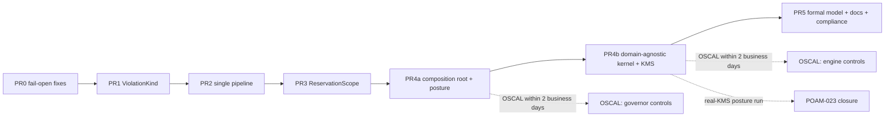

# SymbolicGovernor Refactor Plan — PRs 4–5

**Continues:** [governor_refactor_plan.md](./governor_refactor_plan.md) (PRs 1–3).
**Related:** [STERA review](./stera_security_review.md) · [Domain-agnosticism review](./stera_domain_agnosticism_review.md). Finding IDs A1–A11, B1–B11 and C come from the domain-agnosticism review. K1–K4 are defined in §4b.3.
**Posture:** Reference architecture. Breaking changes are allowed and there are no compatibility shims (AGENTS.md).

**Preconditions:** PRs 0–3 are merged. When this plan starts:
- the `governor/` package exists;
- violations carry a `ViolationKind`;
- there is a single staged pipeline with `FULL` / `POST_HITL` / `DRY_RUN` profiles;
- `ReservationScope` owns phase-2 commits.

> [!IMPORTANT]
> **Aligned with the resolved design decisions (2026-09-26)** in [governor_refactor_plan.md §Resolved design questions](./governor_refactor_plan.md). What changed in this plan:
> - **`CBF_FAIL_OPEN` removal is already done** (#259). §4a.3, §4a.6 and §4a.7 no longer carry it.
> - **Decision 5 keeps `null_components.py`.** The deny-by-default null objects stay. The composition root (§4a.1) passes them explicitly when no plugin fills a slot. §4a.4 no longer deletes the file.
> - **Deleting `_violations_to_strings` moves to PR 2 task T1.**
> - **Formal-model profiles and NARROW move to PR 2 task T8** (decisions 2 and 3). §5.1 keeps only the TLA+ side.

## Governing rules

1. **The kernel hosts mechanisms; domains supply semantics.**
   - Kernel engines (CBF, consensus, causal, reservation guard, narrowing, STPA validator, claim detectors) have **no default domain behaviour**.
   - Anything that names a unit, a field, an action, a prompt or a threshold value is a **required constructor argument**, contributed by a plugin through `CagePlugin.contribute()`.
   - A missing contribution **fails assembly**. It never falls back to finance.
2. **Completeness Principle** (AGENTS.md, *External Vendor Adapter Standards*): CAGE must be *safety- and security-complete*, not *commercially complete*. If a safety or security property can't be verified without a component, that component is implemented for real. Data may be simulated; security primitives may not.
3. **Interface Tiering** (AGENTS.md):
   - **Tier 1 — partner-built live adapters.** Kept, and tested over the wire.
   - **Tier 2 — posture-completing interfaces.** Implemented: simulated data sources, and real security primitives such as KMS, `kid` trust anchors and WORM.
   - **Tier 3 — commercial-deployment-only interfaces.** Removed, and recorded as OSCAL customer responsibilities.

## PR overview

| PR | Branch | Title | Theme | Depends on |
|---|---|---|---|---|
| **4a** | `refactor/governor-composition-root` | `refactor(governance)!: build governor via composition root` | Composition root, explicit startup posture, leftover code removed, `PluginContribution` surface | PR 3 |
| **4b** | `refactor/governor-kernel-purity` | `refactor(governance)!: make kernel engines domain-agnostic` | Domain-agnostic engines (CBF, reconciliation, KMS signer, consensus, causal, thresholds, STPA compiler), kernel purity, Gate G3 extension | 4a |
| **5** | `docs/governor-convergence` | `docs(governance): converge formal model, architecture docs, and compliance artifacts with governor v4` | Formal model, docs, compliance artifacts | 4b |

**Why split PR 4?** Wiring changes (4a) and semantic changes (4b) are reviewed differently, and 4b changes what gets enforced (A1, A2, A4, A5). Putting 4b in its own PR also starts the OSCAL 2-business-day clock (§5.3) on the PR that actually changes enforcement. If you prefer one PR, merge 4a and 4b but keep the 4b commit order (§4b.0). The squash-merge still hides intermediate states from `main`.

**Urgency:**
- 4a: medium.
- 4b: high, because A1/A2/A4/A5 change behaviour for non-finance domains.
- 5: medium; it must close before the next release tag.

---

## PR 4a — Composition root and posture

### Problems addressed

| # | Problem | Evidence at HEAD |
|---|---|---|
| P1 | **Importing the module has side effects.** Import triggers KMS `validate_ready()`, Redis `ping_ready()` and a `dowhy` probe, and raises `RuntimeError`. Tests and tools therefore depend on the environment. | [symbolic_governor.py:83-157](../src/gateway/governance/symbolic_governor.py#L83-L157) |
| P2 | **Posture logic disagrees with itself.** `_IS_PRODUCTION` defaults to production, but the stub-reconciliation guard defaults `CAGE_ENV` to `"dev"` and only matches `== "production"`. [`env_posture.resolve_posture()`](../src/gateway/governance/env_posture.py#L42) already exists and is ignored. The KMS signer has the same issue (K3). | L83-86 vs L150-153; `assert_safe_operational_state` L2797; [kms_signer.py:589-605](../src/gateway/governance/kms_signer.py#L589-L605) |
| P3 | **The "immutable" registry is mutated after construction.** `install_domain_components()` rewrites `symbolic_governor._domain_tiers`, `.safety_filter` and `.consensus_engine` on a module-level singleton. This contradicts the ARCH-2 comment ("no runtime register_domain_tier() allowed"). | [singletons.py:44-113](../src/gateway/governance/singletons.py#L44-L113) |
| P4 | **Constructor args are kept but unused.** `safety_filter`, `fiscal_limit_guard`, `consensus_engine` and `telemetry_provider` are no longer on the hot path after PRs 2–3. Null objects (`NullSafetyFilter`, `NullConsensusProvider`) exist only to fill those slots. | L831-853, [null_components.py](../src/gateway/governance/null_components.py) |
| P6 | **`register_invariant()` mutates the governor after construction.** It stores invariants on the governor, but only the CBF engine consumes them. | L892-951 |

P5 (domain vocabulary in Layer 1) is handled by PR 4b.

### 4a.1 Composition root — `src/gateway/governance/governor/assembly.py`
```python
@dataclass(frozen=True)
class GovernorComponents:
    opa: PolicyClient
    stpa_rules: tuple[UcaRule, ...]              # contributed by domains (§4b.9)
    core_stages: tuple[Stage, ...]
    domain_tiers: tuple[GovernanceTierPlugin, ...]
    narrowers: tuple[Narrower, ...] = ()

def assemble_governor(plugins: Sequence[CagePlugin], *, posture: DeploymentPosture) -> SymbolicGovernor:
    """Single composition root. Collects contributions from every plugin,
    rejects slot collisions, then constructs an immutable governor."""
```
- **Plugins contribute data instead of mutating the governor.** `CagePlugin.register()` becomes `CagePlugin.contribute() -> PluginContribution` (§4a.2).
- **`singletons.py` is removed.** Most callers only need a governor instance. Replacements:
  - the FastAPI app → lifespan state (`app.state.governor`);
  - LangGraph → node factories take the governor as a constructor dependency.
- **Wrong assembly fails at startup.** `assemble_governor` raises if:
  - no domain plugin supplies a tier for an action that appears in the FTRA terminal registry (fail closed on ungoverned irreversible actions);
  - two plugins claim the same action in the same `(phase, order)` slot;
  - two plugins claim the same `domain` or the same threshold section.
- **The governor is immutable after construction.** `SymbolicGovernor.__init__` takes `GovernorComponents` only and stores tuples. Class-level `__slots__`, with no setters.
- **`register_invariant` moves to CBF.** It becomes part of `ControlBarrierFunction` construction (invariants go with the barrier that uses them), which fixes P6. The existing V1–V4 validation moves with it.

### 4a.2 Contribution surface
Every semantic slot exists in 4a, so that 4b fills them without changing the assembly API:

```python
@dataclass(frozen=True)
class PluginContribution:
    domain: str                                            # "finance", "healthcare", "physical_ai"
    tiers: tuple[GovernanceTierPlugin, ...] = ()
    uca_rules: tuple[UcaRule, ...] = ()                    # §4b.9
    narrowers: tuple[Narrower, ...] = ()                   # §4b.6
    threshold_sections: Mapping[str, type[BaseModel]] = {} # §4b.7  key = section name under domains.<domain>
    execution_verbs: frozenset[str] = frozenset()          # §4b.13
    standing_projector: StandingProjector | None = None    # §4b.16 (A9)
    ground_truth_providers: Mapping[str, GroundTruthProvider] = {}  # §4b.2  key = invariant_id (simulated in CAGE)
    registered_actions: frozenset[str] = frozenset()       # feeds Gate G3 rule 1 (§4b.17)
```
4a ships these fields with empty defaults. Finance, healthcare and physical-AI still hand over only their tiers; 4b fills in the rest.

### 4a.3 Explicit startup posture — `governor/posture.py`
```python
def assert_production_posture(posture: DeploymentPosture, *, components: GovernorComponents) -> None:
    """Called once from the app lifespan, never at import time."""
```
- It absorbs the import-time guards (P1) and `assert_safe_operational_state()`. All of them derive from `env_posture.resolve_posture()` only, which fixes P2.
- **Checks in 4a:**
  - `dowhy` is importable, only if a causal tier is registered (the check is driven by the tier, not hard-coded);
  - KMS is ready;
  - Redis is ready;
  - **the KMS signer isn't in HMAC fallback mode (K3).** The fallback is decided only by `resolve_posture()`, and HMAC is allowed only in development posture and hermetic tests. This replaces the combined "`CBF_FAIL_OPEN` and HMAC" check, which #259 deleted together with the flag. Production posture has had no HMAC check at all since then, so this one closes that gap.
- **Checks added by 4b** (§4b.1, §4b.2): every invariant marked `requires_external_ground_truth` has a reader and a resolvable `kid`; readings are KMS-signed; the reconciler runs under a separate identity. This replaces `RECONCILIATION_PROVIDER != stub`.
- **Wiring:** the lifespan hook is in the gateway app factory. LangGraph and CLI entry points call the same function.
- **Already done (#259):** `CBF_FAIL_OPEN` and the fail-open branch of `revalidate_post_hitl` are gone. The remaining POAM-023 check in `assert_safe_operational_state()` moves into this function.

### 4a.4 Remove leftover code
Delete each of the following:
- the `safety_filter`, `fiscal_limit_guard`, `consensus_engine` and `telemetry_provider` args. **Keep `null_components.py`** (decision 5): `assemble_governor` places a null object in every slot no plugin fills, so a bare kernel denies by construction;
- any remaining legacy `list[str]` result format. `_violations_to_strings` itself is deleted by PR 2 task T1;
- `_env_flag` (inline it, or move it to `env_posture`);
- the obsolete Prometheus try/except-pass registration. Move it to `governor/metrics.py` with an explicit registry.
- all "Legacy inline dispatch deleted", "CRIT-5 fix" and "Peer Review Fix" comment blocks that describe code which no longer exists.

After 4a, `scripts/verify_governor.py` and `scripts/measure_paper_metrics.py` must use the composition root.

### 4a.5 Tests
- **Import-purity test.** Importing `src.gateway.governance.governor` with `CAGE_ENV=production` and no KMS or Redis must succeed. Only `assert_production_posture` raises.
- **One test per posture violation.** For each 4a condition, a table-driven test asserts `assert_production_posture` raises. This includes HMAC fallback in production posture. For development posture, it logs CRITICAL and does not raise.
- **Posture parity.** Every production check calls `resolve_posture()`. A monkeypatch spy asserts there are no direct `os.environ` reads for `CAGE_ENV` / `ENVIRONMENT` under `governor/` or in `kms_signer.py`.
- **Assembly tests:**
  - a slot collision raises;
  - a duplicate `domain` or threshold section raises;
  - an irreversible action with no governing tier raises;
  - the governor exposes no mutable tier attributes (`setattr` raises).
- **Migrations:**
  - update `tests/conftest.py` fixtures that patched `singletons.symbolic_governor` to build via `assemble_governor(...)`;
  - add a shared `governor_factory` fixture.
- Every new test gets `pytestmark = [pytest.mark.unit, pytest.mark.local]`.

### 4a.6 Acceptance
- `make test-fast` is green.
- `grep -rnE 'singletons|install_domain_components' src/ tests/` returns zero hits.
- `NullSafetyFilter` / `NullConsensusProvider` are referenced only by `assembly.py` and their tests. A test builds a governor with no plugins and observes DENY on every entry point.
- `make update-nemo-configmap` is run if `config/rails/actions.py` changed. NeMo nodes now receive the governor by injection, so it probably will.
- `.github/workflows/test-hermetic.yml` and `policy_compile.yml` are updated for the new import paths.

### 4a.7 Risks
| Risk | Mitigation |
|---|---|
| **Removing the singleton touches many call sites** (FastAPI, LangGraph nodes, NeMo actions, scripts). | Commit 1 adds `assemble_governor` alongside the singleton. Commit 2 migrates callers. Commit 3 deletes `singletons.py`. The PR is squash-merged, so `main` never sees the intermediate state. |
| **Rejecting HMAC in production posture breaks environments without KMS.** | Development posture still allows HMAC. Hermetic tests use the software Ed25519 provider (K4, §4b.3). |

---

## PR 4b — Domain-agnostic kernel

### 4b.0 Commit order (squash-merged)
1. **Seams and value objects.** `GroundTruthProvider`, `SimulatedSource`, `CriticSpec`, `CausalSpec`, the threshold section accessor, and the software Ed25519 signer (K4). These add code only.
2. **Security primitives.** KMS provider move (K1) and the fail-closed reconciler signing fix (K2).
3. **CBF and reconciliation.** CBF (§4b.1), reconciliation split and simulators (§4b.2).
4. **Consensus and causal.** Consensus (§4b.4), causal (§4b.5).
5. **Thresholds and fiscal guard.** Thresholds schema (§4b.7), fiscal guard move (§4b.8).
6. **STPA compiler.** Per-domain compiler (§4b.9), then `check_stpa_freshness.py` and regenerated artifacts.
7. **Leftovers.** Moves and deletions (§4b.6, §4b.10–§4b.16).
8. **Enforcement.** Gate G3 extension (§4b.17) and the vocabulary sweep (§4b.18).

### 4b.1 CBF becomes invariant-parametric — fixes A1, A2, A3, A11
File: [`safety/cbf_engine.py`](../src/gateway/governance/safety/cbf_engine.py)

```python
class ControlBarrierFunction:
    def __init__(self, invariant: InvariantModel, cost_resolver: CostResolver,
                 *, ground_truth: GroundTruthReader | None, skip_epoch_seed: bool = False): ...
```

**Required args.** `invariant` and `cost_resolver` are required. `ground_truth` is keyword-only and has no default: callers must pass `None` explicitly to mean self-reported.

**Delete:**
- the `min_cash_balance` attribute (L415);
- `get_h(cash_balance)` (L1199);
- `_DefaultKernelBarrier` and `_legacy_finance_cost_resolver` (L409, L1221);
- the drawdown branch (L1414-1421);
- all `100000.0` seeds and defaults (L545, L557, L1186);
- the `resolved_threshold` override (L1751-1755).

**Barrier.** `h(x) = state[invariant.state_key] − thresholds.resolve(invariant.threshold_key)`. An unknown key is a `CBFInitializationError` at construction, not at request time.

**Initial state.** `setup()` uses `invariant.initial_state`, which becomes a new required field on `InvariantModel`, instead of `100000.0`.

**Renames** (vocabulary follows the value object):

| From | To |
|---|---|
| `_read_cbf_state_atomic` | `_read_barrier_state` |
| `current_cash` | `state_value` |
| `balance_source` | `state_source` |
| `_resolve_ground_truth_balance` | `_resolve_ground_truth` |

Span attributes also change: `safety.cash.next` → `safety.barrier.state_next`, and `safety.balance.*` → `safety.barrier.source*`. The Lua script keeps its shape; only the ARGV comments change.

**Ground truth is per invariant.** The key is `reconciliation:verified:{invariant.invariant_id}`, read through `GroundTruthReader` (§4b.2). A cash reading can no longer feed a serum-concentration barrier.

**Drawdown (A3) moves to finance** as a UCA rule contributed through §4b.9. UCA-5 already expresses drawdown, so this merges `drawdown.limit` and `stpa.uca5_drawdown_threshold_pct` into one finance rule. The verdict is unchanged: both paths were hard violations → DENY.

**Domain updates.** Finance `CashBarrier`, healthcare `SerumConcentrationBarrier` and the physical-AI kinematic barrier ([kinematic_barrier_tier.py](../src/cage_physical_ai/tiers/kinematic_barrier_tier.py)) all declare `initial_state` and `requires_external_ground_truth`, and pass their own cost resolver.

### 4b.2 Reconciliation — simulated data, real security primitives — fixes B3 (and the root of A2)

> [!NOTE]
> Under Interface Tiering, ground truth is a **Tier 2 posture-completing interface**:
> - **Data sources** are simulated.
> - **Security primitives are real:** separate-identity reconciler, KMS asymmetric signing, `kid` trust anchors, TTL, replay and fence-epoch defence.
> - **Commercial ledger APIs are Tier 3** and are removed.

| Piece | Destination |
|---|---|
| `GroundTruthProvider` / `GroundTruthReading(invariant_id, value, unit, observed_at, sequence, signature, source)` protocol | new seam `src/gateway/governance/seams/ground_truth.py` (zero kernel imports, like the other seams) |
| Signing, TTL, sequence and replay logic (`ExternalLedgerReconciler`, `read_verified_balance`) | stays in [`reconciliation/daemon.py`](../src/gateway/governance/reconciliation/daemon.py), renamed `GroundTruthReconciler` / `read_verified_state(redis, invariant_id)`. It stays a separate process with its own identity, so the "execution system can't write its own ground truth" property is still demonstrated. |
| Provider resolution (`RECONCILIATION_PROVIDER`) | a registry keyed by `invariant_id`, filled from `PluginContribution.ground_truth_providers`. There's no kernel factory into `src/integrations/`. |
| `PlaidLedgerProvider`, `AnchorageGrpcLedgerProvider` | **delete** (Tier 3: needed only for a commercial deployment) |
| `GcsLedgerProvider` / `ObjectStoreLedgerProvider` | **delete**. The WORM snapshot pattern is already demonstrated by the evidence cold store (`evidence/cold_store.py` with `storage_gcs`/`storage_s3`). |
| `StubLedgerProvider` (static `$100k`) | **replace** with the domain simulators below. A static value can't exercise drift, replay or staleness. |
| Finance ledger semantics (`balance_usd` → `value`, `unit="USD"`, accounts) | `src/cage_finance/reconciliation/simulated_ledger.py::SimulatedLedgerProvider` |
| Healthcare ground truth | `src/cage_healthcare/reconciliation/simulated_lab_feed.py::SimulatedLabFeedProvider` (serum concentration readings) |
| Physical-AI ground truth | `src/cage_physical_ai/reconciliation/simulated_sensor.py::SimulatedSensorProvider` (kinematic state) |

**Simulated provider contract.** All three share the kernel helper `seams/ground_truth.py::SimulatedSource`:
- **Its own journal.** The simulator keeps an independent journal, fed by the `ActuationReceipt`s the domain actuator emits (e.g. finance [`BrokerActuator`](../src/cage_finance/actuators/broker_actuator.py)). It is not read from the CBF's `state_key`. Divergence between self-reported and reconciled state can therefore actually happen and be detected.
- **Deterministic.** It is seeded (`CAGE_SIM_SEED`), so tests and paper measurements can be reproduced.
- **Fault injection** (`CAGE_SIM_FAULT` or a constructor arg). Each mode maps to a fail-closed path:

  | Mode | Expected kernel behaviour |
  |---|---|
  | `stale` (reading older than TTL) | reader returns `None` → strict mode BLOCK |
  | `unsigned` | posture violation in production posture; BLOCK in strict mode |
  | `bad_signature` | signature-invalid path → BLOCK |
  | `replayed_sequence` | replay defence → BLOCK |
  | `drift` (journal ≠ self-reported) | reconciled value wins; drift span attribute is set |
  | `unavailable` | BLOCK in strict mode |
  | `epoch_regression` | fence-epoch regression → BLOCK |
  | `hmac_signed` (symmetric fallback) | posture violation in production posture; never accepted as verification evidence |
  | `unknown_kid` | trust-anchor lookup fails → BLOCK (AGENTS.md: fail closed on unknown `kid`) |
  | `signing_failure` | reconciler writes nothing (K2); previous reading ages out → BLOCK |

**Signing.**
- **Real KMS asymmetric signing.** Signing goes through the KMS providers (moved to `src/integrations/` by K1). The private key is held only by the reconciler's identity.
- **Verification by `kid`.** The gateway verifies with a public key resolved by `kid` from an independently fetched key manifest, never from the signed reading.
- **No HMAC outside development.** HMAC is symmetric, so the verifier could forge readings. It's a posture violation outside development posture.

**Posture (added to §4a.3).** Production posture requires all of the following:
- KMS-signed readings;
- a reconciler under a separate identity;
- a resolvable `kid` for every invariant marked `requires_external_ground_truth`.

Simulated *data* providers are the intended posture for a reference architecture. The real-data-provider obligation is recorded for adopters in OSCAL (§5.3). Key custody isn't handed to adopters this way: CAGE itself exercises it.

**Deployment.** The reconciliation service in [infra/targets/gcp-cloudrun/main.tf](../infra/targets/gcp-cloudrun/main.tf) stays as an illustrative model with `RECONCILIATION_PROVIDER=simulated`. It keeps its existing KMS verifier binding (`reconciliation_kms_verifier`). Update its entrypoint and env var names in the README. Run `terraform plan` only; apply per the deployment rules.

**Tests.** No `partner_integration` tests are needed, because no Tier 1 adapter is involved.
- **Hermetic tests** (`unit`, `local`):
  - `tests/cage_finance/test_reconciliation_worker.py`, `test_cbf_reconciliation.py` and `tests/test_replay_defense.py` move to the generic reader and the finance simulator;
  - a table-driven test runs **each fault mode × each domain simulator** and asserts the expected verdict. Signing uses the software Ed25519 provider (K4).
- **Posture-evidence test** (`integration`, against the GKE or Cloud Run illustrative target with real KMS): the reconciler signs through KMS; the gateway verifies by `kid`. A forged software-key reading and an HMAC reading are both rejected. Run it per the [GKE](../docs/operations/GKE_TEST_RUNBOOK.md) / [Cloud Run](../docs/operations/CLOUDRUN_TEST_RUNBOOK.md) runbooks. **Only this run counts toward POAM-023 closure.**

### 4b.3 KMS signer as a Tier 2 security primitive — K1–K4
Findings at HEAD in [kms_signer.py](../src/gateway/governance/kms_signer.py) and [reconciliation/daemon.py](../src/gateway/governance/reconciliation/daemon.py):

| # | Finding | Evidence | Fix |
|---|---|---|---|
| K1 | **Vendor SDKs are imported inside the kernel.** They're function-scoped, but the Layer 1 vendor-neutral rule still applies. Gate G3 enforces `FORBIDDEN_VENDOR_SDKS` only under `evidence/`, so it doesn't catch these. | `google.cloud.kms` L138/L199/L613/L786, `boto3` L265, `azure.*` L320-351 | Move `GCPKMSProvider`, `AWSKMSProvider` and `AzureKMSProvider` to `src/integrations/{gcp,aws,azure}/kms_provider.py` (`gcp/` already exists). The kernel keeps `KMSGovernanceSigner` and the provider protocol (`raw_signer_protocol.py`). Add a `signer_factory.py` to `INTEGRATIONS_FACTORY_ALLOWLIST`. Enforced by G3 rule 4 (§4b.17). |
| K2 | **The reconciler writes unsigned readings when KMS signing fails** ("balance will be written unsigned"). | [daemon.py:1117-1122](../src/gateway/governance/reconciliation/daemon.py#L1117-L1122) | Fail closed: on signing failure, don't write. The previous reading ages out through TTL, and the CBF blocks in strict mode. Covered by fault mode `signing_failure`. |
| K3 | **The HMAC fallback is chosen by reading `CAGE_ENV` directly** (`dev/test/ci`). | [kms_signer.py:589-605](../src/gateway/governance/kms_signer.py#L589-L605) | Done in **4a** (§4a.3): decided only by `resolve_posture()`. In 4b, every HMAC signature carries `alg=HMAC_SHA256_FALLBACK`; verifiers reject it outside development posture, and evidence exporters (OSCAL, POAM tooling) refuse it as evidence. |
| K4 | **Hermetic tests have no asymmetric path.** Without KMS they fall back to HMAC, so the `kid` verification logic never runs offline. | [kms_signer.py:437](../src/gateway/governance/kms_signer.py#L437) | Add a test-only `SoftwareEd25519Provider` behind the same protocol, with its own `kid` and manifest. It exercises asymmetric verification hermetically and is marked non-evidentiary. |

### 4b.4 Consensus becomes prompt-agnostic — fixes A4, B11 (legacy adapter)
File: [`consensus/engine.py`](../src/gateway/governance/consensus/engine.py)

```python
@dataclass(frozen=True)
class CriticSpec:
    role: str
    system_instruction: str
    prompt_template: str            # formatted with {role}, {action}, {context}

class ConsensusGate:
    def __init__(self, critics: Sequence[CriticSpec], *, render_context: ContextRenderer,
                 magnitude_of: MagnitudeResolver, threshold: float, registry: ConsensusModelRegistry | None = None): ...
```

**Delete:**
- `_CRITICS_CONFIG` (L68);
- the hardcoded "financial institution" prompt (L284-295);
- `amount`/`symbol` extraction (L256-257, L401-403);
- `THRESHOLDS.consensus.threshold_usd`.

Audit records store `render_context(context)` (opaque) instead of `symbol`/`amount`. An empty `critics` list raises `ValueError`.

**Domain updates:**
- **Finance** loads `src/cage_finance/config/critics.yaml`. The finance prompt in production today is the hardcoded fallback, because the YAML was never loaded. Before cutting over, diff the two and make `critics.yaml` match the fallback. Record any intended wording change in `BREAKING_CHANGES_v4.md`.
- **Healthcare** ([clinical_consensus_tier.py](../src/cage_healthcare/tiers/clinical_consensus_tier.py)) and **physical-AI** ([physical_consensus_tier.py](../src/cage_physical_ai/tiers/physical_consensus_tier.py)) each add a `config/critics.yaml` with domain critics.

Also delete the legacy `(action, amount, symbol)` adapter ([contracts.py:499-524](../src/gateway/governance/contracts.py#L499-L524)).

### 4b.5 Causal gatekeeper becomes domain-injected — fixes A5, A6
File: [`causal/gatekeeper.py`](../src/gateway/governance/causal/gatekeeper.py)

```python
@dataclass(frozen=True)
class CausalSpec:
    graph_dot: str
    treatment: str
    outcome: str
    treatment_of: Callable[[Mapping[str, Any]], float | None]   # None ⇒ fail closed
    regime_of: Callable[[Mapping[str, Any]], str]
    normalization_scale: float

class CausalGatekeeper:
    def __init__(self, spec: CausalSpec, *, telemetry: TelemetryProvider, cache: RedisLike | None): ...
    async def check(self, action: str, params: Mapping[str, Any]) -> CausalVerdict: ...
```

**Delete:**
- the `_CAUSAL_CONFIG_PATH` filesystem read into `cage_finance` (L70-82);
- the hardcoded trade graph (L602-617);
- the module-level `causal_safety_check` function (it becomes a method);
- `generate_mock_telemetry()`, which moves to `src/cage_finance/causal/synthetic_telemetry.py`. Dev-only use is gated by posture.

**Fail-closed semantics:**
- `treatment_of(params) is None` → `CausalVerdict.BLOCK` with reason `TREATMENT_UNRESOLVED`.
- `== 0.0` → `PASS`, because no treatment means no causal effect. That decision belongs to the domain's extractor.

**Cache key.** `causal_cache:{domain}:{action}:{regime_of(params)}`.

**Finance update.** [causal_tier.py](../src/cage_finance/tiers/causal_tier.py) builds a `CausalGatekeeper` from `cage_finance/config/causal_graph.yaml` inside the plugin, with `treatment_of=lambda p: p.get("amount")`.

### 4b.6 Narrowing — fixes A7
- If `_compute_narrowed_params` still exists after PR 1, move the amount clamp to `src/cage_finance/narrowing.py::AmountCeilingNarrower`, with its ceiling taken from the finance threshold section.
- `scope` and `date_range` clamps have no domain consumer: delete them (matches PR 1 Open Q3).
- Remove the substring classification (`"amount exceeds"`, …). Narrowability is `ViolationKind.NARROWABLE` from PR 1.

### 4b.7 Threshold schema opens up — fixes B1
File: [`schemas/thresholds.py`](../src/gateway/governance/schemas/thresholds.py), data: [`config/governance_thresholds.json`](../config/governance_thresholds.json)

- **Kernel keeps** `confidence.agent_threshold`, `confidence.min_score`, `fria`, `causal` (statistical parameters only), `kms_batch`, `telemetry` and `pii_audit_retention_days`.
- **Removed from the kernel** and moved to domain sections:

  | Removed | Moves to |
  |---|---|
  | `cbf.min_cash_balance`, `drawdown`, `stpa.*`, `consensus.threshold_usd`, `confidence.min_trade_confidence` | finance section |
  | `healthcare` | healthcare section |
  | `cbf.gamma` | per-invariant (already on `InvariantModel`) |

- The JSON gains `"domains": {"finance": {...}, "healthcare": {...}, "physical_ai": {...}}`. Each plugin contributes a Pydantic model per section (`threshold_sections`).
- `assemble_governor` validates every section and raises in two cases:
  - an active plugin's section is missing;
  - a section has no owning plugin.
- Accessor: `thresholds.resolve("domains.healthcare.min_therapeutic_concentration")`. `InvariantModel.threshold_key` values are rewritten to this form.

### 4b.8 Fiscal guard moves back to finance — fixes B2
- Move [`safety/resource_guard.py`](../src/gateway/governance/safety/resource_guard.py) (`FiscalLimitGuard`, the `fiscal:*` keys, `FISCAL_DAILY_CAP_USD`) to `src/cage_finance/safety/fiscal_limit_guard.py`. This reverses the "promotion" noted in [types.py:30](../src/gateway/governance/types.py#L30).
- The kernel keeps only the `ResourceGuard` protocol and `ReservationToken`, which use `magnitude` and are already generic.
- Delete the `FiscalGuard = ResourceGuard` alias ([contracts.py:672](../src/gateway/governance/contracts.py#L672)).

### 4b.9 STPA compiler per domain — fixes B4, A8
File: [`stpa_compiler.py`](../src/gateway/governance/stpa_compiler.py)

**CLI:**
```bash
uv run python -m src.gateway.governance.stpa_compiler --domain finance \
  --spec src/cage_finance/config/stpa/control_structure.yaml --out src/cage_finance/stpa/
```
Move `config/stpa_control_structure.yaml` into `src/cage_finance/config/stpa/`.

**Generated outputs**, all per domain:

| Output | Replaces |
|---|---|
| `uca_rules.py` (`UcaRule` tuple) | `generated_stpa_validator.py` |
| `saga_nodes.py` | `generated_saga_nodes.py` |
| `opa/rbac.rego` | — |
| `terminal_registry.json` (`domain` read from the spec, not hardcoded at L1547) | — |

**Spec schema renames.** These remove finance identifiers from the compiler:

| From | To |
|---|---|
| `trade_limits` | `limits` |
| `currency_denylist` | `denylist` |

The RBAC emitter reads `rbac_rules.action`, `subject_field`, `magnitude_field` and `denylist_field` from the spec, instead of the literals `execute_trade`/`trader_role`/`amount`/`currency` (L660-695, L1438-1460).

**Kernel side.** The kernel `STPAValidator` becomes a generic engine over contributed `UcaRule(action, predicate, uca_id)`s. Delete `src/gateway/governance/generated_stpa_validator.py` and `generated_saga_nodes.py`. Update the importer at [auditor.py:40](../src/governed_financial_advisor/agents/evaluator/auditor.py#L40).

**Freshness check.** `scripts/check_stpa_freshness.py` and the `stpa-freshness-check` CI job iterate over every `src/cage_*/config/stpa/` spec. Domains without a spec contribute zero rules. Commit the regenerated artifacts.

### 4b.10 Ontology — fixes B5
Move `TradingKnowledgeGraph` from [ontology.py](../src/gateway/governance/ontology.py) to `src/cage_finance/ontology.py`. This updates `tests/test_ontology.py`, the reference in `compliance_bridge/types.py` and the UCA-7 comment in `defer_queue.py`. If nothing generic remains in the kernel `ontology.py`, delete it.

### 4b.11 FTRA bounding contract — fixes B6
The only consumers of [ftra/bounding_contract.py](../src/gateway/governance/ftra/bounding_contract.py) are in `cage_finance`: `safety/bounding/*`, `plugin.py` and `__init__.py`. Move it into `src/cage_finance/safety/bounding/` and delete it from the kernel.

### 4b.12 LangGraph harness and inference proxy — fixes B7
- **Delete the dead NeMo pre-check path (Q7, approved 2026-09-26).** No Colang flow calls the finance NeMo actions, so the per-request `compute_nemo_context` probe feeds nothing. Delete:
  - the probe calls in both input rails, and `nemo_context.py`;
  - the five finance actions in `src/integrations/nemo/actions.py` and their pass-through stubs in `config/rails/actions.py`, with the matching registry entries, `nemo_exporter.py` mappings and tests;
  - the `pre_check_results` parameter on the NeMo manager.
  Run `make update-nemo-configmap`. Keep the financial-advisor signed-token `check_approval_token`. If this is already done in PR 2 (#261), delete this bullet.
  - Once the probe is gone, the `governance_params` extraction below may have no consumers left. Delete it rather than generalise it if so.
- [nemo_node_factory.py:385-400](../src/gateway/governance/langgraph_harness/nemo_node_factory.py#L385-L400) and [inference_proxy.py:352+](../src/gateway/server/inference_proxy.py#L352): delete the implicit extraction of `amount, symbol, drawdown_pct, order_size…`.
  - `governance_params` must be present in state, or the node config must provide a `params_extractor`.
  - If neither exists, fail closed with a DENY receipt.
- [opa_node_factory.py](../src/gateway/governance/langgraph_harness/opa_node_factory.py):
  - span keys come from `config.span_keys: tuple[str, ...] = ()` (L138);
  - `approved_target` and `blocked_target` become required args with no `"governed_trader"` default (L262).

### 4b.13 Claim detectors — fixes B8
- [authorization_claim_detector.py](../src/gateway/governance/authorization_claim_detector.py) and [confidence_claim_detector.py](../src/gateway/governance/confidence_claim_detector.py) compile their verb alternation from:
  - the kernel core set `{execute, submit, process, approve, authorize, place}`;
  - the union of the contributed `execution_verbs`.
- Finance contributes `{buy, sell, trade, transfer}`, healthcare `{administer, prescribe, dispense}`, and physical-AI `{actuate, move, dispatch}`.

### 4b.14 HITL escalator — fixes B9
In [hitl_escalator.py](../src/gateway/governance/hitl_escalator.py), rename `amount_usd` → `magnitude`. `threshold_usd` becomes an injected `threshold`. The `CONSENSUS_THRESHOLD` docstring loses its "USD 10,000" wording.

### 4b.15 AAIF adapter — fixes B10
In [aaif_adapter.py:96](../src/gateway/governance/ingress/aaif_adapter.py#L96), change `"src.cage_finance.consensus.consensus"` → `"src.gateway.governance.consensus.engine"`.

### 4b.16 Governor residue — fixes A9, A10
- `PauseReceipt.standing_at_pause` becomes the domain-supplied `standing_projector(params)`, falling back to `{"confidence": ...}`. The kernel stores an opaque projection.
- The confidence message becomes generic: "Action `{action}` at confidence …".
- The comment "Non-trade actions" (L1605) becomes "Actions not claimed by any domain tier".

### 4b.17 Gate G3 extension — mechanical enforcement
In [check_import_boundaries.py](../scripts/check_import_boundaries.py), add an AST pass over `src/gateway/**/*.py` that scans code string constants only (docstrings and comments are excluded). It fails on:
1. **Action literals.** Any string equal to a member of any plugin's `registered_actions`.
2. **Domain param keys.** Any string in `{"amount", "symbol", "drawdown", "drawdown_pct", "trader_role", "market_regime", "currency", "order_size", "daily_vol"}`, plus any key declared in a domain threshold section.
3. **Cross-layer references.** `Path(...)` segments or string constants containing `cage_` or `governed_financial_advisor`. This catches A6 and B10, which today bypass the import check.
4. **Vendor SDKs anywhere in the kernel.** Widen the `FORBIDDEN_VENDOR_SDKS` scope from `evidence/` to all of `src/gateway/`, including function-scoped imports. Allowlisted factory modules may import `src.integrations.*` only, never an SDK directly. Blast radius at HEAD is two files: `kms_signer.py` (10 imports, fixed by K1) and `reconciliation/daemon.py` (3, removed by §4b.2).

The allowlist covers test fixtures only; `src/integrations/` is out of scope (Layer 3 may name domain actions). Negative tests inject one violation of each kind and expect failure.

### 4b.18 Vocabulary sweep — fixes C
- Replace `execute_trade`/`AAPL`/`HIGH_FINANCIAL` examples in kernel docstrings with neutral ones (`"example.irreversible_action"`, `{"param": 1}`), and "trade/balance" comments with "action/state".
- The gate doesn't scan prose, so this is a one-time sweep checked by the §4b.20 grep.

### 4b.19 Tests (all `pytestmark = [pytest.mark.unit, pytest.mark.local]` unless noted)

| Area | Test | Observes failure? |
|---|---|---|
| CBF | A healthcare barrier with a valid **cash** reading present uses `safety:serum_concentration` and `domains.healthcare.min_therapeutic_concentration` | ✅ (regression for A1/A2) |
| CBF | The same for the physical-AI kinematic barrier | ✅ |
| CBF | Construction without `invariant`/`cost_resolver` → `TypeError`; an unknown `threshold_key` → `CBFInitializationError` | ✅ |
| CBF | A `drawdown_pct` payload through a healthcare barrier produces no violation; finance produces a UCA violation with an identical verdict | ✅ |
| Reconciliation | Each fault mode × each domain simulator gives the expected verdict (§4b.2 table) | ✅ |
| Reconciliation | The per-invariant key is isolated: a reading for `finance.cash` isn't visible to `healthcare.serum` | ✅ |
| KMS | K2: a signing failure writes nothing; K3: an HMAC signature is rejected outside development posture; K4: Ed25519 `kid` verification rejects an unknown `kid` and a forged signature | ✅ |
| KMS (`integration`) | Posture-evidence run against real KMS (§4b.2) | ✅ |
| Posture | An invariant requiring ground truth with `ground_truth=None` in production → raises | ✅ |
| Consensus | The healthcare and physical-AI rendered prompts match none of `financ\|trade\|equity\|portfolio`; empty `critics` → `ValueError` | ✅ |
| Consensus | The finance prompt equals the pre-PR fallback (golden) | — |
| Causal | Missing treatment → BLOCK (`TREATMENT_UNRESOLVED`); no filesystem access outside the spec | ✅ (A5) |
| Thresholds | A missing domain section → assembly raises; an orphan section → raises | ✅ |
| STPA | Finance golden corpus gives violations identical to the pre-PR validator; healthcare contributes 0 rules; generated finance Rego is identical except for renamed spec fields | ✅ |
| Harness | A NeMo node with no `governance_params` and no extractor → DENY | ✅ |
| Detectors | The finance corpus gives identical detections; a healthcare "administer … I authorize" sample is detected | ✅ |
| Gate G3 | Negative tests for each of the four §4b.17 rules | ✅ |

### 4b.20 Acceptance
- `make test-fast` is green.
- `uv run python scripts/check_import_boundaries.py --verbose` passes with all four new rules.
- These return zero hits:
  ```bash
  grep -rnE 'execute_trade|trader_role|market_regime|balance_usd|min_cash_balance|threshold_usd|cage_finance|financial institution|Plaid|Anchorage|_legacy_finance_cost_resolver' src/gateway --include='*.py'
  grep -rnE '^\s*(import|from) (google\.cloud|boto3|botocore|azure)' src/gateway --include='*.py'
  ```
- `grep -rn 'ControlBarrierFunction(\|ConsensusGate(\|CausalGatekeeper(' src` shows only explicit, fully argued constructions.
- `uv run python scripts/check_stpa_freshness.py` passes for every domain.
- `make update-nemo-configmap` runs if `config/rails/actions.py` changed.
- The posture-evidence integration run against real KMS passes, and its result is recorded for §5.3.
- The OSCAL update is in the PR checklist (the 2-business-day clock starts at merge).

### 4b.21 Risks
| Risk | Mitigation |
|---|---|
| **The finance consensus prompt changes silently** when `critics.yaml` goes live (A4). | Golden test against the pre-PR fallback; any intended change is recorded in `BREAKING_CHANGES_v4.md`. |
| **Merging CBF drawdown into UCA-5 changes the violation source** (`CBF_CONSTRAINT` → `STPA_SAFETY`). | Both are hard kinds, so the verdict stays DENY. The golden corpus asserts this. Receipts change `tier`, noted in breaking changes. |
| **The STPA generator change may alter UCA semantics.** | Golden-corpus equality test, and the `stpa-freshness-check` gate. |
| **Simulators hide defects that a real provider would expose** (latency, partial reads, schema drift). | Fault injection covers every fail-closed branch. The OSCAL customer-responsibility statement names the missing real data provider as an adopter obligation. |
| **The real-KMS posture run needs cloud access.** | It runs on the illustrative GKE/Cloud Run target per the runbooks; hermetic coverage uses Ed25519 (K4). POAM-023 stays OPEN until the run is recorded. |
| **Threshold JSON migration breaks local `.env`/ConfigMaps.** | Update `config/governance_thresholds.json` and any ConfigMap under `deployment/k8s/` in the same commit. The assembly error names the missing section. |
| **Blast radius**: about 20 non-kernel call sites construct engines directly (finance/healthcare/physical-AI tiers, `compliance_bridge/aarm_mapper.py`). | Each engine commit migrates its callers in the same commit, so no commit leaves a half-migrated engine. |

---

## PR 5 — Formal model, documentation, and compliance convergence
Scope `docs` / `governance`. The formal-model changes are code, so the title type stays `docs` only if no `src/` change is needed. Otherwise split them into `test(governance): …`.

### 5.1 Formal model — [`proof/`](../proof/)
| Change | File | Detail |
|---|---|---|
| **Profiles** | [`LangGraphHarness.tla`](../proof/LangGraphHarness.tla) | `model.py` profiles (`POST_HITL = {opa, cbf, fiscal}`) are added by PR 2 task T8. Here, mirror them in TLA+: model `POST_HITL` as a successor of `REQUIRE_APPROVAL → CHECKING(POST_HITL)` and prove `NoDirectBind` holds for both paths. |
| **NARROW semantics** | [`LangGraphHarness.tla`](../proof/LangGraphHarness.tla#L353) | `model.py` is updated by PR 2 task T8 (decision 3: the domain narrower decides what is narrowable). Mirror it in TLA+: NARROW is reachable only after a *second* full `CHECKING` pass over clamped params with all tiers PASS. |
| **Reservation atomicity** | [`DistributedCBF.tla`](../proof/DistributedCBF.tla) | Add the invariant `SealIssued ⇒ AllCommitted ∧ ¬SealIssued ⇒ NoneCommitted` (ReservationScope, PR 3). Add the CAS on fence epoch if the C4 fix has landed; otherwise record it as an open property with a `\* TODO(C4)` marker. |
| **Invariant-parametric CBF** | [`DistributedCBF.tla`](../proof/DistributedCBF.tla) | Add `CONSTANT Invariants` (symmetry set, 2 in `.cfg`) with per-invariant `state[i]`, `threshold[i]` and `groundTruth[i]`. New invariant `Isolation ≜ ∀ i ≠ j : Commit(i) ⇒ UNCHANGED state[j] ∧ groundTruth[j]` (A1/A2). |
| **Signed ground truth** | [`DistributedCBF.tla`](../proof/DistributedCBF.tla) | `groundTruth[i]` is accepted only when `signedBy = ReconcilerKey ∧ kid ∈ Manifest`. Invariant: no commit consumes a reading signed by the gateway identity or by an unknown `kid`. |
| **FTRA HITL** | [`FtraBoundary.tla`](../proof/FtraBoundary.tla) | An IRREVERSIBLE action with valid semantics goes to `REQUIRE_APPROVAL`, not `DENIED`. This fixes the old STPA miscount in the model, if the model encoded it. |
| **Causal fail-closed** | [`model.py`](../proof/model.py) | The causal stage outcome is `BLOCK` when the treatment is unresolved. |
| **Parity tests** | [`tests/test_tier_registry_formal_parity.py`](../tests/test_tier_registry_formal_parity.py) | Extend it to assert:<br>• `governor.pipeline.STAGE_ORDER` ⊆ `TIERS` for each profile;<br>• `PROFILES[p]` equals the stage set the pipeline runs for profile `p`;<br>• `classification.KIND_PRECEDENCE` matches the decision precedence encoded in `model.py`;<br>• `ControlBarrierFunction` resolves its threshold only through `invariant.threshold_key`;<br>• the causal stage has no `PASS` path for an unresolved treatment. |
| **TLC runs** | [`proof/README.md`](../proof/README.md) | Record TLC results (states explored, invariants) for all three `.cfg` files at the PR commit SHA. |

### 5.2 Architecture documentation
Update these files in place. None should describe behaviour that no longer exists (AGENTS.md "Documentation Standards"):

| Doc | Required changes |
|---|---|
| [SYMBOLIC_GOVERNOR_RUNTIME.md](../docs/architecture/SYMBOLIC_GOVERNOR_RUNTIME.md) | Rewrite it around the `governor/` package: composition root, stages, profiles, classification by kind, `ReservationScope`. Include a module map with file links. |
| [GATEWAY_ARCHITECTURE.md §2.2, §3](../docs/architecture/GATEWAY_ARCHITECTURE.md#L88-L213) | Fix the tier table. It currently claims Tier 2 and Tier 4 run concurrently via `asyncio.gather`, which was removed. Document profiles, the post-HITL path and the NARROW re-check. Mark which tiers are **kernel mechanisms parameterised by domains** (CBF, consensus, causal) and which are **domain-owned** (fiscal reservation, bounding). Remove "Fiscal Limit Pre-Reservation" as a kernel tier. |
| [FORMAL_VERIFICATION.md](../docs/architecture/FORMAL_VERIFICATION.md) | Profiles, the reservation-atomicity invariant, the NARROW re-check, `Isolation`, signed ground truth, and TLC results. |
| [EXTENSIBILITY_ARCHITECTURE.md](../docs/architecture/EXTENSIBILITY_ARCHITECTURE.md) | Cover `CagePlugin.contribute()`, `ViolationKind` obligations for tier authors, `CommitReceipt`, `Narrower`, `UcaRule` and `standing_projector`. Add a "Domain contributions" section: `threshold_sections`, `CriticSpec`, `CausalSpec`, `GroundTruthProvider` and simulators, `execution_verbs`, per-domain STPA spec, and a worked example of a fourth domain with no kernel edits. |
| [HITL_TOCTOU_REMEDIATION.md](../docs/security/HITL_TOCTOU_REMEDIATION.md) | `POST_HITL` profile; the C1/C2 root causes and how the single pipeline removes them. |
| [STPA_ANALYSIS.md](../docs/security/STPA_ANALYSIS.md) | UCA rules become domain contributions; the per-domain compiler flow; spec location `src/cage_*/config/stpa/`. |
| [ADR-008](../docs/adr/ADR-008-wire-phantom-gates-into-production-call-paths.md) | Addendum: `assemble_governor` rejects ungoverned irreversible actions. The ConsequenceGateway wiring status (C5) is tracked separately. |
| **New ADR** `docs/adr/ADR-2026-10-XX-governor-staged-pipeline.md` | Record why the pipeline has profiles, why violations carry a kind, why `CBF_FAIL_OPEN` was removed, and why the singleton was replaced by a composition root. Add a section, "Kernel hosts mechanisms, domains supply semantics", explaining why the CBF, consensus and causal defaults were removed rather than made configurable. |
| **New ADR** `docs/adr/ADR-2026-10-XX-interface-tiering.md` | Record the Completeness Principle and Interface Tiering (already in AGENTS.md on this branch). Worked classifications: Plaid/Anchorage → Tier 3 (removed); ground truth → Tier 2 (simulated data, real KMS); `provider_01`–`provider_08`/`actuator_01` → Tier 1. |
| [AGENTS.md](../AGENTS.md) Layer 1 row | Add "Kernel engines take all domain semantics as required constructor arguments". Update the note on vendor SDK enforcement: after 4b, G3 enforces `FORBIDDEN_VENDOR_SDKS` across all of `src/gateway/`, not only `evidence/`. |
| [BREAKING_CHANGES_v3.md](../docs/BREAKING_CHANGES_v3.md) → add a v4 section (or a new `BREAKING_CHANGES_v4.md`) | Every breaking change from PRs 1–4b with migration snippets. **PRs 1–4a:** `Violation.kind`, `CommitReceipt`, `contribute()`, removed flags, import paths, `pre_check` removal, HMAC rejected in production posture. **PR 4b:** engine constructor signatures; threshold JSON `domains.*`; reconciliation key `reconciliation:verified:{invariant_id}`; moved and deleted modules (§4b.8–§4b.11); KMS providers moved to `src/integrations/`; span attribute renames; Plaid, Anchorage and GCS/S3 ledger providers deleted; `RECONCILIATION_PROVIDER=simulated` with `CAGE_SIM_SEED`/`CAGE_SIM_FAULT`. |
| [infra/targets/gcp-cloudrun/README.md](../infra/targets/gcp-cloudrun/README.md) | New reconciliation entrypoint and env vars. |
| `CHANGELOG.md` | One entry per PR (outside the Gate G9 scope, but required for release notes). |

**Sweep for stale references.** 41 docs currently mention `symbolic_governor`, `SymbolicGovernor`, `_run_checks`, `8-Tier STERA` or `revalidate_post_hitl`. Fix all of them in `docs/architecture/**`, `docs/security/**`, `docs/operations/**` and `docs/compliance/**`. `docs/paper/measurements/**` holds historical snapshots: leave those files unchanged and add a header note pointing to the new runtime doc. Run `make docs-check` (Gate G9) until it is clean. Don't remove files from its scope to make it pass.

### 5.3 Compliance artifacts (AGENTS.md "Compliance Artifact Obligations")
| Artifact | Action |
|---|---|
| [`compliance/oscal/components/`](../compliance/oscal/components/) (incl. [`cage_client_sdk.yaml`](../compliance/oscal/components/cage_client_sdk.yaml)) | Update the implementation statements and file references for the governor controls. Also cover CBF, consensus and causal: parameterised by domain, fail-closed on missing treatment, per-invariant signed ground truth. Re-export the SSP: `uv run python -m src.gateway.governance.oscal_ssp_exporter export` (default discovery; no `--ssp`). `tests/test_oscal_ssp_exporter.py` must pass. **Deadlines:** within 2 business days of the 4a merge (governor controls) and of the 4b merge (engine controls). |
| **OSCAL customer-responsibility statements** | **Ground truth:** adopters must supply a real data `GroundTruthProvider` for each invariant marked `requires_external_ground_truth`; CAGE ships simulated data providers only. **Removed Tier 3 interfaces:** one statement per removed interface (commercial ledger/custody APIs). **Key custody is not listed:** CAGE exercises it itself with real KMS. |
| [`compliance/lula/lula-validation-ftra.yaml`](../compliance/lula/lula-validation-ftra.yaml) and other Lula files | Update the FTRA assertion paths and the expected verdict for irreversible actions (`REQUIRE_APPROVAL`). Update any assertion that references `reconciliation:verified_balance`, `safety:current_cash`, `kms_signer` provider paths or other moved modules. |
| [`THRESHOLD_TRACEABILITY_MATRIX.md`](../compliance/risk_acceptance/THRESHOLD_TRACEABILITY_MATRIX.md) | Remove the `_threshold_config` / `CAGE_NARROW_ENABLED` rows. Re-point the confidence and FRIA thresholds to `governor/stages/confidence.py`. Re-point every moved domain key to `domains.<domain>.*`, and record the merge of `drawdown.limit` with `uca5_drawdown_threshold_pct`. |
| [ISCM_STRATEGY.md](../compliance/continuous-monitoring/ISCM_STRATEGY.md) | Update reconciliation monitoring references (key and provider names). |
| **POAM-023** ([docs/POAM.md](../docs/POAM.md)) | Reword it from "cash balance self-reported" to "barrier ground truth self-reported, per invariant"; finance cash is one instance. **Closure criterion** (reference-architecture scope): the independent path is verified end to end with simulated **data** and real **security primitives**. That requires (1) a separate-identity reconciler, (2) KMS asymmetric signatures verified by `kid`, (3) HMAC and forged readings rejected, and (4) every §4b.2 fault mode observed to BLOCK. Evidence comes from the §4b.2 posture-evidence run against real KMS; hermetic software-key runs don't count. A live commercial data provider is **not** required. |
| **Other POAMs** ([docs/POAM.md](../docs/POAM.md)) | **Review:** POAM-TIER2-001 (confidence self-report). The `independently_verified=True` span attribute is removed in PR 2; record the status truthfully (still OPEN, partially mitigated). **Add new POAMs** for review items not closed by PRs 0–4b: C4 (CBF CAS), C5 (ConsequenceGateway wiring), H4–H11. **Add POAMs** for **A1** (CBF threshold override), **A2** (cross-invariant ground truth), **A4** (consensus finance prompt for all domains), **A5** (causal fail-open on missing treatment) and **K2** (unsigned readings on signing failure). Each new POAM needs an ID, control, discovery date (the review date) and owner. **Closures:** only items actually verified, with commit SHA, Lula result and the *actual* verification date (no backdating). HMAC or software-key evidence never supports a closure. |
| STPA artifacts | Regenerated per domain in 4b. PR 5 re-runs `check_stpa_freshness.py` to confirm. |

### 5.4 Acceptance
- `make docs-check` is clean.
- `make test-fast` is green, including the extended formal parity test.
- TLC passes for `DistributedCBF.cfg` (including `Isolation` and signed ground truth), `FtraBoundary.cfg` and `LangGraphHarness.cfg`, with results recorded in `proof/README.md`.
- The OSCAL SSP export compiles and `tests/test_oscal_ssp_exporter.py` passes.
- This returns zero hits outside `docs/paper/measurements/**` and `CHANGELOG.md`:
  ```bash
  grep -rnE 'symbolic_governor\b|_run_checks|CBF_FAIL_OPEN|CAGE_NARROW_ENABLED|min_cash_balance|threshold_usd|verified_balance|generated_stpa_validator|FiscalLimitGuard' docs/ compliance/ proof/
  ```
- `langfuse-posture-check`, `nemo-freshness-check` and `stpa-freshness-check` are green.

### 5.5 Risks
| Risk | Mitigation |
|---|---|
| **TLC state-space growth** from profiles, the NARROW re-check and the `Invariants` set. | Keep the `.cfg` constants small (1–2 domain tiers, 2 invariants). Use symmetry sets and record the state counts. |
| **The docs sweep is large (41 files).** | Split the work into mechanical rename commits and semantic rewrite commits. Reviewers can then skim the renames and focus on the rewrites. |
| **Compliance deadlines are easy to miss** (two OSCAL clocks: 4a and 4b). | Put each OSCAL update in the matching PR's description checklist so the 2-business-day clock is visible. |

---

## Traceability

| Finding | PR | Section |
|---|---|---|
| P1–P4, P6 | 4a | §4a.1, §4a.3, §4a.4 |
| P5 (domain vocabulary) | 4b | §4b.1–§4b.18 |
| A1, A2, A3, A11 | 4b | §4b.1, §4b.2 |
| A4 | 4b | §4b.4 |
| A5, A6 | 4b | §4b.5 |
| A7 | 4b | §4b.6 |
| A8 | 4b | §4b.9 |
| A9, A10 | 4b | §4b.16 |
| B1 | 4a (surface) + 4b | §4a.2, §4b.7 |
| B2 | 4b | §4b.8 |
| B3 | 4b | §4b.2 |
| B4 | 4b | §4b.9 |
| B5–B10 | 4b | §4b.10–§4b.15 |
| B11 | 4b | §4b.4, §4b.8 |
| C | 4b | §4b.18 |
| K1, K2, K4 | 4b | §4b.3 |
| K3 | 4a | §4a.3 |
| Formal model, docs, compliance | 5 | §5.1–§5.3 |

## End-to-end sequencing



PR 5 §5.1 (formal model) can start in parallel with PR 4a once PR 3 has merged. §5.2 and §5.3 depend on the final names from PR 4b.

## Open questions
1. **Should `null_components.py` be deleted?** Only if no non-governor code path imports it (to be verified in 4a commit 1). **Recommendation:** delete it; bare-kernel mode should fail assembly, not run with null tiers.
2. **Should the STPA compiler emit one rule module per domain,** or a single module with domain tags? **Recommendation:** one module per domain, so each domain owns its UCAs outright (§4b.9).
3. **Should the Gate G3 checks also cover `src/integrations/`?** **Recommendation:** no. Integrations are Layer 3 and may name domain actions legitimately.
4. **Should the TLA+ specs model `POST_HITL` explicitly** (Open Q2 in the PR 1–3 plan), or should `model.py` alone cover it? **Recommendation:** both. The Python model feeds the parity test and TLA+ gives exhaustive checking.
5. **Split PR 4 into 4a/4b?** **Recommendation:** yes (see *PR overview*).
6. **Should the simulators live in the kernel or in the domains?** **Recommendation:** in the domains. Ledger, lab feed and sensor are domain vocabulary. Only the shared `SimulatedSource` helper goes in the kernel seam.
7. **Should Gate G3 rule 2 (param keys) be derived only from contributions?** **Recommendation:** use both contributions and a static list. The static list catches regressions before a domain declares the key.

**Decided:**
- Commercial ledger adapters (Plaid, Anchorage, GCS/S3 ledger readers) are Tier 3 and removed.
- Ground truth is Tier 2: simulated data with real KMS signing.
- The KMS providers stay as real implementations, moved to `src/integrations/`.
