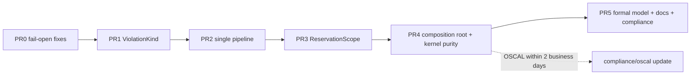

# SymbolicGovernor Refactor Plan — PRs 4–5

**Continues:** [governor_refactor_plan.md](./governor_refactor_plan.md) (PRs 1–3).
**Related:** [STERA review](./stera_security_review.md).
**Posture:** Reference architecture. Breaking changes are allowed and there are no compatibility shims (AGENTS.md).

**Preconditions:** PRs 0–3 are merged. When this plan starts:
- the `governor/` package exists;
- violations carry a `ViolationKind`;
- there is a single staged pipeline with `FULL` / `POST_HITL` / `DRY_RUN` profiles;
- `ReservationScope` owns phase-2 commits.

| PR | Theme | Urgency |
|---|---|---|
| **4** | Composition root, explicit startup posture, remove leftover code, move domain vocabulary out of Layer 1 | Medium |
| **5** | Formal-model and documentation convergence, compliance artifact sync | Medium (must close before the next release tag) |

---

## PR 4 — Composition root, posture, and kernel purity
**Branch:** `refactor/governor-kernel-purity` · **Title:** `refactor(governance)!: build governor via composition root; purge domain vocabulary from kernel`

### Problems addressed

| # | Problem | Evidence at HEAD |
|---|---|---|
| P1 | **Importing the module has side effects.** Import triggers KMS `validate_ready()`, Redis `ping_ready()` and a `dowhy` probe, and raises `RuntimeError`. Tests and tools therefore depend on the environment. | [symbolic_governor.py:83-157](../src/gateway/governance/symbolic_governor.py#L83-L157) |
| P2 | **Posture logic disagrees with itself.** `_IS_PRODUCTION` defaults to production, but the stub-reconciliation guard defaults `CAGE_ENV` to `"dev"` and only matches `== "production"`. [`env_posture.resolve_posture()`](../src/gateway/governance/env_posture.py#L42) already exists and is ignored. | L83-86 vs L150-153; `assert_safe_operational_state` L2797 |
| P3 | **The "immutable" registry is mutated after construction.** `install_domain_components()` rewrites `symbolic_governor._domain_tiers`, `.safety_filter` and `.consensus_engine` on a module-level singleton. This contradicts the ARCH-2 comment ("no runtime register_domain_tier() allowed"). | [singletons.py:44-113](../src/gateway/governance/singletons.py#L44-L113) |
| P4 | **Constructor args are kept but unused.** `safety_filter`, `fiscal_limit_guard`, `consensus_engine` and `telemetry_provider` are no longer on the hot path after PRs 2–3. Null objects (`NullSafetyFilter`, `NullConsensusProvider`) exist only to fill those slots. | L831-853, [null_components.py](../src/gateway/governance/null_components.py) |
| P5 | **Domain vocabulary lives in Layer 1.** This breaks the AGENTS.md rule "strictly domain-agnostic". Examples:<br>• `_legacy_finance_cost_resolver` in CBF<br>• `execute_trade` literals in the STPA validator<br>• `symbol` / `amount` in `PauseReceipt.standing_at_pause`<br>• the message "Trade execution at confidence …" | [cbf_engine.py:409,1221](../src/gateway/governance/safety/cbf_engine.py#L1221), [generated_stpa_validator.py:99-170](../src/gateway/governance/generated_stpa_validator.py#L99-L170), L1500, L2639 |
| P6 | **`register_invariant()` mutates the governor after construction.** It stores invariants on the governor, but only the CBF engine consumes them. | L892-951 |

### 4.1 Composition root — `src/gateway/governance/governor/assembly.py`
```python
@dataclass(frozen=True)
class GovernorComponents:
    opa: PolicyClient
    stpa_rules: tuple[UcaRule, ...]              # contributed by domains (see 4.4)
    core_stages: tuple[Stage, ...]
    domain_tiers: tuple[GovernanceTierPlugin, ...]
    narrowers: tuple[Narrower, ...] = ()

def assemble_governor(plugins: Sequence[CagePlugin], *, posture: DeploymentPosture) -> SymbolicGovernor:
    """Single composition root. Collects contributions from every plugin,
    rejects slot collisions, then constructs an immutable governor."""
```
- **Plugins contribute data instead of mutating the governor.** `CagePlugin.register()` becomes `CagePlugin.contribute() -> PluginContribution`, which carries tiers, UCA rules, narrowers and invariants.
- **`singletons.py` is removed.** Most callers only need a governor instance. Replacements:
  - the FastAPI app → lifespan state (`app.state.governor`);
  - LangGraph → node factories take the governor as a constructor dependency.
- **Wrong assembly fails at startup.** `assemble_governor` raises if:
  - no domain plugin supplies a tier for an action that appears in the FTRA terminal registry (fail closed on ungoverned irreversible actions);
  - two plugins claim the same action in the same `(phase, order)` slot.
- **The governor is immutable after construction.** `SymbolicGovernor.__init__` takes `GovernorComponents` only and stores tuples. Class-level `__slots__`, with no setters.
- **`register_invariant` moves to CBF.** It becomes part of `ControlBarrierFunction` construction (invariants go with the barrier that uses them), which fixes P6. The existing V1–V4 validation moves with it.

### 4.2 Explicit startup posture — `governor/posture.py`
```python
def assert_production_posture(posture: DeploymentPosture, *, components: GovernorComponents) -> None:
    """Called once from the app lifespan, never at import time."""
```
- It absorbs the import-time guards (P1) and `assert_safe_operational_state()`. All of them derive from `env_posture.resolve_posture()` only, which fixes P2.
- **Checks:**
  - `CBF_FAIL_OPEN` is off;
  - `dowhy` is importable, only if a causal tier is registered (the check is driven by the tier, not hard-coded);
  - KMS is ready;
  - Redis is ready;
  - `RECONCILIATION_PROVIDER != stub`;
  - `CBF_FAIL_OPEN` and HMAC fallback are not both set.
- **Wiring:** the lifespan hook is in the gateway app factory. LangGraph and CLI entry points call the same function.
- **Deleted:** `CBF_FAIL_OPEN` is removed completely. This deletes the fail-open branch of `revalidate_post_hitl` and every "audit gap" path. A reference architecture shouldn't ship a CBF bypass flag.

### 4.3 Remove leftover code
Delete each of the following:
- the `safety_filter`, `fiscal_limit_guard`, `consensus_engine` and `telemetry_provider` args, plus `null_components.py` if nothing else imports it;
- `_violations_to_strings` and the legacy `list[str]` result format;
- `_env_flag` (inline it, or move it to `env_posture`);
- the obsolete Prometheus try/except-pass registration. Move it to `governor/metrics.py` with an explicit registry.
- all "Legacy inline dispatch deleted", "CRIT-5 fix" and "Peer Review Fix" comment blocks that describe code which no longer exists.

After PR 4, `scripts/verify_governor.py` and `scripts/measure_paper_metrics.py` must use the composition root.

### 4.4 Move domain vocabulary out of Layer 1
| Item | Move to | Mechanism |
|---|---|---|
| `_legacy_finance_cost_resolver` | delete | `cost_resolver` becomes a **required** arg of `ControlBarrierFunction`; the finance plugin already passes `finance_cost_resolver` |
| STPA UCA rules with `execute_trade` literals | `src/cage_finance/stpa/uca_rules.py` (generated) | the kernel `STPAValidator` becomes a generic engine over `UcaRule(action, predicate, uca_id)` contributions; the STPA compiler emits per-domain rule modules |
| `PauseReceipt.standing_at_pause` `symbol`/`amount` | domain-supplied `standing_projector(params) -> Mapping` | the kernel stores an opaque projection |
| "Trade execution at …" and similar messages | generic kernel text: "Action `{action}` at confidence …" | string change only |
| Narrower implementations (if any are added after PR 1) | `src/cage_{domain}/narrowing.py` | already shaped by the PR 1 seam |

**Gate G3 extension.** Add a check in [check_import_boundaries.py](../scripts/check_import_boundaries.py) that fails if files under `src/gateway/` contain any action literal registered in a domain plugin's action registry (e.g. `"execute_trade"`). Allowlist test fixtures only. This makes the kernel-purity rule mechanically enforced instead of relying on convention.

**STPA regeneration.** Run `uv run python scripts/check_stpa_freshness.py` and commit the regenerated artifacts. The `stpa-freshness-check` CI gate will fail otherwise.

### 4.5 Tests
- **Import-purity test.** Importing `src.gateway.governance.governor` with `CAGE_ENV=production` and no KMS or Redis must succeed. Only `assert_production_posture` raises.
- **One test per posture violation.** For each of the 6 conditions, a table-driven test asserts `assert_production_posture` raises. For development, it logs CRITICAL and does not raise.
- **Posture parity.** Every production check calls `resolve_posture()`; a monkeypatch spy asserts no direct `os.environ` reads for `CAGE_ENV` / `ENVIRONMENT` under `governor/`.
- **Assembly tests:**
  - a slot collision raises;
  - an irreversible action with no governing tier raises;
  - the governor exposes no mutable tier attributes (`setattr` raises).
- **Kernel-purity tests:**
  - the Gate G3 extension over `src/gateway/` is green;
  - a negative test adds a fake `"execute_trade"` literal and expects failure.
- **STPA generic engine:**
  - finance rules produce identical violations to the pre-PR validator on a golden fixture corpus;
  - healthcare contributes zero finance rules.
- **Migrations:**
  - update `tests/conftest.py` fixtures that patched `singletons.symbolic_governor` to build via `assemble_governor(...)`;
  - add a shared `governor_factory` fixture.
- Every new test gets `pytestmark = [pytest.mark.unit, pytest.mark.local]`.

### 4.6 Acceptance
- `make test-fast` is green.
- `rg -n 'singletons|install_domain_components|CBF_FAIL_OPEN|_legacy_finance_cost_resolver|NullSafetyFilter' src/ tests/` returns zero hits.
- `rg -n '"execute_trade' src/gateway/` returns zero hits.
- `uv run python scripts/check_import_boundaries.py --verbose` passes, including the new literal check.
- `make update-nemo-configmap` is run if `config/rails/actions.py` changed. NeMo nodes now receive the governor by injection, so it probably will.
- `.github/workflows/test-hermetic.yml` and `policy_compile.yml` are updated for the new import paths.

### 4.7 Risks
| Risk | Mitigation |
|---|---|
| **Removing the singleton touches many call sites** (FastAPI, LangGraph nodes, NeMo actions, scripts). | Commit 1 adds `assemble_governor` alongside the singleton. Commit 2 migrates callers. Commit 3 deletes `singletons.py`. The PR is squash-merged, so `main` never sees the intermediate state. |
| **The STPA generator change may alter UCA semantics.** | Golden-corpus equality test, and the `stpa-freshness-check` gate. |
| **Deleting `CBF_FAIL_OPEN` breaks local dev setups without Redis.** | Point developers to the `agnostic` target (`./deploy_all.sh --target agnostic --env dev`), which already provisions Redis. Document it in PR 5. |

---

## PR 5 — Formal model, documentation, and compliance convergence
**Branch:** `docs/governor-convergence` · **Title:** `docs(governance): converge formal model, architecture docs, and compliance artifacts with governor v4`
Scope `docs` / `governance`. The formal-model changes are code, so the title type stays `docs` only if no `src/` change is needed. Otherwise split them into `test(governance): …`.

### 5.1 Formal model — [`proof/`](../proof/)
| Change | File | Detail |
|---|---|---|
| **Profiles** | [`model.py`](../proof/model.py) | Add `PROFILES = {"FULL": TIERS, "POST_HITL": (...), "DRY_RUN": TIERS}`. Model `POST_HITL` as a successor of `REQUIRE_APPROVAL → CHECKING(POST_HITL)`. Prove `NoDirectBind` holds for both paths. |
| **NARROW semantics** | `model.py`, [`LangGraphHarness.tla`](../proof/LangGraphHarness.tla#L353) | NARROW is reachable only after a *second* full `CHECKING` pass over clamped params with all tiers PASS. This matches PR 1 §1.4. The existing `soft_threshold_exceeded` flag becomes the trigger for that re-check, not a terminal shortcut. |
| **Reservation atomicity** | [`DistributedCBF.tla`](../proof/DistributedCBF.tla) | Add the invariant `SealIssued ⇒ AllCommitted ∧ ¬SealIssued ⇒ NoneCommitted` (ReservationScope, PR 3). Add the CAS on fence epoch if the C4 fix has landed; otherwise record it as an open property with a `\* TODO(C4)` marker. |
| **FTRA HITL** | [`FtraBoundary.tla`](../proof/FtraBoundary.tla) | An IRREVERSIBLE action with valid semantics goes to `REQUIRE_APPROVAL`, not `DENIED`. This fixes the old STPA miscount in the model, if the model encoded it. |
| **Parity tests** | [`tests/test_tier_registry_formal_parity.py`](../tests/test_tier_registry_formal_parity.py) | Extend it to assert:<br>• `governor.pipeline.STAGE_ORDER` ⊆ `TIERS` for each profile;<br>• `PROFILES[p]` equals the stage set the pipeline runs for profile `p`;<br>• `classification.KIND_PRECEDENCE` matches the decision precedence encoded in `model.py`. |
| **TLC runs** | [`proof/README.md`](../proof/README.md) | Record TLC results (states explored, invariants) for all three `.cfg` files at the PR commit SHA. |

### 5.2 Architecture documentation
Update these files in place. None should describe behaviour that no longer exists (AGENTS.md "Documentation Standards"):

| Doc | Required changes |
|---|---|
| [SYMBOLIC_GOVERNOR_RUNTIME.md](../docs/architecture/SYMBOLIC_GOVERNOR_RUNTIME.md) | Rewrite it around the `governor/` package: composition root, stages, profiles, classification by kind, `ReservationScope`. Include a module map with file links. |
| [GATEWAY_ARCHITECTURE.md §2.2, §3](../docs/architecture/GATEWAY_ARCHITECTURE.md#L88-L213) | Fix the tier table. It currently claims Tier 2 and Tier 4 run concurrently via `asyncio.gather`, which was removed. Document profiles and the post-HITL path, and the NARROW re-check. |
| [FORMAL_VERIFICATION.md](../docs/architecture/FORMAL_VERIFICATION.md) | Profiles, the reservation-atomicity invariant, the NARROW re-check, and TLC results. |
| [EXTENSIBILITY_ARCHITECTURE.md](../docs/architecture/EXTENSIBILITY_ARCHITECTURE.md) | `CagePlugin.contribute()`, `ViolationKind` obligations for tier authors, `CommitReceipt`, `Narrower`, `UcaRule`, `standing_projector`. |
| [HITL_TOCTOU_REMEDIATION.md](../docs/security/HITL_TOCTOU_REMEDIATION.md) | `POST_HITL` profile; the C1/C2 root causes and how the single pipeline removes them. |
| [STPA_ANALYSIS.md](../docs/security/STPA_ANALYSIS.md) | UCA rules become domain contributions; update the generator flow diagram. |
| [ADR-008](../docs/adr/ADR-008-wire-phantom-gates-into-production-call-paths.md) | Addendum: `assemble_governor` rejects ungoverned irreversible actions. The ConsequenceGateway wiring status (C5) is tracked separately. |
| **New ADR** `docs/adr/ADR-2026-10-XX-governor-staged-pipeline.md` | Record why the pipeline has profiles, why violations carry a kind, why `CBF_FAIL_OPEN` was removed, and why the singleton was replaced by a composition root. |
| [BREAKING_CHANGES_v3.md](../docs/BREAKING_CHANGES_v3.md) → add a v4 section (or a new `BREAKING_CHANGES_v4.md`) | Every breaking change from PRs 1–4 with migration snippets: `Violation.kind`, `CommitReceipt`, `contribute()`, removed flags, import path, and `pre_check` removal. |
| `CHANGELOG.md` | One entry per PR (outside the Gate G9 scope, but required for release notes). |

**Sweep for stale references.** 41 docs currently mention `symbolic_governor`, `SymbolicGovernor`, `_run_checks`, `8-Tier STERA` or `revalidate_post_hitl`. Fix all of them in `docs/architecture/**`, `docs/security/**`, `docs/operations/**` and `docs/compliance/**`. `docs/paper/measurements/**` holds historical snapshots: leave those files unchanged and add a header note pointing to the new runtime doc. Run `make docs-check` (Gate G9) until it is clean. Don't remove files from its scope to make it pass.

### 5.3 Compliance artifacts (AGENTS.md "Compliance Artifact Obligations")
| Artifact | Action |
|---|---|
| [`compliance/oscal/components/cage_client_sdk.yaml`](../compliance/oscal/components/cage_client_sdk.yaml) | Update implementation statements and file references for the governor controls. Re-export the SSP: `uv run python -m src.gateway.governance.oscal_ssp_exporter export` (default discovery; no `--ssp`). `tests/test_oscal_ssp_exporter.py` must pass. **Deadline:** within 2 business days of PR 4 merge. |
| [`compliance/lula/lula-validation-ftra.yaml`](../compliance/lula/lula-validation-ftra.yaml) | Update the FTRA assertion paths and the expected verdict for irreversible actions (`REQUIRE_APPROVAL`). |
| [`compliance/risk_acceptance/THRESHOLD_TRACEABILITY_MATRIX.md`](../compliance/risk_acceptance/THRESHOLD_TRACEABILITY_MATRIX.md) | Remove the `_threshold_config` / `CAGE_NARROW_ENABLED` rows. Re-point the confidence and FRIA thresholds to `governor/stages/confidence.py`. |
| [`docs/POAM.md`](../docs/POAM.md) | **Review:** POAM-TIER2-001 (confidence self-report). The `independently_verified=True` span attribute is removed in PR 2; record the status truthfully (still OPEN, partially mitigated). **Add new POAMs** for review items not closed by PRs 0–4: C4 (CBF CAS), C5 (ConsequenceGateway wiring), H4–H11. Each POAM needs an ID, control, discovery date (the review date), and owner. **Closures:** only items actually verified, with commit SHA, Lula result and the *actual* verification date (no backdating). |
| STPA artifacts | Regenerated in PR 4. PR 5 re-runs `check_stpa_freshness.py` to confirm. |

### 5.4 Acceptance
- `make docs-check` is clean.
- `make test-fast` is green, including the extended formal parity test.
- TLC passes for `DistributedCBF.cfg`, `FtraBoundary.cfg` and `LangGraphHarness.cfg`, with results recorded in `proof/README.md`.
- The OSCAL SSP export compiles and `tests/test_oscal_ssp_exporter.py` passes.
- `rg -n 'symbolic_governor\b|_run_checks|CBF_FAIL_OPEN|CAGE_NARROW_ENABLED' docs/ compliance/ proof/` returns zero hits outside `docs/paper/measurements/**` and `CHANGELOG.md`.
- `langfuse-posture-check`, `nemo-freshness-check` and `stpa-freshness-check` are green.

### 5.5 Risks
| Risk | Mitigation |
|---|---|
| **TLC state-space growth** from adding profiles and the NARROW re-check. | Keep the `.cfg` constants small (1–2 domain tiers). Use symmetry sets for tier names and record the state counts. |
| **The docs sweep is large (41 files).** | Split the work into mechanical rename commits and semantic rewrite commits. Reviewers can then skim the renames and focus on the rewrites. |
| **Compliance deadlines are easy to miss.** | Open the OSCAL update as part of PR 4's description checklist so the 2-business-day clock is visible. |

---

## End-to-end sequencing



PR 5 §5.1 (formal model) can start in parallel with PR 4 once PR 3 has merged. §5.2 and §5.3 depend on PR 4's final names.

## Open questions
1. **Should `null_components.py` be deleted?** Only if no non-governor code path imports it (to be verified in PR 4 commit 1). **Recommendation:** delete it; bare-kernel mode should fail assembly, not run with null tiers.
2. **Should the STPA compiler emit one rule module per domain,** or a single module with domain tags? **Recommendation:** one module per domain, so each domain owns its UCAs outright.
3. **Should the Gate G3 literal check also cover `src/integrations/`?** **Recommendation:** no. Integrations are Layer 3 and may name domain actions legitimately.
4. **Should the TLA+ specs model `POST_HITL` explicitly** (Open Q2 in the PR 1–3 plan), or should `model.py` alone cover it? **Recommendation:** both. The Python model feeds the parity test and TLA+ gives exhaustive checking.
