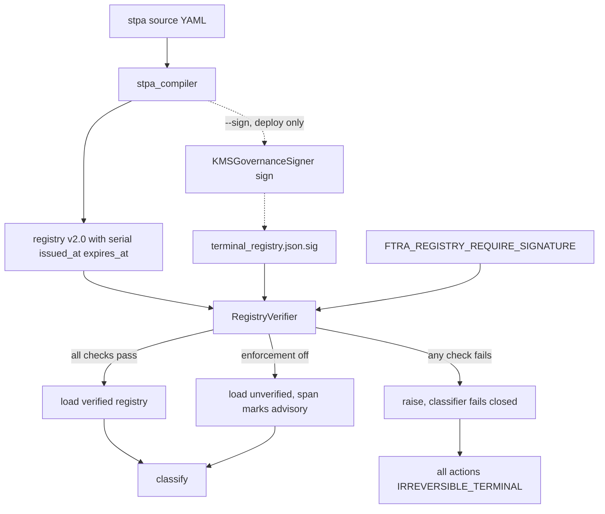

# PR #2 — FTRA Terminal Registry Signature Binding (VEC-005, VEC-008)

> **Scope:** Phase 3 of the [issue #107 remediation plan](issue_107_aisvs_c9_conformance_plan.md).
> Closes **VEC-005** (registry re-declaration bypass) and **VEC-008** (signed-registry rollback).
>
> **Depends on PR #1** ([#123](https://github.com/google/cybernetic-agent-governance-engine/pull/123)),
> which is open and unmerged. See §9 for branch sequencing.

---

## 1. The bypass being closed

`IrreversibilityClassifier` trusts [`config/ftra/terminal_registry.json`](../config/ftra/terminal_registry.json)
unconditionally. [`_load_registry()`](../src/gateway/governance/ftra/classifier.py:74)
parses the file and returns `terminals` with no integrity check whatsoever.

An attacker who can write that file — tampered ConfigMap, compromised artifact
in the image build, malicious PR to a downstream fork — re-declares:

```json
{ "terminals": { "execute_trade": "REVERSIBLE" } }
```

`execute_trade` now folds to severity 1, the analyzer returns `CLEAR`, and every
irreversible trade is admitted at commencement time with no human in the loop.
The fail-closed default never fires, because the action *is* registered — just
registered as a lie.

This is a **file-integrity** bypass, not a logic bypass. PR #1 fixed the fold;
it did nothing for the provenance of the values being folded.

---

## 2. Decision required — enforcement gating

**This is the one design choice that needs sign-off before implementation.**

`KMSGovernanceSigner` has an asymmetry that dictates the whole design:

| Method | Requires | Consequence |
|---|---|---|
| [`sign()`](../src/gateway/governance/kms_signer.py:691) | `_kms_active` → **live KMS** | Raises `RuntimeError` without it |
| [`verify()`](../src/gateway/governance/kms_signer.py:880) | `_public_key_pem` **only** | Works with just a PEM — no KMS credentials |
| [`from_env()`](../src/gateway/governance/kms_signer.py:593) | — | Returns a **no-KMS fallback** when `CAGE_ENV` ∈ dev/test/ci |

`verify()` needing only a public key is the good news: gateway pods verify
without KMS credentials, so the hot path stays cheap and the blast radius of a
KMS outage is bounded.

`sign()` requiring live KMS is the problem. [`stpa_compiler`](../src/gateway/governance/stpa_compiler.py:1484)
runs routinely in dev and CI — it was run during PR #1 to regenerate artifacts.
If verification is unconditional and fail-closed, **every dev and CI run yields
all-`IRREVERSIBLE_TERMINAL`**, breaking the compiler, the FTRA suite, and PR #1's
`tmp_path` registry fixtures.

### Recommendation (assumed unless overridden)

A dedicated `FTRA_REGISTRY_REQUIRE_SIGNATURE` flag, defaulting **ON** in
production and **OFF** in dev/test/ci, derived from `CAGE_ENV` when unset.

Precedent exists: [`cbf_engine.py:426`](../src/gateway/governance/cbf.py:426)
does exactly this for Redis — *"proceeding with epoch=0. Set CAGE_ENV=prod to
enforce fail-closed behavior."*

A dedicated flag is preferred over reading `CAGE_ENV` directly because it lets
CI assert enforcement **in both directions** without pretending to be production.

### The caveat, stated plainly

A posture gate is **not** a defence against an attacker who controls the
environment. Anyone who can set `FTRA_REGISTRY_REQUIRE_SIGNATURE=false` or
`CAGE_ENV=dev` on the pod has already defeated it.

It **does** defeat the VEC-005 threat as reported: an attacker who can write the
registry file but cannot alter the pod's environment. That distinction belongs in
the docs and in the issue reply — claiming more would be the same overreach the
four-way scoring partition exists to prevent.

### Alternatives considered

| Option | Trade-off |
|---|---|
| Durable serial in Redis | Survives pod restart, but puts Redis on the FTRA load path |
| Reuse `CAGE_ENV`, no new flag | Smaller env surface; enforcement untestable outside prod posture |
| Unconditional + dev self-signing keypair | No posture gate to argue about; materially larger change |

---

## 3. Signed envelope format

Registry `v2.0` — temporal and anti-rollback fields go **inside** the signed
payload, so they cannot be stripped or edited independently of the signature:

```json
{
  "version": "2.0",
  "serial": 42,
  "issued_at": "2026-09-01T20:30:47+00:00",
  "expires_at": "2026-12-01T20:30:47+00:00",
  "system": "CAGE Financial Advisor",
  "system_version": "1.1.0",
  "fail_closed_note": "Any action absent from this registry is treated as IRREVERSIBLE_TERMINAL by IrreversibilityClassifier at runtime.",
  "terminals": { "check_balance": "READ_ONLY", "…": "…" }
}
```

Detached signature at `config/ftra/terminal_registry.json.sig`:

```json
{
  "alg": "ES256",
  "key_id": "projects/…/cryptoKeyVersions/1",
  "canonicalization": "RFC8785-JCS",
  "signature": "<hex>"
}
```

Detached rather than embedded: an embedded `signature` field would have to be
excluded from its own canonical form, and every such scheme invites a
"which fields were actually covered" argument. A detached file signs the whole
object with no carve-outs.

### Implementation trap — do not name a field `signed_at`

[`KMSGovernanceSigner.verify()`](../src/gateway/governance/kms_signer.py:893)
contains a hardcoded staleness check: if the payload has a `signed_at` key, the
payload is **rejected after 300 seconds** (`MAX_KMS_PAYLOAD_AGE_SECONDS`).

That is correct for reconciliation payloads and catastrophic for a registry
intended to live for months. Use `issued_at` / `expires_at` exclusively. A guard
test must assert `"signed_at" not in registry`.

Canonicalisation reuses [`jcs_canonicalize_plan`](../src/gateway/governance/jcs_canonicalizer.py:24)
so signing and verification agree byte-for-byte. `sign()` and `verify()` both
canonicalise internally — pass the dict, never pre-serialised bytes.

---

## 4. `RegistryVerifier` — new module

New file `src/gateway/governance/ftra/registry_verifier.py`. Kept out of
[`classifier.py`](../src/gateway/governance/ftra/classifier.py) so the
verification logic is unit-testable without touching the classifier cache.

```python
@dataclass(frozen=True)
class VerificationResult:
    valid: bool
    reason: str            # machine-readable failure code
    serial: int | None
    expires_at: datetime | None
```

### Verification order

Cheap structural checks first, KMS-touching work last:

1. **Envelope shape** — `version == "2.0"`, `terminals` is a dict,
   `"signed_at"` absent (§3 trap).
2. **`.sig` present and parseable** — missing file is a failure, never a skip.
3. **`expires_at` present, timezone-aware, in the future.** A naive datetime is
   a failure, not something to coerce to UTC. Same rule the v1.2.0 harness applies.
4. **Serial monotonicity** — see §5.
5. **Signature** — `verify()` over the JCS-canonical registry dict.

Ordering matters: an expired registry should report `EXPIRED`, not burn a
signature verification first. It also means a malformed file cannot reach the
crypto path at all.

### Failure codes

Every branch returns a distinct `reason`, surfaced as the
`cage.ftra.registry.failure_reason` span attribute:

| Code | Trigger |
|---|---|
| `SIG_MISSING` | `.sig` file absent |
| `SIG_MALFORMED` | `.sig` unparseable or missing required keys |
| `SIG_INVALID` | `verify()` returned `False` |
| `EXPIRED` | `expires_at` in the past |
| `EXPIRY_MISSING` | `expires_at` absent |
| `EXPIRY_NAIVE` | `expires_at` has no timezone |
| `SERIAL_REGRESSED` | `serial` below high-water mark or floor |
| `SERIAL_MISSING` | `serial` absent or not an integer |
| `ENVELOPE_INVALID` | shape check failed |
| `PUBKEY_UNAVAILABLE` | no public key loaded and enforcement is ON |

Distinct codes are the difference between an operator diagnosing a clock skew in
seconds versus an hour. They also let the test suite assert *why* a load failed,
not merely that it did — the same discipline the four-way scoring partition
applies to verdicts.

### Fail-closed contract

On **any** failure with enforcement ON, `_load_registry()` must raise. The
classifier's existing fail-closed default then returns `IRREVERSIBLE_TERMINAL`
for every action.

**Never return an empty dict.** An empty registry is indistinguishable from a
clean load of a registry with no terminals, and would silently produce
`IRREVERSIBLE_TERMINAL` for the *right* reason with the *wrong* provenance —
exactly the ambiguity `FAIL_CLOSED_NOISE` exists to name.

---

## 5. Serial monotonicity (VEC-008)

Rollback to an **older but validly signed** registry passes signature and expiry
checks. Only a monotonic serial catches it.

Two-part defence:

- **`FTRA_REGISTRY_MIN_SERIAL`** — deployment-pinned floor. Survives restarts
  because it is set in the Deployment manifest, not held in memory.
- **In-process high-water mark** — module-level `int`, guarded by the existing
  `_registry_lock`. Catches mid-life rollback in a running pod.

Effective floor is `max(FTRA_REGISTRY_MIN_SERIAL, _seen_high_water)`.

### Known limitation, to be documented

An attacker who rolls back the registry **and** restarts the pod defeats the
in-memory mark, leaving only the pinned floor. If `FTRA_REGISTRY_MIN_SERIAL` is
unset, that rollback succeeds.

Making this durable requires Redis on the FTRA load path (§2, option 2). Deferred
deliberately — but it must be written down rather than left for the next auditor
to find. An undocumented gap in an anti-rollback control is worse than a
documented one.

---

## 6. Load-path integration

### Hardening the reload path

[`_get_registry()`](../src/gateway/governance/ftra/classifier.py:104) re-reads on
every `classify()` when `FTRA_REGISTRY_RELOAD=true`. **Verification must run on
every reload**, not once at import — otherwise the flag re-opens VEC-005 behind a
valid initial signature: pass verification at startup, then swap the file.

The `SIGUSR1` handler at [`_bust_cache()`](../src/gateway/governance/ftra/classifier.py:127)
is the same hazard by another route.

Placing verification inside `_load_registry()` covers both, since every path —
cold start, env-flag reload, `SIGUSR1` — funnels through it.

### Digest cache

Re-verifying an unchanged file on every `classify()` would put an asymmetric
signature verification on the FTRA hot path.

Cache `VerificationResult` against the SHA-256 of the registry bytes:

```
digest = sha256(registry_bytes)
if digest == _last_verified_digest:
    reuse cached VerificationResult   # skip crypto
```

Keyed on content, not mtime — mtime is trivially forged and identical across a
same-second overwrite.

**The expiry check must still run on every load**, outside the digest cache. A
registry that was valid at 09:00 is expired at 18:00 with byte-identical
contents; caching the whole result on digest alone would serve an expired
registry indefinitely. Cache the *signature* verdict; re-evaluate *time* every call.

### Telemetry

Extend the existing FTRA span in [`node_factory.py`](../src/gateway/governance/ftra/node_factory.py:47):

| Attribute | Value |
|---|---|
| `cage.ftra.registry.verified` | bool |
| `cage.ftra.registry.serial` | int |
| `cage.ftra.registry.failure_reason` | code from §4, absent on success |
| `cage.ftra.registry.enforcement` | `enforced` \| `advisory` |

`enforcement` matters: without it a trace from a dev pod is indistinguishable
from a production pod that silently lost its signature.

Never log the signature value or key material. Log the `key_id` — it is a
resource path, not a secret — and the serial.

### Compiler changes

[`generate_terminal_registry()`](../src/gateway/governance/stpa_compiler.py:1484)
gains `serial`, `issued_at`, `expires_at`, and bumps `version` to `"2.0"`.

- `serial` — `--registry-serial N`, defaulting to `int(time.time())`. Monotonic
  by construction, no state file needed.
- `expires_at` — `--registry-validity-days`, default 90.
- Signing is **opt-in** via `--sign`. Without it the compiler emits an unsigned
  `v2.0` registry, so dev and CI keep working (§2).

Repo-committed registry stays **unsigned**. Signing at commit time would require
every contributor to hold a KMS key, and a signature in git would expire and
break CI 90 days later. Signing belongs in the deploy pipeline.

---

## 7. Architecture



---

## 8. Test strategy

New file `tests/test_ftra_registry_signing.py`. Hermetic — no live KMS.

### Keypair fixture

Follow the established pattern in
[`tests/test_kms_signer_new_features.py:60`](../tests/test_kms_signer_new_features.py:60):
generate an EC P-256 keypair in-process, construct a signer with a stub provider
whose `sign_digest` uses the local private key, and pass the matching PEM as
`public_key_pem`. That exercises the real `verify()` code path — no mocking of
the function under test.

### Vectors

| Test | Asserts |
|---|---|
| **VEC-005a** | `execute_trade` re-declared `REVERSIBLE`, **no** `.sig` → `SIG_MISSING`, verdict `HITL_REQUIRED`, category `TRUE_PASS_FAIL_CLOSED` |
| **VEC-005b** | Same, `.sig` present but **signed over the original** → `SIG_INVALID` |
| **VEC-005c** | Same tampered registry, enforcement **OFF** → loads, verdict `CLEAR`. Proves the gate is load-bearing and documents residual risk |
| **VEC-008a** | Serial 41 after 42 seen → `SERIAL_REGRESSED` |
| **VEC-008b** | Serial 43 after 42 → loads |
| **VEC-008c** | Serial below `FTRA_REGISTRY_MIN_SERIAL` → `SERIAL_REGRESSED` even on a cold high-water mark |

### Guard tests

- Valid signature, `expires_at` in the past → `EXPIRED`
- `expires_at` naive → `EXPIRY_NAIVE` (never coerced)
- `expires_at` absent → `EXPIRY_MISSING`
- **No field named `signed_at`** in compiler output (§3 trap)
- Failure **never** yields an empty registry — assert `classify()` returns
  `IRREVERSIBLE_TERMINAL`, not `KeyError` or `{}`
- Digest cache: two loads of identical bytes → one `verify()` call
- Digest cache does **not** mask expiry: same bytes, clock advanced past
  `expires_at` → second load fails
- Reload path: verified at startup, file swapped, `FTRA_REGISTRY_RELOAD=true`
  → second `classify()` fails closed

### Mutation check

Before opening the PR, temporarily invert the serial comparison and confirm
VEC-008a fails. Same discipline applied to `classify_outcome()` in PR #1 — a test
that has never been observed failing has not been shown to test anything.

### Regression surface

`_load_registry()` changes shape, so re-run the full suite. PR #1 touched
`tmp_path` registry fixtures in
[`tests/test_aisvs_c9_conformance.py`](../tests/test_aisvs_c9_conformance.py:175)
that write **v1.0** registries with no signature — these must keep passing under
default (dev) posture. If they do not, the posture default is wrong.

---

## 9. Branch sequencing

PR #1 ([#123](https://github.com/google/cybernetic-agent-governance-engine/pull/123))
is **open and unmerged**. PR #2 touches
[`classifier.py`](../src/gateway/governance/ftra/classifier.py) and
[`stpa_compiler.py`](../src/gateway/governance/stpa_compiler.py) — the latter
also modified by PR #1.

Branch `feat/ftra-registry-signing` from `feat/aisvs-c9-taxonomy`, not `main`,
and rebase onto `main` once #123 squash-merges. Branching from `main` would
produce a diff that reverts PR #1's compiler changes.

Squash merge only, per [`AGENTS.md`](../AGENTS.md).

---

## 10. Compliance obligations

Per [`AGENTS.md`](../AGENTS.md), controls touched here require artifact updates:

- **OSCAL component** in `compliance/oscal/` — new control implementation for
  registry integrity (SI-7 software/firmware/information integrity, AU-10
  non-repudiation) within 2 business days of merge.
- **Lula validation** if the Deployment manifest gains
  `FTRA_REGISTRY_REQUIRE_SIGNATURE` or `FTRA_REGISTRY_MIN_SERIAL` — same PR or
  flagged for follow-on.
- **`docs/operations/FTRA_COMPENSATING_CONTROLS.md`** — document the posture gate,
  the env-control caveat (§2), and the serial-durability limitation (§5).
- Deployment manifests must use `secretKeyRef` for any key material. The public
  PEM is not secret; the KMS key resource path is not secret. Neither needs a
  Secret, but neither should be hardcoded either.

---

## 11. Out of scope

- **VEC-002, VEC-003, VEC-006** — remaining vectors, PR #3
- **VEC-009** — composition attack, tracked as `xfail(strict=True)` in PR #3
- **Durable serial state** — §5, requires Redis on the load path
- **Key rotation** — [`get_public_keys_pem()`](../src/gateway/governance/kms_signer.py:229)
  already supports multiple active keys; wiring multi-key verification into
  `RegistryVerifier` is a separate change
- **Signing the repo-committed registry** — §6
