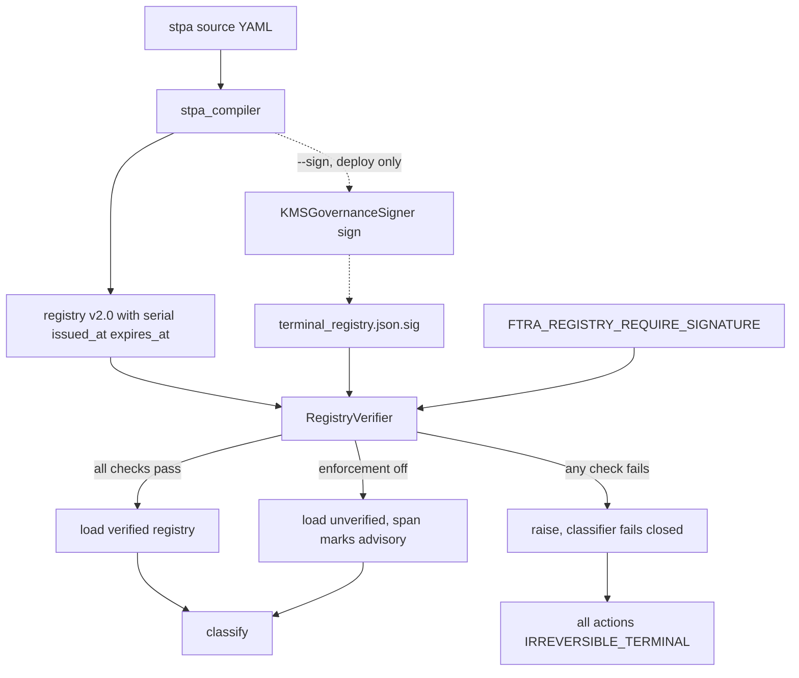
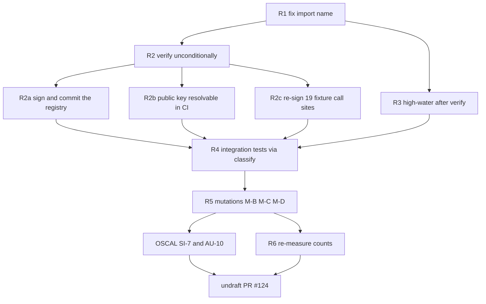

# PR #2 — FTRA Terminal Registry Signature Binding (VEC-005, VEC-008)

> **Scope:** Phase 3 of the [issue #107 remediation plan](issue_107_aisvs_c9_conformance_plan.md).
> Closes **VEC-005** (registry re-declaration bypass) and **VEC-008** (signed-registry rollback).
>
> **Depends on PR #1** ([#123](https://github.com/google/cybernetic-agent-governance-engine/pull/123)),
> which is open and unmerged. See §9 for branch sequencing.

---

## 1. The bypass being closed

`IrreversibilityClassifier` trusts [`config/ftra/terminal_registry.json`](../config/ftra/terminal_registry.json)
unconditionally. [`_load_registry()`](../src/gateway/governance/ftra/classifier.py:74)
parses the file and returns `terminals` with no integrity check whatsoever.

An attacker who can write that file — tampered ConfigMap, compromised artifact
in the image build, malicious PR to a downstream fork — re-declares:

```json
{ "terminals": { "execute_trade": "REVERSIBLE" } }
```

`execute_trade` now folds to severity 1, the analyzer returns `CLEAR`, and every
irreversible trade is admitted at commencement time with no human in the loop.
The fail-closed default never fires, because the action *is* registered — just
registered as a lie.

This is a **file-integrity** bypass, not a logic bypass. PR #1 fixed the fold;
it did nothing for the provenance of the values being folded.

---

## 2. Decision required — enforcement gating

**This is the one design choice that needs sign-off before implementation.**

`KMSGovernanceSigner` has an asymmetry that dictates the whole design:

| Method | Requires | Consequence |
|---|---|---|
| [`sign()`](../src/gateway/governance/kms_signer.py:691) | `_kms_active` → **live KMS** | Raises `RuntimeError` without it |
| [`verify()`](../src/gateway/governance/kms_signer.py:880) | `_public_key_pem` **only** | Works with just a PEM — no KMS credentials |
| [`from_env()`](../src/gateway/governance/kms_signer.py:593) | — | Returns a **no-KMS fallback** when `CAGE_ENV` ∈ dev/test/ci |

`verify()` needing only a public key is the good news: gateway pods verify
without KMS credentials, so the hot path stays cheap and the blast radius of a
KMS outage is bounded.

`sign()` requiring live KMS is the problem. [`stpa_compiler`](../src/gateway/governance/stpa_compiler.py:1484)
runs routinely in dev and CI — it was run during PR #1 to regenerate artifacts.
If verification is unconditional and fail-closed, **every dev and CI run yields
all-`IRREVERSIBLE_TERMINAL`**, breaking the compiler, the FTRA suite, and PR #1's
`tmp_path` registry fixtures.

### Recommendation (assumed unless overridden)

A dedicated `FTRA_REGISTRY_REQUIRE_SIGNATURE` flag, defaulting **ON** in
production and **OFF** in dev/test/ci, derived from `CAGE_ENV` when unset.

Precedent exists: [`cbf_engine.py:426`](../src/gateway/governance/cbf.py:426)
does exactly this for Redis — *"proceeding with epoch=0. Set CAGE_ENV=prod to
enforce fail-closed behavior."*

A dedicated flag is preferred over reading `CAGE_ENV` directly because it lets
CI assert enforcement **in both directions** without pretending to be production.

### The caveat, stated plainly

A posture gate is **not** a defence against an attacker who controls the
environment. Anyone who can set `FTRA_REGISTRY_REQUIRE_SIGNATURE=false` or
`CAGE_ENV=dev` on the pod has already defeated it.

It **does** defeat the VEC-005 threat as reported: an attacker who can write the
registry file but cannot alter the pod's environment. That distinction belongs in
the docs and in the issue reply — claiming more would be the same overreach the
four-way scoring partition exists to prevent.

### Alternatives considered

| Option | Trade-off |
|---|---|
| Durable serial in Redis | Survives pod restart, but puts Redis on the FTRA load path |
| Reuse `CAGE_ENV`, no new flag | Smaller env surface; enforcement untestable outside prod posture |
| Unconditional + dev self-signing keypair | No posture gate to argue about; materially larger change |

---

## 3. Signed envelope format

Registry `v2.0` — temporal and anti-rollback fields go **inside** the signed
payload, so they cannot be stripped or edited independently of the signature:

```json
{
  "version": "2.0",
  "serial": 42,
  "issued_at": "2026-09-01T20:30:47+00:00",
  "expires_at": "2026-12-01T20:30:47+00:00",
  "system": "CAGE Financial Advisor",
  "system_version": "1.1.0",
  "fail_closed_note": "Any action absent from this registry is treated as IRREVERSIBLE_TERMINAL by IrreversibilityClassifier at runtime.",
  "terminals": { "check_balance": "READ_ONLY", "…": "…" }
}
```

Detached signature at `config/ftra/terminal_registry.json.sig`:

```json
{
  "alg": "ES256",
  "key_id": "projects/…/cryptoKeyVersions/1",
  "canonicalization": "RFC8785-JCS",
  "signature": "<hex>"
}
```

Detached rather than embedded: an embedded `signature` field would have to be
excluded from its own canonical form, and every such scheme invites a
"which fields were actually covered" argument. A detached file signs the whole
object with no carve-outs.

### Implementation trap — do not name a field `signed_at`

[`KMSGovernanceSigner.verify()`](../src/gateway/governance/kms_signer.py:893)
contains a hardcoded staleness check: if the payload has a `signed_at` key, the
payload is **rejected after 300 seconds** (`MAX_KMS_PAYLOAD_AGE_SECONDS`).

That is correct for reconciliation payloads and catastrophic for a registry
intended to live for months. Use `issued_at` / `expires_at` exclusively. A guard
test must assert `"signed_at" not in registry`.

Canonicalisation reuses [`jcs_canonicalize_plan`](../src/gateway/governance/jcs_canonicalizer.py:24)
so signing and verification agree byte-for-byte. `sign()` and `verify()` both
canonicalise internally — pass the dict, never pre-serialised bytes.

---

## 4. `RegistryVerifier` — new module

New file `src/gateway/governance/ftra/registry_verifier.py`. Kept out of
[`classifier.py`](../src/gateway/governance/ftra/classifier.py) so the
verification logic is unit-testable without touching the classifier cache.

```python
@dataclass(frozen=True)
class VerificationResult:
    valid: bool
    reason: str            # machine-readable failure code
    serial: int | None
    expires_at: datetime | None
```

### Verification order

Cheap structural checks first, KMS-touching work last:

1. **Envelope shape** — `version == "2.0"`, `terminals` is a dict,
   `"signed_at"` absent (§3 trap).
2. **`.sig` present and parseable** — missing file is a failure, never a skip.
3. **`expires_at` present, timezone-aware, in the future.** A naive datetime is
   a failure, not something to coerce to UTC. Same rule the v1.2.0 harness applies.
4. **Serial monotonicity** — see §5.
5. **Signature** — `verify()` over the JCS-canonical registry dict.

Ordering matters: an expired registry should report `EXPIRED`, not burn a
signature verification first. It also means a malformed file cannot reach the
crypto path at all.

### Failure codes

Every branch returns a distinct `reason`, surfaced as the
`cage.ftra.registry.failure_reason` span attribute:

| Code | Trigger |
|---|---|
| `SIG_MISSING` | `.sig` file absent |
| `SIG_MALFORMED` | `.sig` unparseable or missing required keys |
| `SIG_INVALID` | `verify()` returned `False` |
| `EXPIRED` | `expires_at` in the past |
| `EXPIRY_MISSING` | `expires_at` absent |
| `EXPIRY_NAIVE` | `expires_at` has no timezone |
| `SERIAL_REGRESSED` | `serial` below high-water mark or floor |
| `SERIAL_MISSING` | `serial` absent or not an integer |
| `ENVELOPE_INVALID` | shape check failed |
| `PUBKEY_UNAVAILABLE` | no public key loaded and enforcement is ON |

Distinct codes are the difference between an operator diagnosing a clock skew in
seconds versus an hour. They also let the test suite assert *why* a load failed,
not merely that it did — the same discipline the four-way scoring partition
applies to verdicts.

### Fail-closed contract

On **any** failure with enforcement ON, `_load_registry()` must raise. The
classifier's existing fail-closed default then returns `IRREVERSIBLE_TERMINAL`
for every action.

**Never return an empty dict.** An empty registry is indistinguishable from a
clean load of a registry with no terminals, and would silently produce
`IRREVERSIBLE_TERMINAL` for the *right* reason with the *wrong* provenance —
exactly the ambiguity `FAIL_CLOSED_NOISE` exists to name.

---

## 5. Serial monotonicity (VEC-008)

Rollback to an **older but validly signed** registry passes signature and expiry
checks. Only a monotonic serial catches it.

Two-part defence:

- **`FTRA_REGISTRY_MIN_SERIAL`** — deployment-pinned floor. Survives restarts
  because it is set in the Deployment manifest, not held in memory.
- **In-process high-water mark** — module-level `int`, guarded by the existing
  `_registry_lock`. Catches mid-life rollback in a running pod.

Effective floor is `max(FTRA_REGISTRY_MIN_SERIAL, _seen_high_water)`.

### Known limitation, to be documented

An attacker who rolls back the registry **and** restarts the pod defeats the
in-memory mark, leaving only the pinned floor. If `FTRA_REGISTRY_MIN_SERIAL` is
unset, that rollback succeeds.

Making this durable requires Redis on the FTRA load path (§2, option 2). Deferred
deliberately — but it must be written down rather than left for the next auditor
to find. An undocumented gap in an anti-rollback control is worse than a
documented one.

---

## 6. Load-path integration

### Hardening the reload path

[`_get_registry()`](../src/gateway/governance/ftra/classifier.py:104) re-reads on
every `classify()` when `FTRA_REGISTRY_RELOAD=true`. **Verification must run on
every reload**, not once at import — otherwise the flag re-opens VEC-005 behind a
valid initial signature: pass verification at startup, then swap the file.

The `SIGUSR1` handler at [`_bust_cache()`](../src/gateway/governance/ftra/classifier.py:127)
is the same hazard by another route.

Placing verification inside `_load_registry()` covers both, since every path —
cold start, env-flag reload, `SIGUSR1` — funnels through it.

### Digest cache

Re-verifying an unchanged file on every `classify()` would put an asymmetric
signature verification on the FTRA hot path.

Cache `VerificationResult` against the SHA-256 of the registry bytes:

```
digest = sha256(registry_bytes)
if digest == _last_verified_digest:
    reuse cached VerificationResult   # skip crypto
```

Keyed on content, not mtime — mtime is trivially forged and identical across a
same-second overwrite.

**The expiry check must still run on every load**, outside the digest cache. A
registry that was valid at 09:00 is expired at 18:00 with byte-identical
contents; caching the whole result on digest alone would serve an expired
registry indefinitely. Cache the *signature* verdict; re-evaluate *time* every call.

### Telemetry

Extend the existing FTRA span in [`node_factory.py`](../src/gateway/governance/ftra/node_factory.py:47):

| Attribute | Value |
|---|---|
| `cage.ftra.registry.verified` | bool |
| `cage.ftra.registry.serial` | int |
| `cage.ftra.registry.failure_reason` | code from §4, absent on success |
| `cage.ftra.registry.enforcement` | `enforced` \| `advisory` |

`enforcement` matters: without it a trace from a dev pod is indistinguishable
from a production pod that silently lost its signature.

Never log the signature value or key material. Log the `key_id` — it is a
resource path, not a secret — and the serial.

### Compiler changes

[`generate_terminal_registry()`](../src/gateway/governance/stpa_compiler.py:1484)
gains `serial`, `issued_at`, `expires_at`, and bumps `version` to `"2.0"`.

- `serial` — `--registry-serial N`, defaulting to `int(time.time())`. Monotonic
  by construction, no state file needed.
- `expires_at` — `--registry-validity-days`, default 90.
- Signing is **opt-in** via `--sign`. Without it the compiler emits an unsigned
  `v2.0` registry, so dev and CI keep working (§2).

Repo-committed registry stays **unsigned**. Signing at commit time would require
every contributor to hold a KMS key, and a signature in git would expire and
break CI 90 days later. Signing belongs in the deploy pipeline.

---

## 7. Architecture



---

## 8. Test strategy

New file `tests/test_ftra_registry_signing.py`. Hermetic — no live KMS.

### Keypair fixture

Follow the established pattern in
[`tests/test_kms_signer_new_features.py:60`](../tests/test_kms_signer_new_features.py:60):
generate an EC P-256 keypair in-process, construct a signer with a stub provider
whose `sign_digest` uses the local private key, and pass the matching PEM as
`public_key_pem`. That exercises the real `verify()` code path — no mocking of
the function under test.

### Vectors

| Test | Asserts |
|---|---|
| **VEC-005a** | `execute_trade` re-declared `REVERSIBLE`, **no** `.sig` → `SIG_MISSING`, verdict `HITL_REQUIRED`, category `TRUE_PASS_FAIL_CLOSED` |
| **VEC-005b** | Same, `.sig` present but **signed over the original** → `SIG_INVALID` |
| **VEC-005c** | Same tampered registry, enforcement **OFF** → loads, verdict `CLEAR`. Proves the gate is load-bearing and documents residual risk |
| **VEC-008a** | Serial 41 after 42 seen → `SERIAL_REGRESSED` |
| **VEC-008b** | Serial 43 after 42 → loads |
| **VEC-008c** | Serial below `FTRA_REGISTRY_MIN_SERIAL` → `SERIAL_REGRESSED` even on a cold high-water mark |

### Guard tests

- Valid signature, `expires_at` in the past → `EXPIRED`
- `expires_at` naive → `EXPIRY_NAIVE` (never coerced)
- `expires_at` absent → `EXPIRY_MISSING`
- **No field named `signed_at`** in compiler output (§3 trap)
- Failure **never** yields an empty registry — assert `classify()` returns
  `IRREVERSIBLE_TERMINAL`, not `KeyError` or `{}`
- Digest cache: two loads of identical bytes → one `verify()` call
- Digest cache does **not** mask expiry: same bytes, clock advanced past
  `expires_at` → second load fails
- Reload path: verified at startup, file swapped, `FTRA_REGISTRY_RELOAD=true`
  → second `classify()` fails closed

### Mutation check

Before opening the PR, temporarily invert the serial comparison and confirm
VEC-008a fails. Same discipline applied to `classify_outcome()` in PR #1 — a test
that has never been observed failing has not been shown to test anything.

### Regression surface

`_load_registry()` changes shape, so re-run the full suite. PR #1 touched
`tmp_path` registry fixtures in
[`tests/test_aisvs_c9_conformance.py`](../tests/test_aisvs_c9_conformance.py:175)
that write **v1.0** registries with no signature — these must keep passing under
default (dev) posture. If they do not, the posture default is wrong.

---

## 9. Branch sequencing

PR #1 ([#123](https://github.com/google/cybernetic-agent-governance-engine/pull/123))
is **open and unmerged**. PR #2 touches
[`classifier.py`](../src/gateway/governance/ftra/classifier.py) and
[`stpa_compiler.py`](../src/gateway/governance/stpa_compiler.py) — the latter
also modified by PR #1.

Branch `feat/ftra-registry-signing` from `feat/aisvs-c9-taxonomy`, not `main`,
and rebase onto `main` once #123 squash-merges. Branching from `main` would
produce a diff that reverts PR #1's compiler changes.

Squash merge only, per [`AGENTS.md`](../AGENTS.md).

---

## 10. Compliance obligations

Per [`AGENTS.md`](../AGENTS.md), controls touched here require artifact updates:

- **OSCAL component** in `compliance/oscal/` — new control implementation for
  registry integrity (SI-7 software/firmware/information integrity, AU-10
  non-repudiation) within 2 business days of merge.
- **Lula validation** if the Deployment manifest gains
  `FTRA_REGISTRY_REQUIRE_SIGNATURE` or `FTRA_REGISTRY_MIN_SERIAL` — same PR or
  flagged for follow-on.
- **`docs/operations/FTRA_COMPENSATING_CONTROLS.md`** — document the posture gate,
  the env-control caveat (§2), and the serial-durability limitation (§5).
- Deployment manifests must use `secretKeyRef` for any key material. The public
  PEM is not secret; the KMS key resource path is not secret. Neither needs a
  Secret, but neither should be hardcoded either.

---

## 11. Out of scope

- **VEC-002, VEC-003, VEC-006** — remaining vectors, PR #3
- **VEC-009** — composition attack, tracked as `xfail(strict=True)` in PR #3
- **Durable serial state** — §5, requires Redis on the load path
- **Key rotation** — [`get_public_keys_pem()`](../src/gateway/governance/kms_signer.py:229)
  already supports multiple active keys; wiring multi-key verification into
  `RegistryVerifier` is a separate change
- **Signing the repo-committed registry** — §6

---

## 12. Verification addendum — mutation results and D1–D4 status

Verification performed on `feat/ftra-registry-signing` at commit `2e2b3e1`.

### M-A — serial monotonicity: **sound**

Inverting `serial_value < effective_floor` at
[`registry_verifier.py:309`](../src/gateway/governance/ftra/registry_verifier.py:309)
caused `test_vec_008a_serial_rollback` to fail; reverting returned it to green.

```
tests/test_ftra_registry_signing.py:327: in test_vec_008a_serial_rollback
    assert result.valid is True
E   AssertionError: assert False is True
E    +  where False = VerificationResult(valid=False, reason='SERIAL_REGRESSED',
        serial=42, ...).valid
ERROR registry_verifier.py:310 FTRA registry serial rollback detected:
      serial=42, floor=0 (FTRA_REGISTRY_MIN_SERIAL=0, in-memory high-water=0)
============================== 1 failed in 28.12s ==============================
```

The serial control inside `verify_registry()` is genuinely tested.

### M-B — version-downgrade guard: **cannot be mutated; the guard does not exist**

The mutation could not be applied because neither the guard nor its test is
present. Verified on branch:

| Claim | Actual state |
|---|---|
| Guard at `classifier.py:122` rejecting `version != "2.0"` under enforcement | **Absent.** Line 122 is an `except Exception` for signer loading |
| Test `test_d4_integration_version_downgrade_enforcement_on_fails_closed` | **Absent.** No match anywhere in `tests/` |

This is the M1 failure mode repeating: a mutation reported without first
confirming it can change behaviour. Recorded as *not verified*, not as a pass.

### D1–D4 — all four remain **unfixed** on this branch

Each defect from §12 of the review was re-checked against the code:

| Defect | Claimed | Verified state |
|---|---|---|
| **D1** version downgrade bypasses verification | fixed | **Open.** [`classifier.py:108`](../src/gateway/governance/ftra/classifier.py:108) still gates on `if version == "2.0":`; the `else` at :156 loads v1.0 unverified regardless of posture |
| **D2** wrong import name | fixed | **Open.** [`classifier.py:113`](../src/gateway/governance/ftra/classifier.py:113) imports `get_signer`; the real symbol is [`get_governance_signer`](../src/gateway/governance/kms_signer.py:1066) |
| **D3** high-water advanced before signature check | fixed | **Open.** Serial commit at [`registry_verifier.py:326`](../src/gateway/governance/ftra/registry_verifier.py:326) still precedes signature verification at :380 |
| **D4** no integration coverage | fixed | **Open.** All tests call `verify_registry()` directly; none call `_load_registry()` or `classify()` |

Lesser items also unaddressed: `VerificationResult` has no `enforced` field,
`EXPIRY_MALFORMED` is not defined, and the unused `jcs_canonicalize_plan` import
remains at [`registry_verifier.py:377`](../src/gateway/governance/ftra/registry_verifier.py:377).

### Consequence — the control is inert as shipped

D1 and D2 compose into total non-function:

- The committed registry is `"version": "1.0"`
  ([`config/ftra/terminal_registry.json:2`](../config/ftra/terminal_registry.json:2)),
  so every load takes the unverified `else` branch.
- Any registry marked `"2.0"` raises `ImportError` on the D2 import before
  verification is reached.

There is no input for which signature verification both runs and succeeds.
**VEC-005 and VEC-008 are not closed by this branch**, and the PR must not
claim otherwise. `RegistryVerifier` is correct in isolation and untested in
integration — precisely the gap D4 named.

### Count reconciliation

Measured with `--collect-only -q` on `-m "local or unit"`:

| Branch | Collected (local/unit) | Collected (total) |
|---|---|---|
| `feat/aisvs-c9-taxonomy` | 3402 | 3572 |
| `feat/ftra-registry-signing` | 3416 | 3586 |

Delta is **+14**, matching the 14 `def test_` functions in
[`test_ftra_registry_signing.py`](../tests/test_ftra_registry_signing.py).

This **contradicts the 17** recorded in
[`enforcement_pipeline_review.md`](enforcement_pipeline_review.md) §9, whose
`3574 + 32 = 3606` arithmetic depends on that 17. The Stage 1 collection
identity is therefore not established, and the "16-test pass-state gap" derived
from it inherits the same doubt. Neither figure should be cited until re-measured.

### Required before PR #2 can be honestly opened

1. Fix D2 (one-line import rename) — unblocks every v2.0 path.
2. Fix D1 — decide enforcement from posture; `version != "2.0"` under
   enforcement is `ENVELOPE_INVALID`, never a bypass.
3. Fix D3 — advance the high-water mark only after the signature verifies.
4. Add the D4 integration tests against `_load_registry()` and `classify()`,
   including the version-downgrade case, then run M-B against a guard that exists.
5. Re-measure both suites and restate the counts.

---

## 13. Remediation specification — D1–D4 (unconditional enforcement)

**Decision (owner, superseding §2):** no posture gate, no feature flag, no
staged rollout. Signature verification runs on every load. A v1.0 or unsigned
registry fails closed to `IRREVERSIBLE_TERMINAL` immediately. CAGE is a
reference implementation with no legacy production dependency, so the migration
window the flag existed to protect does not apply.

This **supersedes §2** (`FTRA_REGISTRY_REQUIRE_SIGNATURE`) and **§6's** decision
to leave the committed registry unsigned. Both are withdrawn. `VerificationResult`
needs no `enforced` field — there is only one posture, so the ambiguity that
field was to resolve cannot arise.

Ordered by dependency. R1 first: while D2 stands, no v2.0 path executes, so
nothing downstream can be observed working.

### R1 — D2: correct the import name

[`classifier.py:113`](../src/gateway/governance/ftra/classifier.py:113):

```python
from src.gateway.governance.kms_signer import get_signer          # wrong
from src.gateway.governance.kms_signer import get_governance_signer   # correct
```

Update the call at :121 to match. Move both inside the `try` so a future rename
degrades to a fail-closed `RuntimeError` rather than an uncaught `ImportError`.

**Why a rename survived review:** the symbol is referenced only on a path no test
executes. R4 is what stops the next one.

### R2 — D1: verify unconditionally

Replace the `if version == "2.0":` / `else` split at
[`classifier.py:107–162`](../src/gateway/governance/ftra/classifier.py:107).
`verify_registry()` already rejects `version != "2.0"` with `ENVELOPE_INVALID`
([`registry_verifier.py:188`](../src/gateway/governance/ftra/registry_verifier.py:188)),
so the fix is to stop branching around it and to drop the posture check entirely:

```python
try:
    from src.gateway.governance.kms_signer import get_governance_signer
    signer = get_governance_signer()
except Exception as exc:
    logger.error("FTRA registry verification: signer unavailable: %s", exc)
    raise RuntimeError(f"FTRA signer unavailable: {exc}") from exc

result = verify_registry(path, signer=signer)

if not result.valid:
    logger.error("❌ FTRA registry verification FAILED: %s", result.reason)
    raise RuntimeError(
        f"FTRA registry verification failed: {result.reason}. "
        "Registry not loaded — all actions treated as IRREVERSIBLE_TERMINAL."
    )
```

One path, no branch. The version check lives on one side of the trust boundary
only; untrusted input cannot select its own validation path.

**Behaviour after R2 — single column, which is the point:**

| Registry | Result |
|---|---|
| v1.0, signed or not | **raises** → every action `IRREVERSIBLE_TERMINAL` |
| v2.0, absent or bad signature | **raises** |
| v2.0, valid signature, in date, serial ≥ floor | loads |

#### Companion changes R2 forces

Unconditional enforcement is a clean rule, but it removes the escape hatch that
three things currently rely on. Each must land in the same PR or the branch is
red on arrival.

**R2a — signing strategy: hermetic CI keypair (owner decision, option 2).**

The shipped file is `"version": "1.0"`
([`terminal_registry.json:2`](../config/ftra/terminal_registry.json:2)) with no
`.sig`, and it **will not be signed in the repository**. Committing a signature
was rejected: it expires (a scheduled CI breakage), and it forces a KMS
dependency onto local dev runs. §6's reasoning stands; only its posture-gate
conclusion is withdrawn.

Instead, tests generate a **throwaway keypair at setup** and sign fixture
registries with it. The suite's job is to prove the *enforcement mechanism*
behaves — valid signature admits, absent or invalid signature fails closed — not
to attest the committed artefact to a live KMS. This keeps CI deterministic and
lets the product code drop all conditional logic.

Design:

1. **Keypair fixture** in a shared conftest — EC P-256 generated in-process,
   session-scoped so the cost is paid once.
2. **Signer injection** — patch `get_governance_signer` so the classifier's load
   path resolves a signer carrying the hermetic public PEM. This is the only
   seam that matters: `verify()` needs `_public_key_pem` and nothing else.
3. **Fixture signing helper** — registries written by tests are signed with the
   hermetic private key before a classifier is constructed.

#### Residual risk this accepts — must reach the OSCAL component

The hermetic keypair proves the mechanism, **not** the provenance of the shipped
registry. Two consequences follow, and neither may be left implicit:

- **Production has no signed registry and no pipeline to produce one.** With R2
  landed, a production deployment loading the committed v1.0 file fails closed —
  every action `IRREVERSIBLE_TERMINAL`, all traffic to HITL. Correct fail-closed
  behaviour, and a total outage. The deploy-pipeline signing step (§6) remains
  **unbuilt** and is now the gating dependency for any real deployment.
- **A green suite does not mean VEC-005 is closed in production.** It means the
  control rejects an unsigned registry. Closing VEC-005 in production
  additionally requires a signed registry to exist there.

The SI-7 / AU-10 component must therefore describe the control as *implemented
and tested*, with production key management recorded as a dependency — not as
*operating*. Overstating this would be the same overreach the four-way scoring
partition exists to prevent.

**R2b — `get_governance_signer()` must resolve a public key in CI.** Verification
needs only `_public_key_pem` (§2), not KMS credentials, but it now runs on
*every* load including every CI job.

**Measured — this does not hold today.** With `CAGE_ENV=test` and no
`KMS_GOVERNANCE_KEY`, [`from_env()`](../src/gateway/governance/kms_signer.py:593)
returns the no-KMS fallback with `public_key_pem=b""`, and
[`verify()`](../src/gateway/governance/kms_signer.py:883) then **raises**:

```
signer type      : KMSGovernanceSigner
is_kms_active    : False
public_key_pem   : b''
verify() RAISED  : RuntimeError [KMSSigner] verify() called but no public key is loaded.
```

No `.pem` is committed anywhere in the repo, and neither `KMS_GOVERNANCE_PUBLIC_PEM`
nor `KMS_GOVERNANCE_KEY` is set in [`ci.yml`](../.github/workflows/ci.yml).
Note this raises rather than returning `PUBKEY_UNAVAILABLE` — the verifier's
own failure code for this case is unreachable via the classifier path, because
the signer throws before `verify_registry()` can evaluate it.

**R2a is blocked by the same gap.** [`--sign`](../src/gateway/governance/stpa_compiler.py:1599)
requires `is_kms_active`, which requires live KMS credentials. Without them the
committed registry cannot be signed at all, so R2a is not merely "work to do" —
it cannot be performed in dev or CI as the code currently stands.

**R2c — the blast radius is 26 failures, not 19 call sites.** Measured by
applying R2 experimentally (posture forced ON, version branch removed) and
running the four FTRA suites:

```
26 failed, 75 passed, 2 skipped
```

The earlier "19 call sites" figure was an **undercount**. It came from grepping
`IrreversibilityClassifier(` and missed tests that construct a classifier
*indirectly* via `create_ftra_node`, so `TestCreateFtraNode` and `TestTelemetry`
in [`test_ftra_package.py`](../tests/test_ftra_package.py) break too. Counting
constructor call sites was the wrong proxy for "tests that load a registry".

Failures span:

| File | Affected |
|---|---|
| [`test_ftra_package.py`](../tests/test_ftra_package.py) | `_analyzer` helper (9 callers), `TestCreateFtraNode`, `TestTelemetry` |
| [`test_ftra_boundary_check.py`](../tests/test_ftra_boundary_check.py) | `TestClassifierStandaloneInstantiation` (3) |
| [`test_aisvs_c9_conformance.py`](../tests/test_aisvs_c9_conformance.py) | v1.0 fixtures (6 consumers) |

**The ordering result that matters:** with D1 still present, forcing enforcement
ON alone breaks only **one** test — `test_vec_005c`, which tests the posture gate
and R4 deletes anyway. All 26 failures appear only once the version branch is
also removed.

D1 is therefore currently *shielding* the suite from the absent signing
infrastructure: because v1.0 skips verification, nothing ever exercises the
signer. Removing D1 and provisioning signing are **one piece of work**, not two.
This is the same coupling that let D1 and D2 survive a green suite.

The fix remains routing fixtures through `create_signed_registry` (R4a). Note
the coupling it introduces: `test_ftra_package.py` tests currently assert
*classification* behaviour and would begin asserting *signing* as a
precondition, so a signing regression will redden tests unrelated to signing.

§8's regression requirement — that PR #1's `tmp_path` v1.0 fixtures keep passing
under default posture — is **withdrawn**, since there is no longer a default
posture under which they can pass.

### R3 — D3: advance the high-water mark only after the signature verifies

Split step 4 in
[`registry_verifier.py:304–330`](../src/gateway/governance/ftra/registry_verifier.py:304).
Keep the **rejection** where it is — cheap, and it should precede crypto — but
move the **commit** to after verification succeeds:

```python
# Step 4: reject regression only. Do not commit.
with _verification_lock:
    if serial_value < effective_floor:
        return VerificationResult(valid=False, reason=SERIAL_REGRESSED, ...)

# ... step 5: signature verification ...

# Only now, on a fully valid registry:
with _verification_lock:
    if serial_value > _seen_serial_high_water:
        _seen_serial_high_water = serial_value
```

The enforcement-OFF early return at
[`registry_verifier.py:335`](../src/gateway/governance/ftra/registry_verifier.py:335)
is **deleted** along with `_get_enforcement_posture()` and its `.sig`-optional
branch at :218. With one posture there is no unverified path, and therefore no
route by which an unverified serial can reach the high-water mark.

### R4 — D4: integration tests through `classify()`

New `tests/test_ftra_registry_integration.py`. These call
`IrreversibilityClassifier.classify()`, never `verify_registry()` — the point is
to exercise the wiring, which is the only thing that was never tested.

A fixture must reset the module-level cache
([`classifier.py:70`](../src/gateway/governance/ftra/classifier.py:70)), or the
first test's registry leaks into the rest:

```python
@pytest.fixture
def clean_classifier_cache():
    from src.gateway.governance.ftra import classifier
    with classifier._registry_lock:
        classifier._registry_cache = None
        classifier._registry_path_used = None
    yield
    with classifier._registry_lock:
        classifier._registry_cache = None
        classifier._registry_path_used = None
```

| Test | Setup | Assert |
|---|---|---|
| `test_d1_version_downgrade_fails_closed` | v1.0 registry declaring `execute_trade: REVERSIBLE` | `IRREVERSIBLE_TERMINAL` **and** `ENVELOPE_INVALID` in the log |
| `test_d2_signed_v2_registry_loads` | correctly signed v2.0 | returns the declared classification; **fails today on the `get_signer` ImportError** |
| `test_tampered_v2_fails_closed` | v2.0 re-declaring `execute_trade: REVERSIBLE`, signature over the original | `IRREVERSIBLE_TERMINAL` **and** `SIG_INVALID` |
| `test_unsigned_v2_fails_closed` | v2.0, no `.sig` | `IRREVERSIBLE_TERMINAL` **and** `SIG_MISSING` |
| `test_failure_yields_no_empty_registry` | any failure | `known_actions() == []` **and** `classify()` is `IRREVERSIBLE_TERMINAL` — never `KeyError`, never `{}` |
| `test_reload_path_reverifies` | valid at startup, swap file, `FTRA_REGISTRY_RELOAD=true` | second `classify()` fails closed |

The VEC-005c vector from §8 — tampered registry loading with enforcement OFF —
is **deleted**. It tested the posture gate, which no longer exists.

Reuse `hermetic_signer` and `create_signed_registry` from
[`test_ftra_registry_signing.py`](../tests/test_ftra_registry_signing.py:100);
extract them to a shared conftest rather than copying.

#### The assertion that needs care

[`classify()`](../src/gateway/governance/ftra/classifier.py:241) catches **every**
exception and returns `IRREVERSIBLE_TERMINAL`. So `IRREVERSIBLE_TERMINAL` alone
proves almost nothing — today's broken `ImportError` produces it too. That is
`FAIL_CLOSED_NOISE`: the right verdict for the wrong reason, indistinguishable
from the right one.

Each test must therefore **also assert on the failure reason**, via `caplog` on
the `Gateway.Governance.FTRA.Classifier` logger or a `reason` surfaced through
telemetry. A test that only checks the verdict would pass against the current
broken build and against a correct one — unfalsifiable in exactly the way M-B
turned out to be.

### R5 — mutation re-run, against guards that exist

Once R1–R4 land:

| Mutation | Target | Must fail |
|---|---|---|
| **M-B** | revert R2 to `if version == "2.0":` | `test_d1_version_downgrade_fails_closed` |
| **M-C** | revert R3, commit high-water before verification | new D3 poisoning test |
| **M-D** | revert R1 to `get_signer` | `test_d2_signed_v2_registry_loads` |

M-D needs care: reverting the import raises `ImportError`, which
[`classify()`](../src/gateway/governance/ftra/classifier.py:241) swallows into
`IRREVERSIBLE_TERMINAL`. Only the reason assertion distinguishes it from a
correct rejection, so M-D is the direct test of whether R4b's discipline holds.

Confirm each mutation actually changes behaviour before recording a result. M1
and M-B both failed this bar — one against a single-element frozenset, one
against a guard that did not exist.

### R6 — restate the counts

Re-measure `--collect-only -q` on both branches and correct the `+17` in
[`enforcement_pipeline_review.md`](enforcement_pipeline_review.md) §9 to the
measured value. The `3574 + 32 = 3606` identity and the 16-test gap both derive
from it and must be recomputed, not carried forward.

### Sequencing



R2a, R2b and R2c are not optional follow-ons — without them the branch is red on
arrival, since unconditional enforcement applies to CI as much as to production.

### Compliance — same PR

With enforcement permanently active on merge, the **SI-7** and **AU-10** OSCAL
component ships in this PR rather than as a follow-on. There is no interval
during which the artefact would describe a control that does not run.

Write it **after R5 passes**, not before. The evidence an assessor needs is the
mutation result — the control demonstrably fails closed when broken — and that
does not exist until R5. Ordering within the PR, not a separate PR.

Two claims must stay out of the component: durable anti-rollback (the in-memory
high-water is still defeated by rollback plus pod restart, §5) and protection
against an attacker with write access to the *signed* registry and the signing
key. The first is a real residual risk to record; SI-7 should cite
`FTRA_REGISTRY_MIN_SERIAL` as the compensating control.

A Lula validation update is required in the same PR if the Deployment manifest
gains `FTRA_REGISTRY_MIN_SERIAL`.

---

## 14. As-built — R1–R6 executed

Executed on `feat/ftra-registry-signing`. Deviations from §13 are called out;
where the plan's estimate was wrong, the measured value replaces it.

### What landed

| Item | Result |
|---|---|
| **R1** D2 import | Fixed. **Three** sites, not one — the same wrong name was also at [`stpa_compiler.py:1596`](../src/gateway/governance/stpa_compiler.py:1596) in `--sign`, on a path no test executes |
| **R2** D1 version bypass | Version branch **and** posture gate deleted; `verify_registry()` runs on every load |
| **R3** D3 high-water | Commit moved behind signature verification via `_commit_serial_high_water()` |
| **R4** D4 integration gap | [`test_ftra_registry_integration.py`](../tests/test_ftra_registry_integration.py) — 9 tests through `classify()` |
| **R5** mutations | M-B, M-C, M-D all confirmed failing, then reverted |
| **OSCAL** | [`ftra-registry-integrity-component.yaml`](../compliance/oscal/components/ftra-registry-integrity-component.yaml) — SI-7, AU-10 |

### Mutation results

| Mutation | Change | Outcome |
|---|---|---|
| **M-B** | reinstate `if version != "2.0": return terminals` | **3 FAIL** — `test_d1_version_downgrade_fails_closed`, `test_d1_downgrade_not_rescued_by_env`, `test_failure_yields_no_empty_registry` |
| **M-C** | commit high-water before signature check | **1 FAIL** — `test_d3_rejected_forgery_does_not_poison_high_water`, refused `SERIAL_REGRESSED` |
| **M-D** | revert import to `get_signer` | **9 FAIL** — every integration test |

**M-D is the result worth reading.** Under it the D1 tests still return
`IRREVERSIBLE_TERMINAL` — the "correct" verdict — because `classify()` fails
closed on any exception including the `ImportError`. They fail *only* on the
asserted reason. A verdict-only assertion would have passed against a build in
which signature verification never executes, which is exactly how D1 and D2
survived review the first time. R4b's discipline is load-bearing, not stylistic.

### Deviations from §13

**§13 R2a is void.** The committed registry is **not** signed and stays v1.0.
Per the owner decision (option 2), tests sign their own fixtures with a
throwaway keypair; committing a signature was rejected because it expires and
would force KMS onto local dev.

**§13 R2c undercounted.** The plan said 19 call sites; the measured blast radius
was **26 failures**, because tests that construct a classifier indirectly via
`create_ftra_node` were missed by grepping for `IrreversibilityClassifier(`.
Counting constructor calls was the wrong proxy for "tests that load a registry".

Resolved by two mechanisms rather than editing 26 sites:

- an autouse conftest fixture redirecting `_DEFAULT_REGISTRY_PATH` to a signed
  copy of the committed registry (re-signing its real `terminals` verbatim);
- signing the fixture registries written by `_analyzer`, `_registry_path` and
  the two AISVS fixtures.

**VEC-005c inverted, not deleted.** §13 said delete it. It now asserts that
neither `FTRA_REGISTRY_REQUIRE_SIGNATURE` nor `CAGE_ENV` can weaken
verification. Deleting outright would have left nothing guarding against the
posture gate being quietly reintroduced.

### Counts

| Metric | Parent `feat/aisvs-c9-taxonomy` | This branch |
|---|---|---|
| local/unit collected | 3402 | 3425 |
| total collected | 3572 | 3595 |
| passed | — | **3333** |
| failed | — | **0** |
| skipped | — | 92 |

**+23** = 14 signing tests + 9 new integration tests.

`test_pause_handler_fallback_to_deny_when_disabled` failed in one intermediate
run and not in the final one; it passes in isolation and with these changes
stashed. Consistent with the transient in
[`enforcement_pipeline_review.md`](enforcement_pipeline_review.md) §9 — flaky,
not caused here.

### R6 — the `+17` correction belongs to PR #125

`enforcement_pipeline_review.md` lives on `feat/pipeline-coherence`, not this
branch, so the correction cannot be made here. The measurement it needs:

> `test_ftra_registry_signing.py` contributes **14**, not 17. The
> `3574 + 32 = 3606` identity therefore does not hold (`3574 + 29 = 3603`), and
> the 16-test pass-state gap derived from it has **no established magnitude**.
> The 3574/3309 and 3606/3325 figures were inherited and never re-measured.

Carried on PR #125 as an amendment; the FTRA input is now measured, and this
branch adds 9 further tests that any future recount must include.

### Still open after this PR

- **No signed registry exists for any deployment, and no signing pipeline
  builds one.** A deployment loading the committed v1.0 file fails closed:
  every action `IRREVERSIBLE_TERMINAL`, all traffic to HITL. Correct
  fail-closed behaviour, and a full outage. This is the gating dependency for
  deploying the change, and it is recorded in the OSCAL component rather than
  left implicit.
- **A green suite does not mean VEC-005 is closed in production.** It means the
  control rejects an unsigned or tampered registry. Production closure
  additionally requires a signed registry to exist there.
- Durable anti-rollback (§5) remains deferred; `FTRA_REGISTRY_MIN_SERIAL` is
  the compensating control.
