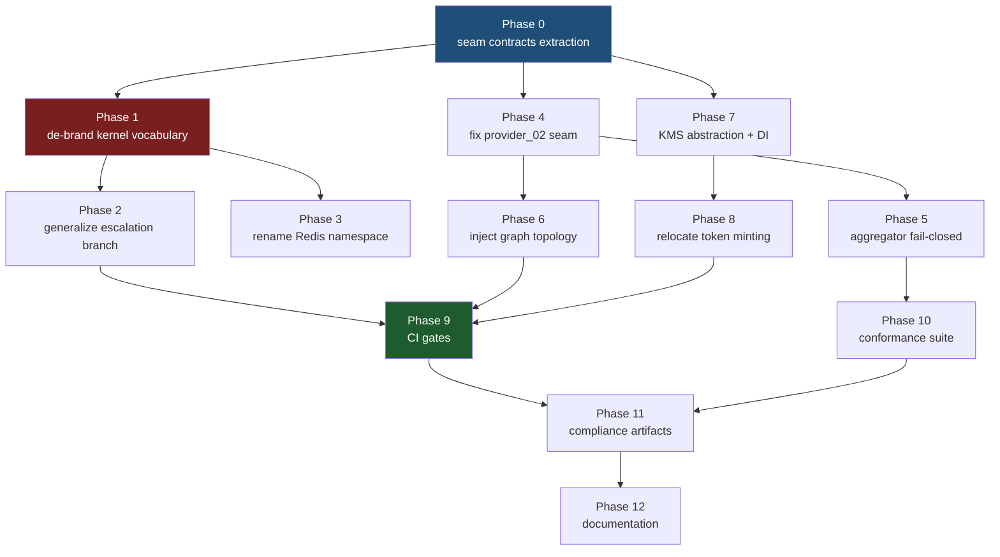

# Layer Inversion Remediation — Partner Adapters

> **Reference Architecture Note.** CAGE is an illustrative reference architecture,
> not a deployed production service. Every phase below optimizes for **structural
> clarity over operational continuity**. Breaking changes are acceptable and
> often desirable; no deprecation window or migration shim is owed to anyone.

## 1. Scope

Remediates four layer inversions in the partner adapter surface plus two
supporting defects, discovered during an audit of `src/integrations/`.

**Not in scope:** the adapters' own business logic, vendor wire protocols, or
any change to the three-layer model itself.

## 2. Findings Being Remediated

| # | Finding | Direction | Severity |
|---|---|---|---|
| I1 | Vendor vocabulary (`FLOWSIGNAL_*`) hardcoded in the kernel | Layer 1 → Layer 3 | High |
| I2 | Layer 4 LangGraph topology hardcoded in `provider_02` | Layer 3 → Layer 4 | High |
| I3 | Adapters bind to concrete kernel classes and a global singleton | Layer 3 → Layer 1 (over-tight) | Medium |
| I4 | `provider_02` satisfies neither seam protocol; masked by `type: ignore` | Contract break | High |
| I5 | Attestation fetch failures are non-attributable in the envelope | Audit integrity | **High** |
| S1 | Latent circular import forces inconsistent function-scope imports | Structural | Medium |
| S2 | CI gates blind to reverse violations; G6 not wired into CI at all | Enforcement gap | Medium |

### Coordination with in-flight plans

Two existing plans overlap and **must** be reconciled before execution:

- [`plans/refactoring_vendor_communications.md`](refactoring_vendor_communications.md)
  already notified Provider 02 that topology injection is coming (§Provider 02,
  Action Required) — Phase 6 here is the implementation of a commitment already
  made to a partner, not a new proposal.
- The same document poses **an open question to each partner**: *"Is vendor
  anonymity in the CAGE codebase important to you?"* That question is
  unanswered. It directly governs Phases 1–3. See §3.1.
- [`plans/vendor_decoupling_implementation_plan.md`](vendor_decoupling_implementation_plan.md)
  establishes the precedent this plan follows (env-var renames with no alias,
  Gate G7 for vendor literals) and independently identifies four Layer 1 → Layer 3
  import inversions in `routing_seal.py`, `governance_middleware.py`,
  `hybrid_server.py`, and `uca_logger.py`. Those are **out of scope here** — they
  are compliance-bridge imports, not partner-adapter imports — but Phase 9's
  reverse-scanning gate must not contradict that plan's W-phases.

**Correction to the original audit:** `FLOWSIGNAL_ALLOW` in
[`constants.py`](../src/gateway/governance/constants.py) is cited by the partner
communications document but **does not exist in the current tree** (verified: zero
matches). Do not plan work against it.

**No import-direction inversions exist.** No adapter imports `cage_*`,
`compliance_bridge`, or `governed_financial_advisor`. Gate G3 passes today and
must continue to pass.

## 3. Core Principle: Coupling vs. Attribution

The refactor targets **load-bearing** vendor references only.

> **Decision test:** If the vendor disappeared tomorrow, would this line have to
> change for the code to keep working?
> **Yes** → coupling, refactor it. **No** → documentation, keep it.

This is the standard the repo already applies in Gate G6
([`check_domain_literals.py:17`](../scripts/check_domain_literals.py:17)), which
explicitly excludes "docstrings and comments (illustrative examples are
legitimate)". Vendor names in prose, READMEs, POAM history, and OSCAL remarks are
**provenance and must be preserved**. Vendor names in identifiers, string
literals, enum members, Redis keys, and env vars are coupling and must go.

[`provider_05/README.md:8`](../src/integrations/provider_05/README.md:8) already
demonstrates the target convention: real vendor name in prose, anonymized
`provider_05` in the import path.

### 3.1 — ~~BLOCKING GATE~~ RESOLVED 2026-09-09: standardize on real vendor names

> **HOLD LIFTED — but the resolution shrinks Phases 1–3 rather than releasing
> them as written.**
>
> The decision is to **standardize on real vendor names in committed code**, not
> to complete anonymization. That removes the driver behind most of Phase 1 and
> Phase 3:
>
> | Phase | As written below | Execute? |
> |---|---|---|
> | **Phase 1** — de-brand kernel vocabulary | Repo-wide `FLOWSIGNAL_*` → `EXTERNAL_HOLD` | **Largely dropped.** Vendor names may remain in kernel identifiers. |
> | **Phase 2** — generalize the escalation branch | Delete the vendor-shaped branch | **YES — unchanged. This is the real I1 fix.** |
> | **Phase 3** — rename Redis namespace / env var | `flowsignal:token:*` → neutral | **Largely dropped.** |
>
> **The one rename that survives** is `DeferReason.FLOWSIGNAL_ESCALATION` →
> `EXTERNAL_HOLD`, scoped to the enum member and the two-sided finding-code
> contract — and **not for anonymity**. After Phase 2 generalizes the branch,
> multiple providers reach that state, so a vendor-specific enum member becomes
> *factually wrong*. Fold it into the Phase 2 commit.
>
> **Do not execute:** the vocabulary mapping table, the AARM re-alignment, the
> ~133 test-reference sweep, or any Lula / OSCAL / POAM naming update. Those were
> all contingent on the anonymization branch. `aarm_vector="AARM-V8"` was always
> staying — it is a CSA specification identifier, not a vendor name.
>
> Execution detail: [`engineering_execution_brief_2026-09-09.md`](engineering_execution_brief_2026-09-09.md) §0.
> Cross-plan context: [`consolidated_implementation_plan_2026-09-09.md`](consolidated_implementation_plan_2026-09-09.md) §5.1.

**Historical record — what the hold required (no longer applicable):**

`EXTERNAL_HOLD` / `external_authority:` / `EXTAUTH-001` were this plan's
*proposals*, not decisions. They must not be applied on the way past, because a
rename that reaches the compliance layer is expensive to redo:

| Artifact | What a premature rename costs |
|---|---|
| [`lula-validation-flowsignal.yaml`](../compliance/lula/lula-validation-flowsignal.yaml) | Filename, control ID, and embedded Rego string constants |
| [`component-definition.yaml:338`](../compliance/oscal/component-definition.yaml:338) | Component title, `redis-key-namespace` property, control mapping |
| [`sp800-53-component-definition.yaml:93`](../compliance/oscal/sp800-53-component-definition.yaml:93) | AC-3 quorum narrative naming the defer reason |
| [`docs/POAM.md:207`](../docs/POAM.md:207) | Lula gate registry row |

Two inputs are required before the hold lifts:

1. **Partner answer on anonymization.** [`refactoring_vendor_communications.md`](refactoring_vendor_communications.md)
   asks each partner whether to *complete* anonymization or *standardize on the
   real vendor name in committed code*. These are opposite directions. If a
   partner prefers the latter, Phases 1–3 shrink to renaming only kernel-side
   symbols while `provider_01`'s own emitted finding codes legitimately keep the
   brand.
2. **AARM vocabulary alignment.** `DeferReason` members are documented at
   [`defer_queue.py:88`](../src/gateway/governance/defer_queue.py:88) as mapping
   to AARM threat vectors, and `AARM-V8` is asserted by
   [`lula-validation-aarm-vectors.yaml`](../compliance/lula/lula-validation-aarm-vectors.yaml).
   The replacement term must be checked against the CSA AARM vocabulary so the
   enum stays a faithful mapping rather than drifting into ad-hoc naming.

**Deliverable to lift the hold:** a short vocabulary mapping table — old symbol,
new symbol, AARM vector, owning artifact — reviewed and approved. Only then does
Phase 1 start.

### Keep / Refactor matrix

| Location | Example | Verdict |
|---|---|---|
| Kernel enum member | `DeferReason.FLOWSIGNAL_ESCALATION` | ❌ Refactor |
| Kernel string literal | `"FLOWSIGNAL_HOLD"` | ❌ Refactor |
| Kernel function name | `create_flowsignal_escalation_token()` | ❌ Refactor |
| Redis key / env var | `flowsignal:token:*` | ❌ Refactor |
| Kernel comment / docstring | `# ported from FlowSignal` | ✅ Keep |
| Adapter identifier in Layer 3 | `FlowSignalNormativeProvider` | ✅ Keep — isolation is the point |
| Adapter README prose | "Veraxis Execution Integrity Protocol" | ✅ Keep |
| POAM / OSCAL narrative remarks | "Implemented across Phase 1 and 2" | ✅ Keep — audit history is immutable |

## 4. Phase Dependency Graph



**Execution status.** Phases 1–3 are **HELD** pending the naming ratification in
§3.1. Phases 0, 4, 5, 5b, 6, 7, and 8 are unblocked and carry no naming
dependency — they are the available work. Phase 9 must land after 6 and 8.

---

## Phase 0 — Extract seam contracts (S1)

**Branch:** `refactor/seam-contracts-module`

**Problem.** `NormativeBaseline`, `ValidationResult`, and `EvidenceSeal` live in
the same module as the `get_normative_provider()` factory that imports the
adapters. Module-scope imports from `provider_01`/`03`/`06` would therefore be
circular, which is why those three use function-scope imports while
`provider_05`, `actuator_01`, and `storage_*` use module-scope. The
inconsistency is structural, not stylistic.

**Change.** Create `src/gateway/governance/seams/` containing contract-only
modules with zero imports from the rest of the kernel:

| New module | Contents moved from |
|---|---|
| `seams/normative.py` | `NormativeBaseline`, `ValidationResult`, `EvidenceSeal`, `FindingStatus`, `ExecutionStatus`, `NormativeProvider` Protocol |
| `seams/attestation.py` | `AttestationProvider` ABC, `ExternalAttestation`, `AttestationStatus` |
| `seams/actuation.py` | `ExecutionClearance`, `ActuationReceipt`, `ExecutionActuator`, `ActuatorCapability` |

[`normative_provider.py`](../src/gateway/governance/normative_provider.py) keeps
the daemon, factory, and `enforce_fria_boundary()`, re-exporting the dataclasses
for one commit only, then dropping the re-export in the same PR.

**Then** convert every adapter to module-scope seam imports — removes 12
function-scope imports across `provider_01`, `provider_03`, `provider_06`.

**Verification**
```bash
uv run python scripts/check_import_boundaries.py --verbose
uv run pytest tests/ -m "local or unit" -n auto --dist loadscope --no-cov -p no:langsmith -p no:langsmith_plugin
```

**Commit:** `refactor(governance)!: extract seam contracts into seams package`

---

## Phase 1 — De-brand kernel vocabulary (I1, critical path)

**Branch:** `refactor/debrand-kernel-vocab`

**Rename map — executable symbols only:**

| Current | Replacement | Site |
|---|---|---|
| `DeferReason.FLOWSIGNAL_ESCALATION` | `DeferReason.EXTERNAL_HOLD` | [`defer_queue.py:112`](../src/gateway/governance/defer_queue.py:112) |
| `_FLOWSIGNAL_ESCALATION_TTL` | `_EXTERNAL_HOLD_TTL` | [`defer_queue.py:76`](../src/gateway/governance/defer_queue.py:76) |
| `create_flowsignal_escalation_token()` | `create_external_hold_token()` | [`defer_queue.py:710`](../src/gateway/governance/defer_queue.py:710) |
| `is_flowsignal_hold_finding()` | `is_external_hold_finding()` | [`defer_queue.py:758`](../src/gateway/governance/defer_queue.py:758) |
| `"FLOWSIGNAL_HOLD"` literal | `"EXTERNAL_HOLD"` | [`defer_queue.py:775`](../src/gateway/governance/defer_queue.py:775) |
| `_flowsignal_finding_message` key | `_external_hold_finding_message` | [`defer_queue.py:751`](../src/gateway/governance/defer_queue.py:751) |
| `is_flowsignal_hold` response field | `is_external_hold` | [`governance_middleware.py:782`](../src/gateway/server/governance_middleware.py:782) |
| `"FLOWSIGNAL_REFUSE"` literal | `"EXTERNAL_REFUSE"` | [`provider_01/provider.py`](../src/integrations/provider_01/provider.py) emitter |

**Deliberately unchanged:**
- `aarm_vector="AARM-V8"` — the vector ID is a CSA AARM specification
  identifier, not a vendor name. Only its trailing comment mentions FlowSignal.
  Update the comment to "External Hold"; the ID stays.
- Every comment and docstring mentioning FlowSignal — provenance, per §3.
- `FlowSignalNormativeProvider` and all Layer 3 identifiers — isolation is the point.

**Emitter/consumer coupling.** The finding codes are a two-sided contract:
`provider_01` emits `FLOWSIGNAL_HOLD`/`FLOWSIGNAL_REFUSE` and the kernel matches
them. Both sides must change in the **same commit** or the escalation path
silently fails open into the generic branch.

**Test blast radius:** ~133 `flowsignal` references across the suite. Materially
affected: [`test_defer_queue.py`](../tests/test_defer_queue.py) (~20 assertions),
[`test_defer_queue_quorum.py:147`](../tests/test_defer_queue_quorum.py:147),
[`test_governance_middleware.py:1078`](../tests/test_governance_middleware.py:1078)
(the whole `TestFlowSignalHttp202Receipt` class),
[`test_normative_provider_conformance.py:123`](../tests/test_normative_provider_conformance.py:123),
[`test_provider_01.py`](../tests/test_provider_01.py). Test *class and function
names* may keep the vendor name where they genuinely test the vendor adapter.

**Commit:** `refactor(governance)!: rename FLOWSIGNAL_* to vendor-neutral EXTERNAL_HOLD`
with a `BREAKING CHANGE:` footer.

---

## Phase 2 — Generalize the escalation branch (I1 root cause)

**Branch:** `refactor/generic-external-hold`

Renaming alone leaves the structural defect: one provider still gets a
privileged branch. [`enforce_fria_boundary()`](../src/gateway/governance/normative_provider.py:548)
special-cases a specific finding code and hardcodes a 300s TTL, while
`provider_06`'s `REVIEW` uses the generic `needs_human_review` path at
[`normative_provider.py:592`](../src/gateway/governance/normative_provider.py:592).

**Change.** Delete the vendor-shaped branch entirely. Drive TTL and DeferReason
off declared finding fields any provider can populate:

```python
# Any provider may request a shorter hold by declaring hold_ttl_seconds.
finding = next((f for f in result.findings if f.get("needs_human_review")), None)
if finding is not None:
    ttl = finding.get("hold_ttl_seconds", _DEFAULT_HOLD_TTL)
    reason = DeferReason.EXTERNAL_HOLD
```

This collapses two branches into one and makes `provider_01` and `provider_06`
structurally identical from the kernel's viewpoint — the actual fix for I1.

**Invariant to preserve:** quorum-3 for `EXTERNAL_HOLD`, matching the existing
mapping at [`defer_queue.py:265`](../src/gateway/governance/defer_queue.py:265).
Do not let the generalization silently downgrade quorum to 2.

**New test:** assert `provider_06` REVIEW and `provider_01` ESCALATE produce
byte-identical `DeferToken` shapes apart from the finding message.

**Commit:** `refactor(governance)!: drive external hold TTL from finding fields`

---

## Phase 3 — Rename Redis namespace and env var (I1)

**Branch:** `refactor/external-authority-keyspace`

| Current | Replacement |
|---|---|
| `flowsignal:token:<id>` | `external_authority:token:<id>` |
| `FLOWSIGNAL_CONSUMPTION_TTL_SECONDS` | `EXTERNAL_AUTHORITY_CONSUMPTION_TTL_SECONDS` |

Sites: [`consequence_authority_store.py:139`](../src/gateway/governance/consequence_authority_store.py:139),
[`:191`](../src/gateway/governance/consequence_authority_store.py:191),
[`:93`](../src/gateway/governance/consequence_authority_store.py:93).

**Operational note (illustrative only).** In-flight tokens under the old prefix
become unreachable at cutover. Their TTL is 90s and CAGE has no live production
instance, so no migration is written. This is the documented "clean architecture
over operational continuity" tradeoff.

**Compliance coupling — this is the expensive part.** The keyspace is asserted
in three committed artifacts that will fail until updated in the same PR:
- [`lula-validation-flowsignal.yaml:134`](../compliance/lula/lula-validation-flowsignal.yaml:134) — `flowsignal_prefix := "flowsignal:token:"` inside embedded Rego
- [`lula-validation-flowsignal.yaml:133`](../compliance/lula/lula-validation-flowsignal.yaml:133) — collision check against `fiscal:`/`DEFER:`/`safety:`
- [`component-definition.yaml:381`](../compliance/oscal/component-definition.yaml:381) — `redis-key-namespace` property

Also rename the file to `lula-validation-external-authority.yaml` and the control
ID `FLOWSIGNAL-001` → `EXTAUTH-001`, keeping ISO 42001 §A.8.4 mapping intact.

**Commit:** `refactor(governance)!: rename consequence authority Redis keyspace`

---

## Phase 4 — Fix the `provider_02` seam contract (I4)

**Branch:** `fix/provider-02-seam-contract`

> **⚠️ ABSORBS CER Phase 3.** [`provider_02_cer_unblocked_work.md`](provider_02_cer_unblocked_work.md) §8
> specifies the same class rewrite, sequenced after its Phase 2b and emitting
> `VERIFIED`. **This phase wins on timing** — the contract is broken today and
> should not wait on Ed25519 work — **and `UNVERIFIED` is the honest initial
> status**, since `_inspect_local()` performs no signature check.
>
> **Additional requirement from that plan:** add a test asserting the status
> becomes `VERIFIED` once CER Phase 2b lands. That converts the other plan's
> sequencing concern into an enforced invariant. See
> [`consolidated_implementation_plan_2026-09-09.md`](consolidated_implementation_plan_2026-09-09.md) §3.

`Provider02AttestationProvider` implements `certify_decision`, `verify_cer`, and
`register_project_bundle`. It has **no** `fetch_baseline`, `validate_fria`, or
`submit_evidence` — yet [`normative_provider.py:940`](../src/gateway/governance/normative_provider.py:940)
returns it from `get_normative_provider()` behind `# type: ignore[return-value]`.
Any caller treating it as a `NormativeProvider` raises `AttributeError`.

It also lacks `fetch_attestations()` and `provider_name`, so it does not satisfy
`AttestationProvider` either — despite
[`attestation_aggregator.py:58`](../src/gateway/governance/attestation_aggregator.py:58)
documenting exactly that usage.

**Change:**
1. Subclass the `AttestationProvider` ABC; implement `provider_name` → `"provider_02"`.
2. Implement `fetch_attestations(context)` wrapping `verify_cer`, returning
   `ExternalAttestation` with `AttestationStatus.UNVERIFIED` — correct today,
   since [`_inspect_local()`](../src/integrations/provider_02/provider.py:289)
   performs no signature check pending Phase 2b.
3. Remove the `provider_02` branch and its `type: ignore` from
   `get_normative_provider()`; drop `p02` from the alias map.
4. Raise a descriptive `ValueError` naming `AttestationAggregator` when
   `provider_02` is requested from the normative factory.

**Note:** this deletes the behavior asserted by
[`provider_02/tests/test_provider.py:259`](../src/integrations/provider_02/tests/test_provider.py:259),
which currently pins the incorrect wiring. Invert that test.

**Preserve** the `CERVerification.__post_init__` fail-closed invariant at
[`provider.py:115`](../src/integrations/provider_02/provider.py:115) — it is
well-designed and must survive the refactor untouched.

**Commit:** `fix(governance)!: make provider_02 satisfy AttestationProvider`

---

## Phase 5 — Fail-closed aggregator registration (I4 hardening)

**Branch:** `fix/attestation-aggregator-typecheck`

[`AttestationAggregator.register()`](../src/gateway/governance/attestation_aggregator.py:84)
appends any object without validation, so a non-conforming provider fails later
at `provider.provider_name` during `_do_fetch()`. Compare
[`ActuatorRegistry.register()`](../src/gateway/governance/execution_actuator.py:196),
which correctly enforces `isinstance`.

Add the symmetric check, raising `TypeError` at registration.

**Commit:** `fix(governance): enforce AttestationProvider protocol at registration`

---

## Phase 5b — Attestation failure attributability (I5, security-relevant)

**Branch:** `fix/attestation-error-attribution`

**Correction to the original audit.** I first reported that
`AttestationAggregator` silently omits failed providers. On inspection of
[`_do_fetch()`](../src/gateway/governance/attestation_aggregator.py:135) that is
**wrong** — the handler already appends an `ExternalAttestation` carrying
`AttestationStatus.ERROR` and the exception message. The envelope *does* record
the gap. The "fail-open" wording in the
[`boot_fetch()` docstring](../src/gateway/governance/attestation_aggregator.py:106)
is stale and describes behavior the code no longer has.

The real defect is narrower but still audit-relevant:

| # | Defect | Site |
|---|---|---|
| a | `attestation_type` is overloaded as `PROVIDER_ERROR:{name}` — an error channel smuggled through a type field, so error entries are only discoverable by string-prefix matching | [`:145`](../src/gateway/governance/attestation_aggregator.py:145) |
| b | `provider.provider_name` is evaluated **inside** the `except` block; a provider whose property itself raises escapes the handler and aborts the whole fetch loop, dropping every subsequent provider | [`:138`](../src/gateway/governance/attestation_aggregator.py:138) |
| c | `self._cache = all_attestations` replaces the cache wholesale, so a total-failure poll silently discards the previous good attestation set | [`:153`](../src/gateway/governance/attestation_aggregator.py:153) |
| d | `_last_fetch_at` is set even when every provider failed, so staleness monitors read a healthy timestamp over a fully-failed fetch | [`:154`](../src/gateway/governance/attestation_aggregator.py:154) |
| e | The poll loop swallows all exceptions and continues with no failure counter or backoff | [`:191`](../src/gateway/governance/attestation_aggregator.py:191) |

**Change:**
1. Add a first-class `provider_name` field to `ExternalAttestation`; stop
   encoding identity into `attestation_type`.
2. Capture `provider_name` **before** the `try`, so defect (b) cannot abort the loop.
3. Distinguish partial from total failure: on total failure retain the prior
   cache, leave `_last_fetch_at` unchanged, and surface an explicit staleness signal.
4. Correct the stale "fail-open per §7.3" docstring to describe actual behavior.

**Compliance:** touches AU-10 (non-repudiation) and AU-12 (audit generation).
POAM entry required, plus an OSCAL component update within 2 business days of merge.

**Commit:** `fix(governance): make attestation fetch failures attributable`

---

## Phase 6 — Inject graph topology into `provider_02` (I2)

**Branch:** `refactor/provider-02-topology-injection`

A Layer 3 vendor adapter currently encodes the Layer 4 financial advisor's
LangGraph structure:

| Site | Hardcoded content |
|---|---|
| [`adapter.py:102`](../src/integrations/provider_02/adapter.py:102) | Canonical node list — `governed_trader`, `safety_check`, `explainer` |
| [`adapter.py:118`](../src/integrations/provider_02/adapter.py:118) | Parent-edge map of the application graph |
| [`adapter.py:326`](../src/integrations/provider_02/adapter.py:326) | `if "governed_trader" in node_names: return "happy_path"` |
| [`adapter.py:497`](../src/integrations/provider_02/adapter.py:497) | `"interruptNode": "governed_trader"` |

Running this adapter against `cage_healthcare` would misclassify every terminal
path — silently, since the classifier falls through rather than raising.

**Change.** Introduce a `GraphTopology` dataclass in `seams/` carrying
`nodes`, `parent_edges`, `terminal_node`, and `interrupt_node`. Require it as a
constructor argument on `AttestationBundleCallback`. Supply the finance instance
from `src/cage_finance/` (Layer 2), where node vocabulary belongs.

**Fail-closed requirement.** `_classify_terminal_path()` must raise on an
unrecognized node rather than defaulting — an unclassifiable traversal is an
integrity signal, not a `happy_path`.

**Related, same PR:** [`provider_03/provider.py:189`](../src/integrations/provider_03/provider.py:189)
sniffs `"amount"`/`"symbol"` keys. Replace with a caller-declared field list.

**Commit:** `refactor(agentsight)!: inject graph topology into provider_02`

---

## Phase 7 — Abstraction and dependency injection (I3)

**Branch:** `refactor/adapter-kms-abstraction`

Three adapters import the concrete `KMSGovernanceSigner` when the
[`BaseKMSProvider`](../src/gateway/governance/kms_signer.py:66) ABC already
exists: [`signatures.py:27`](../src/integrations/actuator_01/signatures.py:27),
[`assertion.py:43`](../src/integrations/actuator_01/assertion.py:43),
[`adapter.py:58`](../src/integrations/actuator_01/adapter.py:58).

Worse, [`provider_01/provider.py:112`](../src/integrations/provider_01/provider.py:112)
calls `get_governance_signer()` — a Layer 3 adapter reaching into a kernel
**global singleton**. That is service-locator, the inverse of DI, and it makes
the adapter untestable without patching kernel global state.

**Change:**
1. Retype adapter signatures to the narrowest sufficient abstraction.
2. Accept the signer as a constructor parameter; the composition root resolves
   the singleton, not the adapter.
3. Delete the `get_governance_signer()` call from `provider_01`.

**Commit:** `refactor(integrations)!: inject signer abstraction into adapters`

---

## Phase 8 — Relocate ConsequenceToken minting (I3, security-relevant)

**Branch:** `refactor/kernel-token-minting`

[`provider_01/provider.py:110`](../src/integrations/provider_01/provider.py:110)
mints a `ConsequenceToken` inside a vendor adapter. Applying the AGENTS.md
decision test — *"if two domains had different copies of this, would a security
fix have to be applied twice?"* — the answer is yes. Token minting is JCS
canonicalization plus KMS signing: Layer 1 work.

**Change.** Move minting into a kernel service. The adapter supplies the five
claim inputs (`sub`, `tid`, `rec`, `act`, `ver`) as plain data; the kernel mints,
signs, and returns the finding. No adapter touches the signer.

**Preserve the fail-closed contract** established by POAM-2026-064: an `ALLOW`
without `authority_record_id` must still fail closed. Re-verify
[`test_provider_01.py:704`](../tests/test_provider_01.py:704) passes unchanged.

**Compliance:** touches SC-13/IA-5 implementations — OSCAL component update
required within 2 business days of merge.

**Commit:** `refactor(governance)!: move ConsequenceToken minting into kernel`

---

## Phase 9 — Close the CI enforcement gaps (S2)

**Branch:** `ci/layer-boundary-gates`

Three gaps let every finding above reach `main` unchallenged:

**9a — G3 is one-directional.** [`check_import_boundaries.py:292`](../scripts/check_import_boundaries.py:292)
only walks `src/gateway/`. Add a reverse scan of `src/integrations/` rejecting
imports of `src.cage_*`, `src.compliance_bridge`, and
`src.governed_financial_advisor`. Currently clean — the gate locks in that state.

**9b — G6 exists but is not wired into CI.** [`check_domain_literals.py`](../scripts/check_domain_literals.py)
appears in no workflow step; `.github/workflows/ci.yml` runs G3 at line 241 and
G7 at line 247, with no G6. Add the step, and extend `FORBIDDEN_LITERALS`
scanning to `src/integrations/` so Phase 6's fix cannot regress.

**9c — new vendor-brand gate (G8).** Model on the existing AST design: reuse
[`DomainLiteralChecker`](../scripts/check_domain_literals.py:47), which already
skips docstrings via `_docstring_nodes` and is comment-blind by construction —
exactly the keep/refactor split from §3, enforced mechanically. Scan
`src/gateway/` for a configurable vendor-brand list. Prose stays legal; new
executable coupling cannot be introduced.

**Commit:** `ci(governance): add reverse boundary and vendor-brand gates`

---

## Phase 10 — Extend the conformance suite

**Branch:** `test/provider-conformance-coverage`

[`test_normative_provider_conformance.py:49`](../tests/test_normative_provider_conformance.py:49)
lists `provider_02` in `ATTESTATION_PROVIDERS` but only instantiates it at
[`:105`](../tests/test_normative_provider_conformance.py:105) — never exercising
a protocol method, which is why I4 went unnoticed.

Add a parameterized attestation-conformance test asserting: `provider_name` is
non-empty; `fetch_attestations({})` returns `list[ExternalAttestation]`; every
entry carries a valid `AttestationStatus`; failures fail closed. Register
`provider_05`'s three providers in the same parameterization.

All new tests need `pytestmark = [pytest.mark.unit, pytest.mark.local]` per the
marker contract, or `marker-contract-check` fails.

**Commit:** `test(governance): add attestation provider conformance coverage`

---

## Phase 11 — Compliance artifacts

**Branch:** `docs/compliance-external-authority`

| Artifact | Change |
|---|---|
| [`lula-validation-flowsignal.yaml`](../compliance/lula/lula-validation-flowsignal.yaml) | Rename file; `FLOWSIGNAL-001` → `EXTAUTH-001`; update embedded Rego prefix and secret names; keep ISO 42001 §A.8.4 |
| [`component-definition.yaml:338`](../compliance/oscal/component-definition.yaml:338) | Retitle component; update `redis-key-namespace` property; keep narrative history |
| [`sp800-53-component-definition.yaml:93`](../compliance/oscal/sp800-53-component-definition.yaml:93) | Update quorum-3 defer-reason list to `EXTERNAL_HOLD` |
| [`docs/POAM.md`](../docs/POAM.md) | New entries for I2, I3, I4; commit SHA, Lula result, closure date |

Keep the Lula stub count stable — [`check_lula_stub_count.py`](../scripts/check_lula_stub_count.py)
and [`check_poam_lula_divergence.py`](../scripts/check_poam_lula_divergence.py)
will flag drift.

**Historical POAM narrative text is immutable** — POAM-2026-061 and -064 describe
what was true at the time. Do not rewrite history to match new names.

**Commit:** `docs(compliance): retarget artifacts to external authority naming`

---

## Phase 12 — Documentation

**Branch:** `docs/layer-boundary-conventions`

| Document | Change |
|---|---|
| [`BREAKING_CHANGES_v3.md`](../docs/BREAKING_CHANGES_v3.md) | New BC entries for every `!` commit above |
| [`API_MAP_EXTERNAL.md:972`](../docs/API_MAP_EXTERNAL.md:972) | Update the finding-code table |
| [`CAGE_OPEN_INTEROP_SPEC.md:1509`](../docs/CAGE_OPEN_INTEROP_SPEC.md:1509) | Update the verdict-mapping table |
| [`EXTENSIBILITY_ARCHITECTURE.md`](../docs/architecture/EXTENSIBILITY_ARCHITECTURE.md) | Document the seams package and DI requirement |
| [`AGENTS.md`](../AGENTS.md) | Add the §3 keep/refactor rule and G8 to the CI failure table |
| Adapter READMEs | Apply the [`provider_05`](../src/integrations/provider_05/README.md:8) naming-note convention uniformly |

**Commit:** `docs(governance): document layer boundary and vendor naming rules`

---

## 5. Verification Gate — every phase

```bash
uv run python scripts/check_import_boundaries.py --verbose
uv run python scripts/check_domain_literals.py
uv run ruff check . && uv run ruff format --check .
uv run mypy src/
uv run pytest tests/ -m "local or unit" -n auto --dist loadscope --no-cov \
  -p no:langsmith -p no:langsmith_plugin --tb=short
```

Before opening any PR, confirm no `kubectl port-forward` tunnels are active —
they contaminate local Redis state and will produce spurious failures in the
Phase 3 keyspace tests:

```bash
ps aux | grep port-forward
```

Full integration validation against live GKE after Phase 3 and Phase 8, since
both touch Redis and KMS paths:

```bash
bash scripts/port_forward_staging.sh
uv run pytest tests/ --run-integration -v --tb=short
```

## 6. Risk Register

| Risk | Phase | Mitigation |
|---|---|---|
| Finding-code rename splits emitter/consumer, silently failing open | 1 | Change both sides in one commit; add a test asserting the escalation path still parks with quorum 3 |
| Lula gate fails after keyspace rename | 3 | Update the embedded Rego in the same PR; run the staging lifecycle before tagging |
| Removing `provider_02` from the normative factory breaks an unknown caller | 4 | Raise `ValueError` naming the correct aggregator rather than returning `None` |
| Topology injection breaks bundle classification | 6 | Fail closed on unknown nodes; assert against the existing fixtures in [`test_adapter.py:382`](../src/integrations/provider_02/tests/test_adapter.py:382) |
| Token-minting relocation weakens the POAM-2026-064 fail-closed guarantee | 8 | Treat [`test_provider_01.py:704`](../tests/test_provider_01.py:704) as a frozen regression gate |
| G8 over-matches and blocks legitimate prose | 9 | AST-based, docstring-skipping, comment-blind by construction |

## 7. Sequencing Note

Phases 1–3 are one logical breaking change split into reviewable units. Land
them behind a single `rc-v*` branch so `main` never sits in a half-renamed
state. Phases 4–8 are independent and may land in any order. Phase 9 must land
**after** 6 and 8, or the new gates fail on code not yet fixed.

Every PR: squash merge only, Conventional Commits title, `!` plus a
`BREAKING CHANGE:` footer wherever the tables above say so.
