# Markdown Audit Remediation Plan — CAGE v0.1.0

**Prepared:** 2026-07-05  
**Change Category:** Cat-S (Standard) — documentation-only changes, no code, no infrastructure  
**Branch:** `docs/markdown-audit-remediation`  
**Scope:** 8 targeted file edits + 1 file deletion  

---

## Verification Summary

All findings below were verified against actual file content before this plan was written. Several items from the original audit report were **revised or dropped** after verification:

| Original Audit Claim | Verified Outcome | Action |
|---|---|---|
| POAM-018 should be CLOSED | POAM_INDEX confirms POAM-018 is **Open** in all authoritative POAM files | No change to POAM-018 status anywhere |
| `docs/AGENTIC_SCOPE_STATEMENT.md` is a safe duplicate to delete | CI script `docs/AI_600_1_IMPLEMENTATION_PLAN.md §7.5` runs `test -f docs/AGENTIC_SCOPE_STATEMENT.md` | **Do not delete** |
| `docs/AI_600_1_IMPLEMENTATION_PLAN.md` is a safe duplicate to delete | `POAM_US_FED.md` references `docs/AI_600_1_IMPLEMENTATION_PLAN.md` directly | **Do not delete** |
| `docs/NIST_AI_600_1_US_FED_ANALYSIS.md` is a safe duplicate to delete | `POAM_US_FED.md` references `docs/NIST_AI_600_1_US_FED_ANALYSIS.md` directly | **Do not delete** |
| `docs/security/INCIDENT_RESPONSE_PLAN.md` is a simplified duplicate | `docs/README.md` lists it as "summary" and `SECURITY_STATUS.md` references it as `docs/INCIDENT_RESPONSE_PLAN.md` | **Do not delete** |
| COMPLIANCE.md Lula count "20" is wrong | COMPLIANCE.md says "20 manifests — 4 Active, 16 Stub" which is **incorrect** (actual: 21 files, 4 Active, 17 Stub) | Fix count |
| `06-COMPLIANCE-STANDARDS.md` says "15 manifests all Active" | Confirmed wrong — 15 manifests listed in that table, but only 4 are Active | Fix header |
| README.md badge says "Closed 6" | POAM_INDEX File Registry shows **7 closed** (all in US_FED) | Fix badge |

---

## Ground Truth: Lula Manifest Inventory

**Actual files in `compliance/lula/`:** 21 YAML files  
**Active (4):** `lula-validation-a52.yaml`, `lula-validation-a53.yaml`, `lula-validation-a92.yaml`, `lula-validation-sc4.yaml`  
**Stub (17):** all remaining 17 files  

The `compliance/lula/README.md` is the authoritative source and is accurate.

---

## Implementation Plan

### Group A — Personal / Placeholder Paths (P0 — Security Risk)

These must be fixed first. Absolute personal paths in committed documentation are a security hygiene issue.

#### A-1: [`docs/security/HITL_TOCTOU_REMEDIATION.md`](../docs/security/HITL_TOCTOU_REMEDIATION.md:148)

**Problem:** The "Files Changed" table at lines 148–152 uses `file:///Users/larsahlfors/Code/...` absolute URIs as Markdown link targets. These are machine-specific paths that will not resolve for any other reader.

**Fix:** Replace each `file:///Users/larsahlfors/Code/cybernetic-governance-engine/` prefix with a relative path from the document's location (`docs/security/`), which means `../../`.

| Current link target | Replacement |
|---|---|
| `file:///Users/larsahlfors/Code/cybernetic-governance-engine/src/governed_financial_advisor/graph/subgraphs/governed_trader_graph.py` | `../../src/governed_financial_advisor/graph/subgraphs/governed_trader_graph.py` |
| `file:///Users/larsahlfors/Code/cybernetic-governance-engine/src/governed_financial_advisor/graph/nodes/approval_node.py` | `../../src/governed_financial_advisor/graph/nodes/approval_node.py` |
| `file:///Users/larsahlfors/Code/cybernetic-governance-engine/src/governed_financial_advisor/graph/nodes/agent_nodes.py` | `../../src/governed_financial_advisor/graph/nodes/agent_nodes.py` |
| `file:///Users/larsahlfors/Code/cybernetic-governance-engine/src/governed_financial_advisor/server.py` | `../../src/governed_financial_advisor/server.py` |
| `file:///Users/larsahlfors/Code/cybernetic-governance-engine/tests/test_hitl_toctou_revalidation.py` | `../../tests/test_hitl_toctou_revalidation.py` |

**Exact diff target (lines 148–152):**
```
| [`governed_trader_graph.py`](file:///Users/larsahlfors/Code/cybernetic-governance-engine/src/governed_financial_advisor/graph/subgraphs/governed_trader_graph.py) |
| [`approval_node.py`](file:///Users/larsahlfors/Code/cybernetic-governance-engine/src/governed_financial_advisor/graph/nodes/approval_node.py) |
| [`agent_nodes.py`](file:///Users/larsahlfors/Code/cybernetic-governance-engine/src/governed_financial_advisor/graph/nodes/agent_nodes.py) |
| [`server.py`](file:///Users/larsahlfors/Code/cybernetic-governance-engine/src/governed_financial_advisor/server.py) |
| [`test_hitl_toctou_revalidation.py`](file:///Users/larsahlfors/Code/cybernetic-governance-engine/tests/test_hitl_toctou_revalidation.py) |
```

---

#### A-2: [`docs/operations/MCP_INTEGRATION_GUIDE.md`](../docs/operations/MCP_INTEGRATION_GUIDE.md:33)

**Problem:** Three code blocks use `/Users/yourusername/Code/cybernetic-governance-engine` as a placeholder path. This is a generic placeholder (not a real personal path), but it is misleading — readers should use their own path or an environment variable.

**Fix:** Replace the placeholder with a clear instruction comment. The JSON examples should use `$PROJECT_ROOT` or `<your-project-root>` to make the substitution requirement explicit.

| Location | Current | Replacement |
|---|---|---|
| Line 33 | `/Users/yourusername/Code/cybernetic-governance-engine/.venv/bin/python` | `<path-to-project>/.venv/bin/python` |
| Line 39 | `"PROJECT_ROOT": "/Users/yourusername/Code/cybernetic-governance-engine"` | `"PROJECT_ROOT": "<path-to-project>"` |
| Line 65 | `/Users/yourusername/.mcp/node_modules/.bin/melt-langfuse-mcp` | `<path-to-mcp-node-modules>/.bin/melt-langfuse-mcp` |

Add a note above the first JSON block: `> **Note:** Replace `<path-to-project>` with the absolute path to your local clone of this repository (e.g. the output of `pwd` from the project root).`

---

#### A-3: [`mcp-servers/infrastructure/README.md`](../mcp-servers/infrastructure/README.md:147)

**Problem:** Line 147 contains `"PROJECT_ROOT": "/Users/yourusername/Code/cybernetic-governance-engine"` in a JSON configuration example.

**Fix:** Replace with `"PROJECT_ROOT": "<path-to-project>"` and add the same explanatory note as A-2.

---

### Group B — Factual Inaccuracies (P0 — Compliance Documentation Integrity)

#### B-1: [`docs/technical-report/06-COMPLIANCE-STANDARDS.md`](../docs/technical-report/06-COMPLIANCE-STANDARDS.md:276)

**Problem:** Line 276 reads:
```
**15 total Lula manifests — all Active** (full Kubernetes domain checks):
```
This is doubly wrong: (a) only 4 of the 15 listed manifests are Active; (b) the actual total in `compliance/lula/` is 21 manifests (4 Active, 17 Stub). The table that follows lists 15 manifests — these are the 15 that existed before the EU_ECB, APAC_MAS, and AI 600-1 stubs were added.

**Fix:** Change the header line to accurately describe what the table shows, and add a cross-reference to the authoritative source:
```
**15 manifests listed below (4 Active, 11 Stub)** — this table covers the original US_FED and universal controls. For the complete 21-manifest inventory including EU_ECB, APAC_MAS, and NIST AI 600-1 stubs, see [`compliance/lula/README.md`](../../compliance/lula/README.md).
```

Also add a `Status` column to the table (or annotate each row) to distinguish Active from Stub. The 4 Active manifests are: `lula-validation-a52.yaml`, `lula-validation-a53.yaml`, `lula-validation-a92.yaml`, `lula-validation-sc4.yaml`. All others in the table are Stub.

---

### Group C — Version String Inconsistencies (P1)

All architecture and governance documents should carry `v0.1.0` as the version string. The authoritative version is established in [`docs/technical-report/README.md`](../docs/technical-report/README.md) and [`README.md`](../README.md) badge.

#### C-1: [`docs/architecture/EXTENSIBILITY_ARCHITECTURE.md`](../docs/architecture/EXTENSIBILITY_ARCHITECTURE.md:7)

**Problem:** Line 7: `| **Version**        | 2.3.0                     |`  
**Fix:** Change to `| **Version**        | v0.1.0                    |`

---

#### C-2: [`docs/architecture/AGENT_OPS_ARCHITECTURE.md`](../docs/architecture/AGENT_OPS_ARCHITECTURE.md:5)

**Problem:** Line 5: `**Version:** v2.0.0-rc.2 (promoted 2026-06-03)`  
**Fix:** Change to `**Version:** v0.1.0`

---

#### C-3: [`docs/governance/GOVERNANCE_OVERVIEW.md`](../docs/governance/GOVERNANCE_OVERVIEW.md:3)

**Two problems:**
1. Line 3: `**System Version:** v2.0.0 (stable, released 2026-06-08)` — should be `v0.1.0`
2. Lines 12–17: The jurisdiction separation blockquote is **duplicated** — it appears identically at lines 5–10 and again at lines 12–17. The second copy must be deleted.

**Fix:**
- Change line 3: `**Last Updated:** 2026-06-15 | **System Version:** v0.1.0`
- Delete lines 12–17 (the duplicate blockquote)

---

#### C-4: [`docs/architecture/GATEWAY_ARCHITECTURE.md`](../docs/architecture/GATEWAY_ARCHITECTURE.md:7)

**Problem:** Line 7: `**Version:** v2.0.0 (stable, released 2026-06-14)`  
**Fix:** Change to `**Version:** v0.1.0`

---

#### C-5: [`COMPLIANCE.md`](../COMPLIANCE.md:2)

**Problem:** Line 2: `**CAGE Version:** 2.0.0 (CSA AARM Conformance Release)`  
**Fix:** Change to `**CAGE Version:** v0.1.0`

---

### Group D — Badge / Counter Discrepancy (P1)

#### D-1: [`README.md`](../README.md:5)

**Problem:** Line 5 badge: ``  
**Verified ground truth:** `docs/compliance/cross-region/POAM_INDEX.md` File Registry table shows **7 Closed** (all in `POAM_US_FED.md`).

**Fix:** Change badge URL from `POAM%20Closed-6` to `POAM%20Closed-7`:
```

```

---

### Group E — True Duplicate File Deletion (P1)

#### E-1: Delete [`docs/JURISDICTIONAL_SEPARATION_ANALYSIS.md`](../docs/JURISDICTIONAL_SEPARATION_ANALYSIS.md)

**Verified:** `docs/README.md` line 91 already points to `compliance/cross-region/JURISDICTIONAL_SEPARATION_ANALYSIS.md` as the canonical location. The `docs/` root copy is a true duplicate with no inbound references from any other file (confirmed by search). Safe to delete.

**Method:** `git rm docs/JURISDICTIONAL_SEPARATION_ANALYSIS.md`

---

### Group F — Personal Path in Document Header (P1)

#### F-1: [`docs/project/REPOSITORY_CLEANUP_PLAN.md`](../docs/project/REPOSITORY_CLEANUP_PLAN.md:4)

**Problem:** Line 4: `**Scope:** Full repository audit of `/Users/larsahlfors/Code/cybernetic-governance-engine``  
**Fix:** Change to: `**Scope:** Full repository audit of the CAGE project root`

Also update line 5: `**Status:** Recommendation only — no files have been moved or deleted`  
This is now stale — some reorganization has occurred (scripts moved, docs reorganized). Change to:  
`**Status:** Partially implemented — some recommendations from this plan have been actioned; see git history for details`

---

## Execution Order

```mermaid
graph TD
    A1[A-1: Fix file:/// paths in HITL_TOCTOU_REMEDIATION.md] --> DONE1[✓]
    A2[A-2: Fix placeholder paths in MCP_INTEGRATION_GUIDE.md] --> DONE2[✓]
    A3[A-3: Fix placeholder path in mcp-servers README.md] --> DONE3[✓]
    B1[B-1: Fix Lula count in 06-COMPLIANCE-STANDARDS.md] --> DONE4[✓]
    C1[C-1: Fix version in EXTENSIBILITY_ARCHITECTURE.md] --> DONE5[✓]
    C2[C-2: Fix version in AGENT_OPS_ARCHITECTURE.md] --> DONE6[✓]
    C3[C-3: Fix duplicate blockquote + version in GOVERNANCE_OVERVIEW.md] --> DONE7[✓]
    C4[C-4: Fix version in GATEWAY_ARCHITECTURE.md] --> DONE8[✓]
    C5[C-5: Fix version in COMPLIANCE.md] --> DONE9[✓]
    D1[D-1: Fix POAM badge in README.md] --> DONE10[✓]
    E1[E-1: Delete docs/JURISDICTIONAL_SEPARATION_ANALYSIS.md] --> DONE11[✓]
    F1[F-1: Fix personal path + stale status in REPOSITORY_CLEANUP_PLAN.md] --> DONE12[✓]
```



All changes are independent — they can be executed in any order within a single commit or as a batch.

---

## Commit Message

```
docs(docs): fix audit findings — paths, versions, Lula count, POAM badge

- Replace file:/// absolute paths in HITL_TOCTOU_REMEDIATION.md with
  relative paths (../../src/..., ../../tests/...)
- Replace /Users/yourusername placeholder paths in MCP_INTEGRATION_GUIDE.md
  and mcp-servers/infrastructure/README.md with <path-to-project> tokens
- Fix 06-COMPLIANCE-STANDARDS.md Lula section: "15 manifests all Active"
  → "15 manifests listed (4 Active, 11 Stub); full 21-manifest inventory
  in compliance/lula/README.md"
- Fix version strings: EXTENSIBILITY_ARCHITECTURE.md (2.3.0→v0.1.0),
  AGENT_OPS_ARCHITECTURE.md (v2.0.0-rc.2→v0.1.0),
  GOVERNANCE_OVERVIEW.md (v2.0.0→v0.1.0), GATEWAY_ARCHITECTURE.md
  (v2.0.0→v0.1.0), COMPLIANCE.md (2.0.0→v0.1.0)
- Remove duplicate jurisdiction blockquote in GOVERNANCE_OVERVIEW.md
- Fix README.md POAM badge: Closed-6 → Closed-7 (per POAM_INDEX)
- Delete docs/JURISDICTIONAL_SEPARATION_ANALYSIS.md (true duplicate;
  canonical at docs/compliance/cross-region/)
- Fix REPOSITORY_CLEANUP_PLAN.md: remove personal path, update stale status

Refs: markdown-audit-2026-07-05
```

---

## Items Explicitly NOT Changed

| File | Reason |
|---|---|
| `docs/AGENTIC_SCOPE_STATEMENT.md` | CI script (`AI_600_1_IMPLEMENTATION_PLAN.md §7.5`) runs `test -f docs/AGENTIC_SCOPE_STATEMENT.md` — deleting would break CI |
| `docs/AI_600_1_IMPLEMENTATION_PLAN.md` | `POAM_US_FED.md` references this path directly — deleting would break POAM traceability |
| `docs/NIST_AI_600_1_US_FED_ANALYSIS.md` | `POAM_US_FED.md` references this path directly — deleting would break POAM traceability |
| `docs/security/INCIDENT_RESPONSE_PLAN.md` | Distinct summary document; `SECURITY_STATUS.md` references it as `docs/INCIDENT_RESPONSE_PLAN.md`; not a duplicate |
| POAM-018 status in any file | POAM-018 is genuinely Open per all authoritative POAM files — the audit report's claim it should be CLOSED was incorrect |
| `docs/governance/ROLES_AND_RESPONSIBILITIES.md` TBD fields | TBD incumbents are correct — these are organizational decisions, not documentation errors |
| `docs/governance/MODEL_CARD_REVIEW.md` TBD sign-offs | TBD sign-offs are correct — document is a draft awaiting AO review per its own stated status |
