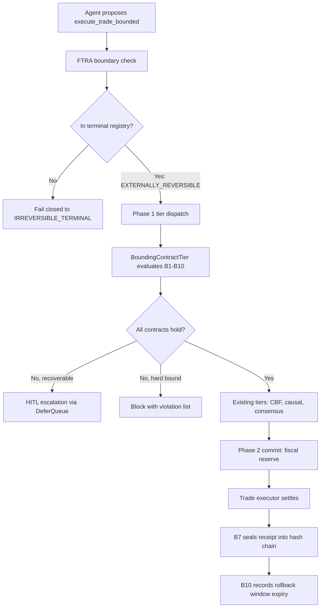

# Master Plan Phase 5 — `execute_trade_bounded` & Bounding Contracts B1–B10

**Status:** ✅ Ratified — implementation approved
**Layer:** Layer 2 (`src/cage_finance/`) with minimal Layer 1 seam additions
**Prerequisites:** Stage 1 complete, Stage 2 Tasks B3/C2 complete
**Related:** [`docs/guides/PLUGIN_DEVELOPMENT.md`](../docs/guides/PLUGIN_DEVELOPMENT.md), [`plans/post_consolidation_roadmap.md`](post_consolidation_roadmap.md)

---

## Contents

1. [Objective & Framing](#1-objective--framing)
2. [Current-State Findings](#2-current-state-findings)
3. [Architecture](#3-architecture)
4. [Bounding Contract Specification (B1–B10)](#4-bounding-contract-specification-b1b10)
5. [File & Module Layout](#5-file--module-layout)
6. [Layer Placement Decisions](#6-layer-placement-decisions)
7. [Configuration Surface](#7-configuration-surface)
8. [Test Strategy](#8-test-strategy)
9. [Compliance Obligations](#9-compliance-obligations)
10. [Implementation Sequencing](#10-implementation-sequencing)
11. [Risks & Open Decisions](#11-risks--open-decisions)

---

## 1. Objective & Framing

Phase 5 introduces a **bounded** trading execution verb that is safe enough to be
classified `EXTERNALLY_REVERSIBLE` rather than `IRREVERSIBLE_TERMINAL`.

The existing verb `execute_trade` is registered in
[`config/ftra/terminal_registry.json`](../config/ftra/terminal_registry.json:11) as
`IRREVERSIBLE_TERMINAL`. Under FTRA that classification forces every reachable plan
into `HITL_REQUIRED` or `BLOCKED`, which is correct but makes autonomous operation
impossible.

The core thesis of Phase 5:

> An action becomes *externally reversible* when the system can prove, **before**
> commitment, that the action falls inside a bounded envelope and that a
> rollback path exists within a known time window.

`execute_trade_bounded` is that proof-carrying verb. Contracts B1–B10 are the
individual proof obligations. If all ten hold, the verb downgrades from
`IRREVERSIBLE_TERMINAL` to `EXTERNALLY_REVERSIBLE`. If **any** fails, the verb
fails closed — either to HITL escalation or outright block.

### Non-goals

- Replacing or deprecating `execute_trade`. Both verbs coexist; `execute_trade`
  remains the unbounded, always-HITL path.
- Live broker integration changes. [`trade_executor.py`](../src/cage_finance/tools/trade_executor.py)
  remains the settlement mechanism.
- Any modification to the CBF Lua script or fence-epoch logic.

---

## 2. Current-State Findings

Findings from reading the existing codebase that constrain the design:

| Finding | Location | Consequence for Phase 5 |
|---|---|---|
| `execute_trade` is `IRREVERSIBLE_TERMINAL` | [`terminal_registry.json:11`](../config/ftra/terminal_registry.json:11) | New verb needs its own registry entry; do not mutate the existing one |
| `release_wire` is already `EXTERNALLY_REVERSIBLE` | [`terminal_registry.json:10`](../config/ftra/terminal_registry.json:10) | Precedent exists; classification is already wired end-to-end |
| `BoundingContractEnforcer` exists but only does whitelists | [`bounding_contract.py:51`](../src/gateway/governance/ftra/bounding_contract.py:51) | Reuse for B4/B9; do **not** overload it with numeric contracts |
| Empty whitelist config is rejected as fail-safe | [`bounding_contract.py:73`](../src/gateway/governance/ftra/bounding_contract.py:73) | B4/B9 inherit this fail-safe automatically |
| Tiers are `(phase, order)` ordered; phase 1 = evaluate, phase 2 = commit | [`fiscal_tier.py:33-39`](../src/cage_finance/tiers/fiscal_tier.py:33) | Bounding contracts belong in **phase 1** (pre-execution) |
| `claims_action` gates tier participation | [`fiscal_tier.py:41`](../src/cage_finance/tiers/fiscal_tier.py:41) | New tier claims only `execute_trade_bounded`, leaving `execute_trade` untouched |
| Fiscal guard already does daily reserve/confirm/release | [`fiscal_tier.py:48-72`](../src/cage_finance/tiers/fiscal_tier.py:48) | B2 must **compose with**, not duplicate, `FiscalLimitGuard` |
| `drawdown.limit = 0.05` already in thresholds | [`governance_thresholds.json:9`](../config/governance_thresholds.json:9) | B2 reads this key rather than inventing a new one |
| `consensus.threshold_usd = 10000.0` already exists | [`governance_thresholds.json:59`](../config/governance_thresholds.json:59) | B6 HITL trigger should align with this, not contradict it |
| `finance_cost_resolver` hardcodes `action_name != "execute_trade"` | [`invariants.py:66`](../src/cage_finance/invariants.py:66) | **Must be updated** or the CBF will assign zero cash cost to bounded trades |
| `TradeOrder` has no venue/counterparty fields | [`trade_order.py:26`](../src/cage_finance/models/trade_order.py:26) | B3/B4/B8 need a richer request model — new model, not a breaking edit |
| Plugin registers tiers in `FinanceCagePlugin.register()` | [`plugin.py:76-80`](../src/cage_finance/plugin.py:76) | Single registration point for the new tier |

### The critical finding

[`finance_cost_resolver`](../src/cage_finance/invariants.py:66) returns `0.0` for
any action that is not literally `execute_trade`. If `execute_trade_bounded` is
added without touching this resolver, **bounded trades will bypass the cash
barrier entirely** — a silent fail-open. This is the single highest-severity
integration risk in Phase 5 and must be addressed in the first implementation
step, not the last.

---

## 3. Architecture

### 3.1 Position in the pipeline



### 3.2 Contract evaluation model

Each contract is a **pure predicate** over a request context plus injected
providers. This is deliberate:

- Pure predicates are trivially unit-testable without Redis or a broker.
- Providers are injected, so market data, portfolio state, and ledger reads are
  mockable.
- The tier is a thin orchestrator that runs all ten and aggregates violations.

```python
@dataclass(frozen=True)
class ContractResult:
    contract_id: str  # "B1" ... "B10"
    passed: bool
    severity: ContractSeverity  # HARD_BLOCK | HITL_ESCALATE | ADVISORY
    message: str
    observed: float | str | None = None
    bound: float | str | None = None
```

### 3.3 Severity model

Not every contract failure should have the same consequence. Three severities:

| Severity | Meaning | Routing |
|---|---|---|
| `HARD_BLOCK` | The bound is a safety invariant. Crossing it is never acceptable. | Immediate `Violation(recoverable=False)` |
| `HITL_ESCALATE` | The bound is a policy threshold. A human may authorise the excess. | `Violation(recoverable=True)` → DeferQueue |
| `ADVISORY` | Informational; recorded in the receipt, does not block. | Logged and sealed, no violation |

Aggregation rule: **the most restrictive failing severity wins**. Any
`HARD_BLOCK` failure short-circuits and prevents downgrade to
`EXTERNALLY_REVERSIBLE`.

### 3.4 Fail-closed posture

Three distinct fail-closed behaviours, all mandatory:

1. **Missing provider data** — if a contract cannot obtain the data it needs
   (e.g. B3 has no order-book snapshot), it fails as `HARD_BLOCK`, never passes.
2. **Non-finite numerics** — `NaN`/`inf` in any observed or bound value fails
   the contract. This mirrors the existing guard in
   [`finance_cost_resolver`](../src/cage_finance/invariants.py:74).
3. **Unknown contract id in config** — if configuration enables a contract id
   the code does not implement, registration raises at startup rather than
   silently skipping.

---

## 4. Bounding Contract Specification (B1–B10)

### B1 — Maximum single-order notional value

| Field | Value |
|---|---|
| **Severity** | `HARD_BLOCK` |
| **Predicate** | `quantity × price ≤ max_single_order_notional_usd` |
| **Threshold key** | `bounding.b1_max_single_order_notional_usd` |
| **Inputs** | `quantity`, `price` from request |
| **Provider** | None (self-contained) |
| **Fail-closed** | Missing or non-finite price → block |

Rationale: this is the primary envelope. Every other contract assumes a finite,
bounded order size.

---

### B2 — Daily drawdown portfolio circuit breaker

| Field | Value |
|---|---|
| **Severity** | `HARD_BLOCK` |
| **Predicate** | `realised_drawdown_today + worst_case_order_loss ≤ drawdown.limit × portfolio_start_value` |
| **Threshold key** | `drawdown.limit` (**existing**, [`governance_thresholds.json:9`](../config/governance_thresholds.json:9)) |
| **Inputs** | Order notional, portfolio state |
| **Provider** | `PortfolioStateProvider.get_daily_drawdown()` |
| **Fail-closed** | Provider error or stale snapshot → block |

Composition note: B2 is a **portfolio-level** breaker. It does not replace
[`FiscalLimitGuard`](../src/cage_finance/tiers/fiscal_tier.py:53), which is a
per-agent daily spend cap. Both apply; they measure different things.

---

### B3 — Liquidity depth ratio verification

| Field | Value |
|---|---|
| **Severity** | `HITL_ESCALATE` |
| **Predicate** | `order_quantity ≤ b3_max_depth_ratio × visible_depth_at_touch` |
| **Threshold key** | `bounding.b3_max_depth_ratio` (default `0.10`) |
| **Inputs** | `quantity`, order-book snapshot |
| **Provider** | `MarketDataProvider.get_depth(symbol, venue)` |
| **Fail-closed** | No snapshot, or snapshot older than `b3_max_snapshot_age_seconds` → block |

Rationale: an order consuming more than 10 % of visible depth will move the
market against itself, invalidating the price assumption B1 and B8 rely on.

---

### B4 — Counterparty risk concentration

| Field | Value |
|---|---|
| **Severity** | `HARD_BLOCK` |
| **Predicate** | Counterparty ∈ allowed set **and** post-trade exposure to that counterparty ≤ `b4_max_counterparty_exposure_pct × portfolio_value` |
| **Threshold key** | `bounding.b4_max_counterparty_exposure_pct` |
| **Reuses** | [`BoundingContractEnforcer.validate_counterparty()`](../src/gateway/governance/ftra/bounding_contract.py:114) |
| **Provider** | `PortfolioStateProvider.get_counterparty_exposure()` |
| **Fail-closed** | Unknown counterparty → block (inherited whitelist semantics) |

---

### B5 — Volatility-adjusted position sizing cap

| Field | Value |
|---|---|
| **Severity** | `HITL_ESCALATE` |
| **Predicate** | `notional × realised_volatility ≤ b5_max_vol_adjusted_exposure_usd` |
| **Threshold key** | `bounding.b5_max_vol_adjusted_exposure_usd` |
| **Inputs** | Notional, trailing realised volatility |
| **Provider** | `MarketDataProvider.get_realised_volatility(symbol, window)` |
| **Fail-closed** | Missing volatility series → block |

Note the interaction with the existing causal slope guard in
[`causal/gatekeeper.py`](../src/gateway/governance/causal/gatekeeper.py): B5 is a
*static* volatility bound, the causal gate is a *learned* risk model. They are
complementary and both must pass.

---

### B6 — Mandatory HITL escalation for high-impact deltas

| Field | Value |
|---|---|
| **Severity** | `HITL_ESCALATE` (by construction — this contract never hard-blocks) |
| **Predicate** | `notional ≤ consensus.threshold_usd` |
| **Threshold key** | `consensus.threshold_usd` (**existing**, [`governance_thresholds.json:59`](../config/governance_thresholds.json:59)) |
| **Provider** | None |
| **Routing** | Emits `Violation(recoverable=True)`, which the kernel routes to the DeferQueue |

Design decision: B6 deliberately reuses the **existing** consensus threshold
rather than inventing a parallel number. Two thresholds meaning "a human should
look at this" would inevitably drift apart.

---

### B7 — Audit trail cryptographic hash chain sealing

| Field | Value |
|---|---|
| **Severity** | `HARD_BLOCK` |
| **Predicate** | A provenance chain entry can be created and signed for this request |
| **Reuses** | [`provenance_chain.py`](../src/gateway/governance/provenance_chain.py), [`kms_signer.py`](../src/gateway/governance/kms_signer.py), [`jcs_canonicalizer.py`](../src/gateway/governance/jcs_canonicalizer.py) |
| **Fail-closed** | Signing unavailable → block (do not execute an unauditable trade) |

B7 is unusual: it is a **capability** check at evaluate time and a **commit**
action at seal time. The tier therefore checks signer availability in phase 1
and performs the actual seal in phase 2 commit.

---

### B8 — TWAP slippage bound

| Field | Value |
|---|---|
| **Severity** | `HITL_ESCALATE` |
| **Predicate** | `abs(limit_price − twap_reference) / twap_reference ≤ b8_max_slippage_bps / 10_000` |
| **Threshold key** | `bounding.b8_max_slippage_bps` (default `50`) |
| **Provider** | `MarketDataProvider.get_twap(symbol, window)` |
| **Fail-closed** | No TWAP reference → block |

---

### B9 — Regional regulatory jurisdiction filter

| Field | Value |
|---|---|
| **Severity** | `HARD_BLOCK` |
| **Predicate** | `(symbol, venue)` permitted under the active `CAGE_DEPLOYMENT_REGION` overlay |
| **Config source** | [`src/cage_finance/config/compliance/{US_FED,EU_ECB,APAC_MAS}_OVERLAY.json`](../src/cage_finance/config/compliance/) |
| **Reuses** | [`BoundingContractEnforcer.validate_instrument()`](../src/gateway/governance/ftra/bounding_contract.py:86) and `validate_venue()` |
| **Fail-closed** | Unrecognised region → block |

B9 is the contract that makes the Phase 5 verb regionally composable, and it is
the one that must appear in the [`REGIONAL_POSTURE_VALIDATION_REPORT`](../docs/compliance/REGIONAL_POSTURE_VALIDATION_REPORT.md)
matrix once implemented.

---

### B10 — Rollback window validation

| Field | Value |
|---|---|
| **Severity** | `HARD_BLOCK` |
| **Predicate** | A cancel/unwind path exists **and** `now + b10_min_rollback_window_seconds ≤ settlement_deadline` |
| **Threshold key** | `bounding.b10_min_rollback_window_seconds` |
| **Provider** | `SettlementProvider.get_settlement_deadline(venue, symbol)` |
| **Fail-closed** | Unknown settlement deadline → block |

**B10 is the contract that justifies the `EXTERNALLY_REVERSIBLE` classification.**
Without a provable rollback window the action is, by definition,
`IRREVERSIBLE_TERMINAL`. If B10 fails, the verb must not merely be blocked — it
must be re-classified upward for that request.

---

### Summary table

| ID | Contract | Severity | New threshold? | Provider |
|---|---|---|---|---|
| B1 | Max single-order notional | `HARD_BLOCK` | Yes | — |
| B2 | Daily drawdown breaker | `HARD_BLOCK` | No (`drawdown.limit`) | Portfolio |
| B3 | Liquidity depth ratio | `HITL_ESCALATE` | Yes | Market data |
| B4 | Counterparty concentration | `HARD_BLOCK` | Yes | Portfolio |
| B5 | Volatility-adjusted sizing | `HITL_ESCALATE` | Yes | Market data |
| B6 | High-impact HITL trigger | `HITL_ESCALATE` | No (`consensus.threshold_usd`) | — |
| B7 | Hash chain sealing | `HARD_BLOCK` | No | KMS / provenance |
| B8 | TWAP slippage bound | `HITL_ESCALATE` | Yes | Market data |
| B9 | Jurisdiction filter | `HARD_BLOCK` | No (overlays) | Region overlay |
| B10 | Rollback window | `HARD_BLOCK` | Yes | Settlement |

Six `HARD_BLOCK`, four `HITL_ESCALATE`, zero `ADVISORY` in the initial set.
`ADVISORY` exists in the model for future contracts.

---

## 5. File & Module Layout

### New files — Layer 2 (`src/cage_finance/`)

```text
src/cage_finance/
├── safety/
│   └── bounding/
│       ├── __init__.py
│       ├── models.py          # BoundedTradeRequest, ContractResult, ContractSeverity
│       ├── contracts.py       # B1–B10 predicate implementations
│       ├── registry.py        # Contract id → implementation map, config-driven enable
│       └── providers.py       # MarketDataProvider, PortfolioStateProvider,
│                              # SettlementProvider protocols + stub impls
├── tiers/
│   └── bounding_tier.py       # BoundingContractTier (phase 1, order 3)
├── tools/
│   └── bounded_execution.py   # execute_trade_bounded verb
└── opa/
    └── bounding_contracts.rego
```

### Modified files

| File | Change | Risk |
|---|---|---|
| [`src/cage_finance/invariants.py`](../src/cage_finance/invariants.py:66) | `finance_cost_resolver` must accept both trade verbs | **High** — silent fail-open if missed |
| [`src/cage_finance/plugin.py`](../src/cage_finance/plugin.py:76) | Register `BoundingContractTier` | Low |
| [`config/ftra/terminal_registry.json`](../config/ftra/terminal_registry.json) | Add `execute_trade_bounded: EXTERNALLY_REVERSIBLE` | Medium — registry is signed |
| [`config/governance_thresholds.json`](../config/governance_thresholds.json) | Add `bounding.*` block | Low |
| `src/cage_finance/config/compliance/*_OVERLAY.json` | Add per-region instrument/venue lists for B9 | Low |

### New test files

```text
tests/cage_finance/
├── test_bounding_contracts.py       # B1–B10 unit tests, one class per contract
├── test_bounding_tier.py            # Tier orchestration, severity aggregation
├── test_bounded_execution.py        # Verb end-to-end with mocked providers
└── test_bounding_regional.py        # B9 across US_FED / EU_ECB / APAC_MAS
```

---

## 6. Layer Placement Decisions

Applying the decision test from [`AGENTS.md`](../AGENTS.md):
*"If two domains had different copies of this, would a security fix have to be
applied twice?"*

| Component | Layer | Justification |
|---|---|---|
| B1–B10 predicates | **Layer 2** | Every bound names a finance concept (notional, TWAP, counterparty). Healthcare would need entirely different contracts, not copies of these. |
| `ContractResult`, `ContractSeverity` | **Layer 2 initially** | Generic in shape, but promoting to Layer 1 before a second domain needs it would be speculative. Revisit when a third plugin lands. |
| Severity aggregation logic | **Layer 2** | Small and local. If a second domain implements the same aggregation, promote then. |
| `BoundingContractEnforcer` reuse | **Layer 1 (existing)** | Already domain-neutral whitelist logic; B4/B9 consume it unchanged. |
| Provenance sealing (B7) | **Layer 1 (existing)** | Cryptographic sealing is a kernel concern; B7 only *invokes* it. |
| FTRA classification | **Layer 1 (existing)** | Registry-driven; Phase 5 only adds a data row. |

**Explicit anti-goal:** no new imports from `src/cage_finance/` into
`src/gateway/`. Gate G3 must remain green throughout.

---

## 7. Configuration Surface

New `bounding` block in [`config/governance_thresholds.json`](../config/governance_thresholds.json):

```json
{
  "bounding": {
    "enabled_contracts": ["B1","B2","B3","B4","B5","B6","B7","B8","B9","B10"],
    "b1_max_single_order_notional_usd": 250000.0,
    "b3_max_depth_ratio": 0.10,
    "b3_max_snapshot_age_seconds": 5,
    "b4_max_counterparty_exposure_pct": 0.25,
    "b5_max_vol_adjusted_exposure_usd": 100000.0,
    "b8_max_slippage_bps": 50,
    "b10_min_rollback_window_seconds": 300
  }
}
```

Reused keys, deliberately **not** duplicated:

- `drawdown.limit` → B2
- `consensus.threshold_usd` → B6

Environment overrides follow the existing convention documented at
[`governance_thresholds.json:4`](../config/governance_thresholds.json:4)
(`bounding.b1_max_single_order_notional_usd` → `BOUNDING_B1_MAX_SINGLE_ORDER_NOTIONAL_USD`).

`enabled_contracts` semantics: an id present in the list but absent from the
registry raises at startup. An id in the registry but absent from the list is
**skipped with a WARN log** — this permits staged rollout without code changes,
but never silently.

---

## 8. Test Strategy

### 8.1 Per-contract unit tests

One test class per contract, each covering four cases at minimum:

1. **Pass** — comfortably inside the bound.
2. **Boundary** — exactly at the bound (must define inclusive/exclusive explicitly).
3. **Fail** — outside the bound, asserting correct `severity`.
4. **Fail-closed** — provider raises or returns `None`, asserting `HARD_BLOCK`.

Plus, for every numeric contract, a `NaN`/`inf` rejection test mirroring the
existing guard in [`invariants.py:74`](../src/cage_finance/invariants.py:74).

### 8.2 Tier orchestration tests

- All ten pass → zero violations, classification stays `EXTERNALLY_REVERSIBLE`.
- One `HITL_ESCALATE` fails → single `Violation(recoverable=True)`.
- One `HARD_BLOCK` fails → `Violation(recoverable=False)`, short-circuits.
- Mixed failures → most restrictive severity wins.
- `claims_action("execute_trade")` returns `False` (the unbounded verb is untouched).

### 8.3 The regression test that matters most

A dedicated test asserting `finance_cost_resolver("execute_trade_bounded", ...)`
returns the correct non-zero cash cost. This is the guard against the silent
fail-open identified in [§2](#the-critical-finding).

### 8.4 Regional matrix

B9 parameterised across `US_FED`, `EU_ECB`, `APAC_MAS`, following the pattern
already established in [`test_pr_b_regional_posture.py`](../tests/test_pr_b_regional_posture.py:41).

### 8.5 Gate commands

```bash
uv run pytest tests/cage_finance/ -m "local or unit" -n auto --dist loadscope --no-cov -p no:langsmith
uv run python scripts/check_import_boundaries.py --verbose
uv run python scripts/check_domain_literals.py
uv run python scripts/check_stpa_freshness.py
opa test config/opa/ -v
```

---

## 9. Compliance Obligations

Triggered by the change surface, per [`AGENTS.md`](../AGENTS.md):

| Obligation | Trigger | Action |
|---|---|---|
| **STPA regeneration** | New action verb changes the control structure | `uv run python scripts/check_stpa_freshness.py --regenerate` |
| **Terminal registry signing** | Registry is KMS/JCS signed | Re-sign after adding the `execute_trade_bounded` row |
| **OSCAL component update** | B7 touches AU-family controls | Update `compliance/oscal/` within 2 business days of merge |
| **Lula validation** | No new K8s resources | None required |
| **NeMo configmap** | Only if `config/rails/actions.py` changes | `make update-nemo-configmap` if touched |
| **Regional posture report** | B9 adds region-dependent behaviour | Extend [`REGIONAL_POSTURE_VALIDATION_REPORT.md`](../docs/compliance/REGIONAL_POSTURE_VALIDATION_REPORT.md) matrix |

---

## 10. Implementation Sequencing

Ordered so that the highest-risk integration lands first and every step is
independently testable.

| Step | Deliverable | Rationale |
|---|---|---|
| **1** | Fix `finance_cost_resolver` to handle both verbs + regression test | Closes the silent fail-open before any new code depends on it |
| **2** | `bounding/models.py` — request model, `ContractResult`, `ContractSeverity` | Everything else types against these |
| **3** | `bounding/providers.py` — provider protocols + deterministic stubs | Enables hermetic tests for steps 4–5 |
| **4** | `bounding/contracts.py` — B1, B2, B6 (self-contained / existing thresholds) | Fastest path to a working vertical slice |
| **5** | `bounding/contracts.py` — B3, B5, B8 (market-data dependent) | Shared provider, natural grouping |
| **6** | `bounding/contracts.py` — B4, B9 (reuse `BoundingContractEnforcer`) | Shared reuse pattern |
| **7** | `bounding/contracts.py` — B7, B10 (kernel-service dependent) | Highest coupling, lands last |
| **8** | `bounding/registry.py` + config block | Wires contracts to configuration |
| **9** | `tiers/bounding_tier.py` + plugin registration | Integrates into the dispatch loop |
| **10** | `tools/bounded_execution.py` — the verb itself | Depends on all of the above |
| **11** | Terminal registry row + re-sign | Activates `EXTERNALLY_REVERSIBLE` classification |
| **12** | `opa/bounding_contracts.rego` + policy tests | Defence in depth alongside the Python tier |
| **13** | STPA regeneration, OSCAL update, regional report extension | Compliance closure |

Suggested commit boundaries: steps 1, 2–3, 4–7, 8–9, 10–11, 12, 13. Seven
commits, each independently green.

Branch: `feat/bounded-trade-execution`. Squash merge only.

---

## 11. Risks & Open Decisions

### Risks

| Risk | Likelihood | Impact | Mitigation |
|---|---|---|---|
| `finance_cost_resolver` not updated → CBF bypass | **High** | **Critical** | Step 1 of sequencing; dedicated regression test |
| Terminal registry signature invalidated | Medium | High | Re-sign in the same commit as the data change |
| B2 double-counts against `FiscalLimitGuard` | Medium | Medium | Explicit test asserting they measure different quantities |
| Provider stubs mistaken for production impls | Medium | High | Name them `Stub*`, fail-closed when `CAGE_ENV=production` |
| Contract count inflates hot-path latency | Low | Medium | Contracts are pure predicates; measure in step 9, budget < 5 ms total |
| G3 boundary violation via provider imports | Low | High | Providers live in Layer 2; CI gate catches |

### Open decisions requiring sign-off

1. **Boundary inclusivity** — is a trade exactly at `b1_max_single_order_notional_usd`
   permitted? Recommendation: **inclusive** (`≤`), matching the CBF's
   `h(x) ≥ 0` convention.
2. **B10 re-classification** — on B10 failure, should the request be blocked, or
   re-classified to `IRREVERSIBLE_TERMINAL` and routed to HITL? Recommendation:
   **re-classify**, since that is the semantically honest outcome and preserves
   the human's ability to authorise.
3. **Stub providers in production** — should `Stub*` providers hard-fail when
   `CAGE_ENV=production`? Recommendation: **yes**, consistent with the
   fail-closed posture elsewhere in the kernel.
4. **`enabled_contracts` default** — ship with all ten enabled, or a conservative
   subset? Recommendation: **all ten**, since a partially-bounded verb should not
   carry the `EXTERNALLY_REVERSIBLE` classification.
5. **OPA vs Python duplication** — B1–B10 in Rego duplicates the Python tier.
   Recommendation: implement Rego as **defence in depth** for the `HARD_BLOCK`
   contracts only (B1, B2, B4, B7, B9, B10), not all ten.

---

---

## 12. Ratified Decisions

All five open decisions were reviewed and **approved**. They are now binding on
implementation.

| # | Decision | Ruling | Rationale |
|---|---|---|---|
| 1 | Boundary inclusivity | **Inclusive (`≤`)** | Aligns with CBF closed-set safety semantics (`h(x) ≥ 0`) |
| 2 | B10 failure behaviour | **Re-classify to `IRREVERSIBLE_TERMINAL`** | An unverified rollback window is semantically irreversible; routes to mandatory HITL rather than silent block |
| 3 | Stub providers in production | **Hard-fail when `CAGE_ENV=production`** | Prevents mock leakage into a live deployment |
| 4 | `enabled_contracts` default | **All ten enabled** | A partially-bounded verb must not carry the `EXTERNALLY_REVERSIBLE` classification |
| 5 | Rego mirroring scope | **Six `HARD_BLOCK` contracts only** (B1, B2, B4, B7, B9, B10) | Stateful computations (TWAP, depth, hash chain) stay in Python; Rego provides defence-in-depth for the hard bounds |

### Consequences for implementation

- **Decision 2** adds a re-classification path to Step 7. B10 must return a
  signal the tier can translate into a classification override, not merely a
  `HARD_BLOCK` violation. This is the one place where a contract result
  influences FTRA classification rather than just admission.
- **Decision 3** means `providers.py` (Step 3) must read `CAGE_ENV` and raise at
  construction time, mirroring the production guards already present in
  [`cbf_engine.py:62`](../src/gateway/governance/safety/cbf_engine.py:62).
- **Decision 5** reduces Step 12 scope from ten Rego rules to six.

---

**Document status:** ✅ Ratified — implementation approved, begin at Step 1.
