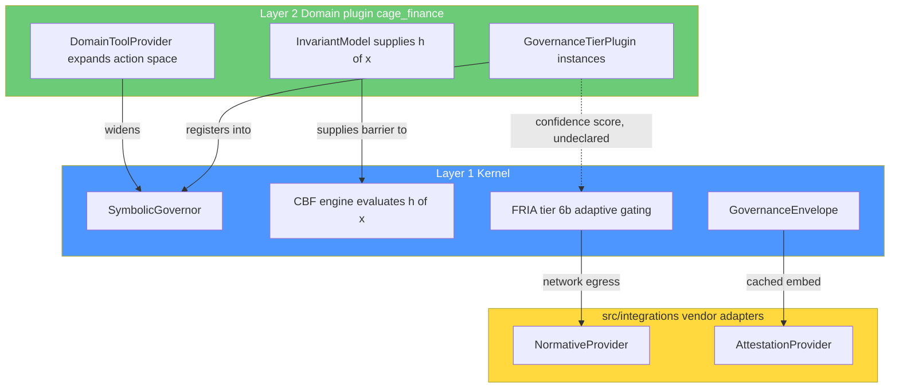

# Plugin Seam Orthogonality Analysis

> **Reference Architecture Note (per [`AGENTS.md`](../AGENTS.md)).**
> CAGE is a deployable reference architecture. This document is an
> **architectural assessment** of two extension-seam families and an
> illustrative set of guardrails an adopter would apply when introducing
> domain capability plugins alongside vendor adapters. It prescribes no code
> changes; it is input to the CAGE Layered Refactoring plan (v2).

**Question.** Do the proposed plugin protocols (`InvariantModel`,
`DomainToolProvider`, `GovernanceTierPlugin`) overlap or conflict with the
existing vendor adapter seams (`NormativeProvider`, `AttestationProvider`)?

**Answer in one line.** They are **orthogonal**, not competing — but they are
*adjacent*, and the refactoring plan does not yet state the boundary. Four
concrete coupling defects must be closed before PR 3.

---

## Table of Contents

1. [Sources Examined](#1-sources-examined)
2. [Seam Inventory](#2-seam-inventory)
3. [Separation of Concerns Verdict](#3-separation-of-concerns-verdict)
4. [Cross-Cutting Findings](#4-cross-cutting-findings)
5. [Reference Architecture Alignment](#5-reference-architecture-alignment)
6. [Architectural Verdict](#6-architectural-verdict)
7. [Recommended Amendments to the Refactoring Plan](#7-recommended-amendments-to-the-refactoring-plan)

---

## 1. Sources Examined

| Artifact | What it established |
|---|---|
| [`normative_provider.py`](../src/gateway/governance/normative_provider.py) | `NormativeProvider` protocol, adaptive gating, daemon lifecycle, env-var factory |
| [`attestation_provider.py`](../src/gateway/governance/attestation_provider.py) | `AttestationProvider` ABC, aggregator registration |
| [`contracts.py`](../src/gateway/governance/contracts.py) | `SafetyFilter`, `ConsensusProvider`, `FiscalGuard`, `GovernanceTierFailure`, `RefusalReceipt` |
| [`symbolic_governor.py:1405`](../src/gateway/governance/symbolic_governor.py:1405) | FRIA tier 6b call site and its trigger predicate |
| [`cbf.py:1063`](../src/gateway/governance/cbf.py:1063) | `get_h()` — the barrier the `InvariantModel` protocol generalizes |
| [`integrations/__init__.py`](../src/integrations/__init__.py) | Vendor isolation rule and onboarding procedure |
| Secure Plugin & Adapter Architecture Specification §5.1–§5.6 | Domain-agnostic kernel, vendor boundary, hot-path guarantee, TOCTOU rule |
| CAGE Layered Refactoring plan v2 §1.2–§1.3, §3.2 | Proposed `CagePlugin`, `GovernanceTierPlugin`, `InvariantModel`, `DomainToolProvider` |

---

## 2. Seam Inventory

### 2.1 `NormativeProvider` — external normative authority (egress)

- **Primary purpose.** Obtain *externally authored* regulatory ground truth and
  externally sealed attestation. The extension point answers **"who tells us
  what the rules are, and who countersigns that we followed them?"**
- **Lifecycle.** Three distinct phases: boot-time `fetch_baseline()` with a
  4-level fallback chain, background polling every N hours
  ([`NormativeProviderDaemon`](../src/gateway/governance/normative_provider.py:656)),
  and per-transaction `validate_fria()` invoked at **tier 6b**, after every
  local Phase-1 tier and *before* Phase 2 atomic mutations.
- **Contract surface.** Three async methods —
  `fetch_baseline(region) -> NormativeBaseline`,
  `validate_fria(payload) -> ValidationResult`,
  `submit_evidence(thread_id, evidence_hash) -> EvidenceSeal`.
- **Integration point.** `get_normative_provider()` factory
  ([line 886](../src/gateway/governance/normative_provider.py:886)), selected by
  `CAGE_NORMATIVE_PROVIDER`, lazy-importing from `src/integrations/`.
  **Cardinality: exactly one active instance.**
- **Latency class.** External SaaS, >100 ms. Never allowed to block the hot
  path unconditionally — that is precisely why `enforce_fria_boundary()` exists.

### 2.2 `AttestationProvider` — evidence enrichment (egress, async only)

- **Primary purpose.** Supply cached third-party attestation records for
  embedding into `GovernanceEnvelope.external_attestations[]`.
- **Lifecycle.** Boot + poll, cached in memory. **Zero per-transaction network
  calls** by construction.
- **Contract surface.** `fetch_attestations(context) -> list[ExternalAttestation]`
  plus a `provider_name` property. Note it is an `abc.ABC` (nominal typing),
  unlike `NormativeProvider` (PEP 544 structural) — an existing inconsistency.
- **Integration point.** `AttestationAggregator.register()`.
  **Cardinality: N registered providers, aggregated.**

### 2.3 `GovernanceTierPlugin` — domain governance semantics (in-process upcall)

- **Primary purpose.** Let a domain declare *additional constraint tiers* the
  kernel executes. Answers **"what else must be true before this action may
  form, given what this domain means?"**
- **Lifecycle.** Registered once at process start via `CagePlugin.register()`;
  invoked synchronously on **every governed action** in `_run_checks`, split
  across Phase 1 (`evaluate`) and Phase 2 (`commit`/`rollback`).
- **Contract surface.** `tier_name`, `phase`, `order`, `claims_action()`,
  `evaluate()`, `commit()`, `rollback()`.
- **Integration point.** `SymbolicGovernor.register_domain_tier()`.
- **Latency class.** Sub-millisecond, in-process, trusted first-party code.

### 2.4 `InvariantModel` — domain state-space translation

- **Primary purpose.** Supply the domain's `h(x)` so the kernel can evaluate
  `h(x) >= 0` without knowing what `x` means. This is the exact seam the
  architecture specification §5.1 already describes in prose.
- **Contract surface.** `state_keys()`, `barrier_value(state)`, `gamma`.
- **Integration point.** The CBF engine, generalizing
  [`get_h()`](../src/gateway/governance/cbf.py:1063).
- **Latency class.** Innermost hot path — currently executed *inside a Redis
  Lua script* for atomicity (§5.4).

### 2.5 `DomainToolProvider` — action-space expansion

- **Primary purpose.** Register domain MCP tools. This is **not a governance
  seam** — it is the only seam in the set that *widens* the action space rather
  than constraining it.
- **Lifecycle.** Startup only, once, during MCP lifespan.
- **Integration point.** FastMCP `@mcp.tool()` registry.

---

## 3. Separation of Concerns Verdict

The two families differ on **every** axis that matters for seam design:

| Axis | Vendor adapter seams | Domain plugin seams |
|---|---|---|
| Question answered | Who is the external authority? | What does this domain mean? |
| Trust posture | Untrusted, out-of-process, network | First-party, in-process, trusted |
| Data direction | Kernel calls **outward** | Kernel calls **inward** into domain semantics |
| Rule provenance | Externally authored | Locally authored |
| Latency budget | >100 ms; hot path forbidden | sub-ms; hot path mandatory |
| Discovery | Explicit factory + env var | `cage.plugins` entry points |
| Cardinality | 1 normative, N attestation | N plugins × M tiers |
| Isolation motive | Supply-chain / vendor risk | Kernel domain-agnosticism |
| Deployment unit | Sidecar / UDS / remote SaaS | Same wheel, same process |
| Spec section | §5.2 Vendor-Isolated Boundary | §5.1 Domain-Agnostic Kernel |

**Classification: orthogonal seams, with a narrow layered relationship.**

They are not competing — no adopter would face a genuine "should this be a
`NormativeProvider` or a `GovernanceTierPlugin`?" decision, because the
answer is fully determined by *where the code runs and who wrote the rule*.

The one layered edge is real and must be named: the **FRIA tier is a kernel
tier that consumes the output of a plugin tier**. Consensus (order 5) becomes
plugin-provided; FRIA (universal) reads the confidence score it produced. That
is a Layer 1 → Layer 2 *data* dependency even though no import crosses the
boundary. See [F3](#f3-high--fria-depends-on-a-plugin-supplied-consensus-score).



The dotted edge is the only crossing that is currently undocumented — and it
is the one the refactoring plan must address.

---

## 4. Cross-Cutting Findings

### F1 (High) — `provider_06` proves one adapter already spans both concerns

[`Provider06AgentIntegrityAdapter`](../src/integrations/provider_06/adapter.py:178)
is registered as a `NormativeProvider`, but its actual subject matter is **agent
integrity verification** — a governance semantic, not a regulatory baseline. It
implements `fetch_baseline()` and `submit_evidence()` largely to satisfy the
3-method contract.

This is the "Fat Interface" anti-pattern the architecture specification §4
explicitly warns against, already present in the codebase. It demonstrates the
answer to *"can a single vendor adapter reasonably implement both seams?"*:

> **Yes — and one already does, by flattening a governance concern into the
> normative contract because no domain-tier seam existed.**

Once `GovernanceTierPlugin` exists, a vendor could legitimately want to supply
a *governance tier* rather than a *normative baseline*. The plan must state
whether that is permitted.

**Recommendation: prohibit it, explicitly.** A vendor-supplied
`GovernanceTierPlugin` would place untrusted third-party code in-process on the
sub-millisecond hot path with `commit()`/`rollback()` authority over Redis
state — violating specification §2.1 (no dynamic native in-process imports),
§3.2 (hot-path decoupling), and §5.4 (TOCTOU/atomic state). The correct pattern
for a vendor that wants tier-like influence is a first-party thin
`GovernanceTierPlugin` in `src/cage_finance/` (or a future `cage_<domain>`) that
*delegates* to the vendor across the existing `NormativeProvider` seam.

### F2 (High) — `CagePlugin.register()` receives the concrete `SymbolicGovernor`

The proposed contract (plan §1.2.4) is:

```python
def register(
    self, governor: "SymbolicGovernor", tool_server: "FastMCP | None" = None
) -> None: ...
```

The docstring says a plugin "must never import from `gateway.*` internals
beyond the public `contracts` module" — but the signature hands the plugin the
entire concrete governor object, including `self.consensus_engine`,
`self.cbf`, the Redis client, and every private method. The stated invariant is
unenforceable by the type system and unenforceable by the grep-based import
check in plan §E.3, because no import statement is required to reach any of it.

Contrast with the vendor seams, which are **narrow by construction**: a
`NormativeProvider` receives only a `dict` payload and returns a dataclass. It
cannot reach into kernel state even if it wanted to.

**Recommendation.** Define a narrow registration facade in `contracts.py` and
type `register()` against it:

```python
@runtime_checkable
class TierRegistry(Protocol):
    """The only kernel surface a capability plugin may touch at registration."""

    def register_domain_tier(self, tier: "GovernanceTierPlugin") -> None: ...
    def register_invariant(self, model: "InvariantModel") -> None: ...


def register(
    self, registry: TierRegistry, tool_server: "ToolRegistrar | None" = None
) -> None: ...
```

`SymbolicGovernor` satisfies `TierRegistry` structurally, so the runtime wiring
is unchanged — but the plugin's declared capability surface is now exactly two
methods, and `mypy` enforces it.

### F3 (High) — FRIA depends on a plugin-supplied consensus score

At [`symbolic_governor.py:1428`](../src/gateway/governance/symbolic_governor.py:1428)
the FRIA tier reads `params.get("confidence", 0.0)` and routes on it:

- `>= 0.95` → ALLOW, async attestation
- `[0.70, 0.95)` → DEFER, synchronous blocking gate
- `< 0.70` → **DENY, hard local abort**

After PR 3, the Consensus tier (order 5) that produces that confidence becomes
plugin-supplied. The failure mode is severe and inverted from the usual one:

> If the finance plugin is absent or its `ConsensusTier` does not populate
> `confidence`, the default `0.0` drives FRIA into `LOCAL_HARD_DENY` for every
> action.

In bare-kernel mode this is *fail-closed*, which is acceptable — but it means a
packaging regression manifests as total denial of service rather than as the
silent fail-open described in plan §C.1. Both failure modes deserve a test.

Worse, the tier-6b trigger predicate is `tool_name == "execute_trade"` — a
hardcoded financial action name **inside the kernel**. PR 3 removes financial
coupling from every other tier but the plan does not list this line. Left
as-is, the kernel retains a finance-specific literal that silently disables
external normative validation for every non-financial action.

**Recommendation.** Add to PR 3 scope:
1. Replace the `execute_trade` literal with a capability query — e.g. FRIA runs
   when any registered tier `claims_action(action, params)`, or when the action
   is annotated as consequence-bearing.
2. Make the confidence contract explicit: define who is responsible for
   populating `params["confidence"]` and what the kernel does when no tier does.
   Absent-versus-zero must be distinguished, exactly as
   `CAGE_ACTIVE_PLUGINS` unset-versus-empty is in plan §1.2.2.
3. Add a test asserting bare-kernel FRIA behavior is intentional, not incidental.

### F4 (Medium) — `InvariantModel` cannot express the current CBF

The proposed protocol is a pure function:

```python
def barrier_value(self, state: dict[str, float]) -> float: ...
```

The real barrier is not evaluated in Python. Per specification §5.4 and
[`cbf.py`](../src/gateway/governance/cbf.py), the check `h_next >= (1-gamma)*h_t`
is executed **inside a Redis Lua script** (`LUA_ATOMIC_CBF`) precisely to close
the TOCTOU window, together with fence-epoch validation and ground-truth
reconciliation. A Python-callable `barrier_value()` cannot participate in that
atomic hop.

If a plugin's `InvariantModel` is evaluated in Python before the Lua call, the
TOCTOU window that CAGE closed is reopened — a regression of a formally
modelled property ([`proof/DistributedCBF.tla`](../proof/DistributedCBF.tla)).

**Recommendation.** Constrain `InvariantModel` to be **declarative, not
executable**: the plugin declares the barrier's *shape* (state keys, the
threshold key, gamma), and the kernel compiles that declaration into the Lua
script it already owns. Concretely, prefer a parameter-supplying protocol over
a callback protocol:

```python
class InvariantModel(Protocol):
    """Declarative affine barrier: h(x) = state[value_key] - threshold."""

    @property
    def invariant_id(self) -> str: ...
    @property
    def value_key(self) -> str: ...  # e.g. "cash"
    @property
    def threshold_key(self) -> str: ...  # e.g. "min_cash_balance"
    @property
    def gamma(self) -> float: ...
```

If a domain genuinely needs a non-affine barrier, that is a kernel change with
a formal-proof update — not a plugin extension point. State this explicitly so
adopters do not read `InvariantModel` as an invitation to run arbitrary Python
inside the atomic path.

### F5 (Medium) — no shared receipt vocabulary across the two families

Both families produce refusal evidence, in **three incompatible shapes**:

| Producer | Shape | Vocabulary |
|---|---|---|
| `NormativeProvider` | `ValidationResult.findings: list[dict]` | `FindingStatus` (OSCAL 4-state) |
| Kernel tiers | `GovernanceTierFailure` (frozen dataclass) | `GovernanceControl` IDs |
| Proposed `GovernanceTierPlugin` | `list[Violation]` | undefined in the plan |

`Violation` is referenced throughout plan §1.2.1–§1.2.3 (with fields `tier`,
`code`, `message`, `recoverable`, `needs_human_review`) but is **never
defined**, and it does not exist in [`contracts.py`](../src/gateway/governance/contracts.py)
today. This is the same class of omission as defect D7 (`CagePlugin` referenced
but undefined) and should be tracked as **D8**.

Specification §5.5 requires adapter outputs to map into the OSCAL four-state
vocabulary, and §5.6 requires all denials to be bound to a `RefusalReceipt`.
A third parallel violation type risks plugin denials that never reach the
receipt chain — a compliance-evidence gap, not just an aesthetic one.

**Recommendation.** Either define `Violation` as a thin, documented projection
onto the existing `GovernanceTierFailure`, or have `GovernanceTierPlugin.evaluate()`
return `list[GovernanceTierFailure]` directly. Add a test asserting every
plugin-tier denial produces a `RefusalReceipt` with a populated `tier_failures`
tuple.

### F6 (Low) — protocol style is inconsistent across seams

`NormativeProvider` is a structural `Protocol`; `AttestationProvider` is a
nominal `abc.ABC`; the proposed plugin protocols are structural and one is
`@runtime_checkable`. Note also that `@runtime_checkable` on `CagePlugin`
validates **method presence only** — it does not check the `name: str` and
`api_version: str` data attributes, which is why the explicit
`validate_plugin()` guard in plan §1.2.4 is load-bearing and must not be
removed as redundant.

**Recommendation.** Adopt one rule — structural `Protocol` for all seams,
`@runtime_checkable` only where a fail-closed guard actually inspects it — and
record it in the plugin architecture document.

### F7 (Informational) — circular dependency risk is low

No import cycle is created. `cage_finance` imports `gateway.governance.contracts`;
`gateway` imports nothing from `cage_finance` (enforced by plan §E.3). Vendor
adapters are lazy-loaded through a factory in the kernel. The one soft coupling
is F3's data dependency, which is a runtime contract, not an import cycle.

One caveat: [`contracts.py:390`](../src/gateway/governance/contracts.py:390)
currently does a `try/except ImportError` import of `ReservationToken` from
`fiscal_limit_guard`. PR 3 moves that module to `cage_finance` — which would
make the **kernel's contracts module import Layer 2**, directly violating the
dependency rule and defeating the grep gate (the import is inside a `try`, but
grep matches it). `ReservationToken` must be relocated into `contracts.py` or a
kernel-side types module, not left as a cross-layer import. Add this to PR 3's
file list.

---

## 5. Reference Architecture Alignment

The specification already contains both principles — they are simply in
different sections, and nobody has previously stated that they are different
sections *on purpose*.

| Spec section | Principle | Which seam it governs |
|---|---|---|
| §5.1 Domain-Agnostic Kernel | Kernel evaluates `h(x) >= 0`; adapters "provide domain-specific translations (cash balance, drug concentration, actuator torque)" | **Domain plugin seams** — a verbatim description of `InvariantModel` |
| §5.2 Vendor-Isolated Boundary | Third-party providers live under `src/integrations/{vendor}/`, lazy-loaded, never imported by the kernel | **Vendor adapter seams** |
| §2.1 Isolation Strategies | Untrusted adapters run out-of-process (Wasm / UDS / gRPC) | Vendor only — domain plugins are first-party in-process |
| §3.2 Hot-Path Decoupling | Never place synchronous remote calls on the critical path | Why `NormativeProvider` needs adaptive gating and `GovernanceTierPlugin` does not |
| §5.4 TOCTOU Resolution | Atomic state transitions via Redis Lua | Constrains `InvariantModel` (see [F4](#f4-medium--invariantmodel-cannot-express-the-current-cbf)) |
| §5.5 Four-State Semantics | Adapter failures emit `ERROR`, never `NOT_APPLICABLE` | Should extend to plugin tiers (see [F5](#f5-medium--no-shared-receipt-vocabulary-across-the-two-families)) |
| §5.6 Cryptographic Evidence | All denials bound to a `RefusalReceipt`, JCS-canonicalized | Currently kernel-only; must cover plugin denials |

**Conclusion.** The specification *anticipates* both seam families. §5.1 is
literally the `InvariantModel` charter. The dual-seam design is therefore not a
new invention needing justification — it is the realization of a principle
already approved. What is missing is a single sentence naming the boundary, and
the guardrails in [§7](#7-recommended-amendments-to-the-refactoring-plan) that
stop the two families from bleeding into each other.

**Should domain plugins and vendor adapters be separate architectural concerns?
Yes — and the strongest argument is the trust boundary.** Merging them would
force one of two unacceptable outcomes: either vendor code gains in-process
hot-path execution with Redis mutation authority (destroying §2.1 isolation), or
first-party domain logic is pushed out-of-process behind a network hop
(destroying the sub-millisecond §3.2 hot-path guarantee). The seams are separate
because the trust and latency budgets are separate.

---

## 6. Architectural Verdict

> ### ⚠️ **Sound but needs clarification** — orthogonal seams, four defects to close
>
> The dual-seam design is **correct and should be kept**. `InvariantModel`,
> `DomainToolProvider`, and `GovernanceTierPlugin` do not overlap or compete
> with `NormativeProvider` or `AttestationProvider`. They sit on opposite sides
> of a trust boundary the architecture specification already establishes:
> vendor adapters answer *who is the external authority*, domain plugins answer
> *what does this domain mean*.
>
> **No consolidation is warranted.** Merging the families would violate
> specification §2.1 or §3.2 (see §5 above).
>
> **However, the refactoring plan is not yet mergeable as written.** Four
> defects allow the boundary to erode in practice:
>
> - **F1** — vendors may attempt to supply governance tiers; `provider_06`
>   already flattens a governance concern into the normative contract.
> - **F2** — `register(governor)` hands plugins the whole kernel; the stated
>   isolation invariant is unenforceable.
> - **F3** — the kernel's FRIA tier depends on a plugin-supplied confidence
>   score and still hardcodes `execute_trade`.
> - **F4** — `InvariantModel` as a Python callback cannot participate in the
>   atomic Redis Lua hop and would reopen the closed TOCTOU window.
>
> Plus two hygiene items: **F5** (undefined `Violation`, tracked as **D8**) and
> **F7** (`ReservationToken` cross-layer import introduced by the PR 3 move).
>
> None of these is a reason to redesign. All are reasons to add explicit
> guidance to the plan before PR 1 lands.

### Defect summary

| ID | Severity | Finding | Fix in |
|---|---|---|---|
| F1 | High | Vendor adapters may claim the domain-tier seam | PR 1 (doc) + PR 3 (CI check) |
| F2 | High | `register()` exposes the concrete `SymbolicGovernor` | PR 1 |
| F3 | High | FRIA reads plugin-supplied `confidence`; kernel hardcodes `execute_trade` | PR 3 |
| F4 | Medium | `InvariantModel` callback conflicts with atomic Lua barrier | PR 1 (protocol shape) |
| F5 / D8 | Medium | `Violation` undefined; three parallel finding vocabularies | PR 1 |
| F6 | Low | `Protocol` vs. `ABC` inconsistency across seams | PR 3 (doc) |
| F7 | Low | `ReservationToken` import would cross Layer 1 → Layer 2 | PR 3 |

---

## 7. Recommended Amendments to the Refactoring Plan

### A. Add a seam-selection rule to the plan (new §1.3.0)

Insert before the new-protocol definitions:

> **Which seam do I implement?**
>
> | If you are… | Use | Lives in |
> |---|---|---|
> | An external compliance SaaS or regulatory feed | `NormativeProvider` | `src/integrations/{vendor}/` |
> | An external trust/attestation service | `AttestationProvider` | `src/integrations/{vendor}/` |
> | A first-party domain adding governance constraints | `GovernanceTierPlugin` | `src/cage_<domain>/` |
> | A first-party domain declaring a safety barrier | `InvariantModel` | `src/cage_<domain>/` |
> | A first-party domain adding agent tools | `DomainToolProvider` | `src/cage_<domain>/` |
>
> **A vendor adapter must never implement a domain plugin protocol.** Vendor
> code is untrusted and runs out-of-process per specification §2.1; domain
> plugins run in-process on the sub-millisecond hot path with `commit()` /
> `rollback()` authority over Redis state. A vendor that needs tier-like
> influence is wrapped by a first-party tier that delegates across the
> `NormativeProvider` seam.

### B. Narrow the `CagePlugin.register()` surface (amend §1.2.4) — F2

Introduce `TierRegistry` and `ToolRegistrar` facades in `contracts.py` and type
`register()` against them rather than against `SymbolicGovernor` and `FastMCP`.

### C. Re-shape `InvariantModel` as declarative (amend §1.3) — F4

Replace the `barrier_value()` callback with declarative barrier parameters the
kernel compiles into `LUA_ATOMIC_CBF`. Add a note that non-affine barriers are
a kernel change requiring a `proof/DistributedCBF.tla` update, not a plugin
extension.

### D. Define `Violation` (amend §1.2.4) — F5 / new defect D8

Add `Violation` to the D-series traceability table and define it in
`contracts.py` as a projection onto `GovernanceTierFailure`, so plugin denials
flow into `RefusalReceipt.tier_failures` per specification §5.6.

### E. Add FRIA decoupling to PR 3 scope — F3

Three new items:
1. Remove the `tool_name == "execute_trade"` literal at
   [`symbolic_governor.py:1416`](../src/gateway/governance/symbolic_governor.py:1416);
   trigger FRIA from a capability query instead.
2. Document the `params["confidence"]` producer/consumer contract and
   distinguish *absent* from `0.0`.
3. Test bare-kernel FRIA behavior explicitly.

### F. Relocate `ReservationToken` in PR 3 — F7

Move it out of `fiscal_limit_guard.py` into a kernel-side types module before
the file moves to `cage_finance`, so
[`contracts.py:390`](../src/gateway/governance/contracts.py:390) does not become
a Layer 1 → Layer 2 import.

### G. Extend the import-boundary gate (amend §E.3 / Gate 2)

The existing grep gate only checks kernel → plugin. Add the reverse-direction
and cross-family checks:

```bash
# Domain plugins must not import vendor adapters, and vice versa
! grep -rn "^\s*\(from\|import\)\s\+src\.integrations" src/cage_finance/
! grep -rn "^\s*\(from\|import\)\s\+cage_finance"     src/integrations/

# Vendor adapters must not implement domain plugin protocols (F1)
! grep -rn "GovernanceTierPlugin\|InvariantModel\|DomainToolProvider" src/integrations/

# Vendor adapters must not register cage.plugins entry points (F1)
! grep -rn "cage\.plugins" src/integrations/
```

### H. Expand the plugin architecture document (amend Workstream F)

`docs/architecture/PLUGIN_ARCHITECTURE.md` (PR 3) must contain a **"Two
Extension Families"** section carrying the comparison table from
[§3](#3-separation-of-concerns-verdict), the seam-selection rule from A, and
the trust-boundary rationale from [§5](#5-reference-architecture-alignment) —
not merely a cross-reference to the vendor specification as currently planned.

### I. Add three tests to the E.5 inventory

| Test | PR | Proves |
|---|---|---|
| Seam separation | 3 | No `src/integrations/` module implements a domain plugin protocol or registers a `cage.plugins` entry point |
| Plugin registration surface | 1 | A plugin handed a minimal `TierRegistry` double registers successfully — proving it needs nothing more |
| Bare-kernel FRIA | 3 | FRIA behavior with no plugins loaded is intentional and asserted, in both the `static` and non-`static` provider configurations |
