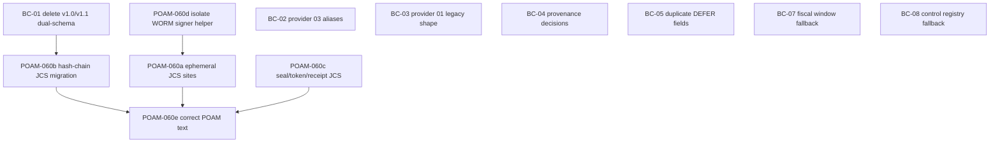

# POAM Backward-Compatibility Remediation Plan

**Scope:** Analysis of [`docs/POAM.md`](docs/POAM.md) and the regional POAM documents for
outstanding (non-closed) findings whose remediation is deferred, partial, or blocked for
backward-compatibility reasons, cross-referenced against the actual state of the codebase.

**Governing posture:** [`AGENTS.md`](AGENTS.md) — *Backward Compatibility Posture*. This
repository has no production installations under its management. Backward compatibility with
hypothetical adopter deployments is **not a design constraint**. Where a change can either
(a) add a compatibility layer or (b) break cleanly and simplify — **always prefer (b)**.
The single exception is **data already at rest** (hash chains, signed evidence records,
stored audit logs), where read-compatibility for existing artifacts must be preserved.

**Analysis date:** 2026-08-27
**Status:** Analysis only — no source code was modified in producing this document.

---

## 1. Executive Summary

Nineteen (19) non-closed POAM findings were reviewed across the main POAM and the four
regional POAM documents. Of those, **one finding (POAM-2026-060) explicitly cites
backward compatibility as the blocking reason** for deferral. A code-level sweep for
compatibility-motivated smells surfaced **five additional undocumented compatibility
surfaces** that are not tracked in any POAM but fall squarely under the repo's
"prefer the breaking change" posture.

The headline result contradicts the POAM text: **POAM-2026-060's stated justification does
not survive code inspection.** The finding claims 10 `json.dumps(sort_keys=True)` sites are
blocked on a "backward-compatibility strategy for persisted hash chains." In fact:

- There are **32** `sort_keys=True` occurrences in `src/`, not 10 (the POAM count is stale).
- **None** of them are dual-path or dual-read compatibility shims. Every one is a single,
  unconditional serialization call. There is no legacy branch to remove and no
  version-negotiation logic anywhere in the hash-chain code.
- The at-rest hash chains (`ContextAccumulator`, `EvidenceStreamSink`) are **self-verifying
  and self-consistent**: they recompute hashes with the *same* function used at write time.
  There is no independently-stored ground-truth digest that a JCS migration would invalidate.
- The one genuine at-rest artifact concern is the **WORM-persisted, KMS-signed UCA record**
  in [`src/gateway/governance/uca_logger.py`](src/gateway/governance/uca_logger.py:441), whose
  signature is verified against an external immutable store.

Consequently POAM-2026-060 should be **re-scoped, not simply closed**: most of its surface is
category (A), a narrow slice is category (B), and its factual claims (site count, "blocked on
backward-compatibility strategy") are category (C) stale.

---

## 2. Summary Table

| Finding ID | Title | Class | Affected files | Recommended action |
|---|---|---|---|---|
| POAM-2026-060 (a) | JCS migration — ephemeral / in-flight serialization sites | **A** | [`policy.py`](src/gateway/core/policy.py:82), [`policy_translator.py`](src/gateway/governance/ingress/policy_translator.py:362), [`query_cache.py`](src/governed_financial_advisor/infrastructure/query_cache.py:120), [`uca_logger.py`](src/gateway/governance/uca_logger.py:287), [`mock_endpoint.py`](src/integrations/provider_06/mock_endpoint.py:188), [`normative_provider.py`](src/gateway/governance/normative_provider.py:830) | Migrate to `jcs_canonicalize_plan()` or drop `sort_keys` where irrelevant; no at-rest impact |
| POAM-2026-060 (b) | JCS migration — live hash-chain write+verify pairs | **A** | [`context_accumulator.py`](src/compliance_bridge/context_accumulator.py:97), [`evidence_stream.py`](src/compliance_bridge/evidence_stream.py:508) | Migrate write and verify together atomically; chains are self-verifying, no external ground truth |
| POAM-2026-060 (c) | JCS migration — routing seal / token / receipt digests | **A** | [`routing_seal.py`](src/gateway/governance/routing_seal.py:267), [`consequence_token.py`](src/gateway/governance/consequence_token.py:184), [`provider_03/provider.py`](src/integrations/provider_03/provider.py:303), [`provider_02/adapter.py`](src/integrations/provider_02/adapter.py:229), [`reconciliation_worker.py`](src/compliance_bridge/reconciliation_worker.py:191), [`constants.py`](src/gateway/governance/constants.py:325) | Migrate to JCS; all artifacts are TTL-bounded (30–300s) or recomputed at load |
| POAM-2026-060 (d) | JCS migration — WORM-persisted signed UCA records | **B** | [`uca_logger.py`](src/gateway/governance/uca_logger.py:441) | **Do not migrate the verification path.** Isolate behind a named legacy-verification helper |
| POAM-2026-060 (e) | POAM text: "10 sites", "blocked on backward-compat strategy" | **C** | [`docs/POAM.md`](docs/POAM.md:77) | Stale — correct the count to 32 and remove the false blocker |
| BC-01 | Evidence stream v1.0/v1.1 dual-schema machinery | **A** | [`evidence_stream.py`](src/compliance_bridge/evidence_stream.py:570) | Delete `_detect_schema_version`, `migrate_record_1_0_to_1_1`, `get_last_v1_0_hash`, `_link_hash_v1_1`; v1.0 already unsupported |
| BC-02 | Provider 03 backward-compatibility alias methods | **A** | [`provider_03/provider.py`](src/integrations/provider_03/provider.py:312) | Delete the three `*compat*` aliases; not part of `NormativeProvider` |
| BC-03 | Provider 01 legacy binary `admitted/findings` fallback | **A** | [`provider_01/provider.py`](src/integrations/provider_01/provider.py:382) | Delete legacy branch; require FlowSignal tri-state `decision` |
| BC-04 | `provenance_chain` legacy `BLOCK`/`ESCALATE` decisions | **A** | [`provenance_chain.py`](src/gateway/governance/provenance_chain.py:85) | Remove from `VALID_DECISIONS`; migrate emitters to canonical six |
| BC-05 | `DEFER` legacy duplicate fields (`missing_input_reason`, `defer_id`, `verdict`) | **A** | [`decisions.py`](src/gateway/governance/decisions.py:247), [`symbolic_governor.py`](src/gateway/governance/symbolic_governor.py:2414), [`agent_gateway_adapter.py`](src/gateway/server/agent_gateway_adapter.py:734) | Remove duplicated legacy keys from response bodies |
| BC-06 | Routing seal v2 HMAC fallback path | **B** | [`routing_seal.py`](src/gateway/governance/routing_seal.py:624) | Retain — this is a dev/test signing mode, not a compatibility shim; already fail-closed in strict mode |
| BC-07 | Fiscal limit guard legacy window-key fallback | **A** | [`fiscal_limit_guard.py`](src/gateway/governance/fiscal_limit_guard.py:589) | Require explicit `window_key` or `token`; delete the implicit fallback |
| BC-08 | `ControlRegistry` legacy `control_mappings.json` fallback | **A** | [`constants.py`](src/gateway/governance/constants.py:303) | Fail closed when the regional profile is missing; delete `_LEGACY_PATH` |

**Counts:** category **A = 11**, category **B = 2**, category **C = 1**.

---

## 3. Findings Reviewed (Non-Closed)

The following non-closed findings were read in full and assessed for a backward-compatibility
deferral rationale.

### From [`docs/POAM.md`](docs/POAM.md:63) — Open Findings

| ID | Control | Backward-compat rationale? |
|---|---|---|
| POAM-2026-010 | RA-5 | No — infrastructure (CronJob not deployed) |
| POAM-2026-016 | RA-5 / SI-2 | No — upstream CVE, no fix available |
| POAM-2026-023 | RA-5 | No — upstream Debian base-layer CVE |
| POAM-2026-024 | CM-6 | No — staging environment not provisioned |
| POAM-2026-025 | AI 600-1 §2.6 | No — blocked on AO pre-approval |
| POAM-2026-026 | ISO 42001 A.8.4 | No — deployment topology |
| **POAM-2026-060** | **SC-13 / SI-7** | **Yes — the sole explicit backward-compat deferral** |
| EU-DORA-001 | DORA Art. 10 | No — endpoint not implemented |
| EU-AI-ACT-001 | EU AI Act Art. 9 | No — endpoint not implemented |
| EU-GDPR-001 | GDPR Art. 22 | No — endpoint not implemented |
| EU-001 | EU AI Act Art. 29a | No — provider credentials not provisioned |
| APAC-MAS-FEAT-001 | MAS FEAT | No — endpoint not implemented |
| APAC-MAS-N655-001 | MAS Notice 655 | No — endpoint not implemented |
| APAC-MAS-TRM-001 | MAS TRM §6.3 | No — endpoint not implemented |

### From the regional POAM documents

[`docs/compliance/us_fed/POAM_US_FED.md`](docs/compliance/us_fed/POAM_US_FED.md),
[`docs/compliance/eu_ecb/POAM_EU_ECB.md`](docs/compliance/eu_ecb/POAM_EU_ECB.md),
[`docs/compliance/apac_mas/POAM_APAC_MAS.md`](docs/compliance/apac_mas/POAM_APAC_MAS.md),
[`docs/compliance/universal/POAM_ISO42001.md`](docs/compliance/universal/POAM_ISO42001.md),
[`docs/compliance/cross-region/POAM_INDEX.md`](docs/compliance/cross-region/POAM_INDEX.md).

A regex sweep across all `POAM_*.md` for `backward.compat|sort_keys|JCS|8785|dual-write|
dual-read|deprecat|legacy|compatibility shim|version negotiat` returned **zero** matches in
the regional POAMs. Every regional finding (POAM-001 … POAM-023, ISO-001 … ISO-004,
EU-001 … EU-005, MAS-001 … MAS-004, AI600-001 … AI600-007) is deferred for reasons of
missing documentation, missing external credentials, unprovisioned infrastructure, or
unpatched upstream CVEs — **none** for compatibility reasons.

[`docs/compliance/cross-region/POAM.md`](docs/compliance/cross-region/POAM.md:3) is itself a
redirect stub retained "for backward compatibility with historical document cross-references."
That is a document-level, not code-level, concern and is out of scope for this plan; it is
noted here only because it is the single regex hit in that directory.

**Conclusion for Step 2:** POAM-2026-060 is the **only** POAM finding in the entire corpus
deferred on backward-compatibility grounds. Everything else in this plan (BC-01 … BC-08) is
an *untracked* compatibility surface discovered by code inspection and is offered as
additional scope under the repo's stated posture.

---

## 4. Complete `sort_keys=True` Inventory in `src/`

Search: `sort_keys\s*=\s*True` over `src/**/*.py`. **32 occurrences.** Of these, 3 are
non-`json.dumps` (a `yaml.dump`, a `json.dump` file write, and vendored library internals),
and 4 are docstring/comment references rather than executable calls. That leaves
**25 executable `json.dumps(..., sort_keys=True)` call sites**.

### 4.1 Excluded from migration scope (not a CAGE call site)

| File | Line | Reason |
|---|---|---|
| [`src/gateway/governance/vendor/jcs/_jcs.py`](src/gateway/governance/vendor/jcs/_jcs.py:137) | 137 | Vendored RFC 8785 reference implementation — **this is the JCS library itself** |
| [`src/gateway/governance/vendor/jcs/_jcs.py`](src/gateway/governance/vendor/jcs/_jcs.py:510) | 510 | Same — `canonicalize()` internals |
| [`src/gateway/governance/jcs_canonicalizer.py`](src/gateway/governance/jcs_canonicalizer.py:27) | 27 | Docstring only |
| [`src/gateway/governance/normative_provider.py`](src/gateway/governance/normative_provider.py:412) | 412 | Comment documenting a *completed* migration |
| [`src/gateway/server/governance_middleware.py`](src/gateway/server/governance_middleware.py:485) | 485 | Docstring describing `KMSGovernanceSigner.verify()` |
| [`src/compliance_bridge/context_accumulator.py`](src/compliance_bridge/context_accumulator.py:28) | 28, 134, 137 | Module/dataclass docstrings describing the hash algorithm |

### 4.2 At-rest sites — data persisted beyond process lifetime

| # | File / line | Artifact | Persistence | Verified against | Class |
|---|---|---|---|---|---|
| 1 | [`context_accumulator.py:97`](src/compliance_bridge/context_accumulator.py:97) `_link_hash()` header | Audit chain `record_hash` | NDJSON → GCS/S3 | Recomputed by `verify_integrity()` in the same module | A |
| 2 | [`context_accumulator.py:114`](src/compliance_bridge/context_accumulator.py:114) `_content_hash()` | Audit chain `content_hash` | NDJSON → GCS/S3 | Recomputed by `verify_integrity()` | A |
| 3 | [`context_accumulator.py:297`](src/compliance_bridge/context_accumulator.py:297) verify loop | Verification counterpart of #2/#1 | — | Must change **in lockstep** with #1/#2 | A |
| 4 | [`context_accumulator.py:379`](src/compliance_bridge/context_accumulator.py:379) `_append_node()` | Write counterpart of #3 | — | Must change **in lockstep** | A |
| 5 | [`evidence_stream.py:508`](src/compliance_bridge/evidence_stream.py:508) `_link_hash()` header | Evidence `record_hash` | Redis Stream (capped `maxlen`) | Recomputed by `verify_record()` | A |
| 6 | [`evidence_stream.py:566`](src/compliance_bridge/evidence_stream.py:566) `_link_hash_v1_1()` header | v1.1 verification hash | — | Verification counterpart of #5 | A |
| 7 | [`evidence_stream.py:671`](src/compliance_bridge/evidence_stream.py:671) `verify_record()` payload | Payload re-serialization for verify | — | Must match #8/#9 exactly | A |
| 8 | [`evidence_stream.py:937`](src/compliance_bridge/evidence_stream.py:937) `ingest()` payload | Evidence `payload_json` | Redis Stream | Write counterpart of #7 | A |
| 9 | [`evidence_stream.py:1129`](src/compliance_bridge/evidence_stream.py:1129) `_ingest_with_result()` payload | Evidence `payload_json` | Redis Stream | Write counterpart of #7 | A |
| 10 | [`uca_logger.py:441`](src/gateway/governance/uca_logger.py:441) `_sign_record()` | KMS-signed UCA record | **WORM bucket (immutable)** | External KMS public-key verification of a stored signature | **B** |
| 11 | [`uca_logger.py:348`](src/gateway/governance/uca_logger.py:348) `yaml.dump(sort_keys=True)` | WORM YAML serialization | WORM bucket | Not hashed — presentation ordering only | A (trivial) |

### 4.3 Ephemeral / in-flight sites — no data at rest

| # | File / line | Purpose | Lifetime | Class |
|---|---|---|---|---|
| 12 | [`policy.py:82`](src/gateway/core/policy.py:82) `_opa_cache_key()` | Redis cache key digest | 10 s TTL (`_OPA_CACHE_TTL_SECONDS`) | A |
| 13 | [`query_cache.py:120`](src/governed_financial_advisor/infrastructure/query_cache.py:120) | Query cache key digest | 3600 s TTL, default `QUERY_CACHE_TTL` | A |
| 14 | [`uca_logger.py:287`](src/gateway/governance/uca_logger.py:287) `raw_summary` | Truncated `[:512]` log string | Log line only, never hashed | A |
| 15 | [`policy_translator.py:362`](src/gateway/governance/ingress/policy_translator.py:362) | `policy_version_id` fallback input | Recomputed on every translation | A |
| 16 | [`mock_endpoint.py:188`](src/integrations/provider_06/mock_endpoint.py:188) | "Mock signature (not cryptographically valid)" | Test double | A |
| 17 | [`normative_provider.py:830`](src/gateway/governance/normative_provider.py:830) `json.dump(..., indent=2)` | Human-readable profile dump to disk | Not hashed | A (trivial) |
| 18 | [`routing_seal.py:267`](src/gateway/governance/routing_seal.py:267) `_canonical_payload()` | v2 HMAC seal input | 30 s TTL (`_TTL_S`), single-use nonce | A |
| 19 | [`routing_seal.py:423`](src/gateway/governance/routing_seal.py:423) `params_hash[:16]` | Truncated JWT claim | 30 s TTL | A |
| 20 | [`consequence_token.py:184`](src/gateway/governance/consequence_token.py:184) JWS header | JWS protected header | 60 s TTL | A |
| 21 | [`consequence_token.py:185`](src/gateway/governance/consequence_token.py:185) JWS payload | JWS claims | 60 s TTL | A |
| 22 | [`reconciliation_worker.py:191`](src/compliance_bridge/reconciliation_worker.py:191) `to_redis_payload()` | Signed balance | 300 s TTL (`TTL_SECONDS`); CBF fails closed on expiry | A |
| 23 | [`constants.py:325`](src/gateway/governance/constants.py:325) profile hash | Config drift hash | Recomputed at every registry load | A |
| 24 | [`provider_03/provider.py:303`](src/integrations/provider_03/provider.py:303) `ingest_bind_receipt()` | Receipt digest, returned to caller | Not persisted by CAGE | A |
| 25 | [`provider_02/adapter.py:229`](src/integrations/provider_02/adapter.py:229) `_hash_state()` | State snapshot digest for CER | In-flight signal | A |

**Split:** **11 at-rest** (§4.2), **14 ephemeral** (§4.3). Of the 11 at-rest sites, exactly
**one** (#10, the KMS-signed WORM UCA record) is genuinely protected by the AGENTS.md
data-at-rest exception. The other 10 are internally self-verifying.

---

## 5. Per-Finding Detail

### 5.1 POAM-2026-060 (a) — Ephemeral JCS sites — **Class A**

**POAM text:** [`docs/POAM.md:77`](docs/POAM.md:77) — *"RFC 8785 JCS migration incomplete — 10
identified `json.dumps(sort_keys=True)` sites remain unmigrated because their hashes are
compared against persisted data … Migration blocked on backward-compatibility strategy for
persisted hash chains."*

**Evidence.** The 14 sites in §4.3 above are not compared against persisted data at all:

- [`src/gateway/core/policy.py:79-84`](src/gateway/core/policy.py:79) builds a Redis cache key
  with a documented 10-second TTL (`_OPA_CACHE_TTL_SECONDS: int = 10`, line 70). A
  canonicalization change simply causes a one-time cache miss.
- [`src/governed_financial_advisor/infrastructure/query_cache.py:119-121`](src/governed_financial_advisor/infrastructure/query_cache.py:119)
  is a query cache keyed on a governance-context hash; the same argument applies.
- [`src/gateway/governance/uca_logger.py:287`](src/gateway/governance/uca_logger.py:287)
  produces `raw_summary`, truncated to 512 chars, which is then PII-sanitized and stored as a
  human-readable string field. It is never hashed or compared.
- [`src/integrations/provider_06/mock_endpoint.py:187-189`](src/integrations/provider_06/mock_endpoint.py:187)
  is explicitly commented `# Mock signature (not cryptographically valid)`.
- [`src/gateway/governance/ingress/policy_translator.py:356-364`](src/gateway/governance/ingress/policy_translator.py:356)
  is a *fallback* input to `_compute_version_id()`, recomputed on every translation run.
- [`src/gateway/governance/normative_provider.py:829-830`](src/gateway/governance/normative_provider.py:829)
  is `json.dump(..., indent=2, sort_keys=True)` writing a human-readable profile file; the
  authoritative profile hash is already JCS via `NormativeBaseline.profile_hash`.

**Why class A.** No at-rest artifact is affected. Under the AGENTS.md posture there is no
justification for leaving these on the legacy algorithm.

**Remediation.**
1. Replace `hashlib.sha256(json.dumps(x, sort_keys=True).encode())` with
   `hashlib.sha256(jcs_canonicalize_plan(x))` at sites #12, #13, #15, #24, #25.
2. At site #14 (`raw_summary`) and #17 (`json.dump` to disk), simply drop `sort_keys=True` —
   it conveys no integrity guarantee there — or leave as plain `json.dumps`.
3. At site #16 (mock endpoint), migrate for consistency with the real provider surface.

---

### 5.2 POAM-2026-060 (b) — Live hash-chain write/verify pairs — **Class A**

**Evidence — `ContextAccumulator`.** The chain is written by
[`_append_node()`](src/compliance_bridge/context_accumulator.py:366) at line 379
(`content_json = json.dumps(payload, sort_keys=True, default=str)`) and verified by
[`verify_integrity()`](src/compliance_bridge/context_accumulator.py:296) at line 297 with a
**byte-identical expression**. The genesis seed is `_sha256(self._audit_id)`
([line 294](src/compliance_bridge/context_accumulator.py:294)). Verification recomputes every
link from the stored `payload` using the current code. There is no externally-held digest.

**Evidence — `EvidenceStreamSink`.** Identical structure: written at
[`ingest():937`](src/compliance_bridge/evidence_stream.py:937) and
[`_ingest_with_result():1129`](src/compliance_bridge/evidence_stream.py:1129), verified at
[`verify_record():671`](src/compliance_bridge/evidence_stream.py:671). Backing store is a
Redis Stream created with `maxlen=self._max_len`
([line 977](src/compliance_bridge/evidence_stream.py:974)) — i.e. a **capped, self-trimming**
buffer, not a permanent archive. The in-memory chain head resets to
`_sha256("EVIDENCE_STREAM_GENESIS")` on every process start
([line 855](src/compliance_bridge/evidence_stream.py:855)), so chain continuity does not even
survive a pod restart today.

**Why class A.** The AGENTS.md exception protects artifacts whose *verification logic* would
break. Here the verifier and the writer are the same function pair in the same module,
migrated together in a single commit. Records written before the change would fail
verification — but the same is already true after any pod restart, and no signed external
attestation of these digests exists in this repository. The correct move is a clean break
plus a documented `BREAKING CHANGE:` footer, exactly as was done for
`normative_provider.py` (see [`docs/BREAKING_CHANGES_v3.md:226-237`](docs/BREAKING_CHANGES_v3.md:226)).

**Remediation.** Migrate these atomically — all in one commit, no partial state:

| Write site | Matching verify site |
|---|---|
| [`context_accumulator.py:379`](src/compliance_bridge/context_accumulator.py:379) | [`context_accumulator.py:297`](src/compliance_bridge/context_accumulator.py:297) |
| [`context_accumulator.py:97`](src/compliance_bridge/context_accumulator.py:97) (`_link_hash` header) | same function, used by both |
| [`context_accumulator.py:114`](src/compliance_bridge/context_accumulator.py:114) (`_content_hash`) | same function, used by both |
| [`evidence_stream.py:937`](src/compliance_bridge/evidence_stream.py:937) + [`:1129`](src/compliance_bridge/evidence_stream.py:1129) | [`evidence_stream.py:671`](src/compliance_bridge/evidence_stream.py:671) |
| [`evidence_stream.py:508`](src/compliance_bridge/evidence_stream.py:508) (`_link_hash` header) | [`evidence_stream.py:566`](src/compliance_bridge/evidence_stream.py:566) (`_link_hash_v1_1` header) |

Bump the schema sentinels in the same commit so the break is self-identifying:
`_SCHEMA` in [`context_accumulator.py`](src/compliance_bridge/context_accumulator.py:28)
(`cage-context-accumulator/1.1` → `/2.0`) and
[`evidence_stream.py:342`](src/compliance_bridge/evidence_stream.py:342)
(`cage-evidence-stream/1.1` → `/2.0`).

**Note on `default=str`.** `jcs_canonicalize_plan()` calls
[`canonicalize()`](src/gateway/governance/jcs_canonicalizer.py:30) directly and has no
`default=` escape hatch. Payloads currently relying on `default=str` (datetimes, Decimals)
must be normalized to JSON-native types *before* canonicalization. This is the only
non-mechanical part of the migration and must be covered by a test.

---

### 5.3 POAM-2026-060 (c) — Seal / token / receipt digests — **Class A**

**Evidence.**

- [`routing_seal.py:257-270`](src/gateway/governance/routing_seal.py:257) `_canonical_payload()`
  feeds the **v2 HMAC** seal only. The **v3 JWT** path at
  [`line 297`](src/gateway/governance/routing_seal.py:297) already uses
  `jcs_canonicalize_plan()`. Seal TTL is `_TTL_S` (30 s) and seals are single-use-burned via
  `verify_and_consume_seal()` (POAM-2026-043, closed). Nothing survives 30 seconds.
- [`consequence_token.py:184-185`](src/gateway/governance/consequence_token.py:184) serializes
  the JWS header and payload. Default `ttl_seconds=60`
  ([line 150](src/gateway/governance/consequence_token.py:150)). The `act` claim it carries is
  *already* a JCS digest — only the JWS envelope serialization is legacy.
- [`reconciliation_worker.py:181-193`](src/compliance_bridge/reconciliation_worker.py:181)
  `to_redis_payload()` writes a KMS-signed balance with `ttl_seconds: int = TTL_SECONDS`
  (300 s), and POAM-2026-031 records that "CBF fails closed on TTL expiry."
- [`constants.py:323-328`](src/gateway/governance/constants.py:323) hashes the control-mappings
  profile for drift detection; recomputed on every `ControlRegistry` load.
- [`provider_03/provider.py:302-304`](src/integrations/provider_03/provider.py:302) returns a
  digest to the caller; CAGE does not persist it.
- [`provider_02/adapter.py:227-230`](src/integrations/provider_02/adapter.py:227) hashes an
  in-flight state snapshot.

**Why class A.** Every artifact here is bounded by a TTL of 30–300 seconds or is recomputed
from source on load. A rolling deployment could momentarily reject in-flight seals/tokens;
that is a sub-minute effect, not a data-at-rest concern.

**Remediation.** Replace each with `jcs_canonicalize_plan()`. For
[`consequence_token.py`](src/gateway/governance/consequence_token.py:184), note RFC 7515
requires the *exact bytes* of the base64url-decoded header/payload to be re-verified — the
verify path in `ConsequenceToken.verify()` decodes the transmitted segments rather than
re-serializing, so changing the mint-time serializer is safe and does not require a matching
verify-side change.

---

### 5.4 POAM-2026-060 (d) — WORM-persisted signed UCA records — **Class B — DO NOT MIGRATE**

**Evidence.** [`uca_logger.py:428-458`](src/gateway/governance/uca_logger.py:428)
`_sign_record()` computes `payload_bytes = json.dumps(payload, sort_keys=True).encode()` and
signs it via `KMSGovernanceSigner.sign()`. The signed record is then written by
[`_persist_uca_record()`](src/gateway/governance/uca_logger.py:339) to a **WORM bucket** —
`OSCAL_S3_BUCKET_US_FED` / `_EU_ECB` / `_APAC_MAS`
([`_get_worm_bucket()`](src/gateway/governance/uca_logger.py:408)) — which is write-once and
immutable by construction.

**Why class B.** This is the textbook AGENTS.md exception. Unlike the hash chains in §5.2,
the stored artifact carries an **asymmetric KMS signature over specific bytes**. An auditor
verifying a WORM record fetches the KMS public key and checks the signature against a
re-serialization of the record body. If CAGE changes the serializer, every previously-written
WORM record becomes unverifiable — and WORM storage means they can never be re-signed.
Breaking this breaks trust, not just an API.

**Remediation (narrowing, not migration).**
1. **Leave the signing algorithm unchanged.** Do not introduce JCS on this path.
2. Extract the serializer into an explicitly-named, single-purpose helper in
   [`uca_logger.py`](src/gateway/governance/uca_logger.py) — e.g.
   `_legacy_worm_signing_bytes(payload: dict) -> bytes` — with a docstring stating that the
   `json.dumps(sort_keys=True)` form is frozen for WORM signature verification and citing
   POAM-2026-060 and the AGENTS.md data-at-rest exception.
3. Add a `worm_signature_algorithm` field to the record so future records are
   self-describing and a genuine algorithm rotation becomes possible later.
4. The unrelated `yaml.dump(..., sort_keys=True)` at
   [`uca_logger.py:348`](src/gateway/governance/uca_logger.py:348) is **presentation only** —
   the signature is computed over JSON at line 441, before YAML serialization. It is not
   protected and may be left or changed freely.

---

### 5.5 POAM-2026-060 (e) — POAM text is stale — **Class C**

Three factual claims in [`docs/POAM.md:77`](docs/POAM.md:77) do not match the code:

1. **"10 identified sites"** — the actual count is 32 `sort_keys=True` occurrences / 25
   executable `json.dumps` call sites (§4). The POAM undercounts by more than half.
2. **"their hashes are compared against persisted data"** — true for exactly 1 of the 11
   at-rest sites (the WORM UCA record). The other 10 are compared against hashes recomputed
   by the same module from the same stored payload.
3. **"Migration blocked on backward-compatibility strategy for persisted hash chains"** —
   under the AGENTS.md posture there is no such blocker. There is no adopter deployment whose
   chains would be invalidated, and the repository has already shipped an equivalent
   canonicalization break for `normative_provider.py`
   ([`docs/BREAKING_CHANGES_v3.md:226`](docs/BREAKING_CHANGES_v3.md:226)).

**Remediation.** Rewrite the POAM-2026-060 row to state the corrected count, split the
remaining scope into "migrated" and "frozen for WORM signature verification (1 site)", and
delete the backward-compatibility blocker language. Retain the finding as open until the
migration lands, then close it with the commit SHA per
[`docs/POAM.md:183-192`](docs/POAM.md:183).

---

### 5.6 BC-01 — Evidence stream v1.0/v1.1 dual-schema machinery — **Class A**

**Evidence.** [`evidence_stream.py:341-342`](src/compliance_bridge/evidence_stream.py:341)
already declares `# All new records use v1.1 schema exclusively.` and
[`verify_record()`](src/compliance_bridge/evidence_stream.py:632) hard-rejects v1.0:

> `error="Schema v1.0 is deprecated (v3.0.0 breaking change). Use migrate_record_1_0_to_1_1() to upgrade legacy records."`

Yet the entire dual-schema apparatus remains:
[`_detect_schema_version()`](src/compliance_bridge/evidence_stream.py:570),
[`_link_hash_v1_1()`](src/compliance_bridge/evidence_stream.py:521),
[`migrate_record_1_0_to_1_1()`](src/compliance_bridge/evidence_stream.py:722),
[`get_last_v1_0_hash()`](src/compliance_bridge/evidence_stream.py:791), plus the
`schema_version` field and the sparse-inclusion branches on `classification_reason` /
`narrowing_applied` / `pause_token`.

A repo-wide search for `migrate_record_1_0_to_1_1|get_last_v1_0_hash|_detect_schema_version|
_link_hash_v1_1` finds **zero production callers outside `evidence_stream.py` itself**. The
only external consumer is [`tests/test_dual_schema_verification.py`](tests/test_dual_schema_verification.py:39),
a test suite that exists solely to exercise this dead compatibility code.

**Why class A.** This is a deprecation window with no consumers on the far side. v1.0 write
support is already gone; v1.0 read support already returns `valid=False`. The migration
helper cannot even be reached by production code.

**Remediation.**
1. Delete `_detect_schema_version()`, `migrate_record_1_0_to_1_1()`, `get_last_v1_0_hash()`.
2. Collapse `_link_hash_v1_1()` into `_link_hash()` — they differ only in the sparse v1.1
   header fields, which are now unconditional.
3. Remove the `schema_version` field from `EvidenceRecord` and the v1.0 branch in
   `verify_record()` and `VerifyResult`.
4. Delete [`tests/test_dual_schema_verification.py`](tests/test_dual_schema_verification.py)
   and fold any still-relevant hash-determinism assertions into
   [`tests/test_evidence_stream.py`](tests/test_evidence_stream.py).
5. Note that [`docs/BREAKING_CHANGES_v3.md:192-199`](docs/BREAKING_CHANGES_v3.md:192) describes
   CR-1 as requiring a "data-migration completeness gate … before it can ship." That gate is
   an artifact of the production-deployment framing and is void under the current AGENTS.md
   posture; update that paragraph accordingly.

**Ordering note.** BC-01 must land **before** §5.2, otherwise the JCS migration would have to
be applied to `_link_hash_v1_1()` as well, doubling the work.

---

### 5.7 BC-02 — Provider 03 compatibility aliases — **Class A**

**Evidence.** [`provider_03/provider.py:312-350`](src/integrations/provider_03/provider.py:312)
defines three methods each documented `"""Backward-compatibility alias..."""`:
`fetch_legal_baseline()`, `validate_external_fria()`, `submit_evidence_chain()`. All three
return hardcoded stub dictionaries — `validate_external_fria()` unconditionally returns
`{"verdict": "APPROVED", ...}`.

These are **not** part of the canonical `NormativeProvider` protocol, which AGENTS.md defines
as `fetch_baseline` / `validate_fria` / `submit_evidence` returning `NormativeBaseline` /
`ValidationResult` / `EvidenceSeal`. The only callers are
[`tests/test_provider_03_integration.py:32,37,44`](tests/test_provider_03_integration.py:32).

**Why class A.** A dict-returning shadow API alongside the dataclass-returning protocol is
precisely the "compatibility alias" the posture says to delete. Worse, the alias
`validate_external_fria()` hardcodes `APPROVED`, so any caller that reached it would silently
bypass governance.

**Remediation.** Delete all three methods and rewrite
[`tests/test_provider_03_integration.py`](tests/test_provider_03_integration.py) to exercise
the canonical three-endpoint contract, as required by the Universal Protocol Conformance
Suite ([`tests/test_normative_provider_conformance.py`](tests/test_normative_provider_conformance.py)).

---

### 5.8 BC-03 — Provider 01 legacy binary response fallback — **Class A**

**Evidence.** [`provider_01/provider.py:326-386`](src/integrations/provider_01/provider.py:326)
documents two accepted response shapes and, at
[`line 382`](src/integrations/provider_01/provider.py:382), falls back:

```
# Backward compatibility: legacy admitted/findings shape
return ValidationResult(
    admitted=data.get("admitted", False),
    findings=data.get("findings", []),
)
```

**Why class A.** This is a version-negotiation branch on an external vendor wire format. It is
also a latent fail-open risk: a FlowSignal response that loses its `decision` key (e.g. a
proxy error page that happens to parse as JSON with `admitted: true`) is admitted without
tri-state mapping. The tri-state path is the only one that performs
`_map_flowsignal_decision()` and ConsequenceToken minting.

**Remediation.** Remove the fallback. When `decision` is absent, return
`ValidationResult(admitted=False, ...)` with `code="cage.endpoint_error"` (or
`FINDING_CODE_PARSE_ERROR`), matching the fail-closed semantics AGENTS.md mandates for vendor
adapters. Update the hermetic `respx` mocks in
[`tests/test_provider_01.py`](tests/test_provider_01.py) accordingly.

**Test coupling — important.** The Universal Protocol Conformance Suite currently *asserts*
this legacy behavior in two tests that must be **inverted**, not merely deleted:

- [`tests/test_normative_provider_conformance.py::test_flowsignal_backward_compat_no_decision_field`](tests/test_normative_provider_conformance.py:275)
- [`tests/test_normative_provider_conformance.py::test_flowsignal_backward_compat_no_decision_admitted_false`](tests/test_normative_provider_conformance.py:298)

The first currently asserts that a response lacking `decision` but carrying
`admitted: true` yields `admitted=True`. After BC-03 it must assert `admitted=False` with a
structured fail-closed finding. This is the single clearest demonstration of the latent
fail-open risk described above: the conformance suite is presently locking in the ability to
admit an action from a response that never went through tri-state governance mapping.

---

### 5.9 BC-04 — `provenance_chain` legacy decision values — **Class A**

**Evidence.** [`provenance_chain.py:76-89`](src/gateway/governance/provenance_chain.py:76)
declares `VALID_DECISIONS` containing the six canonical `GovernanceDecision` values **plus**
`"BLOCK"` and `"ESCALATE"`, annotated `# Execution-phase statuses (LangGraph nodes, backward
compat)`. The same caveat is repeated in two docstrings
([lines 108-109](src/gateway/governance/provenance_chain.py:108) and
[189-190](src/gateway/governance/provenance_chain.py:189)).

**Why class A.** An eight-value vocabulary where the canonical set is six weakens the
provenance record's semantics — `BLOCK` and `DENY` are indistinguishable to a downstream
auditor. This is a compatibility widening, not a functional requirement.

**Remediation.** Identify every emitter of `BLOCK`/`ESCALATE` into the provenance chain,
remap `BLOCK → DENY` and `ESCALATE → REQUIRE_APPROVAL`, then narrow `VALID_DECISIONS` to the
six canonical values. Update
[`tests/test_provenance_chain.py`](tests/test_provenance_chain.py).

---

### 5.10 BC-05 — Duplicated legacy DEFER fields — **Class A**

**Evidence.** Three separate sites emit duplicate legacy keys alongside canonical ones:

- [`decisions.py:246-271`](src/gateway/governance/decisions.py:246) —
  `missing_input_reason` is described as `"Legacy field: reason for missing context
  (backward compat)"`, and `to_dict()` emits `missing_input_reason` **and**
  `"verdict": GovernanceDecision.DEFER,  # Legacy field` alongside `decision`.
- [`symbolic_governor.py:2413-2417`](src/gateway/governance/symbolic_governor.py:2413) —
  `"defer_id": defer_token,  # Alias for backward compat`.
- [`agent_gateway_adapter.py:733-738`](src/gateway/server/agent_gateway_adapter.py:733) —
  `# Legacy fields for backward compatibility` re-emitting `verdict` and
  `missing_input_reason`.

**Why class A.** Three names for one value in an audit-relevant response body is exactly the
kind of duplication the posture says to remove. It also creates a divergence risk if one
site is updated and the others are not.

**Remediation.** Keep `decision`, `classification_reason`, and `defer_token`. Delete
`verdict`, `missing_input_reason`, and `defer_id` from all response bodies and from the
`DeferResponse` model. Update assertions in
[`tests/test_defer_queue.py`](tests/test_defer_queue.py) and
[`tests/test_governance_middleware.py`](tests/test_governance_middleware.py).

---

### 5.11 BC-06 — Routing seal v2 HMAC fallback — **Class B (retain)**

**Evidence.** [`routing_seal.py:281-283`](src/gateway/governance/routing_seal.py:281):
*"In production with KMS configured, generates an asymmetric JWT seal (v3). In test/dev
without KMS, generates an HMAC-SHA256 seal (v2)."* The verification path at
[`lines 605-628`](src/gateway/governance/routing_seal.py:605) already refuses HMAC seals in
strict mode with an explicit `[DOWNGRADE_ATTACK]` log and a `SymbolicGovernorViolation`.

**Why class B.** This is not a backward-compatibility shim for old clients — it is a
**capability fallback for environments without KMS** (local dev, CI, the offline `local`/`unit`
test markers). Removing it would make the entire governance path untestable without a live
Cloud KMS key. It is already fail-closed in production via `CAGE_SEAL_STRICT_MODE` and the
`is_production` check.

**Remediation.** None. Listed here so the follow-on implementer does not mistake the `v2`/`v3`
naming for a version-negotiation shim. **Do not touch.**

---

### 5.12 BC-07 — Fiscal limit guard legacy window-key fallback — **Class A**

**Evidence.** [`fiscal_limit_guard.py:582-590`](src/gateway/governance/fiscal_limit_guard.py:582):

```
else:
    # Legacy fallback: compute current window (backward compatible)
    target_window_key = self._window_key()
```

When neither `window_key` nor `token` is supplied, the rollback silently targets the *current*
window rather than the window the reservation was made against.

**Why class A.** The cross-window guard immediately below
([line 596](src/gateway/governance/fiscal_limit_guard.py:596)) exists precisely to catch
mismatched windows — but the legacy fallback guarantees `target == current`, so the guard can
never fire on that path. The compatibility branch defeats the control that POAM-2026-058
was closed to add.

**Remediation.** Make `window_key` or `token` mandatory; raise `ValueError` when neither is
provided (mirroring the existing `amount`/`amount_minor` guard at
[line 568](src/gateway/governance/fiscal_limit_guard.py:568)). Update all `rollback()` callers
to pass the `ReservationToken`.

---

### 5.13 BC-08 — `ControlRegistry` legacy control-mappings fallback — **Class A**

**Evidence.** [`constants.py:301-311`](src/gateway/governance/constants.py:301) falls back to
`_LEGACY_PATH = config/control_mappings.json` when the regional profile is missing, and sets
`region = "LEGACY"`. The docstring at
[`lines 209-210`](src/gateway/governance/constants.py:209) documents this as resolution step
4: *"Legacy fallback: `config/control_mappings.json` (backward compat)."*

**Why class A.** A region-guarded system that silently degrades to a non-regional profile
labelled `LEGACY` produces audit spans with jurisdictionally wrong citations — the exact class
of defect that POAM-2026-034, -035 and -036 were opened and closed to fix. The fallback
reintroduces it through the back door.

**Remediation.** Delete `_LEGACY_PATH` and the fallback branch. Raise the existing
`RuntimeError` ("Cannot start governance engine without a valid profile",
[line 345](src/gateway/governance/constants.py:345)) when the regional profile is absent.
Verify all three `config/compliance/{US_FED,EU_ECB,APAC_MAS}_BASELINE.json` files exist first,
then run the three region-gated test postures.

---

## 6. Implementation Ordering

### 6.1 Dependency graph



### 6.2 Ordered work plan

| Step | Item | Depends on | Rationale |
|---|---|---|---|
| 1 | **BC-01** — delete v1.0/v1.1 dual-schema machinery | — | Shrinks the surface that step 3 must migrate; `_link_hash_v1_1` disappears before JCS touches it |
| 2 | **POAM-2026-060 (d)** — isolate the WORM signer behind a named helper | — | Establishes the frozen boundary **before** any bulk `sort_keys` sweep, so an automated find-and-replace cannot accidentally cross it |
| 3 | **POAM-2026-060 (b)** — hash-chain JCS migration | 1, 2 | The single highest-risk change; must be one atomic commit covering all write+verify pairs |
| 4 | **POAM-2026-060 (a)** and **(c)** — ephemeral and TTL-bounded JCS sites | 2 | Independent of each other; can be split or batched |
| 5 | **BC-07**, **BC-08** | — | Fully independent; touch fiscal and registry paths only |
| 6 | **BC-02**, **BC-03** | — | Fully independent; vendor-adapter scope only |
| 7 | **BC-04**, **BC-05** | — | Independent of everything above; response-shape and vocabulary changes |
| 8 | **POAM-2026-060 (e)** — correct the POAM row | 3, 4 | Documentation closes last, with the real commit SHAs |

### 6.3 Independence summary

- **Strictly sequential:** BC-01 → POAM-060(b); POAM-060(d) → POAM-060(a)/(c).
- **Fully independent (parallelizable):** BC-02, BC-03, BC-04, BC-05, BC-07, BC-08. None of
  these six touch canonicalization, hash chains, or each other.
- **Must be atomic within itself:** POAM-060(b). Splitting the write and verify sites across
  two commits leaves `main` in a state where `verify_integrity()` fails against records the
  same build just wrote.

---

## 7. Compliance Artifact Impact

Per [`AGENTS.md`](AGENTS.md) *Compliance Artifact Obligations*: an OSCAL component update in
[`compliance/oscal/`](compliance/oscal/) is required within 2 business days of merge when NIST
SP 800-53 control implementations change; a Lula validation update in
[`compliance/lula/`](compliance/lula/) is required in the same PR when referenced Kubernetes
resources change.

| Item | Controls touched | OSCAL update? | Lula update? |
|---|---|---|---|
| POAM-060 (a) ephemeral | none | **No** | No |
| POAM-060 (b) hash chains | AU-12, SI-7, SC-13 | **Yes** | No |
| POAM-060 (c) seals/tokens | SC-13, SI-7, SC-4 | **Yes** | No |
| POAM-060 (d) WORM isolation | SC-13, AU-9 | **Yes** (documentary) | No |
| POAM-060 (e) POAM text | none | No | No |
| BC-01 dual-schema removal | AU-12 | **Yes** | No |
| BC-02 provider 03 aliases | SA-9 | No | No |
| BC-03 provider 01 fallback | SA-9, CA-7 | No | No |
| BC-04 provenance decisions | AU-12, AU-10 | **Yes** | No |
| BC-05 duplicate DEFER fields | AU-12 | No | No |
| BC-07 fiscal window guard | SC-4 | **Yes** | No |
| BC-08 registry fallback | CM-6 | **Yes** | No |

### 7.1 Specific OSCAL edits required

- [`compliance/oscal/sp800-53-component-definition.yaml`](compliance/oscal/sp800-53-component-definition.yaml:159)
  — the `sc-13` implemented-requirement (uuid `2f94e8b5-…`) currently states that Phase 2
  *"migrated evidence pipeline hashing from json.dumps(sort_keys=True) to RFC 8785 JCS."*
  After POAM-060(b)/(c) this must be widened to name the hash-chain modules, and must
  explicitly carve out the WORM UCA signing path as intentionally frozen.
- [`compliance/oscal/sp800-53-component-definition.yaml`](compliance/oscal/sp800-53-component-definition.yaml:190)
  — the `si-7` implemented-requirement (uuid `3a85d9c6-…`) makes the same JCS claim and needs
  the same widening.
- [`compliance/oscal/sp800-53-component-definition.yaml`](compliance/oscal/sp800-53-component-definition.yaml:88)
  — the `au-12` implemented-requirement (uuid `4ccc6861-…`) references the
  *"hash-linked evidence chain"*; update for the new `/2.0` schema sentinel and the removal of
  dual-schema support.
- [`compliance/oscal/system-security-plan.yaml`](compliance/oscal/system-security-plan.yaml:860)
  — the `au-12` control (uuid `g7000004-…`) contains the phrase *"maintaining audit record
  integrity across schema migrations."* That statement becomes false once BC-01 lands and
  must be rewritten.
- [`compliance/oscal/component-definition.yaml`](compliance/oscal/component-definition.yaml:217)
  — the ISO 42001 remark for `context_accumulator.py` describes chain sealing and root-hash
  embedding; add the canonicalization algorithm and the new schema version.

### 7.2 Lula impact

**No Lula validation manifest requires change for any item in this plan.** A search across
[`compliance/lula/`](compliance/lula/) for `evidence_stream|context_accumulator|uca_logger|
jcs|8785|sc-13|si-7` returns only two incidental hits, neither of which is an assertion over
these modules. All Lula manifests assert over **Kubernetes resources** (Deployments,
ConfigMaps, Secrets, env vars) — see
[`compliance/lula/lula-validation-flowsignal.yaml`](compliance/lula/lula-validation-flowsignal.yaml:74),
whose `kubernetes-spec` targets the `cage-gateway` Deployment. None of the changes in this
plan add, remove, or rename a Kubernetes resource, container, env var, or Secret reference.

**Caveat:** if BC-08 (registry fallback removal) causes the gateway to fail startup where a
regional baseline ConfigMap is absent, that is a *deployment configuration* consequence, not
a manifest change. Verify
[`compliance/lula/lula-validation-cm6.yaml`](compliance/lula/lula-validation-cm6.yaml:47)
still passes on the dev cluster after BC-08, since it asserts that governance threshold
ConfigMaps are deployed.

---

## 8. Test Impact

| Item | Test files requiring change | Nature of change |
|---|---|---|
| POAM-060 (a) | [`tests/test_uca_logger.py`](tests/test_uca_logger.py:188) | `test_pii_sanitization_applied` asserts on `request_summary`; unaffected unless the truncation boundary shifts |
| POAM-060 (b) | [`tests/test_context_accumulator.py`](tests/test_context_accumulator.py), [`tests/test_evidence_stream.py`](tests/test_evidence_stream.py:103), [`tests/test_kms_evidence_signing.py`](tests/test_kms_evidence_signing.py:36), [`tests/test_compliance_bridge_integration.py`](tests/test_compliance_bridge_integration.py:1373) | Any hardcoded expected digest must be regenerated; determinism assertions stay valid |
| POAM-060 (b) | [`tests/test_evidence_stream.py`](tests/test_evidence_stream.py:136) | `test_chain_root_genesis` asserts on `_sha256("EVIDENCE_STREAM_GENESIS")`; unaffected (genesis is a plain string, not JSON) |
| POAM-060 (c) | [`tests/test_consequence_token.py`](tests/test_consequence_token.py:533), [`tests/test_consequence_gateway.py`](tests/test_consequence_gateway.py:222), [`tests/test_routing_seal_security.py`](tests/test_routing_seal_security.py), [`tests/test_provider_01.py`](tests/test_provider_01.py:488) | These already compute expectations via `jcs_canonicalize_plan()`, so most will pass unchanged; the v2 HMAC seal tests need new fixtures |
| POAM-060 (d) | [`tests/test_uca_logger.py`](tests/test_uca_logger.py:95) | `test_hmac_stub_signing_in_test_mode` must be **retained and extended** — see §8.1 |
| BC-01 | [`tests/test_dual_schema_verification.py`](tests/test_dual_schema_verification.py) | **Delete entire file** (679 lines exercising only the removed compatibility code) |
| BC-01 | [`tests/test_evidence_stream.py`](tests/test_evidence_stream.py) | Absorb the hash-determinism and tamper-detection assertions worth keeping |
| BC-02 | [`tests/test_provider_03_integration.py`](tests/test_provider_03_integration.py:32) | Rewrite to the canonical 3-endpoint contract |
| BC-03 | [`tests/test_provider_01.py`](tests/test_provider_01.py) | Add a fail-closed case for a response missing `decision`; remove any legacy-shape mock |
| BC-03 | [`tests/test_normative_provider_conformance.py`](tests/test_normative_provider_conformance.py:275) | **Invert** two backward-compat tests (see §5.8) — they currently assert the fail-open behavior |
| BC-04 | [`tests/test_provenance_chain.py`](tests/test_provenance_chain.py:23) | Assert `VALID_DECISIONS` has exactly six members; add rejection cases for `BLOCK`/`ESCALATE` |
| BC-05 | [`tests/test_defer_queue.py`](tests/test_defer_queue.py), [`tests/test_governance_middleware.py`](tests/test_governance_middleware.py) | Drop assertions on `verdict`, `missing_input_reason`, `defer_id` |
| BC-07 | fiscal-limit rollback tests | Add a `ValueError` case for a call with neither `window_key` nor `token` |
| BC-08 | region-posture suites (`us_fed`, `eu_ecb`, `apac_mas`) | Add a `RuntimeError` case for a missing regional baseline; assert no `region == "LEGACY"` path remains |

### 8.1 Mandatory retained coverage for at-rest verification

Per AGENTS.md, verification of pre-existing at-rest artifacts must keep test coverage. The
implementer **must not** delete or weaken:

- [`tests/test_uca_logger.py::test_hmac_stub_signing_in_test_mode`](tests/test_uca_logger.py:95)
  — the only assertion that the WORM signing payload is built the frozen way. After
  POAM-060(d) it should be **extended** with a golden-vector test: a fixed input dict and its
  exact expected `json.dumps(sort_keys=True)` byte string, so any future accidental JCS sweep
  fails loudly in CI.
- [`tests/test_kms_evidence_signing.py`](tests/test_kms_evidence_signing.py:36) — exercises
  `ContextAccumulator` under KMS signing; keep, and regenerate its expected digests.
- [`tests/test_jcs_canonicalizer.py::test_jcs_divergence_from_json_dumps_sort_keys`](tests/test_jcs_canonicalizer.py:136)
  — documents that the two algorithms genuinely differ. This is the reference proof that the
  migration is a real breaking change; keep unchanged.

### 8.2 Verification commands

```bash
# Offline regression gate (run after every step)
uv run pytest tests/ -m "local or unit" -n auto --dist=loadfile --tb=short

# Targeted, per item
uv run pytest tests/test_context_accumulator.py tests/test_evidence_stream.py -v
uv run pytest tests/test_uca_logger.py -v
uv run pytest tests/test_jcs_canonicalizer.py -v
uv run pytest tests/test_provenance_chain.py -v
uv run pytest tests/test_normative_provider_conformance.py -v

# Region postures (mandatory for BC-08 and any OSCAL-touching change)
CAGE_DEPLOYMENT_REGION=US_FED   uv run pytest tests/ -m us_fed -v
CAGE_DEPLOYMENT_REGION=EU_ECB   uv run pytest tests/ -m eu_ecb -v
CAGE_DEPLOYMENT_REGION=APAC_MAS uv run pytest tests/ -m apac_mas -v

# Static analysis
uv run ruff check . && uv run ruff format --check . && uv run mypy src/
```

---

## 9. Explicit "Do Not Touch" List — Category (B)

The following are the **only** compatibility surfaces in this analysis that must be
preserved. Any PR that modifies them should be rejected.

### 9.1 WORM UCA record signing payload

**Location:** [`src/gateway/governance/uca_logger.py:441`](src/gateway/governance/uca_logger.py:441)

```python
payload_bytes = json.dumps(payload, sort_keys=True).encode()
```

**Rationale.** The resulting bytes are signed by Cloud KMS
([line 454](src/gateway/governance/uca_logger.py:454)) and the signed record is written to a
**write-once, immutable** WORM bucket via
[`_write_to_worm()`](src/gateway/governance/uca_logger.py:363) /
[`_get_worm_bucket()`](src/gateway/governance/uca_logger.py:408). An external auditor verifies
a stored signature against a re-serialization of the stored record body. Changing the
serializer permanently invalidates every previously-written record, and WORM semantics mean
they can never be re-signed. This is squarely the AGENTS.md data-at-rest exception:
*"breaking their verification logic breaks trust rather than just breaking an API."*

**Permitted change:** extracting the expression verbatim into a named helper (POAM-060(d)) and
adding a self-describing algorithm field to *new* records. **Not permitted:** changing the
serialization algorithm on the existing verification path.

**Note:** [`uca_logger.py:348`](src/gateway/governance/uca_logger.py:348)
(`yaml.dump(..., sort_keys=True)`) is **outside** this protection — the signature is computed
at line 441 before YAML serialization, so YAML key ordering is presentation-only.

### 9.2 Routing seal v2 HMAC signing mode

**Location:** [`src/gateway/governance/routing_seal.py:333-350`](src/gateway/governance/routing_seal.py:333)
(generation) and [`:624-656`](src/gateway/governance/routing_seal.py:624) (verification)

**Rationale.** Despite the `v2`/`v3` naming this is **not** a version-negotiation shim for
older clients — it is the KMS-free signing mode required for local development, CI, and the
offline `local`/`unit` test markers that constitute the project's primary regression gate.
Removing it would make the governance path untestable without a live Cloud KMS key. It is
already fail-closed in production: verification raises `SymbolicGovernorViolation` with a
`[DOWNGRADE_ATTACK]` log whenever `CAGE_SEAL_STRICT_MODE=true` or `is_production`
([lines 605-622](src/gateway/governance/routing_seal.py:605)).

**Permitted change:** migrating `_canonical_payload()`
([line 267](src/gateway/governance/routing_seal.py:267)) to JCS under POAM-060(c) — the seal
is 30-second TTL and single-use, so this is not an at-rest concern. **Not permitted:**
deleting the HMAC mode itself.

### 9.3 Explicitly *not* on this list

For the avoidance of doubt, the following are **category A** and **should** be broken, despite
carrying "backward compat" comments:

- The `ContextAccumulator` and `EvidenceStreamSink` hash chains — self-verifying, no external
  ground truth, Redis Stream is `maxlen`-capped, in-memory chain head resets on restart.
- Everything in [`evidence_stream.py`](src/compliance_bridge/evidence_stream.py:570) related
  to schema v1.0 — already unsupported at
  [`line 633`](src/compliance_bridge/evidence_stream.py:633), zero production callers.
- All three `Provider03NormativeProvider` compat aliases.
- The `provenance_chain` `BLOCK`/`ESCALATE` values.
- The `ControlRegistry` `LEGACY` profile fallback.

---

## 10. Files Referenced That Do Not Exist

None. Every file path named in [`docs/POAM.md`](docs/POAM.md)'s open findings and in this
analysis was confirmed present in the working tree. Specifically, all three modules named in
POAM-2026-060 — [`src/compliance_bridge/context_accumulator.py`](src/compliance_bridge/context_accumulator.py),
[`src/compliance_bridge/evidence_stream.py`](src/compliance_bridge/evidence_stream.py), and
[`src/gateway/governance/uca_logger.py`](src/gateway/governance/uca_logger.py) — exist and
contain the described code.

---

## 11. Commit Guidance

Per [`AGENTS.md`](AGENTS.md) *Commit Message Standard*, each step should be a separate
Conventional Commit on its own `refactor/` or `fix/` branch, squash-merged. Breaking changes
require both the `!` marker and a `BREAKING CHANGE:` footer, and must be documented in
[`docs/BREAKING_CHANGES_v3.md`](docs/BREAKING_CHANGES_v3.md).

Suggested subjects (all ≤ 72 chars, imperative, no trailing period):

```
refactor(compliance)!: remove evidence stream v1.0 schema support
refactor(governance): isolate WORM signing payload behind named helper
refactor(compliance)!: migrate hash chains to RFC 8785 JCS
refactor(governance): migrate seal and token digests to JCS
refactor(governance)!: require explicit window key on fiscal rollback
refactor(governance)!: drop legacy control mappings fallback
refactor(governance)!: remove provider 03 compatibility aliases
fix(governance): fail closed on FlowSignal response without decision
refactor(governance)!: narrow provenance decisions to canonical six
refactor(governance)!: remove duplicate legacy DEFER response fields
docs(compliance): correct POAM-2026-060 scope and site count
```
