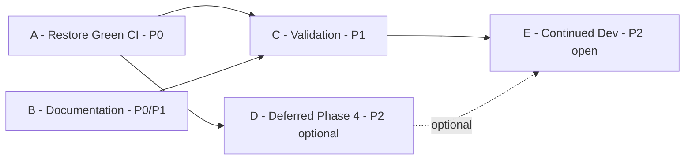
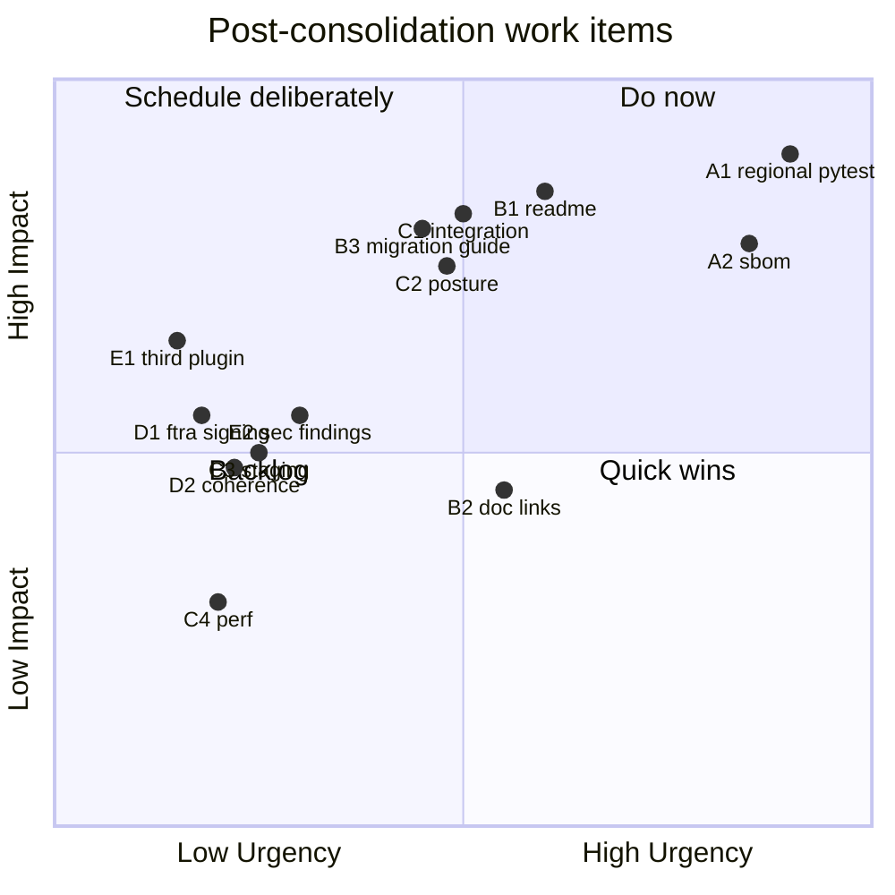
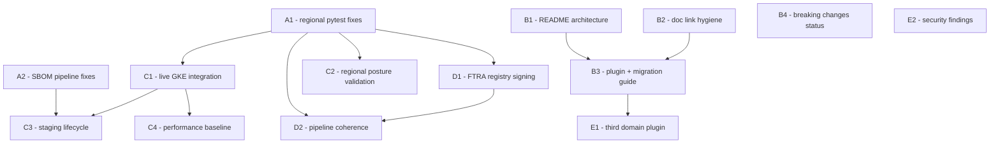
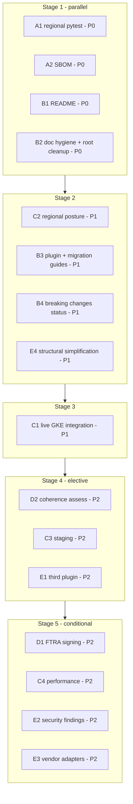

# CAGE Post-Consolidation Roadmap

**Document ID:** POST_CONSOLIDATION_ROADMAP
**Repository:** `cybernetic-governance-engine`
**Baseline:** `main` @ `e56802a` (post-consolidation, clean tree)
**Predecessor:** [`MERGE_PLAN_2026-09-03.md`](../MERGE_PLAN_2026-09-03.md) — completed
**Status:** Draft for review

> **Reference Architecture Note.** CAGE is a reference architecture. The
> optimisation target for everything below is **clean code structure and a
> legible architecture** — not operational safety, uptime, or backward
> compatibility. There is no production instance to protect. Breaking changes
> are therefore **acceptable and often desirable**: they remove designs the
> project is deliberately moving away from, and no deprecation window is owed
> to anyone. Where a choice exists between operational completeness and
> structural clarity, this roadmap always chooses structural clarity. Adopters
> running a live instance should layer their own release gating, SLOs, and
> hardening on top.
>
> **Practical consequence for prioritisation.** Items are ranked by how much
> they improve the *legibility and structural integrity* of the tree. This is
> why documentation (Workstream B) outranks live-cluster validation, and why
> FTRA registry signing (D1) is declined on structural grounds despite being a
> completed feature — see [§10.4](#104-the-governing-trade-off-reference-architecture-vs-production-hardening).

> **On effort estimates.** This document deliberately does **not** give
> hour/day estimates. It uses **relative complexity sizing** (`XS`/`S`/`M`/`L`)
> plus an explicit *blast radius* (how many files/gates a change touches),
> which survives contact with reality better than a calendar guess and is what
> actually drives sequencing decisions.

---

## Contents

1. [Executive Summary](#1-executive-summary)
2. [Priority Matrix](#2-priority-matrix)
3. [Workstream A — Restore Green CI (P0)](#3-workstream-a--restore-green-ci-p0)
4. [Workstream B — Documentation & Adoption Surface (P0/P1)](#4-workstream-b--documentation--adoption-surface-p0p1)
5. [Workstream C — Validation & Live-Cluster Verification (P1)](#5-workstream-c--validation--live-cluster-verification-p1)
6. [Workstream D — Deferred Phase 4 Work (P2, optional)](#6-workstream-d--deferred-phase-4-work-p2-optional)
7. [Workstream E — Continued Development (P2, open-ended)](#7-workstream-e--continued-development-p2-open-ended)
8. [Recommended Execution Sequence](#8-recommended-execution-sequence)
9. [Resource Requirements](#9-resource-requirements)
10. [Decision Points](#10-decision-points)
11. [Appendix — Command Reference](#11-appendix--command-reference)

---

## 1. Executive Summary

### 1.1 Where the repository stands

The branch-consolidation programme described in
[`MERGE_PLAN_2026-09-03.md`](../MERGE_PLAN_2026-09-03.md) is complete:

| Outcome | Detail |
|---|---|
| PRs merged | 6 (Phases 0–5) |
| Branches consolidated | 20 |
| Architecture | Layer 1 domain-agnostic kernel ([`src/gateway/`](../src/gateway/)) + Layer 2 plugins ([`src/cage_finance/`](../src/cage_finance/), [`src/cage_healthcare/`](../src/cage_healthcare/)) |
| Mechanical enforcement | G6 domain-literal gate ([`scripts/check_domain_literals.py`](../scripts/check_domain_literals.py)) + import-boundary gate ([`scripts/check_import_boundaries.py`](../scripts/check_import_boundaries.py)) |
| Issue #107 | Resolved — `EXTERNALLY_REVERSIBLE` taxonomy landed |
| `main` tip | `e56802a` |

The kernel no longer denies by default; the healthcare plugin stands as the
existence proof that the tier seam is domain-generic rather than retrofitted to
finance.

### 1.2 The one thing that is not finished

CI is **not green**. Five pre-existing failures survive the consolidation and
are tracked in **Issue #133**:

- 3 × `pytest-logic` regional legs (`US_FED`, `EU_ECB`, `APAC_MAS`) —
  [`.github/workflows/ci.yml`](../.github/workflows/ci.yml:87)
- 2 × SBOM generation (`gateway`, `compliance-bridge`) —
  [`.github/workflows/sbom.yml`](../.github/workflows/sbom.yml:64)

These pre-date the consolidation. They are nonetheless the highest-priority
item, because **a red CI badge invalidates every other claim this repository
makes.** A reference architecture whose own gates do not pass cannot credibly
argue that mechanical enforcement is the right model.

### 1.3 Strategic priorities

Three priorities, in order:

1. **Restore the signal.** Green CI is the precondition for trusting anything
   else. (Workstream A)
2. **Make the new architecture legible to an outsider.** The Layer 1/Layer 2
   split is the repository's central contribution, and right now it is
   documented mostly in a merge plan and a breaking-changes file — not in the
   places an adopter looks first. (Workstream B)
3. **Prove it end-to-end once.** A single live-GKE integration run against the
   consolidated tree converts "should work" into "observed working," and the
   run itself is the compliance demonstration. (Workstream C)

Workstreams D (FTRA registry signing, pipeline coherence) and E (new
development) are explicitly **optional** and gated behind the first three.

### 1.4 Shape of the programme



Workstreams A and B are **independent and parallelisable** — A is code and
tooling, B is prose. That parallelism is the single biggest scheduling lever
available and should be used.

---

## 2. Priority Matrix

### 2.1 Classification

| ID | Workstream | Priority | Impact | Urgency | Size | Blocking? |
|---|---|:--:|---|---|:--:|---|
| **A1** | Fix 3 regional `pytest-logic` failures | **P0** | High — gates every PR | High | M | Blocks C, D, E |
| **A2** | Fix 2 SBOM generation failures | **P0** | High — POAM-006 / CM-8 evidence | High | S–M | Blocks C |
| **B1** | Update [`README.md`](../README.md) for Layer 1/2 architecture | **P0** | High — first thing an adopter reads | Medium | S | Blocks B3 |
| **B2** | Fix broken/stale doc links from consolidation | **P0** | Medium — credibility | Medium | XS–S | — |
| **B3** | Author plugin-authoring + migration guide | **P1** | High — adoption enabler | Medium | M | — |
| **B4** | Finalise [`docs/BREAKING_CHANGES_v3.md`](../docs/BREAKING_CHANGES_v3.md) status blocks | **P1** | Medium | Low | S | — |
| **C1** | Full integration suite vs live GKE dev | **P1** | High — end-to-end proof | Medium | M | — |
| **C2** | Regional compliance posture validation | **P1** | High — the compliance demo | Medium | S–M | Needs A1 |
| **C3** | Staging lifecycle validation run | **P2** | Medium | Low | S | Needs A2, C1 |
| **C4** | Performance / load baseline refresh | **P2** | Low for a reference arch | Low | M | Needs C1 |
| **D1** | FTRA registry signing (KMS) | **P2** | Medium — showcase feature | Low | L | — |
| **D2** | Pipeline coherence F1–F4 | **P2** | Medium | Low | S–M | — |
| **E1** | Third domain plugin (extensibility proof ×3) | **P2** | Medium–High demonstrative | Low | M | Needs B3 |
| **E2** | Remaining security findings (C-1…M-13) | **P2** | Medium | Low | Varies | — |
| **E3** | Additional vendor adapters | **P2** | Medium | Low | M each | — |
| **E4** | Structural simplification (remove redundancy) | **P1** | High — directly improves legibility | Medium | XS–S each | — |

> **E4 is deliberately ranked P1, above most of C and all of D.** For an
> artifact whose product is a clean architecture, *removing* a redundant SBOM
> path or a stray root-level log file improves the deliverable more than
> *adding* a validated feature does. Removal is the highest-yield form of
> development available here. See [§7.5](#75-e4--structural-simplification-highest-structural-yield).

### 2.2 Urgency / impact quadrants



### 2.3 Critical vs optional

| Class | Items | Rationale |
|---|---|---|
| **Critical** | A1, A2, B1, B2 | Without these the repository is self-contradicting: it argues for mechanical enforcement while its own gates fail, and it describes an architecture its README does not reflect. |
| **Strongly recommended** | B3, C1, C2 | These convert the architecture from *asserted* to *demonstrated*. B3 is the difference between a repository people admire and one people fork. |
| **Optional** | C3, C4, D1, D2, E* | Each adds depth to an already-complete story. None is required for the reference architecture to be coherent. |

### 2.4 Dependency graph



---

## 3. Workstream A — Restore Green CI (P0)

**Tracking:** Issue #133
**Branch prefix:** `fix/`
**Overall size:** M
**Blocks:** C, D, E

### 3.1 Scope & objectives

Restore all CI gates on `main` to green without weakening any gate. Five
failures, two independent root-cause families.

> **Non-negotiable.** [`AGENTS.md`](../AGENTS.md) forbids disabling or skipping
> a CI check as a fix. A `pytest.mark.skip`, a lowered `--cov-fail-under`, a
> `continue-on-error: true`, or a `.trivyignore` entry added to make a job pass
> are all **out of scope** as remedies. If a gate is genuinely wrong, the fix is
> to change the gate deliberately in its own PR with the rationale recorded —
> not to silence it.

### 3.2 A1 — Regional `pytest-logic` failures

Three legs of the same matrix job fail:
[`.github/workflows/ci.yml`](../.github/workflows/ci.yml:87) runs
`region: [US_FED, EU_ECB, APAC_MAS]` with
`uv run pytest tests/ -m "local or unit" -n auto --dist=loadfile -v --cov=src --cov-fail-under=70`.

**Prerequisites**

- Local `uv` environment synced: `uv sync --all-groups --all-extras`
- Read access to the failing CI run logs for Issue #133

**Triage decision tree**

Before writing any fix, classify the failure. The three legs failing *together*
versus *differently* points at completely different root causes:

| Observation | Likely cause | First probe |
|---|---|---|
| All 3 legs fail on the **same** test(s) | Region-independent regression, or a coverage-threshold miss | Run locally with `CAGE_DEPLOYMENT_REGION` unset |
| Each leg fails on **different** region-marked tests | Region-guard/threshold config drift after consolidation | Diff `config/thresholds/<REGION>_BASELINE.json` against `config/compliance/<REGION>_BASELINE.json` |
| Failures appear only under `-n auto` | Test isolation / cross-worker fixture leak | Re-run single-process; compare |
| Failure is `--cov-fail-under=70` | Coverage dropped from deletions in Phase 1 hollowing | `--cov-report=term-missing`, find the newly-uncovered modules |

The last row deserves particular suspicion. Phase 1 deleted ~285 lines from
`_run_checks()` and Phase 3 re-added them as plugin code in
[`src/cage_finance/`](../src/cage_finance/) and
[`src/cage_healthcare/`](../src/cage_healthcare/). If plugin packages are
inside `--cov=src` but their tests are not marked `local`/`unit`, measured
coverage falls even though real coverage did not. That is a **measurement**
bug, and the fix is to the marker set, not the threshold.

**Step-by-step**

1. **Reproduce all three legs locally**, one command per region:
   ```bash
   for R in US_FED EU_ECB APAC_MAS; do
     CAGE_DEPLOYMENT_REGION=$R CAGE_ENV=test \
     uv run pytest tests/ -m "local or unit" -n auto --dist loadscope \
       --no-cov -p no:langsmith --tb=short -q 2>&1 | tail -40
   done
   ```
   Note `--no-cov` here: separate the *test* failures from the *coverage* failure
   before trying to fix either.
2. **Re-run with coverage once**, US_FED only, to isolate a threshold miss:
   ```bash
   CAGE_DEPLOYMENT_REGION=US_FED CAGE_ENV=test \
   uv run pytest tests/ -m "local or unit" -n auto --dist loadscope \
     --cov=src --cov-config=.coveragerc --cov-report=term-missing \
     --cov-fail-under=70 -q
   ```
3. **Confirm or rule out worker-isolation** for any test that passes alone and
   fails in the matrix:
   ```bash
   uv run pytest <failing_test_path> -p no:randomly -q          # alone
   uv run pytest tests/ -m "local or unit" -n auto --dist loadscope -q  # in suite
   ```
   [`AGENTS.md`](../AGENTS.md) already records one precedent for this class: a
   cache leak in the `mock_thresholds` fixture in
   [`tests/test_red_teaming.py`](../tests/test_red_teaming.py). Check whether the
   same fixture family is implicated again — a leaking threshold cache is
   *exactly* the mechanism that would make region-parameterised tests fail
   non-deterministically across workers.
4. **Fix at the correct layer.** For region failures, the fix belongs in the
   region config or the fixture that loads it, not in the assertion. If a test
   asserts a threshold that consolidation legitimately changed, update the test
   *and* record why in the PR body.
5. **Note the CI/local flag divergence.** CI uses `--dist=loadfile`;
   [`AGENTS.md`](../AGENTS.md) mandates `--dist loadscope` for local runs. These
   are different distribution strategies and can produce different isolation
   behaviour. If a failure reproduces under `loadfile` but not `loadscope`,
   **align CI to `loadscope`** in the same PR rather than papering over it — the
   documented standard and the enforced standard should not disagree.
6. **Verify the region-marked suites** pass in addition to the matrix:
   ```bash
   CAGE_DEPLOYMENT_REGION=US_FED   uv run pytest tests/ -m us_fed   -v
   CAGE_DEPLOYMENT_REGION=EU_ECB   uv run pytest tests/ -m eu_ecb   -v
   CAGE_DEPLOYMENT_REGION=APAC_MAS uv run pytest tests/ -m apac_mas -v
   ```
7. **Open one PR**, title e.g.
   `fix(tests): restore regional pytest matrix to green`.

**Success criteria**

- All three `pytest-logic` matrix legs green on the PR and on `main`.
- Zero tests newly skipped, xfailed, or deselected relative to `e56802a`.
- `--cov-fail-under=70` satisfied without lowering the number.
- Root cause stated explicitly in the PR body and cross-linked to Issue #133.

**Size:** M · **Blast radius:** test fixtures + possibly region config; low
production-code surface.

**Risks**

| Risk | Likelihood | Mitigation |
|---|---|---|
| Failures are non-deterministic (worker-order dependent) | Medium | Run 3× consecutively before declaring fixed; pin with `-p no:randomly` during triage |
| "Fix" masks a genuine post-consolidation regression | Medium | Require the PR body to name the root cause; reject "adjusted the assertion" without explanation |
| Coverage threshold pressures a test-quality shortcut | Medium | Coverage must rise from *tests added*, never from `.coveragerc` exclusions |
| Region config drift is wider than the 3 failures | Low–Medium | Run [`scripts/check_eu_ecb_posture.py`](../scripts/check_eu_ecb_posture.py) and [`scripts/check_apac_mas_posture.py`](../scripts/check_apac_mas_posture.py) as part of triage |

**Dependencies:** none upstream. Downstream: C1, C2, D1, D2 all want green CI first.

### 3.3 A2 — SBOM generation failures

[`.github/workflows/sbom.yml`](../.github/workflows/sbom.yml:64) runs a
2-service matrix (`gateway` via [`Dockerfile`](../Dockerfile),
`compliance-bridge` via `src/compliance_bridge/Dockerfile`), builds each image,
then generates a CycloneDX SBOM with Trivy.

**The most probable root cause is visible in the workflow itself.** Line 56
sets `PROJECT_ID: ${{ secrets.GCP_PROJECT_ID || 'cage-ci-placeholder' }}`, and
the build step at line 116 does a plain `docker build` tagged
`${REGISTRY}/${PROJECT_ID}/<svc>:${sha}`. On a fork or on a repo without
`GCP_PROJECT_ID` configured, the tag resolves against a placeholder project.
Tagging alone does not fail — but any step that *resolves* that reference
will. Establish first whether the failure is:

| Failure stage | Signature | Fix direction |
|---|---|---|
| `docker build` | Dockerfile/context error | Fix the Dockerfile or `.dockerignore`; check whether Phase 1 module relocations broke a `COPY` path |
| Trivy install | apt/`apt-key` deprecation | Modernise install (keyring-based, or the official action) |
| Trivy scan | Cannot resolve image ref | Scan the local image by ID, not by registry-qualified tag |
| Upload | Missing `SBOM_S3_*` secrets | Already conditioned on secrets; verify the guard actually covers the failing step |

Two structural notes worth acting on:

1. **`apt-key` is deprecated.** The install block at
   [`.github/workflows/sbom.yml`](../.github/workflows/sbom.yml:100) uses
   `apt-key add`, which is removed on current Ubuntu runners. This is a very
   common cause of exactly this failure mode and is worth checking before
   anything else.
2. **This workflow uses local `docker build`.** That is *permitted here* —
   [`AGENTS.md`](../AGENTS.md) bans local Docker builds for **GKE-targeted
   images** because of the ARM64/x86 mismatch. A CI-only build on an x86
   `ubuntu-latest` runner, whose output is scanned and discarded rather than
   deployed, does not violate that rule. Do not "fix" this by routing it to
   Cloud Build unless the images are also going to be deployed.

**Prerequisites**

- Local Docker able to build both images (x86 or with a matching runner)
- Trivy installed locally for reproduction

**Step-by-step**

1. Reproduce each leg locally:
   ```bash
   docker build -f Dockerfile -t cage-sbom-test:gateway .
   docker build -f src/compliance_bridge/Dockerfile -t cage-sbom-test:bridge .
   trivy image --format cyclonedx --output sbom-gateway.cdx.json cage-sbom-test:gateway
   trivy image --format cyclonedx --output sbom-bridge.cdx.json  cage-sbom-test:bridge
   ```
2. If both succeed locally, the fault is runner-environment (Trivy install /
   image-ref resolution), not the images. Fix the workflow.
3. If a build fails, check whether a Phase 1 relocation invalidated a `COPY`
   path or an import resolved at image-build time.
4. Cross-check the **second** SBOM path — [`scripts/generate_sbom.py`](../scripts/generate_sbom.py),
   invoked by [`.github/workflows/security-scan.yml`](../.github/workflows/security-scan.yml:238).
   Two SBOM pipelines exist. Confirm whether both are failing or only the
   container one, and consider whether maintaining two is intentional.
   ```bash
   uv run python scripts/generate_sbom.py --type python --output-dir compliance/sbom
   ```
5. Validate the emitted SBOM parses and is schema-correct:
   ```bash
   python -c "import json;d=json.load(open('sbom-gateway.cdx.json'));assert d['bomFormat']=='CycloneDX';print(len(d.get('components',[])),'components')"
   ```
6. Open one PR, title e.g. `ci(ci): restore SBOM generation for gateway and bridge`.

**Success criteria**

- Both matrix legs green; two CycloneDX artifacts uploaded with a non-empty
  `components` array.
- No `continue-on-error`, no new `.trivyignore` suppressions.
- POAM-006 / NIST CM-8 evidence obligation satisfiable again — record the
  restoration in [`docs/POAM.md`](../docs/POAM.md) per the
  [`AGENTS.md`](../AGENTS.md) compliance-artifact obligations.

**Size:** S–M · **Blast radius:** CI workflow files, possibly one Dockerfile.

**Risks**

| Risk | Likelihood | Mitigation |
|---|---|---|
| Failure is credential-shaped (missing `GCP_PROJECT_ID`) and unfixable on forks | Medium | Make the job degrade explicitly — scan the locally-built image by ID so it never needs a real registry |
| Trivy version drift reintroduces the break later | Medium | Pin the Trivy version or use the pinned official action, consistent with the repo's SHA-pinning convention |
| Empty-but-valid SBOM passes the schema assert | Low–Medium | Assert `len(components) > 0`, not just `bomFormat` |
| Two divergent SBOM pipelines drift apart | Medium | Decide explicitly: keep both with distinct purposes documented, or consolidate |

**Dependencies:** independent of A1 — **these two can proceed in parallel by
different people.**

### 3.4 Workstream A exit criteria

- [ ] Full CI matrix green on `main` simultaneously (not merely "green at some
      point on each branch").
- [ ] Issue #133 closed with root causes recorded for all five failures.
- [ ] No gate weakened, skipped, or suppressed.
- [ ] [`docs/POAM.md`](../docs/POAM.md) updated for the SBOM/CM-8 restoration.

---

## 4. Workstream B — Documentation & Adoption Surface (P0/P1)

**Branch prefix:** `docs/`
**Overall size:** M
**Blocks:** E1 (a third plugin is only reasonable once B3 exists)

### 4.1 Scope & objectives

The consolidation's central deliverable — the Layer 1/Layer 2 split — is
currently best documented in a merge plan and a breaking-changes file. Neither
is where an external adopter looks. This workstream moves the architecture into
the adoption surface: `README`, an authoring guide, and a migration path.

This is the workstream with the **highest ratio of impact to difficulty** in the
entire roadmap. It is prose against an architecture that already exists and
already works.

### 4.2 A concrete defect found while planning

[`README.md`](../README.md:114) links to
`docs/architecture/DOMAIN_PLUGIN_ARCHITECTURE.md`. **That file does not exist**
in [`docs/architecture/`](../docs/architecture/). The README already promises a
plugin authoring guide and does not deliver one — which makes B3 less "write
new documentation" and more "honour a commitment the README already made."

Treat this as evidence that a systematic link audit (B2) is warranted rather
than optional.

### 4.3 B1 — README architecture refresh (P0)

**Prerequisites:** none.

Note that [`README.md`](../README.md:85) **already has** a strong
"Domain-Agnostic Architecture" section describing the plugin model,
`CAGE_ACTIVE_PLUGINS`, and both example domains. B1 is therefore *reconciliation*,
not authorship — the newer sections are good, and the older ones around them
have not caught up.

**Step-by-step**

1. **Audit for internal contradiction.** [`README.md`](../README.md:153)
   ("The CAGE Product Offering") still describes governance in kernel-centric
   terms — the 8-tier model, the Saga engine's `execute_trade` atomicity, the
   `FiscalLimitGuard`. Post-consolidation, several of those live in
   [`src/cage_finance/`](../src/cage_finance/), not the kernel. Each such item
   needs a Layer 1 / Layer 2 attribution so a reader can tell what they get with
   `CAGE_ACTIVE_PLUGINS=""`.
2. **Add a layer-attribution column** to the Architecture Overview table at
   [`README.md`](../README.md:179), marking each subsystem Layer 1 / Layer 2 / Layer 3.
3. **State the deny-by-default property plainly.** A bare kernel with no plugins
   denies domain actions. That is a *feature* and the cleanest one-sentence
   summary of the architecture — but a reader who discovers it by surprise will
   read it as a bug.
4. **Refresh "Project Structure"** ([`README.md`](../README.md:552)) to show
   `src/cage_finance/`, `src/cage_healthcare/`, and `src/integrations/` with
   their layer roles.
5. **Update "What's New"** with a consolidation entry: 6 PRs, 20 branches, the
   Layer 1/2 split, Issue #107 resolution.
6. **Correct the broken link** from §4.2 — either by writing B3 or by pointing
   at [`docs/architecture/EXTENSIBILITY_ARCHITECTURE.md`](../docs/architecture/EXTENSIBILITY_ARCHITECTURE.md)
   in the interim.

**Success criteria**

- No statement in the README contradicts the post-`e56802a` tree.
- Every subsystem carries a layer attribution.
- A reader who has never seen the repository can answer: *what do I get with
  zero plugins loaded?*
- All README links resolve.

**Size:** S · **Blast radius:** one file.

**Risks**

| Risk | Likelihood | Mitigation |
|---|---|---|
| README states capabilities the kernel no longer has alone | **High** — already true today | Item 1 is the whole point; do it first |
| Marketing register drifts from architectural precision | Medium | Prefer the register of §"Domain-Agnostic Architecture", which is already well-judged |
| Fixed now, drifts again next refactor | Medium | Consider extending the doc-validation tooling from Phase 2 to assert layer claims |

### 4.4 B2 — Documentation link and freshness hygiene (P0)

**Prerequisites:** none. **Parallelisable with everything.**

**Step-by-step**

1. Run the doc validators the Phase 2 audit remediation introduced:
   ```bash
   uv run python scripts/validate_doc_links.py
   uv run python scripts/validate_doc_metrics.py
   ```
   If these are not present at `e56802a`, that absence is itself the finding —
   the audit tooling should have survived consolidation.
2. Sweep for references to paths that Phase 1 relocated, especially the
   governance modules that moved into Layer 1 and the domain code that moved to
   Layer 2. High-risk documents:
   [`docs/architecture/ARCHITECTURE.md`](../docs/architecture/ARCHITECTURE.md),
   [`docs/technical-report/02-ARCHITECTURE.md`](../docs/technical-report/02-ARCHITECTURE.md),
   [`docs/technical-report/05-AI-GOVERNANCE-POLICY-ENGINE.md`](../docs/technical-report/05-AI-GOVERNANCE-POLICY-ENGINE.md),
   [`docs/governance/GOVERNANCE_OVERVIEW.md`](../docs/governance/GOVERNANCE_OVERVIEW.md).
3. Verify STPA artifact freshness, since consolidation touched control structure:
   ```bash
   uv run python scripts/check_stpa_freshness.py --verbose
   ```
4. Decide the fate of [`MERGE_PLAN_2026-09-03.md`](../MERGE_PLAN_2026-09-03.md).
   It sits at the repository root, describes completed work, and is not adopter-
   facing. Per the [`AGENTS.md`](../AGENTS.md) documentation standard
   ("no internal operational tracking"), it should move to `plans/` or be
   archived. Same question applies to the root-level
   [`test_output.log`](../test_output.log),
   [`integration_test_results.log`](../integration_test_results.log),
   [`coverage.json`](../coverage.json), and
   [`patch_conftest.py`](../patch_conftest.py) — build detritus at the root of a
   reference architecture reads as untidiness.

**Success criteria**

- Zero broken internal links repository-wide.
- No documentation references a pre-consolidation module path.
- STPA freshness check green.
- Repository root contains only adopter-relevant files.

**Size:** XS–S · **Blast radius:** wide but shallow.

**Risks:** low. The main one is scope creep into rewriting content — restrict
this item to *correctness of references*, not quality of prose.

### 4.5 B3 — Plugin authoring guide + migration guide (P1)

**Prerequisites:** B1, B2. **This is the highest-leverage item in the roadmap.**

Two documents, one theme: making the seam usable by someone who did not build it.

**Document 1 — `docs/architecture/DOMAIN_PLUGIN_ARCHITECTURE.md`**
(the file [`README.md`](../README.md:114) already links to)

Derive it from the two shipped plugins rather than from theory. The healthcare
plugin is the better model precisely because it was written *to prove the seam
was general*:

| Section | Source of truth |
|---|---|
| Plugin package layout | [`src/cage_healthcare/`](../src/cage_healthcare/) — `plugin.py`, `constants.py`, `invariants.py`, `tiers/`, `tools/`, `rails/`, `opa/`, `config/` |
| Implementing a tier | [`src/cage_healthcare/tiers/dose_barrier_tier.py`](../src/cage_healthcare/tiers/dose_barrier_tier.py), [`clinical_consensus_tier.py`](../src/cage_healthcare/tiers/clinical_consensus_tier.py) |
| Contributing tools | [`src/cage_healthcare/tools/tool_provider.py`](../src/cage_healthcare/tools/tool_provider.py) |
| Contributing NeMo rails | [`src/cage_healthcare/rails/provider.py`](../src/cage_healthcare/rails/provider.py) |
| Domain OPA policy | [`src/cage_healthcare/opa/dosing_governance.rego`](../src/cage_healthcare/opa/dosing_governance.rego) |
| Regional overlays | `src/cage_healthcare/config/compliance/{US_FED,EU_ECB,APAC_MAS}_OVERLAY.json` |
| Registration & activation | `CAGE_ACTIVE_PLUGINS` |
| Constraints you must respect | G6 domain literals; import boundaries; no Lua; no KMS imports in plugins |

Make the **constraints section prescriptive and mechanical**. A plugin author
should be told exactly which commands adjudicate their work:

```bash
uv run python scripts/check_domain_literals.py      # G6 — no domain terms in kernel
uv run python scripts/check_import_boundaries.py    # kernel must not import plugins
uv run pytest tests/test_domain_independence.py -v  # standing proof of genericity
```

The last one matters: [`tests/test_domain_independence.py`](../tests/test_domain_independence.py)
loads both plugins and asserts the kernel was not modified to accommodate the
second. A third-party plugin author should be able to add their plugin to that
test and have it pass. **Say so explicitly** — it converts an internal test into
a public contract.

**Document 2 — `docs/MIGRATION_v3.md`**

[`docs/BREAKING_CHANGES_v3.md`](../docs/BREAKING_CHANGES_v3.md) is 697 lines and
enumerates 11+ breaking changes with IDs (`SR-#`, `MR-#`, `CR-#`, `FF-#`,
`EV-#`, `BC-##`). It is a *reference*, not a *path*. The migration guide should
be the path:

1. **Ordered upgrade sequence**, not a categorised list. "Do this, then this."
2. **A decision at the top:** are you (a) on v2.x with domain code in the
   kernel, (b) a fresh adopter, or (c) an integrator consuming
   `RefusalReceipt`/`proof_hash`? Route each to a different section.
3. **Worked example** of the highest-friction migration: lifting a custom
   inline governance block out of `_run_checks()` into a `GovernanceTierPlugin`.
   Use the finance restoration as the reference case — it is exactly this
   migration, already performed.
4. **Receipt-consumer guidance** for `schema_version` v1/v2 → v3 and the
   `tier_failures` addition to `proof_hash`.
5. **Explicit non-migration.** [`docs/BREAKING_CHANGES_v3.md`](../docs/BREAKING_CHANGES_v3.md:91)
   already says adopters should wait for the full PR sequence before upgrading.
   That sequence has now landed. Say so — the guide's most valuable sentence may
   be "the wait is over, here is the destination."

**Success criteria**

- The README link at line 114 resolves.
- An engineer unfamiliar with CAGE can scaffold a new domain plugin from the
  guide alone, without reading kernel source.
- Every breaking change in the v3 document appears in the migration guide with
  an action, or is explicitly marked "no action required."
- Guides contain no maintainer-specific project names or timestamps, per the
  [`AGENTS.md`](../AGENTS.md) maintainer-independence standard.

**Size:** M · **Blast radius:** two new files + README link.

**Risks**

| Risk | Likelihood | Mitigation |
|---|---|---|
| Guide documents the aspirational seam, not the real one | Medium | Derive every claim from the healthcare plugin's actual code; cite line references |
| Guide rots against the seam | Medium–High | Add the guide's example plugin skeleton to the test suite, or reference real files rather than inlining code that can drift |
| Migration guide duplicates the breaking-changes doc | Medium | Enforce division of labour: reference = *what changed*; migration = *what to do* |
| Written in a single large write and truncated | Low | [`AGENTS.md`](../AGENTS.md) mandates chunked document writing — follow it |

### 4.6 B4 — Breaking-changes status reconciliation (P1)

[`docs/BREAKING_CHANGES_v3.md`](../docs/BREAKING_CHANGES_v3.md:53) contains
stale status blocks — the PR A section still reads *"Status: In progress on
branch `refactor/domain-pipeline-extract`"* and *"restored in PR C"*. Those
branches no longer exist; that work is on `main` at `e56802a`.

**Step-by-step**

1. Replace every "in progress on branch X" with the landed state and the
   squash SHA.
2. Resolve forward references ("restores in PR C") to what actually landed —
   for the deleted inline blocks, name the plugin tier that replaced each.
3. Verify the FIN-2 ontology constraint disposition. The merge plan required it
   to be *either* re-registered as a domain-plugin constraint *or* recorded as
   an explicit gap. Confirm which happened and document it.
4. Confirm the "11 breaking changes" count still matches the tree.

**Success criteria:** no forward-looking or branch-relative language remains;
every change carries a landed disposition; FIN-2 resolved or recorded.

**Size:** S · **Blast radius:** one file.

**Risks:** low, but note the FIN-2 check may surface a real gap rather than a
documentation fix — budget for that possibility.

### 4.7 Workstream B exit criteria

- [ ] README internally consistent with `e56802a` and layer-attributed.
- [ ] Zero broken internal documentation links.
- [ ] `DOMAIN_PLUGIN_ARCHITECTURE.md` exists and the README link resolves.
- [ ] `MIGRATION_v3.md` exists with an ordered upgrade path.
- [ ] No stale branch-relative status language in v3 breaking changes.
- [ ] Repository root free of build detritus.

---

## 5. Workstream C — Validation & Live-Cluster Verification (P1)

**Branch prefix:** `test/` or `ci/`
**Overall size:** M
**Depends on:** A1 (regional tests), A2 (for C3)

### 5.1 Scope & objectives

Convert the consolidated architecture from *asserted correct* to *observed
correct*, once, against a live GKE dev cluster. For a reference architecture the
validation run is not merely QA — **the run itself is the demonstration**. The
evidence artifacts it produces (Lula gate results, region posture outcomes,
OSCAL coverage) are the product.

A useful framing: A proves the *gates* work; C proves the *system* works.

### 5.2 C1 — Full integration suite against live GKE dev

**Prerequisites**

- A1 complete (do not debug integration failures on top of known unit failures)
- `kubectl` context on `governance-cluster-2` in `us-central1-a`
- Populated `.env` at repository root
- Cluster provisioned and reachable

**Step-by-step**

1. Establish port-forwards and leave running:
   ```bash
   bash scripts/port_forward_dev.sh
   ```
   This tunnels OPA (8181), Langfuse (3000/3001), vLLM fast/reasoning
   (8001/18081, 8000/18082), Gateway (8080), backend (18080), Redis (6379), and
   the Compliance Bridge (3002).
2. In a second terminal, run the full suite:
   ```bash
   source .env
   export CAGE_ENV=dev
   export CAGE_DEPLOYMENT_REGION="${CAGE_DEPLOYMENT_REGION:-LOCAL}"
   export CAGE_ROUTING_SEAL_SECRET="${CAGE_ROUTING_SEAL_SECRET:-dev-only-insecure-placeholder-not-for-production-use}"
   export GOVERNANCE_SALT="${GOVERNANCE_SALT:-dev-only-insecure-placeholder-not-for-production-use}"
   export LANGFUSE_POSTURE_DRY_RUN=true
   uv run pytest tests/ --run-integration -v --tb=short
   ```
3. **Compare against the recorded baseline.** [`AGENTS.md`](../AGENTS.md)
   records **2553 passed / 51 skipped / 1 failed in ~9m25s** (2026-08-10,
   pre-consolidation). This is the roadmap's most valuable measurement asset:
   a known-good prior. Interpret the delta:

   | Delta | Reading |
   |---|---|
   | Pass count materially **lower** | Consolidation regressed live behaviour — investigate before anything else |
   | Pass count materially **higher** | Expected — Phase 3 added plugin tests |
   | Skip count ≫ 51 | Region/OPA gating changed, or the cluster is under-provisioned |
   | New failures in tier dispatch | The Layer 1/2 seam does not hold under live OPA |

   Do not treat "roughly similar" as sufficient. Record exact numbers.
4. **Exercise the plugin dimension explicitly** — this is new since the baseline
   and is the thing most worth proving live:
   ```bash
   CAGE_ACTIVE_PLUGINS="" uv run pytest tests/ -k "domain_independence or kernel" --run-integration -v
   CAGE_ACTIVE_PLUGINS=healthcare uv run pytest tests/ -k "healthcare" --run-integration -v
   CAGE_ACTIVE_PLUGINS=finance,healthcare uv run pytest tests/ --run-integration -v
   ```
   The bare-kernel run is the most interesting: it should deny domain actions
   and still pass its universal-mechanism tests. If deny-by-default does not
   hold live, the central architectural claim is unproven.
5. **Triage the known-flaky class.** The baseline's single failure was a
   test-isolation cache leak in
   [`tests/test_red_teaming.py`](../tests/test_red_teaming.py) `mock_thresholds`.
   If A1's triage did not already fix it, fix it here — it is the same fixture
   family implicated in the regional matrix.
6. Record the result as a measurement artifact under
   [`docs/paper/measurements/`](../docs/paper/measurements/) following
   [`PROVENANCE_TEMPLATE.md`](../docs/paper/measurements/PROVENANCE_TEMPLATE.md),
   tagged with `e56802a` (or the post-A merge SHA).

**Success criteria**

- Suite completes; results compared line-by-line against the 2553/51/1 baseline.
- Every delta explained — not merely observed.
- All three `CAGE_ACTIVE_PLUGINS` configurations behave as designed live.
- Provenance-stamped measurement artifact committed.

**Size:** M · **Blast radius:** none to source, unless failures surface.

**Risks**

| Risk | Likelihood | Mitigation |
|---|---|---|
| Cluster drifted/torn down since baseline | Medium | Verify with `kubectl get pods -n governance-stack` before investing in triage |
| Port-forward instability produces phantom failures | Medium | Script auto-reconnects; re-run any isolated network-shaped failure before filing |
| Cost of a running GPU-backed dev cluster | Medium | Use [`scripts/dev_gpu_toggle.sh`](../scripts/dev_gpu_toggle.sh); scale to zero after the run |
| Baseline not comparable (pre-consolidation tree) | **High — by construction** | This is expected. The point is the *explained* delta, not equality |
| Live failures conflated with unit failures | Medium | Hard-gate on A1 |

**Dependencies:** A1 upstream; C3 and C4 downstream.

### 5.3 C2 — Regional compliance posture validation

**Prerequisites:** A1.

This is the reference demonstration of configurable jurisdictional compliance
and should be treated as a *deliverable*, not a test run.

**Step-by-step**

1. Run each region's marked suite:
   ```bash
   CAGE_DEPLOYMENT_REGION=US_FED   uv run pytest tests/ -m us_fed   -v
   CAGE_DEPLOYMENT_REGION=EU_ECB   uv run pytest tests/ -m eu_ecb   -v
   CAGE_DEPLOYMENT_REGION=APAC_MAS uv run pytest tests/ -m apac_mas -v
   ```
2. Run the standalone posture checkers:
   ```bash
   uv run python scripts/check_eu_ecb_posture.py
   uv run python scripts/check_apac_mas_posture.py
   uv run python scripts/verify_langfuse_posture.py --dry-run --posture development
   ```
3. **Validate the plugin × region product.** Domain plugins and jurisdictional
   postures are claimed to compose independently
   ([`README.md`](../README.md:145)). That claim is a 2×3 matrix and is not
   proven by testing the diagonal:

   | | US_FED | EU_ECB | APAC_MAS |
   |---|:--:|:--:|:--:|
   | finance | ▢ | ▢ | ▢ |
   | healthcare | ▢ | ▢ | ▢ |
   | both | ▢ | ▢ | ▢ |
   | neither | ▢ | ▢ | ▢ |

   Each plugin ships per-region overlays
   (`config/compliance/{US_FED,EU_ECB,APAC_MAS}_OVERLAY.json`), so all twelve
   cells are meaningful. If exhaustive coverage is disproportionate, test the
   four corners and record the decision — but do not silently test only three
   cells and claim the matrix.
4. Check Lula validation gates and OSCAL coverage:
   ```bash
   uv run python scripts/check_lula_stub_count.py
   uv run python scripts/check_poam_lula_divergence.py
   ```
5. Distinguish universal from regional gate results in the report. Per
   [`AGENTS.md`](../AGENTS.md), regional gates are **additive** — an ISO 42001
   universal failure is disqualifying; a US_FED-only failure blocks regional
   posture only and never the global stable tag.

**Success criteria**

- All three regional suites green.
- Posture checkers pass.
- Plugin × region composition validated (or scope explicitly recorded).
- Universal vs regional failures reported separately, never conflated.

**Size:** S–M · **Blast radius:** possibly region config.

**Risks**

| Risk | Likelihood | Mitigation |
|---|---|---|
| Plugin overlays drifted during consolidation | Medium | The 2×3 matrix exists to catch precisely this |
| Regional failure misread as global blocker | Medium | Apply the additive-gate rule from `AGENTS.md` explicitly in the report |
| Overlaps A1 if A1's root cause was region config | Medium | Sequence C2 immediately after A1 and reuse the triage findings |

### 5.4 C3 — Staging lifecycle validation (P2)

**Prerequisites:** A2 (SBOM feeds the evidence set), C1.

The staging tier is the pre-production validation pattern described in
[`AGENTS.md`](../AGENTS.md) and
[`scripts/staging_lifecycle.sh`](../scripts/staging_lifecycle.sh): full security
posture at dev-scale cost, ephemeral, ~$2–4 per cycle.

```bash
./scripts/staging_lifecycle.sh
```

Six phases: provision → readiness wait → 31 Lula gates → region postures →
cluster-scoped control verification (Binary Authorization, PSS restricted,
CMEK, audit logs) → teardown.

**Success criteria:** all 31 Lula gates pass at 1-replica scale; cluster-scoped
controls verified; teardown clean with no orphaned resources.

**Size:** S (automation exists) · **Blast radius:** infrastructure only.

**Risks**

| Risk | Likelihood | Mitigation |
|---|---|---|
| Teardown fails, leaving billable resources | Medium | Verify `enable_deletion_protection=false`; confirm destroy completion explicitly |
| Consolidation changed resources Lula asserts on | Medium | Per `AGENTS.md`, K8s resource changes require matching Lula updates — verify that happened |
| Marginal value over C1 for a reference architecture | Medium | This is genuinely optional; skip if C1 and C2 are clean |

### 5.5 C4 — Performance baseline refresh (P2)

**Prerequisites:** C1.

**Explicitly deprioritised.** Performance is secondary for a reference
architecture — the artifact demonstrates *governance patterns*, and no adopter
will inherit these latency numbers on their own hardware. Refresh the baseline
only if C1 surfaces a latency-shaped regression, or if published paper metrics
are being restated against the consolidated tree.

If pursued:

```bash
uv run python scripts/measure_paper_metrics.py
uv run python scripts/check_locust_baseline.py
bash scripts/run_gke_load_test.sh
```

One case does warrant attention: [`AGENTS.md`](../AGENTS.md) specifies
sub-millisecond hot-path budgets for vendor adapters over UDS. If tier dispatch
replaced inline blocks with plugin indirection, per-request dispatch overhead is
the one number worth confirming did not regress. That is a targeted measurement,
not a full load campaign.

**Success criteria:** dispatch overhead within tolerance of the pre-consolidation
baseline, or the regression characterised and accepted in writing.

**Size:** M · **Risk:** low impact, moderate cost. Easy to over-invest in.

### 5.6 Workstream C exit criteria

- [ ] Live integration suite executed; delta vs 2553/51/1 fully explained.
- [ ] All three regional postures green.
- [ ] Plugin × region composition validated or scope recorded.
- [ ] Bare-kernel deny-by-default observed live.
- [ ] Measurement artifact committed with provenance.
- [ ] (Optional) Staging lifecycle run clean end-to-end.

---

## 6. Workstream D — Deferred Phase 4 Work (P2, optional)

**Branch prefix:** `feat/`
**Overall size:** L (D1) + S–M (D2)
**Status:** Optional. Pursue only when A, B, and C are complete.

> **Architectural framing.** The question for D is *not* "is the feature
> valuable to operate?" — CAGE has no production instance to operate. It is:
> **does landing this leave the tree cleaner or messier?** Both D items are
> judged on that basis below, and it produces opposite answers for the two.

### 6.1 D1 — FTRA registry signing (16 commits, KMS infrastructure)

**Scope.** Terminal registry signature verification (VEC-005, VEC-008), the
S3–S6 signing pipeline, envelope expiry enforcement, and KMS signing for
registry integrity — the branch formerly at `fb2588f1`.

**Prerequisites**

- A1 (green CI baseline to merge against)
- The branch content still recoverable — if it was deleted in Phase 5, recover
  from the SHA recorded in
  [`MERGE_PLAN_2026-09-03.md`](../MERGE_PLAN_2026-09-03.md) §3 before anything
  else. **Verify this first**; it determines whether D1 is a merge or a rewrite.

**The one architectural condition that decides this item.** The merge plan was
explicit: `fb2588f1` must **consume** the KMS algorithm resolver that landed in
Phase 2, not define a parallel one. The repository already has a single
canonical signer at
[`src/gateway/governance/kms_signer.py`](../src/gateway/governance/kms_signer.py),
consumed by at least a dozen call sites (routing seal, JWKS, consequence token,
provenance chain, CBF engine, reconciliation daemon, UCA logger, governance
envelope). A second signing path would be the single worst structural
regression available to this repository — it would undo "one canonical
implementation per concern," the property the consolidation was run to achieve.

**So the decision rule is simple:**

- If D1 rebases onto the shared resolver cleanly → it is a *clean* addition and
  worth landing.
- If D1 carries its own resolver and refactoring it out is substantial → **do
  not land it.** A showcase feature is not worth a duplicated crypto path.

**Step-by-step**

1. Recover/verify the branch; rebase onto current `main`.
2. `git diff --stat origin/main...feat/ftra-registry-signing` — confirm only its
   own 16 commits appear.
3. **Audit for signer duplication before reviewing anything else:**
   ```bash
   uv run python scripts/check_import_boundaries.py
   grep -rn "signing_algorithm\|sign_raw\|sign_precomputed_digest" src/gateway/governance/ftra/
   ```
   Any independently-defined algorithm resolution is a refactor precondition,
   not a review comment.
4. Confirm G6 compliance — FTRA is kernel-side, so terminal-registry entries
   must stay data, never domain literals in code:
   ```bash
   uv run python scripts/check_domain_literals.py
   ```
5. Confirm the registry ([`config/ftra/terminal_registry.json`](../config/ftra/terminal_registry.json))
   remains domain-neutral config that plugins populate, not a finance-shaped
   kernel artifact. This is the more interesting architectural question than the
   signing itself.
6. Validate:
   ```bash
   uv run pytest tests/ -k "ftra or registry or signer or envelope" -v
   uv run python scripts/check_registry_signature.py
   uv run bandit -r src/ -c pyproject.toml -ll
   ```
7. Update OSCAL for SI-7 / AU-10 citing the squash SHA, per the
   [`AGENTS.md`](../AGENTS.md) compliance-artifact obligation.

**Success criteria**

- Exactly one KMS signing path in the tree after the merge.
- G6 and import boundaries green.
- Terminal registry remains domain-neutral.
- No net increase in duplicated abstractions.

**Size:** L · **Blast radius:** large — 16 commits touching kernel signing.

**Risks**

| Risk | Likelihood | Impact | Mitigation |
|---|---|---|---|
| Duplicate KMS resolver enters the tree | **Medium** | **High** — reverses the consolidation's core property | Step 3 is a gate, not a check. Fail the PR on duplication |
| Branch was deleted and content is unrecoverable | Medium | High | Verify recoverability before scheduling |
| 16 commits rebase poorly onto the refactored kernel | Medium–High | Medium | This is the deferred cost of deferring; accept or decline it consciously |
| Effort displaces B3, the higher-leverage item | Medium | Medium | Strict ordering: D never precedes B |

**Recommendation: defer indefinitely unless the clean-rebase condition holds.**
Registry signing demonstrates a pattern the repository already demonstrates
elsewhere — HSM-backed signing is visible in
[`kms_signer.py`](../src/gateway/governance/kms_signer.py) and the routing seal.
The marginal *architectural* information from signing one more artifact is low,
while the risk of a second signing path is high. Record it as a future
enhancement and move on.

### 6.2 D2 — Pipeline coherence F1–F4 (2 commits)

**Scope.** Two commits from the branch formerly at `fa80ab5d` — the only true
fork in the consolidation topology (branched at `2e2b3e15`, the first FTRA
commit, while FTRA advanced 15 more).

**This item scores differently from D1.** It is small, it is bounded, and F1–F4
are *coherence* fixes — the kind of defect that makes a pipeline harder to
reason about. That is an architectural concern, not an operational one, so it
survives the "does it leave the tree cleaner?" test that D1 struggles with.

**Prerequisites:** A1. D1 *if D1 is being done at all* — the fork means D2's
conflict resolution differs depending on whether FTRA is present.

**Step-by-step**

1. Determine current disposition: were these 2 commits folded in during Phase 4,
   or genuinely deferred? Check `main` for the F1–F4 changes before assuming
   they are missing.
2. **Check the backup stashes first.** Phase 5 identified
   `backup/stash-pipeline-coherence-wip` (`8e6bfb30`) and
   `backup/stash-pipeline-coherence-audit` (`55e0de5a`) as plausibly containing
   the FTRA-conflict resolution already. The merge plan explicitly advised
   inspecting these *before* resolving by hand. That advice still applies:
   ```bash
   git cherry main 8e6bfb30
   git cherry main 55e0de5a
   ```
3. Identify each of F1–F4 and confirm it is still a real defect against the
   consolidated tree. A coherence fix written against the pre-refactor pipeline
   may be moot now that dispatch is plugin-based — in which case the correct
   action is to close it, not port it.
4. Resolve the three-way merge without weakening any FTRA hardening.
5. Validate:
   ```bash
   uv run pytest tests/ -k "coherence or mutation_guard" -v
   uv run pytest tests/ -m "local or unit" -n auto --dist loadscope --no-cov -p no:langsmith
   ```

**Success criteria:** F1–F4 each landed, or each closed with a recorded reason;
no FTRA hardening weakened; coherence tests green.

**Size:** S–M · **Blast radius:** small.

**Risks**

| Risk | Likelihood | Mitigation |
|---|---|---|
| The fork's conflict resolution is genuinely hard | Medium | Stashes may already contain it — step 2 exists for this |
| Fixes are obsolete against the new pipeline | **Medium–High** | Step 3. Closing an obsolete fix is a *success*, not a failure |
| Stash refs deleted during Phase 5 cleanup | Medium | SHAs recorded in the merge plan; recover by SHA |

**Recommendation: assess, then most likely close.** The highest-value outcome
here is probably determining that F1–F4 no longer apply to a plugin-dispatched
pipeline, and recording that. If they do still apply, they are cheap to land.

### 6.3 Workstream D exit criteria

- [ ] D1 explicitly landed **or** explicitly declined, with the duplicate-signer
      finding recorded either way.
- [ ] D2's F1–F4 each landed or closed with reasoning.
- [ ] Backup stash refs assessed and disposed of.
- [ ] Still exactly one KMS signing path in the tree.

---

## 7. Workstream E — Continued Development (P2, open-ended)

**Status:** Open-ended. This section is a menu, not a commitment.

### 7.1 Selection criterion

For a reference architecture, the right question for any candidate work item is
not "is this useful?" but:

> **Does this make the governance pattern easier to see, or does it add mass?**

Every item below is scored on that basis. Mass is the enemy — a repository that
demonstrates twelve patterns adequately teaches less than one that demonstrates
four patterns clearly.

### 7.2 E1 — A third domain plugin (highest demonstrative value)

**Prerequisites:** B3 (write the guide first, then follow your own guide).

Two plugins prove a seam is not hardcoded to one caller. A **third** plugin,
authored *from the published guide by someone following it*, proves the seam is
usable by strangers. That is a categorically stronger claim, and it is the
cheapest strong claim available in this roadmap.

Candidate domains, ranked by how much *new* seam they would exercise:

| Domain | Barrier scalar | Why interesting |
|---|---|---|
| **Energy / grid dispatch** | Load vs capacity margin | Physical irreversibility — closest to the CBF's native semantics |
| **Logistics** | Inventory / capacity | Multi-resource barriers rather than a single scalar |
| **Content moderation** | Reversibility class | Non-numeric barrier — would genuinely stress the seam's generality |
| **Manufacturing** | Tolerance envelope | Similar shape to healthcare dosing; least new information |

Content moderation is the most architecturally informative precisely because it
does not have a natural scalar — if the seam accommodates it, the
domain-agnosticism claim is much stronger than two numeric-barrier domains can
establish.

**Method matters more than the domain choice:** have the plugin authored by
someone who did not build the kernel, using only B3, and treat every question
they have to ask as a documentation defect.

**Success criteria:** third plugin passes
[`tests/test_domain_independence.py`](../tests/test_domain_independence.py) with
**zero kernel modifications**. Any kernel change required is the finding.

**Size:** M.

### 7.3 E2 — Remaining security findings

[`MERGE_PLAN_2026-09-03.md`](../MERGE_PLAN_2026-09-03.md) §3 flags that ten
deleted branches were named for still-open findings (C-1…C-5, H-3…H-8, M-1…M-13)
in [`plans/security_findings_remediation_plan.md`](security_findings_remediation_plan.md),
and that **deleting the branch did not close the finding**.

Re-cut branches from current `main` when work actually begins. Triage first:
findings are individually small but collectively large, and some may have been
resolved incidentally by the refactor.

**Size:** varies. **Note:** treat as architecture hygiene rather than
operational risk management — the value is a tree with fewer known defects, not
a hardened deployment.

### 7.4 E3 — Additional vendor adapters

Any new adapter must follow the plugin/adapter specification cited in
[`AGENTS.md`](../AGENTS.md): vendor code confined to
`src/integrations/{provider}/`, zero kernel imports, `NormativeProvider` /
`AttestationProvider` protocol conformance, tri-state REVIEW→`DeferQueue`
mapping, fail-closed semantics, registration in the parameterized suite at
[`tests/test_normative_provider_conformance.py`](../tests/test_normative_provider_conformance.py),
and hermetic tests with no live API calls in PR CI.

The conformance suite is the interesting artifact here: it makes "we support
vendor X" a mechanically verified claim rather than a prose one. A second or
third adapter mostly re-demonstrates that. **Size:** M each. **Marginal
demonstrative value: low** unless a new adapter exercises a protocol path the
existing ones do not.

### 7.5 E4 — Structural simplification (highest structural yield)

**Priority: P1**, despite living in the P2 workstream — see
[§2.1](#21-classification).

Worth naming explicitly, because roadmaps systematically omit it: after a
consolidation of this size, the highest-value "development" work is
**removal**. Given that clean structure is the deliverable, deleting a
redundant code path is not housekeeping — it is feature work.

Candidates observed while planning:

- **Two SBOM pipelines** — [`scripts/generate_sbom.py`](../scripts/generate_sbom.py)
  and the Trivy path in [`.github/workflows/sbom.yml`](../.github/workflows/sbom.yml),
  plus a third invocation in
  [`.github/workflows/security-scan.yml`](../.github/workflows/security-scan.yml).
  Three SBOM code paths is at least one too many.
- **Root-level detritus** — `test_output.log`, `integration_test_results.log`,
  `coverage.json`, `patch_conftest.py`, `update_governor.py`,
  `MERGE_PLAN_2026-09-03.md` (see B2).
- **`src/governed_financial_advisor/` vs `src/cage_finance/`** — the README
  already hedges that the former is "not part of the kernel and not required."
  Two finance-flavoured packages in a repository whose thesis is
  domain-agnosticism invites exactly the wrong first impression. Worth asking
  whether the reference application should be an `examples/` artifact rather
  than a `src/` package.
- **`deployment/terraform/`** — [`AGENTS.md`](../AGENTS.md) marks it historical
  reference only, with active IaC under `infra/`. Historical-only directories in
  the tree are a reliable source of adopter confusion.

Each of these is small, low-risk, and makes the architecture more legible —
which is precisely the objective.

**Size:** XS–S each. **Recommended: fold these into Stage 1–2 alongside
Workstream B rather than deferring them.** They are cheap, they carry no
operational risk (there is nothing in production to break), and each one
directly advances the roadmap's stated optimisation target.

**Breaking-change posture.** None of these removals needs a deprecation path.
If relocating `src/governed_financial_advisor/` to `examples/` breaks an
import for someone, that is an acceptable and even useful outcome — it is
exactly the class of change [`docs/BREAKING_CHANGES_v3.md`](../docs/BREAKING_CHANGES_v3.md)
exists to record. Document it there and move on.

---

## 8. Recommended Execution Sequence

### 8.1 The sequencing argument

Three constraints drive the order, and they are worth stating as principles
rather than as a schedule:

1. **Fix the instrument before taking measurements.** A1/A2 come first because
   every subsequent workstream is evaluated by CI. Debugging integration
   failures on top of five known-failing gates wastes the signal.
2. **Prose does not contend with code.** Workstream B touches almost no source
   and has no CI dependency, so it runs *concurrently* with A rather than after
   it. This is the single largest scheduling lever in the roadmap and it costs
   nothing to use.
3. **Prove before extending.** C validates what exists; D and E add to it.
   Adding to an unvalidated base compounds uncertainty.

### 8.2 Sequence



### 8.3 Stage detail

| Stage | Items | Parallelism | Gate to advance |
|:--:|---|---|---|
| **1** | A1, A2, B1, B2 | Full — 4 independent tracks, 2 code + 2 prose | CI green on `main`; README self-consistent |
| **2** | C2, B3, B4, E4 | C2+E4 (code) ∥ B3+B4 (prose) | Regional postures green; guides published; redundant paths removed |
| **3** | C1 | Sequential — needs a stable cluster and full attention | Integration delta explained |
| **4** | D2, C3, E1 | Independent; pick by appetite | None — elective |
| **5** | D1, C4, E2, E3 | Conditional | Only if the Stage-5 conditions in §10 are met |

### 8.4 Quick wins

Items with the best legibility-gained per unit of effort, worth doing early
regardless of stage:

| Item | Why it is a quick win |
|---|---|
| **B2 root cleanup** | Deleting `test_output.log`, `coverage.json`, `patch_conftest.py`, and relocating the merge plan is minutes of work that measurably improves first impressions |
| **README broken link** | [`README.md`](../README.md:114) promises a guide that does not exist. Even an interim redirect to [`EXTENSIBILITY_ARCHITECTURE.md`](../docs/architecture/EXTENSIBILITY_ARCHITECTURE.md) removes a visible defect |
| **B4 status blocks** | Mechanical find-and-replace of stale branch-relative language |
| **`--dist` alignment** | CI uses `loadfile`, [`AGENTS.md`](../AGENTS.md) mandates `loadscope`. One-line fix that removes a documented/enforced contradiction |
| **D2 triage (not the fix)** | Determining F1–F4 are obsolete closes a workstream at the cost of an afternoon's reading |
| **E4 root-file removal** | Pure deletion, zero risk, immediate structural gain — nothing in production can break |

### 8.5 Long-term investments

| Item | Payoff |
|---|---|
| **B3 plugin guide** | Converts the repository from admired to forkable. Highest strategic value in the roadmap |
| **E1 third plugin** | Upgrades "the seam is general" from an assertion to a demonstration by a third party |
| **E4 simplification** | Compounding: every removed redundancy reduces the cost of every future change |

### 8.6 What to do first, in one sentence

**Start A1 and B1 simultaneously** — the failing regional matrix is the only
thing standing between the repository and a green badge, and the README is the
only thing standing between an adopter and understanding what was just built.

---

## 9. Resource Requirements

### 9.1 Skills

| Workstream | Skills |
|---|---|
| **A1** | pytest internals (fixtures, markers, `xdist` distribution modes), coverage tooling, the region-guard config model |
| **A2** | GitHub Actions, Docker builds, Trivy/Syft, CycloneDX, apt keyring mechanics on modern runners |
| **B** | Technical writing; enough architectural fluency to distinguish Layer 1 mechanism from Layer 2 policy — **this is the binding constraint on B3, not writing ability** |
| **C1/C2** | `kubectl`, GKE operations, OPA, Langfuse, reading Lula/OSCAL output |
| **C3** | Terraform, GKE cluster-scoped controls (Binary Authorization, PSS, CMEK) |
| **D1** | Cloud KMS asymmetric signing, JWS/JCS canonicalization, ECDSA-P256, DER encoding |
| **D2** | Three-way merge resolution; pipeline-coherence domain knowledge |
| **E1** | Plugin authoring — deliberately should *not* require kernel knowledge; if it does, B3 failed |

### 9.2 External dependencies

| Dependency | Needed for | Notes |
|---|---|---|
| GKE dev cluster (`governance-cluster-2`, `us-central1-a`) | C1 | Verify it still exists before scheduling |
| `kubectl` context + cluster credentials | C1, C3 | |
| Populated `.env` at repo root | C1 | Auto-loaded by [`port_forward_dev.sh`](../scripts/port_forward_dev.sh) and [`tests/conftest.py`](../tests/conftest.py) |
| GCP project + KMS keyring | D1 | Only if D1 proceeds |
| `SBOM_S3_*` repository secrets | A2 upload path | Steps are already secret-conditioned — **prefer making A2 pass without them** |
| `GCP_PROJECT_ID` secret | A2 image tagging | See §3.3 — better to remove the dependency than satisfy it |
| GitHub `gh` CLI | Issue #133 triage, PR management | |

> **Design preference.** Every CI dependency on a cloud credential is a
> dependency an external adopter cannot satisfy on a fork. Where A2 can be made
> to pass credential-free, that is strictly the better fix for a reference
> architecture — a fork whose CI goes green unaided is a much stronger artifact
> than one that requires secrets to demonstrate itself.

### 9.3 Tooling

All Python invocations use `uv run` — never bare `pytest` or `python`
([`AGENTS.md`](../AGENTS.md)).

| Tool | Use |
|---|---|
| `uv` | Environment and all test/verification invocations |
| `pytest` + `pytest-xdist` + `pytest-asyncio` | Test execution; `--dist loadscope` |
| `ruff`, `mypy`, `bandit` | Lint, types, SAST |
| Docker + Trivy/Syft | A2 reproduction |
| `kubectl`, `gcloud`, `terraform` | C1, C3 |
| `make` | [`Makefile`](../Makefile) shortcuts: `test-fast`, `test-coverage`, `test-last-failed` |

### 9.4 Staffing shape

The roadmap parallelises cleanly across **two workers** with different profiles:

- **Worker 1 (code):** A1 → A2 → C2 → C1
- **Worker 2 (prose/architecture):** B1 → B2 → B3 → B4

A single worker should follow the stage order in §8.2 and simply accept the
loss of the A∥B overlap. Adding a third worker yields little before Stage 4 —
the dependency graph is not wide enough.

---

## 10. Decision Points

### 10.1 Decisions to make before starting

| # | Decision | Recommendation |
|:--:|---|---|
| **D-1** | Does A2 target credential-free CI, or configure the secrets? | **Credential-free.** A reference architecture whose CI cannot go green on a fork is a weaker artifact. Scan the locally-built image by ID |
| **D-2** | Keep three SBOM code paths, or consolidate? | **Consolidate to one**, or document the distinct purpose of each. Three paths to one artifact is unexplained redundancy |
| **D-3** | Align CI to `--dist loadscope`? | **Yes.** The documented and enforced standards should not disagree; fold into A1 |
| **D-4** | Where does [`MERGE_PLAN_2026-09-03.md`](../MERGE_PLAN_2026-09-03.md) live? | **Move to `plans/`.** Completed internal tracking does not belong at the root per the `AGENTS.md` documentation standard |
| **D-5** | Is `src/governed_financial_advisor/` a `src/` package or an example? | Worth deciding deliberately. Two finance packages in a domain-agnostic repository is a legibility cost |

### 10.2 Decisions to defer until Stage 4

| # | Decision | Trigger |
|:--:|---|---|
| **D-6** | Land D1 (FTRA signing)? | Only if it rebases onto the shared KMS resolver without introducing a second signing path (§6.1) |
| **D-7** | Port F1–F4 or close them? | Decide after triage; obsolescence is a legitimate and likely outcome |
| **D-8** | Which third domain plugin? | Content moderation if the goal is to stress the seam; energy if the goal is a clean second numeric barrier |
| **D-9** | Refresh performance baselines? | Only if C1 shows a latency-shaped regression, or published metrics are being restated |

### 10.3 What to skip

Recommended **not** to pursue, with reasoning:

| Item | Why skip |
|---|---|
| **Full C4 load campaign** | Adopters inherit none of these numbers. A targeted dispatch-overhead check is the only part with architectural content |
| **D1 if it duplicates the signer** | The cost — a second crypto path — exceeds the benefit of demonstrating a pattern already demonstrated |
| **Exhaustive plugin × region matrix** | Four corners plus a recorded scope decision is proportionate; twelve cells is completeness theatre |
| **Additional vendor adapters (E3) for their own sake** | The conformance suite already makes the point. A third adapter re-demonstrates rather than demonstrates |
| **Production hardening generally** | Out of scope by construction — see §10.4 |

### 10.4 The governing trade-off: reference architecture vs production hardening

This distinction should settle most scope arguments, so it is worth making
sharp.

| Dimension | Reference architecture (CAGE) | Production system (not CAGE) |
|---|---|---|
| Breaking changes | **Desirable** — they remove designs the project is moving away from | Costly; require deprecation windows |
| Backward compatibility | Not maintained; no shims, no dual paths | Mandatory |
| Operational excellence | Not a goal | Primary goal |
| SLOs, runbooks, on-call | Out of scope | Essential |
| Performance tuning | Only where it carries architectural information | Continuous |
| **Code structure clarity** | **The product** | One concern among many |
| **Single implementation per concern** | **Non-negotiable** | Nice to have |
| Documentation | Adoption-critical; the primary interface | Internally focused |

Two consequences follow directly, and they explain most of the prioritisation
in this document:

1. **B outranks C and D on impact** despite touching no source code. For an
   artifact whose product is legibility, documentation *is* feature work.
2. **D1 is declined on structural grounds, not effort grounds.** A duplicated
   KMS path would be tolerable in a production system racing a deadline. Here it
   attacks the exact property — one canonical implementation per concern — that
   the consolidation was run to establish. The cost is architectural, and
   architecture is what this repository sells.

### 10.5 Explicit non-goals

- Zero-downtime or rollback procedures for these changes.
- Backward compatibility with pre-`e56802a` consumers beyond the migration guide.
- Production SLOs, capacity planning, or on-call readiness.
- Closing every open security finding before proceeding.
- Achieving 100% test coverage.

---

## 11. Appendix — Command Reference

### 11.1 Fast local iteration

```bash
make test-fast
uv run pytest tests/ -m "local or unit" -n auto --dist loadscope --no-cov -p no:langsmith -q
uv run pytest tests/ -m "local or unit" --lf --dist loadscope -n auto -q
uv run pytest --durations=20 --durations-min=1.0
```

### 11.2 Pre-merge validation (mirrors CI)

```bash
uv run pytest tests/ -m "local or unit" -n auto --dist loadscope \
  --cov=src --cov-config=.coveragerc --cov-report=term-missing --cov-fail-under=75
uv run ruff check . && uv run ruff format --check .
uv run mypy src/
uv run bandit -r src/ -c pyproject.toml -ll
```

### 11.3 Architectural invariants

```bash
uv run python scripts/check_domain_literals.py       # G6 — kernel is domain-agnostic
uv run python scripts/check_import_boundaries.py     # kernel must not import plugins
uv run pytest tests/test_domain_independence.py -v   # standing genericity proof
uv run python proof/model.py && uv run pytest tests/test_no_direct_bind_proof.py -v
uv run python -m proof.distributed_cbf_model && uv run pytest proof/distributed_cbf_model.py -v
```

### 11.4 Regional postures

```bash
CAGE_DEPLOYMENT_REGION=US_FED   uv run pytest tests/ -m us_fed   -v
CAGE_DEPLOYMENT_REGION=EU_ECB   uv run pytest tests/ -m eu_ecb   -v
CAGE_DEPLOYMENT_REGION=APAC_MAS uv run pytest tests/ -m apac_mas -v
uv run python scripts/check_eu_ecb_posture.py
uv run python scripts/check_apac_mas_posture.py
```

### 11.5 Plugin activation matrix

```bash
CAGE_ACTIVE_PLUGINS=""                   uv run pytest tests/ -m "local or unit" -q
CAGE_ACTIVE_PLUGINS=healthcare           uv run pytest tests/ -k healthcare -v
CAGE_ACTIVE_PLUGINS=finance              uv run pytest tests/ -k finance -v
CAGE_ACTIVE_PLUGINS=finance,healthcare   uv run pytest tests/ -m "local or unit" -q
```

### 11.6 Compliance artifacts

```bash
uv run python scripts/check_stpa_freshness.py --verbose
uv run python scripts/check_lula_stub_count.py
uv run python scripts/check_poam_lula_divergence.py
uv run python scripts/verify_langfuse_posture.py --dry-run --posture development
uv run python scripts/generate_sbom.py --type python --output-dir compliance/sbom
```

### 11.7 Live GKE integration

```bash
bash scripts/port_forward_dev.sh          # terminal 1, leave running
source .env && export CAGE_ENV=dev        # terminal 2
uv run pytest tests/ --run-integration -v --tb=short
```

### 11.8 Merge discipline

Per [`AGENTS.md`](../AGENTS.md) and
[`docs/operations/GIT_WORKFLOW_STANDARDS.md`](../docs/operations/GIT_WORKFLOW_STANDARDS.md):

- Branch names: `fix/`, `feat/`, `docs/`, `ci/`, `refactor/` + kebab-case ≤ 30 chars.
- **Squash merge only.** Never `git merge` into `main`; never "Create a merge
  commit" or "Rebase and merge" in the GitHub UI.
- Conventional Commits for PR titles; ≤ 72 chars; imperative; no trailing period.
- Breaking changes require `!` **and** a `BREAKING CHANGE:` footer, always coupled.
- Rebase after every squash, then prove the diff:
  ```bash
  git diff --stat origin/main...<branch>   # must show ONLY this branch's changes
  ```
- Never suppress a CI gate to make a merge pass.

---

## 12. Summary Checklist

**P0 — before anything else**

- [ ] A1 — three regional `pytest-logic` legs green, no gate weakened
- [ ] A2 — both SBOM legs green, preferably credential-free
- [ ] B1 — README reconciled with the Layer 1/2 architecture
- [ ] B2 — zero broken links; repository root cleaned

**P1 — the adoption and proof layer**

- [ ] B3 — `DOMAIN_PLUGIN_ARCHITECTURE.md` + `MIGRATION_v3.md` published
- [ ] B4 — stale branch-relative status language removed
- [ ] E4 — structural simplification (SBOM paths, root files, historical dirs)
- [ ] C2 — regional postures green; plugin × region composition validated
- [ ] C1 — live integration run; delta vs 2553/51/1 explained

**P2 — elective**

- [ ] D2 — F1–F4 triaged, then landed or closed
- [ ] C3 — staging lifecycle validation
- [ ] E1 — third domain plugin authored from the guide
- [ ] D1 — FTRA signing **only** under the single-signer condition
- [ ] C4 — dispatch-overhead check only
- [ ] E2 / E3 — security findings, vendor adapters

---

*Document produced in Architect mode. Sizing is relative complexity, not
elapsed time. Prioritisation optimises for clean code structure and
architectural legibility; operational concerns are secondary by design, and
breaking changes are acceptable. All commands follow the `uv run` requirement
in [`AGENTS.md`](../AGENTS.md).*
