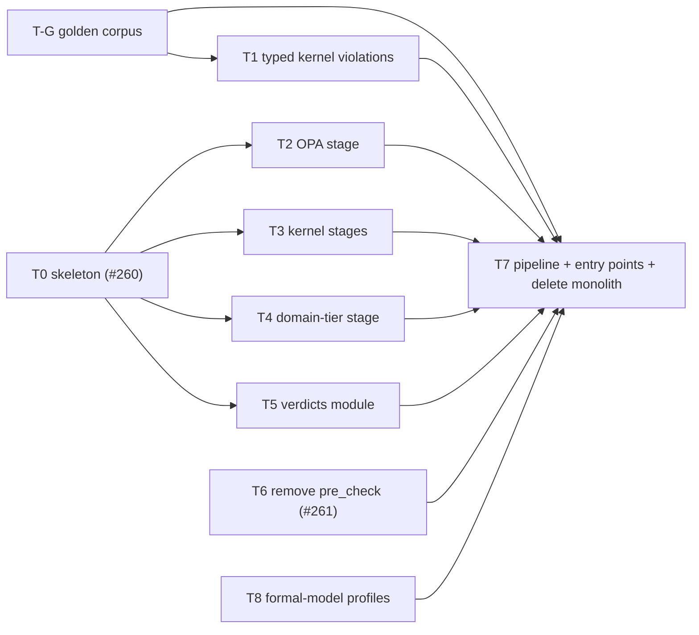

# PR 2 — Independent Task Prompts

**Source plan:** [governor_refactor_plan.md §PR 2](./governor_refactor_plan.md).
**Baseline:** `main` @ `6b71b2d` **plus open PRs #259, #260, #261**. Every task below assumes those three have merged. If one hasn't, rebase on it first or wait.

Each prompt below is self-contained. You can paste it into a fresh agent session, or hand it to a contributor, without other context.

## Status (updated 2026-09-26)

| Task | State | Where |
|---|---|---|
| T-G golden corpus | **Re-run.** The first attempt recorded a `TypeError` in all 25 scenarios and was discarded. The prompt now names the real APIs. | — |
| T0 skeleton + contracts | **In review** | [#260](https://github.com/google/cybernetic-agent-governance-engine/pull/260) |
| T1 typed violations | **Not started.** Nothing from the first run was worth keeping. | — |
| T2–T5 stages / verdicts | **Not started.** Start once #260 merges. | — |
| T6 remove `pre_check` | **In review** (follow-up fixed) | [#261](https://github.com/google/cybernetic-agent-governance-engine/pull/261) |
| T7 pipeline + delete monolith | Blocked on all of the above | — |
| **T8 formal-model profiles** (new) | **Not started.** Can start now. | — |

**Merged outside this plan, which changes the baseline:**
- **#259** deleted `CBF_FAIL_OPEN` everywhere. `revalidate_post_hitl` now evaluates OPA and then calls `_run_domain_tiers(..., phase=2)`, so **every phase-2 tier (CBF and fiscal) re-runs after human approval**, with LIFO rollback. CBF refusals surface as `CBF_BARRIER_VIOLATED`.
- **Design decisions** are recorded in [governor_refactor_plan.md §Resolved design questions](./governor_refactor_plan.md). Several prompts below depend on them:
  1. Fiscal re-runs after human approval, so `POST_HITL = {opa, cbf, fiscal}`.
  2. The formal model gains execution profiles (T8).
  3. NARROW: keep the code's seam and fix the model (T8).
  4. `CBF_FAIL_OPEN` is deleted (done in #259).
  5. `null_components.py` stays deny-by-default. The governor is built once, after plugins load (PR 4).
  6. One STPA rule set per domain package. Remove the duplicate `GeneratedSTPAValidator` (PR 4; T1 must not make that harder).

## New questions raised 2026-09-26 (with recommendations)

| # | Question | Recommendation |
|---|---|---|
| Q7 | At the input rail, three NeMo actions are always no-ops (`CheckApprovalTokenAction`, `CheckDataLatencyAction`, `CheckSlippageRiskAction`). Every STPA rule they depend on returns early unless the action is a real tool such as `execute_trade`, and no tool has been chosen at that point. Keep them? | **Delete them in PR 4b §4b.12**, together with their Colang flows (then run `make update-nemo-configmap`). They look like controls but never fire. The same rules are enforced at tool dispatch. Keep `CheckDrawdownLimitAction`: it checks CBF state that doesn't depend on the action name. |
| Q8 | #259 removed the combined "`CBF_FAIL_OPEN` + HMAC fallback" startup check, so production has no HMAC-fallback check at all. Add one now? | **No, keep it in PR 4a §4a.3.** This isn't a regression: the old check only fired when `CBF_FAIL_OPEN=true`, and the default was `false`. |
| Q9 | Is #259 a breaking change? | **Yes.** Setting `CBF_FAIL_OPEN=true` no longer bypasses the CBF, so setups without Redis now deny instead of allowing. The title now has `!` and the body a `BREAKING CHANGE:` footer. |
| Q10 | `proof/model.py` still proves Gap 3, a CBF skip that `CBF_FAIL_OPEN` caused. Remove it? | **Yes, in T8.** The docs already say the gap is closed by removal and point to T8. |

## Still open at baseline
- **The kernel still emits `list[str]` violations** in `_run_checks` (and, after #259, the OPA part of `revalidate_post_hitl`). Line numbers have shifted, so locate by symbol, not line.
- **`ClassificationEngine.classify` still falls back to substring matching** on string violations. PR 1 §1.2 is therefore not finished. For example, the NaN-confidence message is classified DEFERRABLE instead of HARD.
- **OPA verdicts are decoded inline in 3 places.** Find them with `rg -n "policy_resp" src/gateway/governance/symbolic_governor.py`.
- **`symbolic_governor.py` is still one ~2,700-line file**, imported by about 66 modules.

## Dependency graph



- **Can start now, in parallel:** T-G, T8.
- **After T-G merges:** T1. T1 changes behaviour, so the corpus must be frozen first.
- **After #260 merges, in parallel:** T2, T3, T4, T5.
- **T7 runs last**, after everything above.

## Shared rules — include verbatim in every prompt
```text
Repository: /Users/laah/Code/cybernetic-governance-engine (CAGE reference architecture).
Follow AGENTS.md at the repo root without exception. In particular:
- Never commit to main. Create the branch named in this task from origin/main (lowercase kebab-case, ≤30 chars after prefix).
- Conventional Commits: <type>(<scope>): <summary> ≤72 chars; breaking changes need "!" AND a "BREAKING CHANGE:" footer.
- Apache 2.0 license header on every new .py file under src/ and tests/.
- Every new test module: pytestmark = [pytest.mark.unit, pytest.mark.local].
- Always prefix commands with `uv run`. Inner loop: run only the tests you touch. Before declaring done: `make test-fast` must pass.
- Layer 1 (src/gateway/) must not import src/cage_*, src/compliance_bridge/, src/governed_financial_advisor/ or vendor SDKs. Verify with `uv run python scripts/check_import_boundaries.py --verbose`.
- Every fail-closed path you add needs a test that observes it FAIL (blocks), not only the happy path.
- Breaking changes are acceptable; do not add backward-compat shims unless this task explicitly says so.
- Stay inside the "Files you own" list. If you need to change anything else, stop and report instead.
- When done: push the branch, open a PR titled with the commit subject, and report: files changed, tests added, `make test-fast` result, and anything left undone.
```

---

## T-G — Freeze golden verdict corpus (re-run)
**Branch:** `test/governor-golden-corpus` (delete and recreate it; do not reuse commit `412c81c`) · **Commit:** `test(governance): freeze golden verdict corpus for governor refactor`

```text
<shared rules>

Goal: capture the CURRENT observable behaviour of SymbolicGovernor so later refactor tasks can
prove they changed nothing except the intended fixes.

WHY THIS IS A RE-RUN: the previous attempt recorded `TypeError: 'coroutine' object is not
iterable` for every scenario because it mocked the wrong APIs. Get these right:
- GeneratedSTPAValidator.validate(...) is SYNCHRONOUS. Mock it with MagicMock, never AsyncMock.
- The narrower lookup method is `find_narrower` (there is no `get_narrower`).
- ClassificationEngine.classify has signature `classify(context, action)`.
- There are no methods `validate_action` on the STPA validator or `evaluate_boundary` on the FTRA
  classifier. Before mocking ANY collaborator method, open its source and confirm the name,
  sync/async-ness, and signature. Prefer `create_autospec(RealClass, instance=True)` so a wrong
  name or signature fails at test time instead of being recorded as behaviour.
- Domain tiers are passed as `SymbolicGovernor(domain_tiers=[...])`. If a scenario needs CBF or
  fiscal behaviour, inject the real tier plugin (e.g. CBFTierPlugin) wrapping a mocked backend;
  with no tiers injected, _run_domain_tiers trivially passes.

Context: src/gateway/governance/symbolic_governor.py exposes validate_action(), govern(),
revalidate_post_hitl() and verify(). A multi-PR refactor will split this file into a package.
CBF_FAIL_OPEN no longer exists (#259). revalidate_post_hitl re-runs OPA and ALL phase-2 tiers.

Do:
1. tests/governor/golden/fixtures.py — ~40 deterministic scenarios covering:
   ALLOW; DENY via STPA, CBF refusal (reason strings "UNSAFE:", "RECONCILIATION_UNAVAILABLE:",
   "Fence epoch regression:"), OPA DENY, OPA unknown verdict, OPA MANUAL_REVIEW; confidence below
   threshold, NaN, inf, >1.0, non-numeric; FTRA irreversible; FTRA semantic breach; consensus
   REJECT/ESCALATE; bounding HARD_BLOCK/HITL_ESCALATE; fiscal rejection (FULL and POST_HITL);
   ungoverned action; DEFER; PAUSE (flag on/off); NARROW (narrower present/absent).
   No network, no real Redis.
2. tests/governor/golden/test_golden_verdicts.py — for each scenario, run each applicable entry
   point and record: verdict or exception type; first violation's control id/code (not full
   message text); whether a seal was issued; which collaborator methods were called, in order.
3. Expected results in tests/governor/golden/expected.json, generated by a `--regen-golden`
   pytest option (add ONLY that option to tests/conftest.py). The default run compares and fails
   on any diff with a readable per-scenario diff.
4. HARD GUARD: the test module must fail if ANY recorded outcome is TypeError, AttributeError or
   NameError, and regen must refuse to write such an outcome. Those mean the harness is wrong,
   not that the governor behaves that way.
5. tests/governor/golden/README.md: how to regenerate; any regen must be justified
   scenario-by-scenario in the PR description.

Files you own: tests/governor/golden/**, the --regen-golden option in tests/conftest.py.
Do NOT modify anything under src/.
Acceptance: golden test passes on main; the HARD GUARD has its own test that feeds a TypeError
outcome and observes the failure; two consecutive regens produce identical expected.json;
at least 5 distinct verdict types appear in expected.json; `make test-fast` green.
```

---

## T0 — `governor/` package skeleton and pipeline contracts ✅ in review
**Branch:** `refactor/governor-skeleton` · **PR:** [#260](https://github.com/google/cybernetic-agent-governance-engine/pull/260)

No prompt needed. What landed, for downstream tasks:
- `governor/errors.py` holds `GovernanceError`, re-exported from `symbolic_governor.py` so identity is preserved.
- `governor/pipeline.py` holds `Profile`, `OpaVerdict`, `StageContext`, `Stage`, `PipelineResult`, `PROFILE_STAGES`.
- `pipeline.py` does **not** import `proof.model` (a Layer 1 kernel module must not depend on the proof package). Membership in `proof.model.TIERS` is checked in `tests/governor/test_contracts.py`.
- `PROFILE_STAGES[POST_HITL] = {"opa", "cbf", "fiscal"}`, per design decision 1.

---

## T1 — Typed kernel violations; delete substring classification
**Branch:** `refactor/typed-kernel-violations` · **Commit:** `refactor(governance)!: emit typed kernel violations, drop string classification`


```text
<shared rules>

CHANGES SINCE THIS PROMPT WAS FIRST WRITTEN (these override anything below):
- #259 rewrote revalidate_post_hitl. Its CBF and fiscal checks now run through _run_domain_tiers(phase=2) and already return Violation objects, which are stringified by _violations_to_strings(). Only its OPA block still builds strings. Delete _violations_to_strings() once nothing needs it. The CBF_REFUSED / CBF_ERROR rows in the mapping below are superseded: keep the tier's own codes (e.g. CBF_BARRIER_VIOLATED).
- Decision 6 moves each domain's STPA rule set into its domain package in PR 4. When you change the generator template, keep the generic compiler/validator domain-agnostic, and don't add finance-specific codes to Layer 1.
- Locate code by symbol, not by the line numbers quoted below; they have drifted.
- Requires T-G merged first.

Goal: finish PR 1 §1.2. The kernel still builds `violations: list[str]` in
SymbolicGovernor._run_checks (≈L841) and revalidate_post_hitl (≈L1706), and
ClassificationEngine.classify (src/gateway/governance/classification_engine.py L97-118) falls back
to substring matching on strings. Free-text classification is a security bug class (see
plans/stera_security_review.md H1): attacker-influenced text can move a HARD violation into a
softer bucket. Example today: the NaN-confidence message contains "confidence" and is classified
DEFERRABLE instead of HARD.

Do:
1. Replace every kernel string violation with contracts.Violation(tier, code, message, kind).
   Required mapping:
   FTRA irreversible (semantics valid)        FTRA_IRREVERSIBLE        HITL
   FTRA semantic breach / classifier error    FTRA_SEMANTIC_BREACH / FTRA_ERROR   HARD
   STPA UCA-n                                 STPA_UCA_<n>             HARD
   Confidence finite, below threshold         CONFIDENCE_BELOW_THRESHOLD  DEFERRABLE if < FRIA_ZONE_DEFER else HITL
   Confidence NaN / inf / out of [0,1] / non-numeric  CONFIDENCE_INVALID  HARD
   OPA DENY / GOVERNANCE_VIOLATION            OPA_DENY                 HARD
   OPA unknown verdict                        OPA_UNKNOWN_VERDICT      HARD
   OPA exception                              OPA_ERROR                HARD
   OPA MANUAL_REVIEW                          OPA_MANUAL_REVIEW        HITL
   POAM-TIER2-001 structural override         TIER2_STRUCTURAL_OVERRIDE HITL
   CBF refusal / CBF exception (post-HITL)    CBF_REFUSED / CBF_ERROR  HARD
2. GeneratedSTPAValidator.validate() must return list[Violation]. Change the generator template in
   src/gateway/governance/stpa_compiler.py, then regenerate and commit artifacts:
   `uv run python scripts/check_stpa_freshness.py`.
3. The _stpa_violation_count must count ONLY STPA violations (today it also counts FTRA ones,
   which turns every FTRA HITL case into DENY). Remove the count entirely if classification no
   longer needs it.
4. ClassificationEngine: change ClassificationContext.violations to list[Violation]; delete the
   string-normalisation branch (L102-118) and the cbf_violation/stpa_violation_count fields if unused.
   Passing a str must raise TypeError. classify() must never read Violation.message.
5. Keep GovernanceError messages human-readable (use violation.message); refusal receipts keep
   violated_rule = first violation's message and gain control_id = first violation's code.

Tests:
- tests/test_classification_engine.py: adversarial cases — HARD violations whose message contains
  "exceeds max", "rate limit", "Manual Review Required", "confidence" still → DENY; str input →
  TypeError.
- NaN / inf / 1.5 / "abc" confidence → DENY (not DEFER) via validate_action.
- FTRA irreversible + valid semantics + no other violations → REQUIRE_APPROVAL.
- Update existing tests that asserted string violation lists.
If T-G's golden corpus is merged: regenerate ONLY the scenarios whose change is intended (NaN/inf
confidence → DENY; FTRA irreversible → REQUIRE_APPROVAL) and list them in the PR description.

Files you own: symbolic_governor.py violation-construction sites only, classification_engine.py,
generated_stpa_validator.py, stpa_compiler.py, generated STPA artifacts, related tests.
Do NOT restructure symbolic_governor.py into modules (that is T3/T7).
Acceptance: `grep -n "violations: list\[str\]" src/gateway/governance/` → zero hits;
`grep -n "isinstance(v, str)" src/gateway/governance/classification_engine.py` → zero hits;
stpa-freshness check passes; `make test-fast` green.
```

---

## T2 — Single OPA verdict decoder and OPA stage
**Branch:** `refactor/governor-opa-stage` · **Commit:** `refactor(governance): centralise OPA verdict decoding in governor stage`
**Requires:** T0 merged.

```text
<shared rules>

Goal: OPA responses are decoded in three places in symbolic_governor.py (≈L1274, L1361, L1815),
each re-implementing the same allowlist. Replace them with one decoder and one stage.

Do:
1. src/gateway/governance/governor/stages/opa.py:
   def decode_opa_verdict(raw: object) -> OpaVerdict | None
     - str: exact match (after .strip().upper()) of "ALLOW" → ALLOW; "DENY" or
       "GOVERNANCE_VIOLATION" → DENY; "MANUAL_REVIEW" → MANUAL_REVIEW; anything else → None.
     - dict: prefer key "decision" then "allow"; bool True → ALLOW, False → DENY; else recurse on str.
     - bool: True → ALLOW, False → DENY. Any other type → None.
     None means "unknown verdict" and callers MUST treat it as DENY.
   class OpaStage (implements governor.pipeline.Stage; name="opa", mutating=False):
     run() builds the payload {**params, "action": action, "tool_input": params}, awaits
     opa_client.evaluate_policy, and returns [] for ALLOW, else one Violation per T1's mapping
     (OPA_DENY / OPA_UNKNOWN_VERDICT / OPA_ERROR → HARD; OPA_MANUAL_REVIEW → HITL).
     It exposes the decoded verdict via a return attribute or result object so the pipeline can
     place it in PipelineResult.opa_verdict.
   Constructor takes a PolicyClient (src/gateway/governance/contracts.py protocol) — no import of
   src.gateway.core.policy concretes.
2. Replace the three inline decode blocks in symbolic_governor.py with calls to decode_opa_verdict
   (do NOT yet wire OpaStage into the pipeline — T7 does that).
   If T1 has not merged, keep producing the existing message strings at those call sites.

Tests (tests/governor/stages/test_opa_stage.py): table test over ≥20 raw inputs incl. "allow",
" ALLOW ", "REJECT", "ERROR", "NONE", None, {}, {"allow": None}, {"allow": True, "decision":
"DENY"} (decision wins → DENY), True, False, 1, []; stage returns HARD on exception; stage never
returns [] unless the verdict is ALLOW.

Files you own: governor/stages/opa.py, the 3 decode blocks in symbolic_governor.py, its tests.
Acceptance: `grep -c "policy_resp.get(" src/gateway/governance/symbolic_governor.py` → 0;
`make test-fast` green; golden corpus unchanged.
```

---

## T3 — Kernel stages: FTRA, STPA, confidence
**Branch:** `refactor/governor-kernel-stages` · **Commit:** `refactor(governance): extract ftra, stpa and confidence governor stages`
**Requires:** T0 merged. Can land before or after T1; see the last step of the prompt.

```text
<shared rules>

Goal: move the three kernel checks out of SymbolicGovernor._run_checks into Stage implementations
under src/gateway/governance/governor/stages/, without changing behaviour.

Do:
1. stages/ftra.py — FtraStage(name="ftra", mutating=False). Move _get_ftra_classifier and
   _ftra_boundary_check logic here (including the fail-closed IRREVERSIBLE_TERMINAL on exception
   and the Prometheus counter). Expose the FtraBoundaryResult for PipelineResult.ftra.
   Keep SymbolicGovernor._ftra_boundary_check as a one-line delegate (tests patch it; T7 removes it).
2. stages/stpa.py — StpaStage(name="stpa", mutating=False) wrapping GeneratedSTPAValidator,
   including the sim_mode latency_ms default for DRY_RUN profile. An exception from the validator
   must yield one HARD violation (code STPA_ERROR), never "no violations".
3. stages/confidence.py — ConfidenceStage(name="confidence", mutating=False): the full current
   validation (type, NaN, inf, range, threshold) plus the POAM-TIER2-001 structural corroboration.
   The corroboration needs the STPA outcome and OPA verdict: read them from StageContext (add
   optional fields `stpa_violation_count: int = 0` to StageContext in governor/pipeline.py — the
   only change you may make to T0's contracts).
   Remove the misleading span attribute tier2.confidence.independently_verified=True; replace with
   tier2.confidence.source="agent_self_report".
4. _run_checks calls the three stages in place of the inline code. Preserve span names
   (cage.ftra_boundary_gate, cage.stpa_check, cage.confidence_check) so dashboards keep working.
5. If T1 has merged, stages return typed Violations per T1's mapping. If not, return the existing
   strings wrapped so _run_checks behaviour is identical — note which in the PR description.

Tests (tests/governor/stages/test_{ftra,stpa,confidence}_stage.py): each fail-closed path
(classifier raises; validator raises; NaN/inf/-0.1/1.1/"x"/None confidence) observed blocking;
happy paths return [].

Files you own: governor/stages/{ftra,stpa,confidence}.py, the corresponding blocks in
symbolic_governor.py, StageContext optional field, their tests.
Acceptance: _run_checks shrinks by the moved code; golden corpus unchanged (or only T1-intended
diffs if T1 merged first); `make test-fast` green.
```

---

## T4 — Domain-tier stage adapter
**Branch:** `refactor/governor-tier-stage` · **Commit:** `refactor(governance): wrap domain tiers as governor stages`
**Requires:** T0 merged.

```text
<shared rules>

Goal: domain tiers (GovernanceTierPlugin in src/gateway/governance/contracts.py) are executed by
SymbolicGovernor._run_domain_tiers and _rollback_committed. Wrap each tier as a Stage so the
unified pipeline (T7) can treat kernel and domain stages uniformly.

Do:
1. src/gateway/governance/governor/stages/domain_tiers.py:
   class DomainTierStage(Stage): wraps one GovernanceTierPlugin.
     name = tier.tier_name; mutating = (tier.phase == 2)
     run(): phase 1 → tier.evaluate(); phase 2 → tier.commit(). Any exception → one HARD
       Violation code TIER_EXCEPTION (current semantics).
     rollback(): phase 2 only → tier.rollback(); exceptions propagate to the caller.
     claims(ctx) -> bool: tier.claims_action(action, params); an exception in claims_action →
       treat as claimed AND return a HARD TIER_EXCEPTION on run (fail closed; today it escapes).
   def order_stages(tiers) -> tuple[DomainTierStage, ...]: sorted by (phase, order, tier_name);
     raises ValueError on duplicate tier_name (move the check from SymbolicGovernor.__init__).
   async def rollback_lifo(committed: Sequence[DomainTierStage], ctx) -> list[Violation]:
     move _rollback_committed here; every rollback attempted; each failure → HARD ROLLBACK_FAILED.
2. SymbolicGovernor._run_domain_tiers and _rollback_committed become thin delegates to the above
   (T7 removes them). registered_tier_names() must return the same list as before.

Tests (tests/governor/stages/test_domain_tier_stage.py): phase-1 vs phase-2 dispatch; exception
in evaluate/commit/claims_action → HARD; LIFO rollback order; one rollback raising does not stop
the others and yields ROLLBACK_FAILED; duplicate names rejected.
tests/test_tier_registry_formal_parity.py must pass UNCHANGED.

Files you own: governor/stages/domain_tiers.py, the two methods + duplicate check in
symbolic_governor.py, their tests.
Acceptance: golden corpus unchanged; `make test-fast` green.
```

---

## T5 — Verdicts module: receipts, seals and verdict handlers
**Branch:** `refactor/governor-verdicts` · **Commit:** `refactor(governance): consolidate refusal receipts and seal issuance`
**Requires:** T0 merged.

```text
<shared rules>

Goal: symbolic_governor.py builds RefusalReceipt ~4 times, issues routing seals ~4 times, and
derives thread_id ~5 times, each slightly differently. Consolidate into one module.

Do: src/gateway/governance/governor/verdicts.py
  def resolve_thread_id(params) -> str   # transaction_id → thread_id → "unknown"
  def build_refusal_receipt(action, params, violations, tier_failures, *, violated_tier_default=
      "SYMBOLIC_GOVERNOR") -> RefusalReceipt
      # superset of the richest current construction (schema_version="v2", attempted_params
      # excluding thread/transaction ids, standing_at_refusal, standing_snapshot, control_id,
      # protected_consequence, non_formation_proof, tier_failures).
  async def publish_refusal(receipt) -> None
      # emit to the evidence stream via the existing GovernanceEventBus/EvidenceStreamSink API
      # (AGENTS.md: "Refusals are primary evidence"). Failure to publish must be logged at ERROR
      # and must NOT turn a DENY into anything else.
  async def issue_seal(action, params, *, path: str) -> str
      # wraps routing_seal.generate_seal_with_evidence with span "cage.routing_seal" and
      # attributes cage.seal_issued / cage.seal_path.
  Move _park_defer_context here unchanged (its Redis fallback is out of scope).
  Verdict handlers: handle_deny, handle_require_approval, handle_defer, handle_pause,
  handle_narrow — each takes (action, params, classification_result, pipeline_result-like inputs)
  and returns the exact dict shape validate_action returns today (or raises GovernanceError for
  DENY). Move the bodies from validate_action; keep response keys identical.

Then replace the duplicated code in govern(), revalidate_post_hitl(), validate_action() with calls
into verdicts.py. Do NOT change which checks run or their order.

Tests (tests/governor/test_verdicts.py): receipt fields for each entry point match today's
(assert on golden corpus or explicit dicts); publish_refusal called exactly once per DENY across
govern/validate_action/revalidate_post_hitl; publish failure still raises GovernanceError; seal
span attributes set.

Files you own: governor/verdicts.py, the receipt/seal/thread-id/verdict-handler code in
symbolic_governor.py, its tests.
Acceptance: `grep -c "RefusalReceipt(" src/gateway/governance/symbolic_governor.py` → 0;
`grep -c "generate_seal_with_evidence(" src/gateway/governance/symbolic_governor.py` → 0;
golden corpus unchanged except the new publish_refusal call (document it); `make test-fast` green.
```

---

## T6 — Remove `SymbolicGovernor.pre_check` ✅ in review
**Branch:** `refactor/remove-pre-check` · **PR:** [#261](https://github.com/google/cybernetic-agent-governance-engine/pull/261)

No prompt needed. What landed:
- `nemo_context.compute_nemo_context` replaces `pre_check` and fails closed.
- NeMo actions now **deny** when `pre_check_results` is missing (previously they allowed); tests were flipped to match.

**Follow-up resolved in #261:**
- Input rails run before the model has chosen a tool, so no real action exists. Both callers (the inference proxy and the NeMo input node) now pass one named constant, `nemo_context.INPUT_RAIL_PROBE_ACTION`.
- `NullSafetyFilter.verify_action` is now async, matching the `SafetyFilter` protocol. Bare-kernel mode therefore denies via its explicit verdict instead of a `TypeError`.

**Open finding (decision needed, see the plan):** every STPA UCA check returns early unless the action is `execute_trade`, `execute_trade_bounded` or `write_db`. So at the input rail, `CheckApprovalTokenAction`, `CheckDataLatencyAction` and `CheckSlippageRiskAction` can never block. Only the CBF-backed `CheckDrawdownLimitAction` has any effect. These UCAs are still enforced at tool dispatch by the governor.

---

## T7 — Unified pipeline, thin entry points, delete the monolith
**Branch:** `refactor/governor-pipeline` · **Commit:** `refactor(governance)!: unify governor entry points on one staged pipeline`
**Requires:** T-G, T0–T6 and T8 merged.

```text
<shared rules>

CHANGES SINCE THIS PROMPT WAS FIRST WRITTEN (these override anything below):
- POST_HITL = {opa, cbf, fiscal} (decision 1), not {opa, cbf}. In rule (a), "domain tiers only if they claim the action" applies under every profile. Add a pipeline test: after approval, a fiscal budget exhausted while the request waited → DENY, with the CBF commit rolled back.
- CBF_FAIL_OPEN and assert_safe_operational_state's fail-open branch were deleted in #259. Don't recreate them in _legacy_startup.py.
- The profile-parity test should use T8's proof/model.py profiles as its source of truth once T8 has merged.
- T-G's golden corpus already reflects #259 behaviour (fiscal re-check post-HITL).

Goal: every entry point runs ONE pipeline under a Profile; symbolic_governor.py is deleted.
Prerequisite modules exist: governor/pipeline.py (contracts), stages/{ftra,stpa,confidence,opa,
domain_tiers}.py, verdicts.py, errors.py. The golden corpus in tests/governor/golden/ is the
behavioural oracle.

Do:
1. governor/pipeline.py — implement:
   async def run_pipeline(stages, ctx, *, profile) -> PipelineResult
   Rules (identical for all profiles):
     a. Select stages whose name ∈ PROFILE_STAGES[profile] (domain tiers only if they claim the action).
     b. Read-only stages in fixed order: ftra, stpa, opa, confidence, then phase-1 domain tiers
        by (order, name). Stop at the first HARD violation; collect other kinds.
        (OPA before confidence so the Tier-2 corroboration sees the verdict.)
     c. Mutating stages run ONLY if (b) produced zero violations, in (order, name) order; on the
        first violation, rollback_lifo() all previously committed stages. DRY_RUN never calls a
        mutating stage's run(); it records them as skipped.
     d. OPA ALWAYS runs before any mutating stage. No asyncio.gather anywhere in the pipeline.
     e. A CBF/domain commit is a violation whenever it reports not committed — never inspect
        reason strings.
     f. Ungoverned actions (no domain tier claims): run ftra, stpa, opa only; set span attribute
        governance.governed=false.
2. governor/governor.py — class SymbolicGovernor with the same constructor signature as today.
   validate_action: policy-version pin check → run_pipeline(FULL) → ClassificationEngine →
     verdicts.handle_*; on ALLOW, issue_seal. If issue_seal raises after mutating stages
     committed → rollback_lifo() them, then re-raise (PR 3 will generalise this).
   govern: run_pipeline(FULL); any violation → GovernanceError via verdicts; else issue_seal.
   revalidate_post_hitl: run_pipeline(POST_HITL); same contract as govern.
   verify: run_pipeline(DRY_RUN); returns PipelineResult; never raises GovernanceError.
   Keep registered_tier_names() and register_invariant() (PR 4 moves the latter).
   Target: governor.py < 300 lines; no file in governor/ > 400 lines.
3. Move remaining module-level items: feature-flag helpers and startup assertions →
   governor/_legacy_startup.py (PR 4 replaces it; keep behaviour identical), assert_safe_
   operational_state → same file.
4. DELETE src/gateway/governance/symbolic_governor.py. Update src/gateway/governance/__init__.py
   lazy export to the new path. Rewrite all 66 importers (src + tests) to
   `from src.gateway.governance.governor import ...`; update patch() targets
   ("src.gateway.governance.symbolic_governor.X" → new module paths). Update
   scripts/check_import_boundaries.py allowlists, scripts/verify_governor.py,
   scripts/measure_paper_metrics.py, .github/workflows/*.yml references.
5. Tests:
   - tests/governor/test_pipeline.py: rules a–f, each observed (e.g. OPA DENY → CBF commit mock
     never awaited; commit refusal with reason "Fence epoch regression" → DENY in FULL and POST_HITL;
     seal failure → committed stages rolled back LIFO; DRY_RUN never commits).
   - Profile parity: for every golden scenario, POST_HITL violations ⊆ FULL violations restricted
     to POST_HITL stages.
   - tests/test_tier_registry_formal_parity.py passes unchanged; add assertion that every
     stage name used by run_pipeline ∈ proof.model.TIERS.
   - Golden corpus: must match. Any diff must be an intended fix, listed per scenario in the PR.
   - Migrate tests/test_symbolic_governor*.py → tests/governor/ (one file per module).

Acceptance:
- `grep -rn "symbolic_governor" src/ tests/ scripts/ .github/` → zero hits (docs are PR 5).
- `grep -rn "asyncio.gather" src/gateway/governance/governor/` → zero hits.
- `uv run python scripts/check_import_boundaries.py --verbose` passes.
- `make test-fast` green; `make docs-check` not made worse.
Report golden diffs explicitly.
```

---

## T8 — Execution profiles and NARROW in the formal model (new)
**Branch:** `feat/formal-model-profiles` · **Commit:** `feat(governance): model execution profiles and narrow seam in proof`
**Requires:** nothing. Can run in parallel with T-G.

```text
<shared rules>

Goal: make proof/model.py describe what the code does, per design decisions 2 and 3 in
plans/governor_refactor_plan.md §Resolved design questions.

Context: proof/model.py defines TIERS (ftra, stpa, confidence, cbf, opa, fiscal, consensus, causal,
fria) and PHASES, and models NARROW as "all tiers PASS + soft_threshold_exceeded → seal on clamped
params". The code (PR 1 §1.4 seam) instead lets a domain Narrower propose clamped params for
NARROWABLE violations; NARROW is issued only if a full re-run on the clamped params passes.
revalidate_post_hitl runs only OPA + phase-2 tiers. The model does not describe that path.

Do:
1. Add execution profiles to proof/model.py: FULL, POST_HITL, DRY_RUN, each mapped to the set of
   tiers it evaluates. POST_HITL = {opa, cbf, fiscal}. DRY_RUN evaluates everything but commits
   nothing. Keep the names identical to src/gateway/governance/governor/pipeline.py Profile and
   PROFILE_STAGES (from #260). Do NOT import src/ from proof/ or vice versa; parity is a test.
2. Model property: under every profile, an ALLOW (seal) requires every tier in that profile to
   PASS. Add a property/exhaustive check in the model's existing style, plus a negative case: a
   profile whose tier FAILs never yields ALLOW.
3. Rewrite NARROW in the model to match the code: NARROW requires (a) every violation is
   NARROWABLE, (b) a domain narrower returned a proposal, (c) re-evaluating the FULL profile on the
   clamped params yields zero violations. Otherwise DENY. Remove the "all tiers PASS +
   soft_threshold_exceeded" definition. Add a negative case: narrower present but re-run fails → DENY.
4. Parity test (tests/test_formal_profile_parity.py): proof profiles == PROFILE_STAGES, and every
   tier name in PROFILE_STAGES is in TIERS. Check tests/test_tier_registry_formal_parity.py still
   passes; if finance's "bounding" tier is not in TIERS, report it rather than silently adding it.
5. If STPA/proof artifacts are generated from the model, regenerate them:
   `uv run python scripts/check_stpa_freshness.py`.
6. Remove the Gap 3 sub-proof (CBF tier skipped via CBF_FAIL_OPEN). #259 deleted the flag, so
   the configuration is unreachable. Update tests/test_no_direct_bind_proof.py, proof/README.md and
   docs/architecture/FORMAL_VERIFICATION.md (§ Gap table and §7.1) to match.
7. Update the NARROW and profile wording in docs/architecture/GATEWAY_ARCHITECTURE.md in the same PR.

Files you own: proof/**, tests/test_formal_profile_parity.py, tests/test_no_direct_bind_proof.py,
the NARROW/profile sections of GATEWAY_ARCHITECTURE.md, the Gap 3 parts of FORMAL_VERIFICATION.md.
Acceptance: each new model property has a failing counter-example test; parity test passes;
stpa-freshness passes; `make docs-check` not made worse; `make test-fast` green.
```

---

## Suggested assignment
| Parallel lane | Tasks |
|---|---|
| Lane A | T-G → T1 |
| Lane B | (after #260) T2 → T5 |
| Lane C | (after #260) T3 |
| Lane D | (after #260) T4 |
| Lane E | T8 |
| Integrator | T7 after all lanes merge |

If two lanes race on `symbolic_governor.py`, the second to merge rebases. Each task edits a disjoint block, so conflicts should be textual only.
