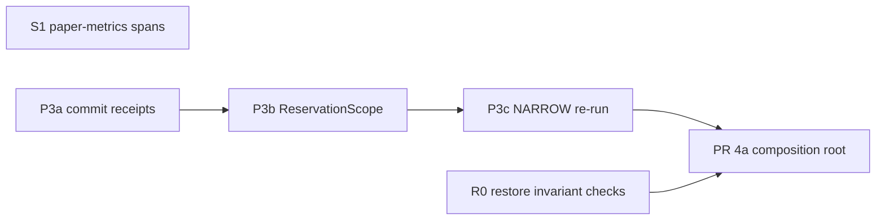

# Next Steps After PR 2 — Independent Task Prompts

**Source plans:** [governor_refactor_plan.md §PR 3](./governor_refactor_plan.md) · [governor_refactor_plan_pr4_5.md §PR 4a](./governor_refactor_plan_pr4_5.md).
**Baseline:** `main` @ `201d0b7` (PR 2 complete: #260–#274).

Each prompt is self-contained. Paste one into a fresh agent session, together with the shared-rules block. Prompts cite code **by symbol**. Line numbers are approximate as of `201d0b7`.

## Why the prompts differ from the plan
Checking the code at `201d0b7` found problems the original PR 3 plan doesn't cover. They're folded into the tasks below:

| # | Finding at HEAD | Task |
|---|---|---|
| F1 | T7 dropped the V1–V4 checks in `SymbolicGovernor.register_invariant` (uniqueness, namespaced `state_key`, `threshold_key` resolves, `gamma ∈ (0,1]`). It's now a bare append. | R0 |
| F2 | Nothing reads `SymbolicGovernor._invariants`. The barriers healthcare and physical-AI register are never enforced (this was already true in the monolith). | 4a |
| F3 | `scripts/measure_paper_metrics.py` maps 4 tier rows to spans nothing emits. | S1 |
| F4 | `validate_action` / `govern` / `revalidate_post_hitl` call `issue_seal()` **after** `run_pipeline()` has committed phase-2 tiers. If the seal fails, the commits leak. | P3b |
| F5 | `rollback_lifo` catches `Exception` only, so a `CancelledError` between commit and seal leaks every commit. | P3b |
| F6 | CBF and dose-barrier `rollback()` restore a magnitude re-read from `params`, not what `commit()` spent (H5). | P3a |
| F7 | `FiscalTierPlugin` keeps tokens in `self._tokens` keyed by `params["transaction_id"]`, with a random-UUID fallback. With no `transaction_id`, rollback can't find the token and the reservation leaks. The dict is never pruned, and it's shared across concurrent requests. | P3a |
| F8 | `KinematicBarrierTier` is phase 2 and commits to the CBF, but has no `rollback()`. Every rollback therefore yields `ROLLBACK_FAILED` and strands CBF state. | P3a |
| F9 | With `CAGE_NARROW_ENABLED=true`, `handle_narrow` seals `narrowed_params` without re-running any check. The NARROWABLE stage (e.g. fiscal) was already rolled back, so the seal authorises an action with no reservation. This contradicts the NARROW rule in `proof/model.py` (T8, #264). | P3c |
| F10 | `SymbolicGovernor.__init__` accepts `**kwargs`, so a misspelt dependency is silently ignored. | 4a |

## Dependency graph

- **Can start now, in parallel:** R0, S1, P3a.
- **Serial:** P3a → P3b → P3c → 4a.
- **PR 4b and PR 5:** generate fresh prompts after 4a merges. Their plan sections name symbols that 4a renames.

## Shared rules — include verbatim in every prompt
```text
Repository: /Users/laah/Code/cybernetic-governance-engine (CAGE reference architecture).
Follow AGENTS.md at the repo root without exception. In particular:
- Never commit to main. Create the branch named in this task from origin/main (lowercase kebab-case, ≤30 chars after prefix).
- Conventional Commits: <type>(<scope>): <summary> ≤72 chars; breaking changes need "!" AND a "BREAKING CHANGE:" footer.
- Apache 2.0 license header on every new .py file under src/ and tests/.
- Every new test module: pytestmark = [pytest.mark.unit, pytest.mark.local].
- Always prefix commands with `uv run`. Inner loop: run only the tests you touch. Before declaring done:
  uv run pytest tests/ -m "local or unit" -n auto --dist loadscope --no-cov -p no:langsmith -p no:langsmith_plugin --tb=line -q
  must pass (equivalent to `make test-fast`).
- Layer 1 (src/gateway/) must not import src/cage_*, src/compliance_bridge/, src/governed_financial_advisor/ or vendor SDKs. Verify with `uv run python scripts/check_import_boundaries.py --verbose`.
- Every fail-closed path you add needs a test that observes it FAIL (blocks), not only the happy path. No placeholder tests.
- Breaking changes are acceptable; do not add backward-compat shims unless this task explicitly says so.
- Golden corpus (tests/governor/golden/) is the behavioural oracle. Run it with
  `uv run pytest tests/governor/golden/test_golden_verdicts.py -n0 -vv --no-cov -p no:randomly`.
  Regenerate (`--regen-golden`) ONLY for intended changes and justify each changed scenario in the PR body.
- Doc-reference gate: `uv run python scripts/check_doc_references.py` must not gain failures vs origin/main (55 pre-existing non-partner failures).
- STPA freshness: `uv run python scripts/check_stpa_freshness.py` must pass.
- Locate code by symbol (grep), not by the line numbers quoted in this prompt.
- Tooling: `rg` is not installed; use grep. In zsh, quote globs such as --include='*.py'.
- Stay inside the "Files you own" list. If you need to change anything else, stop and report instead.
- When done: push the branch, open a PR titled with the commit subject (gh pr create), and report: files changed, tests added, full-suite result, golden diffs, anything left undone. Do NOT merge.
```

---

## R0 — Restore fail-closed invariant registration checks
**Branch:** `fix/invariant-validation` · **Commit:** `fix(governance): restore fail-closed invariant registration checks`
**Requires:** nothing. Small.

```text
<shared rules>

Context: PR #272 (T7) rewrote SymbolicGovernor in src/gateway/governance/governor/governor.py.
register_invariant() became `self._invariants.append(invariant)`. The deleted monolith validated
each barrier at registration, so a malformed barrier fails at startup instead of silently weakening
safety. Callers: src/cage_healthcare/plugin.py (register → governor.register_invariant(barrier)) and
src/cage_physical_ai/plugin.py (SpatialSeparationBarrier, KinematicVelocityBarrier,
TorqueSaturationBarrier). (Separately, nothing reads _invariants yet. PR 4a fixes that. Do NOT
attempt it here.)

Restore these four checks exactly, raising ValueError on failure:
  V1 uniqueness: invariant_id not already registered → "duplicate invariant registration: <id>"
  V2 state_key must contain ':' (namespaced, prevents cross-domain Redis key collisions)
  V3 threshold_key (dot path) must resolve in load_and_validate_thresholds().model_dump()
     (src/gateway/governance/schemas/thresholds.py) — KeyError/TypeError → ValueError
  V4 0 < gamma <= 1

Do:
1. New module src/gateway/governance/governor/invariants.py:
   def validate_invariant(invariant: InvariantModel, registered: Sequence[InvariantModel]) -> None
   (keep governor.py under 300 lines; it's 279 now).
2. register_invariant() calls validate_invariant(invariant, self._invariants) before appending.

Tests (tests/governor/test_invariant_registration.py): V1–V4, each observed raising, and the valid
barrier accepted. Also: the real healthcare and physical-AI plugins register their barriers against
the real thresholds tree without raising (this catches a V3 regression against actual config).
Build the governor the way existing tests do (see tests/governor/golden/fixtures.py).

Files you own: governor/invariants.py (new), register_invariant in governor/governor.py, the new test.
Acceptance: full suite green; G3 passes.
```

---

## S1 — Align paper-metrics span map with emitted spans
**Branch:** `fix/paper-metrics-spans` · **Commit:** `fix(governance): emit per-tier spans and align paper-metrics map`
**Requires:** nothing. Small.

```text
<shared rules>

Context: scripts/measure_paper_metrics.py TIER_SPAN_MAP harvests per-tier durations by span name.
Since the governor refactor (#272), these names are emitted nowhere under src/:
cage.cbf_check, cage.fiscal_limit_reserve, cage.consensus_gate, cage.fria_check.
Spans that do exist include: cage.ftra_boundary_gate, cage.stpa_check, cage.confidence_check
(governor/stages/*.py), governance.opa_check (src/gateway/core/policy.py),
cage.validate_action and symbolic_governor.{govern,revalidate_post_hitl,verify} (governor/governor.py).
Domain tiers (cbf, fiscal, consensus, causal, dose_barrier, ...) run through
DomainTierStage (governor/stages/domain_tiers.py) and currently emit no span.

Do:
1. In DomainTierStage, wrap every tier hook call (evaluate / commit / preview / rollback) in ONE
   generic span named f"cage.tier.{tier_name}". Attributes: cage.tier.phase, cage.tier.hook,
   cage.tier.violation_count, and cage.tier.exception (type name) when the hook raised. Keep it
   domain-agnostic: no tier names hard-coded in Layer 1.
2. TIER_SPAN_MAP: map CBF → cage.tier.cbf, Fiscal → cage.tier.fiscal, Consensus → cage.tier.consensus,
   Causal → cage.tier.causal (drop the "no dedicated span yet" comment). For FRIA: grep for a tier
   whose tier_name is "fria". If none exists, remove the row and say so in the PR body. Don't invent one.
   Fix the stale comment "Span names emitted by SymbolicGovernor._run_checks()".
3. Update span-name mentions in docs/compliance/REGION_GUARD_AUDIT.md (the list containing
   cage.cbf_check, cage.opa_pre_check, ...) to the real names.

Tests (tests/governor/stages/test_domain_tier_spans.py, using an InMemorySpanExporter the way other
tests in tests/ do; grep for InMemorySpanExporter): commit and evaluate each emit cage.tier.<name>
with correct attributes; a raising hook still ends the span, with cage.tier.exception set; and a test
asserting every TIER_SPAN_MAP value is either emitted by a stub-tier governor run or is one of the
kernel span names above (import the map from the script, e.g. via importlib).

Files you own: governor/stages/domain_tiers.py (span only), scripts/measure_paper_metrics.py,
docs/compliance/REGION_GUARD_AUDIT.md span list, the new test.
Acceptance: `grep -rn "cage.cbf_check\|cage.fiscal_limit_reserve\|cage.consensus_gate\|cage.opa_pre_check" src scripts docs`
→ zero hits; golden corpus unchanged; full suite green.
```

---

## P3a — Commit receipts for phase-2 tiers
**Branch:** `refactor/commit-receipts` · **Commit:** `refactor(governance)!: return commit receipts from phase-2 tiers`
**Requires:** nothing (can run parallel with R0/S1). Breaking: the `GovernanceTierPlugin` contract changes.

```text
<shared rules>

Goal: rollback must undo exactly what commit did. Today it re-derives the undo from request params.

Bugs at HEAD (each needs a regression test that fails before your change):
 B1 (H5) CBFTierPlugin.rollback (src/cage_finance/tiers/cbf_tier.py) restores
    float(params["amount"]); DoseBarrierTier.rollback (src/cage_healthcare/tiers/dose_barrier_tier.py)
    restores params["dose_mg"]. Neither is necessarily what atomic_verify_and_commit deducted.
 B2 FiscalTierPlugin (src/cage_finance/tiers/fiscal_tier.py) stores ReservationTokens in
    self._tokens[params.get("transaction_id", uuid4())]. With no transaction_id, rollback looks
    up None and releases nothing, so the reservation leaks. The dict is never pruned (unbounded), it is
    shared by concurrent requests on one tier instance, and a repeated transaction_id overwrites.
 B3 KinematicBarrierTier (src/cage_physical_ai/tiers/kinematic_barrier_tier.py) is phase 2 and
    calls cbf.atomic_verify_and_commit, but defines no rollback(). rollback_lifo therefore always
    records ROLLBACK_FAILED and the CBF headroom is stranded.

Do:
1. src/gateway/governance/contracts.py (Layer 1, keep domain-neutral wording):
     @dataclass(frozen=True)
     class CommitReceipt:
         tier: str
         magnitude: float | None = None      # exact amount the commit consumed, if any
         token: Any = None                   # opaque tier-owned handle (e.g. a reservation token)
   GovernanceTierPlugin:
     async def commit(action, params) -> tuple[list[Violation], CommitReceipt | None]
       Contract: receipt is not None iff state was mutated. A commit that returns violations
       must have mutated nothing, or must return its receipt so the caller can undo it.
     async def rollback(action, params, receipt: CommitReceipt) -> None
       Must use only the receipt to decide what to undo; never re-read params for magnitudes.
   Update the docstrings.
2. CBF-backed tiers (cbf, dose_barrier, kinematic_barrier): the receipt magnitude must be the
   magnitude the engine actually applied. Read ControlBarrierFunction.atomic_verify_and_commit
   (src/gateway/governance/safety/cbf_engine.py, returns tuple[bool, str]) to see how it derives
   the magnitude from the payload. Preferred: make the engine return the applied magnitude
   (e.g. tuple[bool, str, float]) and update all its callers (grep). Acceptable only if that's
   impossible: compute it in commit() with the SAME helper the engine uses. Never duplicate the formula.
   Implement KinematicBarrierTier.rollback (B3).
3. FiscalTierPlugin: receipt.token = the ReservationToken, receipt.magnitude = token.amount_usd.
   rollback releases receipt.token. Delete self._tokens and the uuid fallback (B2).
4. Phase-1 tiers that define commit/rollback stubs (finance consensus/causal/bounding, healthcare
   clinical_consensus, physical_ai physical_consensus): update to the new signatures
   (return [], None).
5. Pipeline (src/gateway/governance/governor/pipeline.py) and DomainTierStage
   (governor/stages/domain_tiers.py). Stages are shared across concurrent requests, so NEVER store
   per-request receipts on a stage or tier instance.
   - Mutating Stage protocol: `commit(ctx) -> tuple[list[Violation], CommitReceipt | None]` and
     `rollback(ctx, receipt)`; keep run()/preview() for read-only and DRY_RUN use.
   - run_pipeline keeps a local list[tuple[Stage, CommitReceipt]]. rollback_lifo(committed, ctx)
     takes those pairs. If a commit returns violations AND a receipt, roll that receipt back too.
   - A commit that raises → HARD TIER_EXCEPTION (as today); nothing to roll back for that stage.
   - PipelineResult: add `commits: tuple[tuple[Stage, CommitReceipt], ...]` (P3b needs it); keep
     committed_stages (names).
6. Update every test double / fixture implementing commit/rollback (grep "async def commit" and
   "def rollback" under tests/, incl. tests/governor/golden/fixtures.py and tests/governor/test_pipeline.py).

Tests (tests/governor/test_commit_receipts.py plus updates):
 - B1: commit with amount=100 → mutate params["amount"]=5 → rollback restores 100 (assert on
   rollback_state magnitude). Same for dose_barrier.
 - B2: fiscal commit without transaction_id → rollback releases that exact token; two concurrent
   commits with the same transaction_id each release their own token; tier holds no per-request state.
 - B3: kinematic rollback restores the committed magnitude; rollback_lifo yields no ROLLBACK_FAILED.
 - Commit returning (violations, receipt) → that receipt is rolled back.
 - Existing LIFO and "one rollback raising doesn't stop the others" tests still pass.

Files you own: contracts.py (CommitReceipt + GovernanceTierPlugin), cbf_engine.atomic_verify_and_commit
return value and its callers, governor/pipeline.py, governor/stages/domain_tiers.py,
src/cage_*/tiers/*.py, related tests/fixtures, docs that show the tier contract (grep
"async def commit(self, action" in docs/).
Acceptance:
 - `grep -n "_tokens" src/cage_finance/tiers/fiscal_tier.py` → 0.
 - No rollback() under src/cage_*/tiers reads params for a magnitude.
 - Golden outcomes unchanged (collaborator-call diffs from new signatures are fine; list them).
 - G3 passes; full suite green.
```

---

## P3b — ReservationScope: seal inside the commit scope
**Branch:** `refactor/reservation-scope` · **Commit:** `refactor(governance): roll back phase-2 commits on any pre-seal failure`
**Requires:** P3a merged.

```text
<shared rules>

Bugs at HEAD (src/gateway/governance/governor/governor.py):
 B1 validate_action, govern and revalidate_post_hitl call `await issue_seal(...)` AFTER
    run_pipeline() has committed phase-2 stages. If issue_seal raises (KMS/HMAC failure, Redis),
    the commits (CBF headroom, fiscal reservation) are never rolled back.
 B2 rollback_lifo (governor/pipeline.py) catches Exception only. asyncio.CancelledError is a
    BaseException. A cancellation during the commit loop or between commit and seal leaks every commit,
    and a cancellation during rollback aborts the remaining rollbacks.
    NOTE (#280): the pipeline half of B2 is done. rollback_lifo runs rollbacks in a shielded task,
    catches BaseException per rollback, and run_pipeline rolls back on a cancelled commit
    (tests/governor/test_pipeline_cancellation.py). What remains is cancellation between the
    last commit and the seal, which needs ReservationScope. Move that logic into reservation.py.

Do:
1. New src/gateway/governance/governor/reservation.py:
     class ReservationScope:
         """Async context manager owning phase-2 commits for one request."""
         async def __aenter__(self) -> "ReservationScope"
         async def commit(self, stage, ctx) -> list[Violation]   # records (stage, receipt)
         def seal_issued(self, seal: str) -> None                 # disarms rollback
         async def rollback(self) -> list[Violation]              # idempotent; LIFO; HARD ROLLBACK_FAILED per failure
         async def __aexit__(self, exc_type, exc, tb) -> bool     # never suppresses
   Rules:
   - On exit without seal_issued() (exception, cancellation, violations, or plain exit) → LIFO
     rollback of every recorded commit. Run the rollback under asyncio.shield so cancellation
     can't interrupt it. Catch BaseException per rollback so every rollback is attempted.
   - Idempotent: a receipt is never rolled back twice.
   - If the body raised and rollback also failed, raise GovernanceError("[ROLLBACK_FAILED] ...")
     from the original exception. Never let a failed rollback end in ALLOW.
   - Move rollback_lifo's logic here. After this task, reservation.py is its only caller.
2. run_pipeline(..., scope: ReservationScope | None): mutating commits go through scope.commit().
   On the first mutating violation, call `await scope.rollback()` and add its violations. Profiles
   FULL and POST_HITL require a scope (ValueError if missing). DRY_RUN must never receive one.
3. Entry points (validate_action, govern, revalidate_post_hitl):
     async with ReservationScope() as scope:
         result = await run_pipeline(self.stages, ctx, profile=..., scope=scope)
         if not result.violations:
             seal = await issue_seal(...)
             scope.seal_issued(seal)
   Verdict handling (handle_deny etc.) may happen after the scope exits. Commits only happen when
   there are zero violations, so a non-ALLOW verdict has nothing committed. Assert that invariant
   (commits present with violations → HARD). NARROW is out of scope here (P3c); leave handle_narrow
   as is.
4. verify(): no scope (DRY_RUN never commits; assert no commit()).

Tests (tests/governor/test_reservation_scope.py):
 - For each of validate_action / govern / revalidate_post_hitl: issue_seal raises → every committed
   stage rolled back in LIFO order (assert call order); no seal returned.
 - Cancellation between commit and seal: slow seal mock + asyncio.wait_for(timeout=0.01) → all
   rollbacks awaited; CancelledError propagates.
 - Cancellation while the 2nd of 3 commits is in flight → the 1st is rolled back.
 - One rollback raises → others still run; result carries HARD ROLLBACK_FAILED; a seal failure plus a
   rollback failure → GovernanceError.
 - Double exit / rollback() called twice → each receipt rolled back once.
 - DRY_RUN: no ReservationScope created, commit never awaited.
 - run_pipeline(FULL) without scope → ValueError.

Files you own: governor/reservation.py (new), governor/pipeline.py, the three entry points in
governor/governor.py (keep governor.py < 300 lines; move helpers out if needed), related tests,
tests/governor/test_pipeline.py updates.
Acceptance:
 - `grep -rn "rollback_lifo" src/` → only in governor/reservation.py (or removed entirely).
 - Golden outcomes unchanged; full suite green; G3 passes.
 - PR body: no K8s resources change → no Lula update needed (AGENTS.md compliance obligations).
```

---

## P3c — NARROW re-runs governance on the clamped params
**Branch:** `fix/narrow-rerun` · **Commit:** `fix(governance)!: re-verify narrowed params before sealing`
**Requires:** P3b merged.

```text
<shared rules>

Bug at HEAD: when CAGE_NARROW_ENABLED=true (is_cage_narrow_enabled in
governor/_legacy_startup.py), ClassificationEngine.classify (classification_engine.py, "Step 5")
returns NARROW with metadata["narrowed_params"] from narrower.narrow(). verdicts.handle_narrow then
calls issue_seal(action, narrowed_params, path="narrow") without re-running ANY check. The
mutating stage that raised the NARROWABLE violation (e.g. fiscal FISCAL_LIMIT_EXCEEDED) was already
rolled back. The NARROW seal therefore authorises an action with no fiscal reservation, no CBF
commit, and no STPA/OPA/confidence check on the clamped params.
proof/model.py (T8, #264) defines NARROW as: (a) every violation is NARROWABLE, (b) a domain narrower
returned a proposal, (c) re-running the FULL profile on the clamped params yields zero violations.
Otherwise DENY. The code violates (a) (only the first NARROWABLE violation is considered) and (c).

Do:
1. ClassificationEngine: return NARROW only if EVERY violation is NARROWABLE and a narrower
   proposal exists. Otherwise fall through (fail closed).
2. SymbolicGovernor.validate_action, NARROW path: re-run run_pipeline(FULL) on narrowed_params
   inside a NEW ReservationScope. Zero violations → issue_seal over narrowed_params inside that scope
   → scope.seal_issued(). Any violation → DENY via handle_deny with the re-run's violations. Never
   narrow twice (no recursion); the narrower is called at most once per request.
3. handle_narrow no longer calls issue_seal. It receives the seal and the re-verified params and
   builds the same response shape as today.
4. Make sure the params that get sealed are exactly the re-verified params (no re-read from
   classification metadata after the re-run).

Tests (tests/governor/test_narrow_rerun.py):
 - Narrower present, re-run passes → NARROW; seal covers the clamped params; fiscal commit awaited
   with the clamped amount.
 - Re-run fails (OPA denies the clamped params) → DENY, no seal, re-run commits rolled back.
 - NARROWABLE + DEFERRABLE mix → not NARROW.
 - Narrower returns params that still violate → DENY; narrower called exactly once.
 - Seal failure on the NARROW path → re-run commits rolled back.
 - CAGE_NARROW_ENABLED unset → NARROW never issued.
 - A parity test against proof/model.py's NARROW definition, if the model exposes a callable
   predicate (check tests/test_formal_profile_parity.py for the pattern).

Files you own: classification_engine.py (step 5), governor/verdicts.py handle_narrow,
the NARROW path in governor/governor.py, related tests, NARROW wording in
docs/architecture/GATEWAY_ARCHITECTURE.md.
Acceptance: `grep -n "issue_seal(" src/gateway/governance/governor/verdicts.py` → only the
definition; golden: list any NARROW scenario diffs (intended); full suite green.
```

---

## PR 4a — Composition root and explicit startup posture
**Branch:** `refactor/governor-composition-root` · **Commit:** `refactor(governance)!: build governor via composition root`
**Requires:** P3c and R0 merged. Large. Use three commits (add root → migrate callers → delete singleton); the PR is squash-merged.

```text
<shared rules>

Read first: plans/governor_refactor_plan_pr4_5.md §PR 4a (4a.1–4a.7). That section is the spec.
The corrections below reflect HEAD after PR 2/3 and OVERRIDE the plan where they conflict.

HEAD facts:
- src/gateway/governance/singletons.py (~160 lines) builds a module-level SymbolicGovernor, and
  install_domain_components() mutates it after construction. ~23 modules import `singletons`.
- src/gateway/governance/governor/_legacy_startup.py runs production guards at IMPORT time
  (module-level `if _IS_PRODUCTION:` blocks: KMS validate_ready, Redis ping, dowhy probe) and holds
  assert_safe_operational_state, is_cage_{defer,narrow,pause}_enabled and _env_flag.
- SymbolicGovernor.__init__ (governor/governor.py) takes opa_client, safety_filter,
  consensus_engine, classification_engine, domain_tiers, stpa_validator, **kwargs.
  safety_filter and consensus_engine are stored but unused, and **kwargs silently swallows misspelt
  dependencies (fail-open). self.domain_tiers / self._domain_tiers are mutable lists.
- register_invariant() validates (R0) and appends to self._invariants, but NOTHING reads
  _invariants. Healthcare's and physical-AI's barriers are never enforced.
- Domain plugins expose register(governor) (src/cage_{finance,healthcare,physical_ai}/plugin.py).
- env_posture.resolve_posture() (src/gateway/governance/env_posture.py) exists; posture checks
  elsewhere read CAGE_ENV / ENVIRONMENT directly and disagree on defaults.
- null_components.py stays (decision 5): assembly places a deny-by-default null object in every slot
  no plugin fills.

Do (plan §4a.1–4a.4, with these corrections):
1. governor/assembly.py: GovernorComponents + assemble_governor(plugins, *, posture) as in §4a.1.
   Reject: slot collisions (same action, same (phase, order)); duplicate domain; duplicate threshold
   section; any action in the FTRA terminal registry with no claiming tier. Governor becomes
   immutable: __init__(components: GovernorComponents) only, no **kwargs, tuples, __slots__,
   setattr raises.
2. PluginContribution (§4a.2) with every field listed there, plus `invariants: tuple[InvariantModel, ...] = ()`.
   CagePlugin.register(governor) → contribute() -> PluginContribution for all three domains.
3. Invariants: delete SymbolicGovernor.register_invariant. assemble_governor runs R0's
   validate_invariant over all contributed invariants (V1 uniqueness across domains) and passes them
   to the CBF engine the claiming tier uses. If the CBF engine can't consume them yet (plan §4b.1
   makes it invariant-parametric), then: validate at assembly, record them on GovernorComponents, and
   add a POAM entry in docs/POAM.md ("contributed invariants validated but not enforced until 4b").
   State this in the PR body. Do not add a placeholder test.
4. governor/posture.py: assert_production_posture(posture, *, components) per §4a.3, deriving
   posture ONLY from env_posture.resolve_posture(). Include the K3 check (KMS signer in HMAC fallback
   under production posture → raise). Delete the import-time guards. Call it once from the gateway
   app lifespan; LangGraph and CLI entry points call the same function.
5. Remove singletons.py and install_domain_components. FastAPI → app.state.governor via lifespan;
   LangGraph/NeMo node factories and MCP tool server take the governor as a dependency;
   scripts/verify_governor.py and scripts/measure_paper_metrics.py use assemble_governor.
6. §4a.4 leftovers: drop the unused constructor args; move is_cage_* flags and _env_flag to
   env_posture (or inline them); move Prometheus registration to governor/metrics.py with an explicit
   registry; delete stale "Legacy inline dispatch deleted" / "CRIT-5 fix" / "Peer Review Fix"
   comment blocks that describe code that no longer exists; delete _legacy_startup.py when empty.

Tests (§4a.5, all required): import purity (CAGE_ENV=production, no KMS/Redis → import succeeds);
one table-driven test per posture violation, including HMAC fallback in production (raises) and
development (logs CRITICAL, no raise); posture parity (no direct CAGE_ENV/ENVIRONMENT reads under
governor/ or kms_signer.py); assembly rejections (slot collision, duplicate domain/section,
ungoverned irreversible action, invalid or duplicate invariant); immutability (setattr raises);
a governor assembled with no plugins → DENY on every entry point; a shared `governor_factory` fixture
in tests/conftest.py replacing patches of singletons.symbolic_governor.

Files you own: everything §4a names, plus the three plugin.py files, tests/conftest.py fixtures,
docs/POAM.md (invariant entry, if needed), .github/workflows/test-hermetic.yml and policy_compile.yml
import paths. Run `make update-nemo-configmap` if config/rails/actions.py changes.
Acceptance (§4a.6): `grep -rnE 'singletons|install_domain_components|register_invariant' src/ tests/ scripts/`
→ 0; NullSafetyFilter/NullConsensusProvider referenced only by assembly.py and their tests;
G3 passes; golden outcomes unchanged; full suite green. Open an OSCAL follow-up issue (AGENTS.md: OSCAL
update within 2 business days of merge) and link it in the PR body.
```

---

## Suggested assignment
| Lane | Tasks |
|---|---|
| A | P3a → P3b → P3c → 4a |
| B | R0 |
| C | S1 |

R0 and S1 each touch one small area and don't overlap with P3a. If a lane merges first, the next one rebases; conflicts should be textual only.
