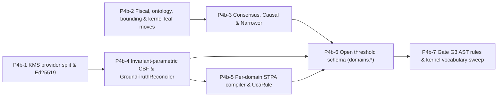

# Next Steps After PR 4a — PR 4b Independent Task Prompts

**Source plan:** [governor_refactor_plan_pr4_5.md §PR 4b (§4b.0–§4b.21)](./governor_refactor_plan_pr4_5.md).
**Baseline:** `main` @ `4967d99` (PR 3 `#280`–`#283`, R0, S1 `#279`, and PR 4a `#285` complete).

Each prompt is self-contained. Paste one into a fresh agent session, together with the shared-rules block. Prompts cite code **by symbol**. Line numbers are approximate as of `4967d99`.

## Why the prompts differ from the plan
Checking the code at `4967d99` found items where `HEAD` already moved or has latent bugs that §4b must resolve:

| # | Finding at HEAD (`4967d99`) | Task |
|---|---|---|
| F1 | PR 4a (`#285`) created `src/gateway/governance/governor/assembly.py` (`GovernorComponents`, `assemble_governor`) and `src/gateway/governance/governor/posture.py` (`assert_production_posture`, `CHECKS`). `PluginContribution` in `src/gateway/governance/contracts.py` already declares all 16 fields (`domain`, `tiers`, `invariants`, `uca_rules`, `narrowers`, `threshold_sections`, `execution_verbs`, `standing_projector`, `ground_truth_providers`, `registered_actions`, `safety_filter`, `consensus`, `tool_provider`, `compliance_overlay_dirs`, `background_tasks`, `rail_providers`). Contributed invariants are validated via V1–V4 (`governor/invariants.py`) at assembly, with a comment citing `POAM-2026-078` ("contributed invariants validated but not enforced until 4b"). | P4b-3, P4b-4, P4b-5, P4b-6 |
| F2 | **Live signature mismatch bug in Healthcare & Physical-AI `ConsensusTier`:** `src/cage_healthcare/tiers/clinical_consensus_tier.py` (`ClinicalConsensusTier._verify_clinical_consensus`) and `src/cage_physical_ai/tiers/physical_consensus_tier.py` (`PhysicalConsensusTier._verify_physical_consensus`) call `self.consensus_engine.check_consensus(action_type=action, params=params)` and check `result.get("status") != "APPROVED"`. However, `ConsensusGate.check_consensus` (`src/gateway/governance/consensus/engine.py`) takes `(self, action: str, context: dict[str, Any], magnitude: float | None = None)` and returns `"APPROVE"` or `"SKIPPED"` (never `"APPROVED"`). Calling either tier against a real `ConsensusGate` raises `TypeError`. Furthermore, `src/cage_finance/config/critics.yaml` names role `"Risk Analyst"` while `engine.py` hardcodes `"Risk Manager"`. | P4b-3 |
| F3 | **`CausalGatekeeper` partially changed in `#278` (`f974e88`):** `src/gateway/governance/causal/gatekeeper.py` no longer has `_CAUSAL_CONFIG_PATH` pointing to `src/cage_finance`; it uses `_causal_config()` reading `plugin_loader.active_domain_config().causal_graph_path`. However, it still: (a) **fails open** (`return True`) when `params.get("amount", 0.0) <= 0` in `verify_causal_safety`, (b) hardcodes `"amount"`, `"market_regime"`, `"trade_amount"`, `"risk_score"`, (c) keeps finance synthetic telemetry (`generate_mock_telemetry`) inside Layer 1, and (d) reads `os.getenv("CAGE_ENV")` directly instead of `resolve_posture()`. | P4b-3 |
| F4 | **`AmountNarrower` regex-parses free-text `violation.message` and is unwired:** `_compute_narrowed_params` is already gone from the kernel, and `src/cage_finance/narrowers/amount_narrower.py` exists, but `AmountNarrower.can_narrow` and `narrow` regex-parse `violation.message` (`r'exceeds\s+(?:soft\s+)?limit\s+of\s+\$?([0-9]+(?:\.[0-9]+)?)'`), violating the PR 1 structured-reason invariant, and `FinanceCagePlugin.contribute()` sets `narrowers=()`. Also, `Narrower` is defined twice (`src/gateway/governance/contracts.py` and `src/gateway/governance/narrower.py`). | P4b-3 |
| F5 | **`THRESHOLDS` domain-attribute callers across `src/` and `tests/`:** Outside `src/gateway/governance/schemas/thresholds.py` (including `load_and_validate_thresholds` log line at L555), the callers reading domain attributes on `THRESHOLDS` are: `cbf_engine.py` (`THRESHOLDS.cbf.min_cash_balance`, `THRESHOLDS.drawdown.limit`), `consensus/engine.py` (`THRESHOLDS.consensus.threshold_usd`), `generated_stpa_validator.py` & `stpa_compiler.py` (`THRESHOLDS.stpa.*`), `normative_provider.py` (`THRESHOLDS.confidence.min_trade_confidence`), `cage_finance/plugin.py` & `cage_finance/__init__.py` (`THRESHOLDS.model_dump()`), plus `config/thresholds/{US_FED,EU_ECB,APAC_MAS}_BASELINE.json` and test helpers in `tests/test_red_teaming.py`, `tests/test_governance_thresholds_pii_retention.py`, and `tests/infrastructure/test_data_residency_us_fed.py`. | P4b-6 |
| F6 | **Existing Gate G6 (`scripts/check_domain_literals.py`) vs. Gate G3 (`scripts/check_import_boundaries.py`):** `scripts/check_domain_literals.py` already exists as an AST scanner tested by `tests/test_domain_literal_gate.py` with `EXCLUDED_FILES = {"generated_stpa_validator.py", "generated_saga_nodes.py", ...}`. Extending Gate G3 (§4b.17) and removing those exclusions in `check_domain_literals.py` must keep `tests/test_domain_literal_gate.py` green. | P4b-7 |
| F7 | **STPA multi-source files at `HEAD`:** Both legacy `config/stpa_control_structure.yaml` and split `config/stpa/core_system.yaml` + `config/stpa/domains/finance/trade_hazards.yaml` exist in the repo. `scripts/check_stpa_freshness.py` currently checks `_GENERATED_ARTIFACTS` in `src/gateway/governance/generated_stpa_validator.py` and `config/{opa,rails,agp}/`. | P4b-5 |
| F8 | **`KMSGovernanceSigner` checks `isinstance(self._provider, GCPKMSProvider)` in `kms_signer.py`:** Lines 489, 855, 968 branch on `isinstance(self._provider, GCPKMSProvider)` for `jose_alg` and channel warmup / hash digest width. Moving `GCPKMSProvider`, `AWSKMSProvider`, `AzureKMSProvider` out of `src/gateway/governance/kms_signer.py` into `src/integrations/{gcp,aws,azure}/kms_provider.py` requires exposing those capabilities as methods/properties on `BaseKMSProvider`. | P4b-1 |

## Dependency graph

- **Can start now, in parallel:** `P4b-1` and `P4b-2`.
- **Wave 2 (in parallel once P4b-1 / P4b-2 land):** `P4b-3` (after `P4b-2`) and `P4b-4` (after `P4b-1`).
- **Wave 3:** `P4b-5` (after `P4b-4`, since `P4b-4` removes the CBF drawdown branch that `P4b-5` folds into finance UCA-5).
- **Wave 4:** `P4b-6` (after `P4b-3`, `P4b-4`, `P4b-5` have removed all legacy `THRESHOLDS.<domain>` callers).
- **Wave 5:** `P4b-7` (final Gate G3 AST enforcement and docstring/vocabulary sweep across `src/gateway/`).

## Shared rules — include verbatim in every prompt
```text
Repository: /Users/laah/Code/cybernetic-governance-engine (CAGE reference architecture).
Follow AGENTS.md at the repo root without exception. In particular:
- Never commit to main. Create the branch named in this task from origin/main (lowercase kebab-case, ≤30 chars after prefix).
- Conventional Commits: <type>(<scope>): <summary> ≤72 chars; breaking changes need "!" AND a "BREAKING CHANGE:" footer.
- Apache 2.0 license header on every new .py file under src/ and tests/.
- Every new test module: pytestmark = [pytest.mark.unit, pytest.mark.local].
- Always prefix commands with `uv run`. Inner loop: run only the tests you touch. Before declaring done:
  uv run pytest tests/ -m "local or unit" -n auto --dist loadscope --no-cov -p no:langsmith -p no:langsmith_plugin --tb=line -q
  must pass (equivalent to `make test-fast`).
- Layer 1 (src/gateway/) must not import src/cage_*, src/compliance_bridge/, src/governed_financial_advisor/ or vendor SDKs. Verify with `uv run python scripts/check_import_boundaries.py --verbose`.
- Every fail-closed path you add needs a test that observes it FAIL (blocks), not only the happy path. No placeholder tests.
- Breaking changes are acceptable; do not add backward-compat shims unless this task explicitly says so.
- Golden corpus (tests/governor/golden/) is the behavioural oracle. Run it with
  `uv run pytest tests/governor/golden/test_golden_verdicts.py -n0 -vv --no-cov -p no:randomly`.
  Regenerate (`--regen-golden`) ONLY for intended changes and justify each changed scenario in the PR body.
- Doc-reference gate: `uv run python scripts/check_doc_references.py` must not gain failures vs origin/main.
- STPA freshness: `uv run python scripts/check_stpa_freshness.py` must pass.
- Locate code by symbol (grep), not by the line numbers quoted in this prompt.
- Tooling: `rg` is not installed; use grep. In zsh, quote globs such as --include='*.py'.
- Stay inside the "Files you own" list. If you need to change anything else, stop and report instead.
- When done: push the branch, open a PR titled with the commit subject (gh pr create), and report: files changed, tests added, full-suite result, golden diffs, anything left undone. Do NOT merge.
```

---

## P4b-1 — KMS provider isolation, Ed25519 hermetic signer & fail-closed verification (§4b.3)
**Branch:** `refactor/kms-provider-split` · **Commit:** `refactor(governance)!: isolate KMS cloud providers and add Ed25519 signer`
**Requires:** nothing. Can start immediately.

```text
<shared rules>

Context:
`src/gateway/governance/kms_signer.py` lives in Layer 1 (`src/gateway/`) but defines `GCPKMSProvider`,
`AWSKMSProvider`, and `AzureKMSProvider` inline, importing `google.cloud.kms_v1`, `boto3`, and
`azure.keyvault.keys` directly inside the kernel (violating the Layer 1 vendor-SDK rule).
Additionally:
- Finding F8: `KMSGovernanceSigner` checks `isinstance(self._provider, GCPKMSProvider)` in 3 places
  (lines ~489, ~855, ~968) to decide `jose_alg`, channel warmup (`_ensure_channel_warm`), and
  pre-hashed vs raw signing payload.
- Defect K2: `src/gateway/governance/reconciliation/daemon.py` (`LedgerReconciliationDaemon._write_verified_balance`)
  catches signing exceptions and falls back to `signature="HMAC_FALLBACK_KMS_ERROR"` instead of
  failing closed.
- Defect K3: `KMSGovernanceSigner.verify_decision` / `verify_batch` accept `"HMAC_SHA256_FALLBACK"`
  (symmetric HMAC) even when `resolve_posture().enforces_controls` is True.
- Defect K4: Hermetic tests and dev posture fall back to symmetric HMAC instead of exercising the
  real asymmetric sign/verify + `kid`-resolved trust-anchor path.

Do:
1. **BaseKMSProvider capabilities (`src/gateway/governance/kms_signer.py`):**
   - Keep `BaseKMSProvider`, `KMSGovernanceSigner`, `BatchGovernanceSigner`, `SignedRecord`, and
     `SoftwareHMACProvider` in `src/gateway/governance/kms_signer.py`.
   - Add properties/methods on `BaseKMSProvider` so `KMSGovernanceSigner` never checks
     `isinstance(self._provider, GCPKMSProvider)`:
     - `jose_alg: str` property (default `"HS256"` on `SoftwareHMACProvider`, `"EdDSA"` on
       `SoftwareEd25519Provider`, key-algorithm-derived on `GCPKMSProvider`/`AWSKMSProvider`/`AzureKMSProvider`).
     - `expects_raw_message: bool` property (True for `SoftwareHMACProvider` and `SoftwareEd25519Provider`;
       False for cloud KMS providers that take a SHA-256 digest; or unify `sign()` contract cleanly).
     - `warm_channel() -> None` no-op on `BaseKMSProvider`, overridden on `GCPKMSProvider`.

2. **Add `SoftwareEd25519Provider(BaseKMSProvider)` (`src/gateway/governance/kms_signer.py`):**
   - Uses `cryptography.hazmat.primitives.asymmetric.ed25519` (already a transitive dependency).
   - Generates an ephemeral Ed25519 keypair at init (or loads from an optional PEM in dev/test only),
     registers the public key in the signer's `kid`-keyed trust anchor manifest (`kid="dev-ed25519-01"`
     or configured `key_id`), and signs/verifies through the exact same asymmetric code path and
     `kid` resolution as cloud KMS (`jose_alg = "EdDSA"`).
   - Make `SoftwareEd25519Provider` the default hermetic/dev provider when `KMS_PROVIDER` is unset or
     `"ed25519"` in non-enforcing posture (`SoftwareHMACProvider` remains selectable only via explicit
     `KMS_PROVIDER=hmac` in non-enforcing posture for negative tests).

3. **Move cloud KMS providers to Layer 3 (`src/integrations/{gcp,aws,azure}/kms_provider.py`):**
   - Move `GCPKMSProvider` → `src/integrations/gcp/kms_provider.py`.
   - Move `AWSKMSProvider` → `src/integrations/aws/kms_provider.py`.
   - Move `AzureKMSProvider` → `src/integrations/azure/kms_provider.py`.
   - Create `src/gateway/governance/signer_factory.py` with `build_kms_provider(provider_name: str | None = None, **kwargs) -> BaseKMSProvider`
     that lazy-imports `GCPKMSProvider`, `AWSKMSProvider`, or `AzureKMSProvider` from `src/integrations/`.
   - Add `"src/gateway/governance/signer_factory.py"` to `INTEGRATIONS_FACTORY_ALLOWLIST` in
     `scripts/check_import_boundaries.py`, and expand `FORBIDDEN_VENDOR_SDKS` checking in
     `scripts/check_import_boundaries.py` to cover `src/gateway/governance/kms_signer.py` (or all of
     `src/gateway/governance/`).
   - Zero `google.cloud`, `boto3`, `botocore`, `azure` imports may remain in `src/gateway/governance/kms_signer.py`.

4. **K3 — Verifier rejects symmetric fallback in enforcing postures (`src/gateway/governance/kms_signer.py`):**
   - In `KMSGovernanceSigner.verify_decision` and `verify_batch`: if `resolve_posture().enforces_controls`
     is True and `algorithm in ("HMAC_SHA256_FALLBACK", "HS256", "HMAC_FALLBACK_KMS_ERROR")` (or the
     provider is `SoftwareHMACProvider` / `SoftwareEd25519Provider` in enforcing posture), return
     `False` (verification failure) and log a critical security alert.
   - In `KMSGovernanceSigner.__init__`: if `resolve_posture().enforces_controls` is True and the selected
     provider is `SoftwareHMACProvider` or `SoftwareEd25519Provider`, raise `RuntimeError` (fail closed).

5. **K2 — Reconciler fails closed on signing failure (`src/gateway/governance/reconciliation/daemon.py`):**
   - In `_write_verified_balance` (and any signing call in `reconciliation/daemon.py`): remove the
     `signature = "HMAC_FALLBACK_KMS_ERROR"` fallback. If `signer.sign_decision(...)` raises or returns
     an unverified/fallback signature in enforcing posture, do NOT write the Redis state key; increment
     the reconciliation failure counter and raise/abort the reconciliation tick so stale-state /
     fail-closed semantics engage.

Tests:
- `tests/test_kms_signer.py` and `tests/test_batch_signer.py`: update imports if tests construct
  `GCPKMSProvider`/`AWSKMSProvider`/`AzureKMSProvider` directly (import from `src.integrations.{gcp,aws,azure}.kms_provider`
  or `signer_factory`).
- Add unit tests in `tests/test_kms_signer.py`:
  1. `SoftwareEd25519Provider` signs and verifies a decision end-to-end via `kid` lookup, and fails
     closed (`verify_decision -> False`) on unknown `kid` or tampered payload.
  2. `verify_decision` and `verify_batch` return `False` when presented with `"HMAC_SHA256_FALLBACK"`
     under `CAGE_ENV=production` (`enforces_controls == True`).
  3. `KMSGovernanceSigner` raises `RuntimeError` at init if `SoftwareEd25519Provider` or
     `SoftwareHMACProvider` is used under `CAGE_ENV=production`.
  4. `reconciliation/daemon.py` does NOT write `"HMAC_FALLBACK_KMS_ERROR"` to Redis when KMS signing
     raises; the Redis key remains unwritten.

Files you own:
- `src/gateway/governance/kms_signer.py`
- `src/gateway/governance/signer_factory.py` (new)
- `src/integrations/gcp/__init__.py` (new if needed)
- `src/integrations/gcp/kms_provider.py` (new)
- `src/integrations/aws/__init__.py` (new if needed)
- `src/integrations/aws/kms_provider.py` (new)
- `src/integrations/azure/__init__.py` (new if needed)
- `src/integrations/azure/kms_provider.py` (new)
- `src/gateway/governance/reconciliation/daemon.py` (only the K2 signing fallback block)
- `scripts/check_import_boundaries.py`
- `tests/test_kms_signer.py`
- `tests/test_batch_signer.py`

Acceptance:
- `grep -rn 'google.cloud\|boto3\|botocore\|azure' src/gateway/governance/kms_signer.py` returns 0 hits.
- `grep -rn 'HMAC_FALLBACK_KMS_ERROR' src/` returns 0 hits.
- `uv run python scripts/check_import_boundaries.py --verbose` passes.
- Full unit suite (`make test-fast`) and golden suite pass.
```

---

## P4b-2 — Kernel leaf moves & domain-literal cleanups (§4b.8, §4b.10–§4b.16)
**Branch:** `refactor/fiscal-and-leaf-moves` · **Commit:** `refactor(governance)!: move finance leaf modules to plugin and purge kernel literals`
**Requires:** nothing. Can run in parallel with `P4b-1`.

```text
<shared rules>

Context:
Several self-contained leaf modules in `src/gateway/` still carry finance-only classes or default
parameter literals (`"execute_trade"`, `"amount"`, `"trade_amount"`, `"market_regime"`). Moving and
cleaning these up now unblocks `P4b-3` and `P4b-7` without touching CBF, STPA, or the threshold schema.

Do:
1. **§4b.8 — Move `FiscalLimitGuard` to `src/cage_finance/safety/fiscal_limit_guard.py` and delete `FiscalGuard` alias:**
   - Move `src/gateway/governance/fiscal_guard.py` → `src/cage_finance/safety/fiscal_limit_guard.py`.
   - Delete the `FiscalGuard = FiscalLimitGuard` backward-compat alias at the bottom of the file.
   - Delete `src/gateway/governance/fiscal_guard.py` (do not leave a re-export shim).
   - Update all callers in `src/cage_finance/` (e.g., `src/cage_finance/tiers/fiscal_tier.py`,
     `src/cage_finance/plugin.py`, `src/cage_finance/__init__.py`) and `tests/` to import
     `FiscalLimitGuard` from `src.cage_finance.safety.fiscal_limit_guard`.
   - In `src/gateway/governance/governor/assembly.py` and `src/gateway/governance/governor/governor.py`,
     remove `fiscal_guard` from `GovernorComponents` and `SymbolicGovernor` (the finance plugin owns its
     `FiscalLimitGuard` instance inside `FiscalTierPlugin`).

2. **§4b.10 — Move `TradingKnowledgeGraph` to `src/cage_finance/ontology.py`:**
   - Keep `KnowledgeGraphValidator` in `src/gateway/governance/ontology_validator.py`, but remove the
     default fallback to `TradingKnowledgeGraph` (require `graph` to be passed explicitly or default
     to an empty/abstract graph that fails closed if queried without domain predicates).
   - Move `TradingKnowledgeGraph` to `src/cage_finance/ontology.py` and inject it from
     `src/cage_finance/tiers/ontology_tier.py` / `src/cage_finance/plugin.py`.
   - Update tests importing `TradingKnowledgeGraph` to import from `src.cage_finance.ontology`.

3. **§4b.11 — Move `ftra/bounding_contract.py` to `src/cage_finance/safety/bounding/contract.py`:**
   - Move `src/gateway/governance/ftra/bounding_contract.py` (`ActionParameterBounds`,
     `BoundingValidationResult`, `validate_and_clamp_parameters`, `check_forbidden_fields`, etc.) to
     `src/cage_finance/safety/bounding/contract.py` (create `src/cage_finance/safety/bounding/__init__.py`).
   - Delete `src/gateway/governance/ftra/bounding_contract.py` and remove its re-exports from
     `src/gateway/governance/ftra/__init__.py`.
   - Update callers in `src/cage_finance/`, `src/governed_financial_advisor/`, and `tests/` to import
     from `src.cage_finance.safety.bounding.contract`.

4. **§4b.12 — `src/gateway/governance/opa_node_factory.py`:**
   - Remove the default `("trade_amount", "market_regime")` on `span_keys`; default to `()` so callers
     pass domain span keys explicitly.
   - Make `allow_target` and `deny_target` required keyword arguments on `create_opa_router` (remove
     defaults `"execute_trade"` and `"abort_execution"`). Update all callers in `src/` and `tests/` to
     pass `allow_target` and `deny_target` explicitly.

5. **§4b.13 — `src/gateway/governance/authorization_claim_detector.py` & `confidence_claim_detector.py`:**
   - Remove `"execute_trade"` from `_HIGH_STAKES_ACTIONS` in `authorization_claim_detector.py` and from
     `DEFAULT_EXECUTION_VERBS` in `confidence_claim_detector.py`.
   - Accept `execution_verbs: frozenset[str] = frozenset()` at detector construction or call time,
     wired from `PluginContribution.execution_verbs` in `assemble_governor` / callers.
   - Ensure `FinanceCagePlugin.contribute()` includes `"execute_trade"` in its `execution_verbs`.

6. **§4b.14 — `src/gateway/governance/hitl_escalator.py`:**
   - Replace `amount: float` and `threshold_usd: float` parameters/fields on `HITLEscalationRequest` /
     `escalate(...)` with domain-neutral `magnitude: float` and `threshold: float`.
   - Remove `params.get("amount", 0.0)` and `os.environ.get("CONSENSUS_THRESHOLD_USD", "25000")`
     fallbacks from `hitl_escalator.py`; callers must pass `magnitude` and `threshold` explicitly.
   - Update all callers in `src/` and `tests/`.

7. **§4b.15 — `src/gateway/governance/aaif_adapter.py`:**
   - Replace any `"execute_trade"` fallback in `aaif_adapter.py` with `"unknown_action"` or raise
     `ValueError` when action name is missing on a governance envelope.

8. **§4b.16 — `src/gateway/governance/governor/pipeline.py`, `governor.py`, `assembly.py`:**
   - In `pipeline.py`: replace the confidence-floor failure message `"Trade confidence {conf:.2f} below minimum threshold {min_conf}"`
     with `"Action confidence {conf:.2f} below minimum threshold {min_conf}"`.
   - Verify `GovernorComponents.standing_projector` in `assembly.py` and `governor.py` uses the
     plugin-contributed `standing_projector` (defaulting to a no-op identity projector `(params, standing) -> params`
     when no plugin contributes one).

Tests:
- Update existing unit tests for `fiscal_limit_guard`, `ontology_validator`, `bounding_contract`,
  `opa_node_factory`, `authorization_claim_detector`, `confidence_claim_detector`, `hitl_escalator`,
  and `aaif_adapter`.
- Add unit tests verifying:
  - `create_opa_router` raises `TypeError` when called without `allow_target` or `deny_target`.
  - `KnowledgeGraphValidator` with no domain graph fails closed on unknown predicates.
  - `AuthorizationClaimDetector` and `ConfidenceClaimDetector` use injected `execution_verbs`.

Files you own:
- `src/gateway/governance/fiscal_guard.py` (delete)
- `src/cage_finance/safety/fiscal_limit_guard.py` (moved from `fiscal_guard.py`)
- `src/gateway/governance/ontology_validator.py`
- `src/cage_finance/ontology.py` (new)
- `src/gateway/governance/ftra/bounding_contract.py` (delete)
- `src/gateway/governance/ftra/__init__.py`
- `src/cage_finance/safety/bounding/__init__.py` (new)
- `src/cage_finance/safety/bounding/contract.py` (moved from `ftra/bounding_contract.py`)
- `src/gateway/governance/opa_node_factory.py`
- `src/gateway/governance/authorization_claim_detector.py`
- `src/gateway/governance/confidence_claim_detector.py`
- `src/gateway/governance/hitl_escalator.py`
- `src/gateway/governance/aaif_adapter.py`
- `src/gateway/governance/governor/pipeline.py`
- `src/gateway/governance/governor/assembly.py`
- `src/gateway/governance/governor/governor.py`
- `src/cage_finance/plugin.py`
- `src/cage_finance/__init__.py`
- `src/cage_finance/tiers/fiscal_tier.py`
- `src/cage_finance/tiers/ontology_tier.py`
- `src/governed_financial_advisor/**` (only import paths for moved symbols)
- `tests/**` (only tests touching the moved/updated symbols above and golden corpus if `"Trade confidence"` message is in a golden fixture)

Acceptance:
- `test ! -e src/gateway/governance/fiscal_guard.py && test ! -e src/gateway/governance/ftra/bounding_contract.py`
- `grep -rn 'TradingKnowledgeGraph\|FiscalGuard\b\|execute_trade\|trade_amount\|market_regime\|threshold_usd' src/gateway/governance/ontology_validator.py src/gateway/governance/opa_node_factory.py src/gateway/governance/authorization_claim_detector.py src/gateway/governance/confidence_claim_detector.py src/gateway/governance/hitl_escalator.py src/gateway/governance/aaif_adapter.py` returns 0 hits.
- `uv run python scripts/check_import_boundaries.py --verbose` passes.
- Full unit suite (`make test-fast`) and golden suite pass.
```

---

## P4b-3 — Domain-injected Consensus, Causal Gatekeeper & Narrower (§4b.4, §4b.5, §4b.6)
**Branch:** `refactor/consensus-causal-narrow` · **Commit:** `refactor(governance)!: make consensus, causal gatekeeper, and narrower domain-injected`
**Requires:** `P4b-2` (since both touch `src/cage_finance/plugin.py` and `src/gateway/governance/governor/assembly.py`).

```text
<shared rules>

Context:
1. **Consensus (`src/gateway/governance/consensus/engine.py`, §4b.4 & Finding F2):**
   - `ConsensusGate` currently hardcodes finance role names (`"Risk Manager"`, `"Compliance Officer"`,
     `"Execution Quant"`), finance prompts (`_DEFAULT_CRITIC_PROMPTS`), `THRESHOLDS.consensus.threshold_usd`,
     `params.get("amount")`, `"HIGH_VALUE_TRADE"`, and `_CRITICS_CONFIG_PATH` pointing to
     `src/cage_finance/config/critics.yaml`.
   - `src/cage_finance/config/critics.yaml` defines `"Risk Analyst"` while `engine.py` hardcodes
     `"Risk Manager"`.
   - **Live bug F2:** `ClinicalConsensusTier` (`src/cage_healthcare/tiers/clinical_consensus_tier.py`)
     and `PhysicalConsensusTier` (`src/cage_physical_ai/tiers/physical_consensus_tier.py`) call
     `self.consensus_engine.check_consensus(action_type=action, params=params)` and check
     `result.get("status") != "APPROVED"`, whereas `ConsensusGate.check_consensus` takes
     `(self, action: str, context: dict[str, Any], magnitude: float | None = None)` and returns
     `"APPROVE"` or `"SKIPPED"`. Calling either tier against a real `ConsensusGate` raises `TypeError`!
   - `_LegacyConsensusAdapter` in `src/gateway/governance/governor/assembly.py` wraps a bare
     `consensus_engine` with `lambda p: float(p.get("amount", 0.0))`.

2. **Causal Gatekeeper (`src/gateway/governance/causal/gatekeeper.py`, §4b.5, Defect A5 & Finding F3):**
   - `gatekeeper.py` is procedural module-level state with finance variable names (`"trade_amount"`,
     `"risk_score"`, `"market_regime"`, `params.get("amount", 0.0)`), contains `generate_mock_telemetry()`
     (synthetic finance returns/volatility) in Layer 1, reads `os.getenv("CAGE_ENV")` directly at L568,
     and **fails open** (`return True` at L585) when `params.get("amount", 0.0) <= 0` (Defect A5).

3. **Parameter Narrower (`src/cage_finance/narrowers/amount_narrower.py`, §4b.6 & Finding F4):**
   - `AmountNarrower.can_narrow` and `narrow` regex-parse `violation.message`
     (`r'exceeds\s+(?:soft\s+)?limit\s+of\s+\$?([0-9]+(?:\.[0-9]+)?)'`), violating the PR 1 rule that
     `violation.message` is never parsed for control flow.
   - `FinanceCagePlugin.contribute()` currently sets `narrowers=()`.
   - `Narrower` protocol is duplicated in `src/gateway/governance/contracts.py` and
     `src/gateway/governance/narrower.py`.

Do:
1. **§4b.4 — Domain-injected `ConsensusGate` and fix F2 across all 3 domains:**
   - In `src/gateway/governance/contracts.py`, add (or update if present) `CriticSpec`:
     ```python
     @dataclass(frozen=True)
     class CriticSpec:
         role: str
         prompt: str
         weight: float = 1.0
         provider: str = "google"
         model: str = "gemini-2.5-pro"
     ```
     and update `ConsensusContribution` so a domain plugin supplies `critics: tuple[CriticSpec, ...]`,
     `threshold: float`, `quorum: int = 2`, `high_stakes_actions: frozenset[str] = frozenset()`,
     and `magnitude_extractor: Callable[[Mapping[str, Any]], float]`.
   - In `src/gateway/governance/consensus/engine.py`:
     - Constructor takes `critics: Sequence[CriticSpec]`, `threshold: float`,
       `magnitude_extractor: Callable[[Mapping[str, Any]], float]`, `quorum: int = 2`,
       `high_stakes_actions: AbstractSet[str] = frozenset()`.
     - Delete `_CRITICS_CONFIG_PATH`, `_DEFAULT_CRITIC_PROMPTS`, `"Risk Manager"`, `"Compliance Officer"`,
       `"Execution Quant"`, `"HIGH_VALUE_TRADE"`, and `params.get("amount")` from `engine.py`.
     - If `critics` is empty at `check_consensus` time when consensus is triggered, fail closed (`"DENY"`).
     - Load critic specs from each domain's `critics.yaml` in Layer 2 (`src/cage_finance/`,
       `src/cage_healthcare/config/critics.yaml`, `src/cage_physical_ai/config/critics.yaml`),
       reconciling `"Risk Analyst"` / `"Risk Manager"` in `src/cage_finance/config/critics.yaml`.
   - Fix `ClinicalConsensusTier` (`src/cage_healthcare/tiers/clinical_consensus_tier.py`) and
     `PhysicalConsensusTier` (`src/cage_physical_ai/tiers/physical_consensus_tier.py`) to call
     `ConsensusGate.check_consensus(action, params, magnitude=...)` with the real signature and check
     `result.get("decision") not in ("APPROVE", "SKIPPED")` (matching `ConsensusTierPlugin` in finance).
   - Delete `_LegacyConsensusAdapter` from `src/gateway/governance/governor/assembly.py`.

2. **§4b.5 — Class-based `CausalGatekeeper` & `CausalSpec` (fix Defect A5 & F3):**
   - Define `CausalSpec` dataclass in `src/gateway/governance/causal/gatekeeper.py` (or `contracts.py`
     and re-export):
     ```python
     @dataclass(frozen=True)
     class CausalSpec:
         dag_gml: str
         treatment: str
         outcome: str
         confounders: tuple[str, ...]
         context_key: str
         treatment_extractor: Callable[[Mapping[str, Any]], float | None]
     ```
   - Refactor `src/gateway/governance/causal/gatekeeper.py` into a `CausalGatekeeper(spec: CausalSpec, ...)`
     class (keeping a thin module-level wrapper only if needed by existing tests, wired via the
     domain's `CausalSpec`).
   - **Fix Defect A5:** When `spec.treatment_extractor(params)` returns `None` or `<= 0` for an action
     routed to the causal tier, return `False` (fail closed) with structured reason
     `"invalid_or_nonpositive_treatment_value"` — NEVER `return True`.
   - Replace `os.getenv("CAGE_ENV", ...)` in `gatekeeper.py` with `resolve_posture().enforces_controls`.
   - Move `generate_mock_telemetry()` out of `src/gateway/governance/causal/gatekeeper.py` into
     `src/cage_finance/causal/synthetic_telemetry.py` (new).
   - Remove all `"trade_amount"`, `"market_regime"`, `"risk_score"`, and `params.get("amount")`
     literals from `src/gateway/governance/causal/gatekeeper.py`.
   - Wire `FinanceCausalSpec` in `src/cage_finance/tiers/causal_tier.py` (loading GML from
     `src/cage_finance/config/causal_graph.yaml`).

3. **§4b.6 — Fix `AmountNarrower` and deduplicate `Narrower` protocol:**
   - Keep `Narrower` protocol in `src/gateway/governance/contracts.py` and make
     `src/gateway/governance/narrower.py` import `Narrower` from `src.gateway.governance.contracts`
     (single source of truth).
   - In `src/cage_finance/narrowers/amount_narrower.py`:
     - Remove `_LIMIT_PATTERN` regex and all parsing of `violation.message`!
     - Construct `AmountNarrower(limit_resolver: Callable[[], float] | float = ...)` so `narrow()`
       reads the configured ceiling from the finance threshold / `limit_resolver` (e.g.,
       `max_single_trade_usd` or injected limit) and clamps `params["amount"]` to
       `round(limit * 0.99, 2)` when `violation.narrowable` is True and `float(params["amount"]) > limit`.
     - If `limit <= 0` or `params.get("amount")` is missing/non-numeric, `can_narrow` returns `False`
       and `narrow` returns `None`.
   - Register `AmountNarrower` in `FinanceCagePlugin.contribute()` (`narrowers=(AmountNarrower(...),)`).

Tests:
- Add real `ConsensusGate` integration tests for Healthcare (`ClinicalConsensusTier`) and Physical-AI
  (`PhysicalConsensusTier`) verifying they invoke a real `ConsensusGate` instance (no `MagicMock`
  standing in for `ConsensusGate`) without `TypeError`, and test both `"APPROVE"` and `"DENY"` outcomes.
- Add unit test for `CausalGatekeeper` observing that `amount=0`, `amount=-10`, and missing `amount`
  all return `False` (fail closed, Defect A5).
- Update `tests/governor/test_narrower_registry.py` and add a test for `AmountNarrower` proving that
  changing `violation.message` to `"completely arbitrary string"` does not affect `can_narrow` or
  `narrow()`.

Files you own:
- `src/gateway/governance/contracts.py`
- `src/gateway/governance/narrower.py`
- `src/gateway/governance/consensus/engine.py`
- `src/gateway/governance/causal/gatekeeper.py`
- `src/gateway/governance/governor/assembly.py`
- `src/cage_finance/config/critics.yaml`
- `src/cage_finance/causal/__init__.py` (new)
- `src/cage_finance/causal/synthetic_telemetry.py` (new)
- `src/cage_finance/narrowers/amount_narrower.py`
- `src/cage_finance/tiers/consensus_tier.py`
- `src/cage_finance/tiers/causal_tier.py`
- `src/cage_finance/plugin.py`
- `src/cage_healthcare/config/critics.yaml` (new)
- `src/cage_healthcare/tiers/clinical_consensus_tier.py`
- `src/cage_healthcare/plugin.py`
- `src/cage_physical_ai/config/critics.yaml` (new)
- `src/cage_physical_ai/tiers/physical_consensus_tier.py`
- `src/cage_physical_ai/plugin.py`
- `tests/test_consensus*.py`, `tests/test_causal*.py`, `tests/governor/test_narrower_registry.py`,
  `tests/test_healthcare_plugin.py`, `tests/test_physical_ai_plugin.py`

Acceptance:
- `grep -rn 'Risk Manager\|Compliance Officer\|Execution Quant\|HIGH_VALUE_TRADE\|threshold_usd\|src/cage_finance' src/gateway/governance/consensus/` returns 0 hits.
- `grep -rn 'trade_amount\|market_regime\|risk_score\|generate_mock_telemetry' src/gateway/governance/causal/` returns 0 hits.
- `grep -rn 'violation\.message' src/cage_finance/narrowers/` returns 0 hits.
- `uv run python scripts/check_import_boundaries.py --verbose` passes.
- Full unit suite (`make test-fast`) and golden suite pass.
```

---

## P4b-4 — Invariant-parametric CBF engine & simulated GroundTruthReconciler (§4b.1, §4b.2)
**Branch:** `refactor/cbf-and-ground-truth` · **Commit:** `refactor(governance)!: make CBF invariant-parametric and add GroundTruthReconciler`
**Requires:** `P4b-1` (since `P4b-1` touches `reconciliation/daemon.py`).

```text
<shared rules>

Context:
1. **CBF Engine (`src/gateway/governance/cbf_engine.py`, §4b.1):**
   - `ControlBarrierFunctionEngine` still has legacy finance-specific parameters and branches:
     `min_cash_balance`, `get_h(cash_balance)` alias, `_DefaultKernelBarrier` (`"kernel.default.resource_floor"`
     reading `THRESHOLDS.cbf.min_cash_balance`), `_legacy_finance_cost_resolver` (`params.get("amount")`),
     `initial_balance=100000.0`, `verified_balance_key="cage:ledger:verified_balance"`, a drawdown
     check inside `verify_safety` (`current_drawdown > THRESHOLDS.drawdown.limit`), and hardcoded
     `"action:execute_trade"` in `verify_trajectory`.
   - Meanwhile, healthcare (`DoseCeilingBarrier`) and physical-AI (`SpatialSeparationBarrier`,
     `KinematicVelocityBarrier`, `TorqueSaturationBarrier`) contribute `InvariantModel` instances on
     `PluginContribution.invariants`, which `assemble_governor` validates (V1–V4) but marks with
     `POAM-2026-078` ("contributed invariants validated but not enforced until 4b").

2. **Reconciliation & Ground Truth (`src/gateway/governance/reconciliation/daemon.py`, §4b.2):**
   - `reconciliation/daemon.py` is finance-only (`LedgerProvider`, `PlaidLedgerProvider`,
     `AnchorageLedgerProvider`, `GcsLedgerSnapshotProvider`, `S3LedgerSnapshotProvider`,
     `StubLedgerProvider`, `VERIFIED_BALANCE_KEY = "cage:ledger:verified_balance"`).
   - Per the Interface Tiering rule in `AGENTS.md` and §4b.2:
     - Commercial-only providers (`PlaidLedgerProvider`, `AnchorageLedgerProvider`,
       `GcsLedgerSnapshotProvider`, `S3LedgerSnapshotProvider`) and `StubLedgerProvider` must be
       DELETED from the codebase (and recorded as customer-responsibility in OSCAL if referenced).
     - Posture-completing ground-truth reconciliation is replaced by a domain-agnostic
       `GroundTruthProvider` protocol + `SimulatedSource` base (`src/gateway/governance/seams/ground_truth.py`)
       and `GroundTruthReconciler` (`src/gateway/governance/reconciliation/daemon.py`) writing to
       `cage:ground_truth:{invariant_id}` with asymmetric KMS/Ed25519 signatures verified by
       `read_verified_state(redis, invariant_id, ...)`.
     - Each domain (`cage_finance`, `cage_healthcare`, `cage_physical_ai`) contributes a deterministic
       simulated `GroundTruthProvider` supporting all 10 fault-injection modes (`FaultMode`:
       `TIMEOUT`, `CONNECTION_ERROR`, `MALFORMED_PAYLOAD`, `NEGATIVE_VALUE`, `NAN_VALUE`,
       `STALE_TIMESTAMP`, `FUTURE_TIMESTAMP`, `UNVERIFIED_SOURCE`, `SCALAR_BELOW_BARRIER`,
       `DISCREPANCY_SPIKE`).

Do:
1. **Create `src/gateway/governance/seams/ground_truth.py` (§4b.2):**
   - Define `GroundTruthSnapshot(invariant_id: str, state_key: str, scalar: float, observed_at: float, sequence: int, source_id: str, metadata: Mapping[str, Any] = ...)`
     (frozen dataclass).
   - Define `@runtime_checkable class GroundTruthProvider(Protocol)` with
     `invariant_id: str`, `state_key: str`, and `async def fetch_snapshot() -> GroundTruthSnapshot`.
   - Define `FaultMode( StrEnum )` with the 10 required fault modes (`NONE`, `TIMEOUT`,
     `CONNECTION_ERROR`, `MALFORMED_PAYLOAD`, `NEGATIVE_VALUE`, `NAN_VALUE`, `STALE_TIMESTAMP`,
     `FUTURE_TIMESTAMP`, `UNVERIFIED_SOURCE`, `SCALAR_BELOW_BARRIER`, `DISCREPANCY_SPIKE`) and a
     reusable `SimulatedSource` helper class with deterministic `seed: int` and `inject_fault(mode: FaultMode)`.

2. **Refactor `src/gateway/governance/reconciliation/daemon.py` (§4b.2):**
   - Delete `PlaidLedgerProvider`, `AnchorageLedgerProvider`, `GcsLedgerSnapshotProvider`,
     `S3LedgerSnapshotProvider`, and `StubLedgerProvider`.
   - Implement `GroundTruthReconciler` (and keep `LedgerReconciliationDaemon` as an alias or update
     callers in `main.py` / `posture.py` / `tests/`):
     - Polls each registered `GroundTruthProvider` (from `PluginContribution.ground_truth_providers`),
       validates the snapshot (finite scalar, non-negative unless allowed by invariant, fresh
       `observed_at` within staleness window, strictly non-decreasing `sequence` or valid source),
       signs the record via `KMSGovernanceSigner.sign_decision`, and writes to Redis key
       `cage:ground_truth:{invariant_id}` (and `provider.state_key`).
     - Provide `read_verified_state(redis_client, invariant_id: str, signer: KMSGovernanceSigner | None = None, max_staleness_s: float = 300.0) -> float | None`:
       reads `cage:ground_truth:{invariant_id}`, verifies freshness and signature via `signer.verify_decision`,
       and returns `None` (causing CBF to fail closed in enforcing posture) on any tamper, staleness,
       or verification failure.
   - Update `src/gateway/governance/governor/posture.py` (`_check_reconciliation`) to check that every
     contributed `InvariantModel` has a matching `GroundTruthProvider` in enforcing posture.

3. **Implement domain simulated `GroundTruthProvider`s in Layer 2:**
   - `src/cage_finance/ground_truth.py`: `SimulatedCashLedgerProvider` (`invariant_id="finance.cash_floor.v1"`,
     `state_key="finance:cash_balance"`, default initial scalar `100000.0`).
   - `src/cage_healthcare/ground_truth.py`: `SimulatedSerumAssayProvider` (`invariant_id="healthcare.serum_concentration_floor.v1"`,
     `state_key="healthcare:patient:serum_concentration_mg_l"`, default initial scalar `15.0`).
   - `src/cage_physical_ai/ground_truth.py`: simulated cell-sensor providers for
     `physical_ai.spatial_separation_mm.v1` (`state_key="physical_ai:cell:separation_distance_mm"`, scalar `1200.0`),
     `physical_ai.velocity_headroom_mm_s.v1` (`state_key="physical_ai:cell:velocity_headroom_mm_s"`, scalar `200.0`), and
     `physical_ai.torque_headroom_nm.v1` (`state_key="physical_ai:cell:torque_headroom_nm"`, scalar `35.0`).
   - Wire `ground_truth_providers` in each domain's `plugin.py` (`FinanceCagePlugin`,
     `HealthcareCagePlugin`, `PhysicalAICagePlugin`).

4. **Refactor `ControlBarrierFunctionEngine` (`src/gateway/governance/cbf_engine.py`, §4b.1):**
   - Make `invariant: InvariantModel` and `cost_resolver: Callable[[str, Mapping[str, Any]], float]`
     required (or wired per invariant from `PluginContribution.invariants`).
   - Delete `min_cash_balance`, `get_h(cash_balance)` alias (keep only `evaluate_barrier(state_scalar)`),
     `_DefaultKernelBarrier`, `_legacy_finance_cost_resolver`, `initial_balance=100000.0`,
     `verified_balance_key="cage:ledger:verified_balance"`, and the drawdown check branch
     (`current_drawdown > THRESHOLDS.drawdown.limit` — drawdown moves to finance STPA in `P4b-5`; if
     any existing drawdown test in `tests/test_cbf*.py` or `tests/test_red_teaming.py` tests drawdown
     on CBF directly, move/adapt that test to test the barrier or finance STPA tier).
   - In `verify_trajectory`: derive action string from `step.get("action", "unknown")` instead of
     hardcoding `"action:execute_trade"`.
   - Wire all plugin-contributed `invariants` into `GovernorComponents` in
     `src/gateway/governance/governor/assembly.py` so healthcare and physical-AI barriers are actively
     evaluated by the CBF engine during governance!

Tests:
- Update `tests/test_cbf*.py` and `tests/test_reconciliation*.py` / `tests/test_ledger_reconciliation*.py`
  to pass explicit `InvariantModel` and `cost_resolver` fixtures and test `GroundTruthReconciler`.
- Add fault-injection test suite `tests/test_ground_truth_reconciler_faults.py` testing all 10
  `FaultMode` values across finance, healthcare, and physical-AI providers and observing every single
  fault fail closed (`read_verified_state` returns `None` / CBF blocks in enforcing posture).
- Add end-to-end invariant enforcement tests for healthcare (`DoseCeilingBarrier`) and physical-AI
  (`SpatialSeparationBarrier`, `KinematicVelocityBarrier`, `TorqueSaturationBarrier`) through
  `assemble_governor` -> `SymbolicGovernor.evaluate`.

Files you own:
- `src/gateway/governance/seams/ground_truth.py` (new)
- `src/gateway/governance/reconciliation/daemon.py`
- `src/gateway/governance/cbf_engine.py`
- `src/gateway/governance/governor/assembly.py`
- `src/gateway/governance/governor/posture.py`
- `src/cage_finance/ground_truth.py` (new)
- `src/cage_finance/invariants.py` (new or update in `plugin.py` / `tiers/cbf_tier.py`)
- `src/cage_finance/tiers/cbf_tier.py`
- `src/cage_finance/plugin.py`
- `src/cage_healthcare/ground_truth.py` (new)
- `src/cage_healthcare/tiers/dose_barrier_tier.py`
- `src/cage_healthcare/plugin.py`
- `src/cage_physical_ai/ground_truth.py` (new)
- `src/cage_physical_ai/tiers/kinematic_barrier_tier.py`
- `src/cage_physical_ai/plugin.py`
- `tests/test_cbf*.py`, `tests/test_reconciliation*.py`, `tests/test_ledger_reconciliation*.py`,
  `tests/test_ground_truth_reconciler_faults.py` (new), `tests/test_healthcare_plugin.py`,
  `tests/test_physical_ai_plugin.py`, `tests/governor/**`

Acceptance:
- `grep -rn 'PlaidLedgerProvider\|AnchorageLedgerProvider\|GcsLedgerSnapshotProvider\|S3LedgerSnapshotProvider\|StubLedgerProvider' src/` returns 0 hits.
- `grep -rn 'min_cash_balance\|verified_balance\|_legacy_finance_cost_resolver\|_DefaultKernelBarrier\|execute_trade\|100000' src/gateway/governance/cbf_engine.py` returns 0 hits.
- `uv run python scripts/check_import_boundaries.py --verbose` passes.
- Full unit suite (`make test-fast`) and golden suite pass.
```

---

## P4b-5 — Per-domain STPA compiler & `UcaRule` contributions (§4b.9 & Defect A3)
**Branch:** `refactor/stpa-per-domain` · **Commit:** `refactor(governance)!: compile STPA rules per domain plugin and fold drawdown into UCA-5`
**Requires:** `P4b-4` (which removes the duplicate drawdown branch from `cbf_engine.py`).

```text
<shared rules>

Context:
1. **Generated STPA & Saga artifacts in Layer 1 (`src/gateway/governance/stpa_compiler.py`, §4b.9):**
   - Currently `src/gateway/governance/stpa_compiler.py` compiles `config/stpa_control_structure.yaml`
     (and `config/stpa/domains/finance/trade_hazards.yaml`) into Layer 1 files:
     - `src/gateway/governance/generated_stpa_validator.py` (`GeneratedSTPAValidator` with hardcoded
       `execute_trade`, `reverse_trade`, `THRESHOLDS.stpa.uca2_max_trade_usd`,
       `THRESHOLDS.stpa.uca5_max_drawdown_pct`, `_RESTRICTED_CURRENCIES = frozenset({'KPW', 'IRR', 'SYP', 'CUB', 'RUB'})`).
     - `src/gateway/governance/generated_saga_nodes.py` (hardcoded `reverse_trade_compensator`).
     - `src/gateway/governance/terminal_action_registry.json` (`execute_trade`, `modify_governance_policy`, etc.).
   - Because those generated files live in `src/gateway/governance/`, `scripts/check_domain_literals.py`
     had to exclude `"generated_stpa_validator.py"` and `"generated_saga_nodes.py"`.
2. **Defect A3 (Drawdown duplication):**
   - Drawdown (`current_drawdown > 0.05`) was checked in both `cbf_engine.py` and STPA `UCA-5`.
     `P4b-4` removed it from `cbf_engine.py`. In this task, ensure finance STPA `UCA-5` checks both
     `params.get("current_drawdown")` and `params.get("portfolio_drawdown_pct")` (or normalizes them)
     so drawdown enforcement lives in exactly one place: finance's `UCA-5` rule.

Do:
1. **Move finance STPA YAML into the finance plugin (`src/cage_finance/config/stpa/trade_hazards.yaml`):**
   - Move `config/stpa/domains/finance/trade_hazards.yaml` → `src/cage_finance/config/stpa/trade_hazards.yaml`.
   - In the STPA YAML schema and `src/gateway/governance/stpa_compiler.py`:
     - Rename the YAML constraint keys `trade_limits` → `limits` and `currency_denylist` → `denylist`
       (no backward-compat fallback needed in `stpa_compiler.py`; update all YAML files and tests).
     - Keep `config/stpa/core_system.yaml` for domain-agnostic kernel control-loop hazards only
       (`modify_governance_policy`, `update_safety_thresholds`, `disable_audit_logging`,
       `override_control_barrier`), and remove finance UCAs (`execute_trade`) from
       `config/stpa_control_structure.yaml` (or retire `config/stpa_control_structure.yaml` in favor of
       `config/stpa/core_system.yaml` + per-domain `src/cage_<domain>/config/stpa/*.yaml`).

2. **Emit domain STPA artifacts into `src/cage_<domain>/stpa/` (`src/gateway/governance/stpa_compiler.py`):**
   - Update `STPACompiler` (`src/gateway/governance/stpa_compiler.py`) to support compiling a domain
     STPA YAML (`--domain-yaml src/cage_finance/config/stpa/trade_hazards.yaml --out-dir src/cage_finance/stpa`):
     - Emits `src/cage_finance/stpa/uca_rules.py` containing `UCA_RULES: tuple[UcaRule, ...]`
       (implementing the `UcaRule` dataclass/protocol in `src/gateway/governance/contracts.py`) and
       `FinanceSTPAValidator` (or predicates used by the kernel `STPAValidator`).
     - Ensure `UCA-5` in finance checks drawdown whether passed as `portfolio_drawdown_pct` (percentage
       or fraction) or `current_drawdown` (fraction, e.g. `> 0.05` / `5.0%`), closing Defect A3.
     - Emits `src/cage_finance/stpa/saga_nodes.py` (`reverse_trade_compensator`, `SAGA_COMPENSATORS`).
     - Emits `src/cage_finance/stpa/terminal_registry.json`.
   - For the kernel (`config/stpa/core_system.yaml`), emit only domain-agnostic core rules (no
     `execute_trade`, `reverse_trade`, `KPW`, `uca2_max_trade_usd`, `uca5_max_drawdown_pct`).
   - Delete `src/gateway/governance/generated_stpa_validator.py` and
     `src/gateway/governance/generated_saga_nodes.py`, replacing them with a generic, domain-agnostic
     `src/gateway/governance/stpa_validator.py` (`STPAValidator(rules: Sequence[UcaRule])`) that
     evaluates contributed `UcaRule`s from `PluginContribution.uca_rules`.
   - Wire `FinanceCagePlugin.contribute()` to contribute `uca_rules=UCA_RULES` from
     `src.cage_finance.stpa.uca_rules`, and update `src/cage_finance/tiers/stpa_tier.py` and
     `src/gateway/governance/governor/assembly.py` to use `STPAValidator`.

3. **Update `scripts/check_stpa_freshness.py`:**
   - Update `_GENERATED_ARTIFACTS` and the compiler invocation in `scripts/check_stpa_freshness.py` to
     verify freshness of `src/cage_finance/stpa/{uca_rules.py,saga_nodes.py,terminal_registry.json}`
     and `config/{opa,rails,agp}/` against `config/stpa/core_system.yaml` and
     `src/cage_finance/config/stpa/trade_hazards.yaml`.

Tests:
- Update `tests/test_stpa*.py`, `tests/test_saga*.py`, and `tests/test_red_teaming.py` to import
  finance STPA rules/compensators from `src.cage_finance.stpa` or test `STPAValidator` with `UcaRule`s.
- Add unit tests verifying:
  - `STPAValidator` evaluates contributed `UcaRule` predicates and fails closed if a rule predicate raises.
  - Finance `UCA-5` blocks excessive drawdown passed via either `portfolio_drawdown_pct` or `current_drawdown`.
  - `uv run python scripts/check_stpa_freshness.py` passes.

Files you own:
- `src/gateway/governance/stpa_compiler.py`
- `src/gateway/governance/stpa_validator.py` (new, replaces `generated_stpa_validator.py`)
- `src/gateway/governance/generated_stpa_validator.py` (delete)
- `src/gateway/governance/generated_saga_nodes.py` (delete)
- `src/gateway/governance/terminal_action_registry.json`
- `src/gateway/governance/saga_compensator.py`
- `src/gateway/governance/governor/assembly.py`
- `src/cage_finance/config/stpa/trade_hazards.yaml` (moved from `config/stpa/domains/finance/trade_hazards.yaml`)
- `src/cage_finance/stpa/__init__.py` (new)
- `src/cage_finance/stpa/uca_rules.py` (generated)
- `src/cage_finance/stpa/saga_nodes.py` (generated)
- `src/cage_finance/stpa/terminal_registry.json` (generated)
- `src/cage_finance/tiers/stpa_tier.py`
- `src/cage_finance/plugin.py`
- `config/stpa/core_system.yaml`
- `config/stpa_control_structure.yaml`
- `config/opa/generated_stpa_policy.rego`
- `config/rails/generated_stpa_rails.co`
- `config/agp/generated_semantic_policy.txt`
- `scripts/check_stpa_freshness.py`
- `tests/test_stpa*.py`, `tests/test_saga*.py`, `tests/test_red_teaming.py`

Acceptance:
- `test ! -e src/gateway/governance/generated_stpa_validator.py && test ! -e src/gateway/governance/generated_saga_nodes.py`
- `grep -rn 'execute_trade\|reverse_trade\|trade_limits\|currency_denylist\|uca2_max_trade_usd\|uca5_max_drawdown_pct' src/gateway/governance/stpa_compiler.py src/gateway/governance/stpa_validator.py src/gateway/governance/terminal_action_registry.json` returns 0 hits.
- `uv run python scripts/check_stpa_freshness.py` passes.
- `uv run python scripts/check_import_boundaries.py --verbose` passes.
- Full unit suite (`make test-fast`) and golden suite pass.
```

---

## P4b-6 — Open threshold schema with `domains.<domain>` sections (§4b.7)
**Branch:** `refactor/threshold-domain-sections` · **Commit:** `refactor(governance)!: move domain thresholds under domains.<domain> sections`
**Requires:** `P4b-3`, `P4b-4`, `P4b-5` (which migrate all kernel callers off `THRESHOLDS.cbf`, `THRESHOLDS.drawdown`, `THRESHOLDS.consensus`, `THRESHOLDS.stpa`).

```text
<shared rules>

Context:
`src/gateway/governance/schemas/thresholds.py` (`GovernanceThresholds`) still defines domain-specific
top-level fields (`cbf: CbfThresholds`, `drawdown: DrawdownThresholds`, `stpa: StpaThresholds`,
`consensus: ConsensusThresholds`, `healthcare: HealthcareThresholds`, `physical_ai: PhysicalAIThresholds`,
and `confidence.min_trade_confidence`).
With `P4b-3`, `P4b-4`, and `P4b-5` merged, the kernel no longer reads those domain fields. Now we
can separate kernel thresholds from plugin-validated `domains: dict[str, dict[str, Any]]` sections.

Do:
1. **Refactor `src/gateway/governance/schemas/thresholds.py` (§4b.7):**
   - Move `CbfThresholds`, `DrawdownThresholds`, `StpaThresholds`, `ConsensusThresholds`, and
     `BoundingThresholds` into `src/cage_finance/thresholds.py` (`FinanceThresholds(BaseModel)`).
   - Move `HealthcareThresholds` into `src/cage_healthcare/thresholds.py`.
   - Move `PhysicalAIThresholds` into `src/cage_physical_ai/thresholds.py`.
   - In `ConfidenceThresholds` (`src/gateway/governance/schemas/thresholds.py`):
     - Remove the deprecated `min_trade_confidence` field (keep `agent_threshold` and `min_score`).
     - Update `src/gateway/governance/normative_provider.py` (~L373) to read
       `get_agent_confidence_threshold()` (or `THRESHOLDS.confidence.agent_threshold`) instead of
       `THRESHOLDS.confidence.min_trade_confidence`.
   - In `GovernanceThresholds`:
     - Keep only kernel-wide fields: `confidence`, `fria`, `causal`, `kms_batch`, `telemetry`,
       `tier1_keywords`, `tier1_keywords_cbrn`, `tier1_keywords_cbrn_enabled`,
       `pii_audit_log_enabled`, `pii_audit_retention_days`, `pii_audit_retention_authority`, plus:
       ```python
       domains: dict[str, dict[str, Any]] = Field(default_factory=dict)
       ```
     - Add `def resolve(self, dot_path: str) -> Any` on `GovernanceThresholds` that walks nested
       attributes/dicts by dot-separated path (e.g. `"domains.finance.cbf.min_cash_balance"`,
       `"domains.healthcare.min_therapeutic_concentration"`, `"domains.physical_ai.min_separation_distance_mm"`,
       `"confidence.agent_threshold"`) and raises `KeyError` if any segment is missing.
     - Update the startup `logger.info(...)` in `load_and_validate_thresholds()` so it logs kernel
       thresholds (`confidence.agent_threshold`, `fria.zone_allow`, `causal.min_samples`,
       `list(thresholds.domains.keys())`) without referencing `thresholds.drawdown` or
       `thresholds.consensus`.

2. **Migrate `config/governance_thresholds.json` and `config/thresholds/*_BASELINE.json`:**
   - In `config/governance_thresholds.json`:
     - Nest `"cbf"`, `"drawdown"`, `"stpa"`, `"consensus"`, `"bounding"` under `"domains": { "finance": { ... } }`.
     - Nest `"healthcare"` under `"domains": { "healthcare": { ... } }`.
     - Nest `"physical_ai"` under `"domains": { "physical_ai": { ... } }`.
     - Remove `"min_trade_confidence"` from `"confidence"`.
   - Update `config/thresholds/{US_FED,EU_ECB,APAC_MAS}_BASELINE.json` if needed or keep them aligned
     with `tests/infrastructure/test_data_residency_us_fed.py` (if `test_data_residency_us_fed.py`
     inspects raw JSON keys in `config/thresholds/US_FED_BASELINE.json`, check whether it uses
     `GovernanceThresholds` or raw `json.load`).

3. **Update `threshold_key` on domain `InvariantModel`s and wire `PluginContribution.threshold_sections`:**
   - Finance (`src/cage_finance/`): `threshold_key="domains.finance.cbf.min_cash_balance"`, and
     `threshold_sections={"finance": FinanceThresholds}`.
   - Healthcare (`src/cage_healthcare/invariants.py` & `plugin.py`):
     `threshold_key="domains.healthcare.min_therapeutic_concentration"`, and
     `threshold_sections={"healthcare": HealthcareThresholds}`.
   - Physical-AI (`src/cage_physical_ai/invariants.py` & `plugin.py`):
     `threshold_key="domains.physical_ai.min_separation_distance_mm"` (and `max_velocity_mm_s`,
     `max_joint_torque_nm`), and `threshold_sections={"physical_ai": PhysicalAIThresholds}`.
   - In `src/gateway/governance/governor/invariants.py` (`validate_invariant` V3) and
     `src/gateway/governance/governor/assembly.py` (`assemble_governor`):
     - Validate each plugin's `threshold_sections` against `THRESHOLDS.domains[section_name]` using
       the plugin's Pydantic `BaseModel` (failing closed with `ValueError` if a required section is
       missing or fails validation).
     - Use `THRESHOLDS.resolve(invariant.threshold_key)` for V3 validation.

Tests:
- Update `tests/test_governance_thresholds_pii_retention.py`, `tests/test_red_teaming.py`,
  `tests/governor/test_invariant_validation.py`, `tests/test_healthcare_plugin.py`, and
  `tests/test_physical_ai_plugin.py` for the `domains.<domain>` layout.
- Add unit tests in `tests/test_governance_thresholds_pii_retention.py`:
  - `THRESHOLDS.resolve("domains.finance.cbf.min_cash_balance")`,
    `THRESHOLDS.resolve("domains.healthcare.min_therapeutic_concentration")`, and
    `THRESHOLDS.resolve("domains.physical_ai.min_separation_distance_mm")` return the configured floats.
  - `THRESHOLDS.resolve("domains.unknown.key")` raises `KeyError`.
  - `assemble_governor` raises `ValueError` (fails closed) when a plugin's declared
    `threshold_sections` entry is missing or invalid in `GovernanceThresholds.domains`.

Files you own:
- `src/gateway/governance/schemas/thresholds.py`
- `src/gateway/governance/normative_provider.py`
- `src/gateway/governance/governor/invariants.py`
- `src/gateway/governance/governor/assembly.py`
- `src/cage_finance/thresholds.py` (new)
- `src/cage_finance/plugin.py`
- `src/cage_finance/__init__.py`
- `src/cage_finance/stpa/uca_rules.py` (update threshold lookups to `domains.finance.stpa.*` + `stpa_compiler.py` if needed)
- `src/gateway/governance/stpa_compiler.py` (if generated threshold paths change)
- `src/cage_healthcare/thresholds.py` (new)
- `src/cage_healthcare/invariants.py`
- `src/cage_healthcare/plugin.py`
- `src/cage_physical_ai/thresholds.py` (new)
- `src/cage_physical_ai/invariants.py`
- `src/cage_physical_ai/plugin.py`
- `config/governance_thresholds.json`
- `tests/test_governance_thresholds_pii_retention.py`, `tests/test_red_teaming.py`,
  `tests/governor/test_invariant_validation.py`, `tests/test_healthcare_plugin.py`,
  `tests/test_physical_ai_plugin.py`

Acceptance:
- `grep -rn 'CbfThresholds\|DrawdownThresholds\|StpaThresholds\|ConsensusThresholds\|HealthcareThresholds\|PhysicalAIThresholds\|min_trade_confidence' src/gateway/governance/schemas/thresholds.py` returns 0 hits.
- `uv run python scripts/check_stpa_freshness.py` passes.
- `uv run python scripts/check_import_boundaries.py --verbose` passes.
- Full unit suite (`make test-fast`) and golden suite pass.
```

---

## P4b-7 — Gate G3 AST rules & kernel vocabulary sweep (§4b.17, §4b.18, §4b.20)
**Branch:** `refactor/gate-g3-kernel-purity` · **Commit:** `refactor(governance): enforce kernel AST purity in Gate G3 and sweep docstrings`
**Requires:** `P4b-1`, `P4b-2`, `P4b-3`, `P4b-4`, `P4b-5`, `P4b-6`. Runs last to lock the door.

```text
<shared rules>

Context:
With `P4b-1` through `P4b-6` complete, all finance, healthcare, and physical-AI domain logic, literals,
and vendor KMS providers have been extracted from `src/gateway/`. This final PR 4b task:
1. Sweeps remaining finance-specific docstrings/comments/defaults in `src/gateway/` (§4b.18).
2. Removes the legacy exclusions (`"generated_stpa_validator.py"`, `"generated_saga_nodes.py"`) from
   `scripts/check_domain_literals.py` (Finding F6).
3. Extends `scripts/check_import_boundaries.py` (Gate G3) with AST rules 1–4 (§4b.17) and negative
   unit tests so domain vocabulary can never re-enter `src/gateway/`.

Do:
1. **§4b.18 — Kernel docstring, comment, and residual literal sweep across `src/gateway/`:**
   - Grep `src/gateway/` for any remaining occurrences of:
     `execute_trade`, `reverse_trade`, `trade_amount`, `market_regime`, `min_cash_balance`,
     `threshold_usd`, `min_trade_confidence`, `portfolio_drawdown`, `Plaid`, `Anchorage`,
     `Risk Manager`, `Execution Quant`, `HIGH_VALUE_TRADE`, `cage_finance`, `cage_healthcare`,
     `cage_physical_ai`.
   - Rewrite examples in docstrings and comments in `src/gateway/` to use domain-neutral terms
     (e.g., `execute_action`, `resource_balance`, `magnitude`, `context_regime`).
   - Note: `src/gateway/plugins/plugin_loader.py` is the plugin discovery loader; ensure it derives
     module paths dynamically (`f"src.cage_{domain}"`) rather than hardcoding domain-specific logic.

2. **§4b.17 — Extend Gate G3 (`scripts/check_import_boundaries.py`) and `scripts/check_domain_literals.py`:**
   - In `scripts/check_domain_literals.py`:
     - Remove `"generated_stpa_validator.py"` and `"generated_saga_nodes.py"` from `EXCLUDED_FILES`.
     - Expand `FORBIDDEN_LITERALS` (or share the constant with `scripts/check_import_boundaries.py`)
       while keeping `tests/test_domain_literal_gate.py` compatible.
   - In `scripts/check_import_boundaries.py`, add AST checks across all `.py` files under `src/gateway/`:
     - **Rule 1 (Path literals):** Ban string constants matching `src/cage_*` or `config/stpa/domains/*`.
     - **Rule 2 (Domain action/field/role literals):** Ban AST `Constant(str)` nodes equal to any of:
       `{"execute_trade", "reverse_trade", "wire_transfer", "place_order", "trade_amount",
         "market_regime", "min_cash_balance", "portfolio_drawdown", "portfolio_drawdown_pct",
         "threshold_usd", "min_trade_confidence", "HIGH_VALUE_TRADE", "Risk Manager",
         "Execution Quant", "administer_medication", "move_effector"}`.
     - **Rule 3 (Forbidden class/function definitions in `src/gateway/`):** Ban `ClassDef` / `FunctionDef`
       names in `{"TradingKnowledgeGraph", "FiscalGuard", "FiscalLimitGuard", "AmountNarrower",
       "GCPKMSProvider", "AWSKMSProvider", "AzureKMSProvider", "PlaidLedgerProvider",
       "AnchorageLedgerProvider", "GcsLedgerSnapshotProvider", "S3LedgerSnapshotProvider",
       "StubLedgerProvider", "generate_mock_telemetry"}`.
     - **Rule 4 (Vendor SDK imports in `src/gateway/`):** Expand `FORBIDDEN_VENDOR_SDKS` check from
       `src/gateway/governance/evidence/` to ALL of `src/gateway/` (only files in
       `INTEGRATIONS_FACTORY_ALLOWLIST` may lazy-import from `src/integrations/`).

3. **§4b.20 — Run all PR 4b acceptance checks:**
   - Verify every acceptance grep in `plans/governor_refactor_plan_pr4_5.md` §4b.20 returns 0 hits.
   - Update `docs/POAM.md` only if `POAM-2026-078` ("contributed invariants validated but not enforced
     until 4b") is ready to be updated or remove the stale comment in `assembly.py`.

Tests:
- In `tests/test_import_boundaries.py` and `tests/test_domain_literal_gate.py`:
  - Add negative tests feeding synthetic AST snippets for Rules 1, 2, 3, and 4 into
    `check_import_boundaries` and asserting each one is caught and reported as a violation.
  - Assert `check_import_boundaries.py` and `check_domain_literals.py` pass with 0 violations on the
    live `src/gateway/` tree.

Files you own:
- `scripts/check_import_boundaries.py`
- `scripts/check_domain_literals.py`
- `src/gateway/**` (docstring/comment/literal sweep only)
- `tests/test_import_boundaries.py` (new or existing)
- `tests/test_domain_literal_gate.py`

Acceptance:
- `uv run python scripts/check_import_boundaries.py --verbose` passes with 0 violations.
- `uv run python scripts/check_domain_literals.py` passes with 0 violations.
- `uv run python scripts/check_stpa_freshness.py` passes.
- `uv run python scripts/check_doc_references.py` does not gain failures vs `origin/main`.
- Full unit suite (`make test-fast`) and golden suite pass.
```

