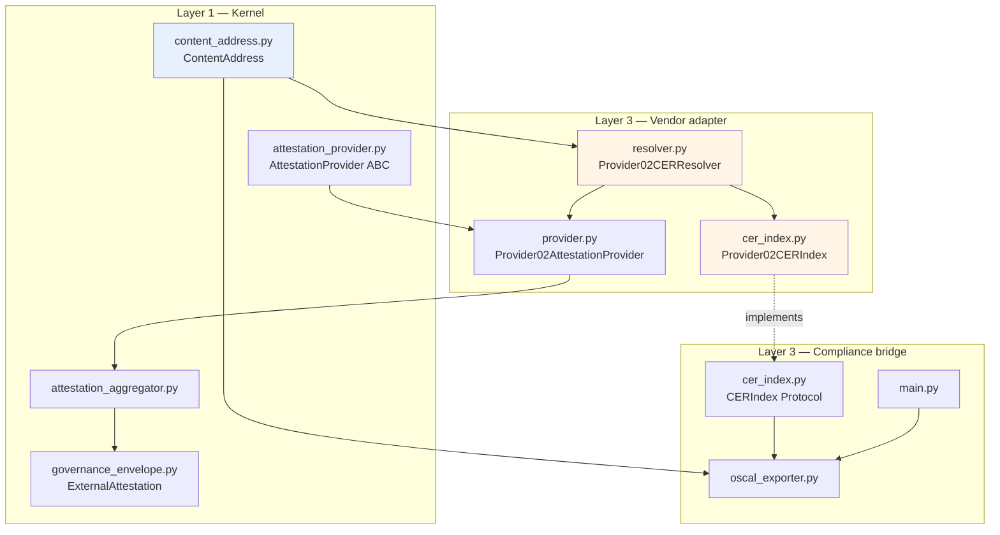
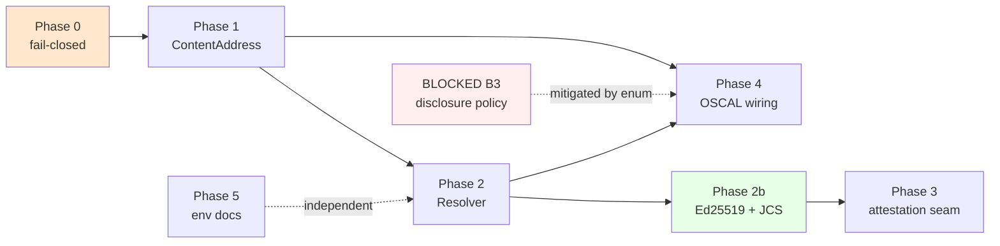

# Provider 02 (CER) Integration — Unblocked Implementation Plan

**Status:** Proposed
**Scope:** The subset of CAGE↔Provider 02 work that can be implemented **without**
any further input from the vendor.
**Companion doc:** [`docs/meetings/nexart_sep9_prep.md`](../docs/meetings/nexart_sep9_prep.md)
**Reference artifact:** a live CER for
`sha256:54647b22bfbf7166613c12dabda026a6a21647d85f3e12de3206d8ebfbc066e6`,
captured 2026-09-09 from the vendor's public resolver. See §2.

> **Reference architecture note.** CAGE is an illustrative reference architecture.
> Provider integrations are anonymized (`provider_02`) and have no configured live
> endpoint. Everything below is an integration pattern for adopters to adapt.
> Breaking changes are acceptable and preferred over compatibility shims.

---

## 1. Blocked vs. unblocked

The vendor's message already specifies the resolver contract in full: exact-hash
addressing, `INVALID_HASH_FORMAT` on a malformed hash position, immutable cache
headers with `ETag` and conditional `304`, CORS, `404` for unknown **and**
private/hidden records, both encoded and unencoded colon forms resolving, JSON on
machine dereference, and a `links` block carrying self / key manifest / verify /
humanVerifier.

**The captured CER (§2) collapses the blocked list from three items to one.** The
receipt is fully self-describing: it declares `canonicalization: "jcs"`, ships the
exact canonical payload bytes, names the signature algorithm and key, and embeds
the verifying public key as a JWK. Nothing about signature verification needs to be
asked — it needs to be read.

### Blocked — do not start

| # | Item | Blocked by | Why it cannot proceed |
|---|---|---|---|
| ~~B1~~ | ~~Ed25519 signature verification~~ | ~~D3~~ | **UNBLOCKED by the captured CER.** Algorithm, canonicalization, signed field set, payload bytes, signature encoding and public key are all present in the receipt. Promoted to Phase 2b. |
| ~~B2~~ | ~~JCS digest agreement~~ | ~~Q1~~ | **UNBLOCKED.** The CER states `canonicalization: "jcs"` and carries `canonical.certificate.hash` with `matchesCertificateHash: true`. Both sides use RFC 8785. Becomes a fixture test, not a negotiation. |
| B3 | Final private-CER disclosure policy | D2 | Still a joint decision, but **narrowed** — see §2.4. The vendor already field-redacts with HMAC commitments, which changes what "private" means. Implemented behind a swappable policy seam regardless. |

### Unblocked — implementable now

| # | Item | Phase | Rationale for being unblocked |
|---|---|---|---|
| U1 | Stop `_verify_local()` returning `valid=True` without a signature check | 0 | A fail-open in a security path. Correcting a lie needs no vendor input. |
| U2 | Vendor-neutral `ContentAddress` digest primitive | 1 | `sha256:<hex>` is an OCI-style content address, not vendor-specific. |
| U3 | Digest agility — parse the algorithm prefix instead of `len == 64` | 1 | Strictly better than the hardcode regardless of how Q2 is answered. |
| U4 | `Provider02CERResolver` — exact-hash GET, `If-None-Match`/304, error mapping | 2 | Contract fully specified in the vendor's message. |
| **U9** | **Real Ed25519 verification + certificate-hash recomputation** | **2b** | **Fully specified by the captured CER.** Was B1. |
| **U10** | **JCS cross-implementation fixture test** | **2b** | **Confirmed shared canonicalization.** Was B2. |
| U5 | `AttestationProvider` subclass → `external_attestations[]` | 3 | Entirely CAGE-side kernel seam. |
| U6 | `CERIndex` seam so OSCAL `cer_uris` is actually reachable | 4 | Plumbing is independent of the disclosure policy it will carry. |
| U7 | Fix the `cer-hash` prop extraction bug | 4 | The current `rsplit` is wrong for *any* answer to D1a. |
| U8 | Document `PROVIDER_02_*` in `.env.example` | 5 | Pure documentation; the variables already exist in code. |

**Two blocked decisions are dissolved rather than waited on:**

- **D1a** (`cer-hash` artifact-typed vs. bare hex) becomes moot by emitting
  *structured* props — `cer-hash` (bare hex) **and** `cer-digest-alg` (`sha256`) —
  instead of one ambiguous string. The artifact-typed form stays in the link `href`
  where it belongs.
- **D1b** (canonical colon form) collapses to a single module constant. The parser
  accepts both forms; emission picks one.

---

## 2. What the captured CER establishes

A live receipt was retrieved from the public resolver for
`sha256:54647b22…c066e6`. It is the ground truth for everything below and settles
several questions the prep doc had listed as open.

### 2.1 Structure

Seven top-level sections: `identity`, `proof`, `verification`, `bundle`,
`canonical`, `timestamp`, `links`. Key facts:

| Field | Value | Consequence for CAGE |
|---|---|---|
| `artifactType` | `cer` | Confirms artifact-typed resolution. |
| `schemaVersion` / `protocol_version` | `1.0` / `1.3.1` | Version-pin the parser; reject unknown majors. |
| `bundle_type` | `cer.ai.execution.v1` | A **typed** bundle. See §2.5 — this is not CAGE's shape. |
| `canonical.certificate.canonicalization` | `jcs` | **Same canonicalization CAGE uses.** Settles Q1. |
| `canonical.certificate.hashAlgorithm` | `sha256` | Matches CAGE's digest. |
| `canonical.certificate.matchesCertificateHash` | `true` | The resolver self-attests the digest binding. |
| `verificationEnvelope.algorithm` | `Ed25519` | Settles the algorithm half of D3. |
| `canonical.envelope.publicKeyJwk` | OKP/Ed25519, `kid: k1` | **The verifying key ships inside the response.** |
| `links.self` | uses `sha256%3A` | The vendor's own canonical emission is **encoded**. Settles D1b. |
| `timestamp.type` | `rfc3161`, DigiCert TSA | An independent time anchor CAGE does not currently model. |
| `bundle.anchors[]` | `transparency_log`, index 478 | Inclusion proof — a second, stronger anchor. |

### 2.2 The signature scheme is fully specified

`verificationEnvelope.signedFields` names exactly what is covered:

- `bundle`: `bundleType`, `version`, `createdAt`, `snapshot`
- `attestation`: `attestationId`, `attestedAt`, `kid`, `nodeRuntimeHash`, `protocolVersion`

And `canonical.envelope.payload` ships **the exact canonical bytes that were
signed**, so verification does not depend on CAGE reconstructing them correctly:

```
Ed25519_verify(
    key       = canonical.envelope.publicKeyJwk,
    message   = canonical.envelope.payload,      # UTF-8, JCS-canonical
    signature = b64url_decode(verificationEnvelopeSignature),
)
```

Signature encoding is **base64url, unpadded** — `SUx8CEictzwtCp71Grack…gcCCAg`
is 86 characters, decoding to exactly 64 bytes, and contains `_` with no `=`.
This is the last piece D3 was waiting on. **B1 is unblocked.**

### 2.3 Two independent verifications, not one

The receipt supports two checks that must not be conflated:

1. **Certificate-hash binding** — SHA-256 over `canonical.certificate.payload`
   must equal the digest in the URI. Proves the receipt matches what was requested.
2. **Envelope signature** — Ed25519 over `canonical.envelope.payload`. Proves the
   attestation node signed it.

Check 1 without check 2 proves only self-consistency: a forged receipt is trivially
self-consistent. Check 2 without check 1 leaves the response unbound from the URI.
**CAGE must perform both**, and `signature_checked` (§5b) must mean *both passed*.

The `publicKeyJwk` in the response is convenient but **must not be the trust
anchor** — a forger controls the whole body. The key must be matched by `kid`
against the independently-fetched `links.keyManifest`
(`/.well-known/nexart-node.json`). This is precisely what the existing JWK cache
in [`_sync_jwks()`](../src/integrations/provider_02/provider.py:363) is for, and it
answers the second part of D3: **yes, the key manifest is the sync source.**

> This is the single most important architectural point in the plan. Verifying
> against the response's own embedded key is security theatre. Design the API so
> that mistake is impossible to make.

### 2.4 Confidential-field commitments — new capability, not in any prior notes

`snapshot.confidential` declares `fields: ["input", "output"]`, `scheme:
"hmac-sha256-v1"`. In the canonical payload the values are replaced by:

```json
{"_redacted": true, "commitment": "hmac-sha256:716388b3…", "commitmentScheme": "hmac-sha256-v1", "mode": "confidential"}
```

The prompt, model, parameters and timestamps stay in clear; only input/output are
committed. This is materially better than the binary public/private model D2
assumed — an auditor can verify a redacted receipt end-to-end **without** seeing
the sensitive payload, then selectively open individual fields if authorized.

`ContentAddress.parse()` must therefore also accept `hmac-sha256:<hex>`. Same
`<alg>:<hex>` grammar, different algorithm family — the Phase 1 table simply gains
a row. Note the commitment digests are **not** content addresses of the plaintext;
they are keyed HMACs. `ContentAddress` must not imply they are dereferenceable.

### 2.5 Bundle shape mismatch and adapter domain leakage

**Two problems, one root.**

#### The adapter encodes Layer 4 demo vocabulary

[`adapter.py`](../src/integrations/provider_02/adapter.py:98) hardcodes the finance
demo's graph:

- `_ATTESTATION_NODES` — a frozenset literally naming `nemo_guardrail`,
  `evaluator`, `safety_check`, `governed_trader`, `explainer`, `nemo_output_rail`
- `_GRAPH_PARENTS` — a hand-written topology map of the demo's edges
- [`_classify_terminal_path()`](../src/integrations/provider_02/adapter.py:319) —
  branches on `"governed_trader" in node_names`

CAGE ships **zero built-in applications**. The Governed Financial Advisor is a
Layer 4 demo proving the substrate works; it does not define the substrate. A
Layer 3 integration hardcoding Layer 4 node names means **the adapter functions for
exactly one application** — any other adopter gets an empty bundle, silently,
because their node names never match the frozenset.

Gate G3 does not catch this: it scans `src/gateway/` for illegal imports, and this
is Layer 3 holding Layer 4 *string literals*, not imports. A real coupling the
boundary checker cannot see.

The fix is injection — the callback takes a topology and a node-significance
predicate at construction:

```python
Provider02AttestationCallback(
    topology=GraphTopology(parents={...}),
    is_significant=lambda node: ...,
    classify_terminal=...,
)
```

The demo then supplies its own graph from Layer 4, where that vocabulary belongs.

#### The bundle shape mismatch

The vendor's bundle is `cer.ai.execution.v1`: a **single** model execution with
`inputHash`/`outputHash`/`parameters`/`prompt`. CAGE's
[`AttestationBundle`](../src/integrations/provider_02/adapter.py:161) is a
**multi-step DAG** with `parentStepIds`, terminal-path classification and per-node
`stateHash` values.

Two properties hold for *any* adopter, not just the finance demo:

1. **Governance events may involve no model call.** A fail-closed barrier block is
   among the most evidentially significant outcomes and has no
   `inputHash`/`outputHash`.
2. **Causal structure is the evidence.** Which checks ran, in what order, and which
   path was taken is what a regulator asks about. Flattening the DAG discards it.

#### Sequencing

Both are **out of scope for this plan** — resolution and verification (read path)
are independent of bundle registration (write path), so every phase below proceeds
regardless.

They are also coupled to each other: there is no point generalizing the bundle
assembler before the vendor discussion settles what shape it assembles into (see
§5 of the meeting brief). Do the de-hardcoding and the bundle-shape work together,
in a follow-on plan.

#### Recommended target shape (from the §5 analysis)

**(a) + hash chaining now; converge on (c) bundle-of-bundles later.**

Plain per-boundary receipts (option (a)) have a disqualifying flaw: the causal DAG
becomes CAGE's *unsigned assertion*. Each receipt is individually signed, but the
edges between them are not, so an auditor gets N trustworthy facts and one
untrustworthy story connecting them. Worse, **omission is undetectable** — a
deployment can simply not emit an inconvenient boundary and nothing in the
remaining set reveals the gap.

A workflow bundle type (option (b)) fixes that by putting the DAG inside the
signature, but it blocks CAGE on vendor schema work, produces unbounded payloads,
and fits long-running or HITL-interrupted agents poorly — a bundle implies a
completion point that some adopters never reach.

The resolution: have each child receipt commit to its predecessors'
certificate hashes. CAGE already owns the primitive —
[`ProvenanceRecord.parent_hash`](../src/gateway/governance/provenance_chain.py:94)
with [`verify_chain_integrity()`](../src/gateway/governance/provenance_chain.py:220),
RFC 8785 canonicalized, the same JCS the vendor uses. Carrying
`parentCertificateHashes[]` in the child snapshot makes edges signed and omission
detectable **with no vendor schema change**, since it is opaque snapshot data.

This is also a strict subset of option (c): chained children are exactly the
children a parent bundle would later seal. Nothing is discarded if (c) lands.
Failure mode is the right one too — a crashed run leaves valid attested children
rather than (b)'s nothing at all.

The vendor's bundle is `cer.ai.execution.v1`: a **single** model execution with
`inputHash`/`outputHash`/`parameters`/`prompt`. CAGE's
[`AttestationBundle`](../src/integrations/provider_02/adapter.py:161) is a
**multi-step DAG** with `parentStepIds`, terminal-path classification and
per-node `stateHash` values.

These are different data models. Our `registerProjectBundle` payload does not
conform to `cer.ai.execution.v1`, and no amount of resolver work reconciles that.
It is the correct agenda item for the call and is **out of scope for this plan** —
resolution and verification (read path) are independent of bundle registration
(write path), so all phases below proceed regardless.

### 2.6 Timestamp and transparency-log anchors — deferred

`trustedTimestamps[]` carries an RFC 3161 DigiCert token; `anchors[]` carries a
transparency-log inclusion entry. Both are stronger evidence than the signature
alone. CAGE has no model for either today. Capture them as opaque metadata in
Phase 2 (cheap, preserves the evidence) and defer validation to a follow-on. Do
**not** claim RFC 3161 validation we have not implemented — that would repeat
exactly the mistake Phase 0 exists to correct.

---

## 3. Target architecture (read path)



**Layer discipline.** Layer 3 → Layer 1 imports are legal and already precedented:
[`provider_05/blueprint_provider.py:28`](../src/integrations/provider_05/blueprint_provider.py:28)
imports `AttestationProvider` directly. No new entry in
`INTEGRATIONS_FACTORY_ALLOWLIST` is required, because nothing in `src/gateway/`
gains an import of `src.integrations`. Gate G3 stays green by construction.

`compliance_bridge` must **not** import `provider_02` directly. It declares a
`CERIndex` Protocol and receives an implementation by injection at app wiring.
The boundary checker only scans `src/gateway/`, so this is a design standard
rather than a CI-enforced one — hold it anyway.

---

## 4. Phase 0 — Fail-closed correction ✅ COMPLETE

> **Landed 2026-09-09** on `fix/provider-02-verify-failclosed`.
> Commit: `fix(security): fail closed when CER signature is unverified`.
> The invariant is enforced in `CERVerification.__post_init__`, so
> `valid=True, signature_checked=False` now raises `ValueError` — the fail-open
> is unrepresentable rather than merely absent. `_verify_remote()` also fails
> closed, since a remote endpoint asserting `valid=True` is not CAGE having
> checked a signature. Phase 2b is the only path that may set
> `signature_checked=True`.

**Branch:** `fix/provider-02-verify-failclosed`

### Problem

[`_verify_local()`](../src/integrations/provider_02/provider.py:274) confirms the
JWK cache is populated and that the hash is 64 characters, then returns
`CERVerification(valid=True, signer="provider-02-attestation-node", ...)`.

No signature is checked. A caller reading `valid` gets `True` for any 64-character
string. This is a fail-open in an attestation path, and it is independent of B1 —
we do not need the signature spec in order to stop asserting a verification we
never performed.

### Change

`_verify_local()` must never return `valid=True` until B1 lands. It returns a
result that is explicitly *unverified*, carrying enough structure that the caller
can distinguish "resolvable but cryptographically unverified" from "invalid".

Extend `CERVerification` with a `signature_checked: bool = False` field. While
B1 is outstanding, `valid` is `False` whenever `signature_checked` is `False`.

Rename the method to `_inspect_local()` — it inspects, it does not verify. The
rename is desirable: it removes a name that misdescribes the behaviour, and
nothing outside the class calls it.

### Kernel vocabulary addition

`AttestationStatus` ([`governance_envelope.py:113`](../src/gateway/governance/governance_envelope.py:113))
has `VERIFIED | DENIED | STALE | DRIFT_DETECTED | ERROR`. None honestly describes
"the receipt resolved and is well-formed, but its signature has not been checked."

Add `UNVERIFIED = "UNVERIFIED"`. Until B1 lands, every CER-derived attestation
carries `UNVERIFIED` and never `VERIFIED`.

> **Decision required from you.** This edits a kernel enum whose docstring says it
> mirrors the OSCAL four-state finding vocabulary. The alternative is reusing
> `STALE`, which would be inaccurate. I recommend adding `UNVERIFIED` and updating
> the docstring to note the deliberate extension.

### Acceptance

- No code path returns `CERVerification(valid=True)` while `signature_checked` is `False`.
- A test asserts a 64-char hash with a populated JWK cache yields `valid=False`.
- Existing tests at [`test_provider_02_adapter.py:504`](../tests/test_provider_02_adapter.py:504)
  (`test_verify_local_accepts_valid_hash_length`) **will fail** and must be
  rewritten to assert the new fail-closed contract. This is the intended breakage.

---

## 5. Phase 1 — `ContentAddress` kernel primitive

**Branch:** `feat/content-address-primitive`
**New file:** `src/gateway/governance/content_address.py`

### Placement rationale

Applying the decision test from `AGENTS.md` — *"if two domains had different
copies of this, would a security fix have to be applied twice?"* — digest parsing
is security-critical and answers yes. It is also vendor-neutral: `<alg>:<hex>` is
the OCI/RFC 6920 style content address, not a Provider 02 invention. It belongs in
Layer 1 and must contain no vendor vocabulary — no `CER`, no `nexart`, no
`provider_02`.

### Surface

```python
@dataclass(frozen=True)
class ContentAddress:
    algorithm: str        # "sha256"
    hex_digest: str       # lowercase hex, no prefix

    @classmethod
    def parse(cls, raw: str) -> ContentAddress: ...
    # accepts "sha256:<hex>", "sha256%3A<hex>", case-insensitive hex

    @property
    def canonical(self) -> str: ...      # "sha256:<hex>"  — emission form
    @property
    def url_encoded(self) -> str: ...    # "sha256%3A<hex>"
```

Supported algorithms and their expected hex lengths live in one table:
`sha256` → 64, `sha384` → 96, `sha512` → 128, plus `hmac-sha256` → 64 for the
confidential-field commitments observed in §2.4. This resolves U3 — the `len == 64`
hardcode at [`provider.py:290`](../src/integrations/provider_02/provider.py:290)
becomes a table lookup, so SHA-384/512 stop failing closed by accident. Q2 then
only decides which algorithms we *enable*, not whether the code can express them.

A `kind` discriminator separates `DIGEST` (dereferenceable content address) from
`COMMITMENT` (keyed HMAC, **not** dereferenceable). Without it, a caller could
reasonably try to resolve `hmac-sha256:716388b3…` against the resolver. Encode the
distinction in the type rather than relying on callers to remember it.

`parse()` raises `MalformedContentAddress` on: missing separator, unknown
algorithm, non-hex characters, wrong digest length for the algorithm, or a UUID in
the digest position. That last case is what makes CAGE reject locally what the
vendor's resolver would reject with `INVALID_HASH_FORMAT` — we fail before
spending a network round trip.

### Acceptance

- Round-trip property: `parse(x.canonical) == parse(x.url_encoded) == x`.
- A UUID in the digest position raises, and never produces a request.
- `pytestmark = [pytest.mark.unit, pytest.mark.local]`.
- Apache 2.0 header present (CI `license-check`).

---

## 6. Phase 2 — `Provider02CERResolver`

**Branch:** `feat/provider-02-cer-resolver`
**New file:** `src/integrations/provider_02/resolver.py`

This is the component the prep doc wrongly claimed already existed. Nothing in the
codebase constructs a `/v1/resolve/cer/...` URL today.

### Surface

```python
class Provider02CERResolver:
    def __init__(
        self,
        base_url: str = "",          # PROVIDER_02_RESOLVER_URL
        timeout: float = 5.0,        # PROVIDER_02_RESOLVER_TIMEOUT
        verify: str | bool = True,   # PROVIDER_02_CA_BUNDLE, else system trust
    ) -> None: ...

    async def resolve(self, address: ContentAddress | str) -> CERResolution: ...
```

`resolve()` accepts a `str` for ergonomics but immediately parses to
`ContentAddress`, so a malformed input raises before any network call.

URL construction uses `address.url_encoded` — the `sha256%3A` form. The captured
CER settles D1b: the vendor's own `links.self` and `links.humanVerifier` both emit
percent-encoded. Matching their canonical form means CAGE-emitted links are
byte-identical to vendor-emitted ones for the same receipt, which matters as soon
as anything digests an SSP. Both forms resolve, so this is a compatibility-neutral
choice in favour of consistency. One module constant governs it.

### Result type

```python
@dataclass(frozen=True)
class CERResolution:
    address: ContentAddress
    status: str                     # AttestationStatus value
    resolved: bool
    signature_checked: bool = False # set only by Phase 2b
    etag: str = ""
    from_cache: bool = False
    evidence: dict[str, Any] = field(default_factory=dict)
    links: dict[str, str] = field(default_factory=dict)   # self, keyManifest, verify, humanVerifier
    anchors: list[dict[str, Any]] = field(default_factory=list)   # transparency log (§2.6)
    timestamps: list[dict[str, Any]] = field(default_factory=list) # RFC 3161, opaque (§2.6)
    findings: list[dict[str, Any]] = field(default_factory=list)
```

`links` is captured as first-class rather than left inside `evidence`. The
`keyManifest` entry is what Phase 2b verifies against, and `humanVerifier` is what
an auditor follows by hand — both belong in the OSCAL emission path in Phase 4.

`anchors` and `timestamps` are captured **verbatim and unvalidated** per §2.6.
Preserving evidence we cannot yet check is right; asserting we checked it is not.

### Error mapping — fail-closed throughout

| Condition | `resolved` | `status` | Finding `code` | Retryable |
|---|---|---|---|---|
| `200` + `ETag` | `True` | `UNVERIFIED` | — | — |
| `304` | `True` | `UNVERIFIED` | — | — |
| Local parse failure | `False` | `ERROR` | `CER_MALFORMED_REF` | no |
| `400 INVALID_HASH_FORMAT` | `False` | `ERROR` | `CER_MALFORMED_REF` | no |
| `404` | `False` | `STALE` | `CER_UNRESOLVABLE` | no |
| Timeout / `5xx` / transport | `False` | `ERROR` | `ENDPOINT_ERROR` | yes |

Two points of care:

**`200` maps to `UNVERIFIED`, not `VERIFIED`.** Successful resolution proves the
receipt exists and is well-formed. It does not prove the signature. Only Phase 2b
can promote this, and Phase 0 makes that promotion structurally impossible to do
by accident.

**`404` must not be read as forgery.** The vendor returns an identical `404` for
unknown and for private/hidden. The finding text must say *unresolvable*, never
*absent* or *invalid*. Getting this wrong would have CAGE accusing an adopter of
fabricating evidence that merely happens to be private.

### Caching

An in-process dict keyed by `address.canonical`, holding the `ETag` and the parsed
body. Subsequent resolutions send `If-None-Match`; a `304` returns the cached body
with `from_cache=True`.

Content-addressed data is immutable by definition, so entries need no TTL. This
also settles Q3 in the safe direction independently of the answer: CAGE is free to
re-verify that the returned body actually hashes to the digest in the URI. That
check costs one hash over a small JSON body and removes a trust assumption, so we
do it unconditionally rather than relying on the CDN. If it ever fails, that is
`CER_DIGEST_MISMATCH` — fail-closed, non-retryable.

### Error-convention consolidation

The package currently holds two conventions:
[`Provider02Client`](../src/integrations/provider_02/adapter.py:536) **raises**
`Provider02Error(code="ENDPOINT_ERROR")`, while
[`Provider02AttestationProvider`](../src/integrations/provider_02/provider.py:252)
**returns** a dataclass with `error` populated. The resolver adopts the
**returning** convention with structured `findings`, matching the Secure Plugin &
Adapter Architecture Specification. Unifying `Provider02Client` onto it is
deliberately out of scope here — it is a separate refactor and would inflate this
change set.

### Acceptance

- Hermetic tests only, using `respx`. No live calls in PR CI.
- Cases: 200+ETag; 304 revalidation; 404; `INVALID_HASH_FORMAT`; timeout; digest
  mismatch; UUID-in-hash-position rejected with zero requests issued.
- A test asserts a `200` never yields `VERIFIED`.
- Register in the conformance suite where the attestation-provider surface applies.

---

## 7. Phase 2b — Real verification (was blocked, now unblocked)

**Branch:** `feat/provider-02-cer-verification`
**Depends on:** Phase 2

This is the work the prep doc listed as B1/D3. The captured CER supplies every
missing input, so it proceeds now.

### Two-stage verification

Per §2.3, both stages must pass before anything is called verified.

**Stage 1 — certificate-hash binding.**
`SHA-256(canonical.certificate.payload.encode("utf-8"))` must equal
`address.hex_digest`. Also assert the receipt's own
`canonical.certificate.matchesCertificateHash` is `true`. Failure →
`CER_DIGEST_MISMATCH`, fail-closed, non-retryable.

**Stage 2 — envelope signature.**

```python
Ed25519_verify(
    key       = <public key resolved by kid from the KEY MANIFEST>,
    message   = canonical.envelope.payload.encode("utf-8"),
    signature = b64url_decode_unpadded(verificationEnvelopeSignature),
)
```

Failure → `CER_SIGNATURE_INVALID`, fail-closed, non-retryable.

Only when both pass may `signature_checked=True` and
`AttestationStatus.VERIFIED` be set.

### The trust-anchor rule

**The key used for Stage 2 must come from the JWK cache populated by
`links.keyManifest`, never from `canonical.envelope.publicKeyJwk` in the response
body.** A forger controls the entire response including its embedded key;
verifying against it proves nothing.

Enforce this in the type system, not in review comments: the verification function
accepts a resolved `Ed25519PublicKey`, and only the JWK-cache lookup can produce
one. The response's embedded key may be compared for diagnostics and logged on
mismatch, but must never reach the verifier.

If `kid` is absent from the cache: refresh once, then fail closed with
`CER_UNKNOWN_KEY`. Never fall back to the embedded key.

### JWK source correction

[`_sync_jwks()`](../src/integrations/provider_02/provider.py:363) currently reads
`PROVIDER_02_JWK_ENDPOINT`. The manifest is at
`/.well-known/nexart-node.json`, and each resolution advertises it via
`links.keyManifest`. Default the endpoint to the well-known path while keeping the
env var as an override. The existing ETag/304 handling and 24h TTL carry over
unchanged.

Keys are OKP/Ed25519 JWKs (`crv: "Ed25519"`, `x: <base64url>`), loadable via
`cryptography`'s `Ed25519PublicKey.from_public_bytes(b64url_decode(x))`. No new
dependency — `cryptography` is already present transitively via the KMS signer.

### Completing Phase 0

With this in place, `_inspect_local()` regains the ability to return
`valid=True` — but only via `signature_checked=True`, which only the two-stage
path can set. The Phase 0 fail-closed default remains the behaviour for every
other route.

### JCS fixture test (U10)

§2.1 confirms both sides use RFC 8785. Convert Q1 from a negotiation into a
regression guard: feed `canonical.certificate.payload` (parsed back to a dict)
through [`jcs_canonicalize_plan()`](../src/gateway/governance/jcs_canonicalizer.py:24)
and assert the output is byte-identical to the vendor's payload string.

This is a genuinely valuable test. It exercises `null` handling (`seed`, `topP`,
`modelVersion`), integer-vs-float formatting (`temperature: 0`, `maxTokens: 1024`),
nested object key ordering, and non-ASCII escaping — the exact areas where JCS
implementations diverge. If it passes, `stateHash` interop is proven rather than
assumed.

### Test fixture

Commit the captured CER as
`tests/fixtures/provider_02/cer_sha256_54647b22.json`.

It is public evidence from a public resolver, contains no CAGE secrets, and its
sensitive fields are already HMAC-redacted by the vendor. It carries a real
Ed25519 signature over real canonical bytes, so it verifies genuinely — a
hand-rolled fixture would only test our own assumptions.

Add a **negative** fixture: the same receipt with one byte of
`canonical.envelope.payload` flipped. Signature verification must fail. A verifier
that only ever sees valid inputs is not known to reject invalid ones.

### Acceptance

- Real fixture: Stage 1 and Stage 2 both pass; `status == VERIFIED`.
- Tampered fixture: Stage 2 fails; `status == ERROR`, `CER_SIGNATURE_INVALID`.
- Digest-mismatch fixture: Stage 1 fails; `CER_DIGEST_MISMATCH`.
- **A test asserts that a receipt whose embedded `publicKeyJwk` is valid but whose
  `kid` is absent from the JWK cache fails closed.** This is the trust-anchor
  regression guard; it is the test most worth writing.
- JCS round-trip is byte-identical.
- `pytestmark = [pytest.mark.unit, pytest.mark.local]` — fully hermetic, no network.

---

## 8. Phase 3 — `external_attestations[]` seam

> **⚠️ MERGED — do not execute independently.** This phase and
> **Phase 4 of [`layer_inversion_remediation_plan.md`](layer_inversion_remediation_plan.md)**
> rewrite the same class. Executing both produces a merge conflict.
>
> **Resolution** (see [`consolidated_implementation_plan_2026-09-09.md`](consolidated_implementation_plan_2026-09-09.md) §3):
> do it **once, at Layer-Inversion Phase 4 timing (now), emitting `UNVERIFIED`**
> rather than waiting for Phase 2b.
>
> Two reasons this reverses the sequencing below. First, the contract is broken
> *today* — `get_normative_provider()` returns `provider_02` as a
> `NormativeProvider` behind a `type: ignore`, so any caller treating it as one
> raises `AttributeError`. That is a live defect and should not wait on Ed25519
> work. Second, `UNVERIFIED` is *honest* after Phase 0: `_inspect_local()`
> genuinely performs no signature check.
>
> The concern below — that permanently-`UNVERIFIED` entries train people to ignore
> the distinction — is addressed by an **assertion instead of a sequencing
> constraint**: add a test that fails when Phase 2b lands if the status does not
> become `VERIFIED`. The transition then becomes a visible, enforced event.

**Branch:** `feat/provider-02-attestation-seam`

The highest-value gap. CER receipts exist but never reach a governance envelope,
because [`Provider02AttestationProvider`](../src/integrations/provider_02/provider.py:137)
does not implement the
[`AttestationProvider`](../src/gateway/governance/attestation_provider.py:36) ABC
(`fetch_attestations()` + `provider_name`). The conformance suite only asserts the
class imports ([`test_normative_provider_conformance.py:49`](../tests/test_normative_provider_conformance.py:49)),
which is why this went unnoticed.

### Change

Subclass the ABC, following the
[`Provider05BlueprintProvider`](../src/integrations/provider_05/blueprint_provider.py:41)
precedent exactly:

```python
class Provider02AttestationProvider(AttestationProvider):
    @property
    def provider_name(self) -> str:
        return "provider_02-cer"

    async def fetch_attestations(self, context) -> list[ExternalAttestation]:
        # context: {"cer_addresses": [ContentAddress | str, ...]}
        # -> ExternalAttestation(attestation_type="CER", status=UNVERIFIED, ...)
```

`receipt_id` carries `address.canonical`. `metadata` carries `human_verifier`,
`key_manifest`, `etag`, and `signature_checked: False`.

Once it satisfies the ABC it can be handed to
[`AttestationAggregator.register()`](../src/gateway/governance/attestation_aggregator.py:84),
which already boot-fetches, polls on a 6-hour cadence, caches in memory, and — per
[`_do_fetch()`](../src/gateway/governance/attestation_aggregator.py:122) — emits a
`PROVIDER_ERROR:` entry when a provider throws. No aggregator changes needed.

> **Note the deliberate asymmetry.** The aggregator is documented fail-**open**
> (its §7.3): one provider's failure must not suppress the others. The resolver is
> fail-**closed**: it never reports success it cannot substantiate. These compose
> correctly — a failed CER fetch surfaces as a recorded `PROVIDER_ERROR` entry in
> the envelope rather than as silence. Worth stating explicitly so a later reader
> does not "fix" one to match the other.

### Acceptance

- `isinstance(Provider02AttestationProvider(), AttestationProvider)` holds.
- Aggregator registration produces `ExternalAttestation` entries with
  `type="CER"`.
- Provider failure yields a `PROVIDER_ERROR:provider_02-cer` entry, not an
  exception escaping the aggregator.
- Strengthen `test_attestation_providers_exist` to assert ABC conformance, not
  just importability — the weak assertion is what let this gap persist.

---

## 9. Phase 4 — OSCAL emission actually reachable

**Branch:** `feat/oscal-cer-links-wiring`

### The real gap

[`build_oscal_assessment_results()`](../src/compliance_bridge/oscal_exporter.py:115)
already accepts `cer_uris` and already emits `rel: "evidence"` links at
[line 207](../src/compliance_bridge/oscal_exporter.py:207), covered by seven
passing tests in [`test_oscal_cer_links.py`](../tests/test_oscal_cer_links.py).

But the only production caller —
[`main.py:825`](../src/compliance_bridge/main.py:825) — omits the argument. **At
runtime, zero CER links are ever emitted.** The feature is built, tested, and
unreachable.

### 7.1 Fix the `cer-hash` prop bug (U7)

```python
cer_hash = cer_uri.rstrip("/").rsplit("/", 1)[-1] if "/" in cer_uri else cer_uri
```

Against the vendor's URI this yields `sha256:54647b22…`, and against the encoded
form `sha256%3A54647b22…`. The prop carries the artifact-type prefix, and the two
URI forms produce *different* prop values for the *same* receipt.

Replace with `ContentAddress.parse()` and emit structured props:

| Prop | Value |
|---|---|
| `cer-hash` | bare lowercase hex |
| `cer-digest-alg` | `sha256` |

This dissolves D1a: the machine-readable digest is unambiguous, the algorithm is
explicit, and the artifact-typed form remains in the link `href` where it is the
correct representation.

### 7.2 `CERIndex` seam

`compliance_bridge` must not import `provider_02`. Declare a Protocol in
`src/compliance_bridge/cer_index.py`:

```python
class CERIndex(Protocol):
    def uri_for_control(self, control_id: str) -> str | None: ...
    def disclosure_for_control(self, control_id: str) -> Disclosure: ...
```

`Provider02CERIndex` in `src/integrations/provider_02/cer_index.py` implements it.
`main.py` accepts an optional `CERIndex` and builds `cer_uris` from it; when none
is injected, behaviour is byte-identical to today, so the seven existing tests
stay green.

### 7.3 Disclosure policy — D2 mitigated, not deferred

D2 is a joint decision, but the *shape* of the answer is knowable. Implement
option (a) behind an enum so the decision becomes configuration:

```python
class Disclosure(Enum):
    PUBLIC = "public"      # emit link[rel=evidence] + props
    PRIVATE = "private"    # emit props only, no dereferenceable link
    UNKNOWN = "unknown"    # treat as PRIVATE — fail-closed
```

Default `PRIVATE` for anything not explicitly marked public. The compliance
consequence is the point: an auditor dereferencing a `link[rel="evidence"]` that
`404`s cannot distinguish fabricated evidence from evidence they lack visibility
into. Emitting no link, plus a `cer-hash` prop, states honestly that evidence
exists and is not publicly dereferenceable.

Record the convention in SSP metadata so it is legible to an auditor who was not
in the meeting. If the vendor prefers (b) or (c), only the enum handling changes.

### Acceptance

- Seven existing tests in `test_oscal_cer_links.py` still pass unchanged.
- New: `PUBLIC` emits `links[]` + both props; `PRIVATE` emits props only;
  `UNKNOWN` behaves as `PRIVATE`.
- New: encoded and unencoded input URIs produce **identical** `cer-hash` props.
- Compliance obligation: OSCAL component update in `compliance/oscal/` within two
  business days of merge (per `AGENTS.md`). No Lula change — no Kubernetes
  resources are added or removed.

---

## 10. Phase 5 — Configuration documentation

**Branch:** `docs/provider-02-env-vars`

No `PROVIDER_02_*` variable appears in `.env.example`, `.env.development.example`,
or `.env.production.example` — verified by search. Only `PROVIDER_01_*` is
documented, and only in the gitignored `.env`. Every Provider 02 variable is
therefore undiscoverable without reading source.

Document, with placeholder values only: `PROVIDER_02_ATTESTATION_ENABLED`
(default `false`), `PROVIDER_02_API_ENDPOINT`, `PROVIDER_02_API_KEY`,
`PROVIDER_02_API_KEY_SECRET`, `PROVIDER_02_JWK_ENDPOINT`,
`PROVIDER_02_JWK_CACHE_TTL_HOURS`, `PROVIDER_02_TIMEOUT_SECONDS`,
`PROVIDER_02_ATTESTATION_TIMEOUT`, plus the new `PROVIDER_02_RESOLVER_URL`,
`PROVIDER_02_RESOLVER_TIMEOUT`, `PROVIDER_02_CA_BUNDLE`.

Secret-hygiene rules apply: no credential-shaped values, no real endpoints, and a
note that secrets belong in `terraform.auto.tfvars` reaching pods via
`secretKeyRef`.

This also repairs the test harness. TC-01/TC-02 in the prep doc gate on
`NEXART_RESOLVER_URL`, which exists nowhere — those tests would skip **silently,
forever**. Renaming to `PROVIDER_02_RESOLVER_URL` and documenting it makes the
skip legible.

---

## 11. Sequencing



Phase 0 first — it is a live fail-open and the smallest change. Phase 1 gates
Phases 2 and 4 because both need digest parsing. Phase 5 is independent and can
land any time.

**Phase 2b is the change of substance from the captured CER.** It was going to be
post-meeting work; it is now buildable immediately, and it is what converts the
integration from "resolves receipts" to "verifies receipts."

Phase 3 is sequenced **after** 2b rather than after 2, so that CER-derived
attestations can carry a real `VERIFIED` status on their first appearance in a
governance envelope. Shipping the seam with permanently-`UNVERIFIED` entries would
invite someone to treat `UNVERIFIED` as normal.

Every phase is a separate branch and a separate squash-merged PR. Phases 4 and 5
can proceed in parallel with 2b.

### The one remaining blocked item

**B3 (disclosure policy)** is a joint decision, not a technical unknown, and §9.3
implements it behind an enum. Whatever is agreed becomes a mapping change.

---

## 12. Verification

Per phase:

```bash
uv run pytest tests/ -m "local or unit" -n auto --dist loadscope --no-cov \
  -p no:langsmith -p no:langsmith_plugin --tb=short
uv run python scripts/check_import_boundaries.py --verbose
uv run ruff check . && uv run ruff format --check .
uv run mypy src/
uv run bandit -r src/ -c pyproject.toml -ll
```

Before the final PR:

```bash
make test-coverage
```

CI gates specifically at risk: `license-check` (three new source files),
`marker-contract-check` (every new test needs a selection marker),
`import-boundary-check` (Gate G3 — expected green, since no `src/gateway/` file
gains an `src.integrations` import).

---

## 13. Expected breakage

Intentional, and desirable under the clean-architecture-over-continuity rule:

| What breaks | Where | Why acceptable |
|---|---|---|
| `test_verify_local_accepts_valid_hash_length` | [`test_provider_02_adapter.py:504`](../tests/test_provider_02_adapter.py:504) | Asserts the fail-open we are removing. Rewrite to assert fail-closed. |
| `_verify_local` → `_inspect_local` | [`provider.py:274`](../src/integrations/provider_02/provider.py:274) | Private method, no external callers. Name currently misdescribes behaviour. |
| `AttestationStatus` gains `UNVERIFIED` | [`governance_envelope.py:113`](../src/gateway/governance/governance_envelope.py:113) | Additive. Any exhaustive match over the enum must handle it. |
| `CERVerification` gains `signature_checked` | [`provider.py:100`](../src/integrations/provider_02/provider.py:100) | Additive with a default. |
| `PROVIDER_02_JWK_ENDPOINT` default changes to the well-known path | [`provider.py:363`](../src/integrations/provider_02/provider.py:363) | Phase 2b. Env var still overrides; the old default pointed nowhere real. |

No deprecation shims. No compatibility layer.

---

## 14. Decisions — RESOLVED 2026-09-09

All five approved as recommended. Binding for implementation.

| # | Decision | Resolution |
|---|---|---|
| 1 | `AttestationStatus.UNVERIFIED` | **Add it.** Extend the kernel enum; update the docstring to record the deliberate departure from the OSCAL four-state vocabulary. Do not reuse `STALE`. |
| 2 | Disclosure defaults | **`UNKNOWN` → `PRIVATE`** (fail-closed). **`REDACTED` receives a `link[rel="evidence"]`** plus a prop naming the commitment scheme and redacted field list. |
| 3 | Phase 0 scope | **Standalone PR, shipped first.** Not bundled with Phase 1. |
| 4 | `Provider02Client` error convention | **Deferred.** The raise/return split stays for now. The resolver uses the returning convention. Separate refactor later. |
| 5 | CER test fixture | **Commit it** at `tests/fixtures/provider_02/cer_sha256_54647b22.json`, plus a byte-flipped negative fixture. |

---

## 15. Revised agenda impact

The captured CER changes what is worth discussing at 15:00. Three prep-doc
questions are now answered by the artifact and should be stated as confirmations
rather than asked:

| Was | Now |
|---|---|
| D3 — Ed25519 signed-payload spec | **Answered.** `signedFields` + `canonical.envelope.payload` + base64url. Confirm the trust-anchor rule (key manifest, not embedded key) and ask about **key rotation** — `kid: k1` implies a first key with rotation still to come. |
| Q1 — JCS agreement | **Answered.** Both sides RFC 8785. Becomes a fixture test. |
| D1b — canonical colon form | **Answered.** The vendor emits `%3A` in `links.self`; CAGE will match. |

Three items are **new** and worth the reclaimed time:

1. **Bundle shape mismatch and adapter domain leakage (§2.5)** — the adapter
   hardcodes Layer 4 demo node names, so it works for one application only; and
   `cer.ai.execution.v1` is single-execution while CAGE attests a multi-step DAG
   of arbitrary adopter topology. Is there a
   `cer.ai.workflow.*` bundle type, or should CAGE emit one CER per governance
   node and link them via the transparency log?
2. **Confidential-field commitments (§2.4)** — how is the HMAC key managed, and
   what is the selective-disclosure flow for an auditor authorized to open a
   specific field?
3. **RFC 3161 + transparency-log anchors (§2.6)** — CAGE will capture both as
   opaque metadata initially. What is the expected validation path, and is the
   log independently auditable?

Question 1 is the one that most affects CAGE's write path and deserves most of
the time.
