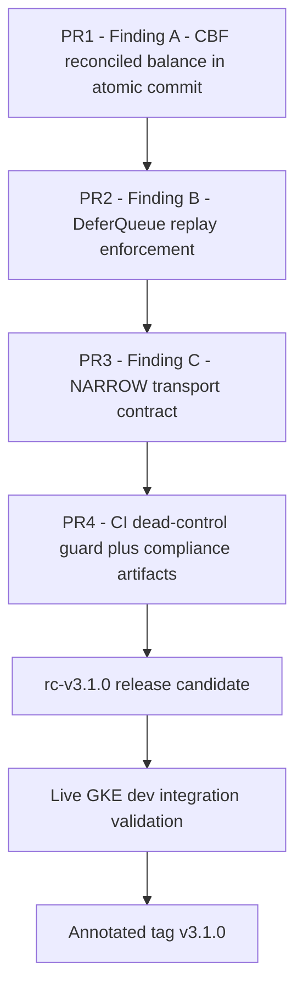
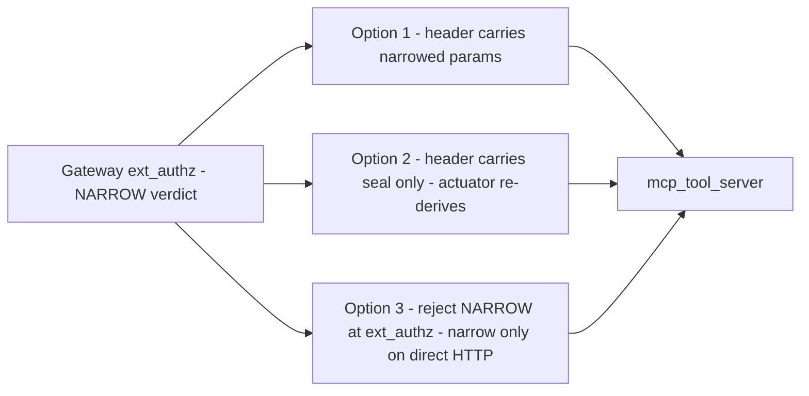

# Security Findings Remediation Plan — CAGE

**Status:** Proposed (awaiting approval before implementation in Code mode)
**Scope:** Three validated security findings surfaced by code analysis
**Audience:** Implementation agents, reviewers, and the technical roadmap response to Miracle Owolabi

> **Reference Architecture Note.** CAGE is a reference architecture with no
> production installations under this repository's management. The remediation
> sequencing, release gates, and adopter migration notes below are illustrative
> patterns for adopters to adapt, not operational obligations for this
> repository's maintainers. Per [`AGENTS.md`](../AGENTS.md), breaking changes
> are preferred over compatibility layers wherever they simplify.

---

## Table of Contents

1. [Executive Summary](#1-executive-summary)
2. [Priority and Sequencing](#2-priority-and-sequencing)
3. [Finding A — CBF Atomic Commit Bypasses Reconciled Ground Truth](#3-finding-a--cbf-atomic-commit-bypasses-reconciled-ground-truth-critical)
4. [Finding B — DeferQueue Inject Bypasses replay_evaluate](#4-finding-b--deferqueue-inject-bypasses-replay_evaluate-high)
5. [Finding C — NARROW Verdict Has No Transport to the Actuator](#5-finding-c--narrow-verdict-has-no-transport-to-the-actuator-medium)
6. [Integration Concerns](#6-integration-concerns)
7. [Release Planning](#7-release-planning)
8. [Validation Criteria](#8-validation-criteria)
9. [Compliance Artifact Obligations Summary](#9-compliance-artifact-obligations-summary)
10. [Execution Checklist](#10-execution-checklist)

---

## 1. Executive Summary

> **Label mapping.** This document re-labels the findings **A/B/C in
> remediation order**, which differs from the order they were reported in.
> Finding **A** = reported Finding #2 (POAM-023 reconciliation gap);
> Finding **B** = reported Finding #1 (DeferQueue replay bypass);
> Finding **C** = reported Finding #3 (NARROW transport).

| ID | Finding | Severity | Root cause class | Proposed POAM ID |
|---|---|---|---|---|
| **A** | [`LUA_ATOMIC_CBF`](../src/gateway/governance/cbf.py:246) reads `safety:current_cash` while [`_read_cbf_state_atomic()`](../src/gateway/governance/cbf.py:672) resolves KMS-signed `reconciliation:verified_balance` | **CRITICAL** | Enforcement path diverges from verification path | POAM-2026-069 |
| **B** | [`POST /v1/defer/{defer_id}/inject`](../src/compliance_bridge/main.py:1162) calls `queue.resolve()` directly; [`replay_evaluate()`](../src/gateway/governance/defer_queue.py:536) has zero production callers | **HIGH** | Control implemented but unwired | POAM-2026-070 |
| **C** | NARROW clamped params are computed and sealed but the Envoy [`OkHttpResponse`](../src/gateway/protos/envoy/service/auth/v3/authorization.proto:61) has no body field, so they never reach [`mcp_tool_server.py`](../src/gateway/server/mcp_tool_server.py) | **MEDIUM** | Incomplete architecture; currently fails safe | POAM-2026-071 |

All three share a single structural theme: **a control exists in code but the
enforcing call path does not traverse it**. This is the same defect class
already recorded in the POAM history as POAM-2026-032 (unwired
`FtraReachabilityGate`) and POAM-2026-033 (`DeferQueue` never persisted). The
remediation strategy therefore adds, in addition to the three point fixes, a
**generic "no dead control" CI guard** so the class does not recur.

### Shared architectural principle

> A verification result that the enforcement path cannot observe is not a
> control. Every control must be reachable from the *mutating* path, not only
> from a read-only diagnostic path.

---

## 2. Priority and Sequencing

Recommended order: **A → B → C**, one PR per finding, each squash-merged into
`main` before the next branch is cut. Finding A touches the CBF hot path, so
landing it first avoids rebasing the other two onto a moving `cbf.py`.



**Rationale for the ordering:**

1. **Finding A first (CRITICAL).** It is the only finding where an *actual*
   enforcement decision is currently made against unverified data. Findings B
   and C both have partial mitigations in place (B requires an authenticated
   compliance-bridge call; C fails safe behind routing-seal verification).
2. **Finding B second (HIGH).** Self-contained: one endpoint, one function,
   one new failure mode. No proto or transport changes.
3. **Finding C last (MEDIUM).** It is an architectural completion, not a live
   exploit. It requires the largest design surface (a transport contract
   decision) and benefits from being reviewed on a quiet `main`.
4. **PR4** carries the cross-cutting CI guard plus the OSCAL/Lula/POAM
   artifacts for all three, so the compliance diff is reviewed in one place.

**Branch names** (per [`AGENTS.md`](../AGENTS.md) branch conventions, ≤ 30 chars
after prefix):

| PR | Branch |
|---|---|
| PR1 | `fix/cbf-reconciled-atomic` |
| PR2 | `fix/defer-replay-enforce` |
| PR3 | `feat/narrow-transport` |
| PR4 | `ci/dead-control-guard` |

---

## 3. Finding A — CBF Atomic Commit Bypasses Reconciled Ground Truth (CRITICAL)

### 3.1 Problem restatement

Two balance-resolution paths exist and they disagree:

| Path | Function | Balance source | Reaches enforcement? |
|---|---|---|---|
| Verification | [`_read_cbf_state_atomic()`](../src/gateway/governance/cbf.py:672) | `reconciliation:verified_balance` (KMS-signed, TTL-gated, sequence-validated) with documented fallback to `safety:current_cash` | **No** |
| Enforcement | [`LUA_ATOMIC_CBF`](../src/gateway/governance/cbf.py:246) via [`atomic_verify_and_commit()`](../src/gateway/governance/cbf.py:1354) | `redis.call('GET', KEYS[1])` where `KEYS[1] = "safety:current_cash"` ([line 1398](../src/gateway/governance/cbf.py:1398)) | **Yes** |

`_read_cbf_state_atomic()` has exactly two callers:

- [`verify_action()`](../src/gateway/governance/cbf.py:1014) — read-only; used by
  [`pre_check()`](../src/gateway/governance/symbolic_governor.py:2121), which its
  own docstring states is *"intentionally NOT called from `_run_checks()`"*
  ([line 2133](../src/gateway/governance/symbolic_governor.py:2133)).
- Tests.

The single mutating gate in [`_run_checks()`](../src/gateway/governance/symbolic_governor.py:1529)
is `atomic_verify_and_commit()`, which never consults the reconciled balance.

**Consequences.** Every security property built on top of the reconciled
balance is inert on the enforcement path:

- KMS signature verification (POAM-2026-031, POAM-2026-038) — not evaluated.
- `_CBF_STRICT_MODE` fail-closed on `GroundTruthUnavailableError` — unreachable.
- R-04 monotonic-sequence replay defence (POAM-2026-054) — unreachable.
- R-05 fence-epoch regression fail-closed (POAM-2026-053) — the Lua script
  *increments* the epoch ([line 278](../src/gateway/governance/cbf.py:278)) but
  never *validates* it against `_last_seen_epoch`.
- TTL staleness rejection in [`read_verified_balance()`](../src/compliance_bridge/reconciliation_worker.py:1254)
  — unreachable.

An execution system that can write `safety:current_cash` can therefore inflate
its own barrier headroom, which is precisely the threat POAM-2026-031 was
opened to close.

### 3.2 Remediation approach

**Design decision: resolve ground truth in Python, then pass it into Lua as an
authoritative override.** Redis Lua has no cryptographic FFI, so signature
verification must stay in Python; the Lua script must be told which balance to
trust rather than choosing for itself.

**Rejected alternative — have Lua read `reconciliation:verified_balance`
directly.** Lua cannot verify the KMS signature, cannot evaluate TTL freshness
against wall-clock policy, and cannot run the sequence check. It would trust a
key an attacker with Redis write access could forge. Rejected.

**Rejected alternative — keep both paths and reconcile asynchronously.** This
preserves the divergence and adds a race. Rejected per the
breaking-changes-preferred posture.

#### Step A1 — Introduce an explicit balance-resolution seam

In [`cbf.py`](../src/gateway/governance/cbf.py), extract the reconciliation
resolution logic currently embedded in `_read_cbf_state_atomic()` (lines
693–911) into a reusable coroutine:

```
async def _resolve_ground_truth_balance(self) -> BalanceResolution
```

Returning a small frozen dataclass:

| Field | Type | Meaning |
|---|---|---|
| `balance` | `float \| None` | Authoritative balance; `None` means unresolved |
| `source` | `str` | `"reconciled"` \| `"reconciled_unsigned"` \| `"self_reported"` |
| `sequence` | `int` | Sequence from the signed payload (0 when absent) |
| `fence_epoch` | `int` | Epoch observed during resolution |

`_read_cbf_state_atomic()` becomes a thin wrapper over this seam so the two
paths cannot drift again. This is the structural fix; the rest is plumbing.

#### Step A2 — Rewrite `LUA_ATOMIC_CBF` to accept an authoritative balance

Change the script contract at [`cbf.py:246`](../src/gateway/governance/cbf.py:246):

- Add `KEYS[4] = reconciliation:verified_balance` **for existence assertion only**
  (the script must not parse it as a number).
- Add `ARGV[5] = authoritative_balance` (float string; the value Python resolved).
- Add `ARGV[6] = balance_source` (string; `reconciled` / `reconciled_unsigned` /
  `self_reported`).
- Add `ARGV[7] = expected_fence_epoch` (int string; the epoch Python observed).
- Add `ARGV[8] = strict_mode` (`"1"` / `"0"`).

New script logic, in order:

1. **Epoch guard (R-05 on the write path).** Read `KEYS[3]`. If the current
   epoch `< ARGV[7]`, return status `2` (`EPOCH_REGRESSION`) and commit nothing.
   This closes the gap where the write path incremented the epoch without ever
   validating it.
2. **Strict-mode source guard.** If `ARGV[8] == "1"` and `ARGV[6] ~= "reconciled"`,
   return status `3` (`GROUND_TRUTH_UNVERIFIED`) and commit nothing.
3. **Barrier evaluation against `ARGV[5]`, not `GET KEYS[1]`.** Compute
   `h_t`, `h_next`, `required_h_next` from the authoritative balance.
4. **On commit,** `SET KEYS[1]` to `next_cash` (so `safety:current_cash`
   continues to track the debited position for observability and for
   `rollback_state()`), `INCR KEYS[3]`, and `RPUSH` the ledger entry — with the
   ledger entry extended to include `ARGV[6]` so every committed debit carries
   its balance provenance into `audit:state_ledger`.

The status vocabulary grows from `{0,1}` to `{0,1,2,3}`. Update
[`_parse_lua_result()`](../src/gateway/governance/cbf.py:1529) to map:

| Status | Result |
|---|---|
| `1` | `(True, "COMMITTED")` |
| `0` | `(False, "UNSAFE: …")` |
| `2` | `(False, "EPOCH_REGRESSION: …")` + increment `_EPOCH_REGRESSION_COUNTER` |
| `3` | `(False, "GROUND_TRUTH_UNVERIFIED: …")` + new counter |

#### Step A3 — Wire `atomic_verify_and_commit()` through the seam

In [`atomic_verify_and_commit()`](../src/gateway/governance/cbf.py:1354),
before building `keys`/`argv` (currently lines 1397–1404):

- `await self._resolve_ground_truth_balance()`.
- Let `GroundTruthUnavailableError` propagate. `_run_checks()` already wraps the
  CBF call in `try/except` at [line 1561](../src/gateway/governance/symbolic_governor.py:1561)
  and fails closed unless `CBF_FAIL_OPEN=true`, so strict-mode rejection lands
  in the existing fail-closed branch without new handling.
- If resolution yields `source == "self_reported"` while `_CBF_STRICT_MODE` is
  on, raise `GroundTruthUnavailableError` in Python rather than relying solely
  on the Lua guard — defence in depth, and it produces a better audit message.
- Stamp `safety.balance.source` and `safety.balance.reconciled` on the
  `safety.cbf_atomic_check_commit` span, mirroring what `_do_verify_action()`
  already does at [lines 1066–1072](../src/gateway/governance/cbf.py:1066), so
  Langfuse traces for the *enforcing* span finally carry provenance.

#### Step A4 — Subtract `_local_debits` consistently

`verify_action()` applies `self._local_debits` at
[line 1102](../src/gateway/governance/cbf.py:1102); the Lua path does not,
because it debits `safety:current_cash` in-place. Once the barrier is evaluated
against the *reconciled* balance — which is refreshed on the worker's cycle, not
per-trade — intra-window debits must be subtracted or two trades inside one
reconciliation window will both see the full pre-trade balance.

Pass `ARGV[9] = local_debits` and have the script evaluate against
`ARGV[5] - ARGV[9]` when `ARGV[6]` is a reconciled source (for `self_reported`
the in-place `SET` already accounts for it, so pass `0`). On successful commit
the Python caller increments `self._local_debits` by `cost`;
[`reset_local_debits()`](../src/gateway/governance/cbf.py:1254) already exists
for the worker to call each cycle.

> **Reviewer note.** This is the subtlest part of the change. The double-spend
> window it closes is exactly the H53 concern already documented on the
> read path, and it must be covered by an explicit concurrency test (see
> [§8.1](#81-finding-a-test-matrix)).

#### Step A5 — Delete the divergent read path's independent existence

Do **not** keep `_read_cbf_state_atomic()` as a parallel implementation. After
A1 it must be a wrapper. Add a module docstring note stating that
`_resolve_ground_truth_balance()` is the single source of balance truth and
that any new caller must go through it.

### 3.3 Files changed

| File | Change |
|---|---|
| [`src/gateway/governance/cbf.py`](../src/gateway/governance/cbf.py) | New `BalanceResolution` dataclass + `_resolve_ground_truth_balance()`; `LUA_ATOMIC_CBF` rewritten; `_parse_lua_result()` extended; `atomic_verify_and_commit()` rewired; `_read_cbf_state_atomic()` reduced to a wrapper |
| [`src/gateway/governance/symbolic_governor.py`](../src/gateway/governance/symbolic_governor.py) | Map new `EPOCH_REGRESSION` / `GROUND_TRUTH_UNVERIFIED` reasons into `GovernanceTierFailure` alongside the existing `UNSAFE` branch at [line 1542](../src/gateway/governance/symbolic_governor.py:1542) |
| [`src/gateway/governance/contracts.py`](../src/gateway/governance/contracts.py) | Update the `atomic_verify_and_commit` protocol docstring to state that it raises `GroundTruthUnavailableError` |

### 3.4 Security implications

**Closed:** self-reported balance inflation on the enforcement path; write-path
epoch regression; strict-mode bypass; replay-defence bypass; TTL-staleness
bypass.

**Newly introduced risk — availability coupling.** With strict mode on, a
reconciliation-worker outage now blocks trades rather than silently degrading.
This is the intended fail-closed posture but it is a real behaviour change.
Mitigations: the worker's TTL and cadence must be configured so that a single
missed cycle does not expire the key; `_CBF_STRICT_MODE` remains
environment-gated (default `true` in production, `false` in dev/test per
[cbf.py:71](../src/gateway/governance/cbf.py:71)); and the new
`GROUND_TRUTH_UNVERIFIED` counter gives adopters an alerting signal *before* it
becomes a trade-blocking outage.

**Do not** add a "grace period" fallback. That would recreate the finding.

### 3.5 Backward compatibility

**Breaking, deliberately.** Three contracts change:

1. `LUA_ATOMIC_CBF` KEYS/ARGV arity and return vocabulary. In-flight scripts are
   re-loaded by SHA on first call, and the existing NOSCRIPT retry at
   [line 1509](../src/gateway/governance/cbf.py:1509) handles eviction, so no
   migration is needed — but a rolling deploy will briefly run old and new
   gateway pods against the same Redis. Both write `safety:current_cash` and
   both `INCR` the epoch, so the states remain consistent; the only effect is
   that old pods keep the old (weaker) semantics until they are replaced.
2. `atomic_verify_and_commit()` may now raise `GroundTruthUnavailableError`.
3. `audit:state_ledger` entries gain a source field.

No compatibility shim. No dual-write path. Document under
[`docs/BREAKING_CHANGES_v3.md`](../docs/BREAKING_CHANGES_v3.md).

**Data-at-rest note.** The `audit:state_ledger` format change affects records
written after the migration only. Per [`AGENTS.md`](../AGENTS.md), the
data-at-rest read-compatibility exception is **dormant and must not be cited**
here — no compatibility reader is to be added.

---

## 4. Finding B — DeferQueue Inject Bypasses replay_evaluate (HIGH)

### 4.1 Problem restatement

[`replay_evaluate()`](../src/gateway/governance/defer_queue.py:536) implements
Phase 3 of the documented three-phase confidence-replay flow: it compares the
hydrated `enriched_context["confidence_score"]` against
[`DEFER_CONFIDENCE_THRESHOLD`](../src/gateway/governance/defer_queue.py:437)
(0.70) and only calls `queue.resolve(..., "INJECTED", ...)` when the threshold
is met, otherwise returning `ReplayResult.PARKED`.

The only production route that resolves a token with `"INJECTED"` is
[`defer_inject`](../src/compliance_bridge/main.py:1167), which calls
`queue.resolve(defer_id, "INJECTED", injection_data=body.injection_data)`
directly at [line 1192](../src/compliance_bridge/main.py:1192). It never reads
`confidence_score` from the injected payload and never compares anything to the
threshold. `replay_evaluate()` is exercised only by
[`tests/test_confidence_replay.py`](../tests/test_confidence_replay.py) — its
production caller count is zero.

**Consequence.** A caller can post `{"injection_data": {}}` — or any payload
whatsoever, including one whose `confidence_score` is `0.1` — and the token
transitions `PARKED → RESOLVED/INJECTED`, publishing a `DEFER_RESOLVED` SSE
event with `controlId: A.8.4` at [line 1232](../src/compliance_bridge/main.py:1232).
The audit trail asserts an ISO 42001 A.8.4 changed-condition replay occurred
when no confidence re-evaluation took place. This is the more damaging half of
the finding: it is not merely a missing check, it is a **false compliance
attestation**.

`DeferReason.FLOWSIGNAL_ESCALATION` tokens (300 s TTL, `AARM-V8`) are equally
resolvable through this path, bypassing the FlowSignal hold semantics.

### 4.2 Remediation approach

#### Step B1 — Route the endpoint through `replay_evaluate()`

Replace the direct `queue.resolve()` call in
[`defer_inject`](../src/compliance_bridge/main.py:1167) with
`replay_evaluate(queue, defer_id, enriched_context)` and branch on the returned
`ReplayResult`:

| `ReplayResult` | HTTP | Body |
|---|---|---|
| `ADMITTED` | `200` | `{"status": "resolved", "defer_id": …, "resolution": "INJECTED", "effective_confidence": <float>, "threshold": 0.70}` |
| `PARKED` | `409 Conflict` | `{"error": "DEFER_CONFIDENCE_BELOW_THRESHOLD", "defer_id": …, "effective_confidence": <float>, "threshold": 0.70, "remedy": "Hydrate further context and retry, or escalate via POST /v1/defer/{defer_id}/escalate"}` |
| `NOT_FOUND` | `404` | existing `DEFER_TOKEN_NOT_FOUND` shape |

`409` is the correct status: the request was well-formed and authenticated but
conflicts with the resource's current state. It is also distinguishable from
the existing `503` Redis-unavailable skip guard that the integration tests rely
on at [line 1207](../src/compliance_bridge/main.py:1207).

#### Step B2 — Make `confidence_score` mandatory and validated

`replay_evaluate()` currently falls back to `token.confidence_score` when the
key is absent ([line 586](../src/gateway/governance/defer_queue.py:586)). That
fallback is benign in isolation but becomes a bypass at the HTTP boundary: an
omitted field would silently re-use the original sub-threshold score — which is
safe — but a *malformed* field (`"0.99"` as a string, or `NaN`) is not.

Tighten [`DeferResolveRequest`](../src/compliance_bridge/main.py:1140):

```
class DeferResolveRequest(BaseModel):
    injection_data: dict           # required, no longer Optional
    confidence_score: float        # required, Field(ge=0.0, le=1.0)
    note: str | None = None
```

Reject non-finite values explicitly (`math.isfinite`), mirroring the guard
`_resolve_trade_cost()` already applies at
[cbf.py:1004](../src/gateway/governance/cbf.py:1004). Pydantic's `float`
coercion accepts `float("nan")`, so a validator is required — `ge`/`le` alone
do **not** reject `NaN`.

In `replay_evaluate()` itself, harden the extraction at
[line 586](../src/gateway/governance/defer_queue.py:586): a present-but-invalid
`confidence_score` must fail closed (treat as `0.0` and return `PARKED`), never
raise into the caller and never coerce silently.

#### Step B3 — Only emit the SSE event on ADMITTED

Move the `DEFER_RESOLVED` publish block
([lines 1226–1241](../src/compliance_bridge/main.py:1226)) inside the
`ADMITTED` branch. On `PARKED`, emit a distinct `DEFER_REPLAY_REJECTED` event
carrying `effective_confidence` and `threshold` so the rejection is auditable
rather than invisible.

Note the existing `except Exception: pass` around the publish at
[line 1240](../src/compliance_bridge/main.py:1240) — leave the swallow in place
(SSE is best-effort and must not fail the request) but replace the bare `pass`
with a `logger.debug`, since a silently dropped audit event is itself a finding
waiting to happen.

#### Step B4 — Audit the escalate path for the same defect

[`defer_escalate`](../src/compliance_bridge/main.py:1253) resolves with
`"ESCALATED"`. That is legitimately *not* subject to the confidence recheck —
escalation is the documented remedy when hydration cannot raise confidence.
**No change required**, but add an explicit code comment stating this so the
next reviewer does not "fix" it into a bypass.

Similarly, [`expire_stale()`](../src/gateway/governance/defer_queue.py:362)
resolves with `"EXPIRED"` and must remain outside the recheck.

**Net invariant to enforce:** `resolution == "INJECTED"` is reachable *only*
through `replay_evaluate()`. Encode this as a comment on
[`DeferQueue.resolve()`](../src/gateway/governance/defer_queue.py:249) and as a
CI grep guard (see [§6.4](#64-dead-control-ci-guard)).

### 4.3 Files changed

| File | Change |
|---|---|
| [`src/compliance_bridge/main.py`](../src/compliance_bridge/main.py) | `DeferResolveRequest` tightened; `defer_inject` routed through `replay_evaluate()`; 409 branch added; SSE emission moved and split; comment added to `defer_escalate` |
| [`src/gateway/governance/defer_queue.py`](../src/gateway/governance/defer_queue.py) | `replay_evaluate()` hardened against non-finite / non-numeric confidence; `resolve()` docstring records the INJECTED invariant |

### 4.4 Security implications

**Closed:** unauthenticated-payload token admission; false A.8.4 attestation;
FlowSignal hold bypass.

**Newly introduced risk — denial of resolution.** A hydration pipeline that
does not populate `confidence_score` will now receive `409` where it previously
received `200`. This is correct fail-closed behaviour, but it converts a silent
success into a visible failure and will surface in adopter integrations
immediately. Called out in the migration guide ([§7.3](#73-migration-guide-for-adopters)).

**Explicitly out of scope:** authentication/authorization on the `/v1/defer/*`
endpoints. The endpoints' current auth posture is a separate question from this
finding; adding the confidence recheck does not depend on it and must not be
blocked by it. Recommend it be raised as a follow-on review item.

### 4.5 Backward compatibility

**Breaking, deliberately.** The request body gains two required fields and the
endpoint gains a `409` response. No dual-accept shim, no
`confidence_score`-optional deprecation window — per the
breaking-changes-preferred posture, an optional field here would preserve
exactly the bypass being closed.

---

## 5. Finding C — NARROW Verdict Has No Transport to the Actuator (MEDIUM)

### 5.1 Problem restatement

The NARROW pipeline is complete up to the wire and then stops:

1. [`_compute_narrowed_params()`](../src/gateway/governance/symbolic_governor.py:675)
   computes clamped values.
2. [`validate_action()`](../src/gateway/governance/symbolic_governor.py:2419)
   issues a routing seal over the **narrowed** params via
   `generate_seal_with_evidence(action, narrowed_params)`
   ([line 2444](../src/gateway/governance/symbolic_governor.py:2444)).
3. [`_build_narrow_response()`](../src/gateway/server/agent_gateway_adapter.py:412)
   emits `ok_response` with a `"body"` key ([line 458](../src/gateway/server/agent_gateway_adapter.py:458)).
4. The vendored Envoy [`OkHttpResponse`](../src/gateway/protos/envoy/service/auth/v3/authorization.proto:61)
   defines only `headers` (field 2), `headers_to_remove` (field 5), and
   `response_headers_to_add` (field 6). **There is no body field.** The `"body"`
   key is silently dropped during proto serialization.

Envoy's `ext_authz` OK path is header-mutation only by design — this is an
upstream protocol constraint, not a vendoring error.

**Consequence.** Envoy forwards the request with its **original, unclamped**
body to [`mcp_tool_server.py`](../src/gateway/server/mcp_tool_server.py). The
actuator narrows nothing.

**Why it currently fails safe.** [`execute_trade_action`](../src/gateway/server/mcp_tool_server.py:329)
calls `verify_and_consume_seal(seal, "execute_trade", params)` at
[line 384](../src/gateway/server/mcp_tool_server.py:384), and the seal was
computed over `narrowed_params` while `params` are the originals. The HMAC over
[`_canonical_payload()`](../src/gateway/governance/routing_seal.py:257) will not
match, so the call returns `BLOCKED`. **NARROW therefore behaves as DENY at the
actuator.** The feature is not exploitable; it is non-functional. This is why it
is MEDIUM and last in the queue — and why
[`CAGE_NARROW_ENABLED`](../src/gateway/governance/symbolic_governor.py:215)
defaults to `false`.

The residual risk is real but conditional: any actuator that does *not* verify
the seal — a new MCP tool, a direct HTTP consumer, or a future path that treats
`X-Governance-Narrowed: true` as advisory — executes unclamped.

### 5.2 Remediation approach — choose one contract

Three viable designs. **Option 2 is recommended.**



#### Option 1 — Carry narrowed params in a signed header

Add `x-cage-narrowed-params` containing base64url of the JCS-canonicalized
narrowed params, bound into the routing seal.

- *Pro:* single round trip; no new Redis dependency.
- *Con:* header size limits (Envoy default ~60 KiB total, per-header limits
  lower); params echo through proxy logs; a second canonical representation of
  the params to keep in sync with the seal payload.

#### Option 2 — Header carries a narrowing receipt ID; actuator fetches (RECOMMENDED)

Emit `x-cage-narrowing-receipt: <receipt_id>` alongside the existing
`x-cage-routing-seal`. The gateway writes the narrowed params to Redis under a
short-TTL, single-use key at seal-issue time. The actuator, in
`enforce_routing_seal()` / `execute_trade_action`, resolves the receipt,
**replaces its params with the narrowed set**, and only then verifies the seal —
which now matches, because the seal was always computed over the narrowed set.

- *Pro:* no header-size or logging exposure; reuses the existing single-use
  nonce-burn machinery from
  [`verify_and_consume_seal()`](../src/gateway/governance/routing_seal.py) and
  POAM-2026-043; the seal remains the sole authority, so a forged receipt
  produces a seal mismatch and is rejected.
- *Con:* one extra Redis round trip on the NARROW path only (NARROW is not the
  hot path); requires the actuator to accept parameter substitution, which must
  be explicit and logged.
- *Security property:* receipt ID is **not** a capability. It names a payload;
  the seal authorizes it. Substituting a receipt for a different narrowing
  yields params whose HMAC does not match the presented seal.

#### Option 3 — Make NARROW unreachable via ext_authz

Have the adapter convert NARROW to DENY (`403`) with a body explaining the
clamp, and support NARROW only on the direct `/validate-action` HTTP path where
a response body is available.

- *Pro:* smallest change; honest about the transport constraint.
- *Con:* abandons NARROW for the ext_authz deployment topology, which is the
  primary one. Effectively deletes the feature. Recommend only if the team
  decides NARROW is not worth the receipt machinery.

**Recommendation: Option 2.** It preserves the seal as the single authority,
adds no new trust in headers, and reuses machinery that already exists and is
already tested.

#### Step C1 — Fail closed until the transport lands

Regardless of which option is chosen, land this first, in the same PR:

- Delete the dead `"body"` key from
  [`_build_narrow_response()`](../src/gateway/server/agent_gateway_adapter.py:432).
  It is silently dropped and is actively misleading to readers — a maintainer
  reasonably concludes narrowed params reach upstream.
- Replace it with an explicit comment citing the `OkHttpResponse` constraint.
- Add a startup assertion: if `CAGE_NARROW_ENABLED=true` and the adapter is
  running in ext_authz mode while the receipt transport is not configured,
  **refuse to start**. A feature flag that silently produces
  BLOCKED-at-the-actuator is worse than one that refuses to enable.

#### Step C2 — Implement the receipt transport (Option 2)

| Component | Change |
|---|---|
| [`symbolic_governor.py`](../src/gateway/governance/symbolic_governor.py:2438) | After sealing, write `narrow:receipt:{receipt_id}` → JCS-canonicalized narrowed params, TTL matched to the seal TTL (30 s); return `narrowing_receipt_id` in the verdict dict |
| [`agent_gateway_adapter.py`](../src/gateway/server/agent_gateway_adapter.py:412) | `_build_narrow_response()` emits `x-cage-narrowing-receipt`; drops `body` |
| [`mcp_tool_server.py`](../src/gateway/server/mcp_tool_server.py:329) | Before seal verification, if the receipt header is present, atomically fetch-and-burn the receipt, substitute params, log the substitution with both param sets, then verify the seal against the substituted params |
| [`routing_seal.py`](../src/gateway/governance/routing_seal.py) | Add `consume_narrowing_receipt()` next to the existing nonce-burn helper; reuse the atomic `GETDEL` / `SETNX EX` pattern |

#### Step C3 — Do not modify the vendored proto

[`authorization.proto`](../src/gateway/protos/envoy/service/auth/v3/authorization.proto)
is a vendored upstream contract. Adding a body field would diverge from Envoy
and the field would be ignored by a real Envoy sidecar anyway. **Leave it
unchanged.** Add a comment in `_build_narrow_response()` pointing at
[line 61](../src/gateway/protos/envoy/service/auth/v3/authorization.proto:61)
so the constraint is discoverable.

### 5.3 Security implications

**Closed:** the latent unclamped-forward path for any future actuator that does
not verify the seal; the misleading dead-code signal.

**Preserved:** the seal remains the sole execution authority. The receipt is a
pointer, never a permission.

**Newly introduced risk — parameter substitution at the actuator.** The
actuator now mutates its own inputs based on a header. This must be: (a) gated
on `CAGE_NARROW_ENABLED`; (b) logged with both original and substituted params;
(c) single-use, so a receipt cannot be replayed across requests; and (d)
strictly ordered *before* seal verification, so a bad substitution fails the
seal rather than executing.

### 5.4 Backward compatibility

`CAGE_NARROW_ENABLED` defaults to `false`
([symbolic_governor.py:215](../src/gateway/governance/symbolic_governor.py:215),
[agent_gateway_adapter.py:120](../src/gateway/server/agent_gateway_adapter.py:120)),
so the default posture is unaffected. For adopters who enabled it, behaviour
changes from "silently BLOCKED at the actuator" to "actually narrowed" — a
strict improvement, but a behaviour change nonetheless.

Removing the `body` key from the NARROW `ok_response` is technically breaking
for anyone parsing the adapter's dict output in tests. It is dropped on the wire
today, so nothing functional depends on it. Remove it cleanly; update the tests
that assert on it.

---

## 6. Integration Concerns

### 6.1 CI/CD pipeline interaction

The authoritative daily gate is `pytest-logic` in
[`.github/workflows/ci.yml`](../.github/workflows/ci.yml:87), which runs
`uv run pytest tests/ -m "local or unit" -n auto --dist=loadfile` across all
three region postures (US_FED, EU_ECB, APAC_MAS) with
`--cov=src --cov-fail-under=70`.

| CI job | Expected impact | Action required |
|---|---|---|
| `license-check` | New source files need the Apache 2.0 header | Prepend the header to every new `src/` file |
| `pytest-logic` (×3 regions) | Findings A and B tests must pass in all three postures; coverage must stay ≥ 70% | New tests are region-agnostic; run all three legs locally before pushing |
| `lint` (`ruff` + `mypy src/`) | New dataclass and status codes must type-check | `BalanceResolution` needs full annotations; the Lua status codes should be an `IntEnum`, not bare ints |
| `stpa-freshness-check` | Not triggered unless STPA sources change | No STPA source changes planned; if `config/stpa_control_structure.yaml` is touched, run `uv run python scripts/check_stpa_freshness.py --verbose` |
| `security-scan` / `bandit -ll` | No new credential surfaces | Receipt IDs must use `secrets.token_urlsafe`, never `random` |
| `squash-merge-guard` | Applies to all four PRs | Squash and merge only |
| `integration-smoke` (live GKE) | Finding A touches the CBF hot path — most likely place for a regression to surface | Run the full live-GKE suite before tagging |

**Do not** disable or skip any check to land these changes.

### 6.2 Impact on the existing test suite

Tests requiring updates, identified by search:

| Test file | Why it breaks | Fix |
|---|---|---|
| [`tests/test_cbf_negative_paths.py`](../tests/test_cbf_negative_paths.py) | Exercises all five `_read_cbf_state_atomic()` branches directly (lines 91–369) | Re-point at `_resolve_ground_truth_balance()`; keep one wrapper test proving the delegation |
| [`tests/test_cbf_reconciliation.py`](../tests/test_cbf_reconciliation.py:147) | Asserts `source` only on the read path | Add mirrored assertions on the commit path |
| [`tests/test_fence_epoch.py`](../tests/test_fence_epoch.py:211) | Asserts epoch regression returns a `None` balance from the read path | Add a commit-path case asserting Lua status `2` |
| [`tests/test_replay_defense.py`](../tests/test_replay_defense.py:386) | Comment states the counter increments in `_read_cbf_state_atomic` | Update the comment; add a commit-path assertion |
| [`tests/test_confidence_replay.py`](../tests/test_confidence_replay.py) | Already tests `replay_evaluate()` hermetically — the strongest existing asset for Finding B | Extend with endpoint-level cases; do not rewrite |
| NARROW adapter tests asserting `ok_response["body"]` | The key is being deleted | Assert on `x-cage-narrowing-receipt` instead |

**Fixture hazard.** The last recorded full live-GKE run in
[`AGENTS.md`](../AGENTS.md) (2553 passed / 51 skipped / 1 failed) attributes its
single failure to a cache leak in the `tests/test_red_teaming.py::mock_thresholds`
fixture. Finding A adds instance state (`_local_debits`, `_last_seen_epoch`,
`_lua_sha`) that is equally leak-prone across xdist workers. Every new CBF test
must reset the `ControlBarrierFunction` instance explicitly and run under
`--dist=loadfile` so file-level isolation holds.

### 6.3 Configuration changes

No new configuration is strictly required — the plan deliberately reuses
existing flags rather than adding more.

| Variable | Status | Notes |
|---|---|---|
| `CAGE_CBF_STRICT_MODE` | Existing; default `true` in prod, `false` in dev/test ([cbf.py:71](../src/gateway/governance/cbf.py:71)) | Now genuinely enforced on the commit path — the highest-impact behavioural switch in the release |
| `CAGE_RECONCILIATION_REPLAY_DEFENSE` | Existing; default `false` ([cbf.py:79](../src/gateway/governance/cbf.py:79)) | Becomes meaningful on the commit path; recommend adopters enable after validating sequence emission |
| `CAGE_REDIS_SYNCHRONOUS_REPLICATION` | Existing; default `true` ([cbf.py:94](../src/gateway/governance/cbf.py:94)) | Now also gates the new write-path epoch guard |
| `CAGE_NARROW_ENABLED` | Existing; default `false` | Gains a startup assertion when the receipt transport is unconfigured |
| `CBF_FAIL_OPEN` | Existing; default `false` ([symbolic_governor.py:1516](../src/gateway/governance/symbolic_governor.py:1516)) | **Recommend removal in a follow-on PR.** A documented fail-open on the CRITICAL path directly undermines Finding A's fix. Out of scope here; flagged |
| `DEFER_CONFIDENCE_THRESHOLD` | Module constant, 0.70 ([defer_queue.py:437](../src/gateway/governance/defer_queue.py:437)) | Keep as a constant. Do **not** make it env-tunable — a runtime-lowerable threshold reintroduces the bypass |

Kubernetes manifests: no new secrets. All of the above are non-sensitive
booleans and belong in the existing ConfigMap; any sensitive value would require
`secretKeyRef`/`secretRef`.

### 6.4 Dead-control CI guard

Add `scripts/check_control_reachability.py`, wired as a new `ci.yml` job, that
fails the build when a registered enforcement primitive has zero non-test
callers. Seed the registry with:

| Symbol | Required caller |
|---|---|
| `replay_evaluate` | `src/compliance_bridge/main.py` |
| `_resolve_ground_truth_balance` | `atomic_verify_and_commit` |
| `verify_and_consume_seal` | `src/gateway/server/mcp_tool_server.py` |

This addresses the recurrence pattern behind POAM-2026-032, POAM-2026-033, and
all three findings here. A simple AST walk over `src/` suffices — no new
dependency.

### 6.5 Documentation updates

| Document | Update |
|---|---|
| [`docs/POAM.md`](../docs/POAM.md) | Add POAM-2026-069/070/071 as open items while on branch; move to the closed table with commit SHA, Lula result, and closure date on merge |
| [`docs/BREAKING_CHANGES_v3.md`](../docs/BREAKING_CHANGES_v3.md) | One entry per finding with adopter migration steps |
| [`docs/security/SECURITY_STATUS.md`](../docs/security/SECURITY_STATUS.md) | Record the three findings and their disposition |
| [`docs/technical-report/05-AI-GOVERNANCE-POLICY-ENGINE.md`](../docs/technical-report/05-AI-GOVERNANCE-POLICY-ENGINE.md) | Correct the CBF description to state the atomic commit evaluates the reconciled balance |
| [`docs/technical-report/02-ARCHITECTURE.md`](../docs/technical-report/02-ARCHITECTURE.md) | Document the NARROW receipt transport and the `OkHttpResponse` constraint motivating it |
| [`docs/security/STPA_ANALYSIS.md`](../docs/security/STPA_ANALYSIS.md) | Confirm whether the UCA-7 confidence-starvation text needs amending once the replay gate is enforced |

Write documentation in small chunks per the chunked-writing standard.

---

## 7. Release Planning

### 7.1 Version bump guidance

**Recommend `v3.1.0` — MINOR.**

Although these are security fixes, SemVer keys off the *contract*, not the
motivation, and this release changes several public contracts: the
`atomic_verify_and_commit()` exception surface, the `/v1/defer/{id}/inject`
request schema and status codes, and the NARROW header contract. A PATCH bump
would understate the change.

A MAJOR bump (`v4.0.0`) is not warranted: the governance decision vocabulary,
the seal format, and the six-verdict model are unchanged.

Cut `rc-v3.1.0` from `main` after PR4 merges; feature freeze applies on branch
creation. Tag with `git tag -a v3.1.0 -m "release: v3.1.0 — …"`.

### 7.2 Breaking change assessment

| Finding | Breaking? | Conventional Commits marker |
|---|---|---|
| A — CBF | **Yes** — Lua contract, new exception, ledger format | `fix(governance)!: bind CBF atomic commit to reconciled balance` + `BREAKING CHANGE:` footer |
| B — DeferQueue | **Yes** — required request fields, new 409 | `fix(compliance)!: enforce replay_evaluate on defer inject` + `BREAKING CHANGE:` footer |
| C — NARROW | **Yes** (minor) — `body` key removed, header added | `feat(gateway)!: add NARROW narrowing-receipt transport` + `BREAKING CHANGE:` footer |
| PR4 — CI guard | No | `ci: add control-reachability guard` |

Every `!` marker must be paired with a `BREAKING CHANGE:` footer — never one
without the other. PR titles become squash-merge commit messages and must
satisfy the same rules; subject ≤ 72 characters, imperative mood, no trailing
period.

### 7.3 Migration guide for adopters

Publish in [`docs/BREAKING_CHANGES_v3.md`](../docs/BREAKING_CHANGES_v3.md):

**Finding A.** Before upgrading, confirm the reconciliation worker is running
and `reconciliation:verified_balance` is present, KMS-signed, and refreshed
within its TTL. Deploy first with `CAGE_CBF_STRICT_MODE=false` and watch the
`GROUND_TRUTH_UNVERIFIED` counter; when it stays at zero across a full trading
window, enable strict mode. Adopters who never deployed the reconciliation
worker must deploy it or explicitly accept the `self_reported` posture with
strict mode off — and should understand that in that configuration
POAM-2026-031's risk remains effectively open for them.

**Finding B.** Update every caller of `POST /v1/defer/{id}/inject` to send
`injection_data` and a real `confidence_score`. Handle `409` by hydrating
further and retrying, or by escalating via `POST /v1/defer/{id}/escalate`. A
`409` must not be retried blindly — it means the context is still insufficient.

**Finding C.** Affects only adopters running `CAGE_NARROW_ENABLED=true`.
Configure the receipt transport (Redis reachable from both gateway and
actuator) before enabling; the gateway will refuse to start otherwise. Stop
parsing `body` from the NARROW `ok_response` — it was never delivered.

### 7.4 Rollout sequencing on a live instance

Illustrative pattern for adopters, not an obligation on this repository:

1. Deploy with `CAGE_CBF_STRICT_MODE=false`; observe the new counters for one
   full reconciliation window.
2. Enable `CAGE_CBF_STRICT_MODE=true`.
3. Enable `CAGE_RECONCILIATION_REPLAY_DEFENSE=true` once sequence emission is
   confirmed.
4. Enable `CAGE_NARROW_ENABLED=true` only after the receipt transport is
   validated end to end.

All GKE deployments go through Cloud Build
(`./deploy_all.sh --target gcp-gke --env dev`). Never `docker build` for a GKE
target.

---

## 8. Validation Criteria

Every command below uses the `uv run` prefix. Parallel runs use
`--dist=loadfile`.

### 8.1 Finding A test matrix

New file: `tests/test_cbf_atomic_ground_truth.py` (markers: `local`, `unit`).

| # | Test case | Assertion |
|---|---|---|
| A-1 | Signed reconciled balance present; commit requested | Barrier evaluated against the **reconciled** value, not `safety:current_cash`. Seed the two keys with *different* values so the test can only pass if the correct one is used |
| A-2 | Reconciled balance permits the trade, self-reported does not | Commit succeeds — proves the reconciled value is authoritative |
| A-3 | Self-reported balance permits the trade, reconciled does not | Commit **rejected** — the critical regression test for this finding |
| A-4 | Reconciled key absent, `CAGE_CBF_STRICT_MODE=true` | `GroundTruthUnavailableError` raised; nothing committed; balance unchanged |
| A-5 | Reconciled key absent, strict mode off | Commit proceeds on `self_reported`; `CBF_USING_SELF_REPORTED_BALANCE` critical log emitted |
| A-6 | KMS signature invalid, strict mode on | Rejected with `GROUND_TRUTH_UNVERIFIED`; no balance mutation |
| A-7 | KMS verify raises, strict mode on | `GroundTruthUnavailableError`; no fallback (regression guard for the quota-exhaustion attack noted at [cbf.py:828](../src/gateway/governance/cbf.py:828)) |
| A-8 | Fence epoch regressed between resolution and commit | Lua status `2`; nothing committed; `_EPOCH_REGRESSION_COUNTER` incremented |
| A-9 | Replay defence on; non-advancing sequence | Rejected; `_REPLAY_REJECTED_COUNTER` incremented; no commit |
| A-10 | Two sequential trades inside one reconciliation window | Second trade sees `reconciled − local_debits`; double-spend prevented (the A4 concern) |
| A-11 | Unsigned reconciled balance in production posture | Not trusted; strict mode rejects |
| A-12 | Unsigned reconciled balance in dev posture | Accepted as `reconciled_unsigned`; source stamped on the span |
| A-13 | NOSCRIPT eviction mid-flight | Script reloads with the new arity and the commit still applies correctly |
| A-14 | `audit:state_ledger` entry after commit | Contains the balance source |
| A-15 | Span attributes on `safety.cbf_atomic_check_commit` | `safety.balance.source` and `safety.balance.reconciled` present |

**Property test (recommended):** for arbitrary `(reconciled, self_reported,
cost)` triples, the commit decision must depend only on `reconciled` whenever a
valid reconciled balance exists. This is the invariant; the table above are
instances of it.

```bash
uv run pytest tests/test_cbf_atomic_ground_truth.py -v
uv run pytest tests/test_cbf_negative_paths.py tests/test_cbf_reconciliation.py tests/test_fence_epoch.py tests/test_replay_defense.py -v
uv run python proof/model.py && uv run pytest tests/test_no_direct_bind_proof.py -v
uv run python -m proof.distributed_cbf_model && uv run pytest proof/distributed_cbf_model.py -v
```

> The distributed CBF formal proof model must be re-run: the barrier's input
> source has changed, so any state-space claim derived from
> `safety:current_cash` needs re-derivation against the reconciled balance.

### 8.2 Finding B test matrix

Extend [`tests/test_confidence_replay.py`](../tests/test_confidence_replay.py)
and add endpoint tests (markers: `local`, `unit`).

| # | Test case | Assertion |
|---|---|---|
| B-1 | `POST inject` with `confidence_score = 0.85` | `200`; token `RESOLVED`; `DEFER_RESOLVED` SSE emitted |
| B-2 | `POST inject` with `confidence_score = 0.50` | `409`; token still `PARKED`; hash key still present in Redis db=1 |
| B-3 | `POST inject` with `confidence_score` omitted | `422` from Pydantic (field now required) |
| B-4 | `POST inject` with `confidence_score = NaN` | `422`; explicitly asserted, since `ge`/`le` alone do not reject `NaN` |
| B-5 | `POST inject` with `confidence_score` out of `[0,1]` | `422` |
| B-6 | `POST inject` at exactly `0.70` | `200` — boundary is inclusive, matching [defer_queue.py:590](../src/gateway/governance/defer_queue.py:590) |
| B-7 | `POST inject` for an unknown `defer_id` | `404` `DEFER_TOKEN_NOT_FOUND` |
| B-8 | `POST inject` for a FLOWSIGNAL_ESCALATION token below threshold | `409`; the 300 s TTL token remains parked |
| B-9 | Sub-threshold inject | **No** `DEFER_RESOLVED` event; a `DEFER_REPLAY_REJECTED` event is emitted instead |
| B-10 | `POST escalate` on a sub-threshold token | `200` — escalation is deliberately exempt from the recheck |
| B-11 | `expire_stale()` sweep | Still resolves `EXPIRED` without a confidence check |
| B-12 | Redis unavailable | Still `503`, preserving the integration-test skip guard at [main.py:1207](../src/compliance_bridge/main.py:1207) |
| B-13 | Reachability | `replay_evaluate` has ≥ 1 non-test caller (also enforced by the §6.4 CI guard) |

```bash
uv run pytest tests/test_confidence_replay.py -v
uv run pytest tests/ -m "local or unit" -k defer -n auto --dist=loadfile
```

### 8.3 Finding C test matrix

| # | Test case | Assertion |
|---|---|---|
| C-1 | `_build_narrow_response()` output | No `body` key; `x-cage-narrowing-receipt` and `x-cage-routing-seal` both present |
| C-2 | Round trip: NARROW verdict → adapter → actuator | Actuator executes with the **narrowed** params |
| C-3 | Receipt replayed on a second request | Rejected — single-use burn |
| C-4 | Receipt tampered / points at a different narrowing | Seal verification fails; request `BLOCKED` |
| C-5 | Receipt missing but seal present, `CAGE_NARROW_ENABLED=true` | Fails closed (`BLOCKED`), never executes unclamped |
| C-6 | Receipt expired (past TTL) | Fails closed |
| C-7 | `CAGE_NARROW_ENABLED=false` | Existing NARROW→DENY fallback at [agent_gateway_adapter.py:755](../src/gateway/server/agent_gateway_adapter.py:755) is unchanged |
| C-8 | `CAGE_NARROW_ENABLED=true`, transport unconfigured | Startup assertion fires; the process refuses to start |
| C-9 | Adversarial: forged `X-Governance-Narrowed: true` header with no receipt and no valid seal | `BLOCKED` |

Add C-4 and C-9 to `tests/red_team/`:

```bash
uv run pytest tests/red_team/ -m "red_team and not integration" -v
```

### 8.4 Integration test scenarios (live GKE dev)

```bash
bash scripts/port_forward_dev.sh          # terminal 1
# terminal 2:
source .env
export CAGE_ENV=dev
export CAGE_DEPLOYMENT_REGION="${CAGE_DEPLOYMENT_REGION:-LOCAL}"
export LANGFUSE_POSTURE_DRY_RUN=true
uv run pytest tests/ --run-integration -v --tb=short
```

| Scenario | Steps | Expected |
|---|---|---|
| INT-1 | With the reconciliation worker running, execute a governed trade | Langfuse span shows `safety.balance.source = reconciled` on the **commit** span, not only the check span |
| INT-2 | Scale the reconciliation worker to zero; let the TTL lapse; retry the trade | Trade blocked with `GROUND_TRUTH_UNVERIFIED` under strict mode |
| INT-3 | Write an inflated `safety:current_cash` directly while a valid reconciled balance is live; retry | Trade evaluated against the reconciled balance; inflation has no effect |
| INT-4 | Park a DEFER token; inject with low confidence; inject again with high confidence | `409` then `200`; both transitions visible in the audit stream |
| INT-5 | With NARROW enabled, submit a request that exceeds a soft threshold | Upstream receives narrowed params; Langfuse records both parameter sets |
| INT-6 | Redis failover simulation during a commit | Epoch guard rejects; no double-spend |

Region postures:

```bash
CAGE_DEPLOYMENT_REGION=US_FED   uv run pytest tests/ -m us_fed -v
CAGE_DEPLOYMENT_REGION=EU_ECB   uv run pytest tests/ -m eu_ecb -v
CAGE_DEPLOYMENT_REGION=APAC_MAS uv run pytest tests/ -m apac_mas -v
```

### 8.5 Manual verification steps

1. **Confirm the divergence is gone.** Grep `LUA_ATOMIC_CBF` and verify no
   `GET` of `safety:current_cash` feeds the barrier arithmetic; the balance
   must arrive via `ARGV`.
2. **Confirm reachability.** `_resolve_ground_truth_balance` and
   `replay_evaluate` each have ≥ 1 non-test caller.
3. **Inspect a live Langfuse trace** for a governed trade and confirm the
   commit span carries `safety.balance.source`.
4. **Inspect `audit:state_ledger`** and confirm the newest entry carries the
   balance source.
5. **Attempt the bypass manually.** `SET safety:current_cash 999999999` with a
   valid reconciled balance live, then submit a trade that only the inflated
   balance would permit. It must be rejected.
6. **Attempt the DEFER bypass manually.** `POST /v1/defer/{id}/inject` with
   `{"injection_data": {}, "confidence_score": 0.1}`. Must return `409`.
7. **Confirm no secret leakage** in any new log line: no tokens, no full
   environment dumps, no unfiltered headers; credential-shaped values masked as
   `value[:4] + "****"`.
8. **Run the static gates:**
   ```bash
   uv run ruff check . && uv run ruff format --check .
   uv run mypy src/
   uv run bandit -r src/ -c pyproject.toml -ll
   ```

### 8.6 Definition of done

A finding is closed only when all of the following hold:

- [ ] All new tests pass in all three region postures.
- [ ] The full `local`/`unit` suite passes with coverage ≥ 70%.
- [ ] `ruff`, `mypy`, and `bandit` are clean.
- [ ] The relevant formal proof model has been re-run (Finding A).
- [ ] Live-GKE integration scenarios pass.
- [ ] POAM entry moved to closed with commit SHA, Lula result, and closure date.
- [ ] OSCAL and Lula artifacts updated (or a follow-on PR is explicitly flagged).
- [ ] `docs/BREAKING_CHANGES_v3.md` entry published.
- [ ] The dead-control CI guard covers the newly wired primitive.

---

## 9. Compliance Artifact Obligations Summary

### 9.1 POAM entries

Add to the open table in [`docs/POAM.md`](../docs/POAM.md) while on branch, then
move to the closed table on merge with commit SHA, Lula result, and closure
date — per the compliance-artifact obligations in [`AGENTS.md`](../AGENTS.md).

| POAM ID | Control | Description | Severity |
|---|---|---|---|
| POAM-2026-069 | SC-4 / SI-7 | CBF atomic commit path evaluated the barrier against self-reported `safety:current_cash` while the KMS-signed reconciled balance was resolved only on the non-enforcing read path — making POAM-2026-031/038/053/054 controls inert at the point of enforcement | Critical |
| POAM-2026-070 | ISO 42001 A.8.4 / AU-12 | `POST /v1/defer/{id}/inject` resolved DEFER tokens without invoking `replay_evaluate()`, admitting tokens without the confidence recheck and emitting an A.8.4 `DEFER_RESOLVED` attestation for a replay that never occurred | High |
| POAM-2026-071 | AC-3 / SI-7 | NARROW clamped parameters had no transport to the actuator — the Envoy `OkHttpResponse` has no body field, so narrowed params were dropped on the wire. Fails safe today via routing-seal mismatch; the feature was non-functional rather than exploitable | Moderate |

Reference the POAM ID in each commit message, e.g.
`fix(governance)!: bind CBF atomic commit to reconciled balance [POAM-2026-069]`.

### 9.2 OSCAL updates

An OSCAL component update is required within 2 business days of PR merge for any
change touching NIST SP 800-53 control implementations. All three findings
qualify.

| Artifact | Update |
|---|---|
| [`compliance/oscal/sp800-53-component-definition.yaml`](../compliance/oscal/sp800-53-component-definition.yaml) | SC-4 and SI-7 implemented-requirements must state that the *enforcing* path evaluates the KMS-signed reconciled balance; AC-3 gains the NARROW receipt transport |
| [`compliance/oscal/component-definition.yaml`](../compliance/oscal/component-definition.yaml) | AU-12 description updated: the A.8.4 replay attestation is now emitted only on an actual threshold-passing replay |
| [`compliance/oscal/system-security-plan.yaml`](../compliance/oscal/system-security-plan.yaml) | Regenerate via `src/gateway/governance/oscal_ssp_exporter.py` if coverage drops below threshold |
| [`compliance/oscal/system-security-plan-eu-ecb.yaml`](../compliance/oscal/system-security-plan-eu-ecb.yaml), [`…-apac-mas.yaml`](../compliance/oscal/system-security-plan-apac-mas.yaml) | Regenerate alongside the US_FED SSP so the three regional SSPs stay consistent |

### 9.3 Lula validation updates

Include in the same PR where a validation's referenced Kubernetes resources
change; otherwise flag explicitly for a follow-on PR.

| Artifact | Update |
|---|---|
| [`compliance/lula/lula-validation-sc4.yaml`](../compliance/lula/lula-validation-sc4.yaml) | Currently a structural ConfigMap-label assertion only. Extend with an assertion that the reconciliation worker is deployed and its Redis key is fresh — otherwise SC-4 can pass while the CBF's ground truth is absent |
| [`compliance/lula/lula-validation-au12.yaml`](../compliance/lula/lula-validation-au12.yaml) | Assert the DEFER replay-rejection audit event is reachable |
| [`compliance/lula/lula-validation-a92.yaml`](../compliance/lula/lula-validation-a92.yaml) / [`lula-validation-a84`-equivalent](../compliance/lula/) | Confirm which manifest carries the ISO 42001 A.8.4 assertion and update its description to match the enforced replay semantics |
| [`compliance/lula/lula-validation-ac3.yaml`](../compliance/lula/lula-validation-ac3.yaml) | Reflect the NARROW receipt transport under AC-3 |

Then verify:

```bash
uv run python scripts/check_poam_lula_divergence.py
uv run python scripts/check_lula_stub_count.py
```

Region gates (US_FED / EU_ECB / APAC_MAS) are additive: a regional failure
blocks regional deployment posture only, never the global stable tag.

### 9.4 Control mappings

If a new control ID is introduced for the ground-truth binding (suggested
`CTRL_CBF_002`), register it in
[`config/control_mappings.json`](../config/control_mappings.json) and the
regional profiles under [`config/oscal/framework_mappings/`](../config/oscal/framework_mappings/).
Note the POAM-2026-068 precedent: a missing regional profile now fails gateway
startup rather than degrading silently, so all regional profiles must be updated
together.

---

## 10. Execution Checklist

### PR1 — `fix/cbf-reconciled-atomic` (Finding A, CRITICAL)

- [ ] Extract `_resolve_ground_truth_balance()` and add the `BalanceResolution` dataclass
- [ ] Reduce `_read_cbf_state_atomic()` to a wrapper over the new seam
- [ ] Rewrite `LUA_ATOMIC_CBF` for the authoritative-balance contract, epoch guard, and strict-mode guard
- [ ] Extend `_parse_lua_result()` for status codes `2` and `3`
- [ ] Rewire `atomic_verify_and_commit()`; propagate `GroundTruthUnavailableError`
- [ ] Handle `_local_debits` on the commit path
- [ ] Add `GROUND_TRUTH_UNVERIFIED` Prometheus counter
- [ ] Stamp balance provenance on the commit span
- [ ] Map the new reasons into `GovernanceTierFailure` in `symbolic_governor.py`
- [ ] Add `tests/test_cbf_atomic_ground_truth.py` (A-1 … A-15)
- [ ] Update the four affected existing CBF test files
- [ ] Re-run both formal proof models
- [ ] Update POAM, OSCAL SC-4/SI-7, Lula SC-4, `BREAKING_CHANGES_v3.md`

### PR2 — `fix/defer-replay-enforce` (Finding B, HIGH)

- [ ] Tighten `DeferResolveRequest`; add the `NaN`-rejecting validator
- [ ] Route `defer_inject` through `replay_evaluate()`; add the 409 branch
- [ ] Harden `replay_evaluate()` against non-finite / non-numeric confidence
- [ ] Split SSE emission: `DEFER_RESOLVED` on ADMITTED, `DEFER_REPLAY_REJECTED` on PARKED
- [ ] Replace the bare `except: pass` with a `logger.debug`
- [ ] Add the exemption comment to `defer_escalate`; record the INJECTED invariant on `resolve()`
- [ ] Extend `tests/test_confidence_replay.py` (B-1 … B-13)
- [ ] Update POAM, OSCAL AU-12, Lula A.8.4/AU-12, `BREAKING_CHANGES_v3.md`

### PR3 — `feat/narrow-transport` (Finding C, MEDIUM)

- [ ] Confirm the transport option with the team (recommendation: Option 2)
- [ ] Delete the dead `body` key; add the `OkHttpResponse` constraint comment
- [ ] Add the startup assertion for `CAGE_NARROW_ENABLED` without a configured transport
- [ ] Implement receipt write in `symbolic_governor.py`, header emission in the adapter, and fetch-and-burn in `mcp_tool_server.py`
- [ ] Add `consume_narrowing_receipt()` to `routing_seal.py`
- [ ] Add tests C-1 … C-9, including the two red-team cases
- [ ] Update POAM, OSCAL AC-3, Lula AC-3, `BREAKING_CHANGES_v3.md`, `02-ARCHITECTURE.md`

### PR4 — `ci/dead-control-guard` (cross-cutting)

- [ ] Add `scripts/check_control_reachability.py` with the seeded registry
- [ ] Wire it as a `ci.yml` job
- [ ] Reconcile all POAM / OSCAL / Lula artifacts in one reviewable diff
- [ ] Run `check_poam_lula_divergence.py` and `check_lula_stub_count.py`

### Release

- [ ] Cut `rc-v3.1.0` from `main`; feature freeze
- [ ] Full live-GKE integration run
- [ ] Regional posture runs (US_FED, EU_ECB, APAC_MAS)
- [ ] Annotated tag `v3.1.0`

### Follow-on items (explicitly out of scope, recommended next)

- [ ] Remove the `CBF_FAIL_OPEN` escape hatch — it undermines Finding A's fix
- [ ] Review authentication/authorization posture on the `/v1/defer/*` endpoints
- [ ] Audit the remaining `except Exception: pass` sites on audit-emission paths
