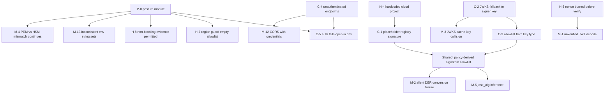

# Security Findings Remediation Plan

**Scope:** 34 findings from the CAGE codebase security analysis
(5 CRITICAL, 8 HIGH, 13 MEDIUM, 8 LOW).
**Status:** Plan only — no fixes implemented by this document.
**Audience:** Human contributors and AI coding agents executing remediation
step-by-step.

> **Reference Architecture Scope.** CAGE is a **reference architecture**. This
> plan remediates *source-level* defects and *architectural* weaknesses in the
> repository. It deliberately prescribes **no deployment procedure, no
> operational runbook, no rollout sequencing, and no environment-specific
> obligations**.
>
> Where a finding touches a Kubernetes manifest, Terraform module, or build
> config, those files are treated as **illustrative artifacts** — reference
> material an adopter reads and adapts. The remediation makes them *exemplary*
> (correct patterns, no embedded credentials), not *operational* (no cluster
> reconcile, no promotion gate, no staging validation is required by this plan).
>
> Adopters own their own deployment and operations. Nothing here creates an
> obligation for this repository's maintainers to run infrastructure.

---

## Table of Contents

1. [Remediation Principles](#1-remediation-principles)
2. [Triage & Prioritization](#2-triage--prioritization)
3. [Phase 1 — Critical Correctness Defects](#3-phase-1--critical-correctness-defects)
4. [Phase 2 — High-Severity Defects](#4-phase-2--high-severity-defects)
5. [Phase 3 — Medium & Low Findings](#5-phase-3--medium--low-findings)
6. [Contribution Standards](#6-contribution-standards)
7. [Verification Requirements](#7-verification-requirements)
8. [Documentation Updates](#8-documentation-updates)
9. [Execution Checklist](#9-execution-checklist)

---

## 1. Remediation Principles

These five principles govern every fix in this plan. Where a finding could be
closed either by a code change or by an operational control, **always choose the
code change** — an operational control is not available to a reference
architecture.

### P1 — Fix the defect in source, never in the environment

A finding is closed when the *code* is correct, not when a cluster is
configured correctly. "Set this env var in production" is not a remediation;
"the code refuses to start without this value, and the failure names the
missing value" is.

### P2 — Fail closed, and make the closed path the default

Every remediation makes the error branch *deny*. Where a fix changes a default,
the new default is the restrictive one. A permissive mode may exist only as an
explicit, greppable, non-default opt-in.

### P3 — Prefer a structural fix over a point fix

If the same defect class appears in three places, introduce the abstraction that
makes the fourth occurrence impossible, then add a CI guard that fails the build
on regression. Several CRITICAL findings in this set are repeat instances of a
class already fixed elsewhere in the codebase — that is the signal to fix the
class.

### P4 — Artifacts are illustrative; keep them exemplary

Manifests, Terraform, and build configs are teaching material. They must
demonstrate the correct pattern (`secretKeyRef`, least privilege, no hardcoded
cloud project) because adopters copy them. They carry **no** deployment
obligation for this repository.

### P5 — Governance boundaries are architecture, not configuration

The kernel/domain/vendor separation, the enforcement pipeline ordering, and the
seal-verification trust boundary are architectural invariants. A fix must not
weaken a boundary to make a test pass or to preserve a convenience path.

---

## 2. Triage & Prioritization

### 2.1 Functional-area grouping

| Area | Findings | Primary files |
|---|---|---|
| **A. Seal / JWS verification core** | C-2, C-3, M-1, M-2, M-3, M-5, L-1 | [`routing_seal.py`](src/gateway/governance/routing_seal.py), [`jwks.py`](src/gateway/governance/jwks.py), [`consequence_token.py`](src/gateway/governance/consequence_token.py) |
| **B. Signing-key provenance** | C-1, H-4, M-4 | [`kms_signer.py`](src/gateway/governance/kms_signer.py), [`registry_verifier.py`](src/gateway/governance/ftra/registry_verifier.py), [`terminal_registry.json.sig`](config/ftra/terminal_registry.json.sig) |
| **C. Service authentication** | C-4, C-5, H-3, M-12 | [`auth.py`](src/compliance_bridge/auth.py), [`main.py`](src/compliance_bridge/main.py), [`nemo_actions.py`](src/governed_financial_advisor/governance/nemo_actions.py) |
| **D. Replay, concurrency, fail-open semantics** | H-5, H-6, H-8, M-7, M-8, L-2 | [`routing_seal.py`](src/gateway/governance/routing_seal.py), [`defer_queue.py`](src/gateway/governance/defer_queue.py), [`evidence_stream.py`](src/compliance_bridge/evidence_stream.py) |
| **E. Illustrative artifact hygiene** | H-1, H-2, M-10, M-11 | [`deployment/k8s/`](deployment/k8s/) — reference manifests only |
| **F. Posture & region gating** | H-7, M-13, L-8 | [`governance_webhook.py`](src/compliance_bridge/governance_webhook.py), env-string helpers across `src/` |
| **G. Runtime hygiene** | M-6, M-9, L-3…L-7 | [`iso_control.py`](src/gateway/governance/iso_control.py), [`daemon.py`](src/gateway/governance/reconciliation/daemon.py) |

### 2.2 Dependency graph



**Reading the graph:** an arrow means *fix the source first* — the target either
consumes the new abstraction or would otherwise need reworking twice.

### 2.3 Two shared abstractions to build first

Both are pure source-level changes with no environmental dependency.

**P-0a — `src/gateway/governance/env_posture.py`.** C-5, H-7, H-8, M-13, M-4 and
L-8 each re-derive "am I in a permissive context?" from a different string set.
Today the codebase contains at least four variants: `("dev", "development")` in
[`auth.py:59`](src/compliance_bridge/auth.py:59), a `_is_production_env()` in
[`routing_seal.py:639`](src/gateway/governance/routing_seal.py:639), a
`("dev","staging","prod")` triple in
[`evidence_stream.py:430`](src/compliance_bridge/evidence_stream.py:430), and a
`development|test|ci` set exercised by
[`test_routing_seal_security.py:105`](tests/test_routing_seal_security.py:105).
One definition removes the class.

**P-0b — a single algorithm-policy constant.** C-1 and C-3 are the same defect:
the permitted signature algorithm is read from attacker-influenceable data (the
`.sig` file's `algorithm` field; the JWK's `kty`) instead of from server policy.
The codebase already contains the correct pattern — the OIDC path at
[`governance_middleware.py:879`](src/gateway/server/governance_middleware.py:879)
comments *"never trust the 'alg' field from the JWT header"* and uses a
hardcoded `_OIDC_ALLOWED_ALGORITHMS`. Extend that same idea to the seal and
registry paths rather than inventing a third mechanism.

### 2.4 Recommended sequencing

| Order | Work | Rationale |
|---|---|---|
| 0 | P-0a posture module, P-0b algorithm policy | Prerequisites; every later fix consumes one definition |
| 1 | C-1 registry signature | Registry verification is currently non-functional; other verification work cannot be validated end-to-end around it |
| 2 | C-2 + C-3 | Both rewrite overlapping lines of `verify_seal()`; splitting guarantees a conflict |
| 3 | C-4 + C-5 | C-4 introduces the dependency; C-5 hardens its fail-open branch |
| 4 | H-5 + H-6 | Both restructure `verify_and_consume_seal()` control flow |
| 5 | H-3, H-4, H-7, H-8 | Independent once P-0a lands |
| 6 | H-1 + H-2 + M-10 + M-11 | Illustrative-artifact hygiene; no code dependency |
| 7 | MEDIUM work units (§5) | |
| 8 | LOW sweep | Deferrable to the next minor release |

### 2.5 Architectural invariants to preserve

- **Kernel purity.** No fix may introduce a domain (`cage_finance`,
  `cage_healthcare`) or vendor (`src/integrations/provider_*`) import into the
  kernel (`src/gateway/`). [`check_import_boundaries.py`](scripts/check_import_boundaries.py)
  enforces this — keep it green.
- **Gateway/GFA verification parity.** [`routing_seal.py`](src/gateway/governance/routing_seal.py)
  and its mirror `src/governed_financial_advisor/utils/routing_seal.py` must
  behave identically; parity is asserted by
  [`test_routing_seal.py`](tests/test_routing_seal.py:279). Every seal fix lands
  in both.
- **Deterministic canonicalization.** Changes touching JCS canonicalization or
  JWS byte layout are wire-format breaks and need a
  [`BREAKING_CHANGES_v3.md`](docs/BREAKING_CHANGES_v3.md) entry.
- **Region gates stay additive.** Regional behaviour changes affect regional
  posture only.

---

## 3. Phase 1 — Critical Correctness Defects

Each finding below states: evidence (with line citations), files and functions,
the fix approach, how the fix is verified, and its compatibility impact.
"Compatibility impact" replaces the usual deployment-impact framing — it
describes what an *adopter* would need to change when consuming the updated
reference architecture, not a rollout procedure for this repository.

### Phase 1 change set

| Change | Branch | Findings |
|---|---|---|
| P0-A | `fix/env-posture-module` | P-0a prerequisite (M-13, L-8 groundwork) |
| P1-A | `fix/ftra-registry-signature` | C-1 (+ P-0b) |
| P1-B | `fix/seal-key-and-alg-policy` | C-2, C-3 |
| P1-C | `fix/bridge-endpoint-authn` | C-4, C-5, M-12 |

---

### P0-A (prerequisite) — Canonical posture module

**Purpose.** Replace four divergent environment-string sets with one definition,
so that "permissive context" is a single testable predicate rather than an
assumption repeated across modules.

**Files** — new `src/gateway/governance/env_posture.py` (Apache 2.0 header
required). Consumers land in later changes.

**Approach**

1. `DeploymentPosture` enum: `LOCAL`, `TEST`, `CI`, `DEV`, `STAGING`,
   `PRODUCTION`.
2. `resolve_posture()` reads `CAGE_ENV`, falls back to `ENVIRONMENT`, defaults
   to `PRODUCTION` — fail-secure, matching the existing intent documented at
   [`auth.py:52`](src/compliance_bridge/auth.py:52).
3. Unrecognised values resolve to `PRODUCTION` with a `WARNING`. This is the
   important behavioural decision: an unknown string must not silently unlock a
   permissive path.
4. `is_restricted()` returns `True` for `PRODUCTION` and `STAGING`.
5. `allow_permissive(feature: str)` is the single sanctioned escape hatch, so
   every relaxation in the codebase is greppable by one symbol.

**Verification** — `tests/test_env_posture.py`, table-driven over the union of
every string currently recognised anywhere in the codebase, plus empty,
whitespace, mixed case, and unset. The fail-secure default is the primary
assertion.

**Compatibility impact** — No API change. Behavioural: a value outside the
recognised set now classifies as restricted. Note in
[`BREAKING_CHANGES_v3.md`](docs/BREAKING_CHANGES_v3.md).

---

### C-1 — Placeholder signature in the FTRA terminal registry

**Evidence.** [`config/ftra/terminal_registry.json.sig`](config/ftra/terminal_registry.json.sig:2)
contains:

```json
"signature": "placeholder-signature-for-v3.0-registry-update",
"algorithm": "RSA-PKCS1-SHA256",
"key_version": "projects/governance-dev/.../cryptoKeyVersions/1"
```

Three defects in one artifact: the signature is a literal placeholder; the
declared algorithm is RSA while
[`registry_verifier.py:152`](src/gateway/governance/ftra/registry_verifier.py:152)
documents ES256-only verification; and the key version pins a specific cloud
project (also H-4). The registry is the input to the FTRA irreversibility
classifier, so its verification state determines whether the pre-pipeline
boundary gate can classify actions at all.

**Files / functions**

- [`registry_verifier.py:verify_registry()`](src/gateway/governance/ftra/registry_verifier.py:144)
- [`config/ftra/terminal_registry.json.sig`](config/ftra/terminal_registry.json.sig)
- [`scripts/sign_terminal_registry.py`](scripts/sign_terminal_registry.py)

**Approach**

1. **Structural rejection.** Add `_SIGNATURE_HEX_RE`: the `signature` field must
   be lowercase hex of the length implied by the algorithm. Anything else →
   `VerificationResult(valid=False, reason="signature_malformed")` at `ERROR`,
   and critically **do not populate** `_last_verified_digest`
   ([`registry_verifier.py:355`](src/gateway/governance/ftra/registry_verifier.py:355))
   — a rejected registry must not seed the verification cache.
2. **Algorithm from policy (P-0b).** Reject any `.sig` whose `algorithm` is
   outside a hardcoded allowlist. Do not derive verification behaviour from the
   file being verified.
3. **Provenance consistency.** Compare `key_version` against the runtime
   signer's `key_id` rather than against a repository literal — this is what
   makes the artifact project-agnostic and closes the H-4 half of the defect.
4. **Regenerate the artifact** with
   [`sign_terminal_registry.py`](scripts/sign_terminal_registry.py), and ensure
   that script stamps `algorithm` from `signer.jose_alg` instead of a literal.
   If the registry payload changes, `serial` must increase — the anti-rollback
   high-water mark at
   [`registry_verifier.py:314`](src/gateway/governance/ftra/registry_verifier.py:314)
   depends on monotonicity.
5. **CI guard** — `scripts/check_registry_signature.py` performs an *offline,
   structural* check (no network, no KMS) and fails the build if a committed
   `.sig` is a placeholder or malformed. This keeps PR CI hermetic.

**Verification**

- [`tests/test_ftra_registry_signing.py`](tests/test_ftra_registry_signing.py) —
  placeholder rejected; non-hex rejected; wrong length rejected; disallowed
  algorithm rejected; mismatched key provenance rejected; and the failure path
  leaves the verification cache untouched.
- Rollback case: a forged high `serial` with an invalid signature is rejected
  **and** the high-water mark does not advance.
- [`tests/test_ftra_boundary_check.py`](tests/test_ftra_boundary_check.py) —
  registry verification failure results in fail-closed classification to
  `IRREVERSIBLE_TERMINAL`, which is the architecturally required behaviour
  documented at [`models.py:374`](src/gateway/governance/ftra/models.py:374).

**Compatibility impact** — An adopter carrying the placeholder artifact will see
the FTRA gate fail closed. That is the correct behaviour; the artifact must be
signed with the adopter's own key. Document the signing step as an adopter
prerequisite in the FTRA architecture documentation, not as a deployment
runbook step.

---

### C-2 — `verify_seal()` falls back to the signer's own key on JWKS failure

**Evidence.** [`routing_seal.py:560-567`](src/gateway/governance/routing_seal.py:560):

```python
if pem is None:
    # Fallback to direct signer key (backward compatibility)
    signer = get_governance_signer()
    pem = signer.get_public_key_pem()
```

When the `kid` cannot be resolved in the JWKS, verification silently proceeds
against whatever key the local process holds. This collapses multi-key
verification into "trust the local signer" — the exact property the JWKS
indirection exists to provide. A seal whose `kid` is rotated-out, forged, or
foreign takes this path.

**Files / functions**

- [`routing_seal.py:verify_seal()`](src/gateway/governance/routing_seal.py:537)
- Mirror: `src/governed_financial_advisor/utils/routing_seal.py`
- [`jwks.py:get_verification_key_for_jwt()`](src/gateway/governance/jwks.py:443)

**Approach**

1. Delete the fallback. `pem is None` → `SymbolicGovernorViolation("unknown key
   id (kid) — no JWKS entry", action)`.
2. Distinguish `KID_ABSENT` (header carries no `kid`) from `KID_UNKNOWN` (not in
   the set) in [`jwks.py`](src/gateway/governance/jwks.py) so logs are precise.
   Both deny — only the reason string differs.
3. An empty JWKS at verification time denies with its own distinct reason,
   rather than being indistinguishable from an unknown `kid`.
4. **Recommended:** no compatibility escape hatch. If reviewers want one for
   local development, gate it on `env_posture.allow_permissive()` *and* an
   explicit flag, default off, warning on every use — and record the decision
   in the PR description. My recommendation is deletion: a fallback that
   silently weakens a trust boundary is the defect, and preserving it under a
   flag preserves the failure mode for anyone who sets the flag.

**Verification**

- [`tests/test_routing_seal_security.py`](tests/test_routing_seal_security.py) —
  new `TestJwksKeyResolution`: unknown `kid` denies; absent `kid` denies; empty
  JWKS denies; valid `kid` verifies.
- Adversarial: a seal signed with an attacker-held key carrying a `kid` absent
  from the JWKS must deny.
- Parity: gateway and GFA mirrors produce identical outcomes.
- Regression: existing round-trip tests in
  [`tests/test_routing_seal.py`](tests/test_routing_seal.py) continue to pass.

**Compatibility impact** — Seals whose public key was never published to the
JWKS stop verifying. Architecturally this is the point: key publication becomes
a precondition of key use. Document the invariant ("a key must be present in the
JWKS before seals signed by it can verify") in the seal architecture
documentation.

---

### C-3 — Algorithm allowlist derived from the supplied key type, not policy

**Evidence.** [`routing_seal.py:571-578`](src/gateway/governance/routing_seal.py:571):

```python
kty = jwk.get("kty", "EC")
if kty == "EC":
    algs = ["ES256", "ES384", "ES512", "EdDSA"]
elif kty == "OKP":
    algs = ["EdDSA"]
else:
    algs = ["RS256", "PS256"]
```

The permitted algorithm set is computed from the key material rather than from
policy, and an unrecognised `kty` silently falls through to RSA. The codebase
already contains the correct pattern for this exact defect class — see the OIDC
path at
[`governance_middleware.py:879`](src/gateway/server/governance_middleware.py:879),
which hardcodes `_OIDC_ALLOWED_ALGORITHMS` and comments *"never trust the 'alg'
field from the JWT header."* The seal path was simply not updated when that fix
landed.

**Files / functions**

- [`routing_seal.py:verify_seal()`](src/gateway/governance/routing_seal.py:571)
- GFA mirror `verify_seal()`
- [`consequence_token.py:verify()`](src/gateway/governance/consequence_token.py:266)
  — compares against `signer.jose_alg`, inheriting M-5's inference weakness;
  align it to the same policy constant.

**Approach**

1. Module-level policy constant `_SEAL_ALLOWED_ALGORITHMS: tuple[str, ...]`.
   Never derived from `kty`, never from the JWT header.
2. Pass it to `pyjwt.decode(algorithms=...)`, and additionally assert the header
   `alg` is a policy member *before* decode so the denial reason is precise.
3. Key/algorithm consistency check: if the resolved JWK's `kty` cannot satisfy
   the header `alg`, deny with `key/algorithm mismatch`. This is a consistency
   check, **not** the source of the allowlist.
4. Explicitly reject `none`, all `HS*` (symmetric confusion against a public
   key), and `RS*`/`PS*` unless deliberately enabled in the policy constant.
5. Apply the same constant to C-1's registry verification so one policy governs
   both surfaces (P-0b).

**Verification**

- Parametrised denial matrix: `alg: none`, `HS256`, `RS256`, and an ES variant
  outside the policy; allow-case per policy member.
- Adversarial: sign an `HS256` JWT using the public PEM bytes as the HMAC key —
  the classic algorithm-confusion attack — and assert denial.
- Mirror the matrix in the consequence-token tests.

**Compatibility impact** — Adopters minting seals with an algorithm outside the
default policy must extend the constant deliberately. Because C-2 and C-3
rewrite overlapping lines of the same function, they ship as one change:
`fix/seal-key-and-alg-policy`.

---

### C-4 — Compliance-bridge governance endpoints unauthenticated

**Evidence.** In [`main.py`](src/compliance_bridge/main.py) only
`/v1/audit/ingest` declares `Depends(require_internal_token)`
([line 890](src/compliance_bridge/main.py:890)). These routes carry no auth
dependency:

| Route | Line | Exposure |
|---|---|---|
| `POST /v1/defer/{defer_id}/inject` | [1205](src/compliance_bridge/main.py:1205) | **Mutating** — injects into a parked HITL decision |
| `POST /v1/defer/{defer_id}/escalate` | [1362](src/compliance_bridge/main.py:1362) | **Mutating** — escalates a deferred request |
| `GET /v1/defer/pending` | [1097](src/compliance_bridge/main.py:1097) | Pending HITL queue |
| `GET /v1/oscal/assessment-results` | [647](src/compliance_bridge/main.py:647) | Compliance posture |
| `GET /v1/aarm/conformance-report` | [995](src/compliance_bridge/main.py:995) | Control coverage |
| `GET /v1/audit/status/{audit_id}` | [748](src/compliance_bridge/main.py:748) | Audit state |
| `GET /v1/telemetry/history` | [1627](src/compliance_bridge/main.py:1627) | Trace history |
| `GET /v1/events/stream` | [332](src/compliance_bridge/main.py:332) | Live governance event feed |
| `GET /v1/prompts/{name}` | [1523](src/compliance_bridge/main.py:1523) | Prompt content |
| `GET /v1/controls`, `/v1/metrics/*` | [436](src/compliance_bridge/main.py:436), [552](src/compliance_bridge/main.py:552), [783](src/compliance_bridge/main.py:783) | Control/metric disclosure |

The two mutating `/v1/defer/*` routes are the significant ones: they alter
human-in-the-loop decisions, which is a governance control surface.

Note the lineage — [`auth.py:18`](src/compliance_bridge/auth.py:18) documents
this module as the fix for a prior finding ("C-07") that added authentication to
`/v1/audit/ingest`. That remediation was applied to one route rather than to the
route *class*, which is precisely why the defect recurred. This is a P3 case.

**Approach**

1. **Default-deny at application scope.** Attach the dependency to the app
   (`FastAPI(dependencies=[Depends(require_internal_token)])`) rather than
   annotating routes individually. Per-route annotation reintroduces the bug on
   the next route added — the structural fix is what closes the class.
2. Maintain `_PUBLIC_PATHS: frozenset[str]` as an explicit, greppable, testable
   constant. Keep it minimal: health and schema endpoints.
3. Confirm by test (not by assumption) that the dependency is evaluated before
   the SSE stream at [line 332](src/compliance_bridge/main.py:332) is
   established.
4. CI guard `scripts/check_endpoint_auth.py` walks the route table and fails if
   any route outside `_PUBLIC_PATHS` lacks the dependency.

**Verification** — `tests/test_compliance_bridge_authn.py` iterates
`app.routes` and asserts every non-public route returns 401 without a token.
Iterating the route table (rather than listing routes) is what makes the test
cover routes added later. Assert health endpoints remain public, since the
reference manifests use them as probe targets.

**Compatibility impact** — **API-affecting.** Adopters and in-repo callers must
send `Authorization: Bearer …`. In-repo consumers to update: the
[`agentsight-ui`](src/agentsight-ui/) client and any `scripts/` utility that
calls these routes. Record in
[`BREAKING_CHANGES_v3.md`](docs/BREAKING_CHANGES_v3.md).

---

### C-5 — `require_internal_token` fails open in dev

**Evidence.** [`auth.py:59-63`](src/compliance_bridge/auth.py:59):

```python
if cage_env in ("dev", "development") and not token:
    logger.warning("COMPLIANCE_BRIDGE_INTERNAL_TOKEN not set — auth disabled in dev")
    return "dev-unauthenticated"
```

Authentication is disabled entirely when the token is unset in a dev-labelled
environment. After C-4 makes this function the single control point for the
whole API surface, the blast radius of this branch grows accordingly. The
`cage_env` string set here is one of the four variants P-0a consolidates.

**Files / functions** —
[`auth.py:require_internal_token()`](src/compliance_bridge/auth.py:40)

**Approach**

1. Replace the ad-hoc string test with `env_posture` (P-0a).
2. Narrow the escape hatch to a conjunction: non-restricted posture **and**
   token unset **and** `CAGE_ALLOW_UNAUTHENTICATED_BRIDGE=true` explicitly set.
   Without the explicit flag, a missing token is a 401 even locally.
3. Emit the warning once per process rather than per request, so it is not lost
   in log volume.
4. Retain `hmac.compare_digest` (already correct at
   [line 73](src/compliance_bridge/auth.py:73)).
5. **Startup assertion:** in restricted posture with no token configured, refuse
   to construct the app. A process that fails fast with a named cause is a
   better architecture than one that 401s every request for an unexplained
   reason — the failure should point at the missing configuration.

**Verification** — in `tests/test_compliance_bridge_authn.py`: dev + no token +
no flag → 401; dev + no token + flag → allowed with a single warning; restricted
+ no token → construction fails with a message naming the variable; restricted +
wrong bearer → 401; restricted + correct bearer → 200.

**Compatibility impact** — Configuration-affecting for local use: set the token,
or set the explicit flag. Update
[`.env.example`](.env.example) and the test fixtures so the default developer
experience remains frictionless without relying on an implicit bypass.

---

## 4. Phase 2 — High-Severity Defects

### Phase 2 change set

| Change | Branch | Findings | Grouping rationale |
|---|---|---|---|
| P2-A | `fix/seal-verify-before-burn` | H-5, H-6, M-1 | All restructure `verify_and_consume_seal()` control flow |
| P2-B | `fix/approval-token-secret` | H-3 | Isolated to the advisor governance module |
| P2-C | `fix/signer-provenance` | H-4, M-4 | Both concern signing-key provenance |
| P2-D | `fix/posture-and-evidence-gates` | H-7, H-8 | Both consume the P-0a posture module |
| P2-E | `fix/reference-manifest-hygiene` | H-1, H-2, M-10, M-11 | Illustrative artifacts; no source dependency |

---

### H-5 — Nonce burned before signature verification

**Evidence.** [`verify_and_consume_seal()`](src/gateway/governance/routing_seal.py:862)
executes in this order:

1. Extract the nonce from an **unverified** JWT
   ([line 871](src/gateway/governance/routing_seal.py:871),
   `options={"verify_signature": False}` — also M-1).
2. Burn the nonce atomically
   ([line 930](src/gateway/governance/routing_seal.py:930)).
3. Verify the signature **afterwards**
   ([line 966](src/gateway/governance/routing_seal.py:966)).

The comment at line 968 states the intent: "If verification fails, the nonce
stays burned (safe: invalid seals rejected)." That reasoning holds for the
*replay* threat but creates a *denial* threat — an attacker who learns or
predicts a nonce burns it with a garbage seal, and the legitimate seal is then
rejected as a replay.

**The architectural argument for reordering.** The original ordering was chosen
to close a TOCTOU race (see
[`HITL_TOCTOU_REMEDIATION.md`](docs/security/HITL_TOCTOU_REMEDIATION.md)). But
what closes that race is the **atomicity** of the burn, not its **position** in
the sequence. The Lua script at
[`_atomic_burn_nonce()`](src/gateway/governance/routing_seal.py:741) guarantees
exactly one winner regardless of how many callers reach it simultaneously.
Verifying first therefore preserves single-consumption while removing the
pre-burn denial vector. Burn-first was over-conservative.

**Approach**

1. Verify the signature (CPU-only, no state mutation) **before** touching Redis.
2. Keep the burn exactly as-is — the atomic Lua script is correct and stays the
   sole consumption mechanism.
3. Take the nonce from the **verified** claims object rather than a second
   unverified decode. This closes M-1 on this path.
4. Address the cost-amplification concern that motivates burn-first with a
   pre-crypto token bucket per caller, reusing the pattern already present at
   [`mcp_tool_server.py:91`](src/gateway/server/mcp_tool_server.py:91).
5. Mirror into `src/governed_financial_advisor/utils/routing_seal.py` for parity.

**Verification**

- Denial-vector test: submit a forged seal carrying a legitimate seal's nonce;
  assert the forgery is rejected **and** the legitimate seal still consumes
  successfully afterwards.
- Assert no nonce key is created when verification fails.
- Concurrency: two coroutines consuming the same valid seal against
  `fakeredis` — exactly one succeeds. Extends the existing replay test at
  [`test_routing_seal_security.py:306`](tests/test_routing_seal_security.py:306).
- Adversarial: high-volume invalid seals leave the Redis key count flat.

**Compatibility impact** — No API change. The latency profile shifts (crypto
before Redis); if the repository tracks a performance baseline, refresh it.

---

### H-6 — `SymbolicGovernorViolation` swallowed at call sites

**Evidence.** The handler at
[`routing_seal.py:715-720`](src/gateway/governance/routing_seal.py:715) is
correct — it re-raises violations and converts unexpected exceptions into
violations. The defect is at call sites, where a violation may be caught without
producing a deny. Sites to audit:

- [`api.py:219`](src/governed_financial_advisor/tools/api.py:219)
- [`tool_provider.py:156`](src/cage_finance/tools/tool_provider.py:156)

A seal violation that does not reach the caller as a refusal means the
verification result has no effect on behaviour — the control is decorative.

**Approach**

1. Audit every `except SymbolicGovernorViolation` handler; each must re-raise or
   return an explicit deny. Never `pass`, never log-and-continue.
2. Where a handler exists only to record telemetry (e.g.
   `root_span.set_attribute("cage.seal_valid", False)`), ensure the `raise`
   follows the attribute write.
3. Add `scripts/check_exception_swallowing.py` — an AST check flagging governance
   exception handlers with no `raise` and no deny return — and wire it into CI.
   This is the P3 structural component: it prevents the next occurrence.
4. Generalise the check to `ConsequenceTokenError` and `ConfigurationError`
   while the tool is being written.

**Verification** — for each audited site, inject a verification failure and
assert the caller-visible outcome is a refusal, not a success with a warning.
Add an adversarial case asserting a swallowed violation cannot result in
actuation.

**Compatibility impact** — None expected; paths that were incorrectly permissive
become strict.

---

### H-3 — Weak default HMAC secret in approval-token validation

**Evidence.** [`nemo_actions.py:184`](src/governed_financial_advisor/governance/nemo_actions.py:184)
and [`:208`](src/governed_financial_advisor/governance/nemo_actions.py:208):

```python
secret = os.environ.get("CAGE_ROUTING_SEAL_SECRET", "dev-secret")
```

This is the exact prohibited pattern from AGENTS.md. Anyone who reads the
repository can mint approval tokens that satisfy the SC-1 constraint declared at
[`ontology.py:163`](src/gateway/governance/ontology.py:163) — "never execute a
write operation without a signed approval token."

A second defect sits in the same module:
[`check_approval_token()`](src/governed_financial_advisor/governance/nemo_actions.py:238)
contains `if token_str == "bad_sig": return False` — a test fixture embedded in
production control logic. Remove it and fix the fixture.

**Approach**

1. `_require_seal_secret()` reads `CAGE_ROUTING_SEAL_SECRET` and raises when
   unset or when the value matches a known-weak placeholder. In non-restricted
   posture (P-0a), log once and derive an **ephemeral per-process random
   secret** — local development keeps working, but tokens are never predictable
   and never portable between processes.
2. Never log the secret or any prefix of it.
3. Reuse the existing `assert_custom_salt_in_production` pattern from
   [`routing_seal.py`](src/gateway/governance/routing_seal.py) rather than
   inventing a parallel guard.
4. Delete the `"bad_sig"` branch.

**Verification** — unset secret in restricted posture raises; weak literal
raises; valid secret round-trips; tampered and expired tokens deny; a token
minted under process A's ephemeral secret is rejected by process B. Remove any
test depending on the `"bad_sig"` literal.

**Compatibility impact** — `CAGE_ROUTING_SEAL_SECRET` becomes required in
restricted posture. Already listed in
[`.env.example`](.env.example)-style configuration, so the change mainly
converts a silent weak default into an explicit requirement.

---

### H-4 — Hardcoded cloud project in signing references

**Evidence.** Two artifacts pin a specific cloud project:

- [`terminal_registry.json.sig:4`](config/ftra/terminal_registry.json.sig:4) —
  `projects/governance-dev/...`
- Reference job manifests embedding a full `KMS_GOVERNANCE_KEY` resource path.

For a reference architecture this is a correctness issue in its own right: an
adopter copying these artifacts inherits a project reference that cannot
possibly be theirs, and the failure mode is confusing rather than explicit.

**Approach**

1. Replace literals with template variables (`${KMS_GOVERNANCE_KEY}`) resolved
   through the existing `.tpl` mechanism, so the reference artifacts are
   project-agnostic by construction.
2. For the `.sig` envelope, `key_version` is legitimately signed data — the fix
   is that verification compares it to the *runtime* signer identity (C-1
   step 3), not that the repository pins a value.
3. Extend [`check_domain_literals.py`](scripts/check_domain_literals.py) with a
   cloud-project-literal rule so new occurrences fail CI.

**Verification** — a scan test asserting no `projects/<literal>/locations`
appears outside clearly-marked documentation examples; a rendering test
confirming template expansion produces a well-formed resource name.

**Compatibility impact** — None for source consumers; the artifacts become
adopter-neutral, which is the intent.

---

### M-4 (bundled) — Local PEM/HSM mismatch logs CRITICAL but continues

**Evidence.** [`kms_signer.py:759-771`](src/gateway/governance/kms_signer.py:759)
logs `CRITICAL: Local PEM validation failed. Does not match Remote HSM Key!` and
then proceeds; the surrounding handler downgrades an inability to validate to a
`WARNING`.

A signer whose local public key disagrees with the remote key cannot produce
verifiable signatures. Continuing does not preserve availability — it defers the
failure to verification time, where the cause is much harder to diagnose.

**Approach** — mismatch raises at construction in restricted posture; inability
to reach the HSM raises in restricted posture and warns otherwise. Bundle with
H-4 as `fix/signer-provenance`.

**Verification** — mismatched PEM in restricted posture raises; matching PEM
succeeds; unreachable HSM warns in permissive posture and raises in restricted.

---

### H-7 — Region-guard allowlist empty for US_FED

**Evidence.** [`governance_webhook.py:110-111`](src/compliance_bridge/governance_webhook.py:110)
declares `"US_FED": []` with the comment "no geographic restriction on endpoint
URLs", and [`_check_region_guard()`](src/compliance_bridge/governance_webhook.py:199)
returns early for anything other than `EU_ECB`/`APAC_MAS`
([line 210](src/compliance_bridge/governance_webhook.py:210)). The default
region is `US_FED` ([line 192](src/compliance_bridge/governance_webhook.py:192)).

The defect is representational: an empty list reads as "allow nothing" but
behaves as "allow everything", and the unset-region default lands on it. A
reader auditing this code would reasonably reach the wrong conclusion about
what it enforces — which for a reference architecture is itself a serious
problem.

**Approach**

1. Make intent explicit in the type. Replace the bare `list[str]` with a
   `RegionEgressPolicy` dataclass carrying `unrestricted: bool`, so `[]`
   unambiguously means deny-all and "no restriction" is a deliberate,
   visible declaration.
2. Populate a genuine US_FED allowlist derived from the FQDNs already expressed
   in [`cilium-egress-lockdown.yaml`](deployment/k8s/cilium-egress-lockdown.yaml),
   so the two representations of the same intent cannot silently diverge.
3. Unknown or unset region denies in restricted posture rather than defaulting
   to the permissive branch.
4. Document the distinction between *citation-selection* defaults (where the
   `US_FED` fallback is harmless — e.g.
   [`iso_control.py:61`](src/gateway/governance/iso_control.py:61)) and
   *authorisation* defaults (where it is not).

**Verification** — per-region table test: allowed endpoint passes, disallowed
endpoint raises, for US_FED / EU_ECB / APAC_MAS / unset. Plus a drift test
asserting the US_FED allowlist is a subset of the Cilium-expressed FQDNs.

**Compatibility impact** — Behavioural for US_FED consumers calling endpoints
outside the allowlist. Provide `CAGE_REGION_GUARD_ENFORCE` so adopters can
observe before enforcing; the repository default is enforce. Regional gates
remain additive.

---

### H-8 — Non-blocking evidence path permitted in production posture

**Evidence.** [`evidence_stream.py:370`](src/compliance_bridge/evidence_stream.py:370)
and the precondition check at
[`:448-469`](src/compliance_bridge/evidence_stream.py:448): production with
`EVIDENCE_CHAIN_BLOCKING=false` is permitted whenever
`CAGE_ALLOW_NONBLOCKING_PROD=true`. Seals are then issued without evidence
durability — which breaks the evidence-binding invariant that
[`verify_seal()`](src/gateway/governance/routing_seal.py:608) enforces at the
other end of the pipeline. The two halves of the system disagree about whether
evidence binding is guaranteed.

**Approach**

1. **Recommended: remove `CAGE_ALLOW_NONBLOCKING_PROD` entirely.** A reference
   architecture demonstrating evidence-bound governance should not also ship a
   documented switch for disabling the evidence guarantee. The switch teaches
   the wrong pattern, and the code that consumes the guarantee assumes it holds.
2. If reviewers retain it for adopter flexibility: require an acknowledgement
   value that names the accepted risk, record a `CRITICAL` entry in the evidence
   stream itself, and expose the degraded state on the health endpoint so it is
   observable rather than silent.
3. Consume P-0a so `STAGING` is treated as restricted.
4. Evaluate at construction and fail there, not at first write.

**Verification** — restricted + non-blocking + override → `ConfigurationError`
at construction (or a degraded-state assertion if retained); restricted +
blocking → constructs; staging behaves as restricted; permissive posture +
non-blocking → constructs with a warning.

**Compatibility impact** — Configuration-affecting for adopters relying on the
override. Record in [`BREAKING_CHANGES_v3.md`](docs/BREAKING_CHANGES_v3.md).

---

### P2-E — Reference manifest hygiene (H-1, H-2, M-10, M-11)

> **Framing.** The files in [`deployment/`](deployment/) are **illustrative
> artifacts**. This change makes them exemplary — correct patterns that an
> adopter can safely learn from and adapt. It prescribes **no deployment, no
> cluster reconcile, and no rollout**. Verification is entirely static
> (manifest parsing in unit tests); nothing here requires a cluster.

**H-1 — Secrets as plaintext env values.** Enumerate with
`grep -rn "value:" deployment/ | grep -Ei "(secret|password|token|key|credential|dsn)"`
and triage each hit into *secret* / *non-secret config* / *false positive*
(the `OTEL_...SANITIZE_FIELDS` entries are false positives — they are lists of
header names to redact, not credentials). Convert real secrets to
`valueFrom.secretKeyRef` / `envFrom.secretRef`, which is the pattern the
manifests should be teaching.

**H-2 — Hardcoded MinIO root credentials.**
[`minio.yaml:41-44`](deployment/k8s/minio.yaml:41) sets
`MINIO_ROOT_USER: "minioadmin"` / `MINIO_ROOT_PASSWORD: "minioadmin"`. The same
pair appears as a copy-pasteable `kubectl create secret` example in
[`reconciliation-worker.yaml:222`](deployment/k8s/reconciliation-worker.yaml:222)
comments — arguably worse, since example commands get copied verbatim. Replace
both with `secretKeyRef`, and change the commented example to an obvious
placeholder so it cannot be pasted into anything real.

**M-10 — Missing `securityContext`.** Most manifests already carry pod- and
container-level contexts; [`security-context-patch.yaml`](deployment/k8s/security-context-patch.yaml)
documents the canonical shape. Close the gaps (including
[`minio.yaml`](deployment/k8s/minio.yaml)) so every reference manifest
demonstrates `runAsNonRoot`, `allowPrivilegeEscalation: false`,
`readOnlyRootFilesystem`, `capabilities.drop: [ALL]`, and
`seccompProfile: RuntimeDefault`.

**M-11 — `agentsight-daemon` fully privileged.**
[`agentsight-daemon.yaml:104-106`](deployment/k8s/agentsight-daemon.yaml:104)
sets `privileged: true` with
`pod-security.kubernetes.io/enforce: privileged`
([line 82](deployment/k8s/agentsight-daemon.yaml:82)). eBPF genuinely requires
elevation, but rarely blanket privilege: drop `ALL`, then add back the minimum
(`CAP_BPF`, `CAP_PERFMON`, `CAP_SYS_RESOURCE` on kernel ≥ 5.8), falling back to
`CAP_SYS_ADMIN` only where demonstrably required. Where full privilege cannot be
avoided, the manifest should say so in a comment naming the reason — a reference
artifact that silently over-privileges teaches the wrong lesson; one that
explains a necessary exception teaches the right one.

**Verification** — `tests/test_reference_manifest_hygiene.py`: parse every YAML
under [`deployment/`](deployment/) with `yaml.safe_load_all` and assert
(a) no env entry with a sensitive-looking name carries a literal `value`;
(b) the string `minioadmin` appears nowhere, including comments;
(c) every container declares the required `securityContext` fields;
(d) `privileged: true` appears only in an explicit, documented allowlist.
All four checks are static and hermetic — no cluster, no credentials, no
network.

**Compatibility impact** — None for source consumers. Adopters copying the
manifests must supply their own Secrets, which is the correct pattern and should
be stated in the manifest comments themselves.

---

## 5. Phase 3 — Medium & Low Findings

Findings are grouped into work units sharing a file, a concept, or a review
context. Complexity is relative (S / M / L); no time estimates.

| Unit | Branch | Findings | Complexity | Cycle |
|---|---|---|---|---|
| WU-1 Crypto correctness | `fix/jws-crypto-correctness` | M-1, M-2, M-5 | M | Current |
| WU-2 JWKS cache integrity | `fix/jwks-cache-integrity` | M-3, L-1 | S | Current |
| WU-3 Resource lifecycle | `fix/resource-lifecycle` | M-6, M-7 | M | Current |
| WU-4 Concurrency correctness | `fix/defer-queue-atomicity` | M-8 | M | Current |
| WU-5 CORS posture | `fix/bridge-cors-policy` | M-12 | S | Current (with P1-C) |
| WU-6 Posture adoption | `refactor/env-posture-adoption` | M-13, L-8 | M | Current |
| WU-7 Async hygiene | `refactor/async-http-clients` | M-9 | S | Next |
| WU-8 Low-severity sweep | `fix/low-severity-sweep` | L-2…L-7 | S | Next |

M-4, M-10 and M-11 are bundled into Phase 2 (see P2-C and P2-E) because they
share a review context with the HIGH findings there.

---

### WU-1 — Crypto correctness (M-1, M-2, M-5)

**M-1 — Unverified JWT decode.**
[`extract_record_hash()`](src/gateway/governance/routing_seal.py:723) decodes
with `verify_signature: False` at
[line 728](src/gateway/governance/routing_seal.py:728). The H-5 call path is
fixed in P2-A; this unit handles the standalone function.

*Fix:* rename to `extract_record_hash_unverified()` so every call site must
acknowledge the trust level, and add a verified counterpart. Audit call sites:
anything feeding an authorization decision uses the verified variant; telemetry
and logging may keep the unverified one. Add a CI guard that
`verify_signature: False` appears only at sanctioned call sites.

*Verification:* update `TestRecordHashBinding` in
[`test_routing_seal.py`](tests/test_routing_seal.py:200) to the new names; add a
case proving the verified variant rejects a tampered seal the unverified variant
still parses.

**M-2 — Silent ECDSA DER→raw conversion failure.**
[`routing_seal.py:323-325`](src/gateway/governance/routing_seal.py:323) converts
KMS DER signatures to the raw R‖S form JWT requires, keyed on
`alg.startswith("ES")`. A silent failure here emits a signature that will not
verify downstream, and the resulting error surfaces far from its cause.

*Fix:* make the conversion total — raise on parse failure, unexpected integer
sizes, and curve/length mismatch (`ES256`→64 bytes, `ES384`→96, `ES512`→132),
with a post-condition assertion on output length.

*Verification:* new `tests/test_ecdsa_der_conversion.py` — round-trip per curve;
malformed and truncated DER raise; signatures with leading-zero R or S encode to
the correct fixed width (the classic off-by-one that only appears in roughly one
signature in 256).

**M-5 — `jose_alg` inference guesses curve/padding.**
[`kms_signer.py:554-581`](src/gateway/governance/kms_signer.py:554) derives the
JOSE algorithm string heuristically. A wrong guess produces headers that cannot
verify, and it interacts badly with C-3's policy check.

*Fix:* exhaustive explicit mapping from each provider's algorithm enum (GCP
`CryptoKeyVersionAlgorithm`, AWS `SigningAlgorithmSpec`, Azure
`SignatureAlgorithm`) to a JOSE string. Unmapped input raises at signer
construction, not at first sign. No heuristics on key size or curve name.

*Verification:* parametrised over every enum value the three providers can
report; assert either a correct mapping or an explicit raise. Preserve the
existing clear error when KMS is inactive
([`kms_signer.py:579`](src/gateway/governance/kms_signer.py:579)).

---

### WU-2 — JWKS cache integrity (M-3, L-1)

**M-3 — Cache poisoning via `_fetched_at` collision.**
[`governance_middleware.py:905-931`](src/gateway/server/governance_middleware.py:905)
stores the fetch timestamp inside the same dict as the keys
(`keys["_fetched_at"] = now`). A JWKS document containing a key whose `kid` is
literally `_fetched_at` collides with the metadata slot, and the metadata entry
can conversely be mistaken for key material. Mixing metadata and data in one
namespace is the underlying design flaw.

*Fix:* separate them — `_jwks_keys: dict[str, dict]` and
`_jwks_fetched_at: float` behind a lock, or a small dataclass. Additionally
reject any JWKS entry whose `kid` begins with `_`.

**L-1 — Caching behaviour.** Fold in: an explicit maximum age, a short-TTL
negative cache so an unknown `kid` cannot trigger a fetch storm, and jittered
refresh so replicas do not synchronise their refetches.

*Verification:* `tests/test_jwks_cache.py` — a payload containing a
`_fetched_at` "key" neither corrupts state nor is treated as a key; TTL expiry
triggers exactly one refetch under concurrent access; the negative cache
suppresses repeat fetches; underscore-prefixed kids are rejected.

---

### WU-3 — Resource lifecycle (M-6, M-7)

**M-6 — Unbounded in-memory buffer.** Note the cited location is already
bounded: [`iso_control.py:48`](src/gateway/governance/iso_control.py:48) uses
`collections.deque(maxlen=1000)`. The finding therefore points elsewhere, so the
first task is to locate the real accumulator. Sweep with
`grep -rn "deque()\|= \[\]\|defaultdict(list)" src/ --include='*.py'` and inspect
anything appended to on a request path. Two candidates found while reading:

- [`mcp_tool_server.py:92`](src/gateway/server/mcp_tool_server.py:92) —
  per-client-IP rate-limit buckets. Each deque is evicted, but the *dict keyed
  by client IP* has no bound, so distinct source addresses grow it without
  limit.
- [`kms_batch_signer.py:139`](src/compliance_bridge/kms_batch_signer.py:139) —
  a `collections.deque()` with no `maxlen`.

*Fix:* bound every accumulator — `maxlen` on deques, TTL eviction plus a hard
key cap on per-client dicts, and a queue-depth limit with an explicit
shed-or-block policy on the batch signer. Emit a metric when a bound is reached
so the condition is observable rather than silent.

*Verification:* drive each structure past its bound; assert length stays capped,
the oldest entry is evicted, and the metric fires.

**M-7 — Redis client leaked on non-HTTPException failures.** Locate the handler
releasing the client only on the `HTTPException` path.

*Fix:* `try/finally` or an async context manager so the client is released on
every exit path including `CancelledError`. Prefer a shared long-lived client —
the pattern already adopted for HTTP at
[`governance_webhook.py:121`](src/compliance_bridge/governance_webhook.py:121) —
over per-request construction.

*Verification:* inject a non-HTTP exception mid-handler and assert release;
assert connection count is stable across N failing requests using `fakeredis`.

---

### WU-4 — `DeferQueue.approve()` WATCH ineffective (M-8)

**Evidence.** [`approve()`](src/gateway/governance/defer_queue.py:436) issues
`WATCH` at [line 467](src/gateway/governance/defer_queue.py:467) and reads with
`hget`, but does not complete a `MULTI/EXEC` bound to the watched key, so
concurrent approvals can lose updates. The docstring at
[line 449](src/gateway/governance/defer_queue.py:449) promises exactly the
property that is missing: "Uses Redis WATCH/MULTI/EXEC to prevent lost updates
when two operators approve simultaneously."

This matters architecturally: the quorum check at
[line 514](src/gateway/governance/defer_queue.py:514) is the multi-approver HITL
control. A lost update can under-count approvals (a legitimate quorum never
resolves) or, depending on interleaving, allow a resolution that does not
reflect the distinct-approver invariant.

**Fix options — choose one and record the decision in the PR:**

1. **Correct the optimistic-locking pattern.** Use `redis.pipeline()` as an
   async context manager: `watch(key)`, read inside the watch, `multi()`, queue
   the writes, `execute()`, retry with bounded backoff on `WatchError`, and
   surface `TransactionAbortedError` as the docstring already documents.
2. **Move the mutation into a Lua script**, mirroring
   [`_atomic_burn_nonce()`](src/gateway/governance/routing_seal.py:741).
   Preferred if the logic can be expressed without Python-side model
   validation — it eliminates the retry loop and matches a pattern already
   proven in this codebase.

**Verification** — `tests/test_defer_queue_concurrency.py`: N concurrent
distinct approvers against quorum K; assert exactly K distinct approvals are
recorded, the status transitions PARKED → PARTIALLY_APPROVED → RESOLVED exactly
once, and duplicate approvers are still rejected
([line 500](src/gateway/governance/defer_queue.py:500)). Include a
`WatchError`-injection test for the retry path.

Also reconcile with the synchronous sibling at
[`pipeline/defer_queue.py:149`](src/gateway/governance/pipeline/defer_queue.py:149)
— determine whether it is live or dead code. If live it needs the same
treatment; if dead, deleting it removes a divergent second implementation of a
governance control, which is worth doing on its own merits.

---

### WU-5 — CORS posture (M-12)

**Evidence.** [`main.py:307-311`](src/compliance_bridge/main.py:307) sets
`allow_credentials=True` with `allow_headers=["*"]`. With credentials enabled, a
wildcard header policy widens CSRF exposure — and after C-4 the bridge exposes
mutating governance routes.

*Fix:* enumerate the headers actually required (`Authorization`,
`Content-Type`, `Accept`, plus trace-propagation headers) and list them
explicitly. Assert at construction that `_cors_origins` never resolves to `*`
while `allow_credentials=True`, refusing to construct otherwise. Methods are
already restricted to `GET`/`POST`/`OPTIONS`.

*Verification:* wildcard origin with credentials fails construction; a
disallowed header fails preflight; an allowed header passes. Bundle with P1-C
since both touch bridge app construction.

---

### WU-6 — Posture adoption (M-13, L-8)

Adopt P-0a everywhere and delete the local variants — this is the payoff for
building the module first. Known sites:
[`auth.py:51`](src/compliance_bridge/auth.py:51),
[`routing_seal.py:639`](src/gateway/governance/routing_seal.py:639),
[`evidence_stream.py:430`](src/compliance_bridge/evidence_stream.py:430),
`assert_custom_salt_in_production`, and the `_DebugEndpointGuard` at
[`hybrid_server.py:320`](src/gateway/server/hybrid_server.py:320).

*Fix:* mechanical replacement plus a CI guard forbidding new raw `CAGE_ENV`
reads outside `env_posture.py`. L-8 folds in here.

*Verification:* the existing posture tests must pass unchanged — that is the
acceptance criterion, since this is a refactor with no intended behaviour
change beyond unrecognised-value handling. Add a test asserting only
`env_posture.py` reads the raw variable.

---

### WU-7 — Async hygiene (M-9)

Blocking `urllib.request.urlopen` remains at
[`green_stack_pipeline.py:64`](src/governed_financial_advisor/pipelines/green_stack_pipeline.py:64)
and [`:135`](src/governed_financial_advisor/pipelines/green_stack_pipeline.py:135),
and [`reconciliation/daemon.py:624`](src/gateway/governance/reconciliation/daemon.py:624),
each carrying a `# nosec B310` suppression. The webhook module already migrated
to a shared `httpx.AsyncClient`
([`governance_webhook.py:121`](src/compliance_bridge/governance_webhook.py:121))
and its comment explains why — apply the same treatment.

*Fix:* shared module-level `httpx.AsyncClient` with explicit `verify=True` and
timeouts. Where the caller is genuinely synchronous use `httpx.Client`, so TLS
configuration is explicit and the suppressions can be deleted.

*Verification:* hermetic `respx` mocks; assert timeout and TLS settings; assert
no `nosec B310` remains in the touched files. Deferrable — no trust boundary is
crossed, but event-loop stalls degrade the governance latency characteristics
the architecture is meant to demonstrate.

---

### WU-8 — Low-severity sweep (L-2…L-7)

One PR, three uniform rules:

1. **Sentinel consolidation.** `_NO_EVIDENCE_SENTINELS = ("no-evidence-binding",
   "", "none")` is duplicated at
   [`routing_seal.py:607`](src/gateway/governance/routing_seal.py:607) and
   [`:691`](src/gateway/governance/routing_seal.py:691), and again in the GFA
   mirror — three copies of one security-relevant predicate. Hoist to a single
   constant, compare case-insensitively after `strip()`, and add
   `"null"`/`"undefined"`.
2. **Silent failures.** Every `except Exception: return None` / `: pass` on a
   governance path gets a log line with a stable event code and returns an
   explicit failure value the caller must handle. Examples:
   [`extract_record_hash`](src/gateway/governance/routing_seal.py:730),
   [`_is_jwt_seal`](src/gateway/governance/routing_seal.py:533).
3. **Caching.** Every cache gets an explicit TTL, a size bound, and a documented
   invalidation trigger.

*Verification:* one focused test per finding in the nearest existing test
module. Deferrable — but note that these are the conditions that produced the
CRITICAL findings, so deferring indefinitely reproduces them.

---

## 6. Contribution Standards

Repository-level standards only. Nothing here requires a cluster, a cloud
account, or an operational process.

### 6.1 Branch naming

Lowercase kebab-case, ≤ 30 characters after the prefix, deleted after merge.
Never work directly on `main` or `rc-v*`.

| Work | Branch |
|---|---|
| P-0a posture module | `fix/env-posture-module` |
| C-1 | `fix/ftra-registry-signature` |
| C-2 + C-3 | `fix/seal-key-and-alg-policy` |
| C-4 + C-5 + M-12 | `fix/bridge-endpoint-authn` |
| H-5 + H-6 + M-1 | `fix/seal-verify-before-burn` |
| H-3 | `fix/approval-token-secret` |
| H-4 + M-4 | `fix/signer-provenance` |
| H-7 + H-8 | `fix/posture-and-evidence-gates` |
| H-1 + H-2 + M-10 + M-11 | `fix/reference-manifest-hygiene` |
| WU-1 | `fix/jws-crypto-correctness` |
| WU-2 | `fix/jwks-cache-integrity` |
| WU-3 | `fix/resource-lifecycle` |
| WU-4 | `fix/defer-queue-atomicity` |
| WU-6 | `refactor/env-posture-adoption` |
| WU-7 | `refactor/async-http-clients` |
| WU-8 | `fix/low-severity-sweep` |

### 6.2 Commit messages

[Conventional Commits v1.0.0](https://www.conventionalcommits.org/): subject
≤ 72 characters, imperative mood, no trailing period, at most one scope from
`gateway | compliance | infra | governance | tests | docs | ci | agentsight |
advisor | nemo | opa`.

```text
fix(governance): reject seals with unknown kid instead of signer fallback
fix(governance): derive seal algorithm allowlist from policy not key type
fix(compliance): require internal token on all bridge governance routes
fix(governance): verify seal signature before burning replay nonce
fix(infra): replace plaintext minio credentials with secretKeyRef
test(tests): add jwks cache poisoning regression coverage
docs(docs): record seal verification breaking changes for v3
```

Breaking changes carry **both** the `!` marker and the footer:

```text
fix(compliance)!: enforce authentication on all bridge endpoints

BREAKING CHANGE: every /v1/* route except health and schema endpoints now
requires Authorization: Bearer $COMPLIANCE_BRIDGE_INTERNAL_TOKEN.
```

Self-check before finalising: valid type, valid scope, ≤ 72 chars, imperative,
no trailing period, breaking marker and footer coupled.

### 6.3 Merge strategy

**Squash merge only** for every PR into `main`. The `squash-merge-guard` job in
[`ci.yml`](.github/workflows/ci.yml) fails the build on any two-parent merge
commit reaching `main`. Use *Squash and merge* and confirm the pre-filled
message matches the PR title. Never `git merge` into `main`, never `--no-ff`,
never *Rebase and merge*.

### 6.4 PR checklist for security fixes

```markdown
## Security fix checklist
- [ ] Finding ID(s) in the PR title/body (e.g. C-2, C-3)
- [ ] Fix is in source, not in environment configuration (Principle P1)
- [ ] Error branch denies; any permissive mode is explicit and non-default (P2)
- [ ] Structural fix + CI guard where the defect is a repeating class (P3)
- [ ] Architectural boundaries intact — no domain/vendor import into src/gateway/
      (uv run python scripts/check_import_boundaries.py)
- [ ] Gateway/GFA routing_seal parity preserved where applicable
- [ ] Apache 2.0 header on every new .py/.ts/.tsx/.js file in src/
- [ ] No secrets or credential-shaped values added (pk-lf-*, sk-lf-*, hf_*,
      GOOG*, redis://*:*@*)
- [ ] No os.environ.get("<sensitive>", "<fallback>") introduced
- [ ] Reference manifests use secretKeyRef — no literal secret `value:`
- [ ] Diagnostic logging masks credential-shaped values (value[:4] + "****")
- [ ] New tests fail before the fix and pass after (state how this was verified)
- [ ] Adversarial case added where the finding describes an attacker
- [ ] Breaking change: `!` marker + BREAKING CHANGE footer + entry in
      docs/BREAKING_CHANGES_v3.md
- [ ] make test-fast green; CI green (license-check, stpa-freshness-check,
      security-scan)
```

### 6.5 Compliance artifacts

CAGE ships OSCAL components and Lula validations as **reference compliance
artifacts** — they demonstrate how governance controls map to frameworks. Keep
them consistent with the code so the mapping stays truthful. This is a
documentation-accuracy obligation, not an audit obligation.

| Change | Keep consistent |
|---|---|
| Control implementation semantics change | OSCAL component in [`compliance/oscal/`](compliance/oscal/) |
| Reference manifest resources referenced by an assertion change | Lula validation in [`compliance/lula/`](compliance/lula/) |
| STPA source changes | Regenerate: `uv run python scripts/check_stpa_freshness.py --verbose` |

Control mapping for this set (for artifact consistency, not attestation):

| Finding | Control(s) |
|---|---|
| C-1 | SA-11, CM-6 |
| C-2, C-3 | IA-5, SC-8 |
| C-4, C-5 | AC-3, IA-3 |
| H-1, H-2 | IA-5, SC-28 |
| H-3 | SC-1, AC-3 |
| H-5, H-6 | SI-2, AU-12 |
| H-7 | SC-7 |
| H-8 | AU-12, ISO 42001 A.5.3 |
| M-8 | AC-3, ISO 42001 A.9.2 |
| M-10, M-11 | CM-6, ISO 42001 A.6.1 |

---

## 7. Verification Requirements

All verification is **offline and hermetic** — no live cluster, no cloud
credentials, no network. Every check runs from a clean checkout with `uv run`.

### 7.1 New test modules

| File | Covers |
|---|---|
| `tests/test_env_posture.py` | P-0a, M-13, L-8 |
| `tests/test_compliance_bridge_authn.py` | C-4, C-5 |
| `tests/test_compliance_bridge_cors.py` | M-12 |
| `tests/test_jwks_cache.py` | M-3, L-1 |
| `tests/test_ecdsa_der_conversion.py` | M-2 |
| `tests/test_defer_queue_concurrency.py` | M-8 (fakeredis) |
| `tests/test_reference_manifest_hygiene.py` | H-1, H-2, M-10, M-11 (static YAML parsing) |
| `tests/test_no_hardcoded_project_refs.py` | H-4 |
| `tests/test_governance_webhook_region_guard.py` | H-7 |
| `tests/test_nemo_actions.py` (if absent) | H-3 |

All carry `pytest.mark.unit` and `pytest.mark.local`.

### 7.2 Extensions to existing modules

| File | Additions |
|---|---|
| [`test_routing_seal_security.py`](tests/test_routing_seal_security.py) | `TestJwksKeyResolution` (C-2); algorithm-policy matrix (C-3); verify-before-burn ordering and denial-vector case (H-5) |
| [`test_routing_seal.py`](tests/test_routing_seal.py) | Renamed unverified extractor plus verified counterpart (M-1); gateway/GFA parity preserved |
| [`test_ftra_registry_signing.py`](tests/test_ftra_registry_signing.py) | Placeholder / non-hex / wrong-length / disallowed-algorithm / provenance-mismatch rejection; cache not poisoned on failure (C-1) |
| [`test_ftra_boundary_check.py`](tests/test_ftra_boundary_check.py) | Registry failure ⇒ fail-closed `IRREVERSIBLE_TERMINAL` |
| `tests/test_kms_signer.py` | Exhaustive `jose_alg` mapping (M-5); PEM/HSM mismatch raises (M-4) |
| `tests/test_consequence_token.py` | Algorithm-policy alignment (C-3) |
| Evidence-stream tests | Construction-failure matrix (H-8) |

### 7.3 Adversarial cases

Under [`tests/red_team/`](tests/red_team/), marker `red_team`. These are
hermetic unit tests that *simulate* an attacker; they do not attack anything.

| ID | Attack | Expected |
|---|---|---|
| RT-C1 | Registry with forged high `serial` and invalid signature | Deny; high-water mark unchanged |
| RT-C2 | Seal signed by attacker key, `kid` absent from JWKS | Deny — unknown key id |
| RT-C3a | `alg: none` | Deny |
| RT-C3b | `HS256` signed with the public PEM as the HMAC key | Deny — algorithm confusion |
| RT-C3c | `kty`-manipulated JWK to widen the allowlist | Deny — allowlist is policy-derived |
| RT-C4 | Unauthenticated `POST /v1/defer/{id}/inject` | 401, no state mutation |
| RT-C5 | Unrecognised `CAGE_ENV` to reach the dev bypass | Treated as restricted, 401 |
| RT-H3 | Approval token minted with the `dev-secret` default | Deny |
| RT-H5 | Pre-burn a victim's nonce with a forged seal | Forgery denied; victim seal still consumable |
| RT-M8 | Concurrent approvals racing the quorum threshold | Exactly K distinct approvals; one RESOLVED transition |

### 7.4 CI guards (regression prevention)

Each converts a one-off fix into a permanent invariant — the P3 component of the
remediation. All are static and hermetic.

| Guard | Prevents recurrence of |
|---|---|
| `scripts/check_endpoint_auth.py` | C-4 — a new route without the auth dependency |
| `scripts/check_registry_signature.py` | C-1 — a placeholder `.sig` reaching `main` |
| `scripts/check_exception_swallowing.py` | H-6 — governance exceptions caught without a deny |
| Manifest secret patterns in `security-scan` | H-1, H-2 |
| Cloud-project rule in [`check_domain_literals.py`](scripts/check_domain_literals.py) | H-4 |
| Grep guard: raw `CAGE_ENV` outside `env_posture.py` | M-13, C-5 |
| Grep guard: `verify_signature: False` outside sanctioned sites | M-1 |
| [`check_import_boundaries.py`](scripts/check_import_boundaries.py) (existing) | Kernel purity |

### 7.5 Verification commands

```bash
# fast iteration
make test-fast

# equivalently
uv run pytest tests/ -m "local or unit" -n auto --dist loadscope --no-cov \
  -p no:langsmith --tb=short

# targeted
uv run pytest tests/test_routing_seal_security.py -v

# pre-merge (mirrors CI)
make test-coverage

# static analysis, typing, SAST
uv run ruff check . && uv run ruff format --check .
uv run mypy src/
uv run bandit -r src/ -c pyproject.toml -ll

# architectural boundaries
uv run python scripts/check_import_boundaries.py

# formal models — confirm no regression
uv run python proof/model.py && uv run pytest tests/test_no_direct_bind_proof.py -v
```

Always prefix with `uv run`; never bare `pytest` or `python`. Always pass
`--dist loadscope` with `-n auto`.

**Acceptance criterion for every fix:** the new test fails on pre-fix code and
passes on post-fix code. State in the PR how this was demonstrated.

---

## 8. Documentation Updates

Documentation changes describe **architecture and invariants**, not operations.
Per the repository's documentation standards: no internal operational tracking,
no environment-specific detail, no maintainer-specific identifiers.

### 8.1 Security posture description

[`docs/security/SECURITY_STATUS.md`](docs/security/SECURITY_STATUS.md) — update
to describe the corrected design:

- Seal verification: multi-key JWKS resolution is strict; there is no fallback
  to the local signer; the algorithm allowlist is policy-derived.
- Compliance bridge: default-deny authentication with an explicit public-path
  allowlist.
- Replay protection: verify-then-consume ordering, with the reasoning that
  atomicity — not ordering — provides single-consumption.
- Correct any statement asserting a control this analysis found unenforced. For
  a reference architecture the accuracy of the posture description *is itself*
  one of the artifacts under review.

### 8.2 Architectural invariants worth recording

These emerged from the analysis and are properties of the design, so they belong
in architecture documentation rather than in any runbook:

| Invariant | Home |
|---|---|
| A signing key must be present in the JWKS before seals signed by it verify | Seal architecture |
| Permitted algorithms come from policy, never from key material or token headers | Seal + registry architecture |
| Evidence binding is guaranteed end-to-end; the issuing side cannot opt out | Evidence-stream architecture |
| Registry verification failure fails closed to `IRREVERSIBLE_TERMINAL` | FTRA architecture |
| Unrecognised posture values resolve to the restrictive interpretation | Configuration model |
| Authentication is applied at application scope, not per route | Bridge architecture |

### 8.3 [`docs/BREAKING_CHANGES_v3.md`](docs/BREAKING_CHANGES_v3.md)

One entry per change: what changed, who is affected, the failure symptom, and
the adaptation required.

| Change | Adaptation for adopters |
|---|---|
| Bridge routes require a bearer token (C-4) | Supply `COMPLIANCE_BRIDGE_INTERNAL_TOKEN` |
| Dev auth bypass requires explicit opt-in (C-5) | Set the token, or the explicit flag |
| Unknown `kid` no longer falls back to the signer key (C-2) | Publish public keys to the JWKS |
| Seal algorithms restricted to the policy set (C-3) | Extend the policy constant for another curve |
| Registry requires a real signature (C-1) | Sign with your own key |
| `CAGE_ROUTING_SEAL_SECRET` required in restricted posture (H-3) | Provide the value |
| MinIO reference credentials come from a Secret (H-2) | Supply your own Secret |
| Unrecognised `CAGE_ENV` classifies as restricted (P-0a) | Use a documented value |
| `CAGE_ALLOW_NONBLOCKING_PROD` removed (H-8) | Keep evidence writes blocking |
| Region egress allowlist enforced (H-7) | Declare permitted endpoints |

### 8.4 Documentation this plan deliberately does not create

Consistent with the reference-architecture scope, this plan does **not** create
or extend deployment runbooks, rollout procedures, promotion gates, environment
inventories, or operational tracking documents. Where an existing operational
document must be touched for factual accuracy, keep the edit minimal and ensure
it carries a Reference Architecture Note marking it as an illustrative template.

The artifacts in [`compliance/`](compliance/) and
[`docs/POAM.md`](docs/POAM.md) are reference material demonstrating a governance
posture. Keep them factually consistent with the remediated code — if a document
claims a control is enforced, the code must enforce it. Record the MEDIUM/LOW
findings collectively as one hardening entry referencing this plan rather than
tracking them individually.

---

## 9. Execution Checklist

```markdown
### Prerequisites
- [ ] P0-A  fix/env-posture-module              (posture module + tests)
- [ ] P0-B  algorithm policy constant            (folded into P1-A / P1-B)

### Phase 1 — CRITICAL
- [ ] P1-A  fix/ftra-registry-signature          (C-1)
- [ ] P1-B  fix/seal-key-and-alg-policy          (C-2, C-3)
- [ ] P1-C  fix/bridge-endpoint-authn            (C-4, C-5, M-12)

### Phase 2 — HIGH
- [ ] P2-A  fix/seal-verify-before-burn          (H-5, H-6, M-1)
- [ ] P2-B  fix/approval-token-secret            (H-3)
- [ ] P2-C  fix/signer-provenance                (H-4, M-4)
- [ ] P2-D  fix/posture-and-evidence-gates       (H-7, H-8)
- [ ] P2-E  fix/reference-manifest-hygiene       (H-1, H-2, M-10, M-11)

### Phase 3 — MEDIUM (current cycle)
- [ ] WU-1  fix/jws-crypto-correctness           (M-2, M-5)
- [ ] WU-2  fix/jwks-cache-integrity             (M-3, L-1)
- [ ] WU-3  fix/resource-lifecycle               (M-6, M-7)
- [ ] WU-4  fix/defer-queue-atomicity            (M-8)
- [ ] WU-6  refactor/env-posture-adoption        (M-13, L-8)

### Phase 3 — next cycle
- [ ] WU-7  refactor/async-http-clients          (M-9)
- [ ] WU-8  fix/low-severity-sweep               (L-2…L-7)

### Closeout
- [ ] All CI guards from §7.4 merged and enforcing
- [ ] Compliance artifacts consistent with remediated code
- [ ] SECURITY_STATUS.md describes the corrected design
- [ ] Architectural invariants (§8.2) recorded
- [ ] BREAKING_CHANGES_v3.md complete
- [ ] check_import_boundaries.py green — no domain/vendor leakage into the kernel
```

### Definition of done

A finding is closed when **all** of the following hold:

1. The defect is corrected in source — not mitigated by configuration.
2. A test fails on the pre-fix code and passes on the post-fix code.
3. Where the finding represents a class, a CI guard prevents the next instance.
4. Architectural boundaries are intact and the gateway/GFA mirrors agree.
5. Any behavioural change an adopter would notice is recorded in
   [`BREAKING_CHANGES_v3.md`](docs/BREAKING_CHANGES_v3.md).

No deployment, cluster validation, or operational sign-off forms part of this
definition.
