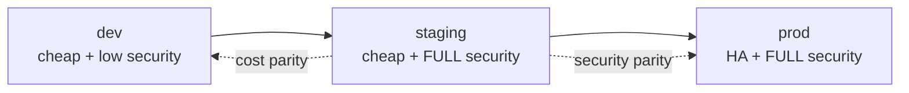

# Cost-Optimised Full-Security Testing: The `staging` Posture

## Problem Statement

Testing full security posture currently requires production-grade spend, because
the security and redundancy dimensions are conflated behind a single Terraform
flag. This plan decouples them and introduces an ephemeral, dev-scale,
fully-hardened `staging` tier.

## Options Evaluated

| Option | Verdict | Rationale |
|---|---|---|
| **A — Downsize prod to remove redundancy** | Rejected | Prod is not deployed (`project_id = "your-production-project"`). Saves nothing while degrading the HA reference exemplar that adopters copy. |
| **B — Upgrade dev to full security** | Rejected | *Increases* cost. Setting `enable_nist_compliance = true` fires seven redundancy ternaries, blocks `terraform destroy`, and PDBs defeat GPU scale-to-zero. |
| **C — Third posture (dev scale + full security)** | **Adopted** | Schema already accepts `staging`. Closes POAM-024. Full security is provable at single-replica scale. |

## Key Findings

### Finding 1 — `enable_nist_compliance` is an overloaded flag

It drives two orthogonal concerns simultaneously:

| Concern | Resources affected |
|---|---|
| **Security / compliance** | `deletion_protection`, master authorized networks, security context, POAM-019 dual-Langfuse precondition |
| **Redundancy / cost** | gateway ×2, advisor ×2, OPA ×2, NeMo ×2, Langfuse web ×2, Langfuse worker ×2, compliance bridge ×2, Redis `replication` + 3 replicas, PDBs, CPU/memory limits |

This coupling is the root cause. All three options required fixing it first.

### Finding 2 — no compliance gate depends on redundancy

Searching [`compliance/lula/`](../compliance/lula/) for
`replicas|PodDisruptionBudget|replication|minAvailable` returns **zero results**
across all 31 validation files.

**Full security posture is provable at 1 replica.** Redundancy buys availability,
not evidence. This finding is what makes cheap-but-secure viable, and step 16
re-validates it empirically rather than trusting it on faith.

### Finding 3 — prod is a template, not a running cluster

[`prod.tfvars`](../infra/targets/gcp-gke/prod.tfvars) targets `cage-prod` in a
placeholder project. The live cluster is `governance-cluster-2` in
`us-central1-a`. All current spend is dev-side.

## Design Constraints

**Staging requires its own cluster, not a namespace.** Binary Authorization,
CMEK, private master endpoint, Pod Security Standards, and audit logging are all
cluster-scoped. A namespace on the dev cluster would be cheaper but could not
validate the controls the tier exists to test.

**Staging must be ephemeral** — provision, validate, destroy. This makes
detaching `deletion_protection` from `enable_nist_compliance` load-bearing: without
it, teardown is blocked and the "ephemeral" cluster becomes permanent spend.

## Cost Profile

| Control | Incremental cost |
|---|---|
| Binary Authorization | Free — Cloud Build already mandated |
| Pod Security Standards | Free |
| Dual Langfuse project (POAM-019) | Free |
| `authorized_networks` restriction | Free |
| Audit logging | Low — GCS storage + log volume |
| CMEK | Low — per-key/month |
| Private master endpoint | **High** — requires VPN; keep `false`, matching prod |

Dominant avoided line item: the always-on `gpu_node_pool_min_count = 2` L4 GPUs
from prod. Staging retains `min_count = 0`.

## Target Promotion Path

## Implementation Phases

### Phase 1 — Decouple security from redundancy (steps 1–8)

A pure refactor. Introduces `enable_high_availability` (default `false`) and
repoints every redundancy ternary to it, leaving `enable_nist_compliance`
responsible for security only. Existing tfvars are updated so behaviour is
unchanged: HA `true` in all three prod files, explicit `false` in all dev files.

**Gate: `terraform plan` against dev must report a zero diff.** No new
infrastructure is created until this passes. This is the blast-radius control for
the whole plan — if the plan is not a no-op, a redundancy ternary was missed or
mis-mapped.

`deletion_protection` is separately detached into its own
`enable_deletion_protection` variable so staging can be torn down.

### Phase 2 — Add the staging tier (steps 9–15)

New `staging.tfvars` combining dev-scale hardware with full security flags, a
distinct `cluster_name`, and non-overlapping pod/service/master CIDRs so it can
never collide with live dev state. A second Langfuse project satisfies the
POAM-019 dual-project precondition. The `staging` rejection block in
`deploy_all.sh` is replaced with proper var-file resolution and region-aware
compliance-flag injection, plus a teardown path to cap spend.

### Phase 3 — Validate (steps 16–18)

Run the full Lula set and all three region posture suites against staging, then
confirm the cluster-scoped controls genuinely took effect — Binary Authorization
enforcement, PSS `restricted` admission, CMEK on etcd, and audit log delivery.
Step 16 is the empirical proof of Finding 2.

### Phase 4 — Discharge compliance obligations (steps 19–23)

Documentation, POAM-024 closure with commit SHA and Lula result, and the OSCAL
component update for CA-2, per the obligations in
[`AGENTS.md`](../AGENTS.md).

## Risks and Mitigations

| Risk | Mitigation |
|---|---|
| Refactor silently changes prod behaviour | Zero-diff `terraform plan` gate at step 8 before any new resources |
| Staging CIDRs collide with live dev cluster | Distinct `cluster_name` + explicitly non-overlapping CIDR ranges (step 11) |
| Ephemeral cluster becomes permanent spend | `deletion_protection` detached (step 4) + teardown wrapper (step 15) |
| Finding 2 proves wrong; a gate needs HA | Surfaces at step 16 before docs/POAM closure; HA flag can be selectively enabled for the affected component |
| Compliance drift between tfvars files | Region posture suites run against staging (step 17) |

## Constraints Carried From AGENTS.md

- GKE images via **Cloud Build only** — never local `docker build`.
- `terraform plan` must always precede `terraform apply`; never edit state directly.
- Secrets belong in `terraform.auto.tfvars` (gitignored); K8s manifests use
  `secretKeyRef` / `secretRef`.
- Region gates (US_FED / EU_ECB / APAC_MAS) are additive and never block the
  global stable tag.
- All test invocations use the `uv run` prefix.
