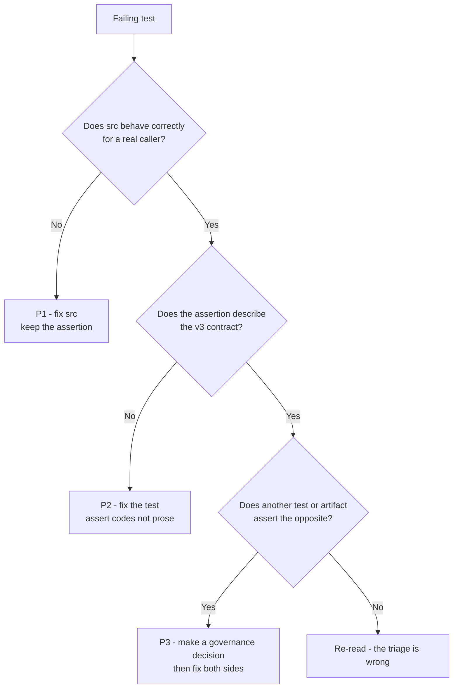
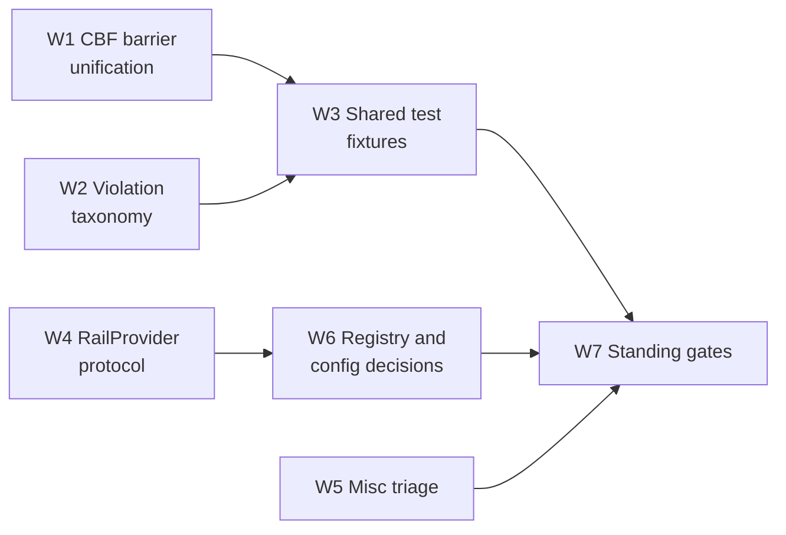

# Post-v3 Test Remediation Plan — Residual 51 Failures

> **Status:** Proposed · **Scope:** `tests/`, `src/gateway/governance/`, `src/cage_finance/`, `config/`
> **Baseline:** 98.5% pass rate (~51 failures remaining of an original 152)
> **Governing standards:** [`AGENTS.md`](../AGENTS.md) — Three-Layer Architecture, Canonical
> Module Namespaces, Clean Architecture Over Operational Continuity, Hermetic Testing.

---

## 1. Executive Summary

The 51 residual failures are **not** a homogeneous "stale test" backlog. Investigation of the
source tree shows they split into three qualitatively different populations, and conflating
them is the reason the previous 101 fixes did not converge:

| Population | Count (approx.) | Nature | Correct response |
|---|---|---|---|
| **P1 — Genuine production defects** exposed by the v3 refactor | ~26 | Kernel code has two competing representations of the same concept; the hot path dereferences the one that can be `None`, or string-matches prose that no longer exists | **Fix `src/`**, not the test |
| **P2 — Contract drift** (tests assert a superseded interface) | ~17 | Test asserts pre-v3 prose, pre-v3 import path, or a fake plugin that implements the wrong half of the protocol | **Fix `tests/`** against the canonical v3 contract |
| **P3 — Contradictory / unbacked specifications** | ~8 | Two tests assert mutually exclusive facts about the same artifact, or assert against a file that does not exist | **Make a governance decision**, then fix both sides |

The single most important finding is that **Category A is a production bug, not a mocking
problem.** [`ControlBarrierFunction.__init__()`](../src/gateway/governance/safety/cbf_engine.py:299)
accepts `invariant=None` and populates a parallel set of scalar attributes
(`threshold_key`, `gamma`, `redis_key`), while the atomic commit hot path at
[`cbf_engine.py:1648`](../src/gateway/governance/safety/cbf_engine.py:1648) dereferences
`self._invariant.state_key`. Every `ControlBarrierFunction()` constructed without an explicit
barrier is a **latent `AttributeError` on the safety-critical commit path**. The tests are
correct; the kernel is wrong.

The second most important finding is that **the kernel still classifies violations by
string-matching domain prose.** [`symbolic_governor.py:341-345`](../src/gateway/governance/symbolic_governor.py:341)
tests for `"Fiscal Limit Pre-Reservation REJECTED"`, but the v3 tier plugins now emit
`[fiscal] FISCAL_LIMIT_EXCEEDED: …`. That predicate can never fire again, so fiscal rejections
are silently mis-classified in the DEFER/DENY/NARROW decision tree. This is a **live
governance-correctness defect**, and 13 of the Category B/C failures are its symptom.

Both findings are Layer-1 kernel issues. Fixing them removes ~30 of the 51 failures and, more
importantly, closes two real safety gaps. The remaining failures are mechanical.

### Target end-state

- 100% of `-m "local or unit"` passing, offline, with no live Redis/OPA/Langfuse.
- Zero `Optional` invariants on the CBF commit path — one barrier, one source of truth.
- Zero prose-based violation classification in Layer 1 — codes only.
- One canonical CBF test factory replacing ~62 ad-hoc `ControlBarrierFunction(...)` call sites.

---

## 2. Failure Taxonomy Map

```mermaid
graph TD
    subgraph P1[P1 - Production defects in src]
        A1[CBF dual barrier representation<br/>_invariant None on commit path]
        B1[Kernel classifies violations<br/>by domain prose not codes]
        D1[FinancialRailsProvider implements<br/>get_actions not provide_rail_actions]
    end
    subgraph P2[P2 - Test contract drift]
        B2[Tests assert pre-v3<br/>violation prose]
        B3[Fake tier logs in commit<br/>but phase 1 calls evaluate]
        C1[Patch targets point at<br/>pre-v3 module paths]
        F1[Telemetry test asserts<br/>removed domain literal]
    end
    subgraph P3[P3 - Contradictory specs]
        D2[Registry asserted as v1.0<br/>AND as v3.0 by two tests]
        D3[terminal_registry_schema.json<br/>does not exist]
        D4[STPA split files vs<br/>monolithic yaml divergence]
    end
    A1 --> W1[W1 Barrier unification]
    B1 --> W2[W2 Structured violation taxonomy]
    B2 --> W2
    B3 --> W2
    D1 --> W4[W4 Rail provider conformance]
    C1 --> W3[W3 Canonical import hygiene]
    F1 --> W5[W5 Misc contract updates]
    D2 --> W6[W6 Registry governance decision]
    D3 --> W6
    D4 --> W6
```



---

## 3. Category A — CBF Barrier Representation (20 failures)

**Symptom:** `'NoneType' object has no attribute 'state_key'`
**Population:** P1 — production defect
**Affected:** `tests/cage_finance/test_cbf_reconciliation.py` (3), `tests/test_cbf_chaos.py` (3),
`tests/test_cbf_negative_paths.py` (5), `tests/test_fence_epoch.py` (8),
`tests/test_symbolic_governor_cbf_atomicity.py` (4), `tests/test_causal_gatekeeper.py` (1),
`tests/cage_finance/test_cbf_amount_validation.py` (1)

### 3.1 Root Cause Analysis

PR C (Stage 2) introduced the declarative [`InvariantModel`](../src/gateway/governance/contracts.py:342)
protocol so the kernel could compile `(state_key, threshold_key, gamma)` into the atomic Lua
hop. The migration was **half-completed**: the constructor kept a backward-compatible branch
that leaves `self._invariant = None` and instead sets three loose scalars.

```python
# cbf_engine.py:332-353  (current — two sources of truth)
self._invariant = invariant                    # may be None
if invariant is not None:
    self.threshold_key = invariant.threshold_key
    self.gamma        = invariant.gamma
    self.redis_key    = invariant.state_key
else:
    self.threshold_key = "cbf.min_cash_balance"   # finance literal in the kernel
    self.gamma         = 0.5
    self.redis_key     = "safety:current_cash"    # finance literal in the kernel
self.min_cash_balance: float = THRESHOLDS.cbf.min_cash_balance   # finance literal
```

Three distinct defects compound here:

1. **Dual source of truth.** Read paths (`setup()`, `_get_current_cash()`, `_read_cbf_state_atomic()`)
   use `self.redis_key`; the *commit* path uses `self._invariant.state_key`. They can diverge,
   and in the `None` case the commit path raises.
2. **Fail-open-shaped fail-crash.** The failure surfaces as an `AttributeError` inside
   `atomic_verify_and_commit()`, which the tier wraps into a generic `TIER_EXCEPTION`. The
   barrier never evaluates. Per the Three-Layer Split Rule ("code that can fail closed
   unsafely lives in the kernel"), this is exactly the class of bug the kernel must not have.
3. **Domain literals in Layer 1.** `"safety:current_cash"`, `"cbf.min_cash_balance"`, and the
   attribute name `min_cash_balance` are finance vocabulary hardcoded in the domain-agnostic
   kernel — the same violation class that Category E just removed from `ontology.py`.

### 3.2 Design Pattern — *Mandatory Value Object + Derived Properties*

Replace the optional-collaborator anti-pattern with a **required, immutable value object** and
make every barrier attribute a **derived read-only property**. There is then exactly one place
the barrier can be described, and it can never be `None`.

```python
# src/gateway/governance/contracts.py  (new concrete implementation of InvariantModel)
@dataclass(frozen=True, slots=True)
class AffineBarrier:
    """Concrete, immutable InvariantModel. h(x) = state[state_key] - THRESHOLDS[threshold_key]."""
    invariant_id: str
    state_key: str
    threshold_key: str
    gamma: float

    def __post_init__(self) -> None:
        if ":" not in self.state_key:
            raise ValueError(f"{self.invariant_id}: state_key must be namespaced")
        if not 0.0 < self.gamma <= 1.0:
            raise ValueError(f"{self.invariant_id}: gamma must be in (0, 1]")
```

```python
# src/gateway/governance/safety/cbf_engine.py  (target)
def __init__(
    self,
    invariant: InvariantModel,               # REQUIRED — no default, no None branch
    cost_resolver: CostResolver | None = None,
    skip_epoch_seed: bool = False,
) -> None:
    self._invariant = invariant
    self._cost_resolver = cost_resolver or self._default_cost_resolver   # zero-cost, domain-agnostic
    ...

@property
def redis_key(self) -> str:      return self._invariant.state_key
@property
def threshold_key(self) -> str:  return self._invariant.threshold_key
@property
def gamma(self) -> float:        return self._invariant.gamma
@property
def threshold(self) -> float:    return resolve_threshold(self._invariant.threshold_key)

def get_h(self, state_value: float) -> float:
    """Barrier function h(x). Safe when h(x) >= 0."""
    return state_value - self.threshold
```

**Breaking changes (explicitly desirable per [`AGENTS.md`](../AGENTS.md) §Architecture):**

- `ControlBarrierFunction()` with no arguments no longer constructs. Callers must supply a barrier.
- `self.min_cash_balance` is **deleted**. Its finance semantics move to
  [`CashBarrier`](../src/cage_finance/invariants.py:28) + `THRESHOLDS.cbf.min_cash_balance`.
- `_legacy_finance_cost_resolver` is **deleted** from the kernel. It reads `amount` /
  `amount_minor` — finance vocabulary. The finance plugin already injects
  `finance_cost_resolver`; move the implementation there and make the kernel default
  `_default_cost_resolver` (returns `0.0`).
- Threshold resolution moves from three duplicated `.split(".")` walks
  ([`cbf_engine.py:1651`](../src/gateway/governance/safety/cbf_engine.py:1651),
  [`symbolic_governor.py:879`](../src/gateway/governance/symbolic_governor.py:879)) into one
  shared `resolve_threshold(path: str) -> float` helper in
  `src/gateway/governance/schemas/thresholds.py`.

### 3.3 Implementation Strategy

1. Add `AffineBarrier` + `resolve_threshold()` to the kernel (contracts + thresholds module).
2. Make `invariant` a required positional parameter of `ControlBarrierFunction.__init__`.
3. Convert `redis_key` / `threshold_key` / `gamma` to properties; delete the `else:` branch,
   `min_cash_balance`, and `_legacy_finance_cost_resolver`.
4. Rewrite `get_h()` in terms of `self.threshold`; audit all `min_cash_balance` references
   (`cbf_engine.py:1106`, `:1258` comment) and re-word the domain-flavoured log/comment text.
5. Move `_legacy_finance_cost_resolver` body into
   [`src/cage_finance/invariants.py`](../src/cage_finance/invariants.py) as the canonical
   `finance_cost_resolver` (it likely already exists there — de-duplicate, do not fork).
6. Update the single production construction site
   ([`plugin.py:66`](../src/cage_finance/plugin.py:66)) — already passes `CashBarrier()`, so no change expected.
7. Re-run `uv run python scripts/check_domain_literals.py` — the kernel must now be clean of
   `current_cash` / `min_cash_balance`.

### 3.4 Test Fixture Design

Replace ~62 ad-hoc constructions with **one factory fixture**. Hermetic, offline, no live Redis.

```python
# tests/fixtures/cbf.py  (new module, imported by tests/conftest.py)
TEST_BARRIER = AffineBarrier(
    invariant_id="test.scalar_barrier",
    state_key="safety:test_state",
    threshold_key="cbf.min_cash_balance",   # kernel-namespaced key, present in all baselines
    gamma=0.5,
)

@pytest.fixture
def make_cbf(monkeypatch):
    """Factory for hermetic ControlBarrierFunction instances.

    - Always skip_epoch_seed=True (no Redis at construction time).
    - Threshold is monkeypatched into the loaded THRESHOLDS tree, never mutated on the engine.
    - tracer disabled by default so span assertions do not leak across tests.
    """
    def _make(*, threshold: float = 10_000.0, gamma: float = 0.5,
              barrier: InvariantModel | None = None,
              cost_resolver: CostResolver | None = None) -> ControlBarrierFunction:
        monkeypatch.setattr(THRESHOLDS.cbf, "min_cash_balance", threshold, raising=False)
        cbf = ControlBarrierFunction(
            invariant=barrier or replace(TEST_BARRIER, gamma=gamma),
            cost_resolver=cost_resolver,
            skip_epoch_seed=True,
        )
        cbf.tracer = None
        return cbf
    return _make
```

Migration rule for the code agent — mechanical, per call site:

| Existing test line | Replacement |
|---|---|
| `cbf = ControlBarrierFunction(skip_epoch_seed=True)` | `cbf = make_cbf()` |
| `cbf.min_cash_balance = _MIN_CASH` | fold into `make_cbf(threshold=_MIN_CASH)` and delete the line |
| `cbf.tracer = None` | delete (factory does it) |
| `ControlBarrierFunction()` inside a `patch(... sync_redis_client ...)` block (fence-epoch seeding tests) | `make_cbf(seed_epoch=True)` — factory variant that passes `skip_epoch_seed=False`, since these tests *intend* to exercise seeding |
| `ControlBarrierFunction(SerumConcentrationBarrier())` | `make_cbf(barrier=SerumConcentrationBarrier())` |

`tests/test_fence_epoch.py` is the special case: 8 of its failures deliberately construct with
`skip_epoch_seed=False` under a patched `sync_redis_client`. Those keep explicit construction
but must now pass a barrier — expose `make_cbf(seed_epoch=True)` for them rather than letting
them build the engine by hand.

### 3.5 Verification Criteria

- `uv run pytest tests/test_fence_epoch.py tests/test_cbf_negative_paths.py tests/test_cbf_chaos.py tests/test_symbolic_governor_cbf_atomicity.py tests/cage_finance/test_cbf_reconciliation.py tests/cage_finance/test_cbf_amount_validation.py tests/test_causal_gatekeeper.py -v` → 0 failures.
- `grep -rn "min_cash_balance\|_legacy_finance_cost_resolver" src/gateway/` → no hits.
- `grep -rn "ControlBarrierFunction()" tests/` → no hits (all go through the factory).
- `uv run python scripts/check_domain_literals.py` → clean.
- `uv run python scripts/check_import_boundaries.py --verbose` → clean (Gate G3).
- `uv run python -m proof.distributed_cbf_model && uv run pytest proof/distributed_cbf_model.py -v` → the Lua KEYS/ARGV contract is unchanged, so the TLA+ obligation must still hold.

---

## 4. Category B — Violation Taxonomy Drift (13 failures)

**Population:** mixed — P1 (kernel classifier) + P2 (test prose assertions)
**Affected:** `tests/test_security_fixes.py` (1), `tests/test_symbolic_governor.py` (5),
`tests/test_tier_dispatch_execution.py` (7)

### 4.1 Root Cause Analysis

Two independent causes wear the same label.

**B-i — The kernel classifies violations by domain prose (P1, production defect).**

[`classify_violation()`](../src/gateway/governance/symbolic_governor.py:338) decides
DENY vs DEFER vs NARROW vs PAUSE by substring-matching English:

```python
is_cbf           = "CBF" in v or "Safety Violation (RBC" in v or "cash barrier" in v.lower()
is_fiscal_reject = "Fiscal Limit Pre-Reservation REJECTED" in v
is_opa_deny      = "OPA Denied Action" in v
```

But v3 tier plugins emit structured [`Violation`](../src/gateway/governance/contracts.py:191)
records that [`_violations_to_strings()`](../src/gateway/governance/symbolic_governor.py:1011)
renders as `[{tier}] {code}: {message}`:

| Tier | Actual v3 string | Old predicate | Fires? |
|---|---|---|---|
| [`cbf_tier`](../src/cage_finance/tiers/cbf_tier.py:51) | `[cbf] CBF_BARRIER_VIOLATED: …` | `"CBF" in v` | ✅ by luck |
| [`fiscal_tier`](../src/cage_finance/tiers/fiscal_tier.py:58) | `[fiscal] FISCAL_LIMIT_EXCEEDED: …` | `"Fiscal Limit Pre-Reservation REJECTED"` | ❌ **never** |
| [`consensus_tier`](../src/cage_finance/tiers/consensus_tier.py:52) | `[consensus] CONSENSUS_REJECTED: …` | tests expect `Consensus Rejection` | ❌ |
| [`causal_tier`](../src/cage_finance/tiers/causal_tier.py:47) | `[causal] CAUSAL_CHECK_FAILED: …` | tests expect `Causal Safety Violation` | ❌ |

The fiscal case is a **live governance-correctness bug**: a fiscal rejection is no longer
recognised as a hard violation, so it falls through to the soft/deferrable branch. Layer-1
defect; must be fixed in `src/` independent of any test.

It is also a Three-Layer violation in its own right — the kernel pattern-matches finance
vocabulary (`cash barrier`, `Fiscal Limit`, `OPA Denied Action`) that only the finance plugin
produces.

**B-ii — The fake tier logs in the wrong method (P2).**

[`OrderTrackingTier.evaluate()`](../tests/test_tier_dispatch_execution.py:81) returns `[]`
without logging; only [`commit()`](../tests/test_tier_dispatch_execution.py:84) appends to
`execution_log`. But [`_run_domain_tiers()`](../src/gateway/governance/symbolic_governor.py:970)
calls `evaluate()` when `phase == 1` and `commit()` when `phase == 2`. Every phase-1 ordering
assertion therefore compares against an empty log. The fake, not the kernel, is wrong.

Secondary issue in the same file: the fixture at
[`test_tier_dispatch_execution.py:40`](../tests/test_tier_dispatch_execution.py:40) builds
`SymbolicGovernor` from bare `MagicMock()` collaborators. Acceptable for `_run_domain_tiers()`
unit tests (which never touch them) but it silently couples the file to constructor arity; it
should use the shared governor factory (§4.3).

### 4.2 Design Pattern — Structured Violation Codes with Explicit Disposition

Eliminate prose matching. Classification becomes a **pure function of explicit dataclass
fields**, with domains assigning disposition at the emission site and the kernel owning only
the resolution rules.

Step 1 — extend the `Violation` dataclass with the signal it should always have carried:

```python
# src/gateway/governance/contracts.py
class ViolationDisposition(StrEnum):
    HARD       = "hard"        # → DENY
    SOFT       = "soft"        # → DEFER
    NARROWABLE = "narrowable"  # → NARROW (clamp params and retry)
    PAUSABLE   = "pausable"    # → PAUSE (transient; will resolve)

@dataclass(frozen=True)
class Violation:
    tier: str
    code: str
    message: str
    recoverable: bool = True
    needs_human_review: bool = False
    disposition: ViolationDisposition = ViolationDisposition.HARD   # fail-closed default
```

Step 2 — `classify_violations()` consumes `list[Violation]`, not `list[str]`:

```python
def classify_violations(violations: list[Violation], context: dict | None = None) -> dict:
    hard       = [v for v in violations if v.disposition is ViolationDisposition.HARD]
    soft       = [v for v in violations if v.disposition is ViolationDisposition.SOFT]
    narrowable = [v for v in violations if v.disposition is ViolationDisposition.NARROWABLE]
    pausable   = [v for v in violations if v.disposition is ViolationDisposition.PAUSABLE]
    ...
```

Step 3 — each tier declares its own disposition. The finance plugin owns finance semantics:

```python
# src/cage_finance/tiers/fiscal_tier.py
Violation(tier="fiscal", code="FISCAL_LIMIT_EXCEEDED", message=...,
          recoverable=True, disposition=ViolationDisposition.NARROWABLE)
```

Step 4 — kernel-internal violations (STPA, OPA, confidence, FTRA) are converted from raw
strings to `Violation` records at their emission sites, so `classify_violations()` has one
input type. The `str`-based `classify_violation()` survives only as a thin shim for the
remaining legacy `list[str]` call sites and is deleted once they are converted.

**Why this pattern:** it satisfies the AGENTS.md decision test — *"if two domains had different
copies of this, would a security fix have to be applied twice?"* Disposition *resolution* is
kernel (one copy, fail-closed default `HARD`); disposition *assignment* is per-domain (finance
says a fiscal overrun is narrowable; healthcare would say a dose overrun is not).

### 4.3 Test Fixture Design

Introduce a shared governor factory so the ~20 duplicated 8-line `SymbolicGovernor(...)`
constructions across `test_symbolic_governor.py`, `test_symbolic_governor_security.py`,
`test_tier_dispatch_execution.py`, and `test_security_fixes.py` collapse to one call:

```python
# tests/fixtures/governor.py
@pytest.fixture
def make_governor():
    """Hermetic SymbolicGovernor: FTRA bypassed, tiers opt-in, no live collaborators."""
    def _make(*, tiers: Sequence[GovernanceTierPlugin] = (),
              safety_filter=None, consensus_engine=None,
              opa_verdict="ALLOW", fiscal_limit_guard=None) -> SymbolicGovernor:
        gov = SymbolicGovernor(opa_client=..., safety_filter=..., consensus_engine=...,
                               stpa_validator=None, telemetry_provider=None)
        for t in tiers:
            gov.register_domain_tier(t)
        gov._ftra_boundary_check = AsyncMock(return_value=_SAFE_FTRA_RESULT)
        return gov
    return _make
```

Fix the fake tier so it honours the phase contract:

```python
class OrderTrackingTier:
    async def evaluate(self, action, params):
        OrderTrackingTier.execution_log.append((self._tier_name, action))   # ← was missing
        return self._violations()
    async def commit(self, action, params):
        OrderTrackingTier.execution_log.append((self._tier_name, action))
        return self._violations()
```

Assertions migrate from prose to codes:

| Current assertion | Replacement |
|---|---|
| `assert "Safety Violation (RBC/CBF)" in str(exc)` | `assert "CBF_BARRIER_VIOLATED" in str(exc)` |
| `assert "Consensus Rejection" in str(exc)` | `assert "CONSENSUS_REJECTED" in str(exc)` |
| `assert "Causal Safety Violation" in str(exc)` | `assert "CAUSAL_CHECK_FAILED" in str(exc)` |
| `assert "Fiscal Limit" in str(exc)` | `assert "FISCAL_LIMIT_EXCEEDED" in str(exc)` |

Assertions on **stable control IDs** (`CTRL_AGT_001`, `CTRL_OPA_005`) must be preserved
verbatim — [`test_symbolic_governor.py:205`](../tests/test_symbolic_governor.py:205) explicitly
guards against reintroducing hardcoded regulatory prose, and that guard is correct.

### 4.4 Verification Criteria

- `uv run pytest tests/test_symbolic_governor.py tests/test_tier_dispatch_execution.py tests/test_security_fixes.py -v` → 0 failures.
- `grep -rn 'Fiscal Limit\|Consensus Rejection\|cash barrier\|Safety Violation (RBC' src/gateway/` → no hits.
- New regression test `tests/test_violation_taxonomy.py`: every `Violation` emitted by every
  registered tier carries an explicit non-default `disposition`, and `classify_violations()`
  routes each disposition to the expected `GovernanceDecision`.
- `uv run pytest tests/test_classify_violation.py -v` → still green (shim preserves behaviour
  for string call sites until they are removed).
- `uv run pytest tests/test_tier_registry_formal_parity.py -v` → tier ordering vs
  `proof/model.py` unchanged.

---

## 5. Category C — Import & Patch-Target Drift (8 failures)

**Population:** P2 (tests) + one P1 (rail provider protocol mismatch)
**Affected:** `tests/test_symbolic_governor_security.py` (3), `tests/test_narrow_transport.py` (5),
`tests/test_plugin_loader.py` (1)

### 5.1 Root Cause Analysis

**C-i — `test_narrow_transport.py` (5).** The imports are already canonical
(`src.cage_finance.tools.tool_provider.execute_trade_action` exists at
[`tool_provider.py:34`](../src/cage_finance/tools/tool_provider.py:34)). The failures are
**patch-target drift**, not import errors: the tests patch symbols on the module where they
were *defined* rather than where they are *bound*. `tool_provider` does
`from src.gateway.server.governance_middleware import enforce_governance`
([`tool_provider.py:29`](../src/cage_finance/tools/tool_provider.py:29)), so the live reference
lives at `src.cage_finance.tools.tool_provider.enforce_governance`. Any patch of
`src.gateway.server.governance_middleware.enforce_governance` is a no-op for this caller. The
same applies to the Redis client used for narrow-receipt fetch-and-burn.

**C-ii — `test_symbolic_governor_security.py` (3).** These are **not** import failures. The
three failing fiscal-guard tests use the local `_make_governor()` helper
([`:43`](../tests/test_symbolic_governor_security.py:43)), which registers
[`FiscalTierPlugin`](../src/cage_finance/tiers/fiscal_tier.py:22) — but the assertions still
describe the **pre-v3 inline guard** that `SymbolicGovernor` used to own directly:

- `reserve()` is now called by the tier at [`fiscal_tier.py:53`](../src/cage_finance/tiers/fiscal_tier.py:53), in **phase 2**, only when a tier `claims_action()`. It is not called from `_run_checks()` at all.
- `release()` on rejection is now handled by the tier's `rollback()` / the governor's
  `_rollback_committed()` — the old `release.assert_not_awaited()` semantics changed.
- "Skipped for non-trade actions" is now enforced by `claims_action()` returning `False`, so
  the assertion is structurally right but reaches it via a different mechanism.

So these belong to Category B's root cause family (tier extraction), not to module relocation.
They must be re-expressed against the **tier boundary**, not the governor internals.

**C-iii — `test_plugin_loader.py` (1) — P1.**
[`FinancialRailsProvider`](../src/cage_finance/rails/provider.py:20) exposes
`get_actions() -> dict`, but the kernel's rail aggregation at
[`action_registry.py:89`](../src/gateway/governance/nemo/action_registry.py:89) calls
`provider.provide_rail_actions()` and expects `list[tuple[str, Callable]]`. The finance rails
provider does not implement the protocol the kernel consumes — it is dead code that can never
contribute a rail. This is a real Layer-2/Layer-3 seam defect.

### 5.2 Design Pattern — *Patch Where Bound; Protocol-Conformance at the Seam*

Two rules, applied uniformly:

1. **Patch-at-binding-site rule.** For any module that imports a collaborator at module scope,
   the canonical patch target is `<consumer_module>.<symbol>`, never `<defining_module>.<symbol>`.
   Encode this as a documented convention in `tests/README.md` and enforce it for the narrow
   transport suite.
2. **Explicit `RailProvider` protocol.** Promote the implicit duck-type to a declared Protocol
   in the kernel and make every provider conform:

```python
# src/gateway/governance/contracts.py
class RailProvider(Protocol):
    def provide_rail_actions(self) -> list[tuple[str, Callable[..., Any]]]:
        """Return (action_name, callable) pairs contributed by this domain."""
        ...
```

```python
# src/cage_finance/rails/provider.py — conform, delete get_actions()
class FinancialRailsProvider:
    def provide_rail_actions(self) -> list[tuple[str, Callable[..., Any]]]:
        from src.cage_finance.rails import actions
        return [
            ("CheckTradeRiskLevelAction",   actions.check_trade_risk_level),
            ("ValidateMarketHoursAction",   actions.validate_market_hours),
            ("CheckPortfolioExposureAction", actions.check_portfolio_exposure),
        ]
```

This is the same seam discipline AGENTS.md already mandates for
`NormativeProvider` / `AttestationProvider`: providers implement a kernel-declared Protocol and
are validated by a parameterized conformance suite.

### 5.3 Implementation Strategy

1. Declare `RailProvider` Protocol in the kernel; type `register_rail_provider()` against it.
2. Rewrite `FinancialRailsProvider.get_actions()` → `provide_rail_actions()`; delete the
   placeholder `get_config_path()` returning `None` (dead code) or implement it properly.
3. Extend `tests/test_plugin_loader.py` (or add `tests/test_rail_provider_conformance.py`) with
   a parameterized conformance check over every registered provider, mirroring
   `tests/test_normative_provider_conformance.py`.
4. Retarget every patch in `test_narrow_transport.py` to
   `src.cage_finance.tools.tool_provider.<symbol>`.
5. Re-express the three fiscal tests in `test_symbolic_governor_security.py` against
   `FiscalTierPlugin` directly (`await tier.commit(...)`, `await tier.rollback(...)`), plus one
   integration-level test that the governor dispatches to the tier in phase 2. Migrate this
   file's `_make_governor()` to the shared `make_governor` factory from §4.3.

### 5.4 Verification Criteria

- `uv run pytest tests/test_narrow_transport.py tests/test_plugin_loader.py tests/test_symbolic_governor_security.py -v` → 0 failures.
- `uv run pytest tests/cage_finance/test_fiscal_limit_guard.py -v` → still green.
- New: `uv run pytest tests/test_rail_provider_conformance.py -v` → every registered provider
  satisfies `RailProvider`.
- `grep -rn "get_actions" src/cage_*/rails/` → no hits.
- `uv run pytest tests/test_nemo_actions.py tests/test_gateway_nemo_actions.py -v` → rails still
  resolve after the provider rename.

---

## 6. Category D — Registry & Configuration Contradictions (8 failures)

**Population:** P3 — contradictory / unbacked specifications
**Affected:** `tests/test_nemo_action_registry.py` (1),
`tests/cage_finance/test_execute_trade_bounded_classification.py` (1),
`tests/test_code_audit_remediation.py` (1), `tests/test_governance_architecture.py` (1),
`tests/test_stpa_multi_source.py` (1)

This category cannot be fixed by editing code alone — it requires **governance decisions**,
because the repository currently contains mutually exclusive assertions about the same
artifacts. Making a decision is the deliverable; the code change follows from it.

### 6.1 D-i — Terminal registry version: three-way contradiction

| Source | Asserted state |
|---|---|
| [`config/ftra/terminal_registry.json:2`](../config/ftra/terminal_registry.json:2) | `"version": "1.0"`, no `domain`, no `serial`, no `issued_at`/`expires_at` |
| [`test_execute_trade_bounded_classification.py:157`](../tests/cage_finance/test_execute_trade_bounded_classification.py:157) | version **must remain 1.0** ("stability contract") |
| [`test_code_audit_remediation.py:167`](../tests/test_code_audit_remediation.py:167) | version **must be 3.0**, `domain == "finance"`, `serial >= 2` |
| [`test_code_audit_remediation.py:186`](../tests/test_code_audit_remediation.py:186) | must validate against `config/schemas/terminal_registry_schema.json` — **this file does not exist** |
| [`plans/issue_107_aisvs_c9_conformance_plan.md:300`](issue_107_aisvs_c9_conformance_plan.md:300) | designs a `"version": "2.0"` schema with `serial` / `issued_at` / `expires_at` |

**Recommended decision (v3.0, aligned with the AISVS C9 signing work and the Three-Layer rule):**

1. Adopt **v3.0** with the signing metadata (`serial`, `issued_at`, `expires_at`) required by
   [`registry_verifier.py`](../src/gateway/governance/ftra/registry_verifier.py) — signed
   registries need replay/expiry defence, so v1.0 is not defensible.
2. **Reject the `"domain": "finance"` top-level field.** A single kernel-loaded registry with a
   finance stamp is precisely the "finance-shaped config in the kernel" that
   [`post_consolidation_roadmap.md:983`](post_consolidation_roadmap.md:983) warns against.
   Instead make the registry a **union keyed per action**, with the owning domain recorded
   *per entry*:

```json
{
  "version": "3.0",
  "serial": 2,
  "issued_at": "…", "expires_at": "…",
  "fail_closed_note": "Any action absent from this registry is treated as IRREVERSIBLE_TERMINAL …",
  "terminals": {
    "execute_trade":         { "classification": "IRREVERSIBLE_TERMINAL",  "domain": "finance" },
    "execute_trade_bounded": { "classification": "EXTERNALLY_REVERSIBLE",  "domain": "finance" },
    "release_wire":          { "classification": "EXTERNALLY_REVERSIBLE",  "domain": "finance" }
  }
}
```

3. **Author the missing** `config/schemas/terminal_registry_schema.json` as the normative
   contract, and make the FTRA loader validate against it at load time (fail-closed on
   validation error), so schema drift can never reach the classifier.
4. **Delete** `test_registry_version_unchanged` from
   `test_execute_trade_bounded_classification.py`. A test that pins a version number forever is
   an anti-pattern under "Clean Architecture Over Operational Continuity" — the *classification
   semantics* are the contract worth guarding, and the other four tests in that class already
   guard them.
5. Re-sign the registry via `scripts/sign_terminal_registry.py` and update the `.sig`.

**Design pattern:** *Schema-Validated Signed Config* — one JSON Schema is the single normative
authority; the loader, the signer, and the tests all derive from it instead of asserting
literals independently.

### 6.2 D-ii — `CheckDataLatencyAction` missing from the registry

[`config/rails/actions.py:804`](../config/rails/actions.py:804) defines
`@action(name="CheckDataLatencyAction")`, and
[`test_nemo_action_registry.py:62`](../tests/test_nemo_action_registry.py:62) requires it in
`get_all_actions()`. But the kernel's generic-rails import block
([`action_registry.py:58-78`](../src/gateway/governance/nemo/action_registry.py:58)) has an
**explicit allow-list of six symbols** and does not include it — deliberately, because
data-latency is finance UCA vocabulary that the kernel must not name.

The action is therefore orphaned: defined in generic `config/rails/`, expected by a generic
test, but correctly excluded from the generic registry.

**Recommended decision:** the *action* is misplaced, not the registry.

- Move `check_data_latency_action` (and any other finance-flavoured stubs in
  `config/rails/actions.py` — audit `CheckDrawdownLimitAction` and siblings from
  `FINANCIAL_STUB_ACTIONS` at [`test_nemo_action_registry.py:61`](../tests/test_nemo_action_registry.py:61))
  into [`src/cage_finance/rails/actions.py`](../src/cage_finance/rails/actions.py).
- Register them through `FinancialRailsProvider.provide_rail_actions()` (§5.2) so they reach
  `get_all_actions()` via the plugin seam.
- Split the test's `ALL_EXPECTED_ACTIONS` into `KERNEL_ACTIONS` (asserted unconditionally) and
  `FINANCE_ACTIONS` (asserted only when the finance plugin is active), matching the
  domain-gating convention already used for region-marked tests.
- Run `make update-nemo-configmap` afterwards — `nemo-freshness-check` will otherwise fail CI.

### 6.3 D-iii — `GovernanceControl` enum ↔ regional profile mismatch

[`test_governance_architecture.py:249-258`](../tests/test_governance_architecture.py:249)
asserts a **bijection** between `GovernanceControl` members and CTRL_* keys across the union of
regional profiles. The v3 refactor moved control references, so one side has drifted.

**Design pattern:** *Single-Source Enum Generation.* Rather than maintaining a hand-written enum
and three JSON profiles that must agree, the reconciliation direction should be explicit:

- The **union of regional profiles is authoritative** (it is what the ControlRegistry actually
  resolves at runtime).
- Failures are resolved by adding the missing enum member (for `orphaned`) or adding a profile
  entry / deleting the member (for `unmapped`) — never by weakening the bijection assertion.
- Add `scripts/check_control_registry_parity.py` invoked from the `lint` job, so this drift is
  caught at commit time rather than in the test suite.

The code agent must run the test to obtain the actual `orphaned` / `unmapped` sets and
reconcile them; the plan cannot pre-compute them without executing the suite.

### 6.4 D-iv — STPA split-file vs monolithic divergence

[`test_merge_union_of_single_file_matches_monolithic`](../tests/test_stpa_multi_source.py:61)
requires `config/stpa/*` (split: `core_system.yaml` + `domains/`) to union-equal
`config/stpa_control_structure.yaml` (monolithic).

Maintaining two representations of the same STPA model is exactly the duplication AGENTS.md
tells us to remove. **Recommended decision: delete the monolith.**

- `config/stpa/` (core + per-domain) is the v3 representation and matches the plugin model.
- Retire `config/stpa_control_structure.yaml`; replace this test with a **determinism** test
  (already present at [`:36`](../tests/test_stpa_multi_source.py:36)) plus a
  **domain-completeness** test (every active plugin contributes its hazards).
- Update `scripts/check_stpa_freshness.py` and any generator referencing the monolith, then
  regenerate STPA artifacts.

If the monolith must survive for a downstream consumer, the alternative is to **generate** it
from the split files in the compiler and assert generation freshness — never to hand-maintain
both.

### 6.5 Verification Criteria

- `uv run pytest tests/test_code_audit_remediation.py tests/cage_finance/test_execute_trade_bounded_classification.py tests/test_nemo_action_registry.py tests/test_governance_architecture.py tests/test_stpa_multi_source.py -v` → 0 failures.
- `uv run pytest tests/test_ftra_package.py tests/test_aisvs_c9_conformance.py tests/test_ftra_boundary_check.py -v` → registry v3.0 does not regress FTRA classification.
- `uv run python scripts/check_stpa_freshness.py --verbose` → clean.
- `make update-nemo-configmap && git diff --exit-code deployment/k8s/nemo-rails-configmap.yaml` → no drift.
- `uv run python scripts/check_domain_literals.py` → clean after finance rails move out of `config/rails/`.
- New `scripts/check_control_registry_parity.py` exits 0.

---

## 7. Category E — Domain Literal Gate (RESOLVED, with a standing follow-up)

The five domain-literal violations were removed from `ontology.py` in the previous batch. One
follow-up is **owned by this plan**, because Categories A, C, and D all relocate domain
vocabulary:

- After W1 (barrier unification), W4 (rails relocation), and W6 (registry restructure),
  `uv run python scripts/check_domain_literals.py` must be re-run and must stay clean.
- Extend the gate's deny-list with the literals uncovered by this analysis, if absent:
  `min_cash_balance`, `current_cash`, `amount_minor`, `Fiscal Limit`, `cash barrier`, and
  `execute_trade` (scoped to `src/gateway/**` only).

This converts a one-time cleanup into a standing invariant, which is the point of the gate.

---

## 8. Category F — Miscellaneous (9 failures)

**Population:** P2, mostly mechanical. Each is independent; none blocks another.

### 8.1 `tests/test_hybrid_server.py` — lifespan startup ordering

The lifespan tests stub collaborators via `patch.dict("sys.modules", stubs)`
([`:414`](../tests/test_hybrid_server.py:414)) and then import `_gateway_lifespan`. The v3
refactor changed *when* the lifespan performs its imports and guard checks, so a guard now
fires before (or after) the stub is in place.

**Pattern:** replace `sys.modules` stubbing with **explicit dependency injection at the
lifespan boundary**. `_gateway_lifespan` should resolve its guards through a small injectable
`StartupGuards` object (KMS check, seal-enforcement check, ledger-provider check) that tests
substitute directly. `sys.modules` patching is inherently order-sensitive and is precisely why
this test is fragile; removing it is a structural improvement, not a test workaround.

Interim (if DI is deferred): assert on guard *outcomes* using `monkeypatch.setenv` plus `patch`
on the guard functions **at their binding site in `hybrid_server`**, per the §5.2 rule.

### 8.2 `tests/test_telemetry_provider.py` — Langfuse trace fetch assertion

[`:403`](../tests/test_telemetry_provider.py:403) asserts
`fetch_traces.assert_called_once_with(name="execute_trade", limit=200)`. `"execute_trade"` is a
**finance literal inside a kernel telemetry provider** — the same class of violation Category E
removed from the ontology.

**Pattern:** make the trace name a **constructor parameter** of `LangfuseTelemetryProvider`
(`trace_name: str`), supplied by the domain plugin. The test then asserts the injected value:

```python
provider = LangfuseTelemetryProvider(client=mock_client, trace_name="test_action", fallback=...)
provider.get_latest_data(n_samples=200)
mock_client.fetch_traces.assert_called_once_with(name="test_action", limit=200)
```

### 8.3 The remaining 7

These are not individually characterised in the failure report. The code agent must, as the
**first action of W5**, produce the exact list:

```bash
uv run pytest tests/ -m "local or unit" -n auto --dist loadscope --no-cov \
  -p no:langsmith -p no:langsmith_plugin --tb=line -q 2>&1 | grep -E "^(FAILED|ERROR)"
```

Then triage each into P1 / P2 / P3 using §9.1 before writing any fix. Do **not** batch-edit
them: a mis-triaged P1 silently converts a production defect into a weakened test.

### 8.4 Verification Criteria

- `uv run pytest tests/test_hybrid_server.py tests/test_telemetry_provider.py -v` → 0 failures.
- `grep -rn '"execute_trade"' src/gateway/` → no hits.
- `grep -rn 'patch.dict("sys.modules"' tests/test_hybrid_server.py` → no hits (DI achieved).
- The residual list from §8.3 is empty.

---

## 9. Implementation Roadmap

### 9.1 Triage decision rule — apply before every fix



**Never** weaken an assertion to make a test pass. If an assertion looks wrong, prove it wrong
against the v3 contract in the PR description before changing it.

### 9.2 Work packages

| ID | Work package | Category | Failures cleared | Layer touched | Depends on |
|---|---|---|---|---|---|
| **W1** | CBF barrier unification — mandatory `InvariantModel`, derived properties, delete finance literals | A | 20 | L1 kernel + L2 finance | — |
| **W2** | Structured violation taxonomy — `ViolationDisposition`, code-based classification | B, C-ii | 16 | L1 kernel + L2 tiers | — |
| **W3** | Shared test fixture layer — `make_cbf`, `make_governor`, patch-at-binding-site convention | A, B, C | enabler | tests | W1, W2 |
| **W4** | `RailProvider` protocol + finance rails relocation | C-iii, D-ii | 2 | L1 contract + L2/L3 | — |
| **W5** | Miscellaneous triage — hybrid-server DI, telemetry trace-name injection, residual 7 | F | 9 | mixed | — |
| **W6** | Registry & config governance decisions — terminal registry v3.0 + schema, control-enum parity, STPA monolith retirement | D | 4 | config + L1 loaders | W4 (partial) |
| **W7** | Standing gates — domain-literal deny-list, control-registry parity script, rail conformance suite | E + all | 0 (prevention) | scripts + CI | W1, W4, W6 |

### 9.3 Sequencing



**Priority order:**

1. **W1** — highest value. Closes a safety-critical `AttributeError` on the CBF commit path and
   clears the largest failure block. All CBF tests depend on it.
2. **W2** — closes the fiscal mis-classification governance bug. Independent of W1; can proceed
   in parallel on a separate branch.
3. **W3** — fixture consolidation. Must land after W1/W2 since it encodes their new signatures.
4. **W4** — small, self-contained; unblocks part of W6.
5. **W6** — requires the §6 governance decisions to be ratified first; largest review surface.
6. **W5** — independent; interleave whenever a reviewer is available.
7. **W7** — last; locks in every invariant the preceding packages established.

### 9.4 Branch & commit plan

Per [`AGENTS.md`](../AGENTS.md): one squash-merged PR per work package, never a direct commit to `main`.

| WP | Branch | Representative commit subject |
|---|---|---|
| W1 | `refactor/cbf-mandatory-invariant` | `refactor(governance)!: require InvariantModel on ControlBarrierFunction` |
| W2 | `refactor/violation-disposition` | `refactor(governance)!: classify violations by code not prose` |
| W3 | `test/shared-governance-fixtures` | `test(tests): add shared cbf and governor factories` |
| W4 | `refactor/rail-provider-protocol` | `refactor(nemo): declare RailProvider protocol at plugin seam` |
| W5 | `fix/misc-test-contracts` | `fix(tests): align hybrid server and telemetry contracts with v3` |
| W6 | `feat/terminal-registry-v3` | `feat(ftra)!: adopt terminal registry v3.0 with schema validation` |
| W7 | `ci/governance-parity-gates` | `ci(ci): add control registry parity and rail conformance gates` |

W1, W2, and W6 are breaking and require the `!` marker **plus** a `BREAKING CHANGE:` footer.

### 9.5 Compliance artifact obligations

Triggered by this plan per [`AGENTS.md`](../AGENTS.md) §Compliance Artifact Obligations:

- **W1 / W2** touch NIST SP 800-53 control implementations (CBF barrier enforcement, violation
  disposition) → OSCAL component update in `compliance/oscal/` within 2 business days of merge.
- **W6** changes STPA source representation → regenerate STPA artifacts
  (`scripts/check_stpa_freshness.py`) in the same PR.
- **W6** changes the FTRA terminal registry → re-sign via `scripts/sign_terminal_registry.py`
  and update `config/ftra/terminal_registry.json.sig`.
- **W4 / D-ii** change NeMo rails → `make update-nemo-configmap` in the same PR
  (`nemo-freshness-check` gates this).
- No Kubernetes resources are added or removed → no Lula update expected. Confirm with
  `uv run python scripts/check_lula_stub_count.py` before merge.

---

## 10. Success Metrics & Verification Strategy

### 10.1 Quantitative gates

| Metric | Baseline | Target |
|---|---|---|
| `-m "local or unit"` pass rate | 98.5% (~51 failing) | **100%** (0 failing) |
| CBF commit paths reachable with `_invariant is None` | ≥ 1 | **0** |
| Prose-matching predicates in `classify_violation*` | 12 | **0** |
| Ad-hoc `ControlBarrierFunction(...)` call sites in `tests/` | ~62 | **0** (all via factory) |
| Duplicated `SymbolicGovernor(...)` constructions in `tests/` | ~20 | **≤ 1** (the factory) |
| Domain literals in `src/gateway/**` | ≥ 6 | **0** |
| Signed config artifacts with no JSON Schema | 1 | **0** |
| Hand-maintained duplicate STPA representations | 2 | **1** |

### 10.2 Verification ladder — run in this order

```bash
# 1. Static structure — must pass before any test run is meaningful
uv run ruff check . && uv run ruff format --check .
uv run mypy src/
uv run python scripts/check_import_boundaries.py --verbose      # Gate G3
uv run python scripts/check_domain_literals.py

# 2. Fast hermetic suite — the primary gate for this plan
make test-fast

# 3. Targeted per-work-package suites
uv run pytest tests/test_fence_epoch.py tests/test_cbf_negative_paths.py \
  tests/test_cbf_chaos.py tests/test_symbolic_governor_cbf_atomicity.py \
  tests/cage_finance/test_cbf_reconciliation.py -v                        # W1
uv run pytest tests/test_symbolic_governor.py tests/test_tier_dispatch_execution.py \
  tests/test_classify_violation.py tests/test_violation_taxonomy.py -v    # W2
uv run pytest tests/test_narrow_transport.py tests/test_plugin_loader.py \
  tests/test_rail_provider_conformance.py -v                              # W4
uv run pytest tests/test_ftra_package.py tests/test_aisvs_c9_conformance.py \
  tests/test_code_audit_remediation.py tests/test_stpa_multi_source.py -v # W6

# 4. Formal proofs — must not regress
uv run python proof/model.py && uv run pytest tests/test_no_direct_bind_proof.py -v
uv run python -m proof.distributed_cbf_model && uv run pytest proof/distributed_cbf_model.py -v

# 5. Freshness & compliance gates
uv run python scripts/check_stpa_freshness.py --verbose
make update-nemo-configmap && git diff --exit-code deployment/k8s/nemo-rails-configmap.yaml

# 6. Regional postures
CAGE_DEPLOYMENT_REGION=US_FED   uv run pytest tests/ -m us_fed -v
CAGE_DEPLOYMENT_REGION=EU_ECB   uv run pytest tests/ -m eu_ecb -v
CAGE_DEPLOYMENT_REGION=APAC_MAS uv run pytest tests/ -m apac_mas -v

# 7. Coverage — pre-merge only
make test-coverage
```

### 10.3 Hermeticity precondition

Before every local run, confirm no live-cluster contamination (per AGENTS.md):

```bash
ps aux | grep "[k]ubectl port-forward"   # must be empty
# if not: pkill -f "kubectl port-forward"
```

Live Redis on `localhost:6379` will otherwise supply real fence epochs and defeat the W1
fixture design — the exact failure mode AGENTS.md documents ("assert
`cbf._last_seen_epoch == 42` reading live Redis epoch `17`").

### 10.4 Anti-regression guarantees

Each work package lands with a **structural** test, not merely a green suite:

| WP | Anti-regression test |
|---|---|
| W1 | `ControlBarrierFunction()` with no invariant raises `TypeError` at construction |
| W2 | Every tier-emitted `Violation` carries an explicit `disposition`; the default is `HARD` |
| W3 | Guard test: no `ControlBarrierFunction(` or `SymbolicGovernor(` outside `tests/fixtures/` |
| W4 | Parameterized `RailProvider` conformance across all registered providers |
| W6 | Terminal registry validates against its JSON Schema at load time, fail-closed |
| W7 | CI `lint` runs domain-literal, import-boundary, and control-parity gates |

### 10.5 Definition of done

- All seven work packages merged via squash-merge PRs.
- `make test-fast` → 0 failures, 0 errors, in all three region postures.
- All static gates in §10.2 step 1 pass.
- Both formal proofs pass unchanged.
- OSCAL / STPA / NeMo-configmap artifacts regenerated and committed.
- [`docs/BREAKING_CHANGES_v3.md`](../docs/BREAKING_CHANGES_v3.md) updated with the W1, W2, and
  W6 breaking changes.

---

## 11. Open Decisions Requiring Ratification

These block **W6** and should be confirmed before implementation begins:

| # | Decision | Recommendation |
|---|---|---|
| **OD-1** | Terminal registry schema version | Adopt **v3.0** with `serial` / `issued_at` / `expires_at`; delete the v1.0 stability-pin test |
| **OD-2** | Registry domain attribution | **Per-entry** `domain` field, not a top-level `"domain": "finance"` stamp |
| **OD-3** | Finance rail stubs in `config/rails/actions.py` | **Relocate** to `src/cage_finance/rails/actions.py` behind `provide_rail_actions()` |
| **OD-4** | STPA monolith `config/stpa_control_structure.yaml` | **Retire it**; `config/stpa/` becomes the single source |
| **OD-5** | Kernel default cost resolver | `_default_cost_resolver` returning `0.0`; delete `_legacy_finance_cost_resolver` from the kernel |

If any recommendation is rejected, the corresponding §6 subsection and its verification criteria
must be revised before W6 starts.
