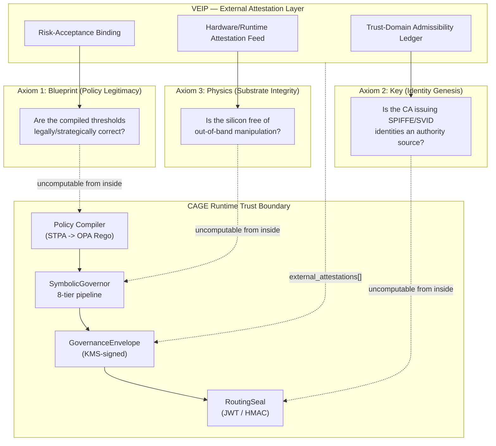
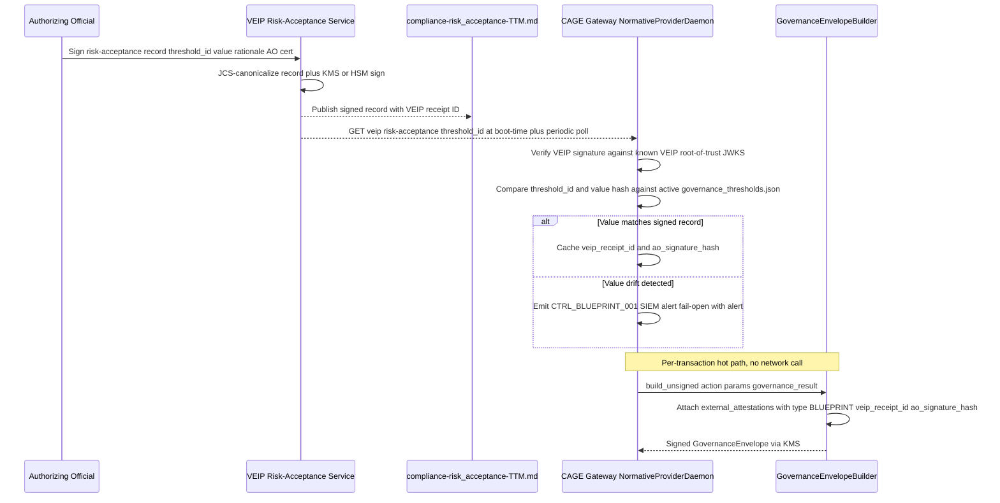
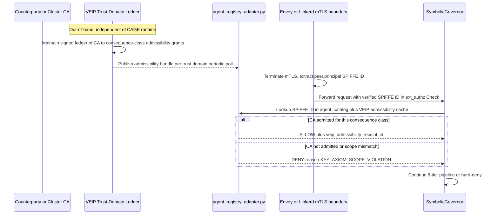
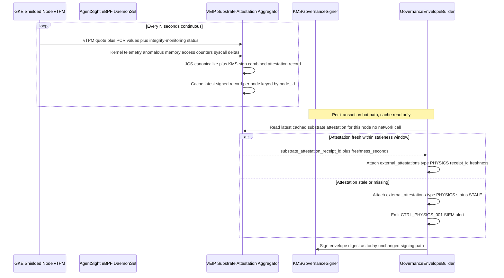
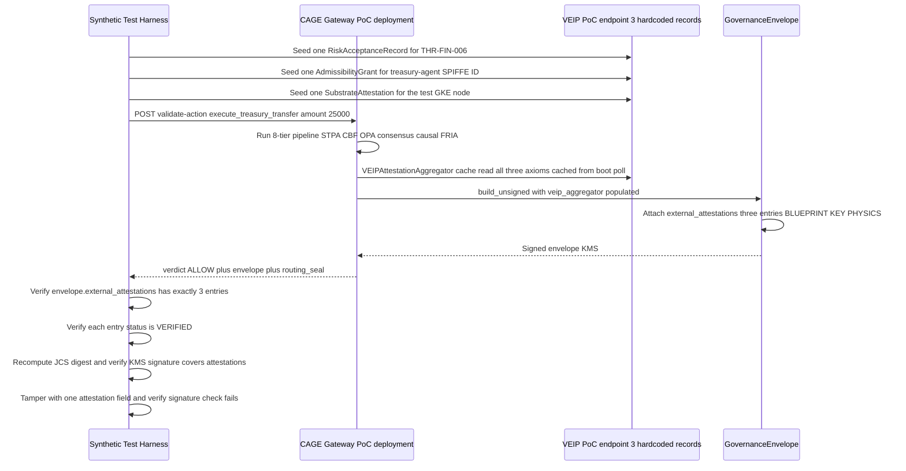

# CAGE × VEIP: The Three Uncomputable Axioms — Architectural Resolution

> **Document Type:** Architecture Design Document
> **Status:** Draft for review
> **Scope:** Maps the "Three Uncomputable Axioms" framework onto CAGE's existing
> governance substrate and specifies how a **VEIP (Verifiable Execution Evidence
> Pack)** adapter docks into the `NormativeProvider` integration seam
> ([`normative_provider.py`](../src/gateway/governance/normative_provider.py))
> to close each gap.
> **Prior work:** This document builds on the prior analysis that identified 8
> integration gaps at the `NormativeProvider` protocol boundary.

---

## 1. Executive Summary

CAGE enforces a deterministic, cryptographically-sealed governance pipeline:
STPA/UCA validation → confidence gating → OPA/Rego policy evaluation → Control
Barrier Functions → multi-agent consensus → causal gatekeeping → adaptive FRIA
enforcement, all bound together by a **routing seal**
([`routing_seal.py`](../src/gateway/governance/routing_seal.py)) and a
**governance envelope**
([`governance_envelope.py`](../src/gateway/governance/governance_envelope.py))
signed by Cloud KMS ([`kms_signer.py`](../src/gateway/governance/kms_signer.py)).

This pipeline is **sound but not complete**. It answers the question "did this
action comply with the compiled policy, evaluated by a key CAGE controls, on
a substrate CAGE assumes is trustworthy?" It structurally cannot answer three
prior questions, each of which is a precondition for the soundness claim to
mean anything in a regulated, adversarial, multi-party environment:

| # | Axiom | Question CAGE cannot answer alone |
|---|---|---|
| 1 | **Blueprint** (Policy Legitimacy) | Is the *compiled rule* itself legally/strategically correct, and who accepted the residual risk of its current value? |
| 2 | **Key** (Identity Genesis) | Is the *Certificate Authority* issuing the SPIFFE/SVID identities CAGE trusts actually an authority for this institutional consequence? |
| 3 | **Physics** (Substrate Integrity) | Is the *hardware* CAGE runs on free of out-of-band manipulation (e.g. Rowhammer bit-flips) between attestation checkpoints? |

Each axiom is **uncomputable from inside CAGE's own trust boundary** — no
amount of internal Rego policy or in-process cryptography can self-certify
its own legitimacy, its issuer's authority, or its silicon's integrity. This
is not a CAGE defect; it is a category boundary common to every governance
substrate. It is precisely the boundary a **VEIP (Verifiable Execution
Evidence Pack)** is designed to close: VEIP does not replace CAGE's runtime
enforcement, it **externally attests to the three preconditions** CAGE must
assume, and binds that attestation cryptographically into the same evidence
chain CAGE already produces.

This document:

1. Maps each axiom to the exact CAGE modules/fields where the gap lives.
2. Specifies the VEIP integration architecture that closes each gap without
   modifying CAGE's runtime enforcement hot path.
3. Defines the canonicalization schema VEIP and CAGE must share (RFC 8785 JCS
   everywhere, a new `external_attestations` envelope section, and OSCAL
   four-state vocabulary alignment).
4. Proposes a bounded, single-transaction-type proof-of-concept ("Treasury
   Transfer") suitable for the joint synthetic test.

---

## 2. The Three Uncomputable Axioms — Framing



**Key principle:** VEIP integrates as a **NormativeProvider implementation**
(the same seam used by Provider 01, Provider 02, and Provider 03 today — see
[`get_normative_provider()`](../src/gateway/governance/normative_provider.py:800)),
plus a new **attestation-embedding hook** in the envelope builder. This keeps
VEIP off the synchronous hot path for ALLOW-zone transactions and reuses
CAGE's existing async attestation, JWKS, and JCS canonicalization
infrastructure rather than inventing a parallel one.

---

## Table of Contents

1. [Executive Summary](#1-executive-summary)
2. [The Three Uncomputable Axioms — Framing](#2-the-three-uncomputable-axioms--framing)
3. [Axiom 1 — Policy Legitimacy (The Blueprint Axiom)](#3-axiom-1--policy-legitimacy-the-blueprint-axiom)
4. [Axiom 2 — Identity Genesis (The Key Axiom)](#4-axiom-2--identity-genesis-the-key-axiom)
5. [Axiom 3 — Substrate Integrity (The Physics Axiom)](#5-axiom-3--substrate-integrity-the-physics-axiom)
6. [CAGE-VEIP Canonicalization Schema](#6-cage-veip-canonicalization-schema)
7. [Unified VEIP Adapter Architecture](#7-unified-veip-adapter-architecture)
8. [Bounded Proof-of-Concept Scope](#8-bounded-proof-of-concept-scope-treasury-transfer)
9. [Risk Register & Open Questions](#9-risk-register--open-questions)
10. [Appendix — File/Line Reference Index](#10-appendix--fileline-reference-index)

---

## 3. Axiom 1 — Policy Legitimacy (The Blueprint Axiom)

### 3.1 The Problem, Precisely

CAGE's `SymbolicGovernor` pipeline compiles and enforces machine-readable
thresholds with mathematical rigor (e.g. `THR-FIN-006` — consensus trigger at
$10,000 — [`config/governance_thresholds.json:60`](../config/governance_thresholds.json:60)),
but the *value* `10000.0` is a human risk-acceptance decision, not a derived
constant. The document that is supposed to carry that provenance —
[`THRESHOLD_TRACEABILITY_MATRIX.md`](../compliance/risk_acceptance/THRESHOLD_TRACEABILITY_MATRIX.md)
— is:

- A **Markdown file**, not a machine-verifiable artifact.
- **Disconnected** from the JCS-signed governance envelope chain — nothing in
  [`governance_envelope.py`](../src/gateway/governance/governance_envelope.py)
  references the TTM, its hash, or its approval state.
- Carrying **pending AO signatures** (see
  [`THRESHOLD_TRACEABILITY_MATRIX.md:232`](../compliance/risk_acceptance/THRESHOLD_TRACEABILITY_MATRIX.md:232),
  `:251`, `:270`, `:289` — all four risk acceptances RA-001 through RA-004 are
  `[SIGNATURE PENDING]`) with **no cryptographic linkage** from the signature
  block in Section 6 to the actual runtime value being enforced.

Concretely: **nothing prevents `config/governance_thresholds.json` from
drifting from the values the AO actually authorized**, and no runtime
artifact (envelope, seal, audit log) would detect or reflect that drift. The
`GovernanceContext.policy_version` field
([`governance_envelope.py:154`](../src/gateway/governance/governance_envelope.py:154))
hashes the *active OPA registry*, not the risk-acceptance record that
justified the values compiled into it.

### 3.2 Current State — Code-Level Gaps

| Location | Gap |
|---|---|
| [`governance_envelope.py:151-165`](../src/gateway/governance/governance_envelope.py:151) `GovernanceContext` | Has `policy_version` (hash of `ControlRegistry`) but no field binding to a **risk-acceptance record ID** or **AO signature hash**. |
| [`governance_envelope.py:280-287`](../src/gateway/governance/governance_envelope.py:280) `_get_policy_version()` | Hashes `ControlRegistry().active_hash` — the *compiled Rego*, not the *human decision* that set the threshold values feeding the compiler. |
| [`THRESHOLD_TRACEABILITY_MATRIX.md:298-355`](../compliance/risk_acceptance/THRESHOLD_TRACEABILITY_MATRIX.md:298) Section 6 (Approval Block) | Plain-text signature blanks (`Name: ___`, `Signature: ___`) — no digital signature, no hash of the document content at signing time, no linkage to a specific `governance_thresholds.json` commit SHA. |
| [`config/governance_thresholds.json`](../config/governance_thresholds.json) | No `_source_ttm_hash` or `_risk_acceptance_id` metadata field per threshold — the JSON is the sole source of truth at runtime with zero backward traceability. |
| [`normative_provider.py:167-197`](../src/gateway/governance/normative_provider.py:167) `NormativeBaseline` | Has a `signature: str = ""` field that is **declared but never populated or verified** by `StubNormativeProvider` — the seam exists but is inert. |

### 3.3 VEIP Integration Architecture — Blueprint

**Principle:** VEIP acts as a **Risk-Acceptance Attestation Authority**. It
does not change *what* threshold values CAGE enforces — it cryptographically
proves *who accepted the risk* of the current value and binds that proof into
every envelope produced while that value is active.



**Design decisions:**

1. **New `NormativeProvider`-shaped method, not a new protocol.** VEIP
   Blueprint attestation follows the exact boot-fetch + poll pattern already
   proven by [`NormativeProviderDaemon`](../src/gateway/governance/normative_provider.py:573)
   (Level 1 provider fetch → Level 2 local cache → Level 3 static bundle →
   Level 4 fail-closed). A new `VEIPBlueprintProvider` class in
   `src/integrations/veip/` implements:
   - `fetch_risk_acceptance(threshold_id: str) -> RiskAcceptanceRecord`
   - `verify_signature(record) -> bool`
   This mirrors [`Provider03NormativeProvider`](../src/integrations/provider_03/provider.py:48)
   as the template for a vendor-isolated adapter.
2. **No hot-path network call.** Risk-acceptance records are fetched at boot
   and on a poll interval (default 6h, matching `THR-AUD-002` Lula cadence),
   cached in-memory, and only the **cached receipt ID + signature hash** is
   embedded per-transaction — identical latency profile to the existing
   `policy_version` field.
3. **Drift detection is the payload, not blocking.** If
   `config/governance_thresholds.json` diverges from the last VEIP-attested
   value, CAGE does **not** silently fail-closed (that would let an
   attacker DoS trading by feeding a bad VEIP feed) — it emits a new
   `CTRL_BLUEPRINT_001` control violation to the audit/SIEM stream (same
   pattern as `_async_attestation()` in
   [`normative_provider.py:366-411`](../src/gateway/governance/normative_provider.py:366))
   and flags the envelope's `external_attestations[].status` as
   `DRIFT_DETECTED`. Whether drift blocks execution is a **policy decision**
   configurable per deployment region (`CAGE_BLUEPRINT_DRIFT_FAIL_CLOSED`).
4. **TTM becomes a rendered view, not the source of truth.** The Markdown TTM
   is regenerated from VEIP-signed records (a new
   `scripts/render_ttm_from_veip.py`, following the pattern of
   `oscal_ssp_exporter.py`), turning today's manually-edited document into a
   build artifact with a reproducible hash.

### 3.4 Activating the Dormant `NormativeBaseline.signature` Field

The dormant `signature` field in
[`normative_provider.py:183`](../src/gateway/governance/normative_provider.py:183)
is exactly the seam VEIP needs — it was speculatively added for this purpose
and never wired up. The VEIP Blueprint provider is the **first real consumer**
of this field:

```python
# src/integrations/veip/blueprint_provider.py (new)
async def fetch_baseline(self, region: str) -> NormativeBaseline:
    record = await self._client.get_risk_acceptance_bundle(region)
    return NormativeBaseline(
        region=region,
        profile=record.thresholds,
        signature=record.veip_kms_signature,  # activates dormant field
        etag=record.receipt_id,
    )
```

`NormativeBaseline.is_valid` and `.profile_hash` require no changes — the
verification step (comparing `signature` against the VEIP root JWKS) is added
to `NormativeProviderDaemon.boot_fetch()` as a new guarded branch, fail-open
with alert on mismatch per §3.3 item 3 above.

---

## 4. Axiom 2 — Identity Genesis (The Key Axiom)

### 4.1 The Problem, Precisely

CAGE's zero-trust network layer (Z3N) enforces SPIFFE/SVID mTLS identity via
Linkerd for Gateway→OPA and Gateway→NeMo paths, and the
[`agent_registry_adapter.py`](../src/gateway/governance/ingress/agent_registry_adapter.py)
maintains a SPIFFE trust-domain catalog compiled into OPA Rego. The Envoy
`ext_authz` boundary
([`docs/architecture/CAGE_AGW_REFERENCE_ARCH.md`](../docs/architecture/CAGE_AGW_REFERENCE_ARCH.md))
reads `peer.principal` (the SPIFFE ID from the mTLS SAN) and treats it as
ground truth for "who is calling."

This is **identity verification, not identity authority validation**. CAGE
(and Linkerd) can cryptographically prove that a certificate chains to *a*
CA it trusts — but nothing in the stack answers: *why is this particular CA
an authority source for the institutional consequence being gated?* A
compromised, mis-issued, or simply out-of-scope CA (e.g. a dev/staging root
accidentally trusted in a production trust bundle, or a partner's CA that is
authoritative for messaging but not for treasury movement) would produce a
**valid mTLS handshake and a valid OPA-admitted SPIFFE ID**, while being
**institutionally illegitimate** for the specific consequence (e.g.
initiating a wire transfer) the request represents.

`kms_signer.py` and `jwks.py` solve a **different, narrower** problem: they
prove that the *governance verdict* was signed by *CAGE's own* key, and that
key rotation is auditable. Neither module validates the *provenance or
scope-of-authority* of the CA issuing peer identities in the first place —
that trust is delegated entirely to the mesh's root-of-trust bootstrap,
which is an infrastructure-provisioning decision, not a runtime-verifiable
claim.

### 4.2 Current State — Code-Level Gaps

| Location | Gap |
|---|---|
| `deployment/k8s/linkerd-mtls-policy.yaml` | `MeshTLSAuthentication` trusts the Linkerd cluster CA bundle wholesale — no per-transaction-type authority scoping (a SPIFFE ID valid for "read market data" is cryptographically indistinguishable in authority terms from one valid for "authorize treasury transfer"). |
| [`agent_registry_adapter.py`](../src/gateway/governance/ingress/agent_registry_adapter.py) | Registers SPIFFE IDs → allowed tools, but the **registration act itself** is not independently attested — a compromised registry write inserts a false trust-domain-to-tool mapping with no external check. |
| [`jwks.py:363-404`](../src/gateway/governance/jwks.py:363) `get_jwks()` / `_initialize_jwks_from_kms()` | Bootstraps JWKS entirely from **CAGE's own KMS signer** — there is no notion of a *counterparty's* JWKS or CA chain being independently validated against an external authority registry. |
| [`kms_signer.py:699-750`](../src/gateway/governance/kms_signer.py:699) `validate_ready()` | Validates that CAGE's *own* KMS key is reachable/ENABLED — proves nothing about whether an *external* signer (e.g. a counterparty bank, a custodian) presenting a SPIFFE/mTLS identity is authorized for the specific consequence class of the transaction. |
| `GovernanceEnvelope.issuer` ([`governance_envelope.py:113-126`](../src/gateway/governance/governance_envelope.py:113)) | Records `service`, `instance_id`, `region` — no field for the **trust-domain admissibility decision** (which CA, under what scope grant, admitted this issuer to sign for this consequence class). |

### 4.3 VEIP Integration Architecture — Key

**Principle:** VEIP acts as a **Trust-Domain Admissibility Ledger**. It does
not re-implement mTLS or replace Linkerd/SPIFFE — it answers a question
neither Linkerd nor OPA is positioned to answer: *"is this CA, for this
SPIFFE trust domain, an admitted authority source for this consequence
class?"* This is a **consequence-scoped authority check** layered on top of
(not instead of) cryptographic identity verification.



**Design decisions:**

1. **Consequence-class scoping, not identity replacement.** VEIP's ledger
   maps `(trust_domain, CA_fingerprint) -> [admitted_consequence_classes]`
   (e.g. `["market_data_read"]` vs `["treasury_transfer", "consensus_gated"]`).
   This directly extends the existing SPIFFE catalog structure already
   documented in
   [`AGENTIC_SCOPE_STATEMENT.md:103-113`](../docs/governance/AGENTIC_SCOPE_STATEMENT.md:103)
   ("Allowed tools: enumerated set of tool names the agent may invoke") by
   adding an **authority-source dimension** alongside the existing
   **tool-scope dimension**.
2. **New OPA input field, not a new enforcement point.** The `agent_catalog.rego`
   policy (compiled from `config/agent_catalog.json`) gains a new attribute
   per registry entry: `veip_admissibility_receipt_id` and
   `admitted_consequence_classes`. `SymbolicGovernor` Tier 2/4 OPA evaluation
   (already the enforcement point for RBAC) simply gains one more Rego
   condition — no new pipeline tier, no new latency-critical hot path.
3. **`GovernanceEnvelope.issuer` gains a `trust_domain_attestation` field**
   (see §6.2 schema below) recording `{ca_fingerprint, admissibility_receipt_id,
   consequence_class, veip_signature}` — this is the artifact an external
   auditor uses to answer "why was this CA trusted for this specific
   transfer" without re-deriving it from raw mTLS certs.
4. **Registry write attestation.** Any `agent_registry_adapter.py` catalog
   mutation (new SPIFFE ID admitted, scope changed) is itself submitted to
   VEIP as an evidence event — closing the gap where "the registration act
   itself is not independently attested" (§4.2 row 2). This reuses the same
   evidence-submission pattern as `NormativeProvider.submit_evidence()`.

### 4.4 Why This Cannot Be Solved by JWKS/KMS Alone

[`jwks.py`](../src/gateway/governance/jwks.py) and
[`kms_signer.py`](../src/gateway/governance/kms_signer.py) are **correct and
necessary** for proving "this signature was produced by this key, and this
key belongs to this rotation lineage." They are the wrong layer to prove
"this key's issuing CA is an authority for this consequence" because:

- `JWKSet` ([`jwks.py:168-352`](../src/gateway/governance/jwks.py:168)) only
  ever holds **CAGE's own** signing keys — it has no concept of a
  counterparty's or peer service's CA chain.
- `KMSGovernanceSigner.validate_ready()`
  ([`kms_signer.py:699`](../src/gateway/governance/kms_signer.py:699)) is a
  **liveness/reachability** check on CAGE's own key, not an **authority
  provenance** check on an external CA.
- Authority provenance is inherently an **off-chain, policy/legal**
  question ("did the CA operator have the mandate to issue this identity for
  this purpose") — it cannot be derived from the cryptographic artifact
  alone, which is exactly why it requires an external attestor (VEIP) rather
  than a code change to the signing/verification math.

---

## 5. Axiom 3 — Substrate Integrity (The Physics Axiom)

### 5.1 The Problem, Precisely

CAGE's GKE deployment enables **Shielded Nodes** with Secure Boot and
Integrity Monitoring
([`infra/modules/gcp_gke_cluster/main.tf:109-111,193-196,243-246,320-323`](../infra/modules/gcp_gke_cluster/main.tf:109)),
which provides strong, vTPM-backed guarantees at the **boot-time** and
**node-config** layer: the kernel that booted is the kernel Google signed,
and the node hasn't been tampered with at the firmware/bootloader level.

This is a **point-in-time, boot-time** attestation. It says nothing about
**continuous runtime memory integrity** between boot and the current
instant. Physical side-channel attacks — Rowhammer-class bit flips induced
by adversarial DRAM access patterns, voltage-glitching, or other
out-of-band hardware manipulation — occur *after* boot, *within* an already
Secure-Boot-verified kernel, and are **invisible to Shielded Nodes'
attestation model**, which checks boot integrity, not live memory state.

Concretely: a governance verdict computed and KMS-signed at time `T` carries
an implicit, unstated assumption that the CPU/memory executing the
`SymbolicGovernor._run_checks()` pipeline at time `T` has not had its state
corrupted by a physical exploit between the last attestation checkpoint
(node boot) and `T`. CAGE has **zero continuous runtime attestation** — no
periodic vTPM quote re-verification, no eBPF-detected anomalous memory access
pattern correlation, and no binding of container image hash to the specific
attestation state of the node it is scheduled on at the moment of signing.

### 5.2 Current State — Code-Level Gaps

| Location | Gap |
|---|---|
| `infra/modules/gcp_gke_cluster/main.tf:109-111` `enable_shielded_nodes` | Boot-time only — `shielded_instance_config` (`enable_secure_boot`, `enable_integrity_monitoring`) verifies the boot chain once; no periodic re-attestation is wired into the governance pipeline. |
| `config/model_hashes.json` | Captures **container image hashes** (build-time supply chain integrity) — this proves *which image* was deployed, not that the *running process's memory* still matches that image's expected state at signing time. |
| [`kms_signer.py`](../src/gateway/governance/kms_signer.py) `sign_precomputed_digest()` / `sign_raw()` | Signs whatever digest/bytes it is handed — **no precondition check** that the signing operation is occurring on an attested-fresh node state; a compromised memory region feeding a corrupted `plan` dict would be signed with full cryptographic validity. |
| [`governance_envelope.py:184-197`](../src/gateway/governance/governance_envelope.py:184) `GovernanceEnvelope` dataclass | No `substrate_attestation` field — the envelope's `issuer` block records `service`/`instance_id`/`region` but nothing about the node's live attestation state at signing time. |
| AgentSight eBPF DaemonSet (kernel-level observability) | Currently used for **behavioral** governance telemetry (process/syscall monitoring), not wired to **hardware-integrity** telemetry (vTPM quotes, memory-anomaly counters) or to the envelope-signing path. |

### 5.3 VEIP Integration Architecture — Physics

**Principle:** VEIP acts as a **Continuous Substrate Attestation Aggregator**.
It does not replace GKE Shielded Nodes or add new kernel-level detection
logic to CAGE — it **ingests existing GKE/vTPM telemetry and eBPF signals on
a continuous cadence**, and stamps each signed governance envelope with the
**freshest available attestation state**, converting a boot-time-only
guarantee into an auditable, time-bound chain of custody.



**Design decisions:**

1. **Sidecar aggregation, not inline blocking.** The VEIP Physics feed is a
   **background daemon** (same shape as
   [`NormativeProviderDaemon.start_polling()`](../src/gateway/governance/normative_provider.py:687)),
   polling vTPM quotes and AgentSight eBPF counters on a short interval
   (e.g. 10-30s) and caching the latest signed attestation per node. The
   per-transaction envelope-building path only ever reads the **cache** —
   zero added latency, zero new network calls on the hot path.
2. **Staleness is explicit and auditable, not silently ignored.** Every
   envelope's `external_attestations[]` entry for `type: PHYSICS` carries a
   `freshness_seconds` value. A configurable staleness threshold
   (`CAGE_PHYSICS_ATTESTATION_MAX_STALENESS_S`, following the existing
   pattern of `telemetry.max_staleness_seconds` in
   [`config/governance_thresholds.json:47-49`](../config/governance_thresholds.json:47))
   determines whether a stale attestation is merely flagged or triggers a
   `CTRL_PHYSICS_001` SIEM alert. As with Axioms 1 and 2, **fail-open with
   alert is the default** — fail-closed on Physics staleness is a
   per-deployment policy choice (some regulated environments will require it
   for HIGH-value consequence classes).
3. **eBPF is the practical proxy for "no out-of-band manipulation."** CAGE
   cannot directly detect Rowhammer at the application layer — no software
   can, by construction (that is the whole point of a physical side-channel
   attack). What VEIP *can* do is aggregate the **existing AgentSight eBPF
   DaemonSet's** kernel telemetry (already deployed for behavioral
   observability) for anomaly signatures correlated with known Rowhammer
   exploitation patterns (e.g. anomalous page-cache eviction rates, ECC
   correctable-error-count spikes surfaced via `mcelog`/`edac` kernel
   subsystems where available), combined with GKE's own vTPM PCR
   re-measurement. This is **probabilistic evidence, not a formal guarantee**
   — the architecture must document this honestly rather than overclaim
   detection capability (see §9 Risk Register).
4. **New envelope field, no change to the signing algorithm.** The
   `GovernanceEnvelope` gains `external_attestations[]` (§6.2) with a
   `PHYSICS`-typed entry; `KMSGovernanceSigner.sign_precomputed_digest()`
   is unmodified — it signs the envelope digest *including* the attestation
   entry, so any tampering with the substrate-attestation claim itself is
   caught by the existing signature-verification path.

### 5.4 What VEIP Physics Attestation Does NOT Claim

To avoid overclaiming (a documented CAGE engineering value — see the
FTRA BFS-exclusion caveat in
[`SUBSTRATE_CONTRACT.md:175`](../docs/SUBSTRATE_CONTRACT.md:175) as
precedent for honest gap disclosure):

- It does **not** prove the absence of a successful Rowhammer exploit at the
  instant of signing — it provides **continuous, auditable evidence** that
  known-detectable precursor/correlated signals were absent as of the last
  poll, narrowing the undetected exposure window from "entire node
  lifetime" to "one poll interval."
- It does **not** replace formal hardware attestation standards (e.g.
  Confidential Computing / AMD SEV-SNP, Intel TDX) — if CAGE later adopts
  Confidential GKE Nodes, VEIP's Physics feed should ingest **those**
  attestation reports as a strictly stronger evidence source, with the
  eBPF-correlation approach demoted to a compensating control.

---

## 6. CAGE-VEIP Canonicalization Schema

### 6.1 Unify on RFC 8785 JCS Everywhere

CAGE already has the correct primitive —
[`jcs_canonicalize_plan()`](../src/gateway/governance/jcs_canonicalizer.py:22)
wrapping the `jcs` library — but its adoption is **inconsistent** across the
codebase. This inconsistency is a direct integration risk for VEIP: if CAGE
hashes a payload with `json.dumps(sort_keys=True)` and VEIP (or any external
verifier) re-canonicalizes with RFC 8785 JCS, the hashes **will not match**,
silently breaking every downstream signature/hash comparison.

**Audit of current canonicalization call sites:**

| File:Line | Method Used | Should Use JCS? |
|---|---|---|
| [`governance_envelope.py:223,230`](../src/gateway/governance/governance_envelope.py:223) `to_canonical_bytes()` / `compute_digest()` | `jcs_canonicalize_plan()` | ✅ Already correct |
| [`governance_envelope.py:277`](../src/gateway/governance/governance_envelope.py:277) `_compute_action_hash()` | `jcs_canonicalize_plan()` | ✅ Already correct |
| [`kms_signer.py:53-57`](../src/gateway/governance/kms_signer.py:53) `_canonicalise_plan()` | `jcs_canonicalize_plan()` | ✅ Already correct |
| [`routing_seal.py:187-200`](../src/gateway/governance/routing_seal.py:187) `_canonical_payload()` (v2 HMAC seal path) | `json.dumps(sort_keys=True, separators=(",", ":"))` | ❌ **Inconsistent** — legacy HMAC fallback path never migrated to JCS |
| [`routing_seal.py:227,244-245,485`](../src/gateway/governance/routing_seal.py:227) v3 JWT path (`action_hash`) | Mixed: `jcs_canonicalize_plan()` for `action_hash` at :227/:485, but raw `json.dumps(header)`/`json.dumps(payload)` (not sorted, not JCS) for the JWT header/payload themselves at :244-245 | ❌ **Partially inconsistent** — the JWT envelope structure itself is not JCS-canonicalized, only the embedded `action_hash` |
| [`routing_seal.py:339-341`](../src/gateway/governance/routing_seal.py:339) evidence event `params_hash` | `json.dumps(params, sort_keys=True, default=str)` | ❌ **Inconsistent** |
| [`normative_provider.py:195-196`](../src/gateway/governance/normative_provider.py:195) `NormativeBaseline.profile_hash` | `json.dumps(sort_keys=True, separators=(",", ":"))` | ❌ **Inconsistent** — this is exactly the field VEIP's Blueprint attestation must hash-compare against |
| [`normative_provider.py:395-397`](../src/gateway/governance/normative_provider.py:395) `_async_attestation()` evidence hash | `json.dumps(sort_keys=True)` (no separators arg — default whitespace) | ❌ **Inconsistent** — worst case, since default `json.dumps` separators include spaces, breaking even simple hash reproducibility across Python versions/locales |
| [`normative_provider.py:675-677`](../src/gateway/governance/normative_provider.py:675) `NormativeProviderDaemon` cached-profile hash | `json.dumps(sort_keys=True, separators=(",", ":"))` | ❌ **Inconsistent** |
| [`provenance_chain.py:161`](../src/gateway/governance/provenance_chain.py:161) `compute_hash()` | `json.dumps(sort_keys=True, separators=(",", ":"))` | ❌ **Inconsistent** — the entire provenance hash-chain is built on non-JCS hashing |
| [`kms_signer.py:339-341`](../src/gateway/governance/kms_signer.py:339) (reconciliation payload, `_canonicalise_plan` callers elsewhere) | Varies by caller | Audit required per call site |

**Remediation plan (required before VEIP integration, not optional):**

1. **Replace every `json.dumps(..., sort_keys=True, ...)` call used for a
   hash/signature input** with `jcs_canonicalize_plan()`. This is a
   **breaking change** for any external verifier or stored hash that was
   computed with the old method — must ship as a major/minor version bump
   per [`docs/operations/GIT_WORKFLOW_STANDARDS.md`](../docs/operations/GIT_WORKFLOW_STANDARDS.md)
   and the existing `docs/BREAKING_CHANGES_v3.md` precedent (the routing seal
   v2→v3 JWT migration is the direct template for this migration).
2. **`routing_seal.py` v2 HMAC path** (`_canonical_payload()`,
   [`routing_seal.py:187`](../src/gateway/governance/routing_seal.py:187)):
   migrate to JCS or, preferably, **deprecate the v2 HMAC path entirely**
   for VEIP-integrated deployments (v2 is already only a test/dev fallback
   per `_IS_PRODUCTION` gating at
   [`routing_seal.py:509`](../src/gateway/governance/routing_seal.py:509)).
3. **`routing_seal.py` v3 JWT header/payload** (`:244-245`): the JWT
   spec (RFC 7519) mandates base64url(JSON) for header/payload, which is
   **not** the same as JCS-canonicalized bytes for those specific fields —
   this is an **acceptable divergence** because JWT verification does not
   require byte-for-byte re-canonicalization (it verifies the exact
   transmitted bytes against the signature). The `action_hash` **inside**
   the payload, however, must remain JCS (already correct at `:227`).
4. **`normative_provider.py:195-196, 395-397, 675-677`**: all three
   `json.dumps(sort_keys=True, ...)` call sites migrate to
   `jcs_canonicalize_plan()`. This is the **highest-priority fix** for VEIP
   Blueprint integration (§3), since `NormativeBaseline.profile_hash` is the
   exact value VEIP's risk-acceptance record comparison depends on.
5. **`provenance_chain.py:144-162`** `compute_hash()`: migrate to JCS. This
   is lower urgency for the PoC (§8) but required before VEIP attestations
   are chained into the provenance record for cross-verification.
6. **CI enforcement**: add a `scripts/check_jcs_canonicalization.py` lint
   rule (new) that greps for `json.dumps(` calls combined with
   `hashlib.sha256(` in the same function body outside of
   `jcs_canonicalizer.py` itself, failing CI on new violations — mirroring
   the existing `scripts/check_policy_drift.py` enforcement pattern.

### 6.2 `GovernanceEnvelope` → VEIP-Compliant Payload Mapping

The existing `GovernanceEnvelope` dataclass
([`governance_envelope.py:184-197`](../src/gateway/governance/governance_envelope.py:184))
requires **one new top-level field** — `external_attestations` — and no
changes to existing fields, preserving backward compatibility for consumers
that only read today's envelope structure.

```json
{
  "envelope_version": "2.1",
  "envelope_type": "cage_governance_decision",
  "envelope_id": "cage-<uuid>",
  "issued_at": "2026-08-21T12:00:00.000Z",
  "expires_at": "2026-08-21T12:00:30.000Z",
  "issuer": {
    "service": "cage-gateway",
    "instance_id": "gke-governance-cluster-2-abc123",
    "region": "us-central1",
    "trust_domain_attestation": {
      "ca_fingerprint": "sha256:...",
      "admissibility_receipt_id": "veip-key-...",
      "consequence_class": "treasury_transfer",
      "veip_signature": "base64url(...)"
    }
  },
  "subject": {
    "action": "execute_treasury_transfer",
    "action_hash": "sha256:...",
    "record_hash": "sha256:...",
    "agent_id": "treasury-agent-prod-v1"
  },
  "governance_context": {
    "policy_version": "sha256:...",
    "tiers_passed": ["stpa", "cbf", "opa", "consensus"],
    "deployment_region": "US_FED",
    "controls_satisfied": ["CTRL_OPA_001", "CTRL_CBF_002"]
  },
  "payload": { "...": "..." },
  "external_attestations": [
    {
      "type": "BLUEPRINT",
      "veip_receipt_id": "veip-blueprint-...",
      "ao_signature_hash": "sha256:...",
      "threshold_id": "THR-FIN-006",
      "status": "VERIFIED",
      "attested_at": "2026-08-21T06:00:00.000Z"
    },
    {
      "type": "KEY",
      "veip_receipt_id": "veip-key-...",
      "ca_fingerprint": "sha256:...",
      "consequence_class": "treasury_transfer",
      "status": "VERIFIED",
      "attested_at": "2026-08-21T11:58:00.000Z"
    },
    {
      "type": "PHYSICS",
      "veip_receipt_id": "veip-physics-...",
      "node_id": "gke-node-...",
      "freshness_seconds": 12,
      "status": "VERIFIED",
      "attested_at": "2026-08-21T11:59:48.000Z"
    }
  ],
  "signature": {
    "algorithm": "ES256",
    "kid": "...",
    "value": "base64url(...)"
  }
}
```

**Field mapping rules:**

| VEIP Concept | CAGE Envelope Location | Notes |
|---|---|---|
| Risk-acceptance receipt (Blueprint) | `external_attestations[type=BLUEPRINT]` | New array entry; §3.3 |
| Trust-domain admissibility grant (Key) | `issuer.trust_domain_attestation` **and** `external_attestations[type=KEY]` | Summary in `issuer` for quick lookup, full receipt in `external_attestations[]` for audit; §4.3 |
| Substrate attestation (Physics) | `external_attestations[type=PHYSICS]` | New array entry; §5.3 |
| VEIP root-of-trust verification | `signature` block **unchanged** | The envelope's own KMS signature covers the *entire* canonical payload including `external_attestations[]` — tampering with any attestation entry invalidates the existing signature, requiring no new verification code path. |

**Critical invariant:** `external_attestations[]` is included in the
JCS-canonicalized bytes that `compute_digest()`
([`governance_envelope.py:225-231`](../src/gateway/governance/governance_envelope.py:225))
hashes and KMS signs. This means **VEIP attestation data is protected by the
same signature CAGE already produces** — no new signing infrastructure, no
new verification code, only a new field that participates in the existing
canonicalization → digest → sign pipeline.

### 6.3 `ValidationResult.findings` — Align to OSCAL Four-State Vocabulary

CAGE already has **two independent four-state vocabularies** that must not
be confused:

1. **Gateway decision vocabulary** (`ALLOW/DENY/REQUIRE_APPROVAL/DEFER`) —
   [`decisions.py:81-178`](../src/gateway/governance/decisions.py:81) —
   governs *what happens to the transaction*.
2. **OSCAL assessment-result vocabulary** (`PASS/FAIL/NOT_APPLICABLE/ERROR`) —
   used throughout `compliance/lula/assessment-results.yaml` (currently only
   `state: not-satisfied` / implicitly `satisfied` appear — the full
   four-state OSCAL vocabulary per NIST OSCAL Assessment Results model is
   `satisfied` / `not-satisfied`, with `state` further qualified by
   `finding.status.state`) — governs *whether a control was met*.

`ValidationResult.findings`
([`normative_provider.py:200-214`](../src/gateway/governance/normative_provider.py:200))
is currently an untyped `list[dict[str, Any]]` with no enforced vocabulary —
each provider (Provider 01, Provider 02, Provider 03, and now VEIP) is free to invent
its own finding-status strings, which is exactly the kind of vocabulary drift
`decisions.py`'s docstring (`:22-42`) describes CAGE having already suffered
and fixed once for the gateway-decision vocabulary.

**Proposed fix:** introduce a `FindingStatus` enum mirroring OSCAL's
four-state model, and require every `NormativeProvider.validate_fria()`
implementation (including the new `VEIPKeyProvider` and `VEIPBlueprintProvider`)
to populate `findings[].status` from this enum:

```python
# src/gateway/governance/normative_provider.py (extension)
class FindingStatus(str, Enum):
    """OSCAL four-state assessment-result vocabulary.

    Maps 1:1 to NIST OSCAL `finding.status.state` / `observation.status`
    values, ensuring every NormativeProvider (Provider 01, Provider 02, Provider 03,
    VEIP) emits findings the OSCAL SSP exporter can ingest without a
    translation layer.
    """

    PASS = "PASS"  # OSCAL: satisfied
    FAIL = "FAIL"  # OSCAL: not-satisfied
    NOT_APPLICABLE = "NOT_APPLICABLE"  # OSCAL: not-applicable
    ERROR = "ERROR"  # Non-OSCAL extension: provider-side fault
    # (distinct from FAIL — evaluation could
    # not complete, vs. evaluation completed
    # and failed)
```

`ValidationResult.findings` entries become
`{"control_id": str, "status": FindingStatus, "detail": str}`, and
[`oscal_ssp_exporter.py`](../src/gateway/governance/oscal_ssp_exporter.py)
gains a new ingestion path that maps `FindingStatus.PASS/FAIL/NOT_APPLICABLE`
directly to OSCAL `finding.status.state` values (`ERROR` is excluded from
the OSCAL emission and instead routed to the SIEM as a provider-health
signal, since OSCAL's native vocabulary has no "evaluation errored" state).

---

## 7. Unified VEIP Adapter Architecture

### 7.1 Module Layout

Following the vendor-isolation pattern already established by
`src/integrations/{provider_02,provider_01,provider_03}/`, VEIP is a **new,
independent vendor package** — never a modification to kernel-resident
governance code:

```
src/integrations/veip/
├── __init__.py
├── blueprint_provider.py    # Axiom 1: NormativeProvider-shaped
├── key_provider.py           # Axiom 2: trust-domain admissibility lookups
├── physics_provider.py       # Axiom 3: substrate attestation daemon
├── client.py                  # Shared HTTP client + VEIP root JWKS verification
├── models.py                  # RiskAcceptanceRecord, AdmissibilityGrant,
│                               #   SubstrateAttestation dataclasses
└── tests/
    ├── test_blueprint_provider.py
    ├── test_key_provider.py
    └── test_physics_provider.py
```

### 7.2 Single Aggregation Point: `VEIPAttestationAggregator`

Rather than three independent daemons each patching
`GovernanceEnvelopeBuilder` separately, a single `VEIPAttestationAggregator`
(in `src/integrations/veip/client.py`) owns all three background caches and
exposes one method the envelope builder calls:

```python
class VEIPAttestationAggregator:
    """Aggregates the three axiom attestation caches into a single
    external_attestations[] list for envelope embedding.

    Owns three background pollers (Blueprint, Key, Physics), each following
    the NormativeProviderDaemon boot-fetch + poll pattern. Per-transaction
    calls never touch the network — they read the in-memory cache only.
    """

    def get_attestations_for(
        self,
        *,
        threshold_ids: list[str],
        trust_domain: str,
        node_id: str,
    ) -> list[dict[str, Any]]:
        """Returns the external_attestations[] entries for embedding.

        Fail-open by default: a missing/stale attestation produces a
        status: "STALE" or "MISSING" entry plus a SIEM alert, never an
        exception that would block the transaction. Per-region policy
        (CAGE_VEIP_FAIL_CLOSED_<AXIOM>) can override to fail-closed.
        """
        ...
```

`GovernanceEnvelopeBuilder.build_unsigned()`
([`governance_envelope.py:289`](../src/gateway/governance/governance_envelope.py:289))
gains one new optional parameter, `veip_aggregator: VEIPAttestationAggregator
| None = None`, defaulting to `None` (no attestations — full backward
compatibility for deployments that don't have VEIP configured).

### 7.3 Failure Isolation

Each of the three VEIP pollers is **independently circuit-broken**, mirroring
the existing OPA circuit-breaker pattern (`THR-SEC-002`,
[`THRESHOLD_TRACEABILITY_MATRIX.md:101`](../compliance/risk_acceptance/THRESHOLD_TRACEABILITY_MATRIX.md:101)):
a Physics-feed outage must never block Blueprint or Key attestation embedding,
and a VEIP total outage must never block the underlying 8-tier
`SymbolicGovernor` pipeline — VEIP is **always additive evidence**, never a
new hard gate, consistent with the framework's own claim that these are
*uncomputable* preconditions CAGE must assume, not new blocking dependencies
CAGE takes on.

### 7.4 Non-Goals

- VEIP does **not** become a new pipeline tier in
  [`SUBSTRATE_CONTRACT.md §2.3`](../docs/SUBSTRATE_CONTRACT.md:156)'s 8-tier
  enumeration. It is evidence-embedding infrastructure, orthogonal to the
  ALLOW/DENY/REQUIRE_APPROVAL/DEFER decision path.
- VEIP does **not** replace Provider 01/Provider 02/Provider 03 — those remain
  `NormativeProvider` implementations for FRIA validation; VEIP is a
  **cross-cutting attestation layer** that could, in principle, itself be
  registered as an additional `NormativeProvider` for the Blueprint axiom
  specifically (§3.3), while Key and Physics attestation live outside the
  `NormativeProvider` protocol entirely (they are not FRIA/baseline/evidence
  endpoints, they are envelope-embedding data sources).

---

## 8. Bounded Proof-of-Concept Scope: Treasury Transfer

Arkadiy's request for a "joint synthetic test" requires a scope narrow enough
to execute in a single sprint while touching all three axioms end-to-end.
**Treasury Transfer** is the right choice because it is:

- Already a first-class consequence class in CAGE's threshold model
  (`THR-FIN-006` consensus trigger, `THR-CBF-001` cash-balance floor) — no
  new domain modeling required.
- High-consequence enough that all three axioms are *plausibly* material
  (a mis-set threshold, a mis-admitted CA, or a corrupted signing node would
  each independently justify blocking a treasury movement).
- Narrow enough in field surface (amount, source account, destination
  account, currency, initiating agent identity) to hand-map completely in
  one PoC cycle.

### 8.1 Single Transaction Type

```json
{
  "action": "execute_treasury_transfer",
  "params": {
    "amount": 25000.00,
    "currency": "USD",
    "source_account": "treasury-ops-001",
    "destination_account": "counterparty-settlement-004",
    "initiating_agent_id": "treasury-agent-prod-v1",
    "trust_domain": "spiffe://cage.local/treasury-agent"
  }
}
```

This amount ($25,000) is deliberately **above** `THR-FIN-006`
($10,000 consensus trigger) so the PoC exercises the multi-agent consensus
tier concurrently with all three VEIP attestations — maximizing pipeline
coverage per test run.

### 8.2 Minimal Viable Field Mapping

| CAGE Field | VEIP Concept | PoC Simplification |
|---|---|---|
| `config/governance_thresholds.json` → `consensus.threshold_usd` (`THR-FIN-006`) | Blueprint: risk-acceptance record for **this one threshold only** | VEIP PoC ships a single hardcoded signed `RiskAcceptanceRecord` for `THR-FIN-006`, not the full 15-threshold registry. |
| `params.trust_domain` (`spiffe://cage.local/treasury-agent`) | Key: admissibility grant for `consequence_class: treasury_transfer` | VEIP PoC ships a single hardcoded `AdmissibilityGrant` mapping this one SPIFFE ID to this one consequence class — no general CA-chain-of-trust ledger. |
| GKE node hosting the gateway pod at test time | Physics: substrate attestation for that one node | VEIP PoC polls **one node's** vTPM state (via `gcloud compute instances get-shielded-identity`-equivalent API) and **one AgentSight eBPF counter** (e.g. `page_fault_anomaly_count`), not the full fleet. |
| `GovernanceEnvelope.external_attestations[]` | All three attestation types embedded | Full schema from §6.2, populated with the PoC's three hardcoded/single-source attestations. |
| `ValidationResult.findings[].status` | OSCAL four-state vocabulary | PoC provider returns exactly one finding per axiom, always `PASS` or `FAIL` (no `NOT_APPLICABLE`/`ERROR` paths exercised in PoC — those are follow-on test cases). |

### 8.3 PoC Sequence



### 8.4 Success Criteria for Trust-Domain Handoff Validation

The PoC is considered successful when **all** of the following hold:

1. **End-to-end envelope round-trip.** A `execute_treasury_transfer` request
   above the consensus threshold produces a signed `GovernanceEnvelope` with
   a populated `external_attestations[]` array containing exactly one
   `BLUEPRINT`, one `KEY`, and one `PHYSICS` entry, each with
   `status: "VERIFIED"`.
2. **Canonicalization parity.** VEIP and CAGE independently compute the JCS
   canonical bytes of the same `RiskAcceptanceRecord`/`AdmissibilityGrant`/
   `SubstrateAttestation` payload and produce **byte-identical** SHA-256
   digests — proving the §6.1 JCS unification closed the cross-system
   canonicalization gap.
3. **Signature tamper-evidence.** Mutating any single field inside
   `external_attestations[]` post-hoc (simulating an attacker altering a
   receipt ID) causes `GovernanceEnvelopeBuilder.verify()`
   ([`governance_envelope.py:444`](../src/gateway/governance/governance_envelope.py:444))
   to return `False` — proving attestation data is cryptographically bound
   to the envelope, not merely appended.
4. **Trust-domain admissibility handoff.** The `KEY` attestation's
   `ca_fingerprint` and `consequence_class` fields correctly gate a
   **negative test**: a request from a SPIFFE ID **not** covered by any
   `AdmissibilityGrant` for `treasury_transfer` results in the `KEY`
   attestation entry showing `status: "DENIED"` and (per the region's
   fail-open/fail-closed policy from §7.3) either an alert or a hard DENY
   verdict — this is the specific "why is this CA an authority source for
   this institutional consequence" question from Arkadiy's framing,
   answered observably in the envelope.
5. **Fail-open resilience.** With the VEIP PoC endpoint deliberately taken
   offline mid-test, a subsequent `execute_treasury_transfer` request still
   completes (ALLOW/DENY per the underlying 8-tier pipeline, unaffected),
   with `external_attestations[]` entries showing `status: "STALE"` and a
   corresponding `CTRL_BLUEPRINT_001`/`CTRL_KEY_001`/`CTRL_PHYSICS_001` SIEM
   alert emitted — proving VEIP is additive evidence, not a new hard
   dependency (§7.3 non-goal).
6. **OSCAL finding ingestion.** The `oscal_ssp_exporter.py` extension (§6.3)
   successfully ingests the PoC's `ValidationResult.findings` and emits a
   valid OSCAL `finding.status.state` entry without a manual translation
   step — proving the four-state vocabulary alignment is real, not aspirational.

### 8.5 Explicit PoC Non-Scope

To keep the joint synthetic test bounded, the following are **explicitly
deferred** to a follow-on phase:

- Multi-threshold Blueprint coverage (all 15+ TTM thresholds) — PoC covers
  `THR-FIN-006` only.
- Multi-trust-domain Key coverage (fleet-wide CA ledger) — PoC covers one
  SPIFFE ID / one consequence class only.
- Fleet-wide Physics coverage (all GKE nodes) — PoC covers one node only.
- `NOT_APPLICABLE`/`ERROR` finding-status code paths.
- Automated TTM Markdown regeneration (`scripts/render_ttm_from_veip.py`)
  — PoC validates the signed record exists and verifies; rendering the
  human-readable Markdown view is a follow-on documentation task.
- Confidential Computing / SEV-SNP / TDX substrate attestation upgrade path
  (§5.4) — out of scope until CAGE adopts Confidential GKE Nodes.

---

## 9. Risk Register & Open Questions

| Risk / Question | Impact | Mitigation / Owner |
|---|---|---|
| **JCS migration is a breaking change** across `routing_seal.py`, `normative_provider.py`, `provenance_chain.py` — any external verifier relying on the current `json.dumps(sort_keys=True)` hashes breaks silently. | High | Version-gate behind a minor/major release per `docs/BREAKING_CHANGES_v3.md` precedent; dual-hash transition window (compute both, log divergence, cut over). |
| **Fail-open default for all three axioms** means a compromised/unavailable VEIP feed does not, by itself, block a transaction — an adversary who can DoS VEIP gains nothing (transactions proceed) but an adversary who can **spoof** VEIP with false-positive `VERIFIED` attestations degrades audit trust without affecting the ALLOW/DENY decision. | Medium | VEIP root-of-trust JWKS must be provisioned via the same Workload-Identity/KMS rigor as CAGE's own signer — this is a deployment-hardening requirement, not a code gap, and should be captured as a POAM item once VEIP integration ships. |
| **Physics axiom is fundamentally probabilistic**, not a formal guarantee (§5.4). Overclaiming "Rowhammer-proof" would be a compliance-narrative risk (c.f. FTRA BFS-exclusion honesty precedent). | Medium | Document the eBPF-correlation approach explicitly as a compensating control, not a formal proof, in both this document and any downstream OSCAL/SSP narrative generated from it. |
| **Per-deployment-region fail-open/fail-closed policy** (`CAGE_VEIP_FAIL_CLOSED_<AXIOM>`) introduces a new region-specific configuration surface — must integrate with the existing `CAGE_DEPLOYMENT_REGION` guard pattern used throughout the codebase (`config/compliance/{REGION}_BASELINE.json`). | Low | Extend `config/thresholds/{REGION}_BASELINE.json` schema with a `veip_axiom_policy` block during implementation; validated by `schemas/thresholds.py` Pydantic model, same as all other region-gated config. |
| **Open question:** should the Blueprint axiom's `VEIPBlueprintProvider` be registered as the **primary** `NormativeProvider` (replacing Provider 01/Provider 03 for FRIA validation) or as a **secondary, attestation-only** provider that coexists with the FRIA provider? | — | Requires a product decision with Arkadiy's team; this document assumes secondary/coexisting (§7.4) as the lower-risk default, but the PoC (§8) should explicitly test both wiring options if time permits. |
| **Open question:** does VEIP's Key-axiom admissibility ledger need to be **regionally partitioned** (a CA admitted for `treasury_transfer` in `US_FED` might not be admitted in `EU_ECB`)? | — | Likely yes, given CAGE's existing regional-baseline pattern — flag for the PoC's follow-on phase (§8.5); not required for the single-region PoC. |
| **Open question:** what is VEIP's own key-rotation story, and does it need a `JWKSet`-equivalent structure mirroring `jwks.py`? | — | Recommend VEIP expose a standard `/.well-known/jwks.json` endpoint so CAGE can reuse `pem_to_jwk()`/`get_verification_key_for_jwt()` verbatim rather than building bespoke VEIP-specific key-lookup code. |

---

## 10. Appendix — File/Line Reference Index

### CAGE Core Modules Referenced

| Module | Role in This Document |
|---|---|
| [`normative_provider.py`](../src/gateway/governance/normative_provider.py) | Integration seam for Blueprint axiom; `NormativeBaseline.signature` activation (§3.4); JCS migration targets (§6.1) |
| [`governance_envelope.py`](../src/gateway/governance/governance_envelope.py) | `external_attestations[]` schema extension (§6.2); envelope signing/verification unchanged |
| [`routing_seal.py`](../src/gateway/governance/routing_seal.py) | JCS canonicalization inconsistency audit (§6.1) |
| [`jcs_canonicalizer.py`](../src/gateway/governance/jcs_canonicalizer.py) | The correct primitive all call sites should converge on |
| [`jwks.py`](../src/gateway/governance/jwks.py) | Key axiom gap analysis (§4.4); template for VEIP root-of-trust key management |
| [`kms_signer.py`](../src/gateway/governance/kms_signer.py) | Key/Physics axiom gap analysis (§4.4, §5.2); unchanged signing path (§6.2) |
| [`decisions.py`](../src/gateway/governance/decisions.py) | Gateway decision vocabulary — explicitly distinguished from OSCAL vocabulary (§6.3) |
| [`provenance_chain.py`](../src/gateway/governance/provenance_chain.py) | JCS migration target, lower priority (§6.1 item 5) |
| [`oscal_ssp_exporter.py`](../src/gateway/governance/oscal_ssp_exporter.py) | `FindingStatus` ingestion extension (§6.3) |
| [`agent_registry_adapter.py`](../src/gateway/governance/ingress/agent_registry_adapter.py) | Key axiom trust-domain catalog gap (§4.2, §4.3) |

### Compliance Artifacts Referenced

| Artifact | Role |
|---|---|
| [`THRESHOLD_TRACEABILITY_MATRIX.md`](../compliance/risk_acceptance/THRESHOLD_TRACEABILITY_MATRIX.md) | Blueprint axiom's current-state gap (§3.1); becomes a rendered VEIP view (§3.3 item 4) |
| [`config/governance_thresholds.json`](../config/governance_thresholds.json) | Runtime threshold source of truth; PoC's `THR-FIN-006` field (§8.2) |
| `compliance/lula/assessment-results.yaml` | OSCAL `not-satisfied` vocabulary precedent informing §6.3 |
| [`docs/SUBSTRATE_CONTRACT.md`](../docs/SUBSTRATE_CONTRACT.md) | 8-tier pipeline enumeration; FTRA honesty-about-gaps precedent (§5.4, §7.4) |

### Vendor Integration Precedents

| Precedent | Relevance |
|---|---|
| [`src/integrations/provider_03/provider.py`](../src/integrations/provider_03/provider.py) | Direct template for `VEIPBlueprintProvider`'s `NormativeProvider` shape |
| [`src/integrations/provider_02/`](../src/integrations/provider_02) | Vendor-isolation module layout template (§7.1) |
| [`src/integrations/provider_01/`](../src/integrations/provider_01) | Additional `NormativeProvider` precedent |

---

_This document maps the theoretical Three Uncomputable Axioms framework onto
CAGE's concrete, existing codebase — every gap cited is anchored to a
specific file and line, and every proposed VEIP integration point reuses an
existing CAGE architectural pattern (NormativeProviderDaemon boot-fetch +
poll, vendor-isolated `src/integrations/` packages, JCS canonicalization,
envelope-embedded signed evidence) rather than introducing a parallel
governance mechanism._
